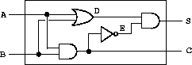
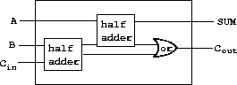
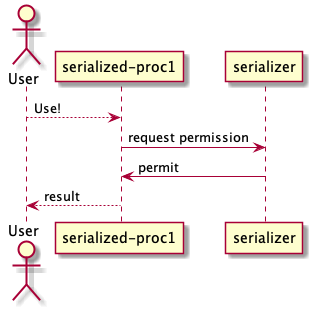

- [Chapter 2: Building Abstractions with Data](#org076efa2)
  - [Hierarchical Data and the Closure Property](#org73cb5d2)
    - [Repersenting Sequences](#org8b9b946)
    - [Hierarchical Structures](#orgc34bf56)
    - [Sequences as Conventional Interfaces](#org9f74639)
    - [Example: A Picture Language](#org8dba49c)
  - [Symbolic Data](#org99c5e06)
    - [Quotation](#org5688567)
    - [Example: Symbolic Differentiation](#orgafd6dad)
    - [Example: Representing Sets](#orgf0e39c3)
    - [Example: Huffman Encoding trees](#org3654998)
    - [Data-Directed Programming and Additivity](#org99b89bf)
    - [Lecture 4A: Pattern Matching and Rule-based Substitution](#orge1e8160)
  - [Systems with Generic Operations](#org55546cf)
    - [Generic Arithmetic Operations](#orgb4c4a03)
    - [Combining Data of Different Types](#org78b1a49)
    - [Example: Symbolic Algebra](#org865f1d0)
- [Chapter 3 Modularity, Objects, and State](#org5861bd4)
  - [Assignment and Local State](#org3325785)
    - [Local State Variables](#org41197a3)
    - [The Benefits of Introducing Assignment](#org8bebb8d)
    - [The Costs of Introducing Assignment](#orgc7e98fb)
  - [Modeling with Mutable Data](#org2e0f37d)
    - [Mutable List Structure](#orgf05f159)
    - [Representing Queues](#org818bb12)
    - [Representing Tables](#org21b23ff)
    - [A Simulator for Digital Circuits](#org73748ce)
    - [Lecture 5B: Computational Objects](#orgc721554)
    - [Propagation of Conlstraints](#org60a5194)
  - [Concurrency: Time Is of the Essence](#orga586b26)
    - [The Nature of Time in Concurrent Systems](#orgea319b0)
    - [Mechanisms for Controlling Concurrency](#org994177f)
  - [Streams](#orgd8fcd4f)
    - [Streams Are Delayed Lists](#orgeccdf07)
    - [Infinite Streams](#orgc8c1a4b)
    - [Exploiting the Stream Paradigm](#org251d786)
    - [Modularity of Functional Programs and Modularity of Objects](#orgc81cb23)
- [Chapter 4: Metalinguistic Abstraction](#org9b1cf77)
  - [The Metacircular Evaluator](#orga62ff99)
    - [The Core of the Evaluator](#org1be7e43)
    - [Representing Expressions](#org46027d4)
    - [Evaluator Data Structures](#org5fa59de)
    - [Running the Evaluator as a Program](#orgde620ff)
    - [Data as Programs](#org99588b0)
    - [Internal Definitions](#org9487f7e)
    - [Separating Syntactic Analysis from Execution](#orgad1ea98)
  - [Variations on a Scheme &#x2013; Lazy Evaluation](#org89c6146)
    - [Normal Order and Applicative Order](#orgd091cc6)
    - [An Interpreter with Lazy Evaluation](#org54dbd80)
  - [Variations on a Scheme &#x2013; Nondeterministic Computing](#orgeccac30)
    - [Amb and Search](#org3b03485)
    - [Examples of Nondeterministic Programs](#orga1e9ed4)
    - [Implementing the `Amb` Evaluator](#orgc16cc6b)
  - [Logic Programming](#org9ec9e5d)
    - [Deductive Information Retrieval](#org9f6e209)
    - [How the Query System Works](#org1d17c14)
    - [Is Logic Programming Mathematical Logic?](#org02169d5)
    - [Implementing the Query System](#orga67e34f)
- [Chapter 5: Computing with Register Machines](#org164fb0e)
  - [Designing Register Machines](#orgf40a450)
    - [A Language for Describing Register Machines](#org62ec7fc)
    - [Abstraction in Machine Design](#org1e1612d)
    - [Subroutines](#orga4a3df5)
    - [Using a Stack to Implement Recursion](#org01586dc)
    - [Instruction Summary](#orgaf908fb)
  - [A Register-Machine Simulator](#org1adab56)
    - [The Machine Model](#orgaa9d546)
    - [The Assembler](#org48ba04d)
    - [Generating Execution Procedures for Instructions](#orgdfef75e)
    - [Monitoring Machine Performance](#org3e3fcbf)
  - [Storage Allocation and Garbage Collection](#orgcbb67b1)
    - [Memory as Vectors](#orgca215ba)
    - [Maintaining the Illusion of Infinite Memory](#org714f70d)
  - [The Explicit-Control Evaluator](#org7a317af)
    - [The Core of the Explicit-Control Evaluator](#org61cac60)
    - [Sequence Evaluation and Tail Recursion](#org2e1ebb8)
    - [Conditionals, Assignments, and Definitions](#orgb6ecc50)
    - [Running the Evaluator](#org017b248)
  - [Compilation](#org5ec8a27)
    - [Structure of the Compiler](#org8e5be9d)
    - [Compiling Expressions](#org4b4bd9c)
    - [Compiling Combinations](#org2c6ca3d)
    - [Combining Instruction Sequences](#orgadd3aa8)
    - [An Example of Compiled Code](#org056a259)
    - [Lexical Addressing](#orgacfd673)
    - [Interfacing Compiled Code to the Evaluator](#org72007c8)


<a id="org076efa2"></a>

# Chapter 2: Building Abstractions with Data


<a id="org73cb5d2"></a>

## Hierarchical Data and the Closure Property


<a id="org8b9b946"></a>

### Repersenting Sequences

-   Does it prints same as list to construct a sequence by conses?  
    
    ```scheme
    (cons 1 (cons 2 (cons 3 (cons 4 '()))))
    ```
    
    ```scheme
    (list 1 2 3 4)
    ```
    
    →Yeah, looks same.

-   Exercise 2.17

    ```scheme
    (define (last-pair items)               ;assume items is non empty list
      (let ((next-p (cdr items)))
        (if (null? next-p)
    	items
    	(last-pair next-p))))
    ```
    
    Let's test with it  
    
    ```scheme
    (last-pair (list 23 72 149 34))
    ```
    
    It works.  

-   Exercise 2.18

    ```scheme
    (define (reverse l)
      (define (iter l r)
        (if (null? l)
    	r
    	(iter (cdr l) (cons (car l) r))))
      (iter l nil))                         ; we don't know what nil is but assume we have
    ```
    
    Or do not use nil explicitly analogous to last-pair.  
    
    ```scheme
    (define (reverse l)                     ;assume that l is not empty
      (let ((next-p (cdr l)))
        (if (null? next-p)
    	l
    	(append (reverse next-p) (list (car l))))))
    (define (append l1 l2)
      (if (null? l1)
          l2
          (cons (car l1) (append (cdr l1) l2))))
    ```

-   Exercise 2.19

    Let's review the change-counting program. We know that the number of  
    change-count can be reduced as follows:  
    
    -   Exchange the change using the first coin and
    -   not using the first coin
    
    The above states the reductive process. To complete the whole process of it, we  
    need to specify the base case:  
    
    -   when the amount is zero, then we have only one way to change.
    
    It is quite tricky at first why this is true; but think it this way: simulate  
    the situation with some simple case,e.g. the amount is 6 cents or like that.  
    Then we come to realize it really need to count as 1 when amount is zero in this  
    recursive process.  
    
    That's not the only base case; by the reductive process we have only two cases left to consider:  
    
    -   when we have 0 coins to change, we count this as 0 and
    -   when we have negative amount to change, there is no way to change the amount; 0.
    
    Again, we can got the guts by simulating the simple cases or more formally we  
    should reason this argument using induction. I think it is reasonable to use the  
    computer aided proof check like this situation because humankind inherited the  
    error-prone property. Nonetheless let's code.  
    
    Then we can code this recursive process:  
    
    ```scheme
    (define us-coins (list 50 25 10 5 1))   ;examples of how the parameter, coin-values, constructed
    (define (cc amount coin-values)
      (cond ((= amount 0) 1)
    	((< amount 0) 0)
    	((no- wjmore? coin-values) 0)         ;↑base cases
    	(else (+ (cc (- amount
    			(first-denomination coin-values)) ;first reduction branch
    		     coin-values)
    		 (cc amount             ;second (last) reduction branch
    		     (except-first-denomination coin-values))))))
    
    (define (no-more? coin-values)
      (null? coin-values)) ;we could (define no-more? null?) but we don't like to mess up the debugger
    
    (define (first-denomination coin-values)
      (car coin-values))                 ;we provided that the coin-values not empty
    
    (define (except-first-denomination coin-values)
      (cdr coin-values))                 ;we provided that the coin-values not empty
    ```
    
    We can reason that the order of the list `coin-values` does not affect the  
    answer produced by cc; it just only takes more times to evaluate it.  
    
    We can assure that by experimenting with some examples:  
    
    ```scheme
    (define us-reverse (reverse us-coins))
    (cc 100 us-reverse)
    (cc 100 us-coins)
    (cc 112 us-reverse)
    (cc 112 us-coins)
    ```
    
    The `us-reverse` results to same as `us-coins`. Why should it be?: The reductive  
    process and base case I've wrote above does not mention about the order of  
    coins; it should behave as same whatever order is.  
    
    Then how about the efficiency (complexity) of space and times? We can guess the  
    reversed order should be more complex than the previous case; but it is not  
    obvious.  
    
    Let's do some trick. While we have not studied the `set!` statement, but it is  
    useful to estimate the complexity and get some intuition about the general case:  
    
    ```scheme
    (define (cc amount coin-values)
      (define (cc-counter amount coin-values)
        (cond ((= amount 0)
    	   (set! count (1+ count))
    	   1)
    	  ((< amount 0)
    	   (set! count (1+ count))
    	   0)
    	  ((no-more? coin-values)
    	   (set! count (1+ count))
    	   0)                           ;↑base cases
    	  (else
    	   (set! count (1+ count))
    	   (+ (cc-counter (- amount
    		     (first-denomination coin-values)) ;first reduction branch
    		  coin-values)
    	      (cc-counter amount                ;second (last) reduction branch
    		  (except-first-denomination coin-values))))))
      (define count 0)                      ;count the steps needed to evaluate cc
      (cons count (cc-counter amount coin-values))) ;return the pair of count and number of cc ways
    ```
    
    Then we can inspect by using that:  
    
    ```scheme
    (cc 100 us-reverse)                     ;=> (38901 . 292)
    (cc 100 us-coins)                       ;=> (15499 . 292)
    ```
    
    Yeah, as we expected, the reversed version needs more than double steps than original.  
    How can we reason this? Let's we do some simulation with simple argument using  
    substitution model. After some experiment, I've realized it is hard to prove  
    that the reversed one has more step complexity than previous in asymptotic notation.  
    To prove that the reversed one has more step & space complextity, we should  
    prove that using inequality sign not asymptotic notation; it will convolve more  
    subtle argument. We should use proof assistant otherwise it become really tricky  
    to prove.  

-   Exercise 2.20

    I've started not to think about the structure. It's the evidence that I've  
    exhausted completely. Anyway here is the code:  
    
    ```scheme
    (define (same-parity first . rest)
      (let ((same? (if (even? first)
    		   even?
    		   odd?)))
        (cons first (filter same? rest))))  ;wishful tinking
    
    (define (filter include? l)
      (if (null? l)
          l
          (let ((hd (car l))                ;it would be clearer if I use the let* notation.
    	    (tl (cdr l)))               ;but I've not learned yet.
    	(let ((filtered
    	       (filter include? tl)))
    	  (if (include? hd)
    	      (cons hd filtered)
    	      filtered)))))
    ```
    
    Isn't this obvious to explain? Anyway, I'll skip that.  

-   Mapping over lists

    ```scheme
    (define (map proc items)
      (if null? items)
      nil
      (cons (proc (car items))
    	(map proc (cdr items))))
    ```

-   Exercise 2.21

    ```scheme
    (define (square-list items)
      (if (null? items)
          nil
          (cons (square (car items) (square-list (cdr items))))))
    
    (define (square-list items)
      (map square items))
    ```

-   Exercise 2.22

    1.  Because the structure of the helper procedure iter is same as our first  
        definition of [reverse](#org943243a).
    2.  List is, by definition, sequence of pairs. But the tried implementation  
        returns something other than list: `(cons answer (square (car things)))` is  
        not chained pairs.

-   Exercise 2.23

    **First try**  
    
    ```scheme
    (define (for-each proc items)
      (if (null? items)                     ;base case
          true                              ;done case (termination)
    .....
    ```
    
    ↑ We can not use if clause for evaluation of sequenced statement.  
    So we should use cond clause instead.  
    
    ```scheme
    (define (for-each proc items)
      (cond ((null? items) true)            ;termination (base) case return true, which can be arbitrary value.
    	(else
    	 (proc (car items))
    	 (for-each proc (cdr items))))
    ```
    
    Let's test it:  
    
    ```scheme
    (for-each (lambda (x) (newline) (display x))
    	  (list 57 321 88))
    ```
    
    Yeah works well.  


<a id="orgc34bf56"></a>

### Hierarchical Structures

Let's implement the `count-leaves`. It should behave like follows:  

```scheme
(define x (cons (list 1 2) (list 3 4)))
(length x)                              ;3
(count-leaves x)                        ;4
(list x x)                              ;(((1 2) 3 4) ((1 2) 3 4))
(length (list x x))                     ;2
(count-leaves (list x x))               ;8
```

The implementation of `count-leaves` is analogous to `length`:  

-   `count-leaves` of the empty list is 0.

But in the reduction step, we should take a count the `car` part:  

-   `count-leaves` of tree `x` is `count-leaves` of the `car` of `x` plus  
    `count-leaves` of the `cdr` of `x`.

After repeatedly apply the reduction step, we reach the another base case:  

-   `count-leaves` of a leaf is 1.

And we can test whether it is leaf by using the primitive predicate `pair?` we  
test whether it is pair or not.  

Then we can complete the procedure:  

```scheme
(define (count-leaves x)
  (cond ((null? x) 0)
	((not (pair? x)) 1)
	(else (+ (count-leaves (car x))
		 (count-leaves (cdr x))))))
```

-   Exercise 2.24

    I've drawn assigned task in Digital Papper.  

-   Exercise 2.25

    1.  `(cadaddr (list 1 3 (list 5 7) 9))` results to 7.  
        The notation `(cadaddr x)` is abbreviation for `(car (cdr (car (cdr (cdr x)))))`.  
        Let we use this notation from this point for the space.
    2.  `(caar (list (list 7)))`.
    3.  `(cadadadadadadr x)`, where `x` is `(1 (2 (3 (4 (5 (6 7))))))`.

-   Exercise 2.26

    1.  `(append x y)` would result to `(1 2 3 4 5 6)`.
    2.  `(cons x y)` would result to `((1 2 3) 4 5 6)`.
    3.  `(list x y)` would result to `((1 2 3) (4 5 6))`.
    
    We can verify those by evaluating:  
    
    ```scheme
    (define x (list 1 2 3))
    (define y (list 4 5 6))
    (append x y)
    (cons x y)
    (list x y)
    ```
    
    Yeah the results are same as above.  

-   Exercise 2.27

    We should implement, so called, `deep-reverse`. It behaves as follows:  
    
    ```scheme
    (define x (list (list 1 2) (list 3 4))) ;((1 2) (3 4))
    (reverse x)                             ;((3 4) (1 2))
    (deep-reverse x)                        ;((4 3) (2 1))
    ```
    
    It is obvious that we should use, so called, tree recursion for it. Or wishful  
    thinking so to say.  
    
    Let's start with reduction step:  
    
    -   We assume that subtrees are *deep reversed*. Then we can complete the whole  
        procedure:  
        
        ```scheme
        (reverse (cons (deep-reverse (car x)) (deep-reverse (cdr x))))
        ```
    -   Then the results are reduced to the subproblem whose argument is subtree of `x`.
    
    There are two base case with which the reduction step end up:  
    
    -   By cdring down the list, we optain nil at the very end.
    -   Or, we could encounter the leaf, not the pair by caring the list.
    
    As consequence, we can complete the procedure analogous to `count-leaves`:  
    
    ```scheme
    (define (deep-reverse x)
      (cond ((null? x) x)
    	((not (pair? x)) x)
    	(else (reverse (cons
    			(deep-reverse (car x))
    			(deep-reverse (cdr x)))))))
    ```

-   Exercise 2.28

    Implement `fringe`. Whose behavior are the followings:  
    
    ```scheme
    (define x (list (list 1 2) (list 3 4)))
    (fringe x)                              ;(1 2 3 4)
    (fringe (list x x))                     ;(1 2 3 4 1 2 3 4)
    ```
    
    The strategy is similar with [above](#orga4bcb27):  
    
    ```scheme
    (define (fringe x)
      (cond ((null? x) x)
    	((not (pair? x)) (list x))
    	(else (append (fringe (car x))
    		      (fringe (cdr x))))))
    ```
    
    Note that we return the singleton list in the case of leaf; it is necessary at  
    the reduction step.  

-   Exercise 2.29

    Here we model the binary mobile, which consists of two branches&#x2013;a left branch  
    and right branch. Each branch is a rod of a certain length, from which hangs  
    either a weight or another binary mobile.  
    
    We can construct it by using `list`:  
    
    ```scheme
    (define (make-mobile left right)
      (list left right))
    ```
    
    A branch is constructed from a `length`, which must be a number, together with a  
    `structure`, which may be either a number&#x2013;a simple weight&#x2013; or another mobile:  
    
    ```scheme
    (define (make-branch length structure)
      (list length structure))
    ```
    
    -   a.
    
        Then we can implement the selectors, namely `left-branch` and `right-branch`:  
        
        ```scheme
        (define (left-branch mobile)
          (car mobile))
        (define (right-branch mobile)
          (cadr mobile))
        ```
        
        And the branch' structure:  
        
        ```scheme
        (define (branch-structure branch)
          (cadr branch))
        ```
    
    -   b.
    
        The procedure that returns weight of mobile, `total-weight`, is similar with  
        above tree recursion processes: <sup><a id="fnr.1" class="footref" href="#fn.1">1</a></sup>  
        
        -   Reduction process:  
            
            ```scheme
            (+ (total-weight (branch-structure (left-branch mobile)))
               (total-weight (branch-structure (right-branch mobile))))
            ```
            
            which end up with
        -   Base case:  
            
            ```scheme
            (if (not (mobile? x)) x)                ;a simple weight case
            ```
            
            And the `mobile?` test whether it is mobile:  
            
            ```scheme
            (define (mobile? x) (pair? x))
            ```
        
        And then we complete the procedure:  
        
        ```scheme
        (define (total-weight mobile)
          (if (not (mobile? mobile))
              mobile
              (+ (total-weight (branch-structure (left-branch mobile)))
        	 (total-weight (branch-structure (right-branch mobile))))))
        ```
    
    -   c. Design the predicate that tests whether a binary mobile is balanced.
    
        Here we also exploit the wishful thinking about the tree structure:  
        
        -   Reduction process:  
            
            ```scheme
            (let ((left (left-branch mobile))
                  (right (right-branch mobile)))
              (let ((mobile-l (branch-structure left))
            	(mobile-r (branch-structure right)))
                (if (and (balanced? mobile-l)
            	     (balanced? mobile-r))
            	(= (* (branch-length left)
            	      (total-weight mobile-l))
            	   (+ (branch-length right)
            	      (total-weight mobile-r)))
            	false)))
            ```
            
            Here we used the `branch-length` whose definition is  
            
            ```scheme
            (define (branch-length branch)
              (car branch))
            ```
            
            Yeah, it's quite dirty; but straight forward. We can revise the if clause as  
            follow:  
            
            ```scheme
            (and (balanced? mobile-l)
                 (balanced? mobile-r)
                 (= (* (branch-length left)
            	      (total-weight mobile-l))
            	   (+ (branch-length right)
            	      (total-weight mobile-r))))
            ```
            
            as the consequence and alternative of if clause are boolean. This end up with
        -   Base case (a simple weight):  
            
            ```scheme
            (if (not (mobile? x)) true)
            ```
            
            which can be reduced to  
            
            ```scheme
            (not (mobile? x))
            ```
        
        The complete code:  
        
        ```scheme
        (define (blanced? mobile)
          (and (not (mobile? mobile))
               (let ((left (left-branch mobile))
        	     (right (right-branch mobile)))
        	 (let ((mobile-l (branch-structure left))
        	       (mobile-r (branch-structure right)))
        	   (and (balanced? mobile-l)
        		(balanced? mobile-r)
        		(= (* (branch-length left)
        		      (total-weight mobile-l))
        		   (+ (branch-length right)
        		      (total-weight mobile-r))))))))
        ```
    
    -   d.
    
        Suppose we change the representation of mobiles so that the constructors are  
        
        ```scheme
        (define (make-mobile left right)
          (cons left right))
        (define (make-branch length structure)
          (cons length structure))
        ```
        
        Then we should change only the followings:  
        
        ```scheme
        (define (right-branch mobile)
          (cdr mobile))
        (define (branch-structure branch)
          (cdr branch))
        ```
        
        Boom! That's it. The power of abstract barrier!  

-   Mapping over trees

    We can define the `scale-tree` procedure analogous to `scale-list` using `map`:  
    
    ```scheme
    (define (scale-tree tree factor)
      (map (lambda (sub-tree)
    	 (if (pair? sub-tree)
    	     (scale-tree sub-tree factor)
    	     (* sub-tree factor)))
           tree))
    ```

-   Exercise 2.30

    Define a procedure `square-tree` analogous to the `square-list` procedure of [exercise 2.21](#org817fec4).  
    That is, `square-tree` should behave as follows:  
    
    ```scheme
    (square-tree
     (list 1
           (list 2 (list 3 4) 5)
           (list 6 7)))                     ;(1 (4 (9 16) 25) (36 49))
    ```
    
    -   Define `square-tree` without higher-order procedures
    
        We can do this by analogy to `scale-tree`:  
        
        ```scheme
        (define (square-tree tree)
          (cond ((null? tree) tree)
        	((not (pair? tree)) (square tree))
        	(else (cons (square-tree (car tree))
        		    (square-tree (cdr tree))))))
        ```
    
    -   Define `square-tree` using `map`
    
        ```scheme
        (define (square-tree tree)
          (map (lambda (sub-tree)
        	 (if (pair? sub-tree)
        	     (square-tree sub-tree)
        	     (square sub-tree)))
               tree))
        ```

-   Exercise 2.31

    Define `tree-map` that behave as follows:  
    
    ```scheme
    (define (square-tree tree) (tree-map square tree))
    ```
    
    It is easy:  
    
    ```scheme
    (define (tree-map proc tree)
      (map (lambda (sub-tree)
    	 (if (pair? sub-tree)
    	     (tree-map proc sub-tree)
    	     (proc sub-tree)))
           tree))
    ```

-   Exercise 2.32

    We can get the whole subsets of `s` by reducing that:  
    
    -   The subsets that include the element `a` of `s` plus
    -   The subsets that do not include the element `a`.
    
    Then we can complete the code:  
    
    ```scheme
    (define (subsets s)
      (if (null? s)
          (list s)
          (let ((rest (subsets (cdr s))))
    	(append rest
    		(map (lambda (subset)
    		       (cons (car s) subset))
    		     rest)))))
    ```


<a id="org9f74639"></a>

### Sequences as Conventional Interfaces

-   Sequence Operations

    The main procedures that complete the signal processing interfaces are  
    followings:  
    
    -   [map](#org34ceda5)
    -   [filter](#org071dd7a)
    -   accumulate  
        
        ```scheme
        (define (accumulate op initial sequence)
          (if (null? sequence)
              initial
              (op (car sequence)
        	  (accumulate op initial (cdr sequence)))))
        ```
    
    All that remains to implement signal-flow diagrams is to enumerate the sequence  
    of elements to be processed. That is, to make signals which processed afterward.  
    
    -   make initial signal; produces list.  
        To enumerate the interval of integers, we can code  
        
        ```scheme
        (define (enumerate-interval low high)
          (if (> low high)
              nil
              (cons low (enumerate-interval (+ low 1) high))))
        ```
        
        For tree, we can transform the tree as follows<sup><a id="fnr.2" class="footref" href="#fn.2">2</a></sup>:  
        
        ```scheme
        (define (enumerate-tree tree)
          (cond ((null? tree) nil)
        	((not (pair? tree)) (list tree))
        	(else (append (enumerate-tree (car tree))
        		      (enumerate-tree (cdr tree))))))
        ```

-   Exercise 2.33

    By comparing the `map` procedure and `accumulate` we can define the `map` as follows:  
    
    ```scheme
    (define (map p sequence)
      (accumulate (lambda (x y) (cons (p x) y))
    	      nil
    	      sequence))
    ```
    
    And the others also can be implemented analogous to above:  
    
    ```scheme
    (define (append seq1 seq2)
      (accumulate cons seq2 seq1))
    (define (length sequence)
      (accumulate (lambda (x y) (1+ y)) 0 sequence))
    ```

-   Exercise 2.34

    Horner's rule.  
    
    ```scheme
    (define (horner-eval x coefficient-sequence)
      (accumulate (lambda (this-coeff higher-terms) (+ this-coeff (* x higher-terms)))
    	      0
    	      coefficient-sequence))
    ;; test
    (horner-eval 2 (list 1 3 0 5 0 1))      ;79
    ```
    
    Actually I've used this in the exercise in [Isabelle](https://github.com/HyunggyuJang/Isabelle).  

-   Exercise 2.35

    We can redefine `count-leaves` from [this](#orgc34bf56) using `accumulate`, which means that we  
    can formulate `count-leaves` as signal processing interface.  
    
    At first, let's try out without lingering over it; just compare those structure  
    and code it appropriately:  
    
    ```scheme
    (define (count-leaves t)
      (accumulate (lambda (x y)
    		(if (not (pair? x))
    		    (1+ y)
    		    (+ (count-leaves x)
    		       y)))
    	      0
    	      t))
    ```
    
    It works; but it is not the one the text wanted: Text want we process the `t`  
    with `map` before feed it to `accumulate`:  
    
    ```scheme
    (define (count-leaves t)
      (accumulate <??> <??> (map <??> <??>)))
    ```
    
    And more, it is no more clear than we did previously; just cramming all of the  
    messy things from `count-leaves` into the `op` of `accumulate`.  
    
    We can do better than that. Let's follow text's intention; but how we get the  
    `count-leaves` coded? As we trying to formulate this as signal processing  
    interface, first we need to processing the input `t` as 'signal'&#x2013;list&#x2013;so that  
    we can use conventional interfaces for this.  
    
    Then the remain is simple:  
    
    ```scheme
    (define (count-leaves t)
      (accumulate + 0 (map (lambda (x) 1)
    		       (enumerate-tree t))))
    ```
    
    Yeah, who even said that we shouldn't use `enumerate-tree` here? I think the  
    intention of this exercise was in that capturing recursive process in signal  
    processing framework. It looks silly when we map all the list items into number  
    `1` like this; but it will compensate someday I think. Whatever, let's move on.  

-   Exercise 2.36

    The generalized version of `accumulate`, `accumulate-n` deal with sequence of  
    sequences that all have same number of elements. The behavior is as follows:  
    
    ```scheme
    (accumulate-n + 0 (list (list 1 2 3) (list 4 5 6) (list 7 8 9) (list 10 11 12)))
    ;(22 26 30)
    ```
    
    Here we use wishful thinking as usual:  
    
    -   Reduction process:  
        Let we assume that we were given the results of  
        `accumulate-n` with sequence of sequences except the first element of each.  
        Then we can complete the process by `accumulate` the first element of each and  
        then consing it with the given:  
        
        ```scheme
        (cons (accumulate op init (map car seqs))
              (accumulate-n op init (map cdr seqs)))
        ```
        
        After repeatedly applying this process we get
    -   Base case:  
        we end up with sequence of `nil`:  
        
        ```scheme
        (if (null? (car seqs))
            (car seqs))
        ```
        
        This is the only base case because `nil` is not the sequence of sequences.
    
    Then the complete code can be synthesized as usual:  
    
    ```scheme
    (define (accumulate-n op init seqs)
      (if (null? (car seqs))
          (car seqs)
          (cons (accumulate op init (map car seqs))
    	    (accumulate-n op init (map cdr seqs)))))
    ```

-   Exercise 2.37

    From now on, I'll pace up because I've already designed the strucutre of these  
    exercises on my note.  
    
    ```scheme
    (define (dot-product v w)
      (accumulate + 0 (map * v w)))
    (define (matrix-*-vector m v)
      (map (lambda (m_i) (dot-product m_i u))
           m))
    (define (transpose mat)
      (accumulate-n cons '() mat))
    (define (matrix-*-matrix m n)
      (let ((cols (transpose n)))
        (map (lambda (m_i)
    	   (matrix-*-vector cols m_i))
    	 m)))
    ```

-   Exercise 2.38

    To get equal value from both `fold-right` and `fold-left`, `op` should satisfy  
    the associative law of algebra and also commutative law with repect to `init`.  

-   Exercise 2.39

    ```scheme
    (define (snoc x y)
      (append y (list x)))
    (define (reverse sequence)
      (fold-right (lambda (x y)
    		(snoc x y))
    	      '()
    	      sequence))
    (define (reverse sequence)
      (fold-left (lambda (x y)
    	       (cons y x))
    	     '()
    	     sequence))
    ```

-   Exercise 2.40

    ```scheme
    (define (flatmap proc seq)
      (accumulate append '() (map proc seq)))
    (define (unique-pairs n)
      (flatmap
       (lambda (i)
         (map (lambda (j) (list i j))
    	  (enumerate-interval 1 (- i 1))))
       (enumerate-interval 1 n)))
    ```

-   Exercise 2.41

    ```scheme
    (define (triple-sum-to-s n s)
      (filter (lambda (triple)
    	    (= s (fold-right + 0 triple)))
    	  (flatmap (lambda (k)
    		     (map (lambda (p)
    			    (snoc k p))
    			  (unique-pairs (- k 1))))
    		   (enumerate-interval 1 n))))
    ```

-   Exercise 2.42

    ```scheme
    (define (queens board-size)
      (define (queen-cols k)
        (if (= k 0)
    	(list empty-board)
    	(filter
    	 (lambda (positions) (safe? k positions))
    	 (flatmap
    	  (lambda (rest-of-queens)
    	    (map (lambda (new-row)
    		   (adjoin-position new-row k rest-of-queens))
    		 (enumerate-interval i board-size)))
    	  (queen-cols (- k 1))))))
      (queen-cols board-size))
    
    (define empty-board '())
    
    (define (adjoin-position new-row k rest-of-queens)
      (cons new-row rest-of-queens))
    
    (define (safe? k positions)
      (define (equal-not-to? nr rest)
        (or (null? rest)
    	(and (not (= nr (car rest)))
    	     (equal-not-to? nr (cdr rest)))))
      (define (pm-i-not-equal-to? nr i rest)
        (or (null? rest)
    	(and (not (or (= (+ nr i) (car rest))
    		      (= (- nr i) (car rest))))
    	     (pm-i-not-equal-to? nr (1+ i) (cdr rest)))))
      (let ((new-row (car positions))
    	(rest-queens (cdr positions)))
        (and (equal-not-to? new-row rest-queens) ;provided that positions not empty
    	 (pm-i-not-equal-to? new-row 1 rest-queens))))
    ```
    
    Note that here we didn't use the parameter `k` none of helper procedures&#x2013;  
    `adjoin-position` and `safe?` &#x2013; because we don't need to; I've thought it is  
    natural to think *the first k-1 columns* as counted from the rightmost.  
    
        #<unspecified>

-   Exercise 2.43

    Because by exchange the order of `flatmap` and `map` in the procedure  
    `queen-cols` now the procedure call `(queen-cols (- k 1))` become evaluated  
    duplicately every `new-row` of `(enumerate-interval 1 board-size)`, i.e  
    `board-size` times.  
    
    We can reason the asymptotic time complexity of both cases:  
    
    -   The original one is &theta;(n<sup>3</sup>)
    -   The troubled one is &theta;(n<sup>n</sup>)
    
    Here we used the n as `board-size`. As consequence, when `board-size` is 8 and  
    let the time taken by original one *T*, then the Louis's one takes approximately  
    more than 8<sup>5</sup> &times; *T*.  


<a id="org8dba49c"></a>

### Example: A Picture Language

-   The picture language

    -   Primitives: *painter*
    -   Means of combination: `beside`, `below`  
        -   Create new painter from existing one: `filp-vert`, `flip-horiz`
    -   Means of abstraction: `define` in scheme language; As means of combination are  
        all procedure in scheme, we can abstract them like any other procedure in scheme.
    
    The results of combination of painter are also painters; by this closure  
    property with scheme's picture language inherit closure property in complete  
    sense.  
    
    I've tried to configure the picture language framework in mit-scheme; but to no vail.  
    I've searched the github of mit-scheme, which has the directory named "6001"  
    that contains `6001.pkg`; to use that package, I've read the relevant content of  
    MIT scheme's user manual, also to no use; I've complied it with `sf` method in  
    edwin editor&#x2013;this package depends on the edwin package, so I have no choice to  
    use emacs in this case&#x2013;, and I found myself it is useless I need to put more  
    time in configuration than solving the exercises. The easiest alternative was to  
    use racket's sicp package, which I knew but have stuck with using **pure**  
    mit-scheme as I felt it is more canonical. Well, whatever, I've given up with  
    that; let's go with racket.  

-   Exercise 2.44

    We can define `up-split` analogous to `right-split`.  
    
    ```scheme
    (define (up-split painter n)
      (if (= n 0)
          painter
          (let ((smaller (up-split painter (- n 1))))
    	(below painter (beside smaller smaller)))))
    ```

-   Exercise 2.45

    We can easily abstract this by higher order function:  
    
    ```scheme
    (define (split tran1 tran2)
      (lambda (painter n)
        (if (= n 0)
    	painter
    	(let ((smaller ((split tran1 tran2) painter (- n 1))))
    	  (tran1 painter (tran2 smaller smaller))))))
    ```

-   Exercise 2.46

    Note that I implement `sub-vect` using the `scale-vect` and `add-vect`; it is  
    subtle matter but I thought this definition is more canonical in algebraical  
    sense:  
    
    ```scheme
    (define (make-vect x y)
      (cons x y))
    
    (define (xcor-vect v)
      (car v))
    
    (define (ycor-vect v)
      (cdr v))
    
    (define (add-vect v1 v2)
      (make-vect (+ (xcor-vect v1)
    		(xcor-vect v2))
    	     (+ (ycor-vect v1)
    		(ycor-vect v2))))
    (define (scale-vect s v)
      (make-vect (* (xcor-vect v) s)
    	     (* (ycor-vect v) s)))
    (define (sub-vect v1 v2)
      (add-vect v1 (scale-vect -1 v2)))
    ```

-   Exercise 2.47

    For first representation, we can implement selectors accordingly:  
    
    ```scheme
    (define (origin-frame f)
      (car f))
    (define (edge1-frame f)
      (cadr f))
    (define (edge2-frame f)
      (caddr f))
    ```
    
    For the latter, similarly:  
    
    ```scheme
    (define (origin-frame f)
      (car f))
    (define (edge1-frame f)
      (cadr f))
    (define (edge2-frame f)
      (cddr f))
    ```

-   Exercise 2.48

    Didn't we solved this in exercise 2.2? In there, we made segment using points  
    not vector but the representation axiom is same in both; we can reuse that  
    definiiton:  
    
    ```scheme
    ;; Constructor make-segment
    (define (make-segment start-pt end-pt)
      (cons start-pt end-pt))
    ;; Selector start-segment
    (define (start-segment segment)
      (car segment))
    ;; Selector end-segment
    (define (end-segment segment)
      (cdr segment))
    ```

-   Exercise 2.49

    -   a.
    
        The painter that draws the outline of the designated frame.  
        
        ```scheme
        (define outliner
          (let ((o (make-vect 0 0))
        	(br (make-vect 1 0))
        	(tr (make-vect 1 1))
        	(tl (make-vect 0 1)))
            (segments->painter (list (make-segment o br)
        			     (make-segment br tr)
        			     (make-segment tr tl)
        			     (make-segment tl o)))))
        ```
    
    -   b.
    
        The painter that draws an "X" by connecting opposite corners of the frame.  
        
        ```scheme
        (define x-liner
          (let ((o (make-vect 0 0))
        	(br (make-vect 1 0))
        	(tr (make-vect 1 1))
        	(tl (make-vect 0 1)))
            (segments->painter (list (make-segment o tr)
        			     (make-segment br tl)))))
        ```
    
    -   c.
    
        The painter that draws a diamond shape by connecting the midpoints of the sides  
        of the frame.  
        
        ```scheme
        (define dia-liner
          (let ((o (make-vect 0 0))
        	(br (make-vect 1 0))
        	(tr (make-vect 1 1))
        	(tl (make-vect 0 1)))
            (let ((left (scale-vect 0.5 tl))
        	  (bottom (scale-vect 0.5 br)))
              (let ((right (add-vect br left))
        	    (top (add-vect tl bottom)))
        	(segments->painter (list (make-segment left top)
        				 (make-segment top right)
        				 (make-segment right bottom)
        				 (make-segment bottom left)))))))
        ```
    
    -   DONE d.
    
        The wave painter.  
        
        ```scheme
        (define wave
          (let ((lhl (make-vect 0 0.65))         ;left hand
        	(lhh (make-vect 0 0.8))
        	(rhh (make-vect 1 0.35))
        	(rhl (make-vect 1 0.2))
        	(lal (make-vect 0.24 0.45))     ;left arm joint
        	(lah (make-vect 0.24 0.6))
        	(lsl (make-vect 0.4 0.6))       ;left shoulder
        	(lsh (make-vect 0.4 0.65))
        	(ln (make-vect 0.45 0.65))
        	(rn (make-vect 0.55 0.65))
        	(rs (make-vect 0.6 0.65))
        	(lfa (make-vect 0.43 0.8))
        	(rfa (make-vect 0.57 0.8))
        	(lh (make-vect 0.45 1))
        	(rh (make-vect 0.55 1))
        	(lv (make-vect 0.43 0.55))
        	(rv (make-vect 0.57 0.55))
        	(lfo (make-vect 0.3 0))
        	(rfo (make-vect 0.7 0))
        	(lfo1 (make-vect 0.4 0))
        	(rfo1 (make-vect 0.6 0))
        	(cl (make-vect 0.5 0.3)))
            (segments->painter (list (make-segment lhh lah)
        			     (make-segment lah lsh)
        			     (make-segment lsh ln)
        			     (make-segment ln lfa)
        			     (make-segment lfa lh) ;from left hand high to left head
        			     (make-segment lhl lal)
        			     (make-segment lal lsl)
        			     (make-segment lsl lv)
        			     (make-segment lv lfo) ;from left hand low to left foot
        			     (make-segment lfo1 cl)
        			     (make-segment cl rfo1) ;from left foot1 to right foot1
        			     (make-segment rfo rv)
        			     (make-segment rv rhl) ;from left foot to right hand low
        			     (make-segment rhh rs)
        			     (make-segment rs rn)
        			     (make-segment rn rfa)
        			     (make-segment rfa rh)))        ;from left hand high left head
            ))
        ```

-   Transforming and combining painters

    As we noted in the introductive session of this section, the combinators created  
    new painter element using the existing ones. Now we implement the combinators  
    using more general procedure, `transform-painter`:  
    
    ```scheme
    (define (transform-painter painter origin corner1 corner2)
      (lambda (frame)
        (let ((m (frame-coord-map frame)))
          (let ((new-origin (m origin)))
    	(painter
    	 (make-frame new-origin
    		     (sub-vect (m corner1) new-origin)
    		     (sub-vect (m corner2) new-origin)))))))
    ```
    
    Here we exploit the fact that `painter` is actually just procedure, which takes  
    `frame` for its arguemnt, so to transform the `painter` all we need to do is  
    transform the `frame` appropriately. Also note that we could have chosen `edge1`  
    and `edge2` for transformation instead `corner1` and `corner2`; we just found  
    from the use case it is more convenient.  
    
    Then we can implement a lot of combinators:  
    
    -   `filp-vert`  
        
        ```scheme
        (define (flip-vert painter)
          (transform-painter painter
        		     (make-vect 0.0 0.0)
        		     (make-vect 1.0 1.0)
        		     (make-vect 0.0 0.0)))
        ```
    -   We can also shrink the frame:  
        
        ```scheme
        (define (shrink-to-upper-right painter)
          (transform-painter painter
        		     (make-vect 0.5 0.5)
        		     (make-vect 1.0 0.5)
        		     (make-vect 0.5 1.0)))
        ```
    -   Also we can rotate the frame:  
        
        ```scheme
        (define (rotate90 painter)
          (transform-painter painter
        		     (make-vect 1.0 0.0)
        		     (make-vect 1.0 1.0)
        		     (make-vect 0.0 0.0)))
        ```
    -   We can combine two or more paitners  
        
        ```scheme
        (define (beside painter1 painter2)
          (let ((split-point (make-vect 0.5 0.0)))
            (let ((paint-left
        	   (transform-painter painter1
        			      (make-vect 0.0 0.0)
        			      split-point
        			      (make-point 0.0 1.0)))
        	  (paint-right
        	   (transform-painter painter2
        			      split-point
        			      (make-vect 1.0 0.0)
        			      (make-vect 0.5 1.0))))
              (lambda (frame)
        	(paint-left frame)
        	(paint-right frame)))))
        ```

-   Exercise 2.50

    We can define `flip-horiz` analogous to `flip-vert`:  
    
    ```scheme
    (define (flip-horiz painter)
      (transform-painter painter
    		     (make-vect 1.0 0.0) ;new origin
    		     (make-vect 0.0 0.0) ;new end of edge1
    		     (make-vect 0.0 1.0))) ;new end of edge2
    ```
    
    We can define rotating frames in either way, using `rotate90` or directly:  
    
    -   Using `rotate90`:  
        
        ```scheme
        (define (rotate180 painter)
          (rotate90 (rotate90 painter)))
        (define (rotate270 painter)
          (rotate90 (rotate180 painter)))
        ```
    -   define directly:  
        
        ```scheme
        (define (rotate180 painter)
          (transform-painter painter
        		     (make-vect 1.0 1.0)
        		     (make-vect 0.0 1.0)
        		     (make-vect 1.0 0.0)))
        (define (rotate270 painter)
          (transform-painter painter
        		     (make-vect 0.0 1.0)
        		     (make-vect 0.0 0.0)
        		     (make-vect 1.0 1.0)))
        ```

-   Exercise 2.51

    -   Define `below` analogous to `beside`:  
        
        ```scheme
        (define (below painter1 painter2)
          (let ((split-point (make-vect 0.0 0.5)))
            (let ((paint-bottom
        	   (transform-painter painter1
        			      (make-vect 0.0 0.0)
        			      (make-point 1.0 0.0)
        			      split-point))
        	  (paint-top
        	   (transform-painter painter2
        			      split-point
        			      (make-vect 1.0 0.5)
        			      (make-vect 0.0 1.0))))
              (lambda (frame)
        	(paint-bottom frame)
        	(paint-top frame)))))
        ```
    -   Using `beside`:  
        
        ```scheme
        (define (below painter1 painter2)
          (rotate270 (beside (rotate90 painter2)
        		     (rotate90 painter1))))
        ```

-   Exercise 2.52

    -   a.
    
        Let's add some smile to our `wave`:  
        
        ```scheme
        (define wave
          (let ((lhl (make-vect 0 0.65))         ;left hand
        	(lhh (make-vect 0 0.8))
        	(rhh (make-vect 1 0.35))
        	(rhl (make-vect 1 0.2))
        	(lal (make-vect 0.24 0.45))     ;left arm joint
        	(lah (make-vect 0.24 0.6))
        	(lsl (make-vect 0.4 0.6))       ;left shoulder
        	(lsh (make-vect 0.4 0.65))
        	(ln (make-vect 0.45 0.65))
        	(rn (make-vect 0.55 0.65))
        	(lm (make-vect 0.48 0.77))      ;smile~
        	(rm (make-vect 0.52 0.77))
        	(cm (make-vect 0.5 0.75))
        	(rs (make-vect 0.6 0.65))
        	(lfa (make-vect 0.43 0.8))
        	(rfa (make-vect 0.57 0.8))
        	(lh (make-vect 0.45 1))
        	(rh (make-vect 0.55 1))
        	(lv (make-vect 0.43 0.55))
        	(rv (make-vect 0.57 0.55))
        	(lfo (make-vect 0.3 0))
        	(rfo (make-vect 0.7 0))
        	(lfo1 (make-vect 0.4 0))
        	(rfo1 (make-vect 0.6 0))
        	(cl (make-vect 0.5 0.3)))
            (segments->painter (list (make-segment lhh lah)
        			     (make-segment lah lsh)
        			     (make-segment lsh ln)
        			     (make-segment ln lfa)
        			     (make-segment lfa lh) ;from left hand high to left head
        			     (make-segment lhl lal)
        			     (make-segment lal lsl)
        			     (make-segment lsl lv)
        			     (make-segment lv lfo) ;from left hand low to left foot
        			     (make-segment lfo1 cl)
        			     (make-segment cl rfo1) ;from left foot1 to right foot1
        			     (make-segment rfo rv)
        			     (make-segment rv rhl) ;from left foot to right hand low
        			     (make-segment rhh rs)
        			     (make-segment rs rn)
        			     (make-segment rn rfa)
        			     (make-segment rfa rh) ;from left hand high left head
        			     (make-segment lm cm)
        			     (make-segment cm rm))) ;smile~
            ))
        ```
    
    -   b.
    
        Change `corner-split` using only one copy of the `up-split` and `right-split`:  
        
        ```scheme
        (define (corner-split painter n)
          (if (= n 0)
              painter
              (let ((up (up-split painter (- n 1)))
        	    (right (right-split painter (- n 1))))
        	(let ((top-left up)
        	      (bottom-right right))
        	  (beside (below painter top-left)
        		  (below bottom-right (corner-split painter (- n 1))))))))
        ```
    
    -   c.
    
        Modify `square-limit` so that the big Mr. Rogers look outward from each corner  
        of the square:  
        
        ```scheme
        (define (squre-limit painter n)
          (let ((combine4 (square-of-four flip-vert
        				  rotate180
        				  identity
        				  flip-horiz)))))
        ```

-   Resulting Pictures

    ```racket
    #lang racket
    (require sicp-pict)
    (define/contract wave
      (listof segment?)
      (let ((lhl (make-vect 0 0.65))         ;left hand
    	(lhh (make-vect 0 0.8))
    	(rhh (make-vect 1 0.35))
    	(rhl (make-vect 1 0.2))
    	(lal (make-vect 0.24 0.45))     ;left arm joint
    	(lah (make-vect 0.24 0.6))
    	(lsl (make-vect 0.4 0.6))       ;left shoulder
    	(lsh (make-vect 0.4 0.65))
    	(ln (make-vect 0.45 0.65))
    	(rn (make-vect 0.55 0.65))
    	(rs (make-vect 0.6 0.65))
    	(lm (make-vect 0.48 0.77))      ;smile~
    	(rm (make-vect 0.52 0.77))
    	(cm (make-vect 0.5 0.75))
    	(lfa (make-vect 0.43 0.8))
    	(rfa (make-vect 0.57 0.8))
    	(lh (make-vect 0.45 1))
    	(rh (make-vect 0.55 1))
    	(lv (make-vect 0.43 0.55))
    	(rv (make-vect 0.57 0.55))
    	(lfo (make-vect 0.3 0))
    	(rfo (make-vect 0.7 0))
    	(lfo1 (make-vect 0.4 0))
    	(rfo1 (make-vect 0.6 0))
    	(cl (make-vect 0.5 0.3)))
        (list (make-segment lhh lah)
    	  (make-segment lah lsh)
    	  (make-segment lsh ln)
    	  (make-segment ln lfa)
    	  (make-segment lfa lh)         ;from left hand high to left head
    	  (make-segment lhl lal)
    	  (make-segment lal lsl)
    	  (make-segment lsl lv)
    	  (make-segment lv lfo)         ;from left hand low to left foot
    	  (make-segment lfo1 cl)
    	  (make-segment cl rfo1)        ;from left foot1 to right foot1
    	  (make-segment rfo rv)
    	  (make-segment rv rhl)         ;from left foot to right hand low
    	  (make-segment rhh rs)
    	  (make-segment rs rn)
    	  (make-segment rn rfa)
    	  (make-segment rfa rh)         ;from left hand high left head
    	  (make-segment lm cm)
    	  (make-segment cm rm))         ;smile~
        ))
    (define wave-p (segments->painter wave))
    (paint wave-p)
    ```


<a id="org99c5e06"></a>

## Symbolic Data


<a id="org5688567"></a>

### Quotation

-   Exercise 2.53

    This is easy stuff to get familized with quote notation  
    
    ```scheme
    (list 'a 'b 'c)                         ;(a b c)
    (list (list 'george))                   ;((george))
    (cdr '((x1 x2) (y1 y2)))                ;((y1 y2))
    (pair? (car '(a short list)))           ;#f
    (memq 'red '((red shoes) (blue socks))) ;#f
    (memq 'red '(red shoes blue socks))     ;(red shoes blue socks)
    ```

-   Exercise 2.54

    We can think `equal?` procedure as two independent unit:  
    
    -   check if two arguments are symbols&#x2013;not list and if it is then delegate to `eq?`.
    -   otherwise, it means both are list; delegate this to another helper procedure  
        `eqList?`.
    
    Here we used our old strategy wishful thinking: We haven't `eqList?`; we defered  
    to implement it.  
    
    ```scheme
    (define (equal? s1 s2)
      (or (and (symbol? s1)
    	   (symbol? s2)
    	   (eq? s1 s2))
          (eqList? s1 s2)))
    ```
    
    Then we should implement `eqList?`. We can design it using the type constrains,  
    of which Standard ML is good at:  
    
    ```sml
    fun eqList [] [] = true
      | eqList _ [] = false
      | eqList [] _ = false
      | eqList (x::xs) (y::ys) = (eq x y) andalso (eqList xs ys);
    ```
    
    We can translate to scheme easily:  
    
    ```scheme
    (define (eqList? xs ys)
      (cond ((and (null? xs) (null? ys))
    	 true)
    	((and (not (null? xs)) (null? ys))
    	 false)
    	((and (null? xs) (not (null? ys))) ;base case
    	 false)
    	(else (and (eq? (car xs) (car ys)) ;recursive case
    		   (eqList? (cdr xs) (cdr ys))))))
    ```

-   Exercise 2.55

    Because `'...` is just syntatic sugar for `(quote ...)`. So it is same as  
    `(quote (quote ...))`. That is, as inner parts of the outermost `quote` are  
    treated symbolically, `(car (quote ...))` is `quote`. There is no surprise here.  


<a id="orgafd6dad"></a>

### Example: Symbolic Differentiation

By allowing the symbolic notation in our language, we can cope with algebraic  
manipulation symbolically. For simplicity, here we consider only simple  
differentiation rules:  

-   \(\frac{dc}{dx} = 0\) for \(c\) a constant or a variable different from \(x\)
-   \(\frac{dx}{dx} = 1\)
-   \(\frac{\left( u + v \right)}{dx} = \frac{du}{dx} + \frac{dv}{dx}\)
-   \(\frac{\left( uv \right)}{dx} = u \left( \frac{dv}{dx} \right) + v \left(
      \frac{du}{dx} \right)\)

Here we delegate implementing of representation of symbolic differentiation  
system by using wishful thinking: We just need specify what we want.  

First let's try to code `deriv` that calculate the derivative of given  
expression with respect to `var` along with differentiation rules:  

```scheme
(define (deriv exp var)
  (cond ((number? exp) 0)
	((variable? exp)
	 (if (same-variable exp var) 1 0))
	((sum? exp)
	 (make-sum (deriv (addend exp) var)
		   (deriv (augend exp) var)))
	((product? exp)
	 (make-sum
	  (make-product (multiplicand exp)
			(deriv (multiplier exp) var))
	  (make-product (deriv (multiplicand exp) var)
			(multiplier exp))))
	(else
	 (error "unknown expression type -- DERIV" exp))))
```

Note that we *just* used all the procedure that we need without implementing  
that. Also note that this `deriv` procedure coded directly the differential  
rules from calculus.  

Can we represent the expression that we used in `deriv`? Yes sure!  

```scheme
(define (variable? x) (symbol? x))
(define (same-variable? v1 v2)
  (and (symbol? v1) (symbol? v2) (eq? v1 v2)))
(define (make-sum a1 a2)
  (list '+ a1 a2))
(define (make-product m1 m2)
  (list '* m1 m2))
(define (sum? s)
  (and (pair? s) (eq? (car s) '+)))
(define (addend s) (cadr s))
(define (augend s) (caddr s))
(define (product? p)
  (and (pair? p) (eq? (car p) '*)))
(define (multiplier p) (cadr p))
(define (multiplicand P) (caddr p))
```

Here we embedded the symbolic expression analogous to lisp's compound  
expression&#x2013;prefix notation.  

Let's test this:  

```scheme
(deriv '(+ x 3) 'x)                     ;(+ 1 0)
(deriv '(* x y) 'x)                     ;(+ (* x 0) (* 1 y))
(deriv '(* (* x y) (+ x 3)) 'x)         ;(+ (* (+ x 3) (+ (* y 1) (* 0 x))) (* (+ 1 0) (* x y)))
```

Is what we expected? Well, yes and no: The program produces answer that are  
correct with respect with the differentiation rules; but it is so verbose. We  
need some simplifying steps; we can accomplish this using the analogy to  
rational number arithmetic system; we don't need to alter the `deriv` procedure,  
which uses the constructors and selectors&#x2013;the lower lever of language.  

Let's specify what we exactly expect from the simplification:  

-   For multiplication  
    -   \(x \times 0 = 0\)
    -   \(y \times 1 = y\)
-   For summation  
    -   \(x + 0 = 0\)

Also we want to fold the constants:  
If the two argument of symbolic operation are both number than we calculate  
appropriately, i.e.  

-   `('+ 5 4)` should be simplified to `9`
-   `('* 5 4)` should be simplified to `20`

Then we can implement this by amending the low level language.  

```scheme
(define (make-sum a1 a2)
  (cond ((=number? a1 0) a2)
	((=number? a2 0) a1)
	((and (number? a1) (number? a2)) (+ a1 a2))
	(else (list '+ a1 a2))))
(define (=number? s n)
  (and (number? s) (= s n)))
(define (make-product m1 m2)
  (cond ((or (=number? m1 0) (=number? m2 0)) 0)
	((=number? m1 1) m2)
	((=number? m2 1) m1)
	((and (number? m1) (number? m2))
	 (* m1 m2))
	(else (list '* m1 m2))))
```

-   Exercise 2.56

    Add the exponentiation to our symbolic algebraic system.  
    Our differentiation system become  
    
    ```scheme
    (define (deriv exp var)
      (cond ((number? exp) 0)
    	((variable? exp)
    	 (if (same-variable? exp var) 1 0))
    	((sum? exp)
    	 (make-sum (deriv (addend exp) var)
    		   (deriv (augend exp) var)))
    	((product? exp)
    	 (make-sum
    	  (make-product (multiplicand exp)
    			(deriv (multiplier exp) var))
    	  (make-product (deriv (multiplicand exp) var)
    			(multiplier exp))))
    	((exponentiation? exp)
    	 (make-product (make-product (exponent exp)
    				     (make-exponentiation (base exp) (- (exponent exp) 1)))
    		       (deriv (base exp) var)))
    	(else
    	 (error "unknown expression type -- DERIV" exp))))
    ```
    
    with the representation  
    
    ```scheme
    (define (make-exponentiation base exponent)
      (cond ((=number? exponent 0) 1)
    	((=number? exponent 1) base)
    	((and (number? base) (number? exponent))
    	 (expt base exponent))
    	(else (list '** base exponent))))
    
    (define (exponentiation? e)
      (and (pair? e) (eq? (car e) '**)))
    
    (define (base ex)
      (cadr ex))
    
    (define (exponent ex)
      (caddr ex))
    ```
    
    Let's test it:  
    
    -   The normal differentiation:  
        
        ```scheme
        (deriv '(** x 5) 'x)                    ;(* 5 (** x 4))
        ```
    -   Check if it simplify appropriately:  
        
        ```scheme
        (deriv '(** x 2) 'x)                    ;(* 2 x)
        ```

-   Exercise 2.57

    Extend our program to handle sums and product of arbitrary numbers (two or more)  
    of terms; e.g.  
    
    -   our last example of test, `(deriv '(* (* x y) (+ x 3)) 'x)`, can be expressed  
        as `(deriv '(* x y (+ x 3)) 'x)`.
    
    Just amending the lower level of language&#x2013;constructors and selectors.  
    Note that the differential rules&#x2013; `deriv`&#x2013; doesn't assume that the \(v\) is just  
    symbol; if we can recognize the \(v\) part appropriately, we are done.  
    
    Here is the idea:  
    \[\frac{d\left[ u + \left( v + w + \cdots \right) \right]}{dx} = \frac{du}{dx} +
    \frac{d\left( v + w + \cdots \right)}{dx}\]  
    That is, if we can amend `(augend exp)` to return `(+ v w ...)` then we complete  
    our mission.  
    
    We can code it directly:  
    
    ```scheme
    (define (augend s)
    ;; provided that s has more than two number of terms
      (if (null? (cdddr s))
          (caddr s)                         ;it has exactly two terms addend augend.
          (cons '+ (cddr s))))              ;it has more than that
    ```
    
    Similarly,  
    
    ```scheme
    (define (multiplicand m)
    ;; provided that s has more than two number of terms
      (if (null? (cdddr m))
          (caddr m)                         ;it has exactly two terms.
          (cons '* (cddr m))))              ;it has more than that
    ```
    
    We don't need to fix any of the constructors. We don't like to fix any so that  
    our construct afford to make expression with arbitrary terms; that only make  
    things more complicate.  

-   Exercise 2.58

    The mathematicians want to use infix form instead of prefix form like lisp  
    expression. Suppose we have to program our differentiation procedure for such  
    mathematicians; i.e. we have to modify our differentiation program so that it  
    works with ordinary mathematical notation&#x2013;infix form.  
    
    -   a. binary infix form
    
        Here we consider the infix operator accept only two terms, i.e. binary infix  
        operator. By experimenting with some examples, we can conclude that in the  
        correct syntax form of expression, the operator should position at `cadr` of it.  
        
        Then we can accomplish it by coding that observation:  
        
        ```scheme
        (define (sum? iexp)
          (and (pair? iexp)
               (pair? (cdr iexp))
               (eq? (cadr iexp) '+)))
        ```
        
        Here we used `pair?` twice to assure it will not raise exception when we call  
        `(cadr iexp)`. It is necessary not to raise exception because the caller of  
        `sum?` doesn't know and doesn't need to know the gross detail like whether  
        `iexp` satisfy the constraint of representation of `sum`; they doesn't need to  
        know the representation of those.  
        
        Likewise,  
        
        ```scheme
        (define (product? iexp)
          (and (pair? iexp)
               (pair? (cdr iexp))
               (eq? (cadr iexp) '*)))
        ```
        
        The selectors can be expressed as follows  
        
        ```scheme
        (define (addend is) (car is))
        (define (augend is) (caddr is))
        (define (multiplier im) (car im))
        (define (multiplicand im) (caddr im))
        ```
        
        Similarly, the constructors represented as  
        
        ```scheme
        (define (make-sum a1 a2)
          (cond ((=number? a1 0) a2)
        	((=number? a2 0) a1)
        	((and (number? a1) (number? a2)) (+ a1 a2)) ;↑ simplification
        	(else (list a1 '+ a2))))
        
        (define (make-product m1 m2)
          (cond ((or (=number? m1 0) (=number? m2 0)) 0)
        	((=number? m1 1) m2)
        	((=number? m2 1) m1)
        	((and (number? m1) (number? m2)) ;↑ simplification
        	 (* m1 m2))
        	(else (list m1 '* m2))))
        ```
        
        The test works well:  
        
        ```scheme
        (deriv '((x * 5) + (y + 4)) 'x)         ;5
        ```
    
    -   b. Standard algebraic notation
    
        Now we want to deal with more general case, standard algebraic notation, e.g.  
        `(x + 3 * (x + y + 2))`, which drops unnecessary parentheses and assumes that  
        multiplication is done before addition, i.e. multiplication has higher  
        precedence than addition.  
        
        To simplify the task, we develop new language, that is, the semantics of  
        standard algebraic notation. We can be rephrased as add new layer under the  
        representation; or to layer out between semantics and syntax.  
        
        First let's experiment with some examples:  
        `((x + y) * 5 * z)`, `(x * y + (z + y) * 5)`  
        
        We can reconstruct using tree representation. Unfortunately I myself don't know  
        yet how to print the tree figure here<sup><a id="fnr.3" class="footref" href="#fn.3">3</a></sup>; so I've drew these in my personal  
        note. Well, anyway there is one way to represent the tree structure in text:  
        Lisp! As said in text or lecture of SICP, we can represent the tree as list!  
        If we do that now, we obtain following results:  
        
        -   `(* (+ x y) 5 z)` or `(* (+ x y) (* 5 z))`
        -   `(+ (* x y) (* (+ z y) 5))`
        
        Note that in the first example we can represent in both, binary tree or tree  
        with arbitrary branches. Also note that this situation exactly match with the  
        previous exercise, [ex 2.57](#org1416a7d).  
        
        Consequently, all we need to do is to convert infix form to prefix form allowed  
        to have arbitrary number of terms; the rest would be handled by ex 2.57 as said.  
        
        Then how? Again by wishful thinking assume that all the subtrees are constructed  
        appropriately. Let's try out.  
        
        If `(car exp)` is compound data, then delegate it to subtree constructor and  
        also we know that if it is correct infix form the `(cadr exp)` is  
        operator<sup><a id="fnr.4" class="footref" href="#fn.4">4</a></sup>. Now we can construct whole tree by delegating the `(cddr exp)`  
        and then constructing `((cadr exp) sub1 sub2)`.  
        
        We constructed the abstract design of our code. The thing is, is it correct?  
        No, it isn't! The second example shows why it is; we have not considered the  
        precedence relation appropriately! To cope with it, we have to build the whole  
        tree either when we encounter with the lowest precedence operator or when we  
        get faced with last operator of expression at the top level.  
        
        This time, it works! How can we be sure? Can we prove it? Well, at least it is  
        worth to prove for practice or because it is not obvious; yet we are left with  
        long way to go. Let's consider that first. We've built the so called AST&#x2013;  
        Abstract Syntactic Tree. Are we good to go and code this idea? Unfortunately no;  
        there is something we missed: The selectors that used by `deriv` should return  
        infix form not the prefix form as AST.  
        
        That is, this time, we have to linger over the opposite way than we have  
        constructed so far: To convert from AST to infix form. Here we also use the  
        wishful thinking in recursive case: The subtrees are constructed for us; the  
        rest is to deal with at the very top level.  
        
        For simplicity, let we ignore the unnecessary parentheses, i.e. we don't have to  
        omit the verbose parenthesis for conciseness when we convert to infix form. Then  
        we can easily do the task: `(cov-sub1 op cov-sub2)`  
        
        Yeah It was quite long way to accomplish this! We did the design things! All the  
        left is to code it!  
        
        If we code that directly without further design&#x2013;naive approach, then we get  
        
        ```scheme
        (define (->AST iexp)
          (define (constructor left stack)
            (let ((op (cadr left)))
              (cond ((or (lowest? op) (last? op left))
        	     (list op
        		   (->AST (cons (car left) stack))
        		   (->AST (cddr left))))
        	    (else (constructor
        		   (cddr left)
        		   (cons op
        			 (cons (car left)
        			       stack)))))))
          (cond ((null? (cdr iexp))             ;in the top level, it appears as singlton expression
        	 (if (pair? (car iexp))
        	     (->AST (car iexp))         ;compound expression
        	     (car iexp)))               ;singleton
        	(else (constructor iexp '()))))
        
        (define (lowest? op)
          (and (symbol? op) (eq? op '+)))
        (define (last? op left)
          (and (symbol? op) (null? (cdddr left))))
        ```
        
        We can test it; it works:  
        
        ```scheme
        ;; test
        (->AST '((x + y) * 5 * z))              ;(* (* 5 (+ x y)) z)
        (->AST '(x * y + (z + y) * 5))          ;(+ (* y x) (* (+ z y) 5))
        ```
        
        The reverse process can be coded likely:  
        
        ```scheme
        (define (->infix ast)
          (cond ((not (pair? ast)) ast)         ;base case
        	(else (list (->infix (cadr ast)) ;recursive case
        		    (car ast)
        		    (->infix (caddr ast))))))
        ```
        
        It also works:  
        
        ```scheme
        (->infix (->AST '((x + y) * 5 * z)))    ;((5 * (x + y)) * z)
        ```
        
        With those, we can complete the code:  
        
        ```scheme
        (define (sum? iexp)
          (and (pair? iexp)
               (pair? (cdr iexp))
               (let ((ast (->ast iexp)))
        	 (eq? (car ast) '+))))
        
        (define (product? iexp)
          (and (pair? iexp)
               (pair? (cdr iexp))
               (let ((ast (->ast iexp)))
        	 (eq? (car ast) '*))))
        
        (define (addend iexp)
          (let ((ast (->ast iexp)))
            (->infix (cadr ast))))
        
        (define (augend iexp)
          (let ((ast (->ast iexp)))
            (->infix (caddr ast))))
        
        (define (multiplier iexp)
          (let ((ast (->ast iexp)))
            (->infix (cadr ast))))
        
        (define (multiplicand iexp)
          (let ((ast (->ast iexp)))
            (->infix (caddr ast))))
        ```
        
        The constructor should work as **a.** without modification.  
        
        Let's test it:  
        
        ```scheme
        (deriv '(x + 3 * (x + y + 2)) 'x)       ;4
        (deriv '((x + y) * 5 * z) 'x)           ;(z * 5)
        (deriv '(x * y + (z + y) * 5) 'x)       ;y
        ```
        
        It works well. Phew, we did it.  
        
        Well, we did it, but we did not include the exponentiation expression. Our  
        standard infix form should accommodate that expression? Although the statement  
        of this exercise did not mention it, isn't it cool if we can handle the  
        exponentiation? If we can accomplish that thing, we can extend further more!  
        
        First we need to redesign our `->AST` procedure. It is possible to cope with  
        exponentiation just modifying our existing procedure; but the result would be  
        quite mess&#x2013;hard to recognize and maintain, no logic behind, etc.  
        
        -   Try: Let we assume there are specialist who can only handle specific operation.
        
            For instance, `expt->AST` can convert only exponentiation to AST and so on.  
            
            The flow of overall `->AST` procedure can be described as  
            
            ```text
            infix form => inital setup + handle base case => expt->AST => prod->AST
            => sum->AST => AST(output)
            ```
            
            We can specify the `<??>->AST`'s behavior:  
            
            -   should take infix form with partially built AST.
            -   should return partially built AST whit rest infix form where the first  
                operation is not `<??>`.
            
            So, for example, the output of `expt->AST` should satisfy that its first `op` is  
            either `+` or `*` (or no operation left in infix form); by the same argument,  
            when it comes to `sum->AST` the first `op` should `+` (or as mentioned no more  
            operation).  
            
            Let we code it:  
            
            ```scheme
            (define (->AST iexp)
              (cond ((not (pair? iexp))             ;symbol--singleton
            	 iexp)
            	((null? (cdr iexp))             ;eof mark
            	 (if (pair? (car iexp))
            	     (->AST (car iexp))         ;turns out compound exp
            	     (car iexp)))               ;it was singleton
            	(else (expt->AST (cdr iexp) (->AST (car iexp)))))) ;recursive process
            (define (expt->AST iexp AST)
              (cond ((null? iexp) AST)              ;eof
            	((and (symbol? (car iexp))
            	      (eq? (car iexp) '**))
            	 (expt->AST (cddr iexp) (list '** AST (->AST (cadr iexp)))))
            	(else (prod->AST iexp AST))))
            (define (prod->AST iexp AST)
              (cond ((null? iexp) AST)
            	((and (symbol? (car iexp))
            	      (eq? (car iexp) '*))
            	 (prod->AST (cddr iexp) (list '* AST (->AST (cadr iexp)))))
            	(else (sum->AST iexp AST))))
            (define (sum->AST iexp AST)
              (cond ((null? iexp) AST)
            	((and (symbol? (car iexp))
            	      (eq? (car iexp) '+))
            	 (list '+ AST (->AST (cdr iexp))))))
            ```
            
            The results:  
            
            ```scheme
            (->AST '(x + 3 * (x + y + 2)))          ;(+ x (* 3 (+ x (+ y 2))))
            (->AST '(x ** 4 * (x * 2 + y + 2)))     ;(* (** x 4) (+ (* x 2) (+ y 2)))
            ```
            
            Works well!  
            
            The rest are the predicate, selectors and constructors of exponentiation, which  
            can be accomplished using analogy with others:  
            
            ```scheme
            (define (exponentiation? iexp)
              (and (pair? iexp)
                   (pair? (cdr iexp))
                   (let ((ast (->ast iexp)))
            	 (eq? (car ast) '**))))
            
            (define (base iexp)
              (let ((ast (->ast iexp)))
                (->infix (cadr ast))))
            
            (define (exponent iexp)
              (let ((ast (->ast iexp)))
                (->infix (caddr ast))))
            
            (define (make-exponentiation base exponent)
              (cond ((=number? exponent 0) 1)
            	((=number? exponent 1) base)
            	((and (number? base) (number? exponent))
            	 (expt base exponent))
            	(else (list base '** exponent))))
            ```
            
            Let's test our last piece:  
            
            ```scheme
            (deriv '(x ** 4 * (x * 2 + y + 2)) 'x)
            ;;((((x * 2) + (y + 2)) * (4 * (x ** 3))) + (2 * (x ** 4)))
            ```
            
            Done.  


<a id="orgf0e39c3"></a>

### Example: Representing Sets

We can abstract out the representation of set by using data abstraction: As long  
as we have `union-set`, `intersection-set`, `element-of-set?`, and `adjoin-set`  
we can do anything as with normal set. Those procedures can be thought as  
interface of object set or axioms of set:  

-   `(element-of-set? x (union-set S1 S2))` is equivalent to  
    `(or (element-of-set? x S1) (element-of-set? x S2)`
-   `(element-of-set? x (intersection-set S1 S2))` is equivalent to  
    `(and (element-of-set? x S1) (element-of-set? x S2)`
-   For any element `x` and set `S`, `(element-of-set? x (adjoin-set x S))` is `true`

All the representation that satisfy all the axioms above can be treat as set.  

-   Sets as unordered lists

    Here we represent a set as list of its elements in which no element appears more  
    than once. As we are going to represent sets as ordered lists, we name this  
    representation as unordered list representation.  
    
    As we mentioned `adjoin-set` should adjoin member if and only if member is not  
    already `element-of-set?`:  
    
    ```scheme
    (define (adjoin-set x set)
      (if (element-of-set? x set)
          set
          (cons x set)))
    ```
    
    Then `element-of-set?` get straightforward:  
    
    ```scheme
    (define (element-of-set? x set)
      (cond ((null? set) false)
    	((equal? x (car set)) true)
    	(else (element-of-set? x (cdr set)))))
    ```
    
    For the `intersection-set` we can rely on induction on either of each arguments:  
    
    ```scheme
    (define (intersection-set set1 set2)
      (cond ((or (null? set1) (null? set2)) '())
    	((element-of-set? (car set1) set2)
    	 (cons (car set1)
    	       (intersection-set (cdr set1) set2)))
    	(else (intersection-set (cdr set1) set2))))
    ```

-   Exercise 2.59

    Finally, `union-set` can be implemented as append-like procedure:  
    
    ```scheme
    (define (union-set set1 set2)
      (cond ((null? set1) set2)
    	(else (adjoin-set (car set1)
    			  (union-set (cdr set1) set2)))))
    ```
    
    This procedure has &Theta;(n<sup>2</sup>) step complexity as `intersection-set`.  

-   Exercise 2.60

    What if we represent a set as a list allowed to be duplicate? We don't need to  
    check if the member already in the given set to adjoin:  
    
    ```scheme
    (define (adjoin-set x set)
      (cons x set))
    ```
    
    And others doesn't have to change at all but the complexity change. As  
    `adjoin-set` became &Theta;(1) of step complexity, `union-set`, which depends on  
    `adjoin-set`, get to have &Theta;(n) of step complexity, where n is the size of `set1`.  
    
    The complexity of the others&#x2013; `element-of-set?`, `intersection-set`&#x2013; doesn't  
    change at all but now the concept of size of set has changed; although it is  
    same along with the specification, the size of it can depend on representation,  
    e.g. `{1,2,1,1,1,1}` has two member in it&#x2013;1,2&#x2013; and also it is `{1,2}` but  
    those differ in size&#x2013;6, 2 respectively.  
    
    If we use `adjoin-set` (and `union-set`) a lot and sarcely `element-of-set` (or  
    `intersection-set`) then current version would be more efficient than previous  
    one, vice versa.  

-   Sets as ordered lists

    To simplify our discussion, we consider only the case where the set elements are  
    numbers. This section is well documented in text book. So we just jot down  
    necessary procedures here:  
    
    ```scheme
    (define (element-of-set? x set)
      (cond ((null? set) false)
    	((= x (car set)) true)
    	((< x (car set)) false)
    	(else (element-of-set? x (cdr set)))))
    
    (define (intersection-set set1 set2)
      (if (or (null? set1) (null? set2))
          '()
          (let ((x1 (car set1))
    	    (x2 (car set2)))
    	(cond ((= x1 x2) (cons x1 (intersection-set (cdr set1)
    						    (cdr set2))))
    	      ((< x1 x2) (intersection-set (cdr set1) set2))
    	      ((> x1 x2) (intersection-set set1 (cdr set2)))))))
    ```

-   Exercise 2.61

    We know that if the member, which we are about to adjoin in given set, is  
    smaller then the `(car set)` then the member are not contained in given set;  
    if the member equals to `(car set)` then we don't have to do anything,  
    else we should look up the `cdr` of set recursively. Then we end up with  
    base case&#x2013;nil of set; we just `cons` our member with nil:  
    
    ```scheme
    (define (adjoin-set x set)
      (if (null? set)
          (list x)
          (let ((hd (car set)))
    	(cond ((< x hd) (cons set))
    	      ((= x hd) set)
    	      (else
    	       (adjoin-set x (cdr set)))))))
    ```

-   Exercise 2.62

    To give &Theta;(n) growth `union-set`, we exploit the idea behind the  
    `intersection-set`. I've got quite bored with jotting down all the rules that  
    governs the algorithm; as this implementation is straightforward, let me just  
    show them:  
    
    ```scheme
    (define (union-set set1 set2)
      (cond ((null? set1) set2)
    	((null? set2) set1)
    	(let ((x1 (car set1))
    	      (x2 (car set2)))
    	  (cond ((= x1 x2) (cons x1 (union-set (cdr set1) (cdr set2))))
    		((< x1 x2) (cons x1 (union-set (cdr set1) set2)))
    		((> x1 x2) (cons x2 (union-set set1 (cdr set2))))))))
    ```

-   Sets as binary trees

    Here we represent sets as binary trees&#x2013;composed by entry, left branch, right  
    branch. In turns, we have to represent the binary tree which satisfy following  
    axioms:  
    
    -   `(entry (make-tree entry left right))` equals to `entry`
    -   `(left-branch (make-tree entry left right))` equals to `left`
    -   `(right-branch (make-tree entry left right))` equals to `right`
    
    Here is one of representation that satisfy above axioms:  
    
    ```scheme
    (define (entry tree) (car tree))
    (define (left-branch tree) (cadr tree))
    (define (right-branch tree) (caddr tree))
    (define (make-tree entry left right)
      (list entry left right))
    ```
    
    Given with above, we can write `element-of-set?` procedure:  
    
    ```scheme
    (define (element-of-set? x set)
      (if (null? set)
          false
          (let ((hd (entry set)))
    	(cond ((= x hd) true)
    	      ((< x hd) (element-of-set? x (left-branch set)))
    	      ((> x hd) (element-of-set? x (right-branch set)))))))
    ```
    
    For the `adjoin-set` we recursively branching down the tree whether entry is  
    equals to given member or not; if there is no such entry, it end up with empty  
    tree, at that point, we should construct new tree and put the all pieces  
    together appropriately:  
    
    ```scheme
    (define (adjoin-set x set)
      (if (null? set)
          (make-tree x '() '())
          (let ((hd (entry set)))
    	(cond ((= x hd) set)
    	      ((< x hd) (make-tree hd
    				   (adjoin-set x (left-branch set))
    				   (right-branch set)))
    	      ((> x hd) (make-tree hd
    				   (left-branch set)
    				   (adjoin-set x (right-branch set))))))))
    ```

-   Exercise 2.63

    ```scheme
    (define (tree->list-1 tree)
      (if (null? tree)
          '()
          (append (tree->list-1 (left-branch tree))
    	      (cons (entry tree)
    		    (tree->list-1 (right-branch tree))))))
    
    (define (tree->list-2 tree)
      (define (copy-to-list tree result-list)
        (if (null? tree)
    	result-list
    	(copy-to-list (left-branch tree)
    		      (cons (entry tree)
    			    (copy-to-list (right-branch tree)
    					  result-list)))))
      (copy-to-list tree '()))
    ```
    
    -   a.
    
        We prove both produce the same result&#x2013; ordered list.  
        For the former, we can prove the assertion by induction on the depth of tree.  
        For the latter, we prove the assertion by using the invariance that  
        `copy-to-list` returns ordered list of given tree with appending the  
        `result-list` at the end.  
        
        As consequence, the figure 2.16 end up with `(1 2 3 4 5 6 7)`.  
    
    -   b.
    
        For the former, if we estimate the size of input as number of entries of tree,  
        then we get the following differential equation:  
        \[f \left( n \right) - 2 f \left( n/2 \right) = \Theta \left( n/2 \right)\],  
        which end up with  
        \[f \left( n \right) = \Theta(n) + \Theta (n \log n)\].  
        As consequence, we got \(\Theta(n \log n)\) step complexity.  
        
        For the latter, it becomes  
        \[ f(n) - 2 f(n/2) = \Theta (1) \];  
        it can be concluded as  
        \[f(n) = \Theta(n) + \Theta(\log n) = \Theta(n)\], i.e. \(\Theta(n)\) step complexity.  

-   Exercise 2.64

    ```scheme
    (define (list->tree elements)
      (car (partial-tree elements (length elements))))
    (define (partial-tree elts n)
      (if (= n 0)
          (cons '() elts)
          (let ((left-size (quotient (- n 1) 2)))
    	(let ((left-result (partial-tree elts left-size)))
    	  (let ((left-tree (car left-result))
    		(non-left-elts (cdr left-result))
    		(right-size (- n (+1 left-size))))
    	    (let ((this-entry (car non-left-elts))
    		  (right-result (partial-tree (cdr non-left-elts)
    					      right-size)))
    	      (let ((right-tree (car right-result))
    		    (remaining-elts (cdr right-result)))
    		(cons (make-tree this-entry
    				 left-tree
    				 right-tree)
    		      remaining-elts))))))))
    ```
    
    -   a.
    
        The `partial-tree`'s behavior is as follows  
        
        -   given with ordered list `elts` it returns pair that contains balanced tree  
            with first `n` elements from the `elts` with ordered list but first `n` elements.
        
        This is just specification that we want to implement for `list->tree`. Then how  
        to implement it? We have the powerful strategy, wishful thinking:  
        Let we assume that for all inputs that has less than `n` `partial-tree`  
        implemented by John. Our task is to complete the `partial-tree` for the inputs  
        with `n`. Here is the idea:  
        
        1.  First, build the left half tree with the `elts`.
        2.  And then, take one element from the remaining `elts` from step 1.
        3.  Using the rest elements construct right half tree.
        4.  Build whole tree using `make-tree` with above left tree, entry, right tree  
            from 1, 2, 3, respectively.
        5.  Returns pair consisting the tree built from step 4 with remaining elements  
            from step 3.
        
        The straightforward implementation is shown above. Note that we used for the  
        `left-size` since we have to satisfy the relation&#x2013; \(n - 1 \ge 2 ~\text{left-size}\).  
    
    -   b.
    
        Analogous to [previous exercise](#org8cf41e6), we can deduce that the order of growth of this  
        implementation is &Theta;(n).  

-   Exercise 2.65

    -   `intersection-set`
    
        After I've played with some examples, I concluded that the ordered list version  
        of it is quite ideal implementation than using tree. Given with exercise 2.63,  
        we can revert the (balanced) tree to ordered list.  
        
        Then we simply put together all the modules:  
        
        ```scheme
        (define (intersection-set set1 set2)
          (let ((ol1 (tree->list-2 set1))
        	(ol2 (tree->list-2 set2)))
            (list->tree (intersection-setl ol1 ol2))))
        ```
        
        Here I rephrase the previous version of `intersection-set` as  
        `intersection-setl` for denoting ordered list.  
        
        Similarly, we can do same thing to `union-set`:  
        
        ```scheme
        (define (union-set set1 set2)
          (let ((ol1 (tree->list-2 set1))
        	(ol2 (tree->list-2 set2)))
            (list->tree (union-setl ol1 ol2))))
        ```
        
        These have all &Theta;(n) order of growth.  

-   Exercise 2.66

    As we know that `lookup` is analogous to `element-of-set?`, here also we can  
    implement using that observation:  
    
    ```scheme
    (define (lookup given-key set)
      (if (null? set)
          false
          (let ((hd (key (entry set))))
    	(cond ((= given-key hd) true)
    	      ((< given-key hd) (lookup given-key (left-branch set)))
    	      ((> given-key hd) (lookup given-key (right-branch set)))))))
    ```


<a id="org3654998"></a>

### Example: Huffman Encoding trees

-   Representing Huffman trees

    Here we represent Huffman tree as weighted tree. The leaf can be represented as  
    
    ```scheme
    (define (make-leaf symbol weight)
      (list 'leaf symbol weight))
    (define (leaf? object)
      (eq? (car object) 'leaf))
    (define (symbol-leaf x) (cadr x))
    (define (weight-leaf x) (caddr x))
    ```
    
    A general tree will be a list of left branch, a right branch, a set of symbols,  
    and as weight. The set of symbols will be simply a list of the symbols, which  
    contains all the symbols of leaves under the tree. And weight will be number  
    which indicate sum of leaves' weights under the tree. As I noted before, the  
    `append` operation is very similar to `union`. Here, as we represent the set of  
    symbols as just list, we can get the behavior of `union` using `append`:  
    
    ```scheme
    (define (make-code-tree left right)
      (list left
    	right
    	(append (symbols left) (symbols right))
    	(+ (weight left) (weight right))))
    ```
    
    The other interface procedures determined by this representation:  
    
    ```scheme
    (define (left-branch tree) (car tree))
    (define (right-branch tree) (cadr tree))
    (define (symbols tree)
      (if (leaf? tree)
          (list (symbol-leaf tree))
          (caddr tree)))
    (define (weight tree)
      (if (leaf? tree)
          (weight-leaf tree)
          (cadddr tree)))
    ```

-   The decoding procedure

    Given bits with Huffman tree, we can start decode with each bit from the  
    leftmost bit to determine how to choose next branch in the tree. If we  
    encountered with leaf, then it means we decoded one symbol in message.  
    Repeatedly decoding the symbols, and accumulating the symbols in list, we  
    complete the decoding process. It is natural to decompose this decoding  
    procedure to decoding one symbol, procedure to choose branch with the current  
    bit and branch of tree, accumulating the result symbols and determining  
    termination condition. Here is one possible implementation:  
    
    ```scheme
    (define (decode bits tree)
      (define (decode-1 bits current-branch)
        (if (null? bits)
    	'()
    	(let ((next-branch
    	       (choose-branch (car bits) current-branch)))
    	  (if (leaf? next-branch)
    	      (cons (symbol-leaf next-branch)
    		    (decode-1 (cdr bits) tree))
    	      (decode-1 (cdr bits) next-branch)))))
      (decode-1 bits tree))
    
    (define (choose-branch bit branch)
      (cond ((= bit 0) (left-branch branch))
    	((= bit 1) (right-branch branch))
    	(else (error "bat bit -- CHOOSE-BRANCH" bit))))
    ```
    
    Here we merged somehow decode one symbol with accumulating & terminating; we  
    found that it is way more concise than bothering to decompose with the described  
    fashion.  

-   Sets of weighted elements

    The tree-generating algorithm requires to choose smallest nodes in the set. To  
    do this, it is more convenient to represent a set as an ordered list as we did  
    before. However, in this situation, provided that the element being adjoined to  
    the set is not in the set. Using this fact we can `adjoin-set` more efficiently:  
    
    ```scheme
    (define (adjoin-set x set)
      (cond ((null? set) (list x))
    	((< (weight x) (weight (car set))) (cons x set))
    	(else (cons (car set)
    		    (adjoin-set x (cdr set))))))
    ```
    
    Using this, we can construct the ordered list of pairs, which contains symbol  
    with frequency:  
    
    ```scheme
    (define (make-leaf-set pairs)
      (if (null? pairs)
          '()
          (let ((pair (car pairs)))
    	(adjoin-set (make-leaf (car pair) ;symbol
    			       (cadr pair)) ;frequency
    		    (make-leaf-set (cdr pairs))))))
    ```

-   Exercise 2.67

    ```scheme
    (define sample-tree
      (make-code-tree (make-leaf 'A 4)
    		  (make-code-tree
    		   (make-leaf 'B 2)
    		   (make-code-tree (make-leaf 'D 1)
    				   (make-leaf 'C 1)))))
    (define sample-message '(0 1 1 0 0 1 0 1 0 1 1 1 0))
    ;; test
    (decode sample-message sample-tree)     ;(a d a b b c a)
    ```

-   Exercise 2.68

    The `encode` process can be decomposed as  
    
    ```scheme
    (define (encode message tree)
      (if (null? message)
          '()
          (append (encode-symbol (car message) tree)
    	      (encode (cdr message) tree))))
    ```
    
    Then we should implement the `encode-symbol` procedure that encode one symbol as  
    sequence of bits. This procedure also should raise exception when there is not  
    such symbol in the tree. We can deduce the algorithm by playing with it:  
    
    1.  Test whether the symbol included in tree.
    2.  If not raise error, else choose next branch that contains given symbol.
    3.  If we get all the way down to the leaf (which also contains given symbol by  
        contract) return the accumulated bits.
    
    When we code this algorithm, we get  
    
    ```scheme
    (define (element-of-set? x set)
      (cond ((null? set) false)
    	((equal? x (car set)) true)
    	(else (element-of-set? x (cdr set)))))
    
    (define (encode-symbol symbol tree)
      (define (encode-1 current-branch)
        (if (leaf? current-branch)
    	'()
    	(if (element-of-set? symbol
    			     (symbols (left-branch current-branch)))
    	    (cons 0
    		  (encode-1 (left-branch current-branch)))
    	    (cons 1
    		  (encode-1 (right-branch current-branch))))))
      (if (not (element-of-set? symbol (symbols tree)))
          (error "bad symbol -- ENCODE-SYMBOL" symbol)
          (encode-1 tree)))
    ;; test
    (encode (decode sample-message sample-tree) sample-tree) ;(0 1 1 0 0 1 0 1 0 1 1 1 0)
    ```

-   Exercise 2.69

    I've designed in my personal note. The result:  
    
    ```scheme
    (define (generate-huffman-tree pairs)
      (successive-merge (make-leaf-set pairs)))
    
    (define (successive-merge leaf-set)     ;provided that leaf-set is list
      (cond ((null? leaf-set) '())
    	((null? (cdr leaf-set)) (car leaf-set)) ;termination condition
    	(else                                   ;provided that it has atleast 2 leaves in this
    	 (let ((leaf1 (car leaf-set))
    	       (leaf2 (cadr leaf-set))
    	       (rest-set (cddr leaf-set)))
    	 (successive-merge (adjoin-set (make-code-tree leaf1 leaf2)
    				       rest-set))))))
    ;;test
    (define sample-pairs '((A 4) (B 2) (C 1) (D 1)))
    (decode sample-message (generate-huffman-tree sample-pairs)) ;(a d a b b c a)
    ```

-   Exercise 2.70

    If we do the instructions, we get  
    
    ```scheme
    (define rock-pairs '((A 2) (BOOM 1) (GET 2) (JOB 2) (NA 16) (SHA 3) (YIP 9) (WAH 1)))
    (define rock-tree (generate-huffman-tree rock-pairs))
    (define rock-message '(Get a job
    			   Sha na na na na na na na na
    			   Get a job
    			   Sha na na na na na na na na
    			   Wah yip yip yip yip yip yip yip yip yip
    			   Sha boom))
    (define rock-code (encode rock-message rock-tree))
    (length rock-code)                      ;84
    ```
    
    In Huffman encoding, we need 84 bits for encoding the message. If we have used  
    fixed-length code for eight-symbol alphabet&#x2013;we need at least 3 bits per  
    symbol, we get `(* 3 (length rock-message))` that evaluated to 108. We saved  
    about 22% bits for encoding the message.  

-   Exercise 2.71

    We can prove by induction on *n* or on depth of tree that the most frequent  
    symbol requires 1 bit to encode and for the least frequent one *n-1* bits.  

-   Exercise 2.72

    For the given special case, we can prove that for the most frequent one the  
    order of growth is &Theta;(n) and for the least frequent one &Theta;(n<sup>2</sup>) at the  
    worst case.  


<a id="org99b89bf"></a>

### Data-Directed Programming and Additivity

-   Exercise 2.73

    We can convert the symbolic differentiation system to data-directed style:  
    
    ```scheme
    (define (deriv exp var)
      (cond ((number? exp) 0)
    	((variable? exp) (if (same-variable? exp var) 1 0))
    	(else ((get 'deriv (operator exp)) (operands exp) var))))
    
    (define (operator exp) (car exp))
    (define (operands exp) (cdr exp))
    ```
    
    -   a.
    
        Here we recognized the `exp` as typed datum as being discussed in this section,  
        i.e. we found that we use operator only for determining the *type* of procedure  
        to be applied at operands; this is exactly what we discussed so far. Note that  
        we handle the number and variable case explicitly because they aren't attached a  
        type&#x2013; just contents. And also if we strugle to attach auxilary type to those,  
        our code got cluttered more than present one.  
        
        To summarize, `deriv` procedure do  
        
        1.  Check the `exp` is number or variable and do the right thing for that
        2.  If it isn't that means it's compound expression, on which attached type. So  
            `deriv` look up the table with operation name&#x2013; `deriv`&#x2013; and expression  
            type&#x2013; `operator` to get appropriate procedure for that expression.
        3.  Then apply that procedure given arguments&#x2013; `operands` with respect to `var`.
    
    -   b.
    
        We can accomplish this by using analogy with the complex number representation.  
        Here we decide to use operator's symbol as type consistently:  
        
        ```scheme
        (define (install-sum--package)
          ;; constructor
          (define (make-sum a1 a2)
            (cond ((=number? a1 0) a2)
        	  ((=number? a2 0) a1)
        	  ((and (number? a1) (number? a2)) (+ a1 a2))
        	  (else (list '+ a1 a2))))
          ;; selectors
          (define (addend operands) (car operands))
          (define (augend operands) (cadr operands))
          ;; interface to the rest of the system.
          (put 'make '+ make-sum)
          (put 'addend '+ addend)
          (put 'augend '+ augend)
          ;; For differential algebraic system.
          (put 'deriv '+
               (lambda (operands var) (make-sum (deriv (addend operands) var)
        					(deriv (augend operands) var))))
          'done)
        
        (define (install-product-package)
          ;;constructor
          (define (make-product m1 m2)
            (cond ((or (=number? m1 0) (=number? m2 0)) 0)
        	  ((=number? m1 1) m2)
        	  ((=number? m2 1) m1)
        	  ((and (number? m1) (number? m2))
        	   (* m1 m2))
        	  (else (list '* m1 m2))))
          ;;selectors
          (define (multiplier p) (car p))
          (define (multiplicand p) (cadr p))
          ;; interface to the rest of the system.
          (put 'make '* make-product)
          (put 'multiplier '* multiplier)
          (put 'multiplicand '* multiplicand)
          ;; For differential algebraic system
          (put 'deriv '*
               (lambda (operands var)
        	 ((get 'make '+)
        	  (make-product (multiplier operands)
        			(deriv (multiplicand operands) var))
        	  (make-product (deriv (multiplier operands) var)
        			(muliplicand operands)))))
          'done)
        ```
    
    -   c.
    
        To add some additional differentiation rule, all we need to do is to install  
        that specific package, anything else not affected by that:  
        
        ```scheme
        (define (install-exponentiation-package)
          ;; constructor
          (define (make-exponentiation base exponent)
            (cond ((=number? exponent 0) 1)
        	  ((=number? exponent 1) base)
        	  ((and (number? base) (number? exponent))
        	   (expt base exponent))
        	  (else (list '** base exponent))))
          ;; selectors
          (define (base ex)
            (car ex))
        
          (define (exponent ex)
            (cadr ex))
        
          ;; differentiation
          (define (deriv-expt operands var)
            (let ((make-product (get 'make '*)))
              (make-product (make-product (exponent operands)
        				  (make-exponentiation (base operands) (- (exponent operands) 1)))
        		    (deriv (base operands) var))))
          ;; interface
          (put 'make '** make-exponentiation)
          (put 'base '** base)
          (put 'exponent '** exponent)
          (put 'deriv '** deriv-expt)
          'done)
        ```
    
    -   d.
    
        If we changed our mind from  
        
        ```scheme
        ...
        	(else ((get 'deriv (operator exp)) (operands exp) var))))
        ...
        ```
        
        to  
        
        ```scheme
        ...
        	(else ((get (operator exp) 'deriv) (operands exp) var))))
        ...
        ```
        
        Then, in our implementation, we need change all the code in each package  
        according to that change:  
        
        ```scheme
        (define (install-sum-package)
        ...
        (put '+ 'deriv ...)
        ...
         'done)
        (define (install-product-package)
        ...
        (put '* 'deriv ...)
        ...
         'done)
        (define (install-exponentiation-package)
        ...
        (put '** 'deriv ...)
        ...
         'done)
        ```

-   Exercise 2.74

    We can solve the problem by using the table which contains all the employee's  
    recode from all the division. As noted in the text, as the data representation  
    all different from division to division, to use data-directed programming, these  
    individual division's personal file should have type tag that indicate specific  
    division. Further more, we can assume that in the specific division they know  
    how to retrieves a specified employee's record&#x2013; as mentioned in the statement  
    the employee's name would be supplied for specifying.  
    
    -   a.
    
        We can think of `get-record` take personal file with employee's name specified  
        for its arguments and then take off the type tag&#x2013; division&#x2013; from personal  
        file to retrieve:  
        
        ```scheme
        (define (get-record record-file employee-name)
        ;; we assume that each file has division name as its type.
          (let ((division (type-tag record-file)))
            ((get 'get-record division) employee-name)))
        ```
        
        Here we assume that each division *put* the procedure to retrieve their  
        employee's record in that division to table; we can `get` that procedure.  
        
        More formally we only require that  
        
        -   each division should attach their record file type tag, which specify their division.
        -   each division should register their own method for retrieving specific  
            employee's record with universal key, employee's name.
        
        As long as those specification satisfied, how the recored structured do not  
        affect above implementation.  
    
    -   b.
    
        By the same argument with **a.**, to select specific information from given  
        record we should know the division to which the employee belong. So to speak,  
        each record should have division information as its type.  
        
        ```scheme
        (define (get-salary record)
          (let ((division (type-tag record)))
            ((get 'get-salary division) record)))
        ```
        
        It's not our business but if `get-record` attach division as type to its return  
        value&#x2013; record, we don't need to modify any code in individual division file to  
        work with above procedure.  
    
    -   c.
    
        Here we only consider one record; it is possible that some employees have same  
        name, but we do not consider that: as soon as we find record with name given, we  
        only return that one.  
        
        Here we exploit the fact that any scheme data treated as true when it used with  
        boolean operation:  
        
        ```scheme
        (or false 0 5)                          ;0
        (and true 5)                            ;#t
        ```
        
        Using this fact, we can implement the given task:  
        
        ```scheme
        (define (find-employee-record division-files employee-name)
          (fold-left (lambda (x y) (or x y))
        	     false
        	     (map (lambda (division-file)
        		    (get-record division-file employee-name))
        		  division-files)))
        ```
        
        Note that we assumed `get-record` return false if it couldn't find one.  
    
    -   d.
    
        To incorporate with the other division, the new division should  
        
        -   attach its own division name to its personal record file,
        -   register its own procedure which retrieves its employee's record to the lookup  
            table,
        -   also put procedure that retrieves some information from record data to the  
            lookup table.
        
        That's it. It doesn't matter how many the employee's records under that division.  
        Cool!  

-   Message passing

    I found this section discuss the skeleton of modern object oriented programming.  
    To consider how it connected to OOP, we should keep learning the remaining  
    chapters in it, but I've felt this methodology, message passing, is the most  
    simple object that contains all the operations that operate on given object. We  
    can consider the constructor of object as somewhat analogous to class  
    declaration:  
    
    ```scheme
    (define (make-from-real-imag x y)
      (define (dispatch op)
        (cond ((eq? op 'real-part) x)
    	  ((eq? op 'imag-part) y)
    	  ((eq? op 'manitude)
    	   (sqrt (+ (square x) (square y))))
    	  ((eq? op 'angle) (atan y x))
    	  (else
    	   (error "Unknown op -- MAKE-FROM-REAL-IMAG" op))))
      dispatch)
    ```

-   Exercise 2.75

    We can do the same thing to `make-from-mag-ang` as above:  
    
    ```scheme
    (define (make-from-mag-ang r a)
      (define (dispatch op)
        (cond ((eq? op 'real-part) (* r (cos a)))
    	  ((eq? op 'imag-part) (* r (sin a)))
    	  ((eq? op 'manitude) r)
    	  ((eq? op 'angle) a)
    	  (else
    	   (error "Unknown op -- MAKE-FROM-MAG-ANG" op))))
      dispatch)
    ```

-   Exercise 2.76

    We can characterizes the three strategies as following:  
    
    -   ***data directed programming*:** dealing with table, i.e. 2 dimensional. We can  
        add arbitrary operation or type (data) on the table without interfering  
        existing code.
    -   ***dispatch on type*:** dealing with operation row. Each of the operation can be  
        thought as individual entity. We can add new operation without altering  
        existing code.
    -   ***message passing*:** dealing with type (data) column. Each of data can be  
        thought as object which has operations that operate on it. We can add new  
        data (type) additively.
    
    With these information, we are likely to think *data directed programming* is  
    most ideal strategies to deal with big project. However, it has another edge: As  
    it allow maximum flexibility, the individual cells in the table get likely to  
    lack of connectivity. For instance, when we modeling the real world object, it  
    is more intuitive to implement using OOP (in this context, *message passing*).  
    
    I've demonstrated enough to answer the given question: For system in which new  
    types must often be added, *message passing* would be the best choice, whereas  
    for system in which new operations must often be added *dispatch on type* or  
    *data directed programming* both can be good choice as we seen in the complex  
    number system. If you could not determine how your system would evolves then  
    give *data directed programming* a shot; it will answer to you.  
    
    Or OOP can be thought as the one that takes both advantages of using type and the  
    intuitive representation of *message passing*.  


<a id="orge1e8160"></a>

### Lecture 4A: Pattern Matching and Rule-based Substitution

In this lecture, the professor discuss the pattern matching algorithm in  
general. I think it is main feature of all the functional programming language  
such as Haskell, ML, Scala, and so on. In their language&#x2013; especially Scala,  
which I've used commercially&#x2013; user also can add arbitrary pattern variable by  
using special notation&#x2013; case class in Scala. These feature is the instance of  
application of *data-directed programming* so that we can modify the compiler's  
behavior seamlessly.  

We can introduce pattern matching feature by ourself:  

```scheme
(define (match pat exp dict)
  (cond ((eq? dict 'failed) 'failed)
	((not (pair? pat))
	 (if (not (pair? exp))
	     (if (eq? pat exp)
		 dict
		 'failed)
	     'failed))
	((arbitrary-constant? pat)
	 (if (constant? exp)
	     (extend-dictionary pat exp dict)
	     'failed))
	((arbitrary-variable? pat)
	 (if (variable? exp)
	     (extend-dictionary pat exp dict)
	     'failed))
	((arbitrary-expression? pat)
	 (extend-dictionary pat exp dict))
	((not (pair? exp)) 'failed)
	(else
	  (match (cdr pat)
		 (cdr exp)
		 (match (car pat)
			(car exp)
			dict)))))

(define (arbitrary-constant? pat)
  (and (pair? pat) (eq? (car pat) '?c)))

(define (arbitrary-variable? pat)
  (and (pair? pat) (eq? (car pat) '?v)))

(define (arbitrary-expression? pat)
  (and (pair? pat) (eq? (car pat) '?)))

(define (constant? exp)
  (number? exp))

(define (variable? exp)
  (symbol? exp))

(define (instantiate skeleton dict)
  (define (loop s)
    (cond ((not (pair? s)) s)
	  ((skeleton-evaluation? s)
	   (evaluate (eval-exp s) dict))
	  (else (cons (loop (car s))
		      (loop (cdr s))))))
  (loop skeleton))

(define (skeleton-evaluation? s)
  (and (pair? s) (eq? (car s) ':)))

(define (eval-exp s)
  (cadr s))

(define (simplifier the-rules)
  ; (define (simplify-exp exp)
  ;   (try-rules (if (compound? exp)
  ;                  (simplify-parts exp)
  ;                  exp)))
  ; (define (simplify-parts exp)
  ;   (if (null? exp)
  ;       '()
  ;       (cons (simplify-exp (car exp))
  ;             (simplify-parts (cdr exp)))))
  ;; Another idiom
  (define (simplify-exp exp)
    (try-rules
      (if (compound? exp)
	  (map simplify-exp exp)
	  exp)))
  (define (try-rules exp)
    (define (scan rules)
      (if (null? rules)
	  exp
	  (let ((dict
		  (match (pattern (car rules))
			 exp
			 (empty-dictionary))))
	    (if (eq? dict 'failed)
		(scan (cdr rules))
		(simplify-exp
		  (instantiate
		    (skeleton (car rules))
		    dict))))))
    (scan the-rules))
  simplify-exp)

(define (pattern rule)
  (car rule))

(define (skeleton rule)
  (cadr rule))

(define (compound? exp) (pair? exp))

(define (evaluate form dict)
  (if (not (pair? form))
      (lookup form dict)
      (apply
	(eval (lookup (car form) dict)
	      user-initial-environment)
	(map (lambda (v)
		  (lookup v dict))
		(cdr form)))))

(define (empty-dictionary) '())

(define (extend-dictionary pat dat dict)
  (let ((name (variable-name pat)))
    (let ((v (assq name dict)))
      (cond ((not v)
	     (cons (list name dat) dict))
	    ((eq? (cadr v) dat) dict)
	    (else 'failed)))))

(define (variable-name pat)
  (cadr pat))

(define (lookup var dict)
    (let ((v (assq var dict)))
      (if (not v) var (cadr v))))

;; (cdr '(x . y))                          ;y

(define deriv-rules
  '(
    ( (dd (?c c) (? v))         0           )
    ( (dd (?v v) (? v))         1           )
    ( (dd (?v u) (? v))         0           )

    ( (dd (+ (? x1) (? x2)) (? v))
      (+ (dd (: x1) (: v))
	 (dd (: x2) (: v)))                 )
    ( (dd (* (? x1) (? x2)) (? v))
      (+ (* (: x1) (dd (: x2) (: v)))
	 (* (dd (: x1) (: v)) (: x2)))      )
    ))

(define algebra-rules
  '(
    (((? op) (?c e1) (?c e2))
     (: (op e1 e2)))
    (((? op) (? e1) (?c e2))
     ((? op) (: e2) (: e1)))
    ((+ 0 (? e))
     (: e))
    ((* 1 (? e))
     (: e))
    ((* 0 (? e))
     0)
    ((* (?c e1) (* (?c e2) (? e3)))
     (* (: (* e1 e2)) (: e3)))
    ((* (? e1) (* (?c e2) (? e3)))
     (* (: e2) (* (: e1) (: e3))))
    ((* (* (? e1) (? e2)) (? e3))
     (* (: e1) (* (: e2) (: e3))))
    ((+ (?c e1) (+ (?c e2) (? e3)))
     (+ (: (+ e1 e2)) (: e3)))
    ((+ (? e1) (+ (?c e2) (? e3)))
     (+ (: e2) (+ (: e1) (: e3))))
    ((+ (+ (? e1) (? e2)) (? e3))
     (+ (: e1) (+ (: e2) (: e3))))
    ((+ (* (?c c) (? a)) (* (?c d) (? a)))
     (* (: (+ c d)) (: a)))
    ((* (? c) (+ (? d) (? e)))
     (+ (* (: c) (: d)) (* (: c) (: e))))
    ))
```

Then we can calculate length of list like Standard ML:  

```scheme
(define length-list
  '(
    ((ll ()) 0)                         ;base case
    ((ll ((? x) . (? y))) (+ 1 (ll (: y)))) ;recursive case
    ))

((simplifier length-list) '(ll (x y z))) ;(+ 1 (+ 1 (+ 1 0)))
((simplifier algebra-rules) ((simplifier length-list) '(ll (x y z)))) ;3
```

Note that here as we don't used stack for recursive process, we have to stack up  
explicitly using symbols; then we simplify using algebraic rules.  

Then we can test the previous `deriv` test using `dsimp`:  

```scheme
(define dsimp
  (simplifier deriv-rules))
(define asimp
  (simplifier algebra-rules))
(deriv '(* (* x y) (+ x 3)) 'x)         ;(+ (* x y) (* y (+ x 3)))
(asimp (dsimp '(dd (* (* x y) (+ x 3)) x))) ;(+ (* x y) (+ (* 3 y) (* y x)))
```

Well, we need more clever algebraic simplifying rules here.  


<a id="org55546cf"></a>

## Systems with Generic Operations


<a id="orgb4c4a03"></a>

### Generic Arithmetic Operations

Now we want to integrate all the arithmetic system to generic arithmetic system;  
that is, by just using `add` we want to add whatever arithmetic type that we  
constructed so far: rational numbers, complex numbers, and primitive numbers in  
scheme.  

To do so, first we should attach tag at each arithmetic system for  
*data-directed programming*. After that we use the generic arithmetic by using  
`apply-generic` as we did in section 2.4.3:  

```scheme
(define (add x y) (apply-generic 'add x y))
(define (sub x y) (apply-generic 'sub x y))
(define (mul x y) (apply-generic 'mul x y))
(define (div x y) (apply-generic 'div x y))
```

For the primitive numbers, all we need to do is just attach tag on each  
construction:  

```scheme
(define (install-scheme-number-package)
  (define (tag x)
    (attach-tag 'scheme-number x))
  (put 'add (scheme-number scheme-number)
       (lambda (x y) (tag (+ x y))))
  (put 'sub (scheme-number scheme-number)
       (lambda (x y) (tag (- x y))))
  (put 'mul (scheme-number scheme-number)
       (lambda (x y) (tag (* x y))))
  (put 'div (scheme-number scheme-number)
       (lambda (x y) (tag (/ x y))))
  (put 'make 'scheme-number
       (lambda (x) (tag x)))
  'done)
```

And user of this package would access constructor by following procedure:  

```scheme
(define (make-scheme-number n)
  ((get 'make 'scheme-number) n))
```

Exploiting *data-directed programming*, we don't need modify any parts of  
previous code; we just add the `put` s for interfacing others.  

Here we show the complex number package for instance, rational numbers can be  
implemented similarly (see text book):  

```scheme
(define (install-complex-package)
  ;; improted procedures from rectangular and polar packages
  (define (make-from-real-imag x y)
    ((get 'make-from-real-imag 'rectangular) x y))
  (define (make-from-mag-ang r a)
    ((get 'make-from-mag-ang 'polar) x y))
  ;; internal procedure
  (define (add-complex z1 z2)
    (make-from-real-imag (+ (real-part z1) (real-part z2))
			 (+ (imag-part z1) (imag-part z2))))
  *** other procedures goes here
  ;; interface to rest of the system
  (define (tag z) (attach-tag 'complex z))
  (put 'add '(complex complex)
       (lambda (z1 z2) (tag (add-complex z1 z2))))
  *** other procedures goes here
  (put 'make-from-real-imag 'complex
       (lambda (x y) (tag (make-from-real-imag x y))))
  (put 'make-from-mag-ang 'complex
       (lambda (r a) (tag (make-from-mag-ang r a))))
  'done)
```

Then users can call the constructor granted the procedure:  

```scheme
(define (make-complex-from-real-imag x y)
  ((get 'make-from-real-imag 'complex) x y))
(define (make-complex-from-mag-ang r a)
  ((get 'make-from-mag-ang 'complex) r a))
```

-   Exercise 2.77

    By calling  
    
    ```scheme
    (put 'real-part '(complex) real-part)
    (put 'imag-part '(complex) imag-part)
    (put 'magnitude '(complex) magnitude)
    (put 'angle '(complex) angle)
    ```
    
    we can call each selector for complex number. How? let's trace the call, for  
    instance here we call the `magnitude`:  
    
    1.  Call `(magnitude (make-complex-from-mag-ang r a))`. Then
    2.  By the definition of  
        
        ```scheme
        (define (magnitude z) (apply-generic 'magnitude z))
        ```
        
        `(magnitude z)` call `apply-generic` (here we abbreviated the object as `z`)
    3.  Then apply generic strip the type tag&#x2013; complex type&#x2013; and look up the *operation-type table*  
        to get appropriate operation to apply. By above `put` s, the returned  
        operation is also `magnitude`; then apply that procedure to contents of `z`
    4.  We do the same thing as step **3.** but with `'polar` tag; then `apply-generic`  
        get `(lambda (z) (car z))` to apply with contents of `(r . a)`.
    5.  It return `r` as expected.
    
    So to summarize, the number of invoking `apply-generic` is 2 and the first  
    dispatch returns `magnitude` which we just started with and then the last  
    dispatch do the *real work*.  

-   Exercise 2.78

    To exploit the internal type system of scheme, we should modify the procedures  
    that we made for type: `type-tag`, `contents`, `attach-tag`. The naive approach  
    would add conditional clause that check whether it has internal type:  
    
    ```scheme
    (define (attach-tag type-tag contents)
      (cond ((number? contents) contents)   ;do nothing: it has internal type system
    ;; We can add more primitive data here
    	(else (cons type-tag contents))))
    (define (type-tag datum)
      (cond ((pair? datum) (car datum))
    	((number? datum) 'scheme-number)
    ;; other primitive goes here
    	(else (error "Bad tagged datum -- TYPE-TAG" datum))))
    (define (contents datum)
      (cond ((pair? datum) (cdr datum))
    	((number? datum) datum)
    	(else (error "Bad tagged datum -- CONTENTS" datum))))
    ```
    
    Or we can accomplish this *data-directed* style (revised):  
    
    ```scheme
    (define (attach-tag type-tag contents)
      (cond ((number? contents) contents)   ;do nothing: it has internal type system
    ;; We can add more primitive data here
    	(else (cons type-tag contents))))
    (define (type-tag datum)
      (cond ((pair? datum) (car datum))
    	((number? datum) ((get 'type 'scheme-number) datum)) ;data-directed programming
    ;; other primitive goes here
    	(else (error "Bad tagged datum -- TYPE-TAG" datum))))
    (define (contents datum)
      (cond ((pair? datum) (cdr datum))
    	((number? datum) datum)
    	(else (error "Bad tagged datum -- CONTENTS" datum))))
    ```
    
    ~~Then we don't need change any parts of previous code.~~  
    Then we need to change `scheme-number` package accordingly:  
    
    ```scheme
    (define (install-scheme-number-package)
      (define (scheme-number-type num)      ;actually this means we implemented abstract class scheme-number.
        (cond ((and (integer? num) (exact? num)) 'integer)       ;inter? -> exact? for cope with (raise (raise (raise 5)))
    	  ((real? num) 'real)
    	  (else (error "Unknown scheme number -- SCHEME-NUMBER-TYPE" num))))
      (put 'type 'scheme-number scheme-number-type) ;for type tag
      (put 'make 'real exact->inexact)
      (put 'make 'integer inexact->exact)
      (define subtypes '(real integer))
      (for-each
       (lambda (t1)
         (for-each
          (lambda (t2)
    	(for-each
    	 (lambda (op)
    	   (put (car op) (list t1 t2)
    		(lambda (x y) ((cdr op) x y))))
    	 (list (cons 'add +) (cons 'sub -) (cons 'mul *) (cons 'div /))))
          subtypes)
         (put 'make t1 identity-procedure)  ;do nothing just warpping.
         )
       subtypes)
      'done)
    
    (define make-real (get 'make 'real))
    (define make-integer (get 'make 'integer))
    ```

-   Exercise 2.79

    We can do this by either modifying each arithmetic packages or adding new  
    package that add `equ?`. Here we implement the latter one:  
    
    ```scheme
    ;; Exercise 2.79
    (define (install-equ-package)
      ;; import from rational number package
      (define (numerator r) ((get 'numerator '(rational)) r))
      (define (denominator r) ((get 'denominator '(rational)) r))
      ;; internal procedures
      (define scheme-types '(real integer))
      (for-each (lambda (type) (put 'equ? (list type type) =)) scheme-types)
      (put 'equ? '(rational rational) (lambda (r1 r2)
    				   (and (= (numerator r1) (numerator r2))
    					(= (denominator r1) (denominator r2)))))
      (put 'equ? '(complex complex) (lambda (c1 c2)
    				 (and (= (real-part c1) (real-part c2))
    				      (= (imag-part c1) (imag-part c2)))))
      'done)
    
    (define (equ? x y) (apply-generic 'equ? x y))
    ```
    
    Here we assumed that the selectors of rational number&#x2013; `numer`, `denom`&#x2013;  
    generally accessible somehow. We can accomplish this adding that procedures in  
    *operation-type table* in rational number package.  

-   Exercise 2.80

    Here we use `equ?` for implementing `=zero?` and also exploit the fact  
    `(= 0.0 0); #t` for ordinary number:  
    
    ```scheme
    (define (install-zero-package)
      ;; import from rational number package
      (define (numerator r) ((get 'numerator '(rational)) r))
      (define (denominator r) ((get 'denominator '(rational)) r))
    
      (define scheme-types '(real integer))
      (for-each (lambda (type) (put '=zero? (list type) (lambda (e) (equ? e 0)))) scheme-types)
      (put '=zero? '(rational) (lambda (r) (equ? (numerator r) 0)))
      (put '=zero? '(complex) (lambda (c)
    				   (equ? (attach-tag 'complex c) (make-complex-from-real-imag 0 0))))
      'done)
    
    (define (=zero? x) (apply-generic '=zero? x))
    ```


<a id="org78b1a49"></a>

### Combining Data of Different Types

-   Exercise 2.81

    We have `apply-generic` that cope with coercion:  
    
    ```scheme
    (define (apply-generic op . args)
      (let ((type-tags (map type-tag args)))
        (let ((proc (get op type-tags)))
          (if proc
    	  (apply proc (map contents args))
    	  (if (= (length args) 2)
    	      (let ((type1 (car type-tags))
    		    (type2 (cadr type-tags))
    		    (a1 (car args))
    		    (a2 (cadr args)))
    		(let ((t1->t2 (get-coercion type1 type2))
    		      (t2->t1 (get-coercion type2 type1)))
    		  (cond (t1->t2
    			 (apply-generic op (t1->t2 a1) a2))
    			(t2->t1
    			 (apply-generic op a1 (t2->t1 a2)))
    			(else
    			 (error "No method for these types"
    				(list op type-tags))))))
    	      (error "No method for these types"
    				(list op type-tags)))))))
    ```
    
    -   a.
    
        As `t1->t2` is not `false` by the self coercion method, we get into infinite loop.  
    
    -   b.
    
        It works as it is. Note that in the sub clause of `t1->t2` we call again  
        `apply-generic` with coerced types; if we coerced already to the same type, and  
        then also the operation for that types doesn't exist on table, it get into  
        coerce check again, but this time fails as it should since the coercion to its  
        own type is not defined at all. However as it is, it has overhead that lookup  
        the table for checking whether there exist coercion to same type. We can avoid this.  
    
    -   c.
    
        Result:  
        
        ```scheme
        (define (apply-generic op . args)
          (define (raise-exception)
            (error "No method for these types"
        		       (list op type-tags)))
          (let ((type-tags (map type-tag args)))
            (let ((proc (get op type-tags)))
              (if proc
        	  (apply proc (map contents args))
        	  (if (= (length args) 2)
        	      (let ((type1 (car type-tags))
        		    (type2 (cadr type-tags))
        		    (a1 (car args))
        		    (a2 (cadr args)))
        		(if (not (eq? type1 type2))
        		    (let ((t1->t2 (get-coercion type1 type2))
        			  (t2->t1 (get-coercion type2 type1)))
        		      (cond (t1->t2
        			     (apply-generic op (t1->t2 a1) a2))
        			    (t2->t1
        			     (apply-generic op a1 (t2->t1 a2)))
        			    (else
        			     (raise-exception))))
        		    (raise-exception))
        		(raise-exception))))))
        ```
        
        It's messy.  

-   Exercise 2.82

    Extend to arbitary number of operands in `apply-generic`. Let first we try what  
    the text suggested: To attempt to coerce all the arguments to the type of the  
    first argument, then to the type of the second arguemnt, and so on.  
    
    Here is the algorithm:  
    
    1.  Take one type to which all the arguments to be tried to coerce.
    2.  Then coerce each argument (except the one that taken as "to type" argument).
    3.  Then try to get operation with coerced types.
    4.  Keep doing from 1 to 3 steps until either such operation found or tried all  
        of the types of given argument (this time we should error appropriately).
    
    It is reasonable to define the step 2 procedure standalone unit. Also this unit  
    can be decomposed to  
    
    -   check whether such coerce procedure exist,  
        
        ```scheme
        (define (try-coerce-> type types)
          (let ((coercions
        	 (map (lambda (t)
        	   (if (eq? t type)
        	       identity-procedure       ;return taken argument itself
        	       (get-coercion t type)))
        	      types)))
            (let ((exist?
        	   (fold-left (lambda (x y) (and x y))
        		      true
        		      coercions)))
              (if exist?
        	  coercions
        	  false))))
        ```
    -   if it exists, then apply to each arguments.  
        
        ```scheme
        (define (apply-each procs args) ;provided that these are same length
          (if (null? procs)
              '()
              (cons ((car procs) (car args))
        	    (apply-each (cdr procs) (cdr args)))))
        ```
    
    Armed with this, we can implement what we want using signal processing scheme:  
    
    ```scheme
    (define (apply-generic op . args)
      (define (raise-exception)
        (error "no method for these types"
    		       (list op type-tags)))
      (let ((type-tags (map type-tag args)))
        (let ((proc (get op type-tags)))
          (cond (proc (apply proc (map contents args)))
    	    ((fold-left (lambda (t1 t2) ;check whether all the types are same
    			  (if t1
    			      (if (eq? t1 t2)
    				  t1
    				  false)
    			      false))
    			type-tags)
    	     (raise-exception))         ;error
    	    (else
    	     (let ((result (fold-left (lambda (x y) (or x y))
    				      false
    				      (map (lambda (tArgs)
    					     (let ((types (map type-tag tArgs)))
    					       (let ((tProc (get op types)))
    						 (if tProc
    						     (cons tProc (map contents tArgs))
    						     false))))
    					   (map (lambda (coercions)
    						  (apply-each coercions args))
    						(filter identity-procedure
    							(map (lambda (type)
    							       (try-coerce-> type type-tags))
    							     type-tags)))))))
    	       (if result
    		   (apply (car result) (cdr result))
    		   (raise-exception))))))))
    ```
    
    It's total mess. Can you read this? Even for me it's hard to understand there're  
    a lot of tricks; I should refactor my procedure.  
    
    Let think about the situation where this strategy don't work. For instance, we  
    can think the circumstance where we got task that implement matrix in our  
    arithmetic systems. In that system, we have to implement scalar multiplication  
    of matrix; as we wanted to make our system as general as possible, we have  
    chosen to implement that with complex number (the supremum type of number  
    system). And our user used that procedure with integer number; however it gives  
    an error saying "no method for these types". What happend? Think about it.  
    
    This time let we try the refactoring. There's no end for it.  
    
    -   Try 1: Extract common pattern
    
        ```scheme
        (define (apply-generic op . args)
          (define (raise-exception)
            (error "no method for these types"
        		       (list op type-tags)))
          (define (try aArgs types?)
            (let ((type-tags (if types?
        			 types?
        			 (map type-tag aArgs))))
              (let (proc (get op type-tags))
        	(if proc
        	    (cons proc (map contents aArgs))
        	    false))))
          (let ((type-tags (map type-tag args)))
            (let ((procPair (try args type-tags)))
              (cond (procPair (apply (car procPair) (cdr procPair)))
        	    ((fold-left (lambda (t1 t2) ;check whether all the types are same
        			  (if t1
        			      (if (eq? t1 t2)
        				  t1
        				  false)
        			      false))
        			type-tags)
        	     (raise-exception))         ;error
        	    (else
        	     (let ((result (fold-left (lambda (x y) (or x y))
        				      false
        				      (map (lambda (tArgs)
        					     (try tArgs false))
        					   (map (lambda (coercions)
        						  (apply-each coercions args))
        						(filter identity-procedure
        							(map (lambda (type)
        							       (try-coerce-> type type-tags))
        							     type-tags)))))))
        	       (if result
        		   (apply (car result) (cdr result))
        		   (raise-exception))))))))
        ```
        
        Well, it's still mess; as I've exploited signal interface I'm persuading myself  
        that it's the style of that.  
    
    -   Conclusion
    
        You have to consider or design the algorithm thoroughly until the end; otherwise  
        if you jump in the middle of that like me, you get in such trouble.  
        
        Let's try thorough design in signal processing scheme:  
        
        1.  Take type list
        2.  Filter it with *have coercion to?*
        3.  Filter it with *have such operation?*
        4.  If it is null signal error else
        5.  Then apply `args` coerce to `car` of it
        6.  and then apply found operation to it's contents
        
        We can do these by wishful thinking and using conventional interface. Now we  
        should implement the auxiliary procedures  
        
        -   *have-coercion-to?*
        
            We can accomplish this amending `try-coerce->`:  
            
            ```scheme
            (define (have-coercion-to? type types)
              (fold-left (lambda (x y) (and x y))
            	     true
            	     (map (lambda (t)
            		    (if (eq? t type)
            			identity-procedure       ;return taken argument itself
            			(get-coercion t type)))
            		  types)))
            ```
        
        -   *have such operation?*
        
            To implement this we should supply length of `args` to test with `(get op
            type)`; this is no problem if we define these procedure in the `apply-generic`:  
            
            ```scheme
            (define (have-such-operation? type)
              (get op (map (lambda (t) type)
            	       args)))
            ```
        
        -   Put together
        
            ```scheme
            (define (apply-generic op . args)
              (define (raise-exception)
                (error "no method for these types"
            	   (list op type-tags)))
              (let ((type-tags (map type-tag args)))
                (let ((proc (get op type-tags)))
                  (cond (proc (apply proc (map contents args)))          ;base case?
            	    ((have-same-types? type-tags) (raise-exception)) ;error
            	    (else
            	     (coerce-and-apply op args type-tags raise-exception))))))
            
            (define (coerce-and-apply op args types exception)
              (define (have-coercion-to? type)
                (fold-left (lambda (x y) (and x y))
            	       true
            	       (map (lambda (t)
            		      (if (eq? t type)
            			  identity-procedure       ;return taken argument itself
            			  (get-coercion t type)))
            		    types)))
              (define (have-such-operation? type)
                (get op (map (lambda (t) type)
            		 args)))
              (let ((avail-type (filter have-such-operation?
            			    (filter have-coercion-to?
            				    types))))
                (if (null? avail-type)
            	(exception)
            	(let ((type (car avail-type)))
            	  (let ((proc (get op (map (lambda (t) type)
            				  types)))
            	       (coerced-args (apply-each
            			       (map (lambda (t)
            				      (if (eq? t type)
            					  identity-procedure
            					  (get-coercion t type)))
            				    types)
            			       args)))
            	   (apply proc coerced-args))))))
            
            (define (have-same-types? types)
              (fold-left (lambda (t1 t2) ;check whether all the types are same
            	       (if t1
            		   (if (eq? t1 t2)
            		       t1
            		       false)
            		   false))
            	     (car types)
            	     (cdr types)))
            ```
            
            Here we used `apply-each`, which defined before.  
            
            Let's test:  
            
            ```scheme
            (define (install-test)
              (put 'add '(real real real real) +)
              (put-coercion 'integer 'real exact->inexact)
              (add 5.4 3 2 .43))
            ```
            
            And to support arbitrary arguments in `add` procedure:  
            
            ```scheme
            (define (add . xs) (apply apply-generic (cons 'add xs)))
            ```
            
            Then the test return `10.83`. Works well.  
            
            Way better. Isn't it?  

-   Exercise 2.83

    Here we also implement this feature as one isolated package. This is  
    straightforward:  
    
    ```scheme
    (define (install-raise)
      ;; import from ratinal number
      (define numer (get 'numerator '(rational)))
      (define denom (get 'denominator '(rational)))
      ;; internal procedures
      (define (real->complex num)
        (make-complex-from-real-imag num 0))
      (define (rational->real num)
        (make-real (/ (numer num) (denom num))))
      (define (integer->rational num)
        (make-rational num 1.0))
      ;; interface to rest system
      (put 'raise '(integer) integer->rational)
      (put 'raise '(rational) rational->real)
      (put 'raise '(real) real->complex)
      'done)
    ```
    
    We've already coped with this situation in [previous exercise](#orgc037fb6).  

-   Exercise 2.84

    Here is the algorithm:  
    
    1.  Check all the arguments' type are in tower:  
        
        ```scheme
        (define tower '(integer rational real complex))
        ```
    2.  Then, check all the types are equal (`apply-generic` handles the first check).
    3.  If not, `raise` the arguement whose type is the subtype of others.
    4.  Do step 3 until all the types are equal. Then apply `apply-generic` to it.
    
    To find the *argument whose type is minimum in the arguments*,  
    we need to devise the method of comparing the *rank* of types. The easiest way  
    is mapping type to rank  
    
    1.  Maps the type to *rank number*.
    2.  Then compare the numbers!
    
    Here is the mapping procedure:  
    
    ```scheme
    (define (type->rank type)
      (define (iter towerstack)
        (cond ((null? towerstack)
    	   (error "given type not included in tower TYPE->RANK" type))
    	  ((eq? (car towerstack) type) (length towerstack))
    	  (else (iter (cdr towerstack)))))
      (iter tower))
    ```
    
    Or, more straightforward encoding would be  
    
    1.  Let assume that we compare two types in the tower.
    2.  If latter type is in the former's supertype then former < latter.
    3.  else, former &ge; latter.
    
    ```scheme
    (define (type< t1 t2)
      (define (super-of-t1 towerstack)
        (cond ((null? towerstack)
    	   (error "given type not included in tower TYPE<" t1))
    	  ((eq? (car towerstack) t1) (cdr towerstack))
    	  (else (super-of-t1 (cdr towerstack)))))
      (element-of-set? t2 (super-of-t1 tower)))
    ```
    
    Using this, we can find the *minimum* type in given types:  
    
    ```scheme
    (define (mintype types)                 ;provided that types are in tower
      (fold-left (lambda (t1 t2)
    	       (if (type< t1 t2)
    		   t1
    		   t2))
    	     (car types)
    	     (cdr types)))
    ```
    
    Here is the result:  
    
    ```scheme
    (define (apply-generic op . args)
      (let ((type-tags (map type-tag args)))
        (let ((proc (get op type-tags))
    	  (raise-exception
    	    (lambda () (error "no method for these types"
    			      (list op type-tags)))))
          (cond (proc (apply proc (map contents args)))          ;base case?
    	    ((have-same-types? type-tags) (raise-exception)) ;error
    	    ((all-in-tower? type-tags)
    	     (apply
    	      apply-generic
    	      (cons op
    		    (do-until raise-minimum
    			      (lambda (args)
    				(have-same-types? (map type-tag args)))
    			      (raise-minimum args)))))
    	    (else
    	     (coerce-and-apply op args type-tags raise-exception))))))
    ```
    
    We capture the common procedure pattern by  
    
    ```scheme
    (define (all-in-tower? types)
      (fold-left (lambda (t1 t2)
    	       (and t1
    		    (element-of-set? t2 tower)))
    	     true
    	     types))
    
    (define (raise-minimum args)
      (let ((minT (mintype (map type-tag args))))
        (map (lambda (arg)
    	   (if (eq? (type-tag arg) minT)
    	       (raise arg)
    	       arg))
    	 args)))
    
    (define (do-until proc pred args)
      (define (iter args)
        (if (pred args)
    	args
    	(iter (proc args))))
      (iter args))
    ```
    
    And we can test this feature:  
    
    ```scheme
    (add (make-complex-from-real-imag 5 3) 5 (make-rational 9 16) 5.3)
    ;; (complex rectangular 15.8625 . 3)
    ```
    
    We used generalized version of arithmetic operations:  
    
    ```scheme
    (define (add . xs)
      (fold-left (lambda (x y)
    	       (apply-generic 'add x y))
    	     (car xs)
    	     (cdr xs)))
    (define (sub . xs)
      (fold-left (lambda (x y)
    	       (apply-generic 'sub x y))
    	     (car xs)
    	     (cdr xs)))
    (define (mul . xs)
      (fold-left (lambda (x y)
    	       (apply-generic 'mul x y))
    	     (car xs)
    	     (cdr xs)))
    (define (div . xs)
      (fold-left (lambda (x y)
    	       (apply-generic 'div x y))
    	     (car xs)
    	     (cdr xs)))
    ```

-   Exercise 2.85

    -   Implementing `proeject`
    
        As implied in text&#x2013; avoided to project `1.5` to `rational`, in fact, the  
        projection from `real` to `rational` is quite complicate process. For  
        simplicity, we also avoid the projection from `real` to `rational`.  
        
        ```scheme
        (define (install-project)
          ;; internal procedures
          (define (complex->real num)
            (make-real (real-part num)))
          (define (real->integer num)
            (make-integer (round num)))
          (define (rational->integer num)
            (make-integer (round (raise num)))) ;depends on raise package
          ;; interface to rest system
          (put 'project '(rational) rational->integer)
          (put 'project '(real) real->integer)
          (put 'project '(complex) complex->real)
          'done)
        ```
    
    -   Implementing `drop`
    
        We can deduce rules from the text:  
        
        1.  Check whether `project` defined with respect to the given argument
        2.  If it is, then try drop one level: Project it and raise to what we started  
            with and then check it equals to given argument using `equ?` then project one  
            level.
        3.  Do step 2 until neither step 1 is satisfied nor step 2.
        
        The result:  
        
        ```scheme
        (define (drop term)
          (let ((type (type-tag term)))
            (cond ((not (get 'project type))
        	   term)
        	  (else
        	   (let ((drop-1 (project term)))
        	     (if (equ? term
        		       (do-until raise
        				 (lambda (arg)
        				   (eq? (type-tag arg)
        					type))
        				 drop-1))
        		 (drop drop-1)
        		 term))))))
        ```
    
    -   Put together to `apply-generic`
    
        ```scheme
        (define (apply-generic op . args)
          (let ((type-tags (map type-tag args)))
            (let ((proc (get op type-tags))
        	  (raise-exception
        	    (lambda () (error "no method for these types"
        			      (list op type-tags)))))
              (cond (proc (drop (apply proc (map contents args))))   ;simply result
        	    ((have-same-types? type-tags) (raise-exception)) ;error
        	    ((all-in-tower? type-tags)
        	     (apply
        	      apply-generic
        	      (cons op
        		    (do-until raise-minimum
        			      (lambda (args)
        				(have-same-types? (map type-tag args)))
        			      (raise-minimum args)))))
        	    (else
        	     (coerce-and-apply op args type-tags raise-exception))))))
        ```
        
        Let's test:  
        
        ```scheme
        (add (raise 5) (raise (raise (raise 5)))) ;fall into infinite loop!!
        ```
        
        Uoh, it falls into infinite loop! It's because `raise` itself applied by drop,  
        and then drop apply `raise` &#x2026;  
        
        We have to revise this. Note that we don't want to drop every result of  
        `apply-generic`; for now, it is sufficient to drop the result of clause,  
        `all-in-tower?`. Then let's redo our test:  
        
        ```scheme
        (add (raise 5) (raise (raise (raise 5)))) ;10
        ```
        
        Okay, let's move on.  

-   Exercise 2.86

    If we can convert all the arithmetic operations used in rectangular and polar  
    package to generic arithmetic operations, then complex number can be made by  
    arbitrary type generic arithmetic system supports.  
    
    Here we jot down what operations need to be conversed:  
    
    -   For rectangular package:  
        `sqrt`, `atan`, `+`, `*`, `sin`, `cos`, `square`
    -   For polar package:  
        `*`, `+`, `cos`, `sin`, `atan`, `sqrt`, `square`
    -   For complex package:  
        `+`, `/`, `*`, `-`
    
    So, as consequence, we only need to convert the followings:  
    
    -   `sqrt`, `sin`, `cos`, `atan`, `square`
    -   `+`, `-`, `*`, `/`
    
    The latter ones are easy: We already have the generic operations namely, `add`,  
    `sub`, `mul`, `div`.  
    
    For the former ones, some of these are hard to think in the domain of complex  
    number, so we constrain the domain of procedure to real:  
    
    ```scheme
    (define (raise-until upper x)
      (do-until raise
    	    (lambda (arg)
    	      (eq? (type-tag arg) upper))
    	    x))
    (define (make-general<= utype op opname)
      (lambda (x) (let ((type (type-tag x)))
    		(cond ((type< type utype)           ;the domain of procedure is until utype
    		       (op (raise-until utype x)))
    		      ((eq? type utype)
    		       (op x))
    		      (else
    			(error (string-append "Bad argument type -- " opname) x))))))
    
    (define squareroot
      (make-general<= 'real sqrt "SQUARROOT"))
    
    (define sine
      (make-general<= 'real sin "SINE"))
    
    (define cosine
      (make-general<= 'real cos "COSINE"))
    
    (define (arctan y x)
      (let ((yT (type-tag y))
    	(xT (type-tag x))
    	(upper 'real))
        (cond ((and (or (type< yT upper)
    		    (eq? yT upper))
    		(or (type< xT upper)
    		    (eq? xT upper)))
    	   (atan (raise-until upper y)
    		 (raise-until upper x)))
    	  (else
    	   (error "Bad arguments -- ARCTAN" y x)))))
    
    (define (square-gen x)
      (mul x x))
    ```
    
    Then the rest is simple.  
    
    Then we should test it:  
    
    ```scheme
    (add (make-complex-from-real-imag (make-rational 5 2) 3)
         (make-complex-from-mag-ang (make-rational 3 2) 3.2))
    ;; (complex rectangular 1.0025578363078704 . 2.91243878485863)
    ```
    
    Work!  


<a id="org865f1d0"></a>

### Example: Symbolic Algebra

In this section we will make a new language that manipulate symbolic algebra. As  
we have learned from chapter 1, to construct powerful language<sup><a id="fnr.5" class="footref" href="#fn.5">5</a></sup> we need to  
specify  

-   primitives
-   means of combination
-   means of abstraction
-   capturing common pattern

We can think numbers and variables as primitives in symbolic algebra; then we  
can compound that primitives using operations like addition and multiplication.  
As we embed the language we develop in scheme, we naturally inherite the means  
of abstraction of scheme, namely `define`. For capturing common pattern, we have  
two method for that: data-directed programming and closure property; with  
combination of these, we can obtain generic arithmetic system we developed until  
previous section but now extends this as encompass symbolic algebra.  

Actually we have construct "partially" the symbolic algebra system when we dealt  
with symbolic differentiation in section 2.3.2. In there, we used scheme's  
special expression `quote` for representing varibles, and used scheme's number  
system as representing numbers. We can exploit this fact or not: We don't need  
worry about that in this step; we can defer this implementation detail later.  

Let's recap what we've learned in previous section. We've learned the concept  
abstract data type, generic operations that operates on various data type,  
data-directed programming that enables us to develop each part of language  
individually without any interfering with others.  

Abstract data type is something that captures the common pattern or natural  
entity which combines some data relevant with it. In the context of symbolic  
algebra, we can think of linear combination, polynomial, rational function, or  
trigonometric fucntion as common pattern where we organize symbolic entities; so  
we can think these pattern as type in foregoing dialogue.  

Here we construct polynomial data type for the start. To encode polynomial into  
computer language, first, we need to specify what the polynomial is. For  
simplicity, as wrote in text book, we only consider the univariate polynomial  
and also we consider polynomial syntactically, i.e. \(x^{2}+x+1\) is different  
from \(y^{2}+y+1\) although these have the same structure.  

Now we consider the arithmetic on polynomials. First, we construct the system  
about addition and multiplication and then we can add other operations using  
data-directed programming as we did before. We use abstract data type for  
representing polynomials, which would add flexibilities to our system. To  
interfacing with abstract data type we need to specify what the constructor is  
and what the selectors are, in other words, we need to deduce contract between  
constructor of polynomial and selectors, which encode the properties of  
polynomials naturally. For this task, we can play with polynomials for a while,  
if you are done with this stuff, then you can deduce  

-   polynomials are composed by a variable that is dominant in our univariate  
    polynomial with term list where each term consist of its order and coefficient.
-   So, for constructing the polynomial we need to hand over term list and  
    variable,
-   and then we have to select each part of it, i.e. variable and term list appropriately.

Note that we installed abstract layer under the polynomials&#x2013; term and term  
list; we separated the variable from its term. As we designing polynomials using  
term (and its list), we can assume that terms can be combined using addition and  
multiplication and so on. With this buildings, we can construct concretely  
polynomial arithmetic using the abstract data type:  

```scheme
(define (arith-poly term-op opname)
  (lambda (p1 p2)
    (if (same-variable? (variable p1) (variable p2))
	(make-poly (variable p1)
		   (term-op (term-list p1)
			    (term-list p2)))
	(error (string-append "Polys not in the same var -- " opname) (list p1 p2)))))

(define add-poly
  (arith-poly add-terms "ADD-POLY"))
(define mul-poly
  (arith-poly mul-terms "MUL-POLY"))
```

Here we used `same-variable?` that we defined in section 2.3.2 as we noted since  
underlying primitives are same.  

We are done with the very top level of our language, now we should tackle with  
the lower level language, terms. We need to deduce the rules to terms as we did  
with polynomial. Note that terms, or more precisely term list, consist of term.  
So syntactically we can think term list constructed using term, i.e. there are  
two language namely individual term langauge, term list language that using term.  

This time, let we think about constructing term list using underlying term  
language. Note that term list, as its name implies, having lots of analogy with  
list data structure; so using that analogy, we can construct the rules that  
govern term list as  

-   **constructors:** -   `(adjoin-term term term-list)` that adjoin a `term` at the very  
        beginning of `term-list`, which is analogous to `cons`.
    -   `(the-empty-termlist)` returns empty termlist upon which we keep constructing  
        complex term list. This is analogous to `nil`.
-   **selectors:** -   `(first-term term-list)` returns the first term in the `term-list`, which  
        is analogous to `car`.
    -   `(rest-terms term-list)` returns the term list but the first term, which  
        is analogous to `cdr`.
-   **predicates:** `(empty-termlist? L)` return true when `L` has no term in it,  
    else false. That is analogous to `null?`

In addition with these, we make contract with these that `first-term` returns  
the highest order of term in the term list. And `adjoin-term` adds term to the  
term list and resulting term list in decreasing order in order of term. We could  
make this assumption into our code to validate this contract; but for now, we  
just relying on these verbal contract.  

With these set up we can implement the operations on term list, for the term  
language let us construct that as we go:  

```scheme
(define (add-terms L1 L2)
  (cond ((empty-termlist? L1) L2)
	((empty-termlist? L2) L1)
	(else
	 (let ((t1 (first-term L1)) (t2 (first-term L2)))
	   (cond ((< (order t1) (order t2))
		  (addjoin-term
		   t2
		   (add-terms L1
			      (rest-terms L2))))
		 ((> (order t1) (order t2))
		  (addjoin-term
		   t1
		   (add-terms L2
			      (rest-terms L1))))
		 (else
		  (adjoin-term
		   (make-term (order t1)
			      (add (coeff t1) (coeff t2)))
		   (add-terms (rest-terms L1)
			      (rest-terms L2)))))))))
```

Here we used what we wish to have in term language:  

-   **construtor:** `make-term` that takes order of the term (integer) with coefficient
-   **selectors:** -   `order` that return the order of given term,
    -   `coeff` that return the coefficient of given term.

Also note that here we used `add` rather than `+` to incorporate the generic  
arithmetic system in term, i.e. we can take complex number as coefficient of  
term or even more, if we install our polynomial system into our generic  
arithmetic system, then term can take polynomial as its coefficient, which is  
equivalent to express the full multivariate polynomial in our system.  

Multiplication of terms are litte more trickey. To deduce the algorithm, we can  
play with multiplication of polynomials in hand using the knowledges of middle  
school algebra. We can break down the whole process by  

1.  multiply each term of the first addend by the second addend term list
2.  and then add each of these results using `add-terms`

We can accomplish these procedure using recursive definiiton:  

```scheme
(define (mul-terms L1 L2)
  (if (empty-termlist? L1)
      (the-empty-termlist)
      (add-terms (mul-term-by-all-terms (first-term L1) L2)
		 (mul-terms (rest-terms L1) L2))))

(define (mul-term-by-all-terms t1 L)
  (if (empty-termlist? L)
      (the-empty-termlist)
      (let ((t2 (first-term L)))
	(addjoin-term (make-term (+ (order t1) (order t2))
				 (mul (coeff t1) (coeff t2)))
		      (mul-term-by-all-term t1 (rest-terms L))))))
```

Note that here we also used `mul` instead of `*` with the same reason above.  

-   Representing term lists

    Here we made contract that interface term list as a ordered list in decreasing  
    order in order of term. We could represent the term list as a set of  
    coefficients keyed by the order of the term or we could let the order of term  
    incoporated as index of term in the list&#x2013; list of coefficients.  
    
    The major factor that determine which is better is *density*. For the  
    sparse<sup><a id="fnr.6" class="footref" href="#fn.6">6</a></sup>, the former would be more appropriate; while for the dense  
    polynomial the latter would be more efficient. Or we could install both  
    representation simultaneously like rectangular and polar representation of  
    complex number. Let we first follow the text's flow&#x2013; the former one:  
    
    ```scheme
    (define (adjoin-term term term-list)
      (if (=zero? (coeff term))
          term-list
          (cons term term-list)))
    
    (define (the-empty-termlist) '())
    (define (first-term term-list) (car term-list))
    (define (rest-terms term-list) (cdr term-list))
    (define (empty-termlist? term-list) (null? term-list))
    (define (make-term order coeff) (list order coeff))
    (define (order term) (car term))
    (define (coeff term) (cadr term))
    ```
    
    Finally we can install our polynomial package into our generic arithmetic  
    package:  
    
    ```scheme
    (define (install-polynomial-package)
      ;; internal procedures
      ;; representation of poly
      (define (make-poly variable term-list)
        (cons variable term-list))
      (define (variable p) (car p))
      (define (term-list p) (cdr p))
      ;;[procedures same-variable? and variable? from section 2.3.2]
    
      ;; representation of terms and term lists
      ;;[procedures adjoin-term ... coeff from text below]
    
      ;;(define (add-poly p1 p2) ... )
      ;;[procedures used by add-poly]
    
      ;;(define (mul-poly p1 p2) ... )
      ;;[procedures used by mul-poly]
    
      ;; interface to rest of the system
      (define (tag p) (attach-tag 'polynomial p))
      (put 'add '(polynomial polynomial)
           (lambda (p1 p2) (tag (add-poly p1 p2))))
      (put 'mul '(polynomial polynomial)
           (lambda (p1 p2) (tag (mul-poly p1 p2))))
    
      (put 'make 'polynomial
           (lambda (var terms) (tag (make-poly var terms))))
      'done)
    
    (define (add-terms L1 L2)
      (cond ((empty-termlist? L1) L2)
    	((empty-termlist? L2) L1)
    	(else
    	 (let ((t1 (first-term L1)) (t2 (first-term L2)))
    	   (cond ((> (order t1) (order t2))
    		  (adjoin-term
    		   t1 (add-terms (rest-terms L1) L2)))
    		 ((< (order t1) (order t2))
    		  (adjoin-term
    		   t2 (add-terms L1 (rest-terms L2))))
    		 (else
    		  (adjoin-term
    		   (make-term (order t1)
    			      (add (coeff t1) (coeff t2)))
    		   (add-terms (rest-terms L1)
    			      (rest-terms L2)))))))))
    
    (define (mul-terms L1 L2)
      (if (empty-termlist? L1)
          (the-empty-termlist)
          (add-terms (mul-term-by-all-terms (first-term L1) L2)
    		 (mul-terms (rest-terms L1) L2))))
    
    (define (mul-term-by-all-terms t1 L)
      (if (empty-termlist? L)
          (the-empty-termlist)
          (let ((t2 (first-term L)))
    	(adjoin-term
    	 (make-term (+ (order t1) (order t2))
    		    (mul (coeff t1) (coeff t2)))
    	 (mul-term-by-all-terms t1 (rest-terms L))))))
    
    
    ;; Representing term lists
    
    (define (adjoin-term term term-list)
      (if (=zero? (coeff term))
          term-list
          (cons term term-list)))
    
    (define (the-empty-termlist) '())
    (define (first-term term-list) (car term-list))
    (define (rest-terms term-list) (cdr term-list))
    (define (empty-termlist? term-list) (null? term-list))
    
    (define (make-term order coeff) (list order coeff))
    (define (order term) (car term))
    (define (coeff term) (cadr term))
    ```

-   Exercise 2.87

    We installed `=zero?` package independently from each arithmetic package so far;  
    however more aggregate the code in that package, harder it gets to maintain. So  
    I've decided to distribute each `=zero?` procedure to relevant package. Here is  
    that procedure for polynomial:  
    
    ```scheme
    (put '=zero? '(polynomial) (lambda (p) (empty-termlist? (term-list p))))
    ```
    
    In addition, I've implemented the `equ?` package to polynomial:  
    
    ```scheme
    ;; equ package
    (define (equ-poly? p1 p2)
      (and (same-variable? (variable p1) (variable p2))
           (equ-terms? (term-list p1) (term-list p2))))
    (define (equ-terms? L1 L2)
      (cond ((empty-termlist? L1) (empty-termlist? L2))
    	((empty-termlist? L2) false)
    	(else
    	 (let ((t1 (first-term L1)) (t2 (first-term L2)))
    	   (and (= (order t1) (order t2))
    		(equ? (coeff t1) (coeff t2))
    		(equ-terms? (rest-terms L1)
    			    (rest-terms L2)))))))
    ```

-   Exercise 2.88

    Let we assume that we have generic `neg` procedure. Then we can extend  
    polynomial package to include subtraction that is analogous to addition:  
    
    ```scheme
     ;; arithmetic operations on poly ( wrapper operation )
     (define (arith-poly term-op opname)
       (lambda (p1 p2)
         (if (same-variable? (variable p1) (variable p2))
    	 (make-poly (variable p1)
    		    (term-op (term-list p1)
    			     (term-list p2)))
    	 (error (string-append "Polys not in the same var -- " opname) (list p1 p2)))))
    
    (define (sub-terms L1 L2)
       (cond ((empty-termlist? L1) (neg-terms L2))
    	 ((empty-termlist? L2) L1)
    	 (else
    	  (let ((t1 (first-term L1)) (t2 (first-term L2)))
    	    (cond ((< (order t1) (order t2))
    		   (adjoin-term
    		    t2
    		    (sub-terms L1
    			       (rest-terms L2))))
    		  ((> (order t1) (order t2))
    		   (adjoin-term
    		    t1
    		    (sub-terms L2
    			       (rest-terms L1))))
    		  (else
    		   (adjoin-term
    		    (make-term (order t1)
    			       (sub (coeff t1) (coeff t2)))
    		    (sub-terms (rest-terms L1)
    			       (rest-terms L2)))))))))
    
     (define sub-poly
       (arith-poly sub-terms "SUB-POLY"))
    ```
    
    Then we should install `neg` operator to all arithmetic package:  
    
    ```scheme
    (define (install-scheme-number-package)
    ...
      (define subtypes '(real integer))
      (for-each
       (lambda (t1)
    ...
         (put 'neg (list t1) (lambda (e) (- e))))
       subtypes)
      'done)
    
    (define (install-rational-package)
    ...
      (put 'neg '(rational)
           (lambda (r)
    	 (tag (make-rat (neg n)
    			(neg d)))))
      'done)
    
    (define (install-complex-package)
    ...
      (put 'neg '(complex) (lambda (c) (tag (make-from-real-imag ((neg (real-part c))
    							      (neg (imag-part c)))))))
      'done)
    
    (define (install-polynomial-package)
    ...
    ;; neg package
    ;; (define (neg-terms L)
    ;;   (map (lambda (term)
    ;;          (make-term (order term)
    ;;                     (neg (coeff term))))
    ;;        L))
    ;; We should not assume the representation detail about the lower level language.
    (define (neg-terms L)
        (if (empty-termlist? L)
    	L
    	(let ((t (first-term L)))
    	  (adjoin-term (make-term (order t) (neg (coeff t)))
    		       (neg-terms (rest-terms L))))))
     (define (neg-poly p)
       (make-poly (variable p)
    	      (neg-terms (term-list p))))
    ...
     'done)
    ```
    
    Then the generic operator can be called by setting up  
    
    ```scheme
    (define (neg x) (apply-generic 'neg x))
    ```

-   Exercise 2.89

    As we build up the term list language upon term language, let we decompose term  
    list language and term language from polynomial package:  
    
    ```scheme
    (define (install-term-package)
      ;; representation of term
      (define (make-term order coeff) (list order coeff))
      (define (order term) (car term))
      (define (coeff term) (cadr term))
      (define (tag t) (attach-tag 'term t))
      (put 'make 'term (lambda (order coeff) (tag (make-term order coeff))))
      (put 'order '(term) order)
      (put 'coeff '(term) coeff)
      )
    
    (define (install-sparse-termlist)
      ;; dependency
      (install-term-package)
      (define (coeff term) (apply-generic 'coeff term))
      ;; internal procedures
      (define (adjoin-term term term-list)
        (if (=zero? (coeff term))
    	term-list
    	(cons term term-list)))
    
      (define (the-empty-termlist) '())
      (define (first-term term-list) (car term-list))
      (define (rest-terms term-list) (cdr term-list))
      (define (empty-termlist? term-list) (null? term-list))
      ;; interface to rest of the system
      (define (tag L) (attach-tag 'sparse L))
      (put 'adjoin-term '(term sparse) (lambda (t L) (tag (adjoin-term (attach-tag 'term t) L))))
      (put 'first-term '(sparse) first-term)
      (put 'rest-terms '(sparse) (lambda (L) (tag (rest-terms L))))
      (put 'empty-termlist? '(sparse) empty-termlist?)
      (put 'the-empty-termlist 'sparse (lambda () (tag (the-empty-termlist))))
      )
    ```
    
    Analogous to sparse term list, we can implement dense term list package:  
    
    ```scheme
    (define (install-dense-termlist)
      ;; dependency
      (install-term-package)
      (define (make-term order coeff) ((get 'make 'term) order coeff))
      (define (order term) (apply-generic 'order term))
      (define (coeff term) (apply-generic 'coeff term))
      ;; internal procedures
      (define (the-empty-termlist) '())
      (define (empty-termlist? term-list) (null? term-list))
      (define (first-term term-list) (make-term (- (length term-list) 1) (car term-list)))
      (define (rest-terms term-list)
        (define (iter list)
          (cond ((empty-termlist? list) list)
    	    ((=zero? (car list)) (iter (cdr list)))
    	    (else list)))
        (iter (cdr term-list)))
      (define (adjoin-term term term-list)
        (cond ((=zero? (coeff term)) term-list)
    	  ((= (order term) (length term-list)) (cons (coeff term) term-list))
    	  (else (adjoin-term term (cons 0 term-list))))) ;we need consider general zero instead of 0
      ;; interface to rest of the system
      (define (tag L) (attach-tag 'dense L))
      (put 'adjoin-term '(term dense) (lambda (t L) (tag (adjoin-term (attach-tag 'term t) L))))
      (put 'first-term '(dense) first-term)
      (put 'rest-terms '(dense) (lambda (L) (tag (rest-terms L))))
      (put 'empty-termlist? '(dense) empty-termlist?)
      (put 'the-empty-termlist 'dense (lambda () (tag (the-empty-termlist))))
      )
    ```
    
    By this decomposing we can test each package seperately.  

-   Exercise 2.90

    Here is the complete code that satisfy all the requirement:  
    
    ```scheme
    (define (install-polynomial-package)
      ;; dependency
      (install-term-package)
      (install-dense-termlist)
      (install-sparse-termlist)
      ;; import from dependent package
      (define (empty-termlist? L) (apply-generic 'empty-termlist? L))
      (define (adjoin-term t L) (apply-generic 'adjoin-term t L))
      (define (first-term L) (apply-generic 'first-term L))
      (define (rest-terms L) (apply-generic 'rest-terms L))
      (define (the-empty-termlist) (sparse-empty-termlist))
      (define (sparse-empty-termlist) ((get 'the-empty-termlist 'sparse)))
      (define (dense-empty-termlist) ((get 'the-empty-termlist 'dense)))
      (define (make-term order coeff) ((get 'make 'term) order coeff))
      (define (order term) (apply-generic 'order term))
      (define (coeff term) (apply-generic 'coeff term))
    
      ;; internal procedures
      ;; representation of poly
      (define (make-poly variable term-list)
        (cons variable
    	  (->appropriate-rep term-list)))
      (define (variable p)
        (car p))
      (define (term-list p)
        (cdr p))
    
      ;; from section 2.3.2
      (define (variable? x) (symbol? x))
      (define (same-variable? v1 v2)
        (and (symbol? v1) (symbol? v2) (eq? v1 v2)))
    
      ;; arithmetic operations on poly ( wrapper operation )
      (define (arith-poly term-op opname)
        (lambda (p1 p2)
          (if (same-variable? (variable p1) (variable p2))
    	  (make-poly (variable p1)
    		     (term-op (term-list p1)
    			      (term-list p2)))
    	  (error (string-append "Polys not in the same var -- " opname) (list p1 p2)))))
    
      ;; arithmetic operations on termlist
      (define (add-terms L1 L2)
        (cond ((empty-termlist? L1) L2)
    	  ((empty-termlist? L2) L1)
    	  (else
    	   (let ((t1 (first-term L1)) (t2 (first-term L2)))
    	     (cond ((< (order t1) (order t2))
    		    (adjoin-term
    		     t2
    		     (add-terms L1
    				(rest-terms L2))))
    		   ((> (order t1) (order t2))
    		    (adjoin-term
    		     t1
    		     (add-terms L2
    				(rest-terms L1))))
    		   (else
    		    (adjoin-term
    		     (make-term (order t1)
    				(add (coeff t1) (coeff t2)))
    		     (add-terms (rest-terms L1)
    				(rest-terms L2)))))))))
    
      (define (sub-terms L1 L2)
        (cond ((empty-termlist? L1) (neg-terms L2))
    	  ((empty-termlist? L2) L1)
    	  (else
    	   (let ((t1 (first-term L1)) (t2 (first-term L2)))
    	     (cond ((< (order t1) (order t2))
    		    (adjoin-term
    		     t2
    		     (sub-terms L1
    				(rest-terms L2))))
    		   ((> (order t1) (order t2))
    		    (adjoin-term
    		     t1
    		     (sub-terms L2
    				(rest-terms L1))))
    		   (else
    		    (adjoin-term
    		     (make-term (order t1)
    				(sub (coeff t1) (coeff t2)))
    		     (sub-terms (rest-terms L1)
    				(rest-terms L2)))))))))
    
      (define (mul-terms L1 L2)
        (if (empty-termlist? L1)
    	(the-empty-termlist)
    	(add-terms (mul-term-by-all-terms (first-term L1) L2)
    		   (mul-terms (rest-terms L1) L2))))
    
    
      (define add-poly
        (arith-poly add-terms "ADD-POLY"))
      (define mul-poly
        (arith-poly mul-terms "MUL-POLY"))
      (define sub-poly
        (arith-poly sub-terms "SUB-POLY"))
      (define (mul-term-by-all-terms t1 L)
        (if (empty-termlist? L)
    	(the-empty-termlist)
    	(let ((t2 (first-term L)))
    	  (adjoin-term (make-term (+ (order t1) (order t2))
    				  (mul (coeff t1) (coeff t2)))
    		       (mul-term-by-all-terms t1 (rest-terms L))))))
    
      ;; equ package
      (define (equ-poly? p1 p2)
        (and (same-variable? (variable p1) (variable p2))
    	 (equ-terms? (term-list p1) (term-list p2))))
      (define (equ-terms? L1 L2)
        (cond ((empty-termlist? L1) (empty-termlist? L2))
    	  ((empty-termlist? L2) false)
    	  (else
    	   (let ((t1 (first-term L1)) (t2 (first-term L2)))
    	     (and (= (order t1) (order t2))
    		  (equ? (coeff t1) (coeff t2))
    		  (equ-terms? (rest-terms L1)
    			      (rest-terms L2)))))))
      ;; neg package
      (define (neg-terms L)
        (map (lambda (term)
    	   (make-term (order term)
    		      (neg (coeff term))))
    	 L))
    
      (define (neg-poly p)
        (make-poly (variable p)
    	       (neg-terms (term-list p))))
    
      ;; number of terms
      (define (number-of-terms L)
        (if (empty-termlist? L)
    	0
    	(1+ (number-of-terms (rest-terms L)))))
    
      (define (->appropriate-rep L)
        (let ((ratio 0.5)) ;determine the ratio at which change the representation of term list
          (cond ((empty-termlist? L) L)
    	    ((< (/ (number-of-terms L) (order (first-term L)))
    		ratio)
    	     (->sparse L))
    	    (else (->dense L)))))
    
      (define (->sparse L)
        (define (recur L)
          (if (empty-termlist? L)
    	  (sparse-empty-termlist)
    	  (adjoin-term (first-term L)
    		       (recur (rest-terms L)))))
        (if (eq? 'sparse (type-tag L))
    	L
    	(recur L)))
    
      (define (->dense L)
        (define (recur L)
          (if (empty-termlist? L)
    	  (dense-empty-termlist)
    	  (adjoin-term (first-term L)
    		       (recur (rest-terms L)))))
        (if (eq? 'dense (type-tag L))
    	L
    	(recur L)))
    
      ;; interface to rest of the system
      (define (tag p) (attach-tag 'polynomial p))
      (put 'add '(polynomial polynomial)
           (lambda (p1 p2) (tag (add-poly p1 p2))))
      (put 'mul '(polynomial polynomial)
           (lambda (p1 p2) (tag (mul-poly p1 p2))))
      (put 'sub '(polynomial polynomial)
           (lambda (p1 p2) (tag (sub-poly p1 p2))))
      (put 'make 'polynomial
           (lambda (var terms) (tag (make-poly var terms))))
      (put 'equ? '(polynomial polynomial) equ-poly?)
      (put '=zero? '(polynomial) (lambda (p) (empty-termlist? (term-list p))))
      (put 'neg '(polynomial) (lambda (p) (tag (neg-poly p))))
      'done)
    ```
    
    Also we should check it works as expected:  
    
    ```scheme
    (sub (make-polynomial 'x '(dense 1 0 0 0 0 0 0))
         (make-polynomial 'x '(sparse (term 5 1) (term 4 2) (term 1 1))))
    
    (add (make-polynomial 'x '(dense 1 0 0 0 0 0 0))
         (make-polynomial 'x '(sparse (term 5 1) (term 4 2) (term 1 1))))
    
    (mul (make-polynomial 'x '(dense 1 0 0 0 0 0 0))
         (make-polynomial 'x '(sparse (term 5 1) (term 4 2) (term 1 1))))
    ```
    
    As noted in the exercise's statement, unlike the complex number package, this  
    require global change rather than local chang, i.e. we should change  
    polynomial package to maintain the representation of term list efficiently. We  
    maintain the appropriate (efficient) representation every time we make a new  
    polynomial.  

-   Note

    As we noticed that the term list has lots of analogy with list  
    structure in scheme, we should find that similarity between polynomial with  
    strictly typed list structure like in ML or Scala, i.e. we can think variable of  
    polynomial is analogous to type of the list element. Then we can also guess the  
    work of complier in the strictly typed language as they perform type inference  
    using the operator table like in this section.  
    
    We can find this analogy in foregoing discussion.  

-   Exercise 2.91

    It is easy: If we follow the specified rules in the text, we can complete the  
    code accordingly:  
    
    ```scheme
    (define (div-terms L1 L2)
      (if (empty-termlist? L1)
          (list (the-empty-termlist) (the-empty-termlist))
          (let ((t1 (first-term L1))
    	    (t2 (first-term L2)))
    	(if (> (order t2) (order t1))
    	    (list (the-empty-termlist) L1)
    	    (let ((new-c (div (coeff t1) (coeff t2)))
    		  (new-o (- (order t1) (order t2))))
    	      (let ((rest-of-result
    		     (div-terms (sub-terms L1
    					   (mul-term-by-all-terms
    					    (make-term new-o new-c)
    					    L2))
    				L2)))
    		(cons (adjoin-term (make-term new-o new-c)
    				   (car rest-of-result))
    		      (cdr rest-of-result))))))))
    ```
    
    Let's test:  
    
    ```scheme
    (div (make-polynomial 'x '(dense 1 0 0 0 0 0 0))
         (make-polynomial 'x '(sparse (term 5 1) (term 4 2) (term 1 1))))
    ;; (polynomial x dense 1 -2)
    ```

-   Exercise 2.92

    -   The Problem
    
        Our system works well even if we add multivariate polynomial, i.e. univariate  
        polynomial whose coefficients are also univariate polynomial, by the recursive  
        type dispatch operation. However that works well only we set up appropriately:  
        While if we add \(x^{2}\left( y + 1 \right) + x \left( y^{2} + y \right) +
        y^{2} + y\) with \(x \left( y^{3} + y \right)\)  
        using our system, as the nested polynomial agree with variable in each level, it  
        results in \(x^{2}\left( y + 1 \right) + x \left( y^{3} +y^{2} + 2y \right) +
        y^{2} + y\);  
        whereas \(x^{2}\left( y + 1 \right) + x \left( y^{2} + y \right) +
        y^{2} + y\) with \(y^{3} \left( x \right) + y \left( x \right)\)  
        doesn't work at all even if the first and second formula are same in the  
        algebraic context (by commutative law of multiplication).  
        To deal with this problem, i.e. to produce "right" answer consistently even if  
        we hand over the second formula, we consider to impose "canonical" order in  
        polynomial's variable; e.g. \(x\) has higher priority than \(y\) so that  
        \(x \left( y^{3} + y \right)\) is canonical form but \(y^{3} \left( x \right) + y
        \left( x \right)\).  
    
    -   Designing
    
        Then how to deal with the addition and multiplication operation with this  
        impose? So far, we set up the abstraction barrier between each level of nested  
        formula so that let our generic operator deal with each type of formula  
        appropriately. Doing that, we actually set up the recursive process on data  
        type such as `equ?` package and so on.  
        
        As we learned in chapter 1 and practicing that skill with exercises&#x2013; the  
        powerful "wishful thinking"&#x2013; that recursive process are really good at handling  
        complex process by capturing local rules by which the process evolve. However,  
        this time we are about to break that barrier: We should access all the level of  
        nested polynomial to expand and rearrange.  
        
        To design our arithmetic operations in this scheme, we should grasp the gist of  
        it by playing with multivariate polynomial arithmetic by hand calculation. I've  
        done this with my digital paper. You should do this process with your own note  
        or something. After that, we could conclude that if we assume we can expand all  
        the terms and rearrange that to canonical form, then  
        
        -   addition is obtained by expanding and rearranging addend and augend all together,
        -   multiplication can be decomposed to multiply each term of multiplicand with  
            multiplier and then expanding and rearranging all together as we did addition.
        
        Also note that multiply each term of one argument to term list of other argument  
        is analogous to previous `mul-terms` procedure; but here we should notice that  
        this process is also a part of expansion of terms, as consequence if we can  
        implement the rearranging process the addition and multiplication of  
        multivariate polynomial is just by product of it.  
        
        -   Expansion
        
            First we need to specify what we want from expansion:  
            
            -   The output should be ordered list or not, if it should be arranged how?
            -   Should the output collapse the same form of term appropriately&#x2013; add terms?
            -   How should it deal with constant term &#x2013; term with zero order?
            -   Should we make abstract data type for it? That is, should we make constructor  
                and selectors for its result?
            
            After playing with the expansion and reconstruction to canonical form, I found  
            that  
            
            -   it should ordered by priority of variable in decreasing order,
            -   yes, it should collapse appropriately,
            -   we should consider the zeroth term as place holder &#x2013; just strip variable part,
            -   it is plausible to have abstract data type but type tag.
            
            would make ourself easier to implement that.  
            
            -   Data Abstraction
            
                Here is the specification of the abstract data type:  
                
                -   **`(collapse-term-to-each term expansion-list)`:** The motivation of this  
                    procedure is following: \(x \left( x y + 2 \right) = x^{2}y + 2x\), i.e.  
                    `collapse-term-to-each '(x 1) '(((x 1) (y 1) (num 1)) ((num 2)))` should  
                    return `(((x 2) (y 1) (num 1)) ((x 1) (num 2)))`
                -   **`(add-term-list-to-expansion termlist expansion-list)`:** This procedure take  
                    term list that represent each term in the expansion &#x2013; \(x^{2}y\) in  
                    \(x^{2}y + 2x\) to adjoin in the expansion list, in which each term list  
                    ordered in decreasing priority.
                
                With those procedure, we can implement recursive process of expansion:  
                
                ```scheme
                (define (expand nested-poly)
                  (cond (<base>)
                	(else
                	 (let ((x (variable nested-poly))
                	       (L (term-list nested-poly)))
                	   (let ((t (first-term L))
                		 (tl (rest-terms L)))
                	     (append-expansion
                	      (collapse-term-to-each
                	       (make-var-term x (order t))
                	       (expand (coeff t)))
                	      (expand (make-polynomial x tl))))))))
                
                (define (append-expansion e1 e2)
                  (if (empty-expansion? e1)
                      e2
                      (add-term-list-to-expansion (first-term-list e1)
                				  (append-expansion (rest-expansion e1) e2))))
                ```
                
                Or we could decompose `expand` procedure more granularly:  
                
                ```scheme
                (define (expand nested-poly)
                  (cond (<base>)
                	(else
                	 (expand-at-level (variable nested-poly) (term-list nested-poly)))))
                
                (define (expand-at-level x L)
                  (cond (<base>)
                	(else
                	 (let ((t (first-term L)) (tl (rest-terms L)))
                	   (append-expansion
                	    (collapse-term-to-each
                	     (make-var-term x (order t))
                	     (expand (coeff t)))
                	    (expand-at-level x tl))))))
                ```
                
                Now we have to consider the base case. Note that in the recursive process, we  
                pass coefficient of term to `expand`; so the only base case of it is not  
                polynomial case&#x2013; number coefficient:  
                
                ```scheme
                (define (expand nested-poly)
                  (cond ((not (polynomial? nested-poly))
                	 (add-term-list-to-expansion
                	  (make-term-list-with-num nested-poly)
                	  (the-empty-expansion)))
                	(else
                	 (expand-at-level (variable nested-poly) (term-list nested-poly)))))
                ```
                
                For the `expand-at-level`, the base case is `empty-termlist`:  
                
                ```scheme
                (define (expand-at-level x L)
                  (cond ((empty-termlist? L) (the-empty-expansion))
                	(else
                	 (let ((t (first-term L)) (tl (rest-terms L)))
                	   (append-expansion
                	    (collapse-term-to-each (make-var-term x (order t))
                				   (expand (coeff t)))
                	    (expand-at-level x tl))))))
                ```
                
                Are we implement all the specification that we started with? Aren't we missed  
                the constant clause? Well, no since we can deal with that in  
                `collapse-term-to-each` procedure.  
                
                We have introduced bunch of procedures that we didn't specified prior; this is  
                due to the power of data abstraction: We can add any procedure that we want and  
                defer the implementation later.  
            
            -   Implementation
            
                Now we turn into implementation of representation that we abstracted out.  
                Let we code the straightforward parts first:  
                
                ```scheme
                (define (collapse-term-to-each term expansion-list)
                  (if (= 0 (order term))                ;constant clause
                      expansion-list
                      (map (lambda (term-list) (collapse-term term term-list)) expansion-list)))
                
                
                
                ;; predicate for polynomial
                (define (polynomial? p) (eq? 'polynomial (type-tag p)))
                
                
                ;; representation for expansion
                (define (the-empty-expansion) '())
                ;; predicate
                (define (empty-expansion? e) (null? e))
                ;; selectors
                (define (first-term-list e) (car e))
                (define (rest-expansion e) (cdr e))
                ;; constructor
                (define (add-term-list-to-expansion term-list expansion-list)
                  (if (empty-expansion? expansion-list)
                      (list term-list)
                      (let ((L (first-term-list expansion-list)))
                	(cond ((term-list<? L term-list) (cons term-list expansion-list))
                	      ((term-list<? term-list L)
                	       (cons L (add-term-list-to-expansion
                			term-list
                			(rest-expansion expansion-list))))
                	      (else (add-term-list-to-expansion
                		     (add-term-list term-list L)
                		     (rest-expansion expansion-list)))))))
                ```
                
                Then we should consider the term list representation:  
                
                -   Should we treat numeral term same as variable term?  
                    That is, we should coerce numeral to polynomial term?
                -   Or should we deal numeral term explicitly other than variable term?
                
                This question leads different representation of term list. We could use multiple  
                representation as we did complex number and the earlier term list  
                representation. That means we can develop each representation independently. Let  
                we first consider the latter representation:  
                
                ```scheme
                (define (add-term-list L1 L2)
                  (make-term-list (var-terms L1) (add (num-term L1) (num-term L2))))
                
                ;; term-list representation
                (define (the-empty-list-term) '())
                ;; predicate
                (define (empty-var-term-list? L) (null? L))
                (define (term-list<? L1 L2)
                  (var-term-list<? (var-terms L1) (var-terms L2)))
                
                (define (var-term-list<? L1 L2)
                  (cond ((empty-var-term-list? L1) (not (empty-var-term-list? L2)))
                	((empty-var-term-list? L2) false)
                	(else
                	 (let ((t1 (head-term L1)) (t2 (head-term L2)))
                	   (cond ((variable<? (var t1) (var t2))
                		  true)
                		 ((variable<? (var t2) (var t1))
                		  false)
                		 ((< (order t1) (order t2)) true)
                		 ((> (order t1) (order t2)) false)
                		 (else
                		  (var-term-list<? (tail-terms L1) (tail-terms L2))))))))
                ;; constructor
                (define (make-term-list-with-num num-term) (make-term-list '() num-term))
                (define (make-term-list var-terms num-term) (cons var-terms num-term))
                (define (collapse-term var-term term-list)
                  (make-term-list
                   (collapse-var-term var-term (var-terms term-list))
                   (num-term term-list)))
                (define (collapse-var-term term term-list)
                  (cond ((empty-var-term-list? term-list) (cons term (the-empty-list-term)))
                	(else
                	 (let ((t (head-term term-list)))
                	   (cond ((variable<? (var t) (var term))
                		  (cons term term-list))
                		 ((variable<? (var term) (var t))
                		  (cons t
                			(collapse-var-term term
                				       (tail-terms term-list))))
                		 (else
                		  (cons (make-var-term (var term)
                				       (+ (order term)
                					  (order t)))
                			(tail-terms term-list))))))))
                ```
                
                The rest is straightforward:  
                
                ```scheme
                ;; term representation
                (define (make-var-term var order) (list var order))
                ;; predicate
                (define (variable<? v1 v2)
                  (symbol>? v1 v2))
                
                ;; selectors
                (define (var term) (car term))
                (define (order term) (cadr term))
                ```
                
                Let's test it:  
                
                ```scheme
                (expand '(polynomial x sparse
                		     (term 3 (polynomial y dense (polynomial x dense 5 0 0) 0))
                		     (term 1 (polynomial z dense 2 0))))
                ;Value: ((((x 5) (y 1)) . 5) (((x 1) (z 1)) . 2))
                ```
                
                Yeah! We did half of our task.  
        
        -   Rearrange
        
            We should reverse the expansion list to polynomial in canonical order. We could  
            accomplish the task that is almost analogous to our first half. As we already  
            constructed abstract data type in expansion, here we can focus on put together  
            existing code to make sense. Here is the final code:  
            
            ```scheme
            (define (rearrange expansion-list)
              (cond ((number-expansion-list? expansion-list)
            	 (get-number expansion-list))   ; => num
            	(else
            	 (let ((x (var (highest-priority-term expansion-list))))
            	   (make-polynomial x (gather-termlist x expansion-list)))))) ; => polynomial
            
            (define (highest-priority-term es)
              (head-term (var-terms (first-term-list es))))
            
            (define (number-expansion-list? expansion-list)
              (and (empty-var-term-list?
            	(var-terms (first-term-list expansion-list)))
                   (empty-expansion? (rest-expansion expansion-list))))
            
            (define (get-number e) (num-term (first-term-list e)))
            
            ;; dependency
            (define (adjoin-term t L) (apply-generic 'adjoin-term t L))
            (define (the-empty-termlist) (sparse-empty-termlist))
            (define (sparse-empty-termlist) ((get 'the-empty-termlist 'sparse)))
            (define (make-term order coeff) ((get 'make 'term) order coeff))
            
            (define (gather-termlist v es)                       ;=> termlist
              (cond ((empty-expansion? es) (the-empty-termlist)) ;base case 1
            	((number-expansion-list? es) (adjoin-term (make-term 0 (rearrange es)) ;base case 2
            						  (the-empty-termlist)))
            	(else
            	 (let ((t (highest-priority-term es)))
            	   (if (not (variable=? v (var t)))
            	       (adjoin-term (make-term 0 (rearrange es)) ;base case 3
            			    (the-empty-termlist))
            	       (let ((unarranged-result (gather t es)))
            		 (let ((gathered (car unarranged-result))
            		       (rest (cadr unarranged-result)))
            		   (adjoin-term (make-term (var-order t)
            					   (rearrange gathered))
            				(gather-termlist v rest)))))))))
            
            (define (gather t es)
              (cond ((number-expansion-list? es)
            	 (list (the-empty-expansion) es))
            	((empty-expansion? es)
            	 (list (the-empty-expansion) (the-empty-expansion)))
            	(else
            	 (let ((t1 (highest-priority-term es)))
            	   (if (or (not (term=? t t1)))
            	       (list (the-empty-expansion) es)
            	       (let ((result (gather t (rest-expansion es))))
            		 (list (adjoin-term-list-to-expansion
            			(term-list-except-first-var
            			 (first-term-list es))
            			(car result))
            		       (cadr result))))))))
            
            (define (term-list-except-first-var ts)
              (make-term-list (tail-terms (var-terms ts))
            		  (num-term ts)))
            
            (define (term=? t1 t2)
              (and (variable=? (var t1) (var t2))
                   (= (order t1) (order t2))))
            ```
            
            Here we used the analogy with [Exercise 2.58](#org8d35cce) when we dealt with AST. Also we  
            exploit the type analysis to design these procedure.  
            
            Test!  
            
            ```scheme
            (define test
              (expand '(polynomial x sparse
            		       (term 3 (polynomial y dense
            					   (polynomial y dense 5 0 0) 0))
            		       (term 1 (polynomial y dense
            					   (polynomial x dense 3 0 0) 0 0 0)))))
            ;Value: ((((x 3) (y 3)) . 8))
            (rearrange test)
            ;Value: (polynomial x dense (polynomial y dense 8 0 0 0) 0 0 0)
            
            (define test
              (expand '(polynomial y sparse
            		       (term 3 (polynomial y dense (polynomial y dense 5 0 0) 0))
            		       (term 1 (polynomial y dense (polynomial x dense 3 0 0) 0 0 0)))))
            (rearrange test)
            ;Value: (polynomial x dense (polynomial y sparse (term 4 3)) 0 (polynomial y sparse (term 6 5)))
            ```
            
            Yes!  
        
        -   Addition
        
            With these armamentarium, we can easily implement addition:  
            
            ```scheme
            (define (mul-poly-add p1 p2)
              (rearrange (append-expansion (expand p1)
            			       (expand p2))))
            ```
        
        -   Multiplication
        
            We need some auxiliary procedure that is analogous to `union` procedure in  
            [previous section](#orgf0e39c3) with `collapse-term`:  
            
            ```scheme
            (define (collapse-term-list L1 L2)      ;provided that L1 L2 is not empty
              (make-term-list
               (collapse-var-term-list (var-terms L1)
            			   (var-terms L2))
               (mul (num-term L1)
            	(num-term L2))))
            
            (define (collapse-var-term-list vs1 vs2)
              (cond ((empty-var-term-list? vs1) vs2)
            	((empty-var-term-list? vs2) vs1)
            	(else
            	 (let ((t1 (head-term vs1))
            	       (t2 (head-term vs2)))
            	   (cond ((variable<? (var t1) (var t2))
            		  (adjoin-var-term
            		   t2
            		   (collapse-var-term-list vs1 (tail-terms vs2))))
            		 ((variable<? (var t2) (var t1))
            		  (adjoin-var-term
            		   t1
            		   (collapse-var-term-list (tail-terms vs1) vs2)))
            		 ((variable=? (var t1) (var t2))
            		  (adjoin-var-term (make-var-term (var t1)
            						  (+ (order t1)
            						     (order t2)))
            				   (collapse-var-term-list
            				    (tail-terms vs1)
            				    (tail-terms vs2)))))))))
            ```
            
            This procedure collapse two term list (multiply two term list); using the  
            algorithm of `mul-term-by-all-terms` in our previous polynomial package, we can  
            accomplish the multiplication:  
            
            ```scheme
            (define (mul-poly-mul p1 p2)
              (rearrange
               (mul-expansion (expand p1) (expand p2))))
            
            (define (mul-expansion e1 e2)
              (if (empty-expansion? e1)
                  (the-empty-expansion)
                  (append-expansion (mul-term-list-by-all-term-lists
            			 (first-term-list e1) e2)
            			(mul-expansion (rest-expansion e1) e2))))
            
            (define (mul-term-list-by-all-term-lists L1 e)
              (if (empty-expansion? e)
                  (the-empty-expansion)
                  (let ((L2 (first-term-list e)))
            	(adjoin-term-list-to-expansion
            	 (collapse-term-list L1 L2)
            	 (mul-term-list-by-all-term-lists L1 (rest-expansion e))))))
            ```
            
            Which conclude our example.  
        
        -   Deploy
        
            All we have to do is wrap around what we built as pacakge that extends  
            polynomial pacakge:  
            
            ```scheme
            (define (install-multivariate-polynomial-package)
              *** What we built
              ;; interface to rest of system
              (define (tag p) (attach-tag 'polynomial p)) ;for reattach the tag for working with this package
              (put 'add '(polynomial polynomial) (lambda (p1 p2) (mul-poly-add (tag p1) (tag p2))))
              (put 'mul '(polynomial polynomial) (lambda (p1 p2) (mul-poly-mul (tag p1) (tag p2))))
              (put 'sub '(polynomial polynomial) (lambda (p1 p2) (mul-poly-add (tag p1) (neg (tag p2))))) ;exploit generic operator, neg
              ;; test fragment
              ;; (define test '(polynomial x sparse (term 3 (polynomial y dense (polynomial y dense 5 0 0) 0)) (term 1 (polynomial y dense (polynomial x dense 3 0 0) 0 0 0))))
              ;; (define test1 '(polynomial y sparse (term 3 (polynomial y dense (polynomial y dense 5 0 0) 0)) (term 1 (polynomial y dense (polynomial x dense 3 0 0) 0 0 0))))
              ;; (add test test1)
              ;; (sub test test1)
              ;; (mul test test1)
             )
            ```

-   Lecture 4B: Generic Operators

    In this section, 2.5, we built our system primarily relying on data-directed  
    programming; using this scheme, we were able to inherit automatically the  
    ability to compute multivariate polynomial (in limited sense, as we noted  
    before) by just implementing univariate polynomial arithmetic system and  
    integrate that in our generic arithmetic system.  
    
    In this programming style, we get rid of the "manager" and automated with  
    generic procedure called `apply-generic`. By doing that, we allowed to develop  
    our own package without consulting with other package developer; we only needed  
    to add appropriate procedure in operator table so that `apply-generic` look for  
    and dispatch on type appropriately.  
    
    So far, we are quite happy with our craft; however we start to realize there are  
    some unfortunate things even in this genuine strategy: As noted in the lecture,  
    the individual package procedures can freeze the higher level procedure by  
    adding some procedure that is constrained in some fashion. This "unfortunate"  
    due to the highly decentralized structure of our programming scheme; for  
    instance we couldn't decide where specific coercion procedure should be  
    included: We end up with making up other kind operator table that contains  
    coercion procedure and we had to modify `apply-generic` accordingly. Even with  
    that, our coercion scheme is limited in that we had to supply explicitly how our  
    arithmetic types related each other&#x2013; `tower`. It's a very poorly structured  
    hierarchical system. An obvious example of the freezing generic operation by  
    user defined structure is [exercise 2.94](#org23ce1d0); previously we defined "simplifying  
    procedure"&#x2013; `drop` &#x2013; and integrated in our `apply-generic`. But as we (user)  
    extends the rational arithmetic system to accommodate all the object that  
    satisfy the rational arithmetic axioms (see below), the `drop` procedure, which  
    is specific to number system, start to not work at all. That root from our  
    crude handling for hierarchical structure with too immense flexibility that we  
    can not tether.  
    
    Further more, in following exercise, we are about to convert rational number to  
    generic rational object, which encompass all the object that has structure like  
    rational number&#x2013; object that have numerator and denominator with satisfying  
    rational arithmetic axioms. That allows complex numbered rational object and  
    rational polynomials and so on, "automatically"; however obvious there is no  
    "GCD" operators for these. One way to deal with this problem is to give up to  
    reduce the numerator and denominator to its lowest term, which leads to our  
    rational number system also to be not the conventional rational number, which we  
    learned in elementary school.  
    
    On the other hand, this generic approach also leads some insight about the  
    abstract algebra: As polynomial has its own "GCD" like operation as its division  
    has a lot of analogy with integer division, we can abstract out the object that  
    we have considered in concrete manner in the more generic context, which can be  
    used in another specific field that have not considered previously. The other  
    method for this problem, as I hinted already, use the generic properties of  
    rational object, that is, to formulate the axioms objects should satisfy to have  
    rational type; also we have to impose that condition to our rational arithmetic  
    package to ensure the made rational object can be supplied to any other  
    arithmetic operations as expected.  
    
    Finally, the alternative approach have been adopted in many modern programming  
    language: OOP. In that approach we can solve the hierarchical structure  
    elegantly using super type and sub type relation. And more, the strictly typed  
    language exploit this paradigm to maximize the flexibility, which constrained by  
    the compile time type checking. Also this scheme capture the ADT concept as  
    special expression called *class* using that structure, we can achieve the guts  
    of ADT more elegantly. Now days, it seems like people found this scheme as most  
    practical one<sup><a id="fnr.7" class="footref" href="#fn.7">7</a></sup>.  

-   Exercise 2.93

    We can do what text indicated straightforwardly. Then we can test the given  
    code:  
    
    ```scheme
    (define p1 (make-polynomial 'x '(sparse (term 2 1) (term 0 1))))
    (define p2 (make-polynomial 'x '(sparse (term 3 1) (term 0 1))))
    (define rf (make-rational p2 p1))
    ;Value: (rational (polynomial x dense 1 0 0 1) polynomial x dense 1 0 1)
    (add rf rf)
    ;Value: (rational (polynomial x dense 2 0 2 2 0 2) polynomial x dense 1 0 2 0 1)
    ```

-   Exercise 2.94

    We can support "GCD" procedure in univariate polynomial version by adding  
    following code to polynomial package:  
    
    ```scheme
    (define (gcd-terms a b)
      (if (empty-termlist? b)
          a
          (gcd-terms b (remainder-terms a b))))
    
    (define (remainder-terms a b)
      (cadr (div-terms a b)))
    
    (define gcd-poly
      (arith-poly gcd-terms "GCD-POLY"))
    
    (put 'gcd '(polynomial polynomial)
         (lambda (p1 p2) (tag (gcd-poly p1 p2))))
    ```
    
    And we also implement GCD for integer number in scheme number package:  
    
    ```scheme
    (define (gcd a b)
      (if (= b 0)
          a
          (gcd b (remainder a b))))
    
    (put 'gcd '(integer integer) gcd)
    ```
    
    Then rest is the add GCD procedure to our disposal:  
    
    ```scheme
    (define greatest-common-divisor (make-generic-op 'gcd))
    ```
    
    Make our rational arithmetic package to exploit this generic operator:  
    
    ```scheme
    (define (make-rat n d)
      (let ((g (greatest-common-divisor n d)))
        (cons (div n g) (div d g))))
    ```
    
    Then let we test this with given example:  
    
    ```scheme
    (define p1 (make-polynomial 'x '(sparse (term 4 1) (term 3 -1) (term 2 -2) (term 1 2))))
    (define p2 (make-polynomial 'x '(sparse (term 3 1) (term 1 -1))))
    (greatest-common-divisor p1 p2)
    ```
    
    That end up into infinite loop, which was ~~due to the integer division in the  
    generic operator `div`:~~ due to the ill-defined `div-terms`; however if we stick  
    our integer division operation in our generic division operation, we will end up  
    with above situation when we involves non-integer division in `div-terms`. So  
    for now let we prevent that circumstance by following discussion.  
    
    ```scheme
    *** In scheme number package
    (put 'div '(integer integer) quotient)
    ```
    
    This would leads to zero coefficient in `div-terms` if we try to non-integer  
    division; in turn, `mul-term-by-all-terms` with that term is `zero`. As  
    consequence it end up looping with the same `L1` and `L2` in the `div-terms`.  
    
    This kind of error is hard to extract even with this relatively small project.  
    I should think this situation as chance to try bisection debugging method as  
    scheme's debugger can not work in this situation since this program does not  
    halt. This time, I've used `display` procedure to debug somewhat, but  
    systematically. I've tried to reason about the code rather than to approach the  
    bug with systematic using bisection search. If we encounter with next chance I  
    should try out the smarter debugging method rather than frustrating with the  
    behavior of program.  
    
    After fixing the bug, we can get result:  
    
    ```scheme
    (greatest-common-divisor p1 p2)
    ;Value: (polynomial x dense -10 0)
    ```
    
    Is it correct? Let we calculate the greatest common divisor of `p1` and `p2` by  
    hand:  
    
    -   `p1` = \(x^{4} - x^{3} - 2x^{2} + 2x\) = $\left( x<sup>2</sup> - 2 \right) \left( x<sup>2</sup> -
    
    x \right) = \left( x<sup>2</sup> -2 \right) x \left( x - 1 \right)$  
    
    -   `p2` = \(x^{3} - x\) = \(x \left( x + 1 \right) \left( x - 1 \right)\)
    
    So, GCD of `p1` and `p2` should be \(x \left( x - 1 \right)\) not \(-10 x\) like our  
    program. Yeah! Another bug! As soon as I mentioned, it comes out! Let we try out  
    the bisection search method to debug.  
    
    1.  Let we prepare test case, which we know what is the correct expected value at  
        each step of computation. To do this in our GCD case, we use above test case  
        for this; we should calculate each step that `greatest-common-divisor`  
        process by hand.
    2.  Then add the probe procedure, `display` in `gcd-terms`:  
        
        ```scheme
        (define (gcd-terms a b)
          (display a)
          (if (empty-termlist? b)
              a
              (gcd-terms b (remainder-terms a b))))
        ```
        
        It produces `(dense 1 -1 -2 2 0)(dense 1 0 -1 0)(dense 1 3 0)(sparse (term 1
           -10))`.
    3.  Compare with the expected value. By hand calculation, we expect to have  
        `(dense -1 3 0)` for the remainder of `p1` and `p2`; however we got `(dense 1
           3 0)`. This means our `remainder-terms` malfunctions. As this function just  
        select the relevant part from `div-terms`, in turn, it means the bug in `div-terms`.
    4.  As the remainder of `div-terms` produced by successive `sub-terms`, we can  
         deduce that the divergence of the result from what we expected is due to  
        `sub-terms` part. To inspect the value produced by successive subtraction we  
        add probe code to `div-terms`:  
        
        ```scheme
        (define (div-terms L1 L2)
          (if (empty-termlist? L1)
              (list (the-empty-termlist) (the-empty-termlist))
              (let ((t1 (first-term L1))
        	    (t2 (first-term L2)))
        	(if (> (order t2) (order t1))
        	    (list (the-empty-termlist) L1)
        	    (let ((new-c (div (coeff t1) (coeff t2)))
        		  (new-o (- (order t1) (order t2))))
        	      (let ((rest-of-result
        		     (div-terms (sub-terms L1
        					   (mul-term-by-all-terms
        					    (make-term new-o new-c)
        					    L2))
        				L2)))
        		(display L1)
        		(list (adjoin-term (make-term new-o new-c)
        				   (car rest-of-result))
        		      (cadr rest-of-result))))))))
        ```
        
        Then remove the previous probe code in step 2. Let's run this code with our  
        test code; it produces `(dense -1 1 -2 0)(dense 1 -1 -2 2 0)(dense 3 -1
           0)(dense 1 0 -1 0)(dense 3 0)(dense 1 3 0)`. It get to be obvious that  
        the subtraction is the reason for this erroneous behavior.
    5.  We narrowed down the bug to `sub-terms`. We could run the bisection search  
        until we end up single unit that compute just one step; but here we realized  
        that the first clause in recursive process of `sub-terms` is ill-defined. We  
        should code  
        
        ```scheme
        (define (sub-terms L1 L2)
          (cond ((empty-termlist? L1) (neg-terms L2))
        	((empty-termlist? L2) L1)
        	(else
        	 (let ((t1 (first-term L1)) (t2 (first-term L2)))
        	   (cond ((< (order t1) (order t2))
        		  (adjoin-term
        		   (make-term (order t2)
        			      (neg (coeff t2)))
        		   (sub-terms L1
        			      (rest-terms L2))))
        		 ((> (order t1) (order t2))
        		  (adjoin-term
        		   t1
        		   (sub-terms (rest-terms L1)
        			      L2)))
        		 (else
        		  (adjoin-term
        		   (make-term (order t1)
        			      (sub (coeff t1) (coeff t2)))
        		   (sub-terms (rest-terms L1)
        			      (rest-terms L2)))))))))
        ```
        
        not  
        
        ```scheme
        (define (sub-terms L1 L2)
          (cond ((empty-termlist? L1) (neg-terms L2))
        	((empty-termlist? L2) L1)
        	(else
        	 (let ((t1 (first-term L1)) (t2 (first-term L2)))
        	   (cond ((< (order t1) (order t2))
        		  (adjoin-term
        		   t2
        		   (sub-terms L1
        			      (rest-terms L2))))
        		 ((> (order t1) (order t2))
        		  (adjoin-term
        		   t1
        		   (sub-terms L2
        			      (rest-terms L1))))
        		 (else
        		  (adjoin-term
        		   (make-term (order t1)
        			      (sub (coeff t1) (coeff t2)))
        		   (sub-terms (rest-terms L1)
        			      (rest-terms L2)))))))))
        ```
        
        I've not fully considered the difference between `sub-terms` and `add-terms`  
        when I defining `sub-terms` using analogy with `add-terms`.  
        
        After this fixing, our test code barfage  
        
        ```scheme
        (greatest-common-divisor p1 p2)
        ;Value: (polynomial x dense -1 1 0)
        ```
        
        as we expected.

-   Exercise 2.95

    We can easily encode given formula to our polynomial expression:  
    
    ```scheme
    (define p1 '(polynomial x dense 1 -2 1))
    (define p2 '(polynomial x dense 11 0 7))
    (define p3 '(polynomial x dense 13 5))
    (define q1 (mul p1 p2))
    (define q2 (mul p1 p3))
    ```
    
    And then, to inspect what's going to happen in the `gcd-terms` we insert the  
    probe code as we did before:  
    
    ```scheme
    (define (gcd-terms a b)
      (newline)
      (display a)
      (if (empty-termlist? b)
          a
          (gcd-terms b (remainder-terms a b))))
    ```
    
    Then let's run our code: `(greatest-common-divisor q1 q2)`. And it produce  
    following:  
    
    ```scheme
    (dense 11 -22 18 -14 7)
    (dense 13 -21 3 5)
    (sparse (term 2 8.627218934911243) (term 1 -17.254437869822485) (term 0 8.627218934911243))
    ;Value: (polynomial x dense 8.627218934911243 -17.254437869822485 8.627218934911243)
    ```
    
    Intuitively we expected that the output would be same as `p1` but not; it is due  
    to the non-integer operation&#x2013; more precisely real division &#x2013; in GCD  
    computation. Fortunately the output agree with our intuition in that given  
    output is differ in constant factor from our expectation; it was mainly due to  
    our previous amender to prevent to fall in infinite loop in `div-terms`.  

-   Exercise 2.96

    First, we can prove the fact involving the *integerizing factor*  
    c<sup>1+O<sub>1</sub>-O<sub>2</sub></sup> using induction on O<sub>1</sub> - O<sub>2</sub>. As we proved the fact that  
    if we multiply dividend by integerizing factor then the resulting polynomial can  
    be divided by divisor using the `div-terms` without introducing any fractions,  
    we can now use that fact to fix our previous malfunction.  
    
    -   a.
    
        We can implement given task with the existing code<sup><a id="fnr.8" class="footref" href="#fn.8">8</a></sup>:  
        
        ```scheme
        (define (pseudoremainder-terms L1 L2)
            (if (empty-termlist? L1)
        	(the-empty-termlist)
        	(let ((t1 (first-term L1)) (t2 (first-term L2)))
        	  (if (> (order t2) (order t1))
        	      L1                        ;do nothing
        	      (remainder-terms
        	       (mul-term-by-all-terms (make-term 0
        						 (expt (coeff t2)
        						       (+ 1
        							  (- (order t1)
        							     (order t2)))))
        				      L1)
        	       L2)))))
        ```
        
        Then we should modify `gcd-terms` as follow  
        
        ```scheme
        (define (gcd-terms a b)
          (if (empty-termlist? b)
              a
              (gcd-terms b (pseudoremainder-terms a b))))
        ```
        
        Let's test:  
        
        ```scheme
        (greatest-common-divisor q1 q2)
        ;Value: (polynomial x dense 1458 -2916 1458)
        ```
        
        We progressed: It returns polynomial with integer coefficient  
    
    -   b.
    
        First, let we extract common factor of given term list:  
        
        ```scheme
        (define (map-terms f L)               ;term-list => list
          (if (empty-termlist? L)
              '()
              (cons (f (first-term L))
        	    (map-terms f (rest-terms L)))))
        
        (define (common-factor L)
          (if (empty-termlist? L)
              (error "invalid input term list -- COMMON-FACTOR" L)
              (let ((coeffs (map-terms coeff L)))
        	(fold-left (lambda (x y) (greatest-common-divisor x y))
        		   (car coeffs)
        		   (cdr coeffs)))))
        ```
        
        Using this, we can reduce term list to its lowest term:  
        
        ```scheme
        (define (map-terms-using nil cons f L)
          (define (construct L)
            (if (empty-termlist? L)
        	nil
        	(cons (f (first-term L))
        	      (construct (rest-terms L)))))
          (construct L))
        
        (define (map-terms-to-list f L)               ;term-list => list
          (map-terms-using '() cons f L))
        
        (define (common-factor L)
          (if (empty-termlist? L)
              (error "invalid input term list -- COMMON-FACTOR" L)
              (let ((coeffs (map-terms-to-list coeff L)))
        	(fold-left (lambda (x y) (greatest-common-divisor x y))
        		   (car coeffs)
        		   (cdr coeffs)))))
        
        (define (reduce-terms L)
          (let ((c (common-factor L)))
            (map-terms-using (the-empty-termlist) adjoin-term
        		     (lambda (term)
        		       (make-term (order term)
        				  (div (coeff term) c)))
        		     L)))
        ```
        
        Here, we generalized `map-terms` to produce any list like structure type.  
        
        The rest:  
        
        ```scheme
        (define (gcd-terms a b)
          (if (empty-termlist? b)
              (reduce-terms a)
              (gcd-terms b (pseudoremainder-terms a b))))
        ```
        
        And it produce the expected output:  
        
        ```scheme
        (greatest-common-divisor q1 q2)
        ;Value: (polynomial x dense 1 -2 1)
        ```

-   Exercise 2.97

    -   a.
    
        As the algorithm needed to implement already supplied by text book, all we need  
        to do is just encode that algorithm using scheme. When you really understand the  
        guts of specified algorithm, then you should easily implement that without trouble.  
        
        Here is the result:  
        
        ```scheme
        (define (scalar-div-terms L c)
          (map-terms-using (the-empty-termlist) adjoin-term
        		   (lambda (term)
        		     (make-term (order term)
        				(div (coeff term) c)))
        		   L))
        
        (define (reduce-terms n d)
          (if (or (empty-termlist? n) (empty-termlist? d)) ;do nothing
              (list n d)
              (let ((g (greatest-common-divisor n d)) ;step 1
        	    (O1 (max (order (first-term n))
        		     (order (first-term d)))))
        	(let ((t2 (first-term g)))
        	  (let (c (expt (coeff t2) (1+ (- O1 (order t2)))))
        	    (let ((nn (div-terms (scalar-terms c n) g))
        		  (dd (div-terms (scalar-terms c d) g))) ;step 2
        	      (let ((common (gcd-terms
        			     (common-factor nn)
        			     (common-factor dd))))
        		(list (scalar-div-terms nn common)
        		      (scalar-div-terms dd common))))))))) ;step 3
        ```
    
    -   b.
    
        `reduce-poly` is straightforward:  
        
        ```scheme
        (define (reduce-poly p1 p2)
            (if (same-variable? (variable p1) (variable p2))
        	(map (lambda (t) (make-poly (variable p1) t))
        	     (reduce-terms (term-list p1)
        			   (term-list p2)))
        	(error "Polys not in the same var -- REDUCE-POLY" (list p1 p2))))
        ```
        
        If we have done with the interfacing with the system, the left is modify  
        constructor of rational number:  
        
        ```scheme
        (define (numer x) (car x))
        (define (denom x) (cadr x))
        (define (make-rat n d)
          (reduce n d))
        ```
        
        Then our test code run as expected:  
        
        ```scheme
        (define p1 (make-polynomial 'x '(sparse (term 1 1) (term 0 1))))
        (define p2 (make-polynomial 'x '(sparse (term 3 1) (term 0 -1))))
        (define p3 (make-polynomial 'x '(sparse (term 1 1))))
        (define p4 (make-polynomial 'x '(sparse (term 2 1) (term 0 -1))))
        (define rf1 (make-rational p1 p2))
        ;Value: (rational (polynomial x dense -1 -1) (polynomial x dense -1 0 0 1))
        (define rf2 (make-rational p3 p4))
        ;Value: (rational (polynomial x dense -1 0) (polynomial x dense -1 0 1))
        (add rf1 rf2)
        ;Value: (rational (polynomial x dense -1 -2 -3 -1) (polynomial x dense -1 -1 0 1 1))
        ```
        
        but negated. It origin our crude `gcd`:  
        
        ```scheme
          (define (gcd a b)
            (if (= b 0)
        	a
        	(gcd b (remainder a b))))
        (gcd 5 -1)
        ;Value: -1
        ```
        
        To fix this unfortunate, we can just remove above code from `scheme-number`  
        package: Use primitive `gcd`. This fix our problem:  
        
        ```scheme
        rf1
        ;Value: (rational (polynomial x dense 1 1) (polynomial x dense 1 0 0 -1))
        rf2
        ;Value: (rational (polynomial x dense 1 0) (polynomial x dense 1 0 -1))
        (add rf1 rf2)
        ;Value: (rational (polynomial x dense 1 2 3 1) (polynomial x dense 1 1 0 -1 -1))
        ```


<a id="org5861bd4"></a>

# Chapter 3 Modularity, Objects, and State


<a id="org3325785"></a>

## Assignment and Local State

We now introduce "state" in our programming language at length. By introduction  
this concept, we get to model real world system more naturally and modularly  
combining with message passing programming.  


<a id="org41197a3"></a>

### Local State Variables

To introduce the local state variable, we need to special expression that can  
change the state of variable. More specifically, that expression has to update  
value of the state variable. For this, scheme has special syntax called `(set!
<name> <new-value>)`.  

-   Exercise 3.1

    Using the general scheme that combines local variable with `set!` expression, we  
    can easily implement what we asked:  
    
    ```scheme
    (define (make-accumulator sum)
      (lambda (num)
        (set! sum (+ sum num))
        sum))
    ```

-   Exercise 3.2

    Let we first specify what the `make-monitored` should satisfy:  
    
    -   It should use the message passing programming to dispatch on input to  
        implement the special symbol input.
    -   It should have local variable, say count, to count the number of calls of its  
        procedure argument `f`; it should use `set!` to change the value of its  
        internal state variable.
    
    Then we can encode that specification directly:  
    
    ```scheme
    (define (make-monitored f)
      (let ((count 0))
        (define (dispatch m)
          (cond ((eq? m 'how-many-calls?) count)
    	    ((eq? m 'reset-count) (set! count 0))
    	    (else
    	     (set! count (1+ count))
    	     (f m))))))
    ```

-   Exercise 3.3

    We can do what we should do by slightly amending the procedure defined in text:  
    
    ```scheme
    (define (make-account balance password)
      (define (withdraw amount)
        (if (>= balance amount)
    	(begin (set! balance (- balance amount))
    	       balance)
    	"Insufficient funds"))
      (define (deposit amount)
        (set! balance (+ balance amount))
        balance)
      (define (dispatch pd m)
        (if (eq? pd password)
    	(cond ((eq? m 'withdraw) withdraw)
    	      ((eq? m 'deposit) deposit)
    	      (else (error "Unknown request -- MAKE-ACCOUNT"
    			   m)))
    	"Incorrect password")))
    ```
    
    Unfortunately this code doesn't pass the test case `((acc 'some-other-password
    'deposit) 50)`, which returns  
    
    ```scheme
    ;The object "Incorrect password" is not applicable.
    ;To continue, call RESTART with an option number:
    ; (RESTART 2) => Specify a procedure to use in its place.
    ; (RESTART 1) => Return to read-eval-print level 1.
    ```
    
    not what expected:  
    
    ```scheme
    "Incorrect password"
    ```
    
    We can fix this by using type analysis: we should return procedure not the  
    primitive data:  
    
    ```scheme
    (define (make-account balance password)
      (define (withdraw amount)
        (if (>= balance amount)
    	(begin (set! balance (- balance amount))
    	       balance)
    	"Insufficient funds"))
      (define (deposit amount)
        (set! balance (+ balance amount))
        balance)
      (define (dispatch pd m)
        (if (eq? pd password)
    	(cond ((eq? m 'withdraw) withdraw)
    	      ((eq? m 'deposit) deposit)
    	      (else (error "Unknown request -- MAKE-ACCOUNT"
    			   m)))
    	(lambda (x) "Incorrect password")))
      dispatch)
    ```
    
    Then it pass all the test specified in text book.  

-   Exercise 3.4

    This problem can be solved conjunction with the two previous exercises: 3.2 with 3.3.  
    
    To implement what we requested, first let we code the test cases, which encodes  
    all the specifications it should satisfy:  
    
    ```scheme
    ;; Test code
    ;;; consequetive call case
    (define acc (make-account 100 'secret-password))
    ((acc 'some-other-password 'deposit) 50)
    "Incorrect password"
    ((acc 'some-other-password 'deposit) 50)
    "Incorrect password"
    ((acc 'some-other-password 'deposit) 50)
    "Incorrect password"
    ((acc 'some-other-password 'deposit) 50)
    "Incorrect password"
    ((acc 'some-other-password 'deposit) 50)
    "Incorrect password"
    ((acc 'some-other-password 'deposit) 50)
    "Incorrect password"
    ((acc 'some-other-password 'deposit) 50)
    "call-the-cops"
    ;;; reset count
    ((acc 'secret-password 'withdraw) 40)
    60
    ;;; interposed case
    ((acc 'some-other-password 'deposit) 50)
    "Incorrect password"
    ((acc 'some-other-password 'deposit) 50)
    "Incorrect password"
    ((acc 'some-other-password 'deposit) 50)
    "Incorrect password"
    ((acc 'secret-password 'withdraw) 40)
    20
    ((acc 'some-other-password 'deposit) 50)
    "Incorrect password"
    ((acc 'some-other-password 'deposit) 50)
    "Incorrect password"
    ((acc 'some-other-password 'deposit) 50)
    "Incorrect password"
    ((acc 'some-other-password 'deposit) 50)
    "Incorrect password"
    ((acc 'some-other-password 'deposit) 50)
    "Incorrect password"
    ((acc 'some-other-password 'deposit) 50)
    "Incorrect password"
    ((acc 'some-other-password 'deposit) 50)
    "call-the-cops"
    ```
    
    Then modify the code of exercise 3.3:  
    
    ```scheme
    (define (make-account balance password)
      (define (withdraw amount)
        (if (>= balance amount)
    	(begin (set! balance (- balance amount))
    	       balance)
    	"Insufficient funds"))
      (define (deposit amount)
        (set! balance (+ balance amount))
        balance)
      (let ((n-incorrect 0))
        (define (dispatch pd m)
          (if (eq? pd password)
    	  (begin
    	    (set! n-incorrect 0)        ;reset the counter
    	    (cond ((eq? m 'withdraw) withdraw)
    		  ((eq? m 'deposit) deposit)
    		  (else (error "Unknown request -- MAKE-ACCOUNT"
    			       m))))
    	  (lambda (x)
    	    (set! n-incorrect (1+ n-incorrect))
    	    (if (>= n-incorrect 7)
    		"call-the-cops"
    		"Incorrect password"))))
        dispatch))
    ```
    
    It passes all the test case.  


<a id="org8bebb8d"></a>

### The Benefits of Introducing Assignment

In the text book, it explane the benefits of introducing assignment expression  
in our language taking Monte Carlo test as example. Without using assignment, we  
should handle explicitly the state of each experiment that use random number;  
it results into leaking the guts of state over the most higher level of  
language: Monte Carlo test. No more general Monte Carlo test, only the specific  
instance of that kind.  

-   Exercise 3.5

    We can implement this exercise directly or we can do using what we learned so  
    far, data abstraction:  
    
    ```scheme
    ;; top level
    (define (estimate-integral P rect trials)
      (* (rect 'area)
         (monte-carlo trials
    		  (lambda () (P (random-in-rect rect))))))
    ;; dependency
    (define (monte-carlo trials experiment)
      (define (iter trials-remaining trials-passed)
        (cond ((= trials-remaining 0)
    	   (/ trials-passed trials))
    	  ((experiment)
    	   (iter (- trials-remaining 1) (+ trials-passed 1)))
    	  (else
    	   (iter (- trials-remaining 1) trials-passed))))
      (iter trials 0))
    ```
    
    Here we captured the upper and lower bounds as rectangle; also we exploit that  
    structure in generating random point in that rectangle. In this way, our program  
    start to self-document what we are trying to do. With this, we can test this  
    unit by  
    
    ```scheme
    ;;; test estimate-integral
    (define p1 (make-point -1 -1))
    (define p2 (make-point 1 1))
    (define r (make-rect p1 p2))
    (define (P pt) (<= (+ (square (x-coor pt))
    		      (square (y-coor pt)))
    		   1))
    (estimate-integral P r 100)
    ;; it should converge to 3.141592...
    ```
    
    It's true that we can not test this code until implement the lower level  
    language but it is important to note that we can write the unit test.  
    
    Then we can implement the other levels of language:  
    
    ```scheme
    ;; middle level
    (define (random-in-rect rect)
      (let ((points (list (bottom-left rect) (top-right rect))))
        (make-point (random-in-range
    		 (map exact->inexact (map x-coor points)))
    		(random-in-range
    		 (map exact->inexact (map y-coor points))))))
    ;; dependency
    (define (random-in-range low high)
      (let ((range (- high low)))
        (+ low (random range))))
    
    ;;; test random-in-rect
    (define p1 (make-point 3 4))
    (define p2 (make-point 8 7))
    (define r (make-rect p1 p2))
    (random-in-rect r)
    ;; some float point in rect
    ```
    
    &#x2026; and so on  
    
    ```scheme
    ;; low-middle level
    (define (make-rect bl tr)
      (define area
        (* (- (x-coor (tr) (bl)))
           (- (y-coor (tr) (bl)))))
      (define (dispatch m)
        (cond ((eq? m 'top-right) tr)
    	  ((eq? m 'bottom-left) bl)
    	  ((eq? m 'area) area)
    	  (else (error "Undefined request -- MAKE-RECT" m))))
      dispatch)
    
    (define (top-right rect) (rect 'top-right))
    (define (bottom-left rect) (rect 'bottom-left))
    
    ;;; test rect
    (define p1 (make-point 3 4))
    (define p2 (make-point 8 7))
    (define r (make-rect p1 p2))
    (r 'area)
    ;; 15
    (top-right rect)
    ;; (8 . 7)
    (bottom-left rect)
    ;; (3 . 4)
    (rect 'unknown-message)
    ;; Undefined request -- MAKE-RECT unknown-message
    
    ;; lowest level
    (define (make-point x y)
      (cons x y))
    (define (x-coor pt) (car pt))
    (define (y-coor pt) (cdr pt))
    
    ;;; test point
    (define a (make-point 5 3))
    (x-coor a)
    ;; 5
    (y-coor a)
    ;; 3
    ```
    
    Then we start the unit tests from the bottom. We failed in the `rect` level:  
    
    ```scheme
    (define r (make-rect p1 p2))
    ;The object (3 . 4) is not applicable.
    ```
    
    As soon as we inspect the code of `make-rect`, we realize what the problem was.  
    We can fix this easily:  
    
    ```scheme
    *** in make-rect
      (define area
        (* (- (x-coor tr) (x-coor bl))
           (- (y-coor tr) (y-coor bl))))
    ```
    
    Run our test again: this time, we got by  
    
    ```scheme
    (top-right rect)
    ;Unbound variable: rect
    ```
    
    It was due to the test code itself: we defined `r` to be rectangle but we called  
    `rect`. Fix and run. Then again we caught by `random-in-rect`:  
    
    ```scheme
    (random-in-rect r)
    ;The procedure #[compound-procedure 38 random-in-range] has been called with 1 argument; it requires exactly 2 arguments.
    ```
    
    We should have used `apply` in the `random-in-rect` procedure to apply  
    `random-in-range` to argument list; after amending, it produce:  
    
    ```scheme
    (random-in-rect r)
    ;Value: (5.225704578484133 . 5.665006074331469)
    ```
    
    Looks fine.  
    
    Then we move up the top level. It produce:  
    
    ```scheme
    (estimate-integral P r 100)
    ;Value: 76/25
    ```
    
    If we convert that value to inexact number:  
    
    ```scheme
    (exact->inexact 76/25)
    ;Value: 3.04
    ```
    
    To produce the floating-point number at first, we need to give the x and y  
    coordinates with floating-point number. Let's do more trials:  
    
    ```scheme
    (estimate-integral P r 1000)
    ;Value: 2.98
    (estimate-integral P r 10000)
    ;Value: 3.158
    (estimate-integral P r 100000)
    ;Value: 3.14068
    ```
    
    It really slowly converge to 3.141592&#x2026;, &pi;.  

-   Exercise 3.6

    We can design what we requested using the message-passing programming strategy  
    as we did in `make-rect`. First let we code the test:  
    
    ```scheme
    ;;; test rend
    (rand 'generate)
    <some-random-number>
    ((rand 'reset) 5)
    (rand 'generate)
    <specific-random-number>
    (rand 'generate)
    <some-other-random-number>
    ((rand 'reset) 5)
    (rand 'generate)
    <specific-random-number>
    ```
    
    Then implement:  
    
    ```scheme
    (define rand
      (let ((x random-init))
        (define (dispatch m)
          (cond ((eq? m 'generate)
    	     (set! x (rand-update x))
    	     x)
    	    ((eq? m 'reset)
    	     (lambda (new-x)
    	       (set! x new-x)))
    	    (else
    	     error "Unknown request -- RAND" m)))))
    ```
    
    As soon as I run the test:  
    
    ```scheme
    (rand 'generate)
    ;Unassigned variable: rand
    ```
    
    I should have to return `dispatch` as its return value.  
    
    Let we run test again:  
    
    ```scheme
    (rand 'generate)
    ;Value: 88
    ((rand 'reset) 5)
    ;Value: 88
    (rand 'generate)
    ;Value: 34
    (rand 'generate)
    ;Value: 55
    ((rand 'reset) 5)
    ;Value: 55
    (rand 'generate)
    ;Value: 34
    ```
    
    It works as expected.  


<a id="orgc7e98fb"></a>

### The Costs of Introducing Assignment

Allowing assignment expression in our language, introduce more profound  
complication namely, what is the object and what is the sameness. It is more  
alike philosophical concept. As noted in the text, to identify the sameness we  
experiment by changing one object and observe the other; however in turns, to  
define the "change" of one object we should first define "sameness." As  
consequence, we need *a priori* notion of sameness to identify whether the  
objects that we are compare with is same.  

-   Exercise 3.7

    Let we first code the test:  
    
    ```scheme
    ;;; test make-joint
    (define peter-acc (make-account 100 'open-sesame))
    (define paul-acc (make-joint peter-acc 'open-sesame 'rosebud))
    ((paul-acc 'rosebud 'withdraw) 50)
    ;; 50
    ((peter-acc 'open-sesame 'deposit) 30)
    ;; 80
    (define opaque (make-joint paul-acc 'open-sesame 'this-should-not-work?))
    ```
    
    The last line is undefined because our specification does not regulate this  
    ambiguity. This looseness leads us to choose the implementation detail from  
    several possibilities:  
    
    -   **Let the last line of the test be valid:** This would imply to joint account,  
        all we need to do is add new password to password list and then make change  
        in `make-account` to check whether the password is correct use password  
        list instead single password.
    -   **Let the last line of the test be invalid:** This means that only the balance  
        variable should be shared between the joint accounts, which also indicates  
        that  
        
        ```scheme
        ((peter-acc 'rosebug 'deposit) 30)
        ```
        
        should not work.
    
    Let we explore the two possibilities by implementing both version.  
    
    -   First version:  
        
        ```scheme
        (define (make-account1 balance password)
          (define (withdraw amount)
            (if (>= balance amount)
        	(begin (set! balance (- balance amount))
        	       balance)
        	"Insufficient funds"))
          (define (deposit amount)
            (set! balance (+ balance amount))
            balance)
          (let ((n-incorrect 0)
        	(pw-list (list password)))
            (define (dispatch pd m)
              (if (mem? pd pw-list)
        	  (begin
        	    (set! n-incorrect 0)        ;reset the counter
        	    (cond ((eq? m 'withdraw) withdraw)
        		  ((eq? m 'deposit) deposit)
        		  ((eq? m 'joint) (lambda (new-pw)
        				    (set! pw-list (cons new-pw pw-list))
        				    dispatch))
        		  (else (error "Unknown request -- MAKE-ACCOUNT1"
        			       m))))
        	  (lambda (x)
        	    (set! n-incorrect (1+ n-incorrect))
        	    (if (>= n-incorrect 7)
        		"call-the-cops"
        		"Incorrect password"))))
            dispatch))
        
        (define (make-joint acc old-pw new-pw)
          ((acc old-pw 'joint) new-pw))
        
        ;; general helper function
        (define (mem? el S)
          (if (null? S) false
              (or (eq? el (car S))
        	  (mem? el (cdr S)))))
        ```
        
        Then let's test:  
        
        ```scheme
        (define peter-acc (make-account1 100 'open-sesame))
        
        ;Value: peter-acc
        
        (define paul-acc (make-joint peter-acc 'open-sesame 'rosebud))
        
        ;Value: paul-acc
        
        ((paul-acc 'rosebud 'withdraw) 50)
        
        ;Value: 50
        
        ((peter-acc 'open-sesame 'deposit) 30)
        
        ;Value: 80
        
        (define opaque (make-joint paul-acc 'open-sesame 'this-should-not-work?))
        
        ;Value: opaque
        
        ((opaque 'this-should-not-work? 'withdraw) 80)
        
        ;Value: 0
        ```
    -   For the second version, as it is more tricky than the first one, first we  
        should specify what we want. We want that the return account from `make-joint`  
        should not share the password state variable with the account, with which  
        `make-joint` called; yet want to share balance state variable among the  
        two account. To accomplish this, we should have `make-account` with the  
        following properties:  
        
        1.  We make object with unprotected account.
        2.  Given that instance, we can convert that account to protected account with  
            password.
        
        By restructuring `make-account` like this, we can easily implement the  
        `make-joint`:  
        
        ```scheme
        (define (make-account balance)
          (define (withdraw amount)
            (if (>= balance amount)
        	(begin (set! balance (- balance amount))
        	       balance)
        	"Insufficient funds"))
          (define (deposit amount)
            (set! balance (+ balance amount))
            balance)
          (define (make-protected password)
            (let ((n-incorrect 0))
              (define (protected-dispatch pd m)
        	(if (eq? pd password)
        	    (begin
        	      (set! n-incorrect 0)      ;reset the counter
        	      (cond ((eq? m 'withdraw) withdraw)
        		    ((eq? m 'deposit) deposit)
        		    ((eq? m 'joint) (lambda (new-pw)
        				      ((dispatch 'make-protected) new-pw)))
        		    (else (error "Unknown request -- MAKE-PROTECTED"
        				 m))))
        	    (lambda (x)
        	      (set! n-incorrect (1+ n-incorrect))
        	      (if (>= n-incorrect 7)
        		  "call-the-cops"
        		  "Incorrect password"))))
              protected-dispatch))
          (define (dispatch m)
            (cond ((eq? m 'withdraw) withdraw)
        	  ((eq? m 'deposit) deposit)
        	  ((eq? m 'make-protected) make-protected)
        	  (else (error "Unknown request -- MAKE-ACCOUNT"
        		       m))))
          dispatch)
        
        (define (make-account2 balance password)
          (((make-account balance) 'make-protected) password))
        ```
        
        And here is the test:  
        
        ```scheme
        (define peter-acc (make-account2 100 'open-sesame))
        
        ;Value: peter-acc
        
        (define paul-acc (make-joint peter-acc 'open-sesame 'rosebud))
        
        ;Value: paul-acc
        
        ((paul-acc 'rosebud 'withdraw) 50)
        
        ;Value: 50
        
        ((peter-acc 'open-sesame 'deposit) 30)
        
        ;Value: 80
        
        (define opaque (make-joint paul-acc 'open-sesame 'this-should-not-work?))
        
        ;Value: opaque
        
        opaque
        
        ;Value: "Incorrect password"
        ```
    
    From this exercise, we can think procedure as an object in that notion of modern  
    programming language. Note that in second version of `make-account`, we used  
    procedure `dispatch` to call the parent object or the `self` in the modern  
    programming scheme.  

-   Exercise 3.8

    Note that to implement such `f`  
    
    -   We should use assignment expression otherwise it doesn't depend on the  
        evaluation order.
    -   As the arguments of `+` should be number and the procedure `+` is referential  
        transparent, the specification can be divided as pure imperative part and pure  
        functional part; that is, we can think the evaluation order left to right as  
        imperative part:  
        
        ```scheme
        evaluate (f 0) => a
        evaluate (f 1) => b
        ```
        
        with functional part:  
        
        ```scheme
        (+ a b) = 0
        ```
    
    Here is the sample implementation such `f`:  
    
    ```scheme
    (define f
      (let ((x 0))
        (lambda (n)
          (if (= n 0)
    	  x
    	  (begin (set! x n) 0)))))
    ```
    
    Or more imperative-oriented version:  
    
    ```scheme
    (define f
      (let ((x 0))
        (lambda (n)
          (let ((temp x))
    	(begin (set! x n)
    	       temp)))))
    ```
    
    Then we can test the interpreter:  
    
    ```scheme
    (+ (f 0) (f 1))
    
    ;Value: 1
    
    *** reevaluate f
    
    (+ (f 1) (f 0))
    
    ;Value: 0
    ```
    
    So, our interpreter evaluate augend first.  


<a id="org2e0f37d"></a>

## Modeling with Mutable Data


<a id="orgf05f159"></a>

### Mutable List Structure

-   Exercise 3.16

    ```scheme
    (define (count-pairs x)
      (if (not (pair? x))
          0
          (+ (count-pairs (car x))
    	 (count-pairs (cdr x)))))
    
    (define list1 (list 1 2 3))
    (define list2
      (let ((tList (list 1 2 3)))
        (let ((tPointer (cdr tList)))
          (set-car! tPointer (cdr tPointer))
          tList)))
    (define list3
      (let ((tList (list 1 2 3)))
        (let ((tPointer (cdr tList)))
          (set-car! tPointer (cdr tPointer))
          (set-car! tList (cdr tList))
          tList)))
    (define list4
      (let ((tList (list 1 2 3)))
        (set-car! tList tList)))
    ```
    
    These list are all made up of exactly three pairs; but `count-pairs` returns  
    differently:  
    
    ```scheme
    (count-pairs list1)
    
    ;Value: 3
    
    (count-pairs list2)
    
    ;Value: 4
    
    (count-pairs list3)
    
    ;Value: 7
    
    (count-pairs list4)
    
    ;Aborting!: maximum recursion depth exceeded
    ```

-   Exercise 3.17

    Then our version should solve the problem Ben Bitdiddle encountered.  
    We can implement either of the paradigm, functional or imperative.  
    Functional:  
    
    ```scheme
    (define (count-pairs x)
      (define (without-loop x visited)
        (if (or (mem? x visited) (not (pair? x)))
    	0
    	(let ((new-visited (cons x visited)))
    	  (+ (without-loop (car x) new-visited)
    	     (without-loop (cdr x) new-visited)
    	     1))))
      (without-loop x '()))
    ```
    
    Unfortunately, this won't work:  
    
    ```scheme
    (count-pairs1 list1)
    
    ;Value: 3
    
    (count-pairs1 list2)
    
    ;Value: 4
    
    (count-pairs1 list3)
    
    ;Value: 7
    
    (count-pairs1 list4)
    
    ;Value: 3
    ```
    
    The problem is that in the recursive branch, each of it doesn't share the  
    `visited` argument. We can fix it by using local variable with assignment:  
    
    ```scheme
    (define (count-pairs2 x)
      (define recorded
        (let ((visited '()))
          (lambda (x)
    	(if (or (mem? x visited)
    		(not (pair? x)))
    	    0
    	    (begin (set! visited (cons x visited))
    		   (+ (recorded (car x))
    		      (recorded (cdr x))
    		      1))))))
      (recorded x))
    ```
    
    As expected, it solved the problem:  
    
    ```scheme
    (count-pairs2 list1)
    
    ;Value: 3
    
    (count-pairs2 list2)
    
    ;Value: 3
    
    (count-pairs2 list3)
    
    ;Value: 3
    
    (count-pairs2 list4)
    
    ;Value: 3
    ```
    
    Let we revise our functional version. To fix that, we should traverse the tree  
    structure like depth first search; we one of the branch should wait until the  
    other branch terminate its search. We should access the `visited` argument from  
    returned value of one branch to propagate that argument to other branch. By  
    returning tuple that contains `visited` with the counter, we can do the right thing:  
    
    ```scheme
    (define (count-pairs1 x)
      (define (without-loop x visited)
        (if (or (mem? x visited) (not (pair? x)))
    	(list 0 visited)
    	(let ((result-of-one
    	       (without-loop (cdr x) (cons x visited))))
    	  (let ((result-of-the-other
    		 (without-loop (car x) (cadr result-of-one))))
    	    (list (+ (car result-of-one)
    		     (car result-of-the-other)
    		     1)
    		  (cadr result-of-the-other))))))
      (car (without-loop x '())))
    ```
    
    ```scheme
    (count-pairs1 list1)
    
    ;Value: 3
    
    (count-pairs1 list2)
    
    ;Value: 3
    
    (count-pairs1 list3)
    
    ;Value: 3
    
    (count-pairs1 list4)
    
    ;Value: 3
    ```
    
    Implicitly, we used the induction on depth of `x` to construct this algorithm.  

-   Exercise 3.18

    This algorithm should look like that of previous exercise. Let we first code the  
    test:  
    
    ```scheme
    (define (make-cycle x)
      (set-cdr! (last-pair x) x)
      x)
    
    (define (last-pair x)
      (if (null? (cdr x))
          x
          (last-pair (cdr x))))
    
    (define list5 (make-cycle (list 1 2 3 4)))
    (define list6 (append '(a b c d) list5))
    
    (cycle? list1)
    #f
    (cycle? list2)
    #f
    (cycle? list3)
    #f
    (cycle? list4)
    #f
    (cycle? list5)
    #t
    (cycle? list6)
    #t
    (cycle? list7)
    #t
    ```
    
    Here is the code that exploits local state variable:  
    
    ```scheme
    (define (cycle? x)
      (define iter
        (let ((visited '()))
          (lambda (x)
    	(cond ((null? x) false)
    	      ((mem? x visited) true)
    	      (else
    	       (set! visited (cons x visited))
    	       (iter (cdr x)))))))
      (iter x))
    ```
    
    &#x2026; And test:  
    
    ```scheme
    (cycle? list1)
    
    ;Value: #f
    
    (cycle? list2)
    
    ;Value: #f
    
    (cycle? list3)
    
    ;Value: #f
    
    (cycle? list4)
    
    ;Value: #f
    
    (cycle? list5)
    
    ;Value: #t
    
    (cycle? list6)
    
    ;Value: #t
    
    (cycle? list7)
    
    ;Value: #t
    ```
    
    As we wrote our test to be as exhaustive as possible, we can be quite confidence  
    about our program: We tested the extremum case such as `list7` with normal case  
    `list6` and `list5`.  

-   Exercise 3.19

    The keyword is **constant amount of space**; it implies we should code our code  
    iterative. And also since we operate on list, we need to fully understand what  
    the properties list structure possesses. If we focus on the convention that we  
    traverse list structure one way only&#x2013; `cdr` ing down, we could come up with the  
    "very clever" idea as noted in text book:  
    
    1.  Send one person to stride one step further by `cdr` in each iteration where
    2.  Send the other one until the place where the first person stand checking  
        whether the each pointer is same as of first person.
    3.  If it is, and if the two pointer located differently in examining list, then  
        it is cycled list.
    4.  otherwise second person stride one step further.
    5.  If the second one reach the first one without trouble then first one stride  
        one step further.
    6.  Loop from 2 to 5 until the first one reach nil pointer. If it reaches nil  
        pointer then return false.
    
    As this algorithm inherently evolve as iterative process, we got the algorithm  
    that we wanted. To implement the check algorithm that whether two pointer is  
    same but in different place, we could assign each pointer to number, namely the  
    step needed to get reached to that place. However, although it is subtle, this  
    strategy doesn't assure this assigned number doesn't grow in space: It would be  
    consume more space when the step get huge number. To cope with this situation we  
    can exploit the observation that, as our program return as soon as it found the  
    first cycle point, the different place but same pointer should have different  
    previous place where visited just before the current place.  
    
    Here is the code:  
    
    ```scheme
    (define (cycle1? x)
      (define first-man
        (let ((prev '()))
          (lambda (current)
    	(define second-man
    	  (let ((prev2 '()))
    	    (lambda (current2)
    	      (if (eq? current current2)
    		  (eq? prev prev2)
    		  (begin (set! prev2 current2)
    			 (second-man (cdr current2)))))))
    	(cond ((null? current) false)
    	      ((not (second-man x)) true)
    	      (else
    	       (set! prev current)
    	       (first-man (cdr current)))))))
      (first-man x))
    ```
    
    And the test:  
    
    ```scheme
    (cycle1? list1)
    
    ;Value: #f
    
    (cycle1? list2)
    
    ;Value: #f
    
    (cycle1? list3)
    
    ;Value: #f
    
    (cycle1? list4)
    
    ;Value: #f
    
    (cycle1? list5)
    
    ;Value: #t
    
    (cycle1? list6)
    
    ;Value: #t
    
    (cycle1? list7)
    
    ;Value: #t
    ```
    
    Or functional version:  
    
    ```scheme
    (define (cycle2? x)
      (define (first-man prev current)
        (define (second-man prev2 current2)
          (if (eq? current current2)
    	  (eq? prev prev2)
    	  (second-man current2 (cdr current2))))
        (cond ((null? current) false)
    	  ((not (second-man '() x)) true)
    	  (else
    	   (first-man current (cdr current)))))
      (first-man '() x))
    ```
    
    We could use less `define` notation:  
    
    ```scheme
    (define (cycle3? x)
      (let ((first-man
    	 (lambda (prev current)
    	   (let ((second-man
    		  (lambda (prev2 current2)
    		    (if (eq? current current2)
    			(eq? prev prev2)
    			(second-man current2 (cdr current2))))))
    	     (cond ((null? current) false)
    		   ((not (second-man '() x)) true)
    		   (else
    		    (first-man current (cdr current))))))))
        (first-man '() x)))
    ```
    
    Unfortunately, this won't work:  
    
    ```scheme
    (cycle3? list7)
    
    ;Unbound variable: first-man
    ```
    
    To understand why, we can desugar `(let ((<var> <val>)) body)` expression as  
    `((lambda (<var>) body) <val>)`: The `lambda` expression in the first `let`  
    notation, there is no way to reference `first-man` in the body of `lambda`  
    expression of right-hand side; we need define to abstract this.  

-   Lecture 5A: Assignment, State, and Side-effects

    I've got quite intrigued by that if we can replace all the `set!` expression  
    with `define` ? (well, we supposed to not to do)  
    
    Let's experiment:  
    
    ```scheme
    (define t 1)
    
    ;Value: t
    
    (define t (+ t 1))
    
    ;Value: t
    
    t
    
    ;Value: 2
    ```
    
    Seems like we could replace the use of `set!`; but:  
    
    ```scheme
    (define test
      (let ((t 1))
        (define t (+ t 1))
        t))
    ```
    
    This definition won't work:  
    
    ```scheme
    (define test
      (let ((t 1))
        (define t (+ t 1))
        t))
    
    ;Unassigned variable: t
    ```
    
    Do more experiment to grasp what's going on here:  
    
    ```scheme
    (define test
      (let ((t 1))
        (define t1 (+ t 1))
        (define t1 (+ t1 1))
        t))
    
    ;duplicate internal definitions for (#[uninterned-symbol 38 t1]) in |#[let-procedure]|
    ```
    
    From these sequence of experiments, we can deduce that the effect of `define`,  
    which is similar with `set!`, is only allowed to REPL; in other words, only in  
    global environment. Within the evaluation model we learned so far, we can not  
    understand fully the behavior of `define`.  
    
    In lecture, professor start to define what means by the word "bound":  
    
    > We say that a variable, V, is "bound in an expression", E, if the meaning of E  
    > is unchanged by the uniform replacement of a variable, W, not occurring in E,  
    > for every occurrence of V in E.  
    
    And also "free variable":  
    
    > We say that a variable, V, is "free in and expression", E, if the meaning of E  
    > is changed by the uniform replacement of a variable, W, not occurring in E, for  
    > every occurrence of V in E.  
    
    By consequence of this, we have concept named "scope":  
    
    > If x is a bound variable in E then there is a lambda expression where it is  
    > bound. We call the list of formal parameters of the lambda expression the "bound  
    > variable list" and we say that the lambda expression "binds" the variables  
    > "declared" in its bound variable list. In addition, those parts of the  
    > expression where a variable has a value defined by the lambda expression which  
    > binds it is called the "scope" of the variable.  
    
    The evaluation rule 1:  
    
    > A procedure object is applied to a set of arguments by constructing a frame,  
    > binding the formal parameters of the procedure to the actual arguments of the  
    > call, and then evaluating the body of the procedure in the context of the new  
    > environment constructed. The new fram has as its enclosing environment the  
    > environment part of the procedure object being applied.  
    
    The evaluation rule 2:  
    
    > A lambda-expression is evaluated relative to a given environment as follows: A  
    > new procedure object is formed, combining the text (code) of the lambda  
    > expression with a pointer to the environment of evaluation.  
    
    The terminologis about actions and identity:  
    
    > We say that an action, A, had an effect on an object, X, (or equivalently, that  
    > X was changed by A) if some property, P, which was true of X before A became  
    > false of X after A.  
    > 
    > We say that two objects, X and Y, are the same if any action which has an effect  
    > on X has the same effect on Y.  
    
    Professor end the lecture with following quote:  
    
    Mr. Gilbert and Sullivan said,  
    
    > Things are seldom what they seem,  
    > Skim milk masquerades as cream&#x2026;  
    
    He wanted to implies, I guess, the stream concept that would come up with following lecture;  
    if we consider the meaning of quote in this specific context but it will convolve a lot more  
    profound meaning I think.  


<a id="org818bb12"></a>

### Representing Queues

As we do usually, we build our data abstraction for our queue implementation:  

-   **a constructor:** `(make-queue)` returns an empty queue.
-   **two selectors:** -   `(empty-queue? <queue>)` tests if the queue is empty.
    -   `(front-queue <queue>)` returns the object at the front of the queue,  
        signaling an error if the queue is empty; it does not modify the queue.
-   **two mutators:** -   `(insert-queue! <queue> <item>)` inserts the item at the front of the  
        queue and returns the modified queue as its value.
    -   `(delete-queue! <queue>)` removes the item at the front of the queue and  
        returns the modified queue as its value, signaling an error if the queue is  
        empty before the deletion.

For the implementation restriction, all the operation should require &Theta; (1) steps.  

In text book, they install additional layer, between manipulating queue  
representation and implementing queue representation using list structure:  

```scheme
;;; wrapping around the queue representation
(define (front-ptr queue) (car queue))
(define (rear-ptr queue) (cdr queue))
(define (set-front-ptr! queue item) (set-car! queue item))
(define (set-rear-ptr! queue item) (set-cdr! queue item))

;;; selector -- predicate
(define (empty-queue? queue) (null? (front-ptr queue)))

;;; constructor
(define (make-queue) (cons '() '()))

;;; selector -- first element
(define (front-queue queue)
  (if (empty-queue? queue)
      (error "FRONT called with an empty queue" queue)
      (car (front-ptr queue))))

;;; mutator -- insert item
(define (insert-queue! queue item)
  (let ((new-pair (cons item '())))
    (cond ((empty-queue? queue)
	   (set-front-ptr! queue new-pair)
	   (set-rear-ptr! queue new-pair)
	   queue)
	  (else
	   (set-cdr! (rear-ptr queue)
		     new-pair)
	   (set-rear-ptr! queue new-pair)
	   queue))))

;;; mutator -- delete item
(define (delete-queue! queue)
  (cond ((empty-queue? queue)
	 (error "DELETE! called with an empty queue" queue))
	(else
	 (set-front-ptr! queue (cdr (front-ptr queue)))
	 queue)))
```

-   Exercise 3.21

    Eva Lu Ator denotes that it is just reachable from two different pointer not  
    that `insert-queue` inserts item twice; recall the exercise [3.16](#org0c770ed), where all the  
    list has exactly three pairs in it but represented differently. (in both Ben  
    Bitdiddle's `count-pairs` and Lisp printer)  
    
    Here, to understand how the Lisp printer works, we implement the Lisp printer.  
    To implement that, we use nested induction &#x2013; induction on depth of expression  
    and within that, we run induction on width of expression. To deduce the  
    specification of Lisp printer, we play with Lisp interpreter for a while:  
    
    ```scheme
    (cons 1 2)
    
    ;Value: (1 . 2)
    
    (list 1 2)
    
    ;Value: (1 2)
    
    (cons 1 (cons 2 3))
    
    ;Value: (1 2 . 3)
    
    (cons (cons 1 2) 3)
    
    ;Value: ((1 . 2) . 3)
    
    (cons 1 (cons 2 '()))
    
    ;Value: (1 2)
    ```
    
    And here is the implementation:  
    
    ```scheme
    (define (print exp)
      (cond ((pair? exp) (print-exp exp))
    	(else                           ;not compound
    	 (display exp))))
    
    (define (print-exp exp)
      (define (iter exp)
        (cond ((null? exp))
    	  ((pair? exp)
    	   (display " ")
    	   (print (car exp))
    	   (iter (cdr exp)))
    	  (else
    	   (display " . ")
    	   (print exp))))
      (display "(")
      (print (car exp))
      (iter (cdr exp))
      (display ")"))
    ```
    
    Here is the test:  
    
    ```scheme
    (print (cons 1 2))
    (1 . 2)
    ;Unspecified return value
    
    (print (list 1 2))
    (1 2)
    ;Unspecified return value
    
    (print (cons 1 (cons 2 3)))
    (1 2 . 3)
    ;Unspecified return value
    
    (print (cons (cons 1 2) 3))
    ((1 . 2) . 3)
    ;Unspecified return value
    
    (print (cons 1 (cons 2 '())))
    (1 2)
    ;Unspecified return value
    ```
    
    Then here is the examples for what the Ben Bitdiddle misunderstood:  
    
    ```scheme
    (print list3)
    (((3) 3) (3) 3)
    ;Unspecified return value
    
    (print list2)
    (1 (3) 3)
    ;Unspecified return value
    ```
    
    Consequently we can conclude that the Lisp printer display all the element  
    recursively following given pointer.  
    
    Actually, what version I use for now as scheme interpreter is smarter than that:  
    
    ```scheme
    (define q1 (make-queue))
    
    ;Value: q1
    
    (insert-queue! q1 'a)
    
    ;Value: (#0=(a) . #0#)
    
    (insert-queue! q1 'b)
    
    ;Value: ((a . #0=(b)) . #0#)
    
    (delete-queue! q1)
    
    ;Value: (#0=(b) . #0#)
    
    (delete-queue! q1)
    
    ;Value: (() b)
    ```
    
    It recognize the same pointer using, I guess, memorize all the pointer it  
    encountered. But for now, let we stick the old version of printer in text book.  
    
    Return to our task, `print-queue` is really simple: Just print following the  
    first pointer of queue:  
    
    ```scheme
    (define (print-queue queue)
      (display (front-ptr queue)))
    ```
    
    Then test:  
    
    ```scheme
    (define q1 (make-queue))
    ;Value: q1
    
    (print-queue (insert-queue! q1 'a))
    (a)
    ;Unspecified return value
    
    (print-queue (insert-queue! q1 'b))
    (a b)
    ;Unspecified return value
    
    (print-queue (delete-queue! q1))
    (b)
    ;Unspecified return value
    
    (print-queue (delete-queue! q1))
    ()
    ;Unspecified return value
    ```
    
    Ben Bitdiddle should satisfy what `print-queue` display.  

-   Exercise 3.22

    We can map our previous implementation to message passing style by  
    
    -   `(front-ptr queue)` &rarr; `front-ptr` in `make-queue`
    -   `(rear-ptr queue)` &rarr; `rear-ptr` in `make-queue`
    -   &#x2026;
    
    It get boring to jot down all the relation; let I just show the result:  
    
    ```scheme
    (define (make-queue2)
      (let ((front-ptr '())
    	(rear-ptr '()))
        ;; selector -- predicate
        (define (empty-queue?) (null? front-ptr))
        ;; selector -- first item
        (define (front-queue)
          (if (empty-queue?)
    	  (error "FRONT called with an empty queue -- MAKE-QUEUE2" dispatch)
    	  (car front-ptr)))
        (define (insert-queue! item)
          (let ((new-pair (cons item '())))
    	(cond ((empty-queue?)
    	       (set! front-ptr new-pair)
    	       (set! rear-ptr new-pair)
    	       dispatch)
    	      (else
    	       (set-cdr! rear-ptr new-pair)
    	       (set! rear-ptr new-pair)
    	       dispatch))))
        (define (delete-queue!)
          (cond ((empty-queue?)
    	     (error "DELETE! called with an empty queue -- MAKE-QUEUE2" dispatch))
    	    (else
    	     (set! front-ptr (cdr front-ptr))
    	     dispatch)))
        (define (dispatch m)
          (cond ((eq? m 'empty-queue?) empty-queue?)
    	    ((eq? m 'front-queue) front-queue)
    	    ((eq? m 'insert-queue!) insert-queue!)
    	    ((eq? m 'delete-queue!) delete-queue!)
    	    (else
    	     (error "Unknown request -- MAKE-QUEUE2" m))))
        dispatch))
    ```
    
    And here is how we should use:  
    
    ```scheme
    (define q1 (make-queue2))
    
    ;Value: q1
    
    ((q1 'insert-queue!) 'a)
    
    ;Value: #[compound-procedure 44 dispatch]
    
    ((q1 'front-queue))
    
    ;Value: a
    
    ((q1 'insert-queue!) 'b)
    
    ;Value: #[compound-procedure 44 dispatch]
    
    ((q1 'front-queue))
    
    ;Value: a
    
    ((q1 'delete-queue!))
    
    ;Value: #[compound-procedure 44 dispatch]
    
    ((q1 'front-queue))
    
    ;Value: b
    
    ((q1 'delete-queue!))
    
    ;Value: #[compound-procedure 44 dispatch]
    
    ((q1 'front-queue))
    
    ;FRONT called with an empty queue -- MAKE-QUEUE2 #[compound-procedure 44 dispatch]
    ```
    
    We can integrate `print-queue` to this procedure object:  
    
    ```scheme
    (define (make-queue2)
      (let ((front-ptr '())
    	(rear-ptr '()))
        ;; selector -- predicate
        (define (empty-queue?) (null? front-ptr))
        ;; selector -- first item
        (define (front-queue)
          (if (empty-queue?)
    	  (error "FRONT called with an empty queue -- MAKE-QUEUE2" dispatch)
    	  (car front-ptr)))
        (define (insert-queue! item)
          (let ((new-pair (cons item '())))
    	(cond ((empty-queue?)
    	       (set! front-ptr new-pair)
    	       (set! rear-ptr new-pair)
    	       (print-queue)
    	       dispatch)
    	      (else
    	       (set-cdr! rear-ptr new-pair)
    	       (set! rear-ptr new-pair)
    	       (print-queue)
    	       dispatch))))
        (define (delete-queue!)
          (cond ((empty-queue?)
    	     (error "DELETE! called with an empty queue -- MAKE-QUEUE2" dispatch))
    	    (else
    	     (set! front-ptr (cdr front-ptr))
    	     (print-queue)
    	     dispatch)))
        (define (print-queue) (display front-ptr))
        (define (dispatch m)
          (cond ((eq? m 'empty-queue?) empty-queue?)
    	    ((eq? m 'front-queue) front-queue)
    	    ((eq? m 'insert-queue!) insert-queue!)
    	    ((eq? m 'delete-queue!) delete-queue!)
    	    (else
    	     (error "Unknown request -- MAKE-QUEUE2" m))))
        dispatch))
    ```
    
    ```scheme
    ((q1 'insert-queue!) 'a)
    (a)
    ;Value: #[compound-procedure 45 dispatch]
    
    ((q1 'insert-queue!) 'b)
    (a b)
    ;Value: #[compound-procedure 45 dispatch]
    
    ((q1 'delete-queue!))
    (b)
    ;Value: #[compound-procedure 45 dispatch]
    
    ((q1 'delete-queue!))
    ()
    ;Value: #[compound-procedure 45 dispatch]
    ```
    
    Note that with this local state paradigm, message passing style is more  
    succinctly encode the specification than the representation using concrete data  
    structure&#x2013; here pair.  

-   Exercise 3.23

    Not only to traverse one way&#x2013; `cdr`, we need means to traverse the opposite  
    way to implement *deque*. As we requested in implementation of queue, we need to  
    implement all the operation in &Theta; (1) steps.  
    
    Here we devise new data structure not only *deque*, also *node* with which we  
    represent *deque*. *Node* has many analogy with primitive data structure, pair;  
    it construct one chunk using several pointers together, but *node* has three  
    pointers in one chunk whereas pair has two pointers in it.  
    
    Here is the specification for *node*:  
    
    -   **constructor:** `(make-node prev item next)` returns node that has three  
        pointers, each of which points `prev`, `item`, `next`, respectively.
    -   **selectors:** -   `(prev node)` returns first pointer.
        -   `(item node)` returns second pointer.
        -   `(next node)` returns last pointer.
    -   **mutators:** -   `(set-prev! node new-prev)` resets its pointer that points `prev` to `new-prev`.
        -   `(set-item! node new-item)` resets its pointer that points `item` to `new-item`.
        -   `(set-next! node new-next)` resets its pointer that points `next` to `new-next`.
    
    Here is the implementation for *node*:  
    
    ```scheme
    ;;; constructor
    (define (make-node prev item next)
      (define (set-prev! new-prev) (set! prev new-prev))
      (define (set-item! new-item) (set! item new-item))
      (define (set-next! new-next) (set! next new-next))
      (define (dispatch m)
        (cond ((eq? m 'prev) prev)
    	  ((eq? m 'item) item)
    	  ((eq? m 'next) next)
    	  ((eq? m 'set-prev!) set-prev!)
    	  ((eq? m 'set-item!) set-item!)
    	  ((eq? m 'set-next!) set-next!)
    	  (else
    	   (error "Unknown request -- MAKE-NODE" m))))
      dispatch)
    
    ;;; selectors
    (define (prev node) (node 'prev))
    (define (item node) (node 'item))
    (define (next node) (node 'next))
    
    ;;; mutators
    (define (set-prev! node new-prev) ((node 'set-prev!) new-prev))
    (define (set-item! node new-item) ((node 'set-item!) new-item))
    (define (set-next! node new-next) ((node 'set-next!) new-next))
    ```
    
    Then we can implement *deque* using the analogy with *queue*. During  
    implementing node, queue, and the other massage passing style code, I got  
    intrigued by how am I going to implement the conventional array in scheme using  
    massage passing style; it should access its element with &Theta; (1) steps. So  
    far, in message passing style, we dealt with only fixed sized argument list.  
    
    One way to deal with unspecified argument list is use the primitive procedure  
    syntax, e.g. `(x y . z)`; but the problem of this approach is that to access the  
    contents that stored in `z`, as it is list, needs &Theta; (n) steps where n is  
    the size of `z`. To deal with this unfortunate, if we believe that accessing any  
    variable in the frame require only &Theta;(1) steps, we need to register all the  
    argument of `z` (with `x` and `y` also) current environment of callee, for which  
    we don't have any method.  
    
    Let alone that problem let we conclude our original task. First let test our  
    node code:  
    
    ```scheme
    (define n (make-node '() 2 '()))
    
    ;Value: n
    
    (define n2 (make-node n 3 '()))
    
    ;Value: n2
    
    (item n)
    
    ;Value: 2
    
    (item n2)
    
    ;Value: 3
    
    (item (prev n2))
    
    ;Value: 2
    
    (define n3 (make-node '() 4 '()))
    
    ;Value: n3
    
    (set-next! n2 n3)
    
    ;Value: ()
    
    (set-prev! n3 n2)
    
    ;Value: ()
    
    (item (prev (prev n3)))
    
    ;Value: 2
    ```
    
    And this is straightforward implementation for *deque*:  
    
    ```scheme
    ;; constructor
    (define (make-deque)
      (let ((front-ptr '())
    	(rear-ptr '()))
        ;; selector -- predicate
        (define (empty-deque?) (or (null? front-ptr)
    			       (null? rear-ptr)))
        ;; selector -- first item
        (define (front-deque)
          (if (empty-deque?)
    	  (error "FRONT called with an empty deque -- MAKE-DEQUE" dispatch)
    	  (item front-ptr)))
        (define (rear-deque)
          (if (empty-deque?)
    	  (error "REAR called with an empty deque -- MAKE-DEQUE" dispatch)
    	  (item rear-ptr)))
        (define (rear-insert-deque! item)
          (let ((new-node (make-node '() item '())))
    	(cond ((empty-deque?)
    	       (set! front-ptr new-node)
    	       (set! rear-ptr new-node)
    	       dispatch)
    	      (else
    	       (set-next! rear-ptr new-node)
    	       (set! rear-ptr new-node)
    	       dispatch))))
        (define (front-insert-deque! item)
          (let ((new-node (make-node '() item '())))
    	(cond ((empty-deque?)
    	       (set! front-ptr new-node)
    	       (set! rear-ptr new-node)
    	       dispatch)
    	      (else
    	       (set-prev! front-ptr new-node)
    	       (set! front-ptr new-node)
    	       dispatch))))
        (define (front-delete-deque!)
          (cond ((empty-deque?)
    	     (error "FRONT-DELETE! called with an empty deque -- MAKE-DEQUE" dispatch))
    	    (else
    	     (set! front-ptr (next front-ptr))
    	     dispatch)))
        (define (rear-delete-deque!)
          (cond ((empty-deque?)
    	     (error "FRONT-DELETE! called with an empty deque -- MAKE-DEQUE" dispatch))
    	    (else
    	     (set! rear-ptr (prev rear-ptr))
    	     dispatch)))
        (define (dispatch m)
          (cond ((eq? m 'empty-deque?) empty-deque?)
    	    ((eq? m 'front-deque) front-deque)
    	    ((eq? m 'rear-deque) rear-deque)
    	    ((eq? m 'front-insert-deque!) front-insert-deque!)
    	    ((eq? m 'rear-insert-deque!) rear-insert-deque!)
    	    ((eq? m 'front-delete-deque!) front-delete-deque!)
    	    ((eq? m 'rear-delete-deque!) rear-delete-deque!)
    	    (else
    	     (error "Unknown request -- MAKE-DEQUE" m))))
        dispatch))
    ;; selector -- predicate
    (define (empty-deque? deque) ((deque 'empty-deque?)))
    ;; selector -- first item
    (define (front-deque deque) ((deque 'front-deque)))
    ;; selector -- last item
    (define (rear-deque deque) ((deque 'rear-deque)))
    ;; mutator -- insert front
    (define (front-insert-deque! deque item) ((deque 'front-insert-deque!) item))
    ;; mutator -- insert rear
    (define (rear-insert-deque! deque item) ((deque 'rear-insert-deque!) item))
    ;; mutator -- delete first
    (define (front-delete-deque! deque) ((deque 'front-delete-deque!)))
    ;; mutator -- delete last
    (define (rear-delete-deque! deque) ((deque 'rear-delete-deque!)))
    ```
    
    Test for *deque*:  
    
    ```scheme
    (define d (make-deque))
    
    ;Value: d
    
    (empty-deque? d)
    
    ;Value: #t
    
    (front-insert-deque! d 'a)
    
    ;Value: #[compound-procedure 38 dispatch]
    
    (rear-deque d)
    
    ;Value: a
    
    (front-deque d)
    
    ;Value: a
    
    (rear-insert-deque! d 'b)
    
    ;Value: #[compound-procedure 38 dispatch]
    
    (rear-deque d)
    
    ;Value: b
    
    (front-deque d)
    
    ;Value: a
    
    (front-delete-deque! d)
    
    ;Value: #[compound-procedure 38 dispatch]
    
    (front-delete-deque! d)
    
    ;Value: #[compound-procedure 38 dispatch]
    
    (empty-deque? d)
    
    ;Value: #t
    ```


<a id="org21b23ff"></a>

### Representing Tables

In chapter 2, we exploited a lot the data structure named *table*. *Table* was  
the backbone our data-directed programming scheme. Table is so general data  
structure to the extent many of the "practical" programming languages provides  
table as one of the primitive data structure. In Lisp, we don't have any table  
like structure for granted. But we can implement that data structure by our own  
if we allowed to use assignment.  

Then what is table? What data structure we think as table? Here we define what  
we think as table informally:  

-   We should be able to retrieve the registered value in the table by its key.
-   We should be able to insert new entry, which contains key value pair-like  
    structure, to the table.

More formally table should satisfy following axioms:  

-   `(lookup key (begin (insert! (make-entry key value) table) table))`  
    returns `value`.

What value `(lookup not-in-the-table table)` should returns is implementation  
detail. The implementor can choose whatever value we want unless the specifier  
doesn't specify to that extent.  

For the implementation detail, we need to use *headed* list as the backbone of  
our table to insert given entry to the given table; without this, we couldn't  
locate the locus of the table's contents.  

Here is the sample implementation in text book:  

```scheme
;;; constructor
(define (make-table)
  (list '*table*))

;;; selector + predicate
(define (lookup key table)
  (let ((record (assoc key (cdr table))))
    (if record
	(cdr record)
	false)))
;;; dependency
;;; we represent contents of table as A-list
(define (assoc key records)
  (cond ((null? records) false)
	((equal? key (caar records)) (car records))
	(else (assoc key (cdr records)))))

;;; mutator
(define (insert! key value table)
  (let ((record (assoc key records)))
    (if record
	(set-cdr! record value)
	(set-cdr! table
		  (cons (cons key value)
			(cdr table)))))
  'ok)
```

-   Two-dimensional tables

    We can extend one-dimensional table above to two-dimensional table by observing  
    that each value of one-dimensional table could be A-list. As the key of the  
    subtables performs as header, we don't need any auxiliary header as we did in  
    one-dimensional table.  
    
    As we noted above, all the left is to implement two dimensional lookup procedure  
    and insert accordingly:  
    
    ```scheme
    (define (lookup key-1 key-2 table)
      (let ((subtable (assoc key-1 (cdr table))))
        (if subtable
    	(let ((record (assoc key-2 (cdr subtable))))
    	  (if record
    	      (cdr record)
    	      false))
    	false)))
    
    (define (insert! key-1 key-2 value table)
      (let ((subtable (assoc key-1 (cdr table))))
        (if subtable
    	(let ((record (assoc key-2 (cdr subtable))))
    	  (if record
    	      (set-cdr! record value)
    	      (set-cdr! subtable
    			(cons (cons key-2 value)
    			      (cdr subtable)))))
    	(set-cdr! table
    		  (cons (list key-1
    			      (cons key-2 value))
    			(cdr table)))))
      'ok)
    ```

-   Creating local tables

    We can convert our concrete representation to message-passing:  
    
    ```scheme
    (define (make-table2)
      (let ((local-table (list '*table*)))
        (define (lookup key-1 key-2)
          (let ((subtable (assoc key-1 (cdr local-table))))
    	(if subtable
    	    (let ((record (assoc key-2 (cdr subtable))))
    	      (if record
    		  (cdr record)
    		  false))
    	    false)))
        (define (insert! key-1 key-2 value)
          (let ((subtable (assoc key-1 (cdr local-table))))
    	(if subtable
    	    (let ((record (assoc key-2 (cdr subtable))))
    	      (if record
    		  (set-cdr! record value)
    		  (set-cdr! subtable
    			    (cons (cons key-2 value)
    				  (cdr subtable)))))
    	    (set-cdr! local-table
    		      (cons (list key-1
    				  (cons key-2 value))
    			    (cdr local-table)))))
          'ok)
        (define (dispatch m)
          (cond ((eq? m 'lookup-proc) lookup)
    	    ((eq? m 'insert-proc!) insert!)
    	    (else (error "Unknown operation -- TABLE" m))))
        dispatch))
    ```

-   Exercise 3.24

    It is way too easy to implement we get what we want by slightly amending above  
    implementation:  
    
    ```scheme
    (define (make-table3 same-key?)
    
      (define (assoc key records)
        (cond ((null? records) false)
    	  ((same-key? key (caar records)) (car records))
    	  (else (assoc key (cdr records)))))
    
      (let ((local-table (list '*table*)))
        (define (lookup key-1 key-2)
          (let ((subtable (assoc key-1 (cdr local-table))))
    	(if subtable
    	    (let ((record (assoc key-2 (cdr subtable))))
    	      (if record
    		  (cdr record)
    		  false))
    	    false)))
        (define (insert! key-1 key-2 value)
          (let ((subtable (assoc key-1 (cdr local-table))))
    	(if subtable
    	    (let ((record (assoc key-2 (cdr subtable))))
    	      (if record
    		  (set-cdr! record value)
    		  (set-cdr! subtable
    			    (cons (cons key-2 value)
    				  (cdr subtable)))))
    	    (set-cdr! local-table
    		      (cons (list key-1
    				  (cons key-2 value))
    			    (cdr local-table)))))
          'ok)
        (define (dispatch m)
          (cond ((eq? m 'lookup-proc) lookup)
    	    ((eq? m 'insert-proc!) insert!)
    	    (else (error "Unknown operation -- TABLE" m))))
        dispatch))
    ```

-   Exercise 3.25

    It is equivalent to prove the behavior of the specification: Induction on depth  
    of the table. If we persist with the A-list representation as before, and also  
    assume that all the generalized table structured appropriately, we can easily  
    extend the previous table to generalized one:  
    
    ```scheme
    (define (lookup key-list table)
      (cond ((null? key-list)
    	 (error "LOOKUP called with empty key-list"))
    	((null? (cdr key-list))
    	 (let ((record (assoc (car key-list) (cdr table))))
    	   (if record
    	       (cdr record)
    	       false)))
    	(else
    	 (let ((subtable (assoc (car key-list) (cdr table))))
    	   (if subtable
    	       (lookup (cdr key-list table))
    	       false)))))
    
    (define (insert! key-list value table)
      (cond ((null? key-list)
    	 (error "INSERT! called with empty key-list"))
    	((null? (cdr key-list))
    	 (let ((record (assoc (car key-list) records)))
    	   (if record
    	       (set-cdr! record value)
    	       (set-cdr! table
    			 (cons (cons (car key-list) value)
    			       (cdr table))))))
    	(else
    	 (let ((subtable (assoc (car key-list) (cdr table))))
    	   (if subtable
    	       (insert! (cdr key-list) value table)
    	       (set-cdr! table
    			 (cons (make-table-with key-list value)
    			       (cdr table)))))))
      'ok)
    
    (define (make-table-with key-list value)
      (if (null? (cdr key-list))
          (cons (car key-list) value)
          (list (car key-list)
    	    (make-table-with (cdr key-list) value))))
    ```
    
    I didn't tested it but it would work only if we lookup the table that contains  
    entry with key list with which we lookup. Unfortunately, it is huge bug, since  
    the user of lookup doesn't know whether the table has such entry. To fix this,  
    we make our table using the strategy learned from lecture, [Abstract Data Type](bWJlEevfp1E).  
    
    In previous exercise, we only dealt with table of fixed dimension; we don't need  
    to check whether the value of given entry is table or not. Here we don't know  
    fore hand the dimension of table, and to deal with such situation, we treat  
    table as special value of one dimensional table. By induction on the depth on  
    the dimension of table, our result table would handle the unspecified dimension  
    of table without any trouble.  
    
    At our disposal, we have two candidates for implementation of this:  
    message-passing style with local state or dispatch on data type with concrete  
    data structure.  
    
    Here we first try out the message-passing style:  
    
    ```scheme
    ;; constructor
    (define (make-table4)
      (let ((local-table (list '*table*)))
        (define (lookup-internal key-list)
          (let ((record (assoc (car key-list) (cdr local-table))))
    	(if record
    	    (let ((value (cdr record)))
    	      (cond ((null? (cdr key-list)) value)
    		    ((table? value)
    		     (lookup (cdr key-list) value))
    		    (else false)))
    	    false)))
        (define (insert-internal! key-list value)
          (let ((record (assoc (car key-list) (cdr local-table))))
    	(if record
    	    (let ((value (cdr record)))
    	      (cond ((null? (cdr key-list)) (set-cdr! record value))
    		    ((table? value)
    		     (insert! (cdr key-list) value))))
    	    (set-cdr! local-table
    		      (cons (make-table-with key-list value)
    			    (cdr local-table)))))
          'ok)
        (define (make-table-with key-list value)
          (if (null? (cdr key-list))
    	  (cons (car key-list) value)
    	  (let ((tbl (make-table4)))
    	    (insert! (cdr key-list)
    		     value
    		     tbl)
    	    (cons (car key-list) tbl))))
        (define (dispatch m)
          (cond ((eq? m 'lookup-proc) lookup-internal)
    	    ((eq? m 'insert-proc!) insert-internal!)
    	    ((eq? m 'table?) true)
    	    (else (error "Unknown operation -- TABLE" m))))
        dispatch))
    
    ;; selector -- predicate
    (define (table? t) (t 'table?))
    (define (lookup ks t) ((t 'lookup-proc) ks))
    
    ;; mutator
    (define (insert! ks v t) ((t 'insert-proc!) ks v))
    ```
    
    Then test:  
    
    ```scheme
    ;; constructor
    (define tbl (make-table4))
    
    ;Value: tbl
    
    ;; predicate
    (table? tbl)
    
    ;Value: #t
    
    ;; mutator
    (insert! '(1 2 3 4) 5 tbl)
    
    ;Value: ok
    
    ;; selector
    (lookup '(1 2 3 4) tbl)
    
    ;Value: 5
    
    (lookup '(1) tbl)
    
    ;Value: #[compound-procedure 39 dispatch]
    
    (lookup '(2 3 4) (lookup '(1) tbl))
    
    ;Value: 5
    ```
    
    The another way:  
    
    ```scheme
    ;; type tag
    (define table-tag '*table*)
    ;; constructor
    (define (make-table5)
      (list table-tag))
    
    ;; selector -- predicate
    (define (table? t)
      (and (pair? t) (eq? (car t) table-tag)))
    
    ;; selector
    (define (lookup key-list tbl)
      (let ((record (assoc (car key-list) (cdr tbl))))
        (if record
    	(let ((value (cdr record)))
    	  (cond ((null? (cdr key-list)) value)
    		((table? value)
    		 (lookup (cdr key-list) value))
    		(else false)))
    	false)))
    
    ;; mutator
    (define (insert! key-list value tbl)
      (let ((record (assoc (car key-list) (cdr tbl))))
        (if record
    	(let ((value (cdr record)))
    	  (cond ((null? (cdr key-list)) (set-cdr! record value))
    		((table? value)
    		 (insert! (cdr key-list) value))))
    	(set-cdr! tbl
    		  (cons (make-table-with key-list value)
    			(cdr tbl)))))
      'ok)
    
    (define (make-table-with ks v)
      (if (null? (cdr ks))
          (cons (car ks) v)
          ;; (let ((tbl (make-table5)))
          ;;       (insert! (cdr key-list)
          ;;                value
          ;;                tbl)
          ;;       (cons (car key-list) tbl))))
          (cons (car ks) (list table-tag    ;more efficiently
    			   (make-table-with (cdr ks) v)))))
    ```
    
    To design `make-table-with`, I've exploit the opaque type. And here is the test:  
    
    ```scheme
    (define tbl (make-table5))
    
    ;Value: tbl
    
    (table? tbl)
    
    ;Value: #t
    
    (insert! '(1 2 3 4) 5 tbl)
    
    ;Value: ok
    
    (lookup '(1 2 3 4) tbl)
    
    ;Value: 5
    
    (lookup '(2 3 4) (lookup '(1) tbl))
    
    ;Value: 5
    ```
    
    Note that the latter one is more efficient than former one; also seems cleaner.  
    Object-oriented paradigm do not always win.  

-   Exercise 3.26

    As we already implemented the lookup procedure for binary tree in [exercise 2.66](#orgf17a459).  
    All the left is to implement constructor and mutator of table.  
    
    With the same argument of headed list&#x2013; our first backbone of table, we need to  
    tag a type to locate "place" to mutate table.  
    
    Here for simplicity, we don't consider the "balance" of tree structure; but that  
    issue can be dealt with using amortized algorithm.  
    
    Here's the result:  
    
    ```scheme
    ;; constructor
    (define (make-table6)
      (cons table-tag '()))
    
    ;; selector
    (define (lookup key table)
      (let ((entry (assoc-tree key (cdr table))))
        (if entry
    	(value entry)
    	false)))
    (define (assoc-tree given-key tree)
      (if (null? tree)
          false
          (let ((hd (key (entry tree))))
    	(cond ((= given-key hd) (entry tree))
    	      ((< given-key hd) (assoc-tree given-key (left-branch tree)))
    	      ((> given-key hd) (assoc-tree given-key (right-branch tree)))))))
    
    ;; mutator
    (define (insert! key value table)
      (let ((tree (cdr table)))
        (if (null? tree)
    	(set-cdr! table
    		  (make-tree-with-entry (make-entry key value)))
    	(insert-tree! key value tree))))
    
    (define (insert-tree! aKey aValue tree)
      (let ((hd (key (entry tree))))
        (cond ((= aKey hd) (set-value! (entry tree) aValue))
    	  ((< aKey hd)
    	   (if (null? (left-branch tree))
    	       (set-left-branch! tree (make-tree-with-entry (make-entry aKey aValue)))
    	       (insert-tree! aKey aValue (left-branch tree))))
    	  ((> aKey hd)
    	   (if (null? (right-branch tree))
    	       (set-right-branch! tree (make-tree-with-entry (make-entry aKey aValue)))
    	       (insert-tree! aKey aValue (right-branch tree)))))))
    
    (define (make-tree-with-entry entry) (make-tree entry '() '()))
    
    ;; backbone of table
    ;;; constructor
    (define (make-tree entry left right)
      (list entry left right))
    ;;; selectors
    (define (entry tree) (car tree))
    (define (left-branch tree) (cadr tree))
    (define (right-branch tree) (caddr tree))
    ;;; mutators
    (define (set-left-branch! tree left-tree) (set-car! (cdr tree) left-tree))
    (define (set-right-branch! tree right-tree) (set-car! (cddr tree) right-tree))
    
    ;; lowest layer entry language
    (define (make-entry key value)
      (cons key value))
    (define (key entry) (car entry))
    (define (value entry) (cdr entry))
    (define (set-value! entry value) (set-cdr! entry value))
    ```
    
    Test:  
    
    ```scheme
    (define tbl (make-table6))
    
    ;Value: tbl
    
    (insert! 1 'a tbl)
    
    ;Unspecified return value
    
    (lookup 1 tbl)
    
    ;Value: a
    
    (insert! 5 'e tbl)
    
    ;Unspecified return value
    
    (insert! -3 'z tbl)
    
    ;Unspecified return value
    
    tbl
    
    ;Value: (*table* (1 . a) ((-3 . z) () ()) ((5 . e) () ()))
    
    (lookup -3 tbl)
    
    ;Value: z
    ```

-   Exercise 3.27

    I've drawed environment diagram in my personal digital paper. To analysis the  
    step complexity of `memo-fib`, let we assume that our `memo-fib` procedure does  
    not compute the result of the argument that previously called with &#x2013; actually  
    this is the reason we use memoization for &#x2013; by wishful thinking. Then note  
    that, for instance, if our entry point &#x2013; the first procedure call &#x2013; was made  
    by `(memo-fib 7)`, depending on how our the interpreter works, it should compute  
    after some step `(memo-fib 6)` (or `(memo-fib 5)`) followed by `(memo-fib 5)`  
    (or `(memo-fib 6)`); observe when it comes to the latter point of computation  
    the result of that should already be in the local table of `memo-fib` by the  
    assumption. Nevertheless, in any circumstance, if we let \(T(n)\) denote the step  
    complexity of `(memo-fib n)` then we get \[T(n) - T(n - 1) = \Theta(1)\] from  
    which, we can conclude that \[T(n) = \Theta(n)\].  
    
    To prove our assumption, we need to argue in our environment model for  
    evaluation, which just complicate our discussion; yet we can grasp the taste of  
    it by simulating (drawing) the evaluation process using environment model.  


<a id="org73748ce"></a>

### A Simulator for Digital Circuits

Here we implement *event-driven simulation*; usually we encounter event-driven  
programming in web developing &#x2013; JavaScript, ruby on rails, and so on. For  
instance, we develop language for digital circuits simulator.  

As the name of our language, simulator, indicates that we model real world  
object exploiting local state variable.  

As a powerful language should consist of primitive elements, means of combination, means of  
abstraction, our simulator language also composed by those:  

-   **primitive elements:** Digital circuits constructed by combination of simple  
    logical function boxes:  
    
      
    
    -   Inverter
    -   And-gate
    -   Or-gate
-   **means of combination:** We can construct more complex function boxes using  
    previous ones: Using wiring up the components.
-   **means of abstraction:** As we embed our language in scheme, we inherit  
    scheme's means of abstraction &#x2013; `define`.

Note that we described above components using real world terminology since we  
assumed that we mapped that concept to our language.  

For instance, let we construct half-adder circuit:  

  

```scheme
;;; consturct half-adder
(define a (make-wire))
(define b (make-wire))
(define c (make-wire))
(define d (make-wire))
(define e (make-wire))
(define s (make-wire))
(or-gate a b d)
(and-gate a b c)
(inverter c e)
(and-gate d e s)
```

As this is general function box, it would be more appropriate to abstract this  
as box:  

```scheme
(define (half-adder a b s c)
  (let ((d (make-wire)) (e (make-wire)))
    (or-gate a b d)
    (and-gate a b c)
    (inverter c e)
    (and-gate d e s)
    ))
```

Using this function box, we can construct more useful, complex function box:  

  

```scheme
(define (full-adder a b c-in sum c-out)
  (let ((s (make-wire))
	(c1 (make-wire))
	(c2 (make-wire)))
    (half-adder b c-in s c1)
    (half-adder a s sum c2)
    (or-gate c1 c2 c-out)
    'ok))
```

-   Primitive function boxes

    The primitive function boxes works as force the wire get its signal changed. So  
    wire should provides appropriate operations for that:  
    
    -   `(get-signal <wire>)`  
        returns the current value of the signal on wire.
    -   `(set-signal <wire> <new value>)`  
        changes the value of the signal on the wire to the new value.
    -   `(add-action! <wire> <procedure of no arguments>)`  
        asserts that the designated procedure should be run whenever the signal on the  
        wire changes value. Such procedures are the vehicles by which changes in the  
        signal value on the wire are communicated to other wires.
    
    Note that the first two operations should be familiar with us &#x2013; selector and  
    mutator; but the last one is specific for the *event-driven programming*. By  
    this effect, the "force" propagates along with the wires.  
    
    In addition, to reflect the delay of logical function boxes, we need to make use  
    of a procedure `after-delay` that takes a time delay and a procedure to be run  
    and executes the given procedure after the given delay.  
    
    As we gathered all the components we need, let's define the primitive function  
    boxes:  
    
    -   inverter  
        
        ```scheme
        (define (inverter input output)
          (define (invert-input)
            (let ((new-value (logical-not (get-signal input))))
              (after-delay inverter-delay
        		   (lambda ()
        		     (set-signal! output new-value)))))
          (add-action! input invert-input)
          'ok)
        
        (define (logical-not s)
          (cond ((= s 0) 1)
        	((= s 1) 0)
        	(else (error "Invalid signal" s))))
        ```
        
        Note that whenever the input signal changes `invert-input` executed by the  
        `add-action!`
    -   and-gate  
        
        ```scheme
        (define (and-gate a1 a2 output)
          (define (and-action-procedure)
            (let ((new-value
        	   (logical-and (get-signal a1) (get-signal a2))))
              (after-delay and-gate-delay
        		   (lambda ()
        		     (set-signal! output new-value)))))
          (add-action! a1 and-action-procedure)
          (add-action! a2 and-action-procedure)
          'ok)
        (define (logical-and s1 s2)
          (cond ((and (= s1 0) (= s2 0)) 0)
        	((and (= s1 0) (= s2 1)) 0)
        	((and (= s1 1) (= s2 0)) 0)
        	((and (= s1 1) (= s2 1)) 1)
        	(else (error "Invalid signals" (cons s1 s2)))))
        ```
    -   or-gate  
        
        ```scheme
        (define (or-gate a1 a2 output)
          (define (or-action-procedure)
            (let ((new-value
        	   (logical-or (get-signal a1) (get-signal a2))))
              (after-delay or-gate-delay
        		   (lambda ()
        		     (set-signal! output new-value)))))
          (add-action! a1 or-action-procedure)
          (add-action! a2 or-action-procedure)
          'ok)
        (define (logical-or s1 s2)
          (cond ((and (= s1 0) (= s2 0)) 0)
        	((and (= s1 0) (= s2 1)) 1)
        	((and (= s1 1) (= s2 0)) 1)
        	((and (= s1 1) (= s2 1)) 1)
        	(else (error "Invalid signals" (cons s1 s2)))))
        ```

-   Exercise 3.28

    See the above or-gate part.  

-   Exercise 3.29

    We can use either De Morgan's law or truth table to deduce following logic:  
    
    ```scheme
    (define (or-gate2 a1 a2 output)
      (let ((not-a1 (make-wire))
    	(not-a2 (make-wire))
    	(not-or (make-wire)))
        (inverter a1 not-a1)
        (inverter a2 not-a2)
        (and-gate not-a1 not-a2 not-or)
        (inverter not-or output)
        'ok))
    ```
    
    `or-gate-delay` becomes 2 `inverter-delay` + `and-gate-delay`.  

-   Exercise 3.30

    Using induction on *n*, we can construct *ripple-carry-adder*. More  
    specifically, to connect each full-adder boxes, we should hand over the carry  
    wire to next full-adder box:  
    
      
    
    ```scheme
    (define (ripple-carry-adder aAs aBs aSs C)
      (define (connect-and-return-carry Ak Bk Ck Sk)
        (let ((C_k-1 (make-wire)))
          (full-adder Ak Bk Ck Sk C_k-1)
          C_k-1))
      (define (connect-recursive As Bs Ss)
        (cond ((and (null? As) (null? Bs) (null? Ss))
    	   (make-wire))                          ;C_n
    	  ((or (null? As) (null? Bs) (null? Ss)) ;defensive programming
    	   (error
    	    "arguments do not agree in the number of elements --RIPPLE-CARRY-ADDER"
    	    (list aAs aBs aSs)))
    	  (else
    	   (connect-and-return-carry
    	    (car As) (car Bs)
    	    (connect-recursive (cdr As) (cdr Bs) (cdr Ss))
    	    (car Ss)))))
      (cond ((or (null? aAs) (null? aBs) (null? aSs))
    	 (error "RIPPLE-CARRAY-ADDER cannot do connect with given arguemens"
    		(list aAs aBs aSs)))
    	(else (full-adder (car aAs)
    			  (car aBs)
    			  (connect-recursive ;C_1
    			   (cdr aAs)
    			   (cdr aBs)
    			   (cdr aSs))
    			  (car aSs)
    			  C)
    	      'ok)))
    ```
    
    To estimate the whole delay of ripple carry adder, we exploit abstraction over  
    the delays of other simpler function boxes that constitute ripple carry adder.  
    Observe that the delay from *C<sub>k</sub>* to *C<sub>k-1</sub>* accumulated; it would be the  
    bottle neck of propagation of signal in this function box. So we can conclude  
    that the whole delay of ripple carry adder would be approximately *n* &times;  
    each of the delay that going to be accumulated.  
    
    In turns, to estimate the each delay of that part of full-adder, we need to do the same  
    process as above or we could "bottom up" approach to it; calculate from the  
    very lower level of function boxes from which full-adder constructed:  
    
    -   From half-adder, we have `or-gate-delay` + `and-gate-delay` or 2  
        `and-gate-delay` + `inverter-delay` to propagate the  
        signal from inputs to the `s`.
    -   From full-adder, we have 2 (`or-gate-delay` + `and-gate-delay`) or 3  
        `and-gate-delay` + `inverter-delay` + `or-gate-delay` to propagate from `c-in`  
        to `c-out`.
    
    So, if we stick with `or-gate` and `and-gate` combination only, we got *n*  
    &times; 2 (`or-gate-delay` + `and-gate-delay`) as whole. We will verify this when  
    we implemented all the parts of our language.  

-   Representing wires

    By wishful thinking, we just used wires to connect the components of our  
    primitive boxes until now; this time, we need to represent wires according to  
    our use of that &#x2013; the specifications deduced from our use.  
    
    Our wire should have signal as its state variable from the use of that; i.e.  
    `(get-signal <wire>)` and `(set-signal! <wire> <new value>)`. Also it should  
    have some way to save all the actions it should executes when it change its  
    signal according to `(add-action! <wire> <procedure of no arguments>)`; the  
    name's bang of usage implies wire should have "action list" as its state  
    variable.  
    
    Here, in text book, we implement wire using the message passing style:  
    
    ```scheme
    (define (make-wire)
      (let ((signal-value 0) (action-procedures '()))
        (define (set-my-signal! new-value)
          (if (not (= signal-value new-value))
    	  (begin (set! signal-value new-value)
    		 (call-each action-procedures))
    	  'done))
        (define (accept-action-procedure! proc)
          (set! action-procedures (cons proc action-procedures))
          (proc))
        (define (dispatch m)
          (cond ((eq? m 'get-signal) signal-value)
    	    ((eq? m 'set-signal!) set-my-signal!)
    	    ((eq? m 'add-action!) accept-action-procedure!)
    	    (else (error "Unknown operation -- WIRE" m))))
        dispatch))
    
    (define (call-each procedures)
      (if (null? procedures)
          'done
          (begin
    	((car procedures))
    	(call-each (cdr procedures)))))
    ```
    
    Then set up the interface for procedure calling style:  
    
    ```scheme
    (define (get-signal wire)
      (wire 'get-signal))
    (define (set-signal! wire new-value)
      ((wire 'set-signal!) new-value))
    (define (add-action! wire action-procedure)
      ((wire 'add-action!) action-procedure))
    ```

-   The agenda

    Only the `after-delay` left to complete our language. We need some data  
    structure that contains the schedule of things to do. For that structure we make  
    data structure called agenda. Here is the interface of agenda:  
    
    -   `(make-agenda)`  
        returns a new empty agenda
    -   `(empty-agenda? <agenda>)`  
        is true if the specified agenda is empty.
    -   `(first-agenda-item <agenda>)`  
        returns the first item on the agenda.
    -   `(remove-first-agenda-item! <agenda>)`  
        modifies the agenda by removing the first item.
    -   `(add-to-agenda! <time> <action> <agenda>)`  
        modifies the agenda by adding the given action procedure to be run at the  
        specified time.
    -   `(current-time <agenda>)`  
        returns the current simulation time.
    
    We also used the wishful thinking to construct this interface. The particular  
    agenda that we use along the simulation is denoted as `the-agenda`. Using this  
    structure we can implement `after-delay` procedure:  
    
    ```scheme
    (define (after-delay delay action)
      (add-to-agenda! (+ delay (current-time the-agenda))
    		  action
    		  the-agenda))
    ```
    
    With this data structure, we are ready to implement the initiation of simulator:  
    
    ```scheme
    (define (propagate)
      (if (empty-agenda? the-agenda)
          'done
          (let ((first-item (first-agenda-item the-agenda)))
    	(first-item)
    	(remove-first-agenda-item! the-agenda)
    	(propagate))))
    ```

-   A sample simulation

    Cool! Since we can start the simulation, and we got the all the components of  
    simulation, we are done only if we represent the agenda data structure? No! We  
    can't inspect the simulation: We only can inspect whether the simulation done by  
    `propagate`. To cope with this, we implement `probe` procedure that print out  
    all the events at given wire:  
    
    ```scheme
    (define (probe name wire)
      (add-action! wire
    	       (lambda ()
    		 (newline)
    		 (display name)
    		 (display " ")
    		 (display (current-time the-agenda))
    		 (display "  New-value = ")
    		 (display (get-signal wire)))))
    ```
    
    We exploited the underlying operation for `wire`.  
    
    We are really ready to start the simulation. Here is the sample simulation:  
    
    ```scheme
    ;;; setup
    (define the-agenda (make-agenda))
    (define inverter-delay 2)
    (define and-gate-delay 3)
    (define or-gate-delay 5)
    (define input-1 (make-wire))
    (define input-2 (make-wire))
    (define sum (make-wire))
    (define carry (make-wire))
    (probe 'sum sum)
    (probe 'carry carry)
    
    ;;; set situation and start
    (half-adder input-1 input-2 sum carry)
    (set-signal! input-1 1)
    (propagate)
    
    ;;; second situation and start
    (set-signal! input-2 1)
    (propagate)
    ```

-   Exercise 3.31

    We can analyze this problem in two different ways (but not mutually  
    independent):  
    
    -   Focus the mapping between real world situation, from which we modeled, with  
        our resulting model.
    -   Experiment with the alternative and see what happen then evaluate its result  
        (actually to estimate the result, we would use the first way).
    
    Let we start with the latter method and then evaluate that with the first  
    method. As we did not complete our simulation language, we should simulate with  
    their definitions; in other word, we should evaluate each statement as if we  
    become a interpreter.  
    
    With the normal definition of `accept-action-procedure!`, already the result of  
    simulation texted in text book; so here we need only to simulate with the  
    following definition on our own:  
    
    ```scheme
    *** in make-wire
    (define (accept-action-procedure! proc)
      (set! action-procedures (cons proc action-procedures)))
    ```
    
    Let's run our interpreter:  
    
    1.  evaluate `(half-adder input-1 input-2 sum carry)`; at this point  
        `(empty-agenda? the-agenda)` returns true as we don't run the action since  
        the input signals doesn't changed at all.
    2.  evaluate `(set-signal! input-1 1)`; as referencing the half-adder diagram,  
        the agenda should contains the schedule that looks like  
        
        ```scheme
        (
         (3 (lambda ()
              (set-signal!
               carry
               (logical-and
        	(get-signal input-1) (get-signal input-2)))))
         (5 (lambda ()
              (set-signal!
               d
               (logical-or (get-signal input-1) (get-signal input-2)))))
         )
        ```
        
        The first item of each element represent the scheduled time and the next is  
        the action to be executed at that time.  
        
        Here I've used the substitution model for evaluation; but it is not strictly  
        correct &#x2013; the value of evaluating logical-and or logical-or should be  
        captured when the connection being made for instance.
    3.  evaluate `(propagate)`;  
        
        ```scheme
        (set-signal!
         carry
         (logical-and
          (get-signal input-1) (get-signal input-2)))
        ```
        
        evaluated to  
        
        ```scheme
        (set-signal! carry 0)
        ```
        
        which cause no change at all.  
        
        Next evaluate  
        
        ```scheme
        (lambda ()
              (set-signal!
               d
               (logical-or (get-signal input-1) (get-signal input-2))))
        ```
        
        to  
        
        ```scheme
        (set-signal! d 1)
        ```
        
        ; as `d` changed its signal, it causes further events:  
        
        ```scheme
        (
         (8 (lambda ()
              (set-signal!
               sum
               (logical-and
        	(get-signal d) (get-signal e)))))
         )
        ```
        
        As  
        
        ```scheme
        (set-signal! sum 0)
        ```
        
        doesn't change the signal of `sum`, it finalize the simulation: `'done`.
    
    The evaluation of this simulation is different from previous: `sum` and `carry`  
    doesn't change its signal at all.  
    
    Now we evaluate the result of our simulation using the criterion of first  
    method:  
    Our real world situation indicates the previous one is correct: the modified one  
    is different from what "really" happens.  
    
    Let we conclude with the first method, in this time, it is irrelevant with the  
    second method. We observe in real world that as soon as we connect each  
    components of digital circuits, the signals of wires, which connect each  
    component, affected by its action &#x2013; connecting. Therefore, the initialization  
    in the `accept-action-procedure!` is necessary when we really want to model that  
    situation.  

-   Implementing the agenda

    The agenda is made up of *time segments*; to reflect this structure, we provide  
    the backbone of agenda from which agenda constructed up:  
    
    ```scheme
    (define (make-time-segment time queue)
      (cons time queue))
    (define (seqment-time s) (car s))
    (define (segment-queue s) (cdr s))
    ```
    
    It doesn't do any special things except it indicates our strategy that we going  
    to use queue for accumulating action procedures to be executed at that time. In  
    fact, this is due to limitation of our programming language, as it does not  
    allow us to use concurrent process, we need to mimic the situation all the  
    procedures executed at once in our sequential language &#x2013; using queue.  
    
    As we noted before, the agenda itself is a one-dimensional table of time  
    segments. It is ordered by increasing time, it has *current time* as its head:  
    
    ```scheme
    ;; constructor
    (define (make-agenda) (list 0))
    ;; selector -- time
    (define (current-time agenda) (car agneda))
    ;; mutator -- time
    (define (set-current-time! agenda time)
      (set-car! agenda time))
    ;; selector -- segments
    (define (segments agenda) (cdr agenda))
    ;; mutator -- segments
    (define (set-segments! agenda segments)
      (set-cdr! agenda segments))
    ;; selector -- operating on segments
    (define (first-segment agenda) (car (segments agenda)))
    ;; selector -- operating on segments
    (define (rest-segments agenda) (cdr (segments agenda)))
    
    ;; predicate agenda
    (define (empty-agenda? agenda)
      (null? (segments agenda)))
    ```
    
    To add a new action to agenda, we choose to mutate our agenda structure. It  
    make us confront with some tricky situation, which would not occur in functional  
    programming. We need to maintain the structure to preserve its identity after  
    mutating the structure &#x2013; as we did in table implementation. So we need to  
    follow somewhat more tricky algorithm specified in text book:  
    
    ```scheme
    (define (add-to-agenda! time action agenda)
      (define (belongs-before? segments)
        (or (null? segments)
    	(< time (segment-time (car segments)))))
      (define (make-new-time-segment time action)
        (let ((q (make-queue)))
          (insert-queue! q action)
          (make-new-time-segment time q)))
      (define (add-to-segments! segments)
        (if (= (segment-time (car segments)) time)
    	(insert-queue! (segment-queue (car segments))
    		       action)
    	(let ((rest (cdr segments)))
    	  (if (belongs-before? rest)
    	      (set-cdr!
    	       segments
    	       (cons (make-new-time-segment time action)
    		     rest))
    	      (add-to-segments! rest)))))
      (let ((segments (segments agenda)))   ;handle the entry point
        (if (belongs-before? segments)
    	(set-segments!
    	 agenda
    	 (cons (make-new-tiem-segment time action)
    	       segments))
    	(add-to-segments! segments))))
    ```
    
    The remover:  
    
    ```scheme
    (define (remove-first-agenda-item! agenda)
      (let ((q (segment-queue (first-segment agenda))))
        (delete-queue! q)
        (if (empty-queue? q)
    	(set-segments! agenda (rest-segments agenda)))))
    ```
    
    Finally the access to the agenda from the higher level user:  
    
    ```scheme
    (define (first-agenda-item agenda)
      (if (empty-agenda? agenda)
          (error "Agenda is empty -- FIRST-AGENDA-ITEM")
          (let ((first-seg (first-segment agenda)))
    	(set-current-time! agenda (segment-time first-seg)) ;first item access renew the time
    	(front-queue (segment-queue first-seg))))) ;from the contract, queue is not empty
    ```
    
    Then let's test with previous exercise, [Exercise 3.31](#orgea1e616):  
    
    ```scheme
    (half-adder input-1 input-2 sum carry)
    
    ;Value: ok
    
    (set-signal! input-1 1)
    
    ;Value: done
    
    (propagate)
    
    ;Value: done
    
    (set-signal! input-2 1)
    
    ;Value: done
    
    (propagate)
    
    carry 11  New-value = 1
    ;Value: done
    ```
    
    It is exactly what we expected.  

-   Exercise 3.32

    We reason as follows:  
    
    1.  By the observation of previous exercise, each action stored in one wire  
        executed when the signal of that wire has changed.
    2.  As queue is FIFO, even if it is same time at which the actions to be  
        executed, it is important which one has added to agenda.
    3.  There are two possibilities in this particular situation:  
        -   0,1 &rarr; 1,1 &rarr; 1,0 &#x2013; abbreviated form of that first transit from 0,1 to  
            1,1 (the first argument change its signal) and then transit from 1,1 to 1,0  
            (the second argument change its signal).
        -   0,1 &rarr; 0,0 &rarr; 1,0
    4.  Case 1: output &rarr; 1 &rarr; 0 &#x2013; output of and-gate transit from its initial  
        signal (0) to 1 and then 0 at the same time point.  
        Case 2: output is unchanged.
    5.  Case 1 would cause further event propagation; Case 2 would not. But with the  
        current primitive function boxes, after done with propagation, we can't  
        notice the difference between Case 1 from Case 2.
    6.  Now let we assume list structure not queue: LIFO; with the same reasoning as  
        with queue, the order of action is important also.
    7.  Case 1 would be stacked as (1,1 &rarr; 1,0) (0,1 &rarr; 1,1) as `and-gate-action`  
        capture the signals of wires when it called not the execution time of that action.
    8.  That cause output &rarr; unchanged &rarr; 1
    9.  Whereas, Case 2 stacked as follows: (0,0 &rarr; 1,0) (0,1 &rarr; 0,0), which cause  
        the output unchanged at all.
    10. Conclusion: If we use list instead of queue, new the order in which actions  
        to be executed start to get mattered; also in the view point of modeling, it  
        doesn't reflect well what behavior the real world takes.


<a id="orgc721554"></a>

### Lecture 5B: Computational Objects

In [this lecture](yedzRWhi-9E), we are going to learn how we use computational object &#x2013; the  
object of message passing paradigm &#x2013; to model the real world object; that is,  
mapping the objects from the real world to our computational world as well as  
all the relations between the objects. In lecture, it brings digital circuit  
simulation as example of instantiation of outlined scheme.  

The steps of the conversion, from model of real world to our computational  
model, can be summarized as follows:  

1.  Capture the behavior of real world object that we want to map to our minds.  
    It requires more subtle steps for itself; the main concept of that steps is  
    to abstract the behavior as formally as possible.  
    
    In the digital circuit example, the primitive function boxes would be that &#x2013;  
    inverter, and-gate, or-gate in addition to wire.
2.  Then formalize captured behavior using the state and mutation languages (more  
    specifically using the wishful thinking!).  
    
    In the example of lecture, each the cloudy wire object has to have signal  
    "state" with action procedures list "state" which stores things to inform  
    when it has changed its own signal value.
3.  Turn the language of state and mutation to the language of environment model.  
    Environment model can deal with the evaluation involving mutation and  
    assignment as well as the other expressions, we can safely map all the stuff  
    of the wishful thinking involving computational object as instantiation of  
    environment model.  
    
    In the example of digital circuit, wire is the environment which possess  
    signal and action procedures as variable in its first frame; the references  
    between the objects resolved as bindings in frame.
4.  Convert the environment model to code which produce such environments. We  
    have learned the instance of environment model that given code produces; if  
    we approach backwards, we can get what we want as there is one to one mapping  
    between the environment diagram and that code.  
    
    In the example of the digital circuit, there are more than what we outlined  
    here: as we are going to code digital circuit "simulation", we need to code  
    the fragments to achieve simulation feature such as delay of propagation and  
    so on. The agenda data structure is one of the auxiliary parts we mentioned  
    above.

For the latter part of the example, it involves another key concept: Designing  
ADT &#x2013; in lecture, the agenda structure. To design and implement ADT,  

1.  By wishful thinking, come up with behaviors that we want to have.
2.  Formalize the captured behavior as ADT.
3.  Modeling that behavior using our environment model (or box and pointer  
    diagram if it can be done that way).
4.  Convert that into code as there is direct mapping between code and model as  
    we specified above.

The only difference between this and above modeling of real world object is  
that for designing ADT, there is no need to exist in the real world what we want  
to capture; if we can imagine what we want, we can capture that in computational  
object.  


<a id="org60a5194"></a>

### Propagation of Conlstraints

Here we implement the constraint-based programming &#x2013; non-directional  
computations. There are some mechanisms works in this way in the real world &#x2013;  
mechanics of material and so on. This constraint-based programming also known as  
logical programming combined with pattern matching. In that paradigm, all the  
constraints works as *fact*. Using such *facts*, deduce unknown things if  
appropriate amounts of fact provided.  

To implement such programming style, we apply what we learned in [Lecture 5B: Computational Objects](#orgc721554):  

-   Capture the behavior of real world scheme.

    We could start this using the mechanical example we described; but to begin, the  
    simpler example we use, the easier to capture the common behavior of those  
    scheme, which leads capturing the abstracted concept of those behavior.  
    
    So here, we use the conversion of temperature between of Fahrenheit and of  
    Celsius. The relationship can be formalize as  
    \[9C = 5(F - 32)\]  

-   Then we have to capture that as frame of components of ADT or a programming language.

    Here as we develop the programming style, we need to fit our  
    components into  
    
    -   primitive elements:  
        As we develop constraint-based programming our primitive elements would be  
        *primitive constraints* &#x2013; primitive adder, multiplier, and constant  
        constraint
    -   means of combination:  
        Analogous to the digital circuit simulation, we combine constraints  
        connecting by connectors. Connectors work similarly with wires.
    -   means of abstraction:  
        As we embedding this language into Scheme, it inherit the abstraction means  
        of Scheme, namely lambda expression with the define.
    
    Here we denote the result of connecting several constraints as *network*. As  
    example, the network of the conversion of temperatures given as [Figure 3.28](image/3_28.gif). To  
    deduce the cloudy objects in our computational world in terms of state and  
    references, we need to extract more information from the informal behavior of  
    simple examples. Let we inspect the above figure a little more specifically. The  
    conversion constraint network consists of primitive adder, multiplier, and  
    constant constraints. For that, please see the relevant discussion in the text  
    book.  
    
    The important concept is not the description of the behavior but how they  
    deduced that description. Our task is to trace back that process to apply our  
    own application in later. They nicely captured the common behavior of two  
    examples &#x2013; mechanic law of material and conversion of temperatures &#x2013; into  
    networks of primitive elements &#x2013; constant, multiplier, and adder boxes. Then  
    as they simulation in their mind, they filled the details of the  
    requirement. All of these made by wishful thinking: They believe that the  
    real world system, such as mechanical system, can be mapped into our  
    computational world even though we only know rough behavior of real world  
    behavior.  
    
    With all the specification in the text book, we can deduce the cloudy objects  
    as connector should have state variable that holds the value of connector and  
    gconstraint list of all constraints to which the connector linked; in  
    addition, it should have informant as its state variable to achieve the  
    requirement. For the primitive constraint boxes, it should have references to  
    terminals to poll and set; it should possess identity to signature informant  
    part of the connector. It forms the cloudy objects.  

-   To deduce the concrete environment diagram,

    here we use test usages to make things more concretely.  
    
    So far, we developed the skeletons of our language, here we will develop more  
    concrete contents by specifying how we want to use the constraint system. The  
    temperature constraint network converted to  
    
    ```scheme
    (define C (make-connector))
    (define F (make-connector))
    (celsius-fahrenheiit-converter C F)
    ```
    
    The real works defined as  
    
    ```scheme
    (define (celsius-farenheit-converter c f)
      (let ((u (make-connector))
    	(v (make-connector))
    	(w (make-connector))
    	(x (make-connector))
    	(y (make-connector)))
        (multiplier c w u)
        (multiplier v x u)
        (adder v y f)
        (constant 9 w)
        (constant 5 x)
        (constant 32 y)
        'ok))
    ```
    
    As we did in digital circuit simulation, to see what is going on, we probe on  
    the connector that we want to know the value when it changed. It should work  
    as follows  
    
    ```scheme
    (probe "Celsius temp" C)
    (probe "Fahrenheit temp" F)
    
    (set-value! C 25 'user)
    Probe : Celsius temp = 25
    Probe : Fahrenheit temp = 77
    done
    ```
    
    If we try to set `F` to a new value, say 212 it should behave as  
    
    ```scheme
    (set-value! F 212 'user)
    Error! Contradiction (77 212)
    ```
    
    That is, the connector complains that it has sensed a contradiction: Its  
    value is 77, and someone is trying to set it to 212. If we really want to  
    reuse the network with new values, we should tell `C` to forget its old value  
    before setting to new value:  
    
    ```scheme
    (forget-value! C 'user)
    Probe: Celsius temp = ?
    Probe: Fahrenheit temp = ?
    done
    ```
    
    `C` finds that the `user`, who set its value originally, is now retracting  
    that value, so `C` agrees to lose its value, as shown by the probe, and  
    informs the rest of the network of this fact. This information eventually  
    propagates to `F`, which now finds that it has no reason for continuing to  
    believe that its own value is 77. Thus, `F` also gives up its value, as shown  
    by the probe.  
    
    Now that `F` has no value, we can safely set it to 212:  
    
    ```scheme
    (set-value! F 212 'user)
    Probe: Fahrenheit temp = 212
    Probe: Celsius temp = 100
    done
    ```

-   Unfortunately, what we deduced from the lecture 5B was wrong!

    You should notice something wrong is happening around the previous section or  
    process. What we tried to deduce is not just the environment diagram.  
    Environment diagram is not dynamic &#x2013; it is static as its nature; but what we  
    tried to capture is dynamic thing &#x2013; it evolves as time passes.  
    
    We can only convert the general pattern of the moment of object not the whole  
    behavior of particular object, that is the evolution of process, as we capture  
    the computation pattern using the substitution model.  
    
    To design the behavior of objects we need to consult our old method, wishful  
    thinking in terms of ADT or the core features that a powerful language should  
    have with the method of designing algorithm.  
    
    In fact it is not the unfortunate thing, as we have practiced enough to design  
    our own ADT (and algorithm) again and again so far. The only difference is that  
    now we have to consider the moment of evolution and capture that moment using  
    environment model; in the substitution model, we does not considered the moment  
    of evolution as there is no time in it. To summarize our abstract process of  
    designing what we want is unchanged but the tools have changed.  

-   Implementing the constraint system

    So far, we converted the behavior of sample objects into that of our  
    computational world. Now we turn our topic into implementing the primitive  
    constraints using the ADT of connector by wishful thinking as we did again and  
    again, that is we haven't got the resulting code of connector, that is, we  
    just "assume" we have one.  
    
    Here is the specifications for the operations on connectors:  
    
    -   `(has-value? <connector>)`  
        tells whether the connector has a value.
    -   `(get-value <connector>)`  
        returns the connector's current value.
    -   `(set-value! <connector> <new-value> <informant>)`  
        indicates that the informant is requesting the connector to set its value to  
        the new value.
    -   `(forget-value! <connector> <retractor>)`  
        tells the connector that the retractor is requesting it to forget its value.
    -   `(connect <connector> <new-constraint>)`  
        tells the connector to participate in the new constraint.
    
    The connectors communicate with the constraints by means of the procedures  
    `inform-about-value`, which tells the given constraint that the connector has a  
    value, and `inform-about-no-value`, which tells the constraint that the  
    connector has lost its value.  
    
    Note that by using the wishful thinking we could break down the massive  
    structure into smaller ones as we did in the [Exercise 2.92](#org4c3482d). From this process,  
    we can learn how to expand our previous designing skill embracing mutation. The  
    only difference is that in previous we used to substitution model in conversion  
    from common computation to code, here we use environment model to convert the  
    picture of object at some moment to code.  
    
    Back to our discourse, `adder` constructs an adder constraint among summand  
    connectors `a1` and `a2` and a `sum` connector. To implement this object, we  
    think each part composing the whole object separately:  
    
    -   To capture the state mutation, and references relations using the environment model,
    -   to capture the evolutions using procedure as we did before in the functional programming.
    
    The behavior of our newly defined primitive constraints are similar of the  
    primitive function boxes of digital circuit but this constraint has to have  
    identity. That means it should be the procedure with the local state &#x2013; object  
    in message passing style.  
    
    Using those observations we can produce code that do the right things:  
    
    ```scheme
    (define (adder a1 a2 sum)
      (define (process-new-value)
        (cond ((and (has-value? a1) (has-value? a2))
    	   (set-value! sum
    		       (+ (get-value a1) (get-value a2))
    		       me))
    	  ((and (has-value? a1) (has-value? sum))
    	   (set-value! a2
    		       (- (get-value sum) (get-value a1))
    		       me))
    	  ((and (has-value? a2) (has-value? sum))
    	   (set-value! a1
    		       (- (get-value sum) (get-value a2))
    		       me))))
      (define (process-forget-value)
        (forget-value! sum me)
        (forget-value! a1 me)
        (forget-value! a2 me)
        (process-new-value))
      (define (me request)
        (cond ((eq? request 'I-have-a-value)
    	   (process-new-value))
    	  ((eq? request 'I-lost-my-value)
    	   (process-forget-value))
    	  (else
    	   (error "Unknown request -- ADDER" request))))
      (connect a1 me)
      (connect a2 me)
      (connect sum me)
      me)
    ```
    
    The following "syntax interfaces" are used in conjunction with the dispatch:  
    
    ```scheme
    (define (inform-about-value constraint)
      (constraint 'I-have-a-value))
    (define (inform-about-no-value constraint)
      (constraint 'I-lost-my-value))
    ```
    
    The adder's local procedure `processs-new-value` is called when the adder is  
    informed that one of its connectors has a value. It evolves as what the behavior  
    does. The only non-trivial process is the `process-forget-value` it works if the  
    adder is told that one of its connectors has lost a value, it requests that all  
    of its connectors now lose their value as desired but now it runs  
    `process-new-value`. In `adder`, we could not grasp the essence why it needs to  
    be done like that but it becomes somewhat more apparently when we consider the  
    `multiplier` constraint:  
    
    ```scheme
    (define (multiplier m1 m2 product)
      (define (process-new-value)
        (cond ((or (and (has-value? m1) (= (get-value m1) 0))
    	       (and (has-value? m2) (= (get-value m2) 0)))
    	   (set-value! product 0 me))
    	  ((and (has-value? m1) (has-value? m2))
    	   (set-value! product
    		       (* (get-value m1) (get-value m2))
    		       me))
    	  ((and (has-value? product) (has-value? m1))
    	   (set-value m2
    		      (/ (get-value product) (get-value m1))
    		      me))
    	  ((and (has-value? product) (has-value? m2))
    	   (set-value m1
    		      (/ (get-value product) (get-value m2))
    		      me))))
      (define (process-forget-value)
        (forget-value! product me)
        (forget-value! m1 me)
        (forget-value! m2 me)
        (process-new-value))
      (define (me request)
        (cond ((eq? request 'I-have-a-value)
    	   (process-new-value))
    	  ((eq? request 'I-lost-my-value)
    	   (process-forget-value))
    	  (else
    	   (error "Unknown request -- MULTIPLIER" request))))
      (connect m1 me)
      (connect m2 me)
      (connect product me)
      me)
    ```
    
    Think about the situation where `m1` equals to 0 and also `m2` equals to 0  
    changed to `m2` got changed its value to not 0; `sum` still have to hold 0 as  
    one of the multiplicand is 0. This is why we need to run `process-new-value` at  
    the end of `process-forget-value`. So, for the `adder` case, we think this  
    additional complexity is for consistency through whole system.  
    
    For the other primitives, please refer the contents of text book.  

-   Representing connector

    As we outlined above, connector is represented in our computational world as a  
    procedural object with local state variables `value`, the current value of the  
    connector; `informant`, the object that set the connector's value; and  
    `constraints`, a list of the constraints in which the connector participates.  
    
    ```scheme
    (define (make-connector)
      (let ((value false) (informant false) (constraints '()))
        (define (set-my-value newval setter)
          (cond ((not (has-value? me))
    	     (set! value newval)
    	     (set! informant setter)
    	     (for-each-except setter
    			      inform-about-value
    			      constraints))
    	    ((not (= value newval))
    	     (error "Contradiction" (list value newval)))
    	    (else 'ignored)))
        (define (forget-my-value retractor)
          (if (eq? retractor informant)
    	  (begin (set! informant false)
    		 (for-each-except retractor
    				  inform-about-no-value
    				  constraints))
    	  'ignored))
        (define (connect new-constraint)
          (if (not (memq new-constraint constraints))
    	  (set! constraints
    	    (cons new-constraint constraints)))
          (if (has-value? me)
    	  (inform-about-value new-constraint))
          'done)
        (define (me request)
          (case request
    	((has-value?) (if informant true false))
    	((value) value)
    	((set-value!) set-my-value)
    	((forget) forget-my-value)
    	((connect) connect)
    	(else (error "Unknown operation -- CONNECTOR"
    		     request))))
        me))
    
    (define (for-each-except exception procedure list)
      (let loop ((items list))
        (cond ((null? items)
    	   'done)
    	  ((eq? (car items) exception) (loop (cdr items)))
    	  (else (procedure (car items))
    		(loop (cdr items))))))
    ```
    
    Then syntax interfaces:  
    
    ```scheme
    (define (has-value? connector)
      (connector 'has-value?))
    (define (get-value connector)
      (connector 'value))
    (define (set-value! connector new-value informant)
      ((connector 'set-value!) new-value informant))
    (define (connect connector new-constraint)
      ((connector 'connect) new-constraint))
    ```

-   Exercise 3.33

    We can easily implement requested that is analogous to temperature conversion  
    system:  
    
    ```scheme
    (define (averager a b c)
      (let ((x (make-connector))
    	(y (make-connector)))
        (adder a b x)
        (multiplier c y x)
        (constant 2 y)
        'ok))
    ```
    
    Test:  
    
    ```scheme
    (define a (make-connector))
    
    ;Value: a
    
    (define b (make-connector))
    
    ;Value: b
    
    (define c (make-connector))
    
    ;Value: c
    
    (averager a b c)
    
    ;Value: ok
    
    (probe 'average c)
    
    ;Value: #[compound-procedure 43 me]
    
    (set-value! a 2 'user)
    
    ;Value: done
    
    (set-value! b 3 'user)
    
    Probe: average = 5/2
    ;Value: done
    ```

-   Exercise 3.34

    We want to implement the `squarer` which is the constraint version of `square`  
    procedure. Louis Reasoner builds this constraint using the `multipliter`:  
    
    ```scheme
    (define (squarer a b)
      (multiplier a a b))
    ```
    
    Unfortunately, it does not work as desired: It only works from a to b not the  
    other way around:  
    
    ```scheme
    (define a (make-connector))
    
    ;Value: a
    
    (define b (make-connector))
    
    ;Value: b
    
    (probe 'a a)
    
    ;Value: #[compound-procedure 42 me]
    
    (probe 'b b)
    
    ;Value: #[compound-procedure 43 me]
    
    (squarer a b)
    
    ;Value: #[compound-procedure 44 me]
    
    (set-value! a 4 'user)
    
    Probe: b = 16
    Probe: a = 4
    ;Value: done
    
    (forget-value! a 'user)
    
    Probe: b = ?
    Probe: a = ?
    ;Value: done
    
    (set-value! b 16 'user)
    
    Probe: b = 16
    ;Value: done
    ```

-   Exercise 3.35

    ```scheme
    (define (squarer a b)
      (define (process-new-value)
        (cond ((has-value? b)
    	   (if (< (get-value b) 0)
    	       (error "sqaure less than 0 -- SQUARER" (get-value b))
    	       (set-value! a (sqrt b) me)))
    	  ((has-value? a)
    	   (set-value! b (square a) me))))
      (define (process-forget-value)
        (forget-value! a me)
        (forget-value! b me)
        (process-new-value))
      (define (me request)
        (case request
          ((I-have-a-value) (process-new-value))
          ((I-lost-my-value) (process-forget-value))
          (else
           (error "Unknown request -- SQUARER" request))))
      (connect a me)
      (connect b me)
      me)
    ```
    
    Test:  
    
    ```scheme
    (define a (make-connector))
    
    ;Value: a
    
    (define b (make-connector))
    
    ;Value: b
    
    (probe 'a a)
    
    ;Value: #[compound-procedure 39 me]
    
    (probe 'b b)
    
    ;Value: #[compound-procedure 40 me]
    
    (squarer a b)
    
    ;Value: #[compound-procedure 41 me]
    
    (set-value! a 4 'user)
    
    Probe: b = 16
    Probe: a = 4
    ;Value: done
    
    (forget-value! a 'user)
    
    Probe: b = ?
    Probe: a = ?
    ;Value: done
    
    (set-value! b 4 'user)
    
    Probe: a = 2
    Probe: b = 4
    ;Value: done
    ```

-   Exercise 3.36

    I've done this with my digital paper.  

-   Exercise 3.37

    Using the expression-oriented style of definition, we can rewrite the  
    `celsius-fahrenheit-converter` procedure as follows:  
    
    ```scheme
    (define (celsius-fahrenheit-converter x)
      (c+ (c* (c/ (cv 9) (cv 5))
    	  x)
          (cv 32)))
    (define C (make-connector))
    (define F (celsius-fahrenheit-converter C))
    ```
    
    Here `c+`, `c*`, etc. are the "constraint" versions of the arithmetic  
    operations. For example, `c+` takes two connectors as arguments and returns a  
    connector that is related to these by an adder constraint:  
    
    ```scheme
    (define (c+ x y)
      (let ((z (make-connector)))
        (adder x y z)
        z))
    ```
    
    Then, we can define `c-`, `c*`, `c/`, and `cv` (constant value) analogous to  
    `c+`:  
    
    ```scheme
    (define (c- s x)
      (let ((y (make-connector)))
        (adder x y s)
        y))
    
    (define (c* x y)
      (let ((z (make-connector)))
        (multiplier x y z)
        z))
    
    (define (c/ z x)
      (let ((y (make-connector)))
        (multiplier x y z)
        y))
    
    (define (cv num)
      (let ((x (make-connector)))
        (constant num x)
        x))
    ```
    
    Test:  
    
    ```scheme
    (define (celsius-fahrenheit-converter x)
      (c+ (c* (c/ (cv 9) (cv 5))
    	  x)
          (cv 32)))
    (define C (make-connector))
    (define F (celsius-fahrenheit-converter C))
    
    (set-value! f 212 'user)
    
    ;Value: done
    
    (probe 'f f)
    
    Probe: f = 212
    ;Value: #[compound-procedure 42 me]
    
    (probe 'c c)
    
    Probe: c = 100
    ;Value: #[compound-procedure 43 me]
    ```


<a id="orga586b26"></a>

## Concurrency: Time Is of the Essence


<a id="orgea319b0"></a>

### The Nature of Time in Concurrent Systems

-   Exercise 3.38 **\*\*** a.

    Note that as Peter &rarr; Paul results in same as Paul &rarr; Peter, There are only  
    four of cases that differs each other:  
    
    -   M &rarr; P &rarr; P &#x2013; $40;
    -   Peter &rarr; M &rarr; Paul &#x2013; $35;
    -   Paul &rarr; M &rarr; Peter &#x2013; $50;
    -   P &rarr; P &rarr; M &#x2013; $45;
    
    Here we abbreviated Marry as M, Peter or Paul as P when it doesn't matter  
    whether Peter or Paul.  
    
    -   b.
    
        Note that the timing of the accessing the shared variable & mutating that only  
        matters here. For simplicity (and for the discussion), we only consider the  
        situation where mutation can not occur at the very same time &#x2013; if we allow  
        this, then the discussion would be bogged down to bit mutation level. Then our  
        concurrent process can be grouped as  
        
        -   the three people accessing the same value (at the same timing) of the shared  
            variable (the three people try to mutate the shared variable concurrently);
        -   two of them accessing the same value (at the same timing) of the shared  
            variable (two of them try to mutate concurrently);
        -   each of them accessing the shared variable without interleaving with others  
            (the **a.** cases).
        
        If we draw diagram relating these concurrent process, the first case of outlined  
        above equivalent to only one person of them participate to the mutation, the  
        second is two of them participate, and the last one participate all of them. As  
        consequence the number of different situation here is 3 + 5 + 4 = 12. That is,  
        
        -   **first case:** -   Peter: $110
            -   Paul: $80
            -   Marry: $50
        -   **second case:** -   P &rarr; P: $90
            -   M &rarr; Peter: $60
            -   M &rarr; Paul: $30
            -   Paul &rarr; M: $40
            -   Peter &rarr; M: $55
        -   **last case (**a.**):** -   M &rarr; P &rarr; P &#x2013; ~~$40~~;
            -   Peter &rarr; M &rarr; Paul &#x2013; $35;
            -   Paul &rarr; M &rarr; Peter &#x2013; ~~$50~~;
            -   P &rarr; P &rarr; M &#x2013; $45;
        
        Here we stroke out the duplicated result; overall number of different result is 10.  


<a id="org994177f"></a>

### Mechanisms for Controlling Concurrency

There are several strategy to control the concurrency. In the text book, they  
implemented *serializer*, which works as station where issues permission to  
operate. Then each of procedure who can mutate shared variable should be  
registered by the same serializer to prevent the interleaving process. We can  
implement this behavior following the steps of [previous section](#org60a5194).  

There are several implementation details that we can choose for our own:  

-   Serializer should have state variable that stores all the procedures that  
    registered to self? Actually the way of text book's have chosen reverse way &#x2013;  
    the procedures have to reference the serializer to be controlled.
-   How the serializer permit specific procedure to run? We could have done this  
    using the massage-passing paradigm:  
    
      
    
    However it is not the way of the book's; they make the serializer  
    "busy-waiting". If we implement this asynchronous way, we can make our  
    serializing scheme more efficient. But, here we only consider what way the  
    book driving for the simplicity.

-   Exercise 3.39

    Since `s`, now control only one of two execution, not the all of them, and the  
    controlled procedure never executed twice that are concurrently; thus the  
    serializer does not work in this situation &#x2013; make no difference at all from the  
    previous unserialized version. Consequently remain all of the previous cases.  

-   Exercise 3.40

    ```scheme
    (define x 10)
    (parallel-execute (lambda () (set! x (* x x)))
    		  (lambda () (set! x (* x x x))))
    ```
    
    We can capture above situation abstractly:  
    
    -   access x<sub>1</sub> &rarr; access x<sub>2</sub> &rarr; set x<sub>3</sub> to (\* x<sub>1</sub> x<sub>2</sub>); let we  
        abbreviate this sequence of events as (x, y, z).
    -   access x<sup>1</sup> &rarr; access x<sup>2</sup> &rarr; access x<sup>3</sup> &rarr; set x<sup>4</sup> to (\* x<sup>1</sup> x<sup>2</sup>  
        x<sup>3</sup>); let we abbreviate this sequence of events as (a, b, c, d)
    
    We used subscriptions or superscriptions to capture the times to access the  
    variable `x`. Then the resulting sequence of execution should be an sequence  
    that contains all of the elements of above sequences &#x2013; x, y, z, a, b, c, d in  
    some order with constraints that elements of each sequence should be preserve  
    the relative order. And note that only mutation (assignment) make the context  
    different; that is, the number of cases that possibly produce different result  
    are the number of ways of organizing (0, 0, 0) with 1 plus (1, 1, 1, 1) with 0  
    minus 2 (duplicated cases among those &#x2013; (1, 0) and (0, 1)) &#x2013; 7 cases:  
    
    -   (0, 0, 0, 1): 10<sup>6</sup>
    -   (0, 0, 1, 0): 10<sup>2</sup>
    -   (0, 1, 0, 0): 10<sup>4</sup>
    -   (1, 0, 0, 0): ~~10<sup>6</sup>~~
    -   (1, 1, 1, 0, 1): 10<sup>3</sup>
    -   (1, 1, 0, 1, 1): ~~10<sup>4</sup>~~
    -   (1, 0, 1, 1, 1): 10<sup>5</sup>
    
    We represented the (x, y, z) sequence as (0, 0, 0) similarly (1, 1, 1, 1) for  
    (a, b, c, d); so the last element of each sequence represent the assignment  
    statement. Also in the combined sequences, we only noted one element of other  
    sequence such as (0, 0, 0, 1) &#x2013; here 1 represent the assignment of latter  
    sequence. &#x2013; as only assignment make context different.  
    
    If we use the serializer here, the only two case survives &#x2013; (0, 1) and (1, 0)  
    both results to 10<sup>6</sup>.  

-   Exercise 3.41

    The Ben Bitdiddle's observation is not correct: As the balance method only  
    access to the shared state variable not mutating it, this method calling could  
    not make any different context (can not alter the environment) at all; recall  
    that the anomalous behavior we concerned here is the interleaving processes  
    which do access the shared variable and based on that, mutate that variable.  

-   Exercise 3.42

    To answer this question, we need to inspect the behavior of serializer more  
    formally. If we interpret the informal specification described in the text book  
    as only one of evaluation can be processed among the set of procedures  
    associated with that serializer, then the modification made by Ben Bitdiddle  
    results to the same behavior as previous one.  
    
    On the other hand, if it means only one of procedure, whose instance gets  
    permission from the serializer, allowed to be executed, then it results in the  
    instances (processes) of that procedure allowed to be processed concurrently.  
    That causes the chaos in the banking system cause it will allow interleaving  
    processes.  
    
    So it is good convention to define the banking account procedure as original one  
    since it does not depend on the interpretation of the specification, which is  
    the implementation details.  

-   Exercise 3.43

    As it is evaluated sequentially, all we need to show is that if before  
    sequential execution specific condition holds, then after which it still holds.  
    And this assertion can be proved as choose arbitrary one of the execution of  
    element of sequence; then prove if the a specific condition holds before that  
    execution, it still holds after that.  
    
    By setting the specific condition as the account balances should be $10, $20,  
    and $30 after the sequential execution, we got what we want.  
    
    This condition can be violated allowing the interleaving exchange. I've drawn  
    the figure describing this situation in the digital paper.  
    
    Now we try to prove even this situation, the total balance of accounts are  
    conserved. Basically, the structure of our proof is same as outlined above. We  
    decompose the goal into about the each exchange execution, and then into the  
    individual execution of `withdraw` or `deposit`. About the decomposed goal, we  
    have the lemma-like specification in the book, so if we formalize that  
    observation, we are done &#x2013; completion of proof. To prove the final decomposed  
    goal, we need to incorporate the user &#x2013; the caller of `exchange` &#x2013; to interact  
    or possess the balance &#x2013; difference.  
    
    For the last request, I've drawn diagram in the digital paper.  

-   Exercise 3.44

    As we noted in [exercise 3.42](#org010e331), the anomalous behavior can be introduced only by  
    consequent access to value & mutating that variable. In the previous exchange  
    procedure, we accessed each account to calculate the difference of those  
    balances then mutated each account appropriately. That is, the anomaly involved each  
    account as shared variable. Whereas in our situation, we do not access the  
    values to mutate the account; in other word our mutation does not depend on the  
    shared variable. So our execution sequence does not satisfy the condition of  
    anomalous behavior.  

-   Exercise 3.45

    Ben Bitdiddle's introduces not halting process &#x2013; due to the so called  
    "deadlock": Our serialized exchange process locks the serializer until it  
    terminates all of the statement of its body; however the withdrawal (or deposit)  
    process also require the permission of the same serializer otherwise it can not  
    proceed, which would be free after that withdrawal (or deposit) process  
    terminate. This situation end up with interlocked process, does not terminate at all.  

-   Exercise 3.46

    I've drawn required in my digital paper.  

-   Exercise 3.47

    -   a.
    
        To implement the semaphore using the mutex, here we modify the definition of  
        mutex not to make the caller of `acquire` method of that to busy wait.  
        
        ```scheme
        ;; modifed mutex -- to fit in the semaphore
        (define (make-mutex)
          (let ((cell (list false)))
            (define (the-mutex m)
              (case m
        	((acquire) (test-and-set! cell))
        	((release) (clear! cell))))
            the-mutex))
        (define (clear! cell)
          (set-car! cell false))
        (define (test-and-set! cell)
          (without-interrupts
           (lambda ()
             (if (car cell)
        	 true
        	 (begin (set-car! cell true)
        		false)))))
        ```
        
        Then the previous `make-serializer` can be implemented as  
        
        ```scheme
        (define (make-serializer)
          (let ((mutex (make-mutex)))
            (lambda (p)
              (define (serialized-p . args)
        	(if (mutex 'acquire)
        	    (mutex 'acquire))           ;retry
        	(let ((val (apply p args)))
        	  (mutex 'release)
        	  val))
              serialized-p)))
        ```
        
        Armed with this modified mutex, we can implement semaphore:  
        
        ```scheme
        (define (make-semaphore n)
          (define (make-mutex-chain n)
            (if (zero? n)
        	'()
        	(cons (make-mutex)
        	      (make-mutex-chain (-1+ n)))))
          (let ((mutexes (make-cycle (make-mutex-chain n))))
            (define (the-semaphore request)
              (case request
        	((acquire)
        	 (let loop ((current-cycle mutexes))
        	   (let ((mutex (car current-cycle)))
        	     (if (mutex 'acquire)
        		 (loop (cdr current-cycle))
        		 mutex))))
        	(else (error "Unknown request -- MAKE-SEMAPHORE" request))))
            the-semaphore))
        ```
        
        Then the serializer with n concurrent procedure:  
        
        ```scheme
        (define (make-semaphore n)
          (define (make-mutex-chain n)
            (if (zero? n)
        	'()
        	(cons (make-mutex)
        	      (make-mutex-chain (-1+ n)))))
          (let ((mutexes (make-cycle (make-mutex-chain n))))
            (define (the-semaphore request)
              (case request
        	((acquire)
        	 (let loop ((current-cycle mutexes))
        	   (let ((mutex (car current-cycle)))
        	     (if (mutex 'acquire)
        		 (loop (cdr current-cycle))
        		 mutex))))
        	(else (error "Unknown request -- MAKE-SEMAPHORE" request))))
            the-semaphore))
        ```
    
    -   b.
    
        With atomic `test-and-set!` it becomes more concise &#x2013; the semaphore only need  
        to keep track the number of current concurrent procedures:  
        
        ```scheme
        (define (make-semaphore2 n)
          (let ((cell (list 0)))
            (define (test-and-set!)
              (without-interrupts
               (lambda ()
        	 (if (< (car cell) n)
        	     (begin (set-car! cell (1+ (car cell)))
        		    false)
        	     true))))
            (define (clear!)
              (without-interrupts
               (lambda ()
        	 (set-car! cell (-1+ (car cell))))))
            (define (the-semaphore request)
              (case request
        	((acquire)
        	 (test-and-set!))
        	((release)
        	 (clear!))
        	(else
        	 (error "Unknown reuqest -- MAKE-SEMAPHORE2" request))))
            the-semaphore))
        
        (define (make-serializer-with2 n)
          (let ((the-semaphore (make-semaphore2 n)))
            (lambda (p)
              (define (serialized-p . args)
        	(if (the-semaphore 'acquire)
        	    (the-semaphore 'acquire))
        	(let ((val (apply p args)))
        	  (the-semaphore 'release)
        	  val))
              serialized-p)))
        ```

-   Exercise 3.48

    As noted in the text, deadlock occur in the situation where each process needs  
    to get permission of every permission from specified serializer set to execute,  
    but each permission doesn't have to be acquired in specific order. Thus several  
    process can get some number of permissions concurrently, which leads interlocked  
    processes.  
    
    The given deadlock-avoidance method constrain each process needs to get  
    permission in specific order; that means the interlocked situation can not occur  
    at all since to occur such situation, one should break the ordering constraint.  
    
    To implement this idea, first we need to modify `make-account-and-serializer` to  
    issue identification number to each account:  
    
    ```scheme
    (define make-account-and-serializer
      (let ((id 0))
        (lambda (balance)
          (let ((id (begin (set! id (1+ id))
    		       id)))
    	(define (withdraw amount)
    	  (if (>= balance amount)
    	      (begin (set! balance (- balance amount))
    		     balance)
    	      "Insufficient funds"))
    	(define (deposit amount)
    	  (set! balance (+ balance amount))
    	  balance)
    	(let ((balance-serializer (make-serializer)))
    	  (define (dispatch m)
    	    (case m
    	      ((withdraw) withdraw)
    	      ((deposit) deposit)
    	      ((balance) balance)
    	      ((serializer) balance-serializer)
    	      ((id) id)
    	      (else (error "Unknown request -- MAKE-ACCOUNT" m))))
    	  dispatch)))))
    ```
    
    Then test the id feature:  
    
    ```scheme
    (define a (make-account-and-serializer 100))
    (define b (make-account-and-serializer 100))
    (a 'id)
    ;Value: 1
    
    (b 'id)
    ;Value: 2
    ```
    
    ```scheme
    (define (serialized-exchange account1 account2)
      (let ((id1 (account1 'id))
    	(id2 (account2 'id))
    	(serializer1 (account1 'serializer))
    	(serializer2 (account2 'serializer)))
        (if (< id1 id2)
    	((serializer1 (serializer2 exchange))
    	 account1
    	 account2)
    	((serializer2 (serializer1 exchange))
    	 account2
    	 account1))))
    ```

-   Exercise 3.49

    Such scenario should satisfy the selection of the other account depends on the  
    value of the shared resource of first account and also it should mutate the  
    depending resource in that process.  
    
    We can think of the joint account situation a bit screwed from what discussed in  
    the text book &#x2013; jointing accounts results to making each account reference the  
    other account in their state variable. Then now think of the situation where we  
    want to exchange the account's balance of ones with the joint account's. It  
    cannot be avoided by outlined procedure in [exercise 3.48](#org203f6fc).  

-   Concurrency, time, and communication

    Let we conclude this section quoting the last paragraph of the text's this  
    section:  
    
    > The basic phenomenon here is that synchronizing different processes,  
    > establishing shared state, or imposing an order on events requires communication  
    > among the processes. In essence, any notion of time in concurrency control must  
    > be intimately tied to communication. It is intriguing that a similar connection  
    > between time and communication also arises in the Theory of Relativity, where  
    > the speed of light (the fastest signal that can be used to synchronize events)  
    > is a fundamental constant relating time and space. The complexities we encounter  
    > in dealing with time and state in our computational models may in fact mirror a  
    > fundamental complexity of the physical universe.  


<a id="orgd8fcd4f"></a>

## Streams

Here we approach the modeling of real world in different angle: We try to  
capture time as sequence of instants; that is analogous to the physical  
interpretation of world as 4 dimension &#x2013; time axis with 3D space.  

With this view point, we can use our sequence processing interface to process  
the streams. In fact, this stream processing is powerful model which enables us  
to deal the state without ever using assignment or mutable data.  

On the other hand, the stream framework raises difficulties of its own, and the  
question of which modeling technique leads to more modular and more easily  
maintained systems remains open.  


<a id="orgeccdf07"></a>

### Streams Are Delayed Lists

-   Exercise 3.50

    Use type contract:  
    
    ```scheme
    ;; (A,...,A -> B), List<Stream<A>> -> Stream<B>
    (define (stream-map proc . argstreams)
      (if (empty-stream? (car argstreams))
          the-empty-stream
          (cons-stream
           (apply proc (map stream-car argstreams))
           (apply stream-map
    	      (cons proc (map stream-cdr argstreams))))))
    ```

-   Exercise 3.51

    It should  
    
    ```scheme
    (define x (stream-map show (stream-enumerate-interval 0 10)))
    ;display 0
    (stream-ref x 5)
    ;display 1, 2, 3, 4, 5
    (stream-ref x 7)
    ;display 6, 7
    ```
    
    And it did:  
    
    ```scheme
    (define x (stream-map show (stream-enumerate-interval 0 10)))
    
    0
    ;Value: x
    
    (stream-ref x 5)
    
    1
    2
    3
    4
    5
    ;Value: 5
    
    (stream-ref x 7)
    
    6
    7
    ;Value: 7
    ```

-   Exercise 3.52

    Mentally calculated:  
    
    ```scheme
    (define seq (stream-map accum (stream-enumerate-interval 1 20)))
    ;sum = 1
    (define y (stream-filter even? seq))
    ;sum = 6
    (define z (stream-filter (lambda (x) (= (remainder x 5) 0))
    			 seq))
    ;sum = 10
    (stream-ref y 7)
    ;136
    ;sum = 136
    (display-stream z)
    ;10, 15, 45, 55, 105, 120, 190, 210
    ;sum = 210
    ```
    
    Actual response:  
    
    ```scheme
    (stream-ref y 7)
    
    ;Value: 136
    
    (display-stream z)
    
    10
    15
    45
    55
    105
    120
    190
    210
    ;Unspecified return value
    ```
    
    For the latter question: Yes it'll produce different result, since it now the  
    duplicated evaluation aggregate the value of sum by the computation result of  
    that additional evaluation.  


<a id="orgc8c1a4b"></a>

### Infinite Streams

The important aspect of streams that differs from previous processes &#x2013;  
iterative, recursive &#x2013; is that streams unfolds the specified process while the  
others folding the given argument; that is, streams make more complex things as  
it evolves, whereas the others simplifying those.  

Observe that procedure dealing with streams usually capture the differential  
equation as we'll learn from 6.01.  

-   Exercise 3.53

    This stream captures the differential equation given by  
    
    \begin{matrix}
    s[n] =& s[n-1] + s[n-1] =& 2s[n-1]\\
    s[0] =& 0
    \end{matrix}
    
    So, by solving the deduced equation, we got \(s[n] = 2^{n}\).  

-   Exercise 3.54

    The differential equation we want:  
    
    \begin{matrix}
    f[n] =& f[n-1] \times int[n + 1]\\
    f[0] =& 1
    \end{matrix}
    
    The converted code:  
    
    ```scheme
    (define (mul-streams s1 s2)
      (stream-map * s1 s2))
    
    (define factorials (cons-stream 1 (mul-streams (integers-starting-from 2)
    					       factorials)))
    ```

-   Exercise 3.55

    The differential equation we want:  
    
    \begin{matrix}
    f[n] =& f[n-1] + s[n]\\
    f[0] =& s[0]
    \end{matrix}
    
    Then the code:  
    
    ```scheme
    (define (partial-sums s)
      (define partials
        (cons-stream (stream-car s)
    		 (add-streams (stream-cdr s) partials)))
      partials)
    ```
    
    Then test:  
    
    ```scheme
    (define test-partial-sums (partial-sums integers))
    
    (display-stream test-partial-sums)
    
    1
    3
    6
    10
    15
    21
    28
    36
    45
    55
    ...
    ```

-   Exercise 3.56

    We need to merge all of `(scale-stream s 2)`, `(scale-stream s 3)`,  
    `(scale-stream s 5)`:  
    
    ```scheme
    (define S (cons-stream 1
    		       (merge (scale-stream s 2)
    			      (merge (scale-stream s 3)
    				     (scale-stream s 5)))))
    ```
    
    Then test:  
    
    ```scheme
    (stream-ref s 100)
    
    ;Value: 1600
    
    s
    
    ;Value: {1 2 3 4 5 6 8 9 10 12 15 16 18 20 24 25 27 30 32 36 ...
    ```

-   Exercise 3.57

    We answers to the questions in order:  
    
    1.  The number of additions results to \(n-2\) since  
        -   base case: 3th `fibs` needs one addition.
        -   inductive case: nth `fibs` needs # of additions of n-1th `fibs` + 1.
    2.  The number of the latter would be greater than 2<sup>n/2 - 1</sup> since  
        
        -   \[T(3) = 1\]
        -   \[T(n) = T(n-1) + T(n-2) + 1\]
        
        These equation can be deduced as it does not involve any assignment  
        explicitly & implicitly; so the evaluation does not depends on context, that  
        is to the result of \(T(n-2)\) after evaluating \(T(n-1)\) same as \(T(n-2)\)  
        before evaluating \(T(n-1)\).

-   Exercise 3.58

    ```scheme
    (define (expand num den radix)
      (cons-stream
       (quotient (* num radix) den)
       (expand (remainder (* num radix) den) den radix)))
    ```
    
    It produce the sequence representing radix point number expansion of rational  
    number \(\frac{num}{den}\).  
    
    Tests:  
    
    ```scheme
    (define 1over7 (expand 1 7 10))
    
    ;Value: |1over7|
    
    1over7
    
    ;Value: {1 ...}
    
    (stream-ref 1over7 10)
    
    ;Value: 5
    
    1over7
    
    ;Value: {1 4 2 8 5 7 1 4 2 8 5 ...}
    
    (define 3over8 (expand 3 8 10))
    
    ;Value: |3over8|
    
    (stream-ref 3over8 10)
    
    ;Value: 0
    
    3over8
    
    ;Value: {3 7 5 0 0 0 0 0 0 0 0 ...}
    ```

-   Exercise 3.59

    -   a.
    
        The code do the right things:  
        
        ```scheme
        (define (integrate-series s)
          (stream-map (lambda (s i) (/ s i)) s integers))
        ```
        
        And test:  
        
        ```scheme
        (define test-integrate-series
          (integrate-series ones))
        test-integrate-series
        
        ;Value: {1 1/2 1/3 1/4 1/5 1/6 1/7 1/8 1/9 1/10 1/11 ...}
        ```
    
    -   b.
    
        Here we using following observation:  
        
        ```scheme
        (cons-stream (stream-car series), (integrate-series (deriv series))) = series
        ```
        
        So, the answers can be implemented as  
        
        ```scheme
        (define cosine-series
          (cons-stream 1 (integrate-series (stream-map - sine-series))))
        
        (define sine-series
          (cons-stream 0 (integrate-series cosine-series)))
        ```

-   Exercise 3.60

    Let S<sub>2</sub> be \(\{a_{0}, a_{1}, \ldots\}\) then `(mul-series S1 S2)` should equals  
    to \(a_{0} S_{1} + x S_{1} \times \{a_{1}, a_{2}, \ldots\}\).  
    
    From above observation, we can deduce  
    
    ```scheme
    (mul-series s1 s2)
    = (add-series (scale-stream s1 (stream-car s2))
    				 (shift (mul-series s1 (stream-cdr s2))))
    = (let ((a0s1 (scale-stream s1 (stream-car s2))))
        (cons-stream
         (stream-car a0s1)
         (add-series (stream-cdr a0s1)
    		 (mul-series s1 (stream-cdr s2)))))
    ```
    
    Then the result:  
    
    ```scheme
    (define (mul-series s1 s2)
      (let ((a0s1 (scale-stream s1 (stream-car s2))))
        (cons-stream
         (stream-car a0s1)
         (add-series (stream-cdr a0s1)
    		 (mul-series s1 (stream-cdr s2))))))
    ```
    
    Then test:  
    
    ```scheme
    ;; test for sine, cosine series with mul-series
    (define (square-series s)
      (mul-series s s))
    (define test-trigonometric-stream
      (add-series (square-series sine-series)
    	      (square-series cosine-series)))
    
    test-trigonometric-stream
    
    ;Value: {1 0 0 0 0 0 ...}
    ```

-   Exercise 3.61

    The straight forward implementation:  
    
    ```scheme
    (define (invert-unit-series s)
      (define X (cons-stream
    	     (stream-car s)
    	     (mul-series
    	      (stream-cdr s)
    	      (stream-map - X))))
      X)
    ```
    
    Then test:  
    
    ```scheme
    (define test-invert-series
      (invert-unit-series test-integrate-series))
    test-invert-series
    
    ;Value: {1 -1/2 -1/12 -1/24 -19/720 -3/160 -863/60480 -275/24192 -33953/3628800 -8183/1036800 -3250433/479001600 ...}
    ```
    
    The problem is I don't know the result of the test case is right. Let this test  
    delegate to next exercise.  

-   Exercise 3.62

    Here we use following observation:  
    
    \begin{align*}
    &\{n_{0}, n_{1}, \ldots\} / \{d_{0}, d_{1}, \ldots\}\\
    =&\frac{\{n_{0}, n_{1}, \ldots\}/d_{0}}{\{1, d_{1}/d_{0}, d_{2}/d_{0}, \ldots\}}
    \end{align*}
    
    It results into  
    
    ```scheme
    (define (div-series ns ds)
      (let ((d0 (stream-car ds)))
        (cond ((zero? d0)
    	   (error "Zero division -- DIV-SERIES" ds))
    	  (else
    	   (let ((ns/d0 (stream-map (lambda (n) (/ n d0)) ns))
    		 (ds/d0 (stream-map (lambda (d) (/ d d0)) ds)))
    	     (mul-series
    	      ns/d0
    	      (invert-unit-series ds/d0)))))))
    ```
    
    Then test:  
    
    ```scheme
    (define test-div-series
      (div-series sine-series sine-series))
    ;Zero division -- DIV-SERIES {0 1 0 -1/6 0 ...}
    (define test-div-series
      (div-series cosine-series cosine-series))
    
    test-div-series
    
    ;Value: {1 0 0 0 0 0 0 0 0 0 0 ...}
    
    ;; tangent-series
    (define tangent-series
      (div-series sine-series cosine-series))
    
    tangent-series
    
    ;Value: {0 1 0 1/3 0 2/15 0 17/315 0 62/2835 0 ...}
    ```


<a id="org251d786"></a>

### Exploiting the Stream Paradigm

-   Exercise 3.63

    The modified version need to recalculate the subsequent call of `(sqrt-stream
    x)` within the body of `sqrt-stream` whereas the original one just refer the  
    precalculated result.  
    
    If we just use call-by-name not call-by-need, the two different version of these  
    procedure would hardly differ each other since both should recalculate recursive  
    call of expression.  
    
    I've deduced this result using environment diagram. You should also draw by  
    yourself.  

-   Exercise 3.64

    This procedure should involve conditional branch:  
    
    ```scheme
    (define (stream-limit s tolerance)
      (let ((x (stream-car s))
    	(y (stream-car (stream-cdr s))))
        (if (< (abs (- x y)) tolerance)
    	y
    	(stream-limit (stream-cdr s) tolerance))))
    ```

-   Exercise 3.65

    It is analogous to `pi-stream` in text book:  
    
    ```scheme
    (define (ln2-summands n)
      (cons-stream (/ 1.0 n)
    	       (stream-map -
    			   (ln2-summands (1+ n)))))
    
    (define ln2-stream
      (accelerated-sequence
       euler-transform (partial-sums (ln2-summands 1))))
    ```
    
    Then let's test it together with previous exercise:  
    
    ```scheme
    (define ln2 (stream-limit ln2-stream 1e-8))
    
    ln2
    
    ;Value: .6931471805604039
    ```
    
    It seems reasonable.  

-   Exercise 3.66

    To answer the question, we need to formulate the mapping rule of `pairs`, that  
    is, the relation between the pair of index of `s` with `t` and that the index of  
    `(pairs s t)`. That, in turns, involves the mapping rule of `interleave`.  
    
    Let we start with the easy one: The mapping rule of `interleave`. Let we denote  
    *i* as the *i*-th element of S<sub>1</sub> and similarly *j* for *j*-th element of  
    S<sub>2</sub>. Then we deduce the relation between *i* or *j* and the index of that  
    element in the `(interleave s1 s2)` as  
    
    \begin{equation*}
    \left\{
    \begin{matrix}
    i \to& 2i - 1\\
    j \to& 2j
    \end{matrix}
    \right.
    \end{equation*}
    
    Using this, we can construct the mapping rule of `pairs`:  
    
    \begin{equation*}
    f(x,y) =
    \left\{
    \begin{matrix}
    1,1 &\to& 1\\
    1,i+1 &\to& (2i - 1) + 1\\
    j+1, k+1 &\to& 2 f(j,k) +1
    \end{matrix}
    \right.
    \end{equation*}
    
    By solving this equation, we can deduce the closed form of that:  
    
    \begin{align*}
    f(n, n+m) &= 2^{n-1}f(1, 1 + m) + 2^{n-1} - 1\\
    &= 2^{n-1} (2m + 1) -1
    \end{align*}
    
    Consequently, we got the precise mathematical statements about the order mapping  
    rule of `pairs`. Using this, we can calculate the given test cases as  
    
    \begin{align*}
    f(1,100) &= 2^{0} (2\times 99 + 1) - 1\\
    &= 198\\
    f(99,100) &= 2^{98} (2\times 1 + 1) - 1\\
    &= 2^{98}\times 3 - 1\\
    f(100, 100) &= 2^{100} -1
    \end{align*}
    
    Let's verify above results:  
    
    ```scheme
    (define test-order-of-pairs (pairs integers integers))
    
    (stream-ref test-order-of-pairs (-1+ 198))
    
    ;Value: (1 100)
    
    (stream-ref test-order-of-pairs (-1+ (-1+ (* 3 (expt 2 8)))))
    
    ;Value: (9 10)
    
    (stream-ref test-order-of-pairs (-1+ (-1+ (expt 2 10))))
    
    ;Value: (10 10)
    ```
    
    Here we replaced last two cases as \(f(9, 10)\) and \(f(10, 10)\) respectively  
    since, as we computed the order of given pair order, the input order number  
    turns out so enormous that we can not wait the calculation.  

-   Exercise 3.67

    It is analogous to `pairs`:  
    
    ```scheme
    (define (all-pairs s t)
      (cons-stream
       (list (stream-car s) (stream-car t))
       (interleave
        (stream-map (lambda (x) (list (stream-car s) x))
    		(stream-cdr t))
        (interleave
         (stream-map (lambda (x) (list x (stream-car t)))
    		 (stream-cdr s))
         (all-pairs (stream-cdr s) (stream-cdr t))))))
    ```
    
    Then test:  
    
    ```scheme
    (define test-all-pairs (all-pairs integers integers))
    test-all-pairs
    
    ;Value: {(1 1) (1 2) (2 1) (1 3) (2 2) (1 4) (3 1) (1 5) (2 3) (1 6) (4 1) (1 7) (3 2) (1 8) (5 1) (1 9) (2 4) (1 10) (6 1) (1 11) (3 3) ...}
    ```

-   Exercise 3.68

    The implementation of Reasoner would fall into infinite loop since evaluating the  
    `pairs`, in turns, execute another `pairs` with different arguments but without  
    delay, which execute another `pairs`, and so on.  
    
    Why this version execute `pairs` successively whereas the original one didn't?  
    It is due to the evaluation order: Applicative order is default in Scheme.  

-   Exercise 3.69

    Let we simply the problem as we did in designing `pairs`; let we think integer  
    triples. If we could implement the integer triples generally enough then that  
    process automatically cope with the stream of triples of *S*, *T*, *U*.  
    
    Observe the all the elements after \((i,j)\) of `int-pairs` satisfy that each part of  
    pair is greater than or equals to *i*. Using this observation we can implement  
    `int-triples` as follows  
    
    ```scheme
    (define int-triples
      (define (make-int-triples integers int-pairs)
        (cons-stream
         (cons (stream-car integers) (stream-car int-pairs))
         (interleave
          (stream-map (lambda (x) (cons (stream-car integers) x))
    		  (stream-cdr int-pairs))
          (make-int-triples (stream-cdr integers) (stream-cdr int-pairs)))))
      (make-int-triples integers int-pairs))
    ```
    
    You should notice the similarity with `pairs` since I've used that structure  
    here. Given that we can generalize as  
    
    ```scheme
    (define (triples s t u)
      (define pair-s (pairs t u))
      (cons-stream
       (cons (stream-car s) (stream-car pair-s))
       (interleave
        (stream-map (lambda (x) (cons (stream-car s) x))
    		(stream-cdr pair-s))
        (triples (stream-cdr s) (stream-cdr t) (stream-cdr u)))))
    ```
    
    Then the final request can be achieved as  
    
    ```scheme
    (define pythagorean-triples
      (stream-filter
       (lambda (t)
         (let ((squared-triple (map square t)))
           (= (+ (car squared-triple)
    	     (cadr squared-triple))
    	  (caddr squared-triple))))
       (triples integers integers integers)))
    ```
    
    Then test:  
    
    ```scheme
    (display-stream pythagorean-triples)
    
    (3 4 5)
    (6 8 10)
    (5 12 13)
    (9 12 15)
    (8 15 17)
    (12 16 20)
    ```

-   Exercise 3.70

    `Merge-weighted` is like `merge` except the `weight`:  
    
    ```scheme
    (define (merge-weighted weight s1 s2)
      (cond ((stream-null? s1) s2)
    	((stream-null? s2) s1)
    	(else
    	 (let ((s1car (stream-car s1))
    	       (s2car (stream-car s2)))
    	   (let ((s1w (apply weight s1car))
    		 (s2w (apply weight s2car)))
    	     (cond ((< s1w s2w)
    		    (cons-stream s1car (merge-weighted weight (stream-cdr s1) s2)))
    		   (else
    		    (cons-stream s2car (merge-weighted weight s1 (stream-cdr s2))))))))))
    ```
    
    Then `weighted-pairs` is just `pairs` using different combiner:  
    
    ```scheme
    (define (weighted-pairs weight s t)
      (cons-stream
       (list (stream-car s) (stream-car t))
       (merge-weighted
        weight
        (stream-map (lambda (x) (list (stream-car s) x))
    		(stream-cdr t))
        (weighted-pairs weight (stream-cdr s) (stream-cdr t)))))
    ```
    
    Then  
    
    -   a.
    
        ```scheme
        (define weighted-as-i+j
          (weighted-pairs + integers integers))
        ```
        
        ```scheme
        (display-stream weighted-as-i+j)
        
        (1 1)
        (1 2)
        (2 2)
        (1 3)
        (2 3)
        (1 4)
        (3 3)
        (2 4)
        (1 5)
        (3 4)
        (2 5)
        (1 6)
        (4 4)
        (3 5)
        (2 6)
        (1 7)
        ```
    
    -   b.
    
        ```scheme
        (define weighted-filtered-2-3-5
          (let ((2-3-5-filtered-integers
        	 (stream-filter
        	  (lambda (i)
        	    (not (or (divisible-by? 2 i)
        		     (divisible-by? 3 i)
        		     (divisible-by? 5 i))))
        	  integers)))
            (weighted-pairs
             (lambda (i j)
               (+ (* 2 i)
        	  (* 3 j)
        	  (* 5 i j)))
             2-3-5-filtered-integers
             2-3-5-filtered-integers)))
        ```
        
        ```scheme
        (display-stream weighted-filtered-2-3-5)
        
        (1 1)
        (1 7)
        (1 11)
        (1 13)
        (1 17)
        (1 19)
        (1 23)
        (1 29)
        (1 31)
        (7 7)
        (1 37)
        (1 41)
        (1 43)
        (1 47)
        (1 49)
        (1 53)
        (7 11)
        (1 59)
        ```

-   Exercise 3.71

    Here is the procedures that do the right things:  
    
    ```scheme
    (define (merge-consecutive-weight s weight merger)
      (let ((x (stream-car s))
    	(y (stream-car (stream-cdr s))))
        (let ((a (apply weight x))
    	  (b (apply weight y)))
          (if (= a b)
    	  (cons-stream
    	   (merger x y)
    	   (merge-consecutive-weight
    	    (stream-cdr s)
    	    weight
    	    merger))
    	  (merge-consecutive-weight
    	   (stream-cdr s)
    	   weight
    	   merger)))))
    
    (define ramanujans
      (let* ((weight
    	  (lambda (i j)
    	    (+ (cube i)
    	       (cube j))))
    	 (merger
    	  (lambda (x y) (apply weight x))))
        (merge-consecutive-weight
         (weighted-pairs weight integers integers)
         weight
         merger)))
    ```
    
    I've implemented `merge-consecutive-weight` general enough to cover next exercise.  
    
    Here is the first 5 numbers:  
    
    ```scheme
    ramanujans
    
    ;Value: {1729 4104 13832 20683 32832 ...}
    ```
    
    You should draw Henderson diagram of `merge-consecutive-weight` to understand  
    the process of design.  

-   Exercise 3.72

    Here is the a little convolved coding:  
    
    ```scheme
    (define ramanujan-likes
      (let ((weight
    	 (lambda (i j)
    	   (+ (square i) (square j)))))
        (merge-consecutive-weight
         (merge-consecutive-weight
          (weighted-pairs weight integers integers)
          weight
          list)
         (lambda (p1 p2) (apply weight p1))
         (lambda (x y)
           (append x (cdr y))))))
    ```
    
    Then the results:  
    
    ```scheme
    (display-stream ramanujan-likes)
    
    ((10 15) (6 17) (1 18))
    ((13 16) (8 19) (5 20))
    ((17 19) (11 23) (5 25))
    ((14 23) (10 25) (7 26))
    ((19 22) (13 26) (2 29))
    ((15 25) (11 27) (3 29))
    ((21 22) (14 27) (5 30))
    ((20 25) (8 31) (1 32))
    ((23 24) (12 31) (9 32))
    ((12 31) (9 32) (4 33))
    ((25 25) (17 31) (5 35))
    ((20 30) (12 34) (2 36))
    ((22 29) (13 34) (10 35))
    ((22 31) (17 34) (1 38))
    ((19 33) (15 35) (9 37))
    ((25 30) (9 38) (2 39))
    ((28 29) (20 35) (16 37))
    ((20 35) (16 37) (5 40))
    ...
    ```

-   Exercise 3.73

    ```scheme
    (define (RC R C dt)
      (lambda (I v0)
        (add-streams
         (scale-stream I R)
         (integral (scale-stream I (/ 1.0 C))
    	       v0
    	       dt))))
    ```
    
    Then test using the example required:  
    
    ```scheme
    (define RC1 (RC 5 1 0.5))
    (define zeros (cons-stream 0 zeros))
    (define emulate-currents
      (stream-append
       (list->stream '(0 0.5 1 1 1 1 1 0.5 0))
       zeros))
    (display-stream (RC1 emulate-currents 1))
    
    1
    3.5
    6.25
    6.75
    7.25
    7.75
    8.25
    6.25
    4.
    4.
    4.
    4.
    4.
    4.
    4.
    4.
    4.
    ```

-   Exercise 3.74

    First we implement `sign-change-detector`, which was supposed to be implemented  
    by Alyssa.  
    
    ```scheme
    (define (sign-change-detector current last-value)
      (cond ((negative? last-value)
    	 (if (negative? current)
    	     0
    	     ;; 0 is also treated as positive
    	     1))
    	(else
    	 ;; 0 is also treated as positive
    	 (if (negative? current)
    	     -1
    	     0))))
    ```
    
    Then test:  
    
    ```scheme
    (define test-data
      (stream-append
       (list->stream '(1 2 1.5 1 0.5 -0.1 -2 -3 -2 -0.5 0.2 3 4))
       zeros))
    
    (define test-crossings
      (make-zero-crossings test-data 0))
    
    test-crossings
    
    ;Value: {0 0 0 0 0 -1 0 0 0 0 1 0 0 0 ...}
    ```
    
    It correspond to what jotted in the text.  
    
    Then the main task:  
    
    ```scheme
    (define zero-crossings
      (stream-map sign-change-detector
    	      test-data
    	      (cons-stream 0 test-data)))
    
    zero-crossings
    
    ;Value: {0 0 0 0 0 -1 0 0 0 0 1 0 0 0 ...}
    ```

-   Exercise 3.75

    In the given implementation, it use `last-value` in mixed sense: In one place it  
    works as last averaged value &#x2013; previous `avpt` &#x2013;; in the others it works as  
    last element of `sense-data`.  
    
    Thus, we can fix the problem by specifying what value the place expect:  
    
    ```scheme
    (define (make-zero-crossings input-stream last-value last-avpt)
      (let ((avpt (/ (+ (stream-car input-stream) last-value) 2)))
        (cons-stream (sign-change-detector avpt last-avpt)
    		 (make-zero-crossings (stream-cdr input-stream)
    				      (stream-car input-stream)
    				      avpt))))
    ```
    
    Test:  
    
    ```scheme
    (define test-crossings2
      (make-zero-crossings2 test-data 0 0))
    
    test-crossings2
    
    ;Value: {0 0 0 0 0 0 -1 0 0 0 0 1 0 0 ...}
    ```

-   Exercise 3.76

    ```scheme
    (define (smooth s)
      (stream-map average s (stream-cdr s)))
    ```
    
    Then  
    
    ```scheme
    (define (make-smoothed-zero-crossings input-stream last-value)
      (let ((smooted (smooth input-stream)))
        (stream-map sign-change-detector
    		smooted
    		(cons-stream
    		 last-value
    		 smooted))))
    ```

-   Exercise 3.77

    ```scheme
    (define (integral delayed-integrand initial-value dt)
      (cons-stream initial-value
    	       (let ((integrand (force delayed-integrand)))
    		 (if (stream-null? integrand)
    		     the-empty-stream
    		     (integral (delay (stream-cdr integrand))
    			       (+ (* dt (stream-car integrand))
    				  initial-value)
    			       dt)))))
    ```

-   Exercise 3.78

    ```scheme
    (define (solved-2nd a b dt y0 dy0)
      (define y (integral (delay dy) y0 dt))
      (define dy (integral (delay ddy) dy0 dt))
      (define ddy
        (add-streams
         (scale-stream dy a)
         (scale-stream y b)))
      y)
    ```

-   Exercise 3.79

    ```scheme
    (define (solved-2nd f dt y0 dy0)
      (define y (integral (delay dy) y0 dt))
      (define dy (integral (delay ddy) dy0 dt))
      (define ddy
        (stream-map f dy y))
      y)
    ```

-   Exercise 3.80

    ```scheme
    (define (RLC R L C dt)
      (lambda (vC0 iL0)
        (define vC
          (integral (delay dvC) vC0 dt))
        (define iL
          (integral (delay diL) iL0 dt))
        (define dvC
          (scale-stream iL (/ -1.0 C)))
        (define diL
          (add-streams
           (scale-stream vC (/ 1.0 L))
           (scale-stream iL (/ (- R) L))))
        (cons vC iL)))
    ```
    
    Then the test accomplishing the example:  
    
    ```scheme
    (define RLC1s ((RLC 1 1 0.2 0.1) 10 0))
    
    (display-stream (car RLC1s))
    
    10
    10
    9.5
    8.55
    7.220000000000001
    5.5955
    3.77245
    1.8519299999999999
    -.0651605000000004
    -1.8831384500000004
    -3.5160605800000004
    -4.8915335745
    -5.95365624055
    -6.66498996127
    -7.0075074978905
    -6.982523782785449
    -6.609663064296379
    -5.924962228516943
    -4.978248323100632
    -3.829957696800105
    ...
    
    (display-stream (cdr RLC1s))
    
    0
    1.
    1.9
    2.66
    3.249
    3.6461
    3.84104
    3.834181
    3.6359559
    3.2658442599999997
    2.750945989
    2.1242453320999997
    1.4226674414399998
    .6850350732409998
    -4.9967430210100305e-2
    -.7457214369781403
    -1.3694016715588713
    -1.893427810832622
    -2.296581252601054
    -2.5647479596510117
    -2.691268933365921
    -2.676900411726789
    -2.529405295583274
    ...
    ```


<a id="orgc81cb23"></a>

### Modularity of Functional Programs and Modularity of Objects

-   Exercise 3.81

    This is the message passing paradigm in stream:  
    
    ```scheme
    (define (rand-generator messages rand-seed)
      (if (empty-stream? messages)
          the-empty-stream
          (let* ((message (stream-car messages))
    	     (msg (car message))
    	     (args (cdr message)))
    	(case msg
    	  ((generate)
    	   (let ((new-seed (rand-update rand-seed)))
    	     (cons-stream new-seed
    			  (rand-generator (stream-cdr messages)
    					  new-seed))))
    	  ((reset)
    	   (cons-stream 'done
    			(rand-generator (stream-cdr messages)
    					(first args))))
    	  (else
    	   (error "Unknown request -- RAND-GENERATOR" message))))))
    ```
    
    Then let's test it:  
    
    ```scheme
    (define test-rand-generator
      (rand-generator
       (list->stream '((generate) (reset 0) (generate) (reset 0)))
       2))
    
    (display-stream test-rand-generator)
    
    80
    done
    26
    done
    26
    ;Unspecified return value
    ```

-   Exercise 3.82

    We could have implemented the `monte-carlo-stream` using stream processing  
    convention:  
    
    ```scheme
    (define (monte-carlo-stream2 experiments)
      (stream-map
       (lambda (p) (/ (car p) (+ (car p) (cdr p))))
       (stream-cdr
        (stream-fold-left
         (lambda (acc successed?)
           (if successed?
    	   (cons (1+ (car acc))
    		 (cdr acc))
    	   (cons (car acc)
    		 (1+ (cdr acc)))))
         (cons 0 0)
         experiments))))
    
    (define (stream-fold-left procedure initial stream)
      (cons-stream initial
    	       (stream-fold-left procedure
    				 (procedure initial (stream-car stream))
    				 (stream-cdr stream))))
    ```
    
    Anyway, we can implement `estimate-integral` in stream version as follows  
    
    ```scheme
    (define (estimate-integral P rect)
      (scale-stream
       (stream-map P (randoms-in-rect rect))
       (area rect)))
    
    (define (randoms-in-rect rect)
      (cons-stream
       (random-in-rect rect)
       (randoms-in-rect rect)))
    ```
    
    Here we used `random-in-rect`, which implicitly use the assignment; so  
    canonically it is not the stream version we expected. To implement  
    `randoms-in-rect` in stream, we need `randoms` in real number version between  
    0 and 1. It is George's problem; here we assume that we have that one. Then we  
    can make `randoms-in-rect` that is analogous to `cesaro-stream`:  
    
    ```scheme
    (define (randoms-in-rect rect)
      (let ((points (list (bottom-left rect) (top-right rect))))
        (map-successive-pairs
         (lambda (r1 r2)
           (make-point
    	((apply map-in-range
    		(map x-coor points))
    	 r1)
    	((apply map-in-range
    		(map y-coor points))
    	 r2)))
         randoms-in-unit-range)))
    
    (define (map-in-range low high)
      (lambda (number-over-unit-range)
        (let ((range (- high low)))
          (+ low (* range number-over-unit-range)))))
    ```
    
    It is unfortunate that we should explicitly manipulate random number stream to  
    get updated random number by the help of `map-successive-pairs`.  

-   A functional-programming view of time

    In text, they noted that to formulate or deal with the concurrency problem of  
    Paul and Peter's that we encountered with in section [3.1.3](#orgc7e98fb) we need to  
    reintroduce the notion of time into our language &#x2013; which functional style was  
    meant to eliminate. I thought to deal with this specific problem with making  
    that affection regional so that it does not leak over all the other components,  
    we should stamp the "time" when the user typed the input implicitly so that the  
    `merge` procedure can fairly merger the joint input stream by using the time as  
    *weight*.  


<a id="org9b1cf77"></a>

# Chapter 4: Metalinguistic Abstraction

*Metalinguistic Abstraction* &#x2013; establishing new languages &#x2013; plays an important  
role in all branches of engineering design. It is particularly important to  
computer programming, because in programming *not only can we formulate new  
languages but we can also implement these languages by constructing evaluators*.  


<a id="orga62ff99"></a>

## The Metacircular Evaluator


<a id="org1be7e43"></a>

### The Core of the Evaluator

In this section we use the syntax operations (the representation for the syntax  
of language being implemented) to implement the `eval` and `apply` process. Our  
evaluator uses several ADTs each for syntax for language being implemented and the  
internal representations for internal evaluation model &#x2013; environment.  

-   Exercise 4.1

    We can force the order by using `let` statement &#x2013; since it is just syntactic  
    sugar for lambda application, the value of each bindings of `let` expression  
    evaluated before evaluating the body of it.  
    
    ```scheme
    ;;; Left to Right
    (define (list-of-values exps env)
      (if (no-operands? exps)
          '()
          (let ((first (eval (first-operand exps) env)))
    	(cons first
    	      (list-of-values (rest-operands exps) env)))))
    ;;; Right to Left
    (define (list-of-values exps env)
      (if (no-operands? exps)
          '()
          (let ((rest (list-of-values (rest-operands exps) env)))
    	(cons (eval (first-operand exps) env)
    	      rest))))
    ```


<a id="org46027d4"></a>

### Representing Expressions

It is reminiscent of the symbolic differentiation program discussed in section  
2.3.2; each expression has its own type tag in it, so our evaluator dispatch on  
this type and recursively evaluate the nested expression.  

-   Exercise 4.2

    -   a.
    
        It will deal the assignment expression as if it is procedure application since  
        procedure application expression doesn't have any type for specifying it so any  
        the pairs not sifted by the `cond` clauses before that clause treated as  
        procedure application. So `(define x 3)` are treated procedure application and,  
        in turn, evaluator lookup the `define` variable; since it couldn't find any it  
        will signal error &#x2013; undefined variable.  
    
    -   b.
    
        Here is the fix:  
        
        ```scheme
        (define (application? exp) (tagged-list? exp 'call))
        ```

-   Exercise 4.3

    We can rely on the data-directed style only for the tagged expressions:  
    
    ```scheme
    (define (eval exp env)
      (cond ((self-evaluating? exp) exp)
    	((variable? exp) (lookup-variable-value exp env))
    	(else
    	 (let ((op (and (tagged-exp? exp)
    			(get 'eval (type-tag exp)))))
    	   (cond (op (op exp env))
    		 ((application? exp)
    		  (apply (eval (operator exp) env)
    			 (list-of-values (operands exp) env)))
    		 (else
    		  (error "Unknown expression type -- EVAL" exp)))))))
    ```
    
    The procedures of `tagged-exp` ADT:  
    
    ```scheme
    (define (type-tag exp)
      (car exp))
    (define (tagged-exp? exp)
      (pair? exp))
    ```
    
    Then install the contents:  
    
    ```scheme
    (define (install-eval-clauses)
      (put 'eval 'quote (lambda (exp env) (text-of-quotation exp)))
      (put 'eval 'set! eval-assignment)
      (put 'eval 'define eval-definition)
      (put 'eval 'if eval-if)
      (put 'eval 'lambda (lambda (exp env)
    		       (make-procedure (lambda-parameters exp)
    				       (lambda-body exp)
    				       env)))
      (put 'eval 'begin (lambda (exp env)
    		      (eval-sequence (begin-actions exp) env)))
      (put 'eval 'cond (lambda (exp env)
    		     (eval (cond->if exp) env)))
      'done)
    ```
    
    I've implemented the type tags directly for simplicity.  

-   Exercise 4.4

    -   As special expression
    
        ```scheme
        (define (install-eval-and-or-direct)
          ;; and eval
          (define (eval-and exp env)
            (eval-and-subs (subexps exp) env))
          (define (eval-and-subs subs env)
            (cond ((null? subs) (eval 'true env))
        	  ((last-sub? subs) (eval (first subs) env))
        	  (else
        	   (if (true? (eval (first-sub subs) env))
        	       (eval-and-subs (rest-subs subs) env)
        	       (eval 'false env)))))
        
          ;; or eval
          (define (eval-or exp env)
            (eval-or-subs (subexps exp) env))
          (define (eval-or-subs subs env)
            (cond ((null? subs) (eval 'false env))
        	  ((last-sub? subs) (eval (first subs) env))
        	  (else
        	   (let ((current
        		  (eval (first-sub subs) env)))
        	     (if (false? current)
        		 (eval-or-subs (rest-subs subs) env)
        		 current)))))
        
          ;; selector on And or Or expression
          (define (subexps exp) (cdr exp))
          ;; sub ADT
          (define (last-sub? subs)
            (and (pair? subs) (null? (cdr subs))))
          (define first-sub car)
          (define rest-subs cdr)
        
          ;; interface with eval procedure
          (put 'eval 'and eval-and)
          (put 'eval 'or eval-or)
          'done)
        ```
        
        Here we used data-directed style `eval` from [ex 4.3](#org35fe303).  
        
        Then setup for test:  
        
        ```scheme
        (define eval-table (make-hash-table))
        (define (put op type item)
          (if (eq? op 'eval)
              (hash-table-set! eval-table type item)
              (error "Unallowed operation -- PUT" op)))
        (define (get op type)
          (if (eq? op 'eval)
              (hash-table-ref eval-table type (lambda () #f))
              (error "Unknown operation -- GET" op)))
        ```
        
        Let's run!  
        
        ```scheme
        1 ]=> (install-eval-clauses)
        
        ;Value: done
        
        1 ]=> (install-eval-and-or-direct)
        
        ;Value: done
        
        1 ]=> (driver-loop)
        
        ;;; M-Eval input:
        (and)
        
        ;;; M-Eval value:
        #t
        
        ;;; M-Eval input:
        (and 5)
        
        ;;; M-Eval value:
        5
        
        ;;; M-Eval input:
        (and false)
        
        ;;; M-Eval value:
        #f
        
        ;;; M-Eval input:
        (and false 5 2)
        
        ;;; M-Eval value:
        #f
        
        ;;; M-Eval input:
        (and 5 2)
        
        ;;; M-Eval value:
        2
        
        ;;; M-Eval input:
        (and 5 false)
        
        ;;; M-Eval value:
        #f
        
        ;;; M-Eval input:
        (or)
        
        ;;; M-Eval value:
        #f
        
        ;;; M-Eval input:
        (or 5)
        
        ;;; M-Eval value:
        5
        
        ;;; M-Eval input:
        (or false 5 false flase)
        
        ;;; M-Eval value:
        5
        
        ;;; M-Eval input:
        (or false 5 false)
        
        ;;; M-Eval value:
        5
        
        ;;; M-Eval input:
        (or false false 5)
        
        ;;; M-Eval value:
        5
        
        ```
        
        Or we could test this in unit:  
        
        ```scheme
        (install-eval-clauses)
        
        ;Value: done
        
        (install-eval-and-or-direct)
        
        ;Value: done
        
        (eval '(and 5) the-global-environment)
        
        ;Value: 5
        
        (eval '(and false 5) the-global-environment)
        
        ;Value: #f
        
        (eval '(or 5 false) the-global-environment)
        
        ;Value: 5
        ```
    
    -   As derived expression
    
        This is analogous to `cond`:  
        
        ```scheme
        define (install-eval-and-or-derived)
          (define (expand-or-subs subs)
            (cond ((null? subs) 'false)
        	  ((null? (cdr subs)) (car subs))
        	  (else
        	   (let ((first (car subs)))
        	     (make-let
        	      (list (list 'first first))
        	      (list (make-if 'first
        			'first
        			(expand-or-subs (cdr subs)))))))))
          (define (expand-and-subs subs)
            (cond ((null? subs) 'true)
        	  ((null? (cdr subs)) (car subs))
        	  (else
        	   (make-if (car subs)
        		    (expand-and-subs (cdr subs))
        		    'false))))
        
          (define (and->if exp)
            (expand-and-subs (cdr exp)))
        
          (define (or->if exp)
            (expand-or-subs (cdr exp)))
        
          (put 'eval 'and (lambda (exp env)
        		    (eval (and->if exp) env)))
          (put 'eval 'or (lambda (exp env)
        		   (eval (or->if exp) env)))
          'done)
        ```
        
        For `or`, we used `make-let` to reuse the result of evaluation of first  
        subexpression in case where it turns out true.  
        
        Here is `make-let` syntax procedure that is analogous to `make-lambda`  
        
        ```scheme
        ;; List<binding>, List<expression> -> Let
        (define (make-let bindings body)
          (cons 'let (cons bindings body)))
        ```
        
        Then test!  
        
        ```scheme
        (install-eval-and-or-derived)
        
        ;Value: done
        
        (eval '(and 5) the-global-environment)
        
        ;Value: 5
        
        (eval '(and false 5) the-global-environment)
        
        ;Value: #f
        
        (eval '(and true 2 true) the-global-environment)
        
        ;Value: #t
        ```
        
        For the `or` part, we delegate the test until we implement the `let` expression  
        in our evaluator ([ex 4.6](#org3b9930f))  

-   Exercise 4.5

    We can support this new feature through either special form or derived form. The  
    key issue is that is it okay re-evaluate the `<test>` expression twice?  
    
    -   If it is okay, the only change that we should make is the `sequence->exp` part  
        of `expand-clauses` into  
        
        ```scheme
        (define (expand-clauses clauses)
          (if (null? clauses)
              'false                          ; no else clause
              (let ((first (car clauses))
        	    (rest (cdr clauses)))
        	(if (cond-else-clause? first)
        	    (if (null? rest)
        		(sequence->exp (cond-actions first))
        		(error "ELSE clause isn't last -- COND->IF"
        		       clauses))
        	    (make-if (cond-predicate first)
        		     (cond-actions->exp first)
        		     (expand-clauses rest))))))
        
        (define (cond-actions->exp clause)
          (let ((actions (cond-actions clause)))
            (if (eq? (car actions) '=>)
        	(if (and (pair? (cdr actions))
        		 (null? (cddr actions)))
        	    (list (cadr actions) (cond-predicate clause))
        	    (error "Illformed expression -- COND-MAP" clause))
        	(sequence->exp actions))))
        ```
        
        Then test:  
        
        ```scheme
        (eval '(cond ((cons 3 4) => cdr)
        			 (else false)) the-global-environment)
        
        ;Value: 4
        
        (eval '(cond ((cons 3 4) => cdr 3)
        			 (else false)) the-global-environment)
        
        ;Illformed expression -- COND-MAP ((cons 3 4) => cdr 3)
        ;To continue, call RESTART with an option number:
        ; (RESTART 1) => Return to read-eval-print level 1.
        ```
    -   If it is not, in other word, we are constrained to evaluate the `cond-predicate`  
        only once, we do use `make-let` as we did in the previous exercise.  
        
        ```scheme
        (define (expand-clauses clauses)
          (if (null? clauses)
              'false                          ; no else clause
              (let ((first (car clauses))
        	    (rest (cdr clauses)))
        	(if (cond-else-clause? first)
        	    (if (null? rest)
        		(sequence->exp (cond-actions first))
        		(error "ELSE clause isn't last -- COND->IF"
        		       clauses))
        	    (let ((pred (cond-predicate first)))
        	      (make-let
        	       (list (list 'pred pred))
        	       (list (make-if 'pred
        			      (map-or-sequence->exp
        			       (cond-actions first) 'pred)
        			      (expand-clauses rest)))))))))
        
        (define (map-or-sequence->exp actions pred)
          (if (eq? (car actions) '=>)
              (if (and (pair? (cdr actions))
        	       (null? (cddr actions)))
        	  (list (cadr actions) pred)
        	  (error "Illformed expression -- COND-MAP" clause))
              (sequence->exp actions)))
        ```

-   Exercise 4.6

    ```scheme
    (define (install-eval-let)
      (define (let->combination exp)
        (let* ((bindings (bindings exp))
    	   (unziped-b
    	    (fold-right
    	     (lambda (var-exp vars-exps)
    	       (cons (cons (car var-exp) (car vars-exps))
    		     (cons (cadr var-exp) (cdr vars-exps))))
    	     (cons '() '())
    	     bindings))
    	   (params (car unziped-b))
    	   (exps (cdr unziped-b)))
          (cons (make-lambda params (body exp))
    	    exps)))
    
      (define bindings cadr)
      (define body cddr)
      (put 'eval 'let (lambda (exp env)
    		    (eval (let->combination exp) env)))
      'done)
    ```
    
    Then test:  
    
    ```scheme
    (eval '(let ((x 1)) (cons x 2)) the-global-environment)
    
    ;Value: (1 . 2)
    
    (eval '(let ((x 1)) (cons x 2) (cons 2 x)) the-global-environment)
    
    ;Value: (2 . 1)
    ```
    
    Then now we can test the `or` of derived version:  
    
    ```scheme
    (install-eval-and-or-derived)
    
    ;Value: done
    
    (eval '(or 5 false) the-global-environment)
    
    ;Value: 5
    
    (eval '(or false 5 false) the-global-environment)
    
    ;Value: 5
    ```
    
    And derived `cond`'s new feature:  
    
    ```scheme
    (eval '(cond ((cons 3 4) => cdr)
    			 (else false)) the-global-environment)
    
    ;Value: 4
    
    (eval '(cond ((cons 3 4) => cdr 3)
    			 (else false)) the-global-environment)
    
    ;Unbound variable: clause
    ```
    
    By test it we found the bug in our previous error handling. It is easy to fix.  
    After fixing,  
    
    ```scheme
    (eval '(cond ((cons 3 4) => cdr 3)
    			 (else false)) the-global-environment)
    
    ;Illformed expression -- COND-MAP (=> cdr 3)
    ```
    
    It works as expected.  

-   Exercise 4.7

    ```scheme
    (define (install-eval-let*)
      (define (let*->let exp)
        (define (expand-let* bindings)
          (if (null? bindings)
    	  (body exp)
    	  (let ((first (car bindings))
    		(rest (cdr bindings)))
    	    (make-let
    	     (list first)
    	     ((if (null? rest)
    		  identity-procedure
    		  list) ;for the type contraction of make-let
    	      (expand-let* rest))))))
        (expand-let* (bindings exp)))
      (define bindings cadr)
      (define body cddr)
      (put 'eval 'let* (lambda (exp env)
    		     (eval (let*->let exp) env)))
      'done)
    ```
    
    It suffices to define `let*` as derived expression since subsequent derived  
    expression reduced to non-derived expression by `eval` and `apply` loop, which  
    in turn reduced to primitive expressions.  
    
    Then test:  
    
    ```scheme
    (install-eval-let*)
    
    ;Value: done
    
    (eval
     '(let* ((x 3)
    	 (y (+ x 2))
    	 (z (+ x y 5)))
        (* x z))
     the-global-environment)
    
    ;Value: 39
    ```

-   Exercise 4.8

    First let we code the test:  
    
    ```scheme
    (eval
     '(define (fib n)
        (let fib-iter ((a 1)
    		   (b 0)
    		   (count n))
          (if (= count 0)
    	  b
    	  (fib-iter (+ a b) a (- count 1)))))
     the-global-environment)
    ;; ok
    (eval
     '(fib 3)
     the-global-environment)
    ;; 1
    ```
    
    And note that by using the environment model, we can deduce named let expression  
    `(let <var> <bindings> <body>)` is equivalent to  
    
    ```scheme
    (let ((<var> undef))
      (set! <var>
        (lambda <params of bindings> body))
      (apply <var> <exps of bindings>))
    ```
    
    So we convert named let expression above equivalent expression.  
    
    Here is the result:  
    
    ```scheme
    (define (install-eval-let-with-named)
      ;; ADT for named
      (define (named? exp)
        (and (pair? exp)
    	 (pair? (cdr exp))
    	 (symbol? (cadr exp))))
    
      (define (named exp)
        (cadr exp))
    
      (define (except-name-let exp)
        (cdr exp))
    
      (define (let->combination exp)
        (let* ((bindings (bindings exp))
    	   (unziped-b
    	    (fold-right
    	     (lambda (var-exp vars-exps)
    	       (cons (cons (car var-exp) (car vars-exps))
    		     (cons (cadr var-exp) (cdr vars-exps))))
    	     (cons '() '())
    	     bindings))
    	   (params (car unziped-b))
    	   (exps (cdr unziped-b)))
          (cons (make-lambda params (body exp))
    	    exps)))
    
      (define (named->let-combination exp)
        (let ((var (named exp))
    	  (comb (let->combination
    		 (except-name-let exp))))
          (let ((lambda-part (car comb))
    	    (exps (cdr comb)))
    	(make-let
    	 (list (list var (list 'quote undef)))
    	 (list
    	  (make-assignment var
    			   lambda-part)
    	  (cons var
    		exps))))))
    
      (define bindings cadr)
      (define body cddr)
      (put 'eval 'let (lambda (exp env)
    		    (eval (if (named? exp)
    			      (named->let-combination exp)
    			      (let->combination exp)) env)))
      'done)
    ```
    
    And the auxiliary parts:  
    
    ```scheme
    (define undef '*unassigned*)
    (define (make-assignment var val)
      (list 'set! var val))
    ```
    
    Then let's test:  
    
    ```scheme
    (install-eval-let-with-named)
    
    ;Value: done
    
    (eval
     '(define (fib n)
        (let fib-iter ((a 1)
    		   (b 0)
    		   (count n))
          (if (= count 0)
    	  b
    	  (fib-iter (+ a b) a (- count 1)))))
     the-global-environment)
    
    ;Value: ok
    
    (eval
     '(fib 3)
     the-global-environment)
    
    ;Unbound variable =
    ```
    
    Huh, we should set `=` (and also `-`) as primitive procedure in our environment.  
    Do that and re-run:  
    
    ```scheme
    (install-eval-clauses)
    
    ;Value: done
    
    (install-eval-let-with-named)
    
    ;Value: done
    
    (eval
     '(define (fib n)
        (let fib-iter ((a 1)
    		   (b 0)
    		   (count n))
          (if (= count 0)
    	  b
    	  (fib-iter (+ a b) a (- count 1)))))
     the-global-environment)
    
    ;Value: ok
    
    (eval
     '(fib 3)
     the-global-environment)
    
    ;Value: 2
    
    (eval
     '(fib 2)
     the-global-environment)
    
    ;Value: 1
    ```
    
    Oh-huh there are good news and bad news:  
    
    -   Our test code was wrong! `(fib 3)` should return 2 not 1 as it count from 0!
    -   Our code works right!

-   Exercise 4.9

    For example, here we try to implement typical imperative control structure,  
    `while`. Let us think about the what syntax should it be? Analogous to any other  
    imperative programming language, let we make our syntax as follows:  
    
    ```scheme
    (while <pred>
      <exp1>
      ...
      <expN>)
    ```
    
    The semantic of this control structure are followings:  
    
    1.  Evaluate `<pred>` first.
    2.  If it true, execute from `<exp1>` until `<expN>` sequentially; Then go to **1.**
    3.  If it was false, then return the control to consequent structure (return  
        undefined value).
    
    All of the above expressions should be evaluated in a same environment; we don't  
    need to extend the given environment.  
    
    Then here is the code:  
    
    ```scheme
    (define (install-eval-while)
      (define pred cadr)
      (define body cddr)
      (define (eval-while exp env)
        (let ((bexp (sequence->exp (body exp))))
          (let loop ()
    	(if (true? (eval (pred exp) env))
    	    (begin (eval bexp env)
    		   (loop))
    	    'done))))
      (put 'eval 'while eval-while)
      'done)
    ```
    
    Then here is the test code:  
    
    ```scheme
    (eval '(begin
    	 (define x 5)
    	 (define sum 0)
    	 (while (> x 0)
    	   (set! sum (+ x sum))
    	   (set! x (-1+ x)))
    	 sum)
          the-global-environment)
    ;Should return 15
    ```
    
    And run:  
    
    ```scheme
    (eval '(begin
    	 (define x 5)
    	 (define sum 0)
    	 (while (> x 0)
    	   (set! sum (+ x sum))
    	   (set! x (-1+ x)))
    	 sum)
          the-global-environment)
    
    ;Value: 15
    ```
    
    Sweet!  

-   Exercise 4.10

    Here we will use dispatch on type rather than data-directed style since we are  
    going to mix the infix expressions with prefix expressions. Specifically we will  
    transform the assignment notation and that of definition into infix notation:  
    
    -   From `(set! <var> <exp>)` to `(<var> <- <exp>)`;
    -   From `(define <var> <exp>)` to `(<var> = <exp>)`.
    
    All we need to change is the detectors and selectors:  
    
    -   From  
        
        ```scheme
        ;; detector
        (define (assignment? exp)
          (tagged-list? exp 'set!))
        
        ;; selectors
        (define (assignment-variable exp) (cadr exp))
        (define (assignment-value exp) (caddr exp))
        ```
        
        to  
        
        ```scheme
        ;; detector
        (define (assignment? exp)
          (infix-tag-list? exp '<-))
        
        ;; selectors
        (define (assignment-variable exp) (car exp))
        (define (assignment-value exp) (caddr exp))
        ```
    -   From  
        
        ```scheme
        ;; detector
        (define (definition? exp)
          (tagged-list? exp 'define))
        
        ;; selectors
        (define (definition-variable exp)
          (if (symbol? (cadr exp))
              (cadr exp)
              (caadr exp)))
        (define (definition-value exp)
          (if (symbol? (cadr exp))
              (caddr exp)
              (make-lambda (cdadr exp)
        		   (cddr exp))))
        ```
        
        to  
        
        ```scheme
        ;; detector
        (define (definition? exp)
          (infix-tag-list? exp '=))
        
        ;; selectors
        (define (definition-variable exp)
          (if (symbol? (car exp))
              (car exp)
              (caar exp)))
        (define (definition-value exp)
          (if (symbol? (car exp))
              (caddr exp)
              (make-lambda (cdar exp)
        		   (cddr exp))))
        ```
    
    Then the test code:  
    
    ```scheme
    ;; Test infix defintion
    (eval '(begin (x = 2)
    	      x)
          the-global-environment)
    ;; 2
    ;; procedure definition
    (eval
     '((factorial n) = (if (= n 1)
    		       1
    		       (* n (factorial (-1+ n)))))
     the-global-environment)
    ;; ok
    (eval '(factorial 3) the-global-environment)
    ;; 6
    
    
    ;; test infix assignment
    (eval '(begin (x <- 5)
    	      x)
          the-global-environment)
    ;; 5
    ```
    
    Then let's run  
    
    ```scheme
    (eval '(begin (x = 2)
    	      x)
          the-global-environment)
    
    ;Value: 2
    
    (eval
     '((factorial n) = (if (= n 1)
    		       1
    		       (* n (factorial (-1+ n)))))
     the-global-environment)
    
    ;Value: ok
    
    (eval '(factorial 3) the-global-environment)
    
    ;Value: 6
    
    (eval '(begin (x <- 5)
    	      x)
          the-global-environment)
    
    ;Value: 5
    ```


<a id="org5fa59de"></a>

### Evaluator Data Structures

-   Exercise 4.11

    This is same as replace our frame data structure with table as we did in section  
    3.3. Then the changes are trivial:  
    
    ```scheme
    ;; For extend-environment
    (define (make-frame vars vals)
      (let ((bindings
    	 ;; provided that the length of both arguments match
    	 (fold-right
    	  (lambda (var val bindings)
    	    (cons (list var val) bindings))
    	  '()
    	  vars
    	  vals))
    	(tbl (make-table)))
        (set-bindings! tbl bindings)
        tbl))
    
    ;; Table ADT
    ;; constructor
    (define (make-table)
      (list '*table*))
    ;; mutator
    (define set-bindings! set-cdr!)
    ;; selector
    (define bindings cdr)
    
    ;; For lookup-variable-value
    (define (lookup-variable-value var env)
      (let env-loop ((env env))
        (if (eq? env the-empty-environment)
    	(error "Unbound variable" var)
    	(let ((frame (first-frame env)))
    	  (cond ((assoc var (bindings frame)) => cadr)
    		(else (env-loop
    		       (enclosing-environment env))))))))
    
    ;; For set-variable-value!
    (define (set-variable-value! var val env)
      (let env-loop ((env env))
        (if (eq? env the-empty-environment)
    	(error "Unbound variable -- SET!" var)
    	(let ((frame (first-frame env)))
    	  (cond ((assoc var (bindings frame))
    		 => (lambda (b) (set-car! (cdr b) val)))
    		(else (env-loop
    		       (enclosing-environment env))))))))
    
    ;; For define-variable!
    (define (define-variable! var val env)
      (let ((frame (first-frame env)))
        (cond ((assoc var (bindings frame))
    		 => (lambda (b) (set-car! (cdr b) val)))
    	  (else (set-bindings! frame
    			       (cons (list var val)
    				     (bindings frame)))))))
    ```
    
    By using the built in procedures about the alist structure, we could write our  
    procedures more succinctly; this leads that we recognize the common patterns in  
    above procedures more obviously, which we revisit in the next exercise.  
    
    Return to our discourse, let we code the test:  
    
    ```scheme
    ;; test definition
    (eval '(define test-def 0) the-global-environment)
    ;; ok
    
    ;; test assignment in nested frame
    (eval '(define (test-assignment) (set! test-def 5))
          the-global-environment)
    ;; ok
    
    (eval 'test-def the-global-environment)
    ;; 0
    
    (eval '(test-assignment) the-global-environment)
    ;; ok
    
    ;; test lookup-variable-value
    (eval 'test-def the-global-environment)
    ;; 5
    
    ;; verify that we using the new data structure for frame
    (caar the-global-environment)
    ;; *table*
    ```
    
    Then run:  
    
    ```scheme
    (eval '(define test-def 0) the-global-environment)
    
    ;Value: ok
    
    (eval '(define (test-assignment) (set! test-def 5))
          the-global-environment)
    
    ;Value: ok
    
    (eval 'test-def the-global-environment)
    
    ;Value: 0
    
    (eval '(test-assignment) the-global-environment)
    
    ;Value: ok
    
    (eval 'test-def the-global-environment)
    
    ;Value: 5
    
    (caar the-global-environment)
    
    ;Value: *table*
    ```

-   Exercise 4.12

    We can capture the common pattern first by recognizing the same code in those  
    code and then refine them with their role of behavior, namely traversing given  
    frame and traversing given environment:  
    
    ```scheme
    ;; Var, (Vals -> Any) -> FrameOp
    (define (find-var-and-apply-in-frame var vals-op)
      (lambda (null-op frame)
        (let scan ((vars (frame-variables frame))
    	       (vals (frame-values frame)))
          (cond ((null? vars)
    	     (null-op))
    	    ((eq? var (car vars))
    	     (vals-op vals))
    	    (else (scan (cdr vars) (cdr vals)))))))
    
    ;; FrameOp, void -> Any, Env
    ;; -> Any
    (define (traverse-env-using frame-op empty-env-op env)
      (if (eq? env the-empty-environment)
          (empty-env-op)
          (frame-op (first-frame env)
    		(lambda () (traverse-env-using frame-op empty-env-op
    					       (enclosing-environment env))))))
    ```
    
    Here we, for interfacing the traverser on environment with traverser on frame,  
    defined new data type, namely `FrameOp` &#x2013; `FrameOp := Frame, NullOp -> Any`,  
    `NullOp := void -> Any`.  
    
    Then our operations on environments get  
    
    ```scheme
    (define (lookup-variable-value var env)
      (traverse-env-using
       (find-var-and-apply-in-frame var car)
       (lambda () (error "Unbound variable" var))
       env))
    
    (define (set-variable-value! var val env)
      (traverse-env-using
       (find-var-and-apply-in-frame
        var
        (lambda (vals) (set-car! vals val)))
       (lambda () (error "Unbound variable -- SET!" var))
       env))
    
    (define (define-variable! var val env)
      (let ((frame (first-frame env)))
        ((find-var-and-apply-in-frame
          var
          (lambda (vals) (set-car! vals val)))
         (lambda ()
           (add-binding-to-frame! var val frame))
         frame)))
    ```
    
    Then test using the test code of previous exercise:  
    
    ```scheme
    ...
    (eval 'test-def the-global-environment)
    
    ;The object #[compound-procedure 38], passed as the first argument to cdr, is not the correct type.
    ;To continue, call RESTART with an option number:
    ; (RESTART 2) => Specify an argument to use in its place.
    ; (RESTART 1) => Return to read-eval-print level 1.
    
    2 error> (pp #@38)
    (lambda ()
      (traverse-env-using frame-op empty-env-op (enclosing-environment env)))
    ;Unspecified return value
    ```
    
    Got error! It is due to the ill-ordered argument in `traverse-env-using`. After  
    fixing that we got:  
    
    ```scheme
    (eval '(define test-def 0) the-global-environment)
    
    ;Value: ok
    
    (eval '(define (test-assignment) (set! test-def 5))
          the-global-environment)
    
    ;Value: ok
    
    (eval 'test-def the-global-environment)
    
    ;Value: 0
    
    (eval '(test-assignment) the-global-environment)
    
    ;Value: ok
    
    (eval 'test-def the-global-environment)
    
    ;Value: 5
    ```
    
    Our code got more cleaner and easier for us to read.  

-   Exercise 4.13

    As we can think of this new special form as counter expression against `define`,  
    let we make `make-unbound!` remove only the binding in the first frame of the  
    environment. To implement this feature, that is to remove specific binding in the  
    frame, we need to do nearly what we did in `remove-first-item` in agenda data  
    structure. So, we would not reuse the abstract procedure of previous exercise,  
    `find-var-and-apply-in-frame`; but the resulting procedure would be nearly same  
    as that.  
    
    To encompass this pattern, we extend `find-var-and-apply-in-frame` with:  
    
    ```scheme
    (define (find-var-and-apply-to-bindings var find-op bindings-op)
      (lambda (null-op frame)
        (let scan ((vars (frame-variables frame))
    	       (vals (frame-values frame)))
          (cond ((null? vars)
    	     (null-op))
    	    ((eq? var (find-op vars))
    	     (bindings-op vars vals))
    	    (else (scan (cdr vars) (cdr vals)))))))
    ```
    
    Then we can define  
    
    ```scheme
    (define (find-var-and-apply-in-frame var vals-op)
      (find-var-and-apply-to-bindings
       var car (lambda (vars vals) (vals-op vals))))
    ```
    
    Or it would better to refine our frame data structure by making the  
    `frame-variables` and `frame-values` to be headed list respectively to encompass  
    `make-unbound!` in our scheme uniformly.  
    
    As we defined our frame data structure abstractly, all we need to change is the  
    representation of frame:  
    
    ```scheme
    ;; Change the representation of frame
    (define (make-frame variables values)
      (cons (cons '*variables* variables)
    	(cons '*values* values)))
    
    (define (frame-variables frame) (cdar frame))
    (define (frame-values (cddr frame)))
    ```
    
    Then we exploit this idea by amending the `find-var-and-apply-to-bindings`  
    allowing even the selectors and detector for frame:  
    
    ```scheme
    (define (find-var-and-apply-to-bindings
    	 var find-op bindings-op frame-vars frame-vals empty-vars?)
      (lambda (null-op frame)
        (let scan ((vars (frame-vars frame))
    	       (vals (frame-vals frame)))
          (cond ((empty-vars? vars)
    	     (null-op))
    	    ((eq? var (find-op vars))
    	     (bindings-op vars vals))
    	    (else (scan (cdr vars) (cdr vals)))))))
    
    (define (find-var-and-apply-in-frame var vals-op)
      (find-var-and-apply-to-bindings
       var car (lambda (vars vals) (vals-op vals))
       frame-variables frame-values null?))
    ```
    
    Then we can define what we wanted:  
    
    ```scheme
    (define (unbound-variable! var val env)
      (let ((frame (first-frame env)))
        ((find-var-and-apply-to-bindings
          var cadr
          (lambda (h-vars h-vals)
    	(set-cdr! h-vars (cddr h-vars))
    	(set-cdr! h-vals (cddr h-vals)))
          car cdr (lambda (h-vars) (null? (cdr h-vars))))
         (lambda ()
           (error "Unbound variable in the given frame -- MAKE-UNBOUND!" var))
         frame)))
    
    (define (install-eval-make-unbound)
      (define var cadr)
      (define val caddr)
      (put 'eval 'make-unbound!
           (lambda (exp env)
    	 (unbound-variable! (var exp)
    			    (val exp)
    			    env))))
    ```
    
    Then let we first test the new frame data structure:  
    
    ```scheme
    (eval '(test-assignment) the-global-environment)
    
    ;Unbound variable test-assignment
    ```
    
    Error! This is due to the `add-binding-to-frame!` as we did not updated that  
    procedure, which is mutator of frame structure!  
    
    Then refine the data structure for frame:  
    
    ```scheme
    ;; Change the representation of frame
    (define (make-frame variables values)
      (cons (cons '*variables* variables)
    	(cons '*values* values)))
    
    ;; selectors for frame
    (define (frame-variables frame) (cdar frame))
    (define (frame-values frame) (cddr frame))
    
    ;; mutators of frame
    (define (add-binding-to-frame! var val frame)
      (set-cdr! (car frame) (cons var (frame-variables frame)))
      (set-cdr! (cdr frame) (cons val (frame-values frame))))
    
    (define (remove-binding-from-frame! var frame exception)
      ((find-var-and-apply-to-bindings
          var cadr
          (lambda (h-vars h-vals)
    	(set-cdr! h-vars (cddr h-vars))
    	(set-cdr! h-vals (cddr h-vals)))
          car cdr (lambda (h-vars) (null? (cdr h-vars))))
         exception
         frame))
    ```
    
    Then our procedure get clarified as  
    
    ```scheme
    (define (unbound-variable! var env)
      (remove-binding-from-frame!
       var
       (first-frame env)
       (lambda ()
         (error "Unbound variable in the given frame -- MAKE-UNBOUND!" var))))
    ```
    
    Re-run our test code:  
    
    ```scheme
    (eval '(define test-def 0) the-global-environment)
    
    ;Value: ok
    
    (eval '(define (test-assignment) (set! test-def 5))
          the-global-environment)
    
    ;Value: ok
    
    (eval 'test-def the-global-environment)
    
    ;Value: 0
    
    (eval '(test-assignment) the-global-environment)
    
    ;Value: ok
    
    (eval 'test-def the-global-environment)
    
    ;Value: 5
    
    (eval '(make-unbound! test-def) the-global-environment)
    
    ;ok
    
    (eval '(make-unbound! test-def) the-global-environment)
    
    ;Unbound variable in the given frame -- MAKE-UNBOUND! test-def
    ```
    
    Works sweetly!  


<a id="orgde620ff"></a>

### Running the Evaluator as a Program

-   Exercise 4.14

    1.  It is because our evaluator uses data abstraction for decouple the semantics  
        from syntaxes of language.
    2.  Combined with the **1.**, it is due to the difference of how evaluator treats  
        application of compound procedure from that of primitive procedure.
    3.  `Map` needs to apply evaluated procedure to the each element of given list;  
        but the value of that procedure is wrapped around by type-tag and it handled  
        underlying Scheme's evaluator which don't know how to handle our type-tagged data.
    4.  So namely, it is not the procedure, which handed over to `map`, in  
        implementation language but in language being implemented.


<a id="org99588b0"></a>

### Data as Programs

-   Exercise 4.15

    We can prove this by case analysis with *reductio ad absurdum*:  
    
    -   `(try try)` &rarr; `'halted`:  
        By definition of `try`, it implies that `(halts? try try)` evaluated as  
        `false`. Which in turn means `(try try)` raises error or run forever by the  
        definition of `halts?`; this is contradiction with our assumption &#x2013; `(try
          try)` returns `'halted`, which means it halted.
    -   `(try try)` &rarr; *run forever* or *raise error*:  
        With the same argument from the previous one, it leads to contradiction with  
        assumption in any case &#x2013; whether it evaluated as *run forever* or *raise error*.


<a id="org9487f7e"></a>

### Internal Definitions

-   Exercise 4.16

    -   a.
    
        ```scheme
        (define (lookup-variable-value var env)
          (traverse-env-using
           (find-var-and-apply-in-frame
            var
            (lambda (vals)
              (let ((val (car vals)))
        	(if (eq? val undef)
        	    (error "Unassigned variable" var)
        	    val))))
           (lambda () (error "Unbound variable" var))
           env))
        ```
    
    -   b.
    
        I've designed in the text book with my digital paper:  
        
        ```scheme
        (define (scan-out-defines proc-body)
          (let ((extrated-exps
        	 ;; List<Exp> (proc-body) -> List<Exp> x List<Exp>
        	 ;; We implement this a little bit complicate procedure since
        	 ;; we want to examine possible user error --
        	 ;; defenstive programming.
        	 (fold-right
        	  (lambda (exp extracted)
        	    (if (definition? exp)
        		(cons (cons exp (car extracted)) (cdr extracted))
        		(if (null? (car extracted))
        		    (cons (car extracted) (cons exp (cdr extracted)))
        		    ;; intertwined internal definitions with others
        		    (error "Internal defintions intertwins with others" proc-body))))
        	  (cons '() '())
        	  proc-body)))
            (let ((internal-defs (car extrated-exps))
        	  (rest-body (cdr extrated-exps)))
              (let ((vars (map definition-variable internal-defs))
        	    (exps (map definition-value internal-defs)))
        	(let ((bindings
        	       (map (lambda (var) (list var (list 'quote undef)))
        		    vars))
        	      (set-exps
        	       (map (lambda (var val)
        		      (make-assignment var val))
        		    vars
        		    exps)))
        	  (make-let bindings (append set-exps rest-body)))))))
        ```
        
        Then let's test:  
        
        ```scheme
        ;; test for scan-out-defines
        (scan-out-defines
         '((define u <e1>)
           (define v <e2>)
           <e3>))
        ;; should return
        (let ((u '*unassigned*)
              (v '*unassigned*))
          (set! u <e1>)
          (set! v <e2>)
          <e3>)
        ```
        
        Then the results:  
        
        ```scheme
        (pretty-print (scan-out-defines
        	       '((define u <e1>)
        		 (define v <e2>)
        		 <e3>)))
        (let ((u '*unassigned*) (v '*unassigned*))
          (set! u <e1>)
          (set! v <e2>)
          <e3>)
        ;Unspecified return value
        ```
        
        as expected.  
    
    -   c.
    
        The construction time is better. Note that it is analogous to the choice we made  
        when we comes with rational number arithmetic package. Since procedure is  
        "captured common computational process," it is supposed to be applied more than  
        defining ones; so by make `scan-out-defines` run in the construction time, we'll  
        get more efficient implementation dynamically.  
        
        Then here is the code:  
        
        ```scheme
        (define (make-procedure parameters body env)
          (list 'procedure parameters
        	(scan-out-defines body)
        	env))
        ```

-   Exercise 4.17

    I've drawn the required diagram with my digital paper.  
    
    For the second question, first we need to recognize what the correct program is;  
    as jotted in the text book, correct program means what program obeyed the  
    described restriction &#x2013; the defined variables' values can be evaluated without  
    using any of variables' values. Then we can answer given question: Variables  
    that can be looked up in evaluating `<e3>` is same in both environment  
    structure; as an evaluation of any statement can not inspect the environment  
    directly, the behavior of both should equals among both. More formally, we can  
    prove the argument using the structure induction on eval/apply; that is,  
    evaluation of statement achieved by eval/apply, so we need to prove if all the  
    behavior of the program before the transformation are same, then after that  
    transformation the evaluation result of each clause should results in same as  
    before the transformation.  
    
    Lastly, we can fix this different environment structure by transforming the  
    internal definitions into  
    
    -   Define the variables of them with `*unassigned*` then `set!` the value by  
        corresponding expressions afterward, which would do not make any extra frame  
        and also satisfy all the specifications described above.
    -   Note that this fixation does not involve any ill-defined procedure, that is  
        the infinite loop where calls itself again and again.
    
    The code:  
    
    ```scheme
    (define (scan-out-defines2 proc-body)
      (let ((extrated-exps
    	 ;; List<Exp> (proc-body) -> List<Exp> x List<Exp>
    	 ;; We implement this a little bit complicate procedure since
    	 ;; we want to examine possible user error --
    	 ;; defenstive programming.
    	 (fold-right
    	  (lambda (exp extracted)
    	    (if (definition? exp)
    		(cons (cons exp (car extracted)) (cdr extracted))
    		(if (null? (car extracted))
    		    (cons (car extracted) (cons exp (cdr extracted)))
    		    ;; intertwined internal definitions with others
    		    (error "Internal defintions intertwines with others" proc-body))))
    	  (cons '() '())
    	  proc-body)))
        (let ((internal-defs (car extrated-exps))
    	  (rest-body (cdr extrated-exps)))
          (let ((vars (map definition-variable internal-defs))
    	    (exps (map definition-value internal-defs)))
    	(let ((def-vars
    	       (map (lambda (var) (make-definition var (list 'quote undef)))
    		    vars))
    	      (set-exps
    	       (map (lambda (var val)
    		      (make-assignment var val))
    		    vars
    		    exps)))
    	  (append def-vars (append set-exps rest-body)))))))
    
    (define (make-definition var val)
      (list 'define var val))
    ```
    
    Then test again:  
    
    ```scheme
    (pretty-print (scan-out-defines2
    	       '((define u <e1>)
    		 (define v <e2>)
    		 <e3>)))
    ((define u '*unassigned*) (define v '*unassigned*) (set! u <e1>) (set! v <e2>) <e3>)
    ```

-   Exercise 4.18

    This new version would not work; whereas the version in the text works. We can  
    reason this as follows:  
    
    ```scheme
    (define (solve f y0 dt)
      (define y (integral (delay dy) y0 dt)) ;does not evaluate dy until it need
      ;; ↑ in this block structure it never needed.
      (define dy (stream-map f y))          ;does evaluate y
      y)
    ```
    
    1.  As noted above annotation, the value expression of `dy` involves `y` and need  
        to evaluate that to return the value.
    2.  Since in this transformation strategy does not change all the occurrence of  
        `u` and `v` into `a` and `b` respectively in the `<e1>` and `<e2>` as it  
        assume the restriction is obeyed, when it comes to evaluate `y` it lookup and  
        signal error as it found `*unassigned*`.
    3.  This malfunction is due to the modification of the name of definition without  
        changing all the expressions that depend on the name of internal definitions  
        as we noted above.

-   Exercise 4.19

    1.  I myself couldn't yet be convinced by why we need to treat internal  
        definitions especially; so I support Ben's view since it make me (and  
        possibly other people too) easy to understand the behavior of internal  
        definition in consistent manner.  
        
        However it is trickier than it seems since the difference between procedure  
        and other data. And because of the limitation of text editor environment: We  
        are forced to write code in sequential manner; so it forces us to think as if  
        we are dealing with sequential events. But it isn't as we discuss below.  
        
        The above discussion is not consistent with that of mutual recursive  
        procedures &#x2013; it works as if the defines evaluated simultaneously. So in  
        theory Eva's view point is the most consistent one.
    
    2.  For the second question; yes, we can but it should be implemented in a error  
        handling manner: If we got into unassigned value error, then try to delegate  
        the execution of that assignment statement (to stack another place and try  
        each of them when we reach the end of assignment statement; if there are no  
        reduction in stack after one-loop finally it should raise an error &#x2013; give  
        up!). This algorithm is expensive since it recursively reduces the stacked  
        statements until there is no change.

-   Exercise 4.20

    -   a.
    
        Here we implement the strategy written in text book. That is, to transform from  
        
        ```scheme
        (letrec ((u <e1>)
        	 (v <e2>))
          <e3>)
        ```
        
        to  
        
        ```scheme
        (let ((u '*unassigned*)
              (v '*unassigned*))
          (set! u <e1>)
          (set! v <e2>)
          <e3>)
        ```
        
        So we can code the test code using above example:  
        
        ```scheme
        (pretty-print (letrec->let-assignment
        	       (letrec ((u <e1>)
        			(v <e2>))
        		 <e3>)))
        (let ((u '*unassigned*)
              (v '*unassigned*))
          (set! u <e1>)
          (set! v <e2>)
          <e3>)
        ;Unspecified return value
        ```
        
        Then code:  
        
        ```scheme
        (define (install-eval-letrec)
          (define bindings cadr)                ;((u <e1>) (v <e2>))
          (define body cddr)                    ;<e3>
          (define (letrec->let-assignment exp)
            (let ((binds (bindings exp))
        	  (rest-body (body exp)))
              (let ((vars (map car binds))
        	    (exps (map cadr binds)))
        	(make-let
        	 (map (lambda (var) (list var (list 'quote undef)))
        	      vars)
        	 (append
        	  (map (lambda (var exp) (make-assignment var exp))
        	       vars exps)
        	  rest-body)))))
          (put 'eval 'letrec
               (lambda (exp env)
        	 (eval (letrec->let-assignment exp) env)))
          ;; test
          (letrec->let-assignment
           '(letrec ((u <e1>)
        	     (v <e2>))
              <e3>)))
        ```
        
        And test!  
        
        ```scheme
        (pretty-print (install-eval-letrec))
        (let ((u '*unassigned*) (v '*unassigned*))
          (set! u <e1>)
          (set! v <e2>)
          <e3>)
        ;Unspecified return value
        ```
    
    -   b.
    
        Solely let, we cannot express recursive process within the body of procedure.  
        I've drawn the environment diagram reasoning about this assertion.  

-   Exercise 4.21

    -   a.
    
        ```scheme
        ((lambda (n)
           ((lambda (fact)
              (fact fact n))
            (lambda (ft k)
              (if (= k 1)
        	  1
        	  (* k (ft ft (- k 1)))))))
         10)
        
        ;Value: 3628800
        ```
        
        It works well. By using this technique &#x2013; specifically the lambda calculus by  
        Alonzo Church &#x2013; we can reason our program's behavior using, back to our old  
        friend, substitution model.  
        
        Fibonacci number can be calculated by using this strategy:  
        
        ```scheme
        ((lambda (n)
           ((lambda (fibo)
              (fibo fibo n))
            (lambda (fib k)
              (if (< k 2)
        	  k
        	  (+ (fib fib (- k 1))
        	     (fib fib (- k 2)))))))
         4)
        
        ;Value: 3
        ```
        
        The common pattern in above procedures is that the inner procedure, which do all  
        the serious process, take additional parameter. We can think of this parameter  
        as *self* reference; as soon as we calculate the type contract of this *self*  
        parameter, we realize this is same as that type of the procedure of discourse.  
    
    -   b.
    
        ```scheme
        (define (f x)
          ((lambda (even? odd?)
             (even? even? odd? x))
           (lambda (ev? od? n)
             (if (= n 0) true (od? ev? od? (-1+ n))))
           (lambda (ev? od? n)
             (if (= n 0) false (ev? ev? od? (-1+ n))))))
        ```
        
        then test:  
        
        ```scheme
        (f 5)
        
        ;Value: #f
        
        (f 4)
        
        ;Value: #t
        ```


<a id="orgad1ea98"></a>

### Separating Syntactic Analysis from Execution

-   Exercise 4.22

    We can get what we want by mapping the expression part to `let->combination` to  
    `analyze-application`. First let we make our analyzer to be data-directed  
    style, which is analogous to [ex 4.3](#org35fe303):  
    
    ```scheme
    (define (analyze exp)
      (cond ((self-evaluating? exp)
    	 (analyze-self-evaluating exp))
    	((variable? exp) (analyze-variable exp))
    	(else
    	 (let ((op (and (tagged-exp? exp)
    			(get 'analyze (type-tag exp)))))
    	   (cond (op (op exp))
    		 ((application? exp)
    		  (analyze-application exp))
    		 (else
    		  (error "Unknown expression type -- ANALYZE" exp)))))))
    ```
    
    Then extend our `eval` *ad-hoc* table into more general 2 dimensional  
    hash-table:  
    
    ```scheme
    (define operation-table (make-hash-table))
    (define (put op type item)
      (let ((type-table (hash-table-ref operation-table op (lambda () #f))))
        (if type-table
    	(hash-table-set! type-table type item)
    	(let ((type-table (make-hash-table)))
    	  (hash-table-set! type-table type item)
    	  (hash-table-set! operation-table op type-table)))))
    (define (get op type)
      (let ((type-table
    	 (hash-table-ref operation-table op (lambda () #f))))
        (and type-table
    	 (hash-table-ref type-table type (lambda () #f)))))
    ```
    
    And then  
    
    ```scheme
    (define (install-analyze-clauses)
      (put 'analyze 'quote analyze-quoted)
      (put 'analyze 'set! analyze-assignment)
      (put 'analyze 'define analyze-definition)
      (put 'analyze 'if analyze-if)
      (put 'analyze 'lambda analyze-lambda)
      (put 'analyze 'begin (lambda (exp) (analyze-sequence (begin-actions exp))))
      (put 'analyze 'cond (lambda (exp) (analyze (cond->if exp))))
      'done)
    ```
    
    Finally we can return our original task:  
    
    ```scheme
    (define (install-analyze-let)
      (define let->combination
        (cadr (assq 'let->combination (install-eval-let))))
      (put 'analyze 'let (lambda (exp) (analyze-application (let->combination exp)))))
    ```
    
    To make available the `let->combination` procedure, which is defined in  
    `install-eval-let`, I've made following change to the end of `install-eval-let`:  
    
    ```scheme
    *** the last line of install-eval-let
      `((let->combination ,let->combination))
    ```
    
    That is, the alist of procedures, which we want to export. And you may find  
    [Scheme manual about quasi-quote](https://www.gnu.org/software/mit-scheme/documentation/mit-scheme-ref/Quoting.html) useful.  

-   Exercise 4.23

    The procedure of Alyssa's version start to link all the sequence expressions  
    into one analyzed expression in execution time; whereas the version of text do  
    link the sequence in the analysis time. As consequence, the number of steps it  
    needs when it executed are quite different among both. I've wrote the sample  
    execute in my digital paper using the substitution model since the execution  
    does not involve any side effect (the side effect of executed statement does not  
    affect the behavior of this level of abstraction).  

-   Exercise 4.24

    -   Compare Execution Time
    
        Here we compare the time it needs to execute application of test procedure. For  
        the test procedure we use procedure which calculate Fibonacci number using multi  
        recursive process (since it is expensive, we can measure the time more  
        apparently).  
        
        The definition of test procedure:  
        
        ```scheme
        (define (fib n)
          (cond ((= n 0) 0)
        	((= n 1) 1)
        	(else (+ (fib (- n 1))
        		 (fib (- n 2))))))
        ```
        
        And we can extract *only* the execution of application not the definition by  
        using `eval`, namely  
        
        ```scheme
        (eval '(fib 33) the-global-environment)
        ```
        
        Then we can time it needs to execute whole of this process the variation from  
        project 3:  
        
        ```scheme
        (define (timed proc)
          (let ((start (runtime)))
            (let ((val (proc)))
              (newline)
              (display "time expended: ")
              (display (- (runtime) start))
              val)))
        ```
        
        Then we can use this as  
        
        ```scheme
        (timed (lambda () (eval '(fib 33) the-global-environment)))
        ```
        
        As we designed the experiments, now let's run those:  
        
        ```scheme
        ;;; Analysis
        (install-analyze-clauses)
        (eval
         '(define (fib n)
            (cond ((= n 0) 0)
        	  ((= n 1) 1)
        	  (else (+ (fib (- n 1))
        		   (fib (- n 2))))))
         the-global-environment)
        (timed (lambda () (eval '(fib 20) the-global-environment)))
        
        time expended: 1.6300000000000026
        ;Value: 6765
        ```
        
        Turns out `(fib 33)` way more expensive to wait.  
        
        Then without analysis version:  
        
        ```scheme
        (install-eval-clauses)
        (eval
         '(define (fib n)
            (cond ((= n 0) 0)
        	  ((= n 1) 1)
        	  (else (+ (fib (- n 1))
        		   (fib (- n 2))))))
         the-global-environment)
        (timed (lambda () (eval '(fib 20) the-global-environment)))
        
        time expended: 3.21
        ;Value: 6765
        ```
        
        With analysis, we halved the time it takes. Quite impressive isn't it?  
        
        For curiosity, let we run also the primitive evaluator of our Scheme!  
        
        ```scheme
        (define (fib n)
            (cond ((= n 0) 0)
        	  ((= n 1) 1)
        	  (else (+ (fib (- n 1))
        		   (fib (- n 2))))))
        
        ;Value: fib
        
        (timed (lambda () (fib 20)))
        
        time expended: .02999999999999936
        ;Value: 6765
        ```
        
        Huge difference!  
    
    -   Compare the time spent by analysis versus by execution
    
        Here is the previous `fib` procedure's:  
        
        ```scheme
        (timed
         (lambda ()
           (repeat 1000 (lambda ()
        		  (eval '(fib 2)
        			the-global-environment)))))
        
        time expended: .20000000000000018
        ;Value: done
        ```
        
        And that of simple execution:  
        
        ```scheme
        (timed
         (lambda ()
           (repeat 1000 (lambda ()
        		  (eval '(fib 1)
        			the-global-environment)))))
        
        time expended: .07000000000000028
        ;Value: done
        ```
        
        Or simple recursive execution:  
        
        ```scheme
        (timed
         (lambda ()
           (repeat 1000 (lambda ()
        		  (eval '(fib 2)
        			the-global-environment)))))
        
        time expended: .20000000000000018
        ;Value: done
        ```
        
        Here we used `repeat` to measure the time otherwise unable to estimate:  
        
        ```scheme
        (define (repeat n proc)
          (let loop ((k n))
            (if (> k 0)
        	(begin (proc)
        	       (loop (-1+ k)))
        	'done)))
        ```
        
        Or let us test the sequential statements:  
        
        ```scheme
        ;; Or those of sequential statements
        (define test-sequential
          '(define (test-sequential)
             (define x 0)
             (set! x (1+ x))
             (set! x (1+ x))
             (set! x (1+ x))
             (set! x (1+ x))
             (set! x (1+ x))
             x))
        ;; analysis time
        (timed (lambda () (repeat 1000 (lambda () (analyze test-sequential)))))
        
        time expended: .08999999999999986
        ;Value: done
        
        ;; execution time
        (eval test-sequential the-global-environment)
        (timed (lambda ()
        	 (repeat 1000 (lambda ()
        			(eval '(test-sequential) the-global-environment)))))
        
        time expended: .17000000000000015
        ;Value: done
        ```


<a id="org89c6146"></a>

## Variations on a Scheme &#x2013; Lazy Evaluation


<a id="orgd091cc6"></a>

### Normal Order and Applicative Order

-   Exercise 4.25

    It will falls into infinite loop since what ever argument we hand over, it  
    should call itself with different argument to pass the `unless` procedure as  
    parameter &#x2013; as our underlying Scheme evaluate in applicative order, evaluator  
    first evaluate the operands of application of compound procedure and then apply.  
    
    And yes, our procedure will work in normal-order language since in normal-order  
    language, expressions only got evaluated when the expression is operation in  
    application or the operation part unwound into primitive procedure.  
    
    If we apply above discussion into our `factorial` application, it unwound into  
    application of `unless`, which in turn got into `if` expression that is special  
    form; by the rule of `if` evaluation, now the predicate part evaluated and  
    depending on that value, in turn, whether consequent part of alternative part  
    got evaluated and so on.  

-   Exercise 4.26

    Here is the `unless` as derived form:  
    
    ```scheme
    (define (unless->if exp)
      (make-if (unless-pred exp)
    	   (unless-alter exp)
    	   (unless-conseq exp)))
    (define unless-pred cadr)
    (define unless-conseq caddr)
    (define unless-alter cadddr)
    ```
    
    Let us think the discussion using more simple example &#x2013; not `unless` itself &#x2013;  
    the `and` or `or` special form. It has the ability to be used as "short circuit" the  
    code. I couldn't count the number of times if I had `or` as non-special form so  
    that I can code up with higher order function like `fold-right`.  
    
    Back to the original question, we can think about the possibilities if we  
    allowed to use `unless` with combination of stream processing frame work. By  
    using that combination, we could code event driven system in functional  
    programming style as we use the `unless` to control the input stream.  
    
    Well, in any case, if we allowed to use `unless` not as special form, we can  
    pass that as argument of another higher order procedures; or as the value of  
    application.  


<a id="org54dbd80"></a>

### An Interpreter with Lazy Evaluation

-   Exercise 4.27

    The first `<response>` should be 1 and that of second `<response>` and third  
    would be 10 and 2 respectively since  
    
    1.  The value expression of `w` is evaluated by `eval-definition` but as it's  
        application of compound procedure, it will evaluate the body of given  
        compound procedure with **delayed** arguments.
    2.  Since the first statement of the body is special form with application of  
        primitive procedure, it will change the value of count from 0 to 1.
    3.  The last statement of that is variable, it will lookup in the extended  
        environment and return the **delayed** value, that is the promise to evaluate  
        `(id 10)` in that environment.
    
    Here is the verification:  
    
    ```scheme
    ;;; L-Eval input:
    (define count 0)
    
    ;;; L-Eval value:
    ok
    
    ;;; L-Eval input:
    (define (id x)
      (set! count (+ count 1))
      x)
    
    ;;; L-Eval value:
    ok
    
    ;;; L-Eval input:
    (define w (id (id 10)))
    
    ;;; L-Eval value:
    ok
    
    ;;; L-Eval input:
    count
    
    ;;; L-Eval value:
    1
    
    ;;; L-Eval input:
    w
    
    ;;; L-Eval value:
    10
    
    ;;; L-Eval input:
    count
    
    ;;; L-Eval value:
    2
    
    ```

-   Exercise 4.28

    The example should be the case where the evaluated value is thunk and then it  
    used as operator in combination.  
    
    Generally, we need this extra complexity for dealing with the case where the  
    expression is itself result of combination of applying compound procedure where  
    it participate as argument.  
    
    We can deduce this using the previous exercise as example. Observe that in the  
    previous exercise that the arguments in the application (of compound procedure)  
    are made thunk by `list-of-delayed-args`. By using this observation, we can make  
    the situation where satisfy the property outlined above:  
    
    ```scheme
    (((lambda (x) x) +) 2 4)
    ```
    
    Then verification:  
    
    ```scheme
    (thunk? (eval '((lambda (x) x) +) the-global-environment))
    
    ;Value: #t
    ```
    
    So we need the `actual-value` to get the value, which in turn applied to given  
    operands:  
    
    ```scheme
    (thunk? (actual-value '((lambda (x) x) +) the-global-environment))
    
    ;Value: #f
    ```

-   Exercise 4.29

    The good example of such program should exhibit the situation where some object  
    evaluated more than once; so  
    
    ```scheme
    (factorial (factorial 20))
    ```
    
    would make huge difference between with memoization and without that.  
    
    And for the second question, we can reason about this as follows:  
    
    -   For with memoization:  
        1.  Evaluate `(square (id 10))`, which in turn
        2.  extend the environment with binding `x: (thunk (id 10) env)`  
            and evaluate `(* x1 x2)` (here we used `x1` and `x2` instead `x` since  
            we need to take the time when we accessed to that variable since  
            memoization introduce assignment implicitly);
        3.  force x<sub>1</sub>, which in turn evaluate `(id 10)`; it leads to set `count` to  
            be 1 and in the environment set `x` to be evaluated thunk with value 10;
        4.  force x<sub>2</sub>, which already evaluated by force x<sub>1</sub>, so it just return 10;
        5.  returned to `(* x1 x2)`, as now the values are obtained, it return 100 as  
            final value.
    -   For without memoization:  
        1.  Evaluate `(square (id 10))`, which in turn
        2.  extend the environment with binding `x: (thunk (id 10) env)`  
            and evaluate `(* x1 x2)`;
        3.  force x<sub>1</sub>, which in turn evaluate `(id 10)`; it leads to set `count` to  
            be 1;
        4.  force x<sub>2</sub>, which in turn evaluate `(id 10)`; it leads to set `count` to  
            be 2;
        5.  returned to `(* x1 x2)`, as now the values are obtained, it return 100 as  
            final value.
    
    So the first response is same in both as 100; the second are 1, 2 in with  
    memoization and without that respectively.  

-   Exercise 4.30

    -   a.
    
        Since  
        
        -   as this is application of compound procedure;
        -   it evaluate the body of `for-each` with delayed arguments;
        -   in turn, `if-predicate` force items to be actual value;
        -   by the first statement of `begin` of `for-each` is application so `proc` got  
            forced;
        -   it leads the body of `proc` evaluated with thunked `(car items)` &#x2013; 57 in this  
            example;
        -   as all of the statement of `proc` is application of primitive procedures the  
            argument, `x`, is forced and evaluated &#x2013; 57 is displayed at this moment;
        -   now another `for-each` is evaluated same as above since all the conditions are  
            same for applying the above argument.
        
        By above argument all the statements in the sequence got forced.  
    
    -   b.
    
        As we noted in [ex 4.28](#orga521797), the thunked expression is not evaluated as value without  
        forcing it &#x2013; by `actual-value` &#x2013;, in turn, user can thunk the expression only  
        via application of compound procedure.  
        
        So by applying this observation to the given Cy's examples with original  
        `eval-sequence`, we got `(p1 1)` &rarr; `(1 2)` and `(p2 1)` &rarr; 1; since while the  
        first does not involve any application of compound procedure; the second  
        assignment thunked and that, in turn, evaluated without forcing it. But with  
        Cy's modified version return `(1 2)` in both cases since now all the  
        intermediate statement forced.  
    
    -   c.
    
        Since already forced value can not be changed by additional `force-it`. As we  
        noted in **a.** each statement of in the sequence already fully evaluated &#x2013;  
        forced, so the modification does not affect at all to that specific example.  
    
    -   d.
    
        Whatever choice we made, the evaluation of sequence being made in unexpected or  
        hard to be estimated time. It is totally due to the nature of normal-order  
        evaluation rule: By choosing the normal-order evaluation, we decoupled the time  
        when the expression got assembled from the time the expression actually got  
        evaluated. However, using assignment, we are meant to control the "time"  
        explicitly in the computer, that is when the evaluation is being carried out,  
        which mirrored the real world. The time is "state." So those &#x2013; the assignment  
        and normal-order rule &#x2013; are incompatible in themselves; we shouldn't expect to  
        use sequence of expressions *per se* side-effects.  

-   Exercise 4.31

    We need to change `list-of-delayed-args` to encompass this new extension. And  
    also we need to change the `force-it` and add additional data structure that is  
    analogous to `thunk` &#x2013; `memo-thunk`.  
    
    We decide `thunk` to represent the delayed object without memoized; `memo-thunk`  
    for delayed object with memoization.  
    
    Let us code what we designed using digital paper!  
    
    ```scheme
    (define (apply procedure arguments env)
      (cond ((primitive-procedure? procedure)
    	 (apply-primitive-procedure
    	  procedure
    	  (list-of-arg-values arguments env))) ; changed
    	((compound-procedure? procedure)
    	 (eval-sequence
    	  (procedure-body procedure)
    	  (let ((params (procedure-parameters procedure)))
    	    (extend-environment
    	     (map param-name params)
    	     (list-if-delayed-args
    	      arguments (map param-type params) env) ; changed
    	     (procedure-environment procedure)))))
    	(else
    	 (error
    	  "Unknown procedure type -- APPLY" procedure))))
    
    ;; param ADT
    (define (typed-param? param)
      (and (pair? param)
           (pair? (cdr param))))
    (define (param-type param)
      (if (typed-param? param)
          (cadr param)
          'strict))
    (define (param-name param)
      (if (typed-param? param)
          (car param)
          param))
    
    (define (list-if-delayed-args exps types env)
      (cond ((no-operands? exps) '())
    	((null? types)
    	 (error "the number of arguments do not agree with procedure"
    		;; actually whether we should use more sophisticated error message
    		;; or should delegate the error raise to extend-environment
    		;; current error message is not informative enough to be useful.
    		exps))
    	(else
    	 (cons
    	  ((case (first types)
    	     ((strict) actual-value)
    	     ((lazy) delay-it)
    	     ((lazy-memo) delay-memo-it)
    	     (else (error "Unknown parameter type")))
    	   (first-operand exps)
    	   env)
    	  (list-if-delayed-args (rest-operands exps)
    				(cdr types)
    				env)))))
    
    ;; memo-thunk ADT
    (define (delay-memo-it exp env)
      (list 'memo-thunk exp env))
    (define (memo-thunk? obj)
      (tagged-list? obj 'memo-thunk))
    
    (define (force-it obj)
      (cond ((thunk? obj)
    	 (actual-value (thunk-exp obj) (thunk-env obj)))
    	((memo-thunk? obj)
    	 (let ((result (actual-value
    			(thunk-exp obj)
    			(thunk-env obj))))
    	   (set-car! obj 'evaluated-thunk)
    	   (set-car! (cdr obj) result)  ; replace exp with its value
    	   (set-cdr! (cdr obj) '())     ; forget unneeded env
    	   result))
    	((evaluated-thunk? obj)
    	 (thunk-value obj))
    	(else obj)))
    ```
    
    Then test! Here we use [ex 4.29](#org5d24d31) for test:  
    
    ```scheme
    ;;; L-Eval input:
    (define count 0)
    
    ;;; L-Eval value:
    ok
    
    ;;; L-Eval input:
    (define count-memo 0)
    
    ;;; L-Eval value:
    ok
    
    ;;; L-Eval input:
    (define (id-memo (x lazy-memo))
      (set! count-memo (+ count-memo 1))
      x)
    
    ;;; L-Eval value:
    ok
    
    ;;; L-Eval input:
    (define (id-lazy (x lazy))
      (set! count (+ count 1))
      x)
    
    ;;; L-Eval value:
    ok
    
    ;;; L-Eval input:
    (define (square-memo (x lazy-memo))
      (* x x))
    
    ;;; L-Eval value:
    ok
    
    ;;; L-Eval input:
    (define (square-lazy (x lazy))
      (* x x))
    
    ;;; L-Eval value:
    ok
    
    ;;; L-Eval input:
    (square-memo (id-memo 10))
    
    ;;; L-Eval value:
    100
    
    ;;; L-Eval input:
    count-memo
    
    ;;; L-Eval value:
    1
    
    ;;; L-Eval input:
    (square-lazy (id-lazy 10))
    
    ;;; L-Eval value:
    100
    
    ;;; L-Eval input:
    count
    
    ;;; L-Eval value:
    2
    
    ```
    
    Works!  

-   Exercise 4.32

    Now we can construct *reversed* stream, that is, we use `car` to traverse and  
    `cdr` to store elements. With this extra concept combined with original stream,  
    we can now manipulate line not only ray! &#x2013; what we defined as integers in  
    stream was actually just natural numbers not integers, strictly speaking. More  
    over, we can manipulate tree operations lazily as well as list structure. So  
    until this point, to manipulate tree in combination with stream, we needed to  
    first construct whole tree strictly and then convert that into stream. If we  
    represent the graph in lazy tree structure, conceptually it equivalent to the  
    non-deterministic programming, which decomposed automatic search from  
    computation. We can think this differently: By allowed to manipulate not only  
    future &#x2013; `cdr` part &#x2013; but also past &#x2013; `car` part; so we can now traverse the  
    time branches back and forth freely.  

-   Exercise 4.33

    The reason it produce an error is as follows:  
    
    1.  Quoted expression processed by the `read` procedure, by which we get the  
        input from terminal, of underlying Lisp language; it is "list" in  
        implementation language not that in language being implemented.
    2.  So we need transform from list structure of implementation language into that  
        of language being implemented.
    
    Here is the code do the right thing:  
    
    ```scheme
    (define (list->list lst)
      (fold-right (lambda (item ->list)
    		`(cons ,item ,->list))
    	      '(quote ())
    	      lst))
    (define (text-of-quotation exp)
      (let ((contents (cadr exp)))
        (if (list? contents)
    	(eval (list->list contents) the-global-environment)
    	contents)))
    ```
    
    Then let's test!  
    
    ```scheme
    ;;; setup
    (eval cons-def the-global-environment)
    (eval car-def the-global-environment)
    (eval cdr-def the-global-environment)
    ;;; test quotation
    (actual-value '(car '(a b c)) the-global-environment)
    
    ;Quit!
    ```
    
    Unfortunately, it doesn't return the control! It turns out due to the test  
    `list?` since  
    
    ```scheme
    (list? '())
    
    ;Value: #t
    ```
    
    So  
    
    ```scheme
    (actual-value '(quote ()) the-global-environment)
    
    ;Quit!
    ```
    
    runs forever!  
    
    Fix the procedure as  
    
    ```scheme
    (define (text-of-quotation exp)
      (let ((contents (cadr exp)))
        (if (and (not (null? contents))
    	     (list? contents))
    	(eval (list->list contents) the-global-environment)
    	contents)))
    ```
    
    Then re-run:  
    
    ```scheme
    (actual-value '(car '(a b c)) the-global-environment)
    
    ;Unbound variable a
    ```
    
    Now the problem is that `list->list` does not `quote` the element! Let's fix:  
    
    ```scheme
    (define (list->list lst)
      (fold-right (lambda (item ->list)
    		`(cons ',item ,->list))
    	      '(quote ())
    	      lst))
    ```
    
    Now it produces right result:  
    
    ```scheme
    (actual-value '(car '(a b c)) the-global-environment)
    
    ;Value: a
    ```

-   Exercise 4.34

    To print the pair, we need to recognize whether given object is pair by `pair?`  
    We can exploit the message passing paradigm:  
    
    1.  Then `(define (pair? x) (x 'pair?))`
    2.  This will work if we request only to pair object; but predicate meant to  
        check whether given argument satisfy specific condition. So predicate should  
        not signal error unless it provided certain condition should be satisfied but  
        violated by user (although it is not appropriate to assume informal  
        contraction without verification).
    3.  So we'd better to take another way: Make `cons`, `car`, `cdr` non-strict  
        primitive procedure; by including `pair?` as primitive (strict) procedure, we  
        got what we wanted.
    
    So we need to modify `apply` to cope with primitive non-strict application, and  
    the new syntax procedure for non-strict primitive procedures, finally the  
    `setup-environment`:  
    
    ```scheme
     (define (apply procedure arguments env)
      (cond ((primitive-procedure? procedure) ;strict primitive
    	 (apply-primitive-procedure
    	  procedure
    	  (list-of-arg-values arguments env)))
    	((non-strict-primitive-procedure? procedure) ;non-strict primitive
    	 (apply-primitive-procedure
    	  procedure
    	  (list-of-delayed-args arguments env)))
    	((compound-procedure? procedure)
    	 (eval-sequence
    	  (procedure-body procedure)
    	  (extend-environment
    	   (procedure-parameters procedure)
    	   (list-of-delayed-args arguments env)
    	   (procedure-environment procedure))))
    	(else
    	 (error
    	  "Unknown procedure type -- APPLY" procedure))))
    
    (define (non-strict-primitive-procedure? proc)
      (tagged-list? proc 'non-strict))
    
    (define (non-strict-procedure-names)
      (map car
           non-strict-procedures))
    
    (define (non-strict-procedure-objects)
      (map (lambda (proc) (list 'non-strict (cadr proc)))
           non-strict-procedures))
    
    (define (setup-environment)
      (let ((initial-env
    	 (extend-environment
    	  (non-strict-procedure-names)
    	  (non-strict-procedure-objects)
    	  (extend-environment (primitive-procedure-names)
    			      (primitive-procedure-objects)
    			      the-empty-environment))))
        (define-variable! 'true true initial-env)
        (define-variable! 'false false initial-env)
        initial-env))
    ;; initialize the startup environment
    (define primitive-procedures
      (append (list
    	   (list 'pair? (lambda (p) (tagged-list? p 'pair)))
    	   (list 'car cadr)
    	   (list 'cdr cddr))
    	  primitive-procedures))
    
    (define non-strict-procedures
      `((cons ,(lambda (x y) (cons 'pair (cons x y))))))
    ```
    
    We need to make pair as tagged list to discern with other data structure. Also  
    note that we made only `cons` non-strict; but not the `car` and `cdr` since  
    there is no need to make those non-strict and further more, if we make them so,  
    it only make the implementation complicate to select the part appropriately! You  
    need to reason this by experimenting with non-strict `car` and `cdr`.  
    
    Then test!  
    
    ```scheme
    (actual-value '(car (cons 2 4)) the-global-environment)
    
    ;Value: 2
    
    (thunk? (eval '(car (cons 2 4)) the-global-environment))
    
    ;Value: #t
    
    (eval '(pair? (cons 2 4)) the-global-environment)
    
    ;Value: #t
    ```
    
    Now we return to display the lazy pair appropriately. Here we used structural  
    induction on object. For the pair object, we also used induction on depth  
    combined with structural induction on `o2`. Finally for the choice of  
    representation of thunk, we took that of stream:  
    
    ```scheme
    (define (represent-object o)
      (cond ((compound-procedure? o)
    	 (list 'compound-procedure
    		     (procedure-parameters o)
    		     (procedure-body o)
    		     '<procedure-env>))
    	((thunk? o)
    	 '...)
    	((evaluated-thunk? o)
    	 (represent-object (thunk-value o)))
    	((tagged-list? o 'pair)
    	 (represent-pair (cdr o)))
    	(else o)))
    
    (define (represent-pair p)
      (let ((rep1 (represent-object (car p))) ;induction on depth
    	(o2 (cdr p)))
        (cond ((thunk? o2)
    	   (list rep1 (represent-object o2)))
    	  ((evaluated-thunk? o2)
    	   (cons rep1 (represent-object o2)))
    	  ((tagged-list? o2 'pair)
    	   (cons rep1 (represent-pair (cdr o2))))
    	  (else                         ;atomic value
    	   (cons rep1 (represent-object o2))))))
    ```
    
    Then modify `user-print` as follows:  
    
    ```scheme
    (define (user-print object)
      (display (represent-object object)))
    ```
    
    Then test:  
    
    ```scheme
    ;;; L-Eval input:
    (define test-display (cons ((lambda (x) (+ 2 x)) 3) (cons 2 '())))
    
    ;;; L-Eval value:
    ok
    
    ;;; L-Eval input:
    test-display
    
    ;;; L-Eval value:
    (... ...)
    
    ;;; L-Eval input:
    (car (cdr test-display))
    
    ;;; L-Eval value:
    2
    
    ;;; L-Eval input:
    test-display
    
    ;;; L-Eval value:
    (... 2 ...)
    
    ;;; L-Eval input:
    (cdr (cdr test-display))
    
    ;;; L-Eval value:
    ()
    
    ;;; L-Eval input:
    test-display
    
    ;;; L-Eval value:
    (... 2)
    
    ;;; L-Eval input:
    (car test-display)
    
    ;;; L-Eval value:
    5
    
    ;;; L-Eval input:
    test-display
    
    ;;; L-Eval value:
    (5 2)
    
    ```
    
    For the completeness, here I add to `user-print` additional feature, detect the  
    shared structure in lazy pair:  
    
    ```scheme
    (define (pair?* o) (tagged-list? o 'pair))
    (define car* cadr)
    (define cdr* cddr)
    
    (define (extract-sharings object)
      (let ((tracked '())
    	(sharings '()))
        (define scan
          (lambda (o)
    	(define (mutate-list! o not-tracked-op)
    	  (if (memq o tracked)
    	      (if (not (memq o sharings))
    		  (set! sharings (cons o sharings))
    		  'done)
    	      (begin (set! tracked (cons o tracked))
    		     (not-tracked-op o))))
    	(cond ((evaluated-thunk? o)
    	       (scan (thunk-value o)))
    	      ((pair?* o)
    	       (mutate-list!
    		o (lambda (o)
    		    (scan (car* o))
    		    (scan (cdr* o))))))))
        (scan object)
        sharings))
    
    (define (display-entry object)
      (let ((sharings (extract-sharings object))
    	(issue-table '(*issue*)))       ;hash-table won't work!
        (define (issued-number o)
          (cond ((assq o (cdr issue-table)) => cadr)
    	    (else #f)))
        (define issue!
          (let ((id 0))                     ;identification number
    	(lambda (o)
    	  (let ((to-be-issued id))
    	    (set-cdr! issue-table (cons (list o to-be-issued)
    					(cdr issue-table)))
    	    (set! id (1+ id))
    	    to-be-issued))))
        (define (display-issued-object id)
          (display "#")
          (display id)
          (display "#"))
        (define (display-issuing id)
          (display "#")
          (display id)
          (display "="))
        (define (display-object o)
          (cond ((compound-procedure? o)
    	     (display (list 'compound-procedure
    			    (procedure-parameters o)
    			    (procedure-body o)
    			    '<procedure-env>)))
    	    ((thunk? o)
    	     (display '...))
    	    ((evaluated-thunk? o)
    	     (display-object (thunk-value o)))
    	    ((pair?* o)
    	     (display-pair o))
    	    (else (display o))))
        (define (display-pair p)
          (define (display-pair-entry p)
    	(display "(")
    	(display-object (car* p))
    	(display-iter (cdr* p))
    	(display ")"))
          (define (display-shared-or-default exp default-op pad1-op pad2-op)
    	(if (memq exp sharings)         ;it is shared structure
    	    (let ((id (issued-number exp)))
    	      (if id
    		  (begin (pad1-op)
    			 (display-issued-object id))
    		  (begin (pad2-op)
    			 (display-issuing (issue! exp))
    			 (display-pair-entry exp))))
    	    (default-op exp)))
          (define (display-iter exp)
    	(cond ((null? exp))
    	      ((evaluated-thunk? exp)
    	       (display-iter (thunk-value exp)))
    	      ((pair?* exp)
    	       (display-shared-or-default
    		exp
    		(lambda (p)
    		  (display " ")
    		  (display-object (car* p))
    		  (display-iter (cdr* p)))
    		(lambda () (display " . "))
    		(lambda () (display " "))))
    	      ((thunk? exp)
    	       (display " ")
    	       (display-object exp))
    	      (else
    	       (display " . ")
    	       (display-object exp))))
          (display-shared-or-default
           p (lambda (p) (display-pair-entry p))
           (lambda () 'ignore)
           (lambda () 'ignore)))
        (display-object object)
        (set-cdr! issue-table '())))        ;clear the cached
    ```
    
    Then our `user-print` became  
    
    ```scheme
    (define (user-print object)
      ;; (display (represent-object object))
      (display-entry object))
    ```
    
    Then test code:  
    
    ```scheme
    ;;; L-Eval input:
    (define ones (cons 1 ones))
    
    ;;; L-Eval value:
    ok
    
    ;;; L-Eval input:
    ones
    
    ;;; L-Eval value:
    (... ...)
    
    ;;; L-Eval input:
    (car ones)
    
    ;;; L-Eval value:
    1
    
    ;;; L-Eval input:
    (cdr ones)
    
    ;;; L-Eval value:
    #0=(1 . #0#)
    
    ;;; L-Eval input:
    (define one (cons 1 two))               ;mutual recursive definition
    
    ;;; L-Eval value:
    ok
    
    ;;; L-Eval input:
    (define two (cons 2 one))
    
    ;;; L-Eval value:
    ok
    
    ;;; L-Eval input:
    (car one)
    
    ;;; L-Eval value:
    1
    
    ;;; L-Eval input:
    (cdr one)
    
    ;;; L-Eval value:
    (... ...)
    
    ;;; L-Eval input:
    (car two)
    
    ;;; L-Eval value:
    2
    
    ;;; L-Eval input:
    (cdr two)
    
    ;;; L-Eval value:
    #0=(1 2 . #0#)
    
    ;;; L-Eval input:
    one
    
    ;;; L-Eval value:
    #0=(1 2 . #0#)
    
    ;;; L-Eval input:
    two
    
    ;;; L-Eval value:
    #0=(2 1 . #0#)
    
    ```


<a id="orgeccac30"></a>

## Variations on a Scheme &#x2013; Nondeterministic Computing


<a id="org3b03485"></a>

### Amb and Search

-   Exercise 4.35

    Note that this procedure should behave similar with `an-element-of`:  
    
    ```scheme
    (define (an-integer-between low high)
      (require (<= low high))
      (amb low (an-integer-between (1+ low) high)))
    ```
    
    Then here is the test:  
    
    ```scheme
    ;;; Amb-Eval input:
    (an-integer-between 1 10)
    
    ;;; Starting a new problem
    ;;; Amb-Eval value:
    1
    
    ;;; Amb-Eval input:
    try-again
    
    ;;; Amb-Eval value:
    2
    
    ;;; Amb-Eval input:
    try-again
    
    ;;; Amb-Eval value:
    3
    
    ;;; Amb-Eval input:
    try-again
    
    ;;; Amb-Eval value:
    4
    
    ;;; Amb-Eval input:
    try-again
    
    ;;; Amb-Eval value:
    5
    
    ;;; Amb-Eval input:
    try-again
    
    ;;; Amb-Eval value:
    6
    
    ;;; Amb-Eval input:
    try-again
    
    ;;; Amb-Eval value:
    7
    
    ;;; Amb-Eval input:
    try-again
    
    ;;; Amb-Eval value:
    8
    
    ;;; Amb-Eval input:
    try-again
    
    ;;; Amb-Eval value:
    9
    
    ;;; Amb-Eval input:
    try-again
    
    ;;; Amb-Eval value:
    10
    
    ;;; Amb-Eval input:
    try-again
    
    ;;; There are no more values of
    (an-integer-between 1 10)
    ```

-   Exercise 4.36

    The specified idea coded as  
    
    ```scheme
    (define (a-pythagorean-triple-from low high)
         (let ((i (an-integer-starting-from low)))
           (let ((j (an-integer-starting-from i)))
    	 (let ((k (an-integer-starting-from j)))
    	   (require (= (+ (* i i) (* j j)) (* k k)))
    	   (list i j k)))))
    ```
    
    Unfortunately the last `let` expression doesn't end; it tries all the integers  
    higher than `j`. So it will never tries other than `i` equals `low`, `j` equals `low`.  
    
    So we need to constrain `k` using following rules &#x2013; the triangle inequality:  
    
    -   i<sup>2</sup>+j<sup>2</sup> &ge; k<sup>2</sup> &hArr; i+j > k for i,j &ge; 1
    
    This also would not work since now `i` is fixed to `low`; this kind problem is  
    exactly same as before, when we tried to produce stream of pairs from two  
    input streams. We need to ensure arbitrary element should appear in the  
    resulting stream after finite number of `cdr` ing down.  
    
    Can we fix current problem using the analogous strategy from stream's? Or can we  
    come up with nondeterminism specific algorithm?  
    
    Here we try the latter approach using the observation from  
    `a-pythagorean-triple-between`; in that procedure, it uses strategy of  
    elimination &#x2013; at any stage of computation, it removes the cases where `i` lower  
    than current `i`, e.g. if it started from `low = 2` and current `i` is 4 then  
    it is provided that every case where `low` &le; `i` &le; 4; similar argument  
    applied to `j` and `k` &#x2013;, we can apply that strategy to this problem as `k` to  
    be the first stage of computation.  
    
    Here is the code:  
    
    ```scheme
    (define (a-pythagorean-triple-from low)
         (let ((k (an-integer-starting-from low)))
           (let ((i (an-integer-between low k)))
    	 (let ((j (an-integer-between i k)))
    	   (require (= (+ (* i i) (* j j)) (* k k)))
    	   (list i j k)))))
    ```
    
    And test:  
    
    ```scheme
    ;;; Amb-Eval input:
    (a-pythagorean-triple-from 1)
    
    ;;; Starting a new problem
    ;;; Amb-Eval value:
    (3 4 5)
    
    ...
    
    ;;; Amb-Eval input:
    try-again
    
    ;;; Amb-Eval value:
    (12 16 20)
    
    ;;; Amb-Eval input:
    try-again
    
    ;;; Amb-Eval value:
    (7 24 25)
    ```
    
    From this exercise, we learned our `amb` evaluator can be thought of as  
    *generator* in python as long as it traverse the *choice* tree in depth-first.  
    So until now, `amb` evaluator allowed us to loop over infinite range, like  
    `stream` allowed to process infinite list. Is this observation is general enough  
    to characterize `amb` evaluator? To answer with this question, we need to  
    explore following examples with this mind.  

-   Exercise 4.37

    Yes since the number of cases to try out is different in asymptotic complexity.  
    
    The former one is &Theta;(n<sup>3</sup>) and this one is &Theta;(n<sup>2</sup>), where n is the  
    number of element in the given range &#x2013; [low, high].  
    
    So as long as same in both are asymptotic complexities of computation in each  
    step.  
    
    The difference in computation of both is the use of `sqrt`. From this  
    [source](https://en.wikipedia.org/wiki/Computational_complexity_of_mathematical_operations), `sqrt`'s complexity same as the multiplication.  
    
    So consequently this Ben's version is efficient in asymptotic order.  


<a id="orga1e9ed4"></a>

### Examples of Nondeterministic Programs

-   Exercise 4.38

    Here is the result:  
    
    ```scheme
    ;;; Amb-Eval input:
    (multiple-dwelling)
    
    ;;; Starting a new problem
    ;;; Amb-Eval value:
    ((baker 1) (cooper 2) (fletcher 4) (miller 3) (smith 5))
    
    ;;; Amb-Eval input:
    try-again
    
    ;;; Amb-Eval value:
    ((baker 1) (cooper 2) (fletcher 4) (miller 5) (smith 3))
    
    ;;; Amb-Eval input:
    try-again
    
    ;;; Amb-Eval value:
    ((baker 1) (cooper 4) (fletcher 2) (miller 5) (smith 3))
    
    ;;; Amb-Eval input:
    try-again
    
    ;;; Amb-Eval value:
    ((baker 3) (cooper 2) (fletcher 4) (miller 5) (smith 1))
    
    ;;; Amb-Eval input:
    try-again
    
    ;;; Amb-Eval value:
    ((baker 3) (cooper 4) (fletcher 2) (miller 5) (smith 1))
    
    ;;; Amb-Eval input:
    try-again
    
    ;;; There are no more values of
    (multiple-dwelling)
    
    ```
    
    So, 4 more answers!  

-   Exercise 4.39

    Yes, it matter. We can manage to reduce the average number of tests to get aborted or  
    succeed. Let we think about the possibilities that each branches passes the  
    specific requirement. Then reorder the restrictions in the increasing order  
    of this "weight." After that, we obtain minimum number of tests needed to get answer.  
    
    Here is the reordering:  
    
    ```scheme
    (define (multiple-dwelling)
      (let ((baker (amb 1 2 3 4 5))
    	(cooper (amb 1 2 3 4 5))
    	(fletcher (amb 1 2 3 4 5))
    	(miller (amb 1 2 3 4 5))
    	(smith (amb 1 2 3 4 5)))
        (require
         (distinct? (list baker cooper fletcher miller smith)))
        (require (> miller cooper))
        (require (not (= (abs (- smith fletcher)) 1)))
        (require (not (= (abs (- fletcher cooper)) 1)))
        (require (not (= baker 5)))
        (require (not (= cooper 1)))
        (require (not (= fletcher 5)))
        (require (not (= fletcher 1)))
        (list (list 'baker baker)
    	  (list 'cooper cooper)
    	  (list 'fletcher fletcher)
    	  (list 'miller miller)
    	  (list 'smith smith))))
    ```
    
    Then compare the time consumed:  
    
    ```scheme
    ;; original version
    (timed (lambda ()
    	 (ambeval '(multiple-dwelling) the-global-environment
    		  (lambda (val fail) val) (lambda () 'ignore))))
    
    time expended: .86
    ;Value: ((baker 3) (cooper 2) (fletcher 4) (miller 5) (smith 1))
    
    ;;modified definition
    (timed (lambda ()
    	 (ambeval '(multiple-dwelling-modified) the-global-environment
    		  (lambda (val fail) val) (lambda () 'ignore))))
    
    time expended: .77
    ;Value: ((baker 3) (cooper 2) (fletcher 4) (miller 5) (smith 1))
    ```

-   Exercise 4.40

    Like we did when we transit from list processing to stream processing, let we  
    interleave construction with filtering along with the criterion as before &#x2013;  
    ordering the requirement in "weight".  
    
    Let we first inspect the result and then discuss what caused that difference.  
    
    Here is the code:  
    
    ```scheme
    (define (multiple-dwelling-optimized)
         (let ((fletcher (amb 1 2 3 4 5)))
           (require (not (= fletcher 5)))
           (require (not (= fletcher 1)))
           (let ((cooper (amb 1 2 3 4 5)))
    	 (require (not (= cooper 1)))
    	 (require (not (= (abs (- fletcher cooper)) 1)))
    	 (let ((miller (amb 1 2 3 4 5)))
    	   (require (> miller cooper))
    	   (let ((baker (amb 1 2 3 4 5)))
    	     (require (not (= baker 5)))
    	     (let ((smith (amb 1 2 3 4 5)))
    	       (require (not (= (abs (- smith fletcher)) 1)))
    	       (require
    		(distinct? (list baker cooper fletcher miller smith)))
    	       (list (list 'baker baker)
    		     (list 'cooper cooper)
    		     (list 'fletcher fletcher)
    		     (list 'miller miller)
    		     (list 'smith smith))))))))
    ```
    
    Then compare the time it consumed!  
    
    ```scheme
    (timed (lambda ()
    	 (ambeval '(multiple-dwelling-optimized) the-global-environment
    		  (lambda (val fail) val) (lambda () 'ignore))))
    
    time expended: .14000000000000057
    ;Value: ((baker 3) (cooper 2) (fletcher 4) (miller 5) (smith 1))
    ```
    
    Huge improvement! We could make this optimization since we made that in each  
    filtering step the difference of the number of branches, between before and after that  
    step, minimum. As the number of remaining branches should be only one, it means  
    we traverse the minimum number of branches at the very beginning.  

-   Exercise 4.41

    As we noted before, the `amb` evaluator has a lot of analogy with programming  
    with iterative process. So here we implement requested task using loop.  
    
    The typical imperative style coding:  
    
    ```scheme
    (define (multiple-dwelling)
      (let baker-loop ((baker 1))
        (let cooper-loop ((cooper 1))
          (let fletcher-loop ((fletcher 1))
    	(let miller-loop ((miller 1))
    	  (let smith-loop ((smith 1))
    	    (if (and (distinct? (list baker cooper fletcher miller smith))
    		     (not (= baker 5))
    		     (not (= cooper 1))
    		     (not (= fletcher 5))
    		     (not (= fletcher 1))
    		     (> miller cooper)
    		     (not (= (abs (- smith fletcher)) 1))
    		     (not (= (abs (- fletcher cooper)) 1)))
    		(list (list 'baker baker)
    		      (list 'cooper cooper)
    		      (list 'fletcher fletcher)
    		      (list 'miller miller)
    		      (list 'smith smith))
    		(cond ((< smith 5) (smith-loop (1+ smith)))
    		      ((< miller 5) (miller-loop (1+ miller)))
    		      ((< fletcher 5) (fletcher-loop (1+ fletcher)))
    		      ((< cooper 5) (cooper-loop (1+ cooper)))
    		      ((< baker 5) (baker-loop (1+ baker)))
    		      (else 'failed!)))))))))
    ```
    
    Then test:  
    
    ```scheme
    (multiple-dwelling)
    
    ;Value: ((baker 3) (cooper 2) (fletcher 4) (miller 5) (smith 1))
    ```
    
    Just for curiosity, here we also implement the functional version &#x2013; stream  
    version:  
    
    ```scheme
    (define (multiple-dwelling-stream)
      (stream-filter
       (lambda (result) result)
       (stream-append-map
        (lambda (baker)
          (stream-append-map
           (lambda (cooper)
    	 (stream-append-map
    	  (lambda (fletcher)
    	    (stream-append-map
    	     (lambda (miller)
    	       (stream-map
    		(lambda (smith)
    		  (and (distinct? (list baker cooper fletcher miller smith))
    		       (not (= baker 5))
    		       (not (= cooper 1))
    		       (not (= fletcher 5))
    		       (not (= fletcher 1))
    		       (> miller cooper)
    		       (not (= (abs (- smith fletcher)) 1))
    		       (not (= (abs (- fletcher cooper)) 1))
    		       (list (list 'baker baker) ;return if all the previous test passed
    			     (list 'cooper cooper)
    			     (list 'fletcher fletcher)
    			     (list 'miller miller)
    			     (list 'smith smith))))
    		(stream-enumerate-interval 1 5)))
    	     (stream-enumerate-interval 1 5)))
    	  (stream-enumerate-interval 1 5)))
           (stream-enumerate-interval 1 5)))
        (stream-enumerate-interval 1 5))))
    ```
    
    Actually this pattern appears frequently when we try to emulate loop in  
    functional world! So in Scala, by default, `for` loop desugared into above  
    flat-map map combination.  
    
    Test!  
    
    ```scheme
    (multiple-dwelling-stream)
    
    ;Value: {((baker 3) (cooper 2) (fletcher 4) (miller 5) (smith 1)) ...}
    ```

-   Exercise 4.42

    It is just brain stretching exercise:  
    
    ```scheme
    (define (either p1 p2)
      (or (and p1 (not p2))
          (and (not p1) p2)))
    
    (define (solve-Liars)
      (let ((Betty (amb 1 2 3 4 5))
    	(Ethel (amb 1 2 3 4 5))
    	(Joan (amb 1 2 3 4 5))
    	(Kitty (amb 1 2 3 4 5))
    	(Mary (amb 1 2 3 4 5)))
        (require (distinct? (list Kitty Betty Ethel Joan Mary)))
        (require (either (= Kitty 2) (= Betty 3)))
        (require (either (= Ethel 1) (= Joan 2)))
        (require (either (= Joan 3) (= Ethel 5)))
        (require (either (= Kitty 2) (= Mary 4)))
        (require (either (= Mary 4) (= Betty 1)))
        (list (list 'Betty Betty)
    	  (list 'Ethel Ethel)
    	  (list 'Joan Joan)
    	  (list 'Kitty Kitty)
    	  (list 'Mary Mary))))
    ```
    
    ```scheme
    ;;; Amb-Eval input:
    (solve-Liars)
    
    ;;; Starting a new problem
    ;;; Amb-Eval value:
    ((betty 3) (ethel 5) (joan 2) (kitty 1) (mary 4))
    
    ;;; Amb-Eval input:
    try-again
    
    ;;; There are no more values of
    (solve-liars)
    
    ```
    
    To support `or` and `and`, using which we defined `either`, we need to modify  
    our analyzer:  
    
    ```scheme
    *** in analyze
    	((and? exp) (analyze (and->transformed exp)))
    	((or? exp) (analyze (or->transformed exp)))
    ```
    
    For the implementation of those transformation please visit [my other project](file:///Users/hynggyujang/Writing/SICP/2004/Projects.md).  

-   Exercise 4.43

    As our `amb` evaluator does not support the multi-directional computation, we  
    need to capture the relationship in one direction. After some experiment, I've  
    come to realize that let the fathers *has* a *daughter* and a *yacht* would make  
    our task concise.  
    
    Here is (inefficient but) concise problem definition:  
    
    ```scheme
    (define (solve-daughter-and-yacht)
      ;; underlying relation ADT
      (define yacht cdr)
      (define daughter car)
      (define has-daughter-and-yacht cons)
      (define (has-daughter? father daugh)
        (eq? (daughter father) daugh))
      (define (has-yacht? owner yac)
        (eq? (yacht owner) yac))
      (define (assign-daughter-and-yachts daughters yachts)
        (has-daughter-and-yacht (an-element-of daughters)
    			    (an-element-of yachts)))
      (let ((daughters '(Mary Lorna Rosalind Gabrielle Melissa)))
        (let ((yachts daughters))
          (let ((moore (assign-daughter-and-yachts daughters yachts))
    	    (hall (assign-daughter-and-yachts daughters yachts))
    	    (barnacle (assign-daughter-and-yachts daughters yachts))
    	    (parker (assign-daughter-and-yachts daughters yachts))
    	    (colonel (assign-daughter-and-yachts daughters yachts)))
    	(require (has-daughter? moore 'Mary))
    	(require (has-yacht? moore 'Lorna))
    	(require (has-yacht? hall 'Rosalind))
    	(require (has-yacht? barnacle 'Gabrielle))
    	(require (has-daughter? barnacle 'Melissa))
    	(require (has-yacht? colonel 'Melissa))
    	(let ((Gabrielle-father (amb moore hall barnacle parker colonel)))
    	  (require (has-daughter? Gabrielle-father 'Gabrielle)
    		   (has-yacht? Gabrielle-father (daughter parker))))
    	(list (list 'Moore moore)
    	      (list 'Hall hall)
    	      (list 'Barnacle barnacle)
    	      (list 'Parker parker)
    	      (list 'Colonel colonel))))))
    ```
    
    Yet, this won't work; more precisely, it is hard to wait until it spit the answer.  
    
    So let's optimize as we did before:  
    
    ```scheme
    (define (solve-daughter-and-yacht)
      ;; underlying relation ADT
      (define yacht cdr)
      (define daughter car)
      (define has-daughter-and-yacht cons)
      (define (has-daughter? father daugh)
        (eq? (daughter father) daugh))
      (define (has-yacht? owner yac)
        (eq? (yacht owner) yac))
      (define (assign-daughter-and-yachts daughters yachts)
        (has-daughter-and-yacht (an-element-of daughters)
    			    (an-element-of yachts)))
      (let ((daughters '(Mary Lorna Rosalind Gabrielle Melissa)))
        (let ((yachts daughters))
          (let ((moore (assign-daughter-and-yachts daughters yachts)))
    	(require (has-daughter? moore 'Mary))
    	(require (has-yacht? moore 'Lorna))
    	(let ((barnacle (assign-daughter-and-yachts daughters yachts)))
    	  (require (has-yacht? barnacle 'Gabrielle))
    	  (require (has-daughter? barnacle 'Melissa))
    	  (let ((hall (assign-daughter-and-yachts daughters yachts)))
    	    (require (has-yacht? hall 'Rosalind))
    	    (let ((colonel (assign-daughter-and-yachts daughters yachts)))
    	      (require (has-yacht? colonel 'Melissa))
    	      (let ((parker (assign-daughter-and-yachts daughters yachts)))
    		(let ((fathers (list moore barnacle hall colonel parker)))
    		  (require (distinct? (map daughter fathers)))
    		  (require (distinct? (map yacht fathers)))
    		  (let ((Gabrielle-father (an-element-of fathers)))
    		    (require (has-daughter? Gabrielle-father 'Gabrielle))
    		    (require (has-yacht? Gabrielle-father (daughter parker))))
    		  (list (list 'Moore moore)
    			(list 'Hall hall)
    			(list 'Barnacle barnacle)
    			(list 'Parker parker)
    			(list 'Colonel colonel)))))))))))
    ```
    
    Then now it response.  
    
    ```scheme
    ;;; Amb-Eval input:
    (solve-daughter-and-yacht)
    
    ;;; Starting a new problem
    ;;; Amb-Eval value:
    ((moore (mary . lorna)) (hall (gabrielle . rosalind)) (barnacle (melissa . gabrielle)) (parker (rosalind . mary)) (colonel (lorna . melissa)))
    
    ;;; Amb-Eval input:
    try-again
    
    ;;; There are no more values of
    (solve-daughter-and-yacht)
    
    ```
    
    So Lorna's father is Colonel Downing.  

-   Exercise 4.44

    Here is the straight forward transformation:  
    
    ```scheme
    (define (solve-queens board-size)
      (define empty-board '())
      (define (adjoin-position new-row rest-of-queens)
        (cons new-row rest-of-queens))
      (define (safe? positions)
        (define (not-equal-to? nr rest)
          (or (null? rest)
    	  (and (not (= nr (car rest)))
    	       (not-equal-to? nr (cdr rest)))))
        (define (pm-i-not-equal-to? nr i rest)
          (or (null? rest)
    	  (and (not (or (= (+ nr i) (car rest))
    			(= (- nr i) (car rest))))
    	       (pm-i-not-equal-to? nr (1+ i) (cdr rest)))))
        (let ((new-row (car positions))
    	  (rest-queens (cdr positions)))
          (and (not-equal-to? new-row rest-queens) ;provided that positions not empty
    	   (pm-i-not-equal-to? new-row 1 rest-queens))))
      (define (queens-cols k)
        (if (= k 0)
    	empty-board
    	(let ((positions
    	       (adjoin-position
    		(an-integer-between 1 board-size)
    		(queens-cols (- k 1)))))
    	  (require (safe? positions))
    	  positions)))
      (queens-cols board-size))
    ```
    
    It works  
    
    ```scheme
    ;;; Amb-Eval input:
    (solve-queens 6)
    
    ;;; Starting a new problem
    ;;; Amb-Eval value:
    (2 4 6 1 3 5)
    
    ```
    
    Unfortunately, this algorithm in nondeterministic programming is way too slow.  
    It is due to the order of recursive calling and branching:  
    
    ```scheme
    (define (solve-queens board-size)
    ...
      (define (queens-cols k)
        (if (= k 0)
    	empty-board
    	(let ((rest-queens (queens-cols (- k 1)))) ;the only change
    	  (let ((positions (adjoin-position
    			    (an-integer-between 1 board-size)
    			    rest-queens)))
    	    (require (safe? positions))
    	    positions))))
      (queens-cols board-size))
    ```
    
    By forcing the recursion before branching &#x2013; `an-integer-between` &#x2013; our program  
    got way more fast:  
    
    ```scheme
    ;;; Amb-Eval input:
    (solve-queens 10)
    
    ;;; Starting a new problem
    ;;; Amb-Eval value:
    (7 4 2 9 5 10 8 6 3 1)
    
    ;;; Amb-Eval input:
    try-again
    
    ;;; Amb-Eval value:
    (8 5 2 4 10 7 9 6 3 1)
    
    ```
    
    Conclusion: Computation order impact hugely on efficiency!  

-   Exercise 4.45

    Input and output:  
    
    ```scheme
    (parse '(The professor lectures to the student in the class with the cat))
    
    ;; output
    (sentence
     (simple-noun-phrase (article the) (noun professor))
     (verb-phrase
      (verb-phrase (verb-phrase (verb lectures) (prep-phrase (prep to) (simple-noun-phrase (article the) (noun student)))) (prep-phrase (prep in) (simple-noun-phrase (article the) (noun class))))
      (prep-phrase (prep with) (simple-noun-phrase (article the) (noun cat)))))
    
    (sentence
     (simple-noun-phrase (article the) (noun professor))
     (verb-phrase (verb-phrase (verb lectures) (prep-phrase (prep to) (simple-noun-phrase (article the) (noun student))))
    	      (prep-phrase (prep in) (noun-phrase (simple-noun-phrase (article the) (noun class)) (prep-phrase (prep with) (simple-noun-phrase (article the) (noun cat)))))))
    
    (sentence
     (simple-noun-phrase (article the) (noun professor))
     (verb-phrase
      (verb-phrase (verb lectures) (prep-phrase (prep to) (noun-phrase (simple-noun-phrase (article the) (noun student)) (prep-phrase (prep in) (simple-noun-phrase (article the) (noun class))))))
      (prep-phrase (prep with) (simple-noun-phrase (article the) (noun cat)))))
    
    (sentence
     (simple-noun-phrase (article the) (noun professor))
     (verb-phrase
      (verb lectures)
      (prep-phrase
       (prep to)
       (noun-phrase (noun-phrase (simple-noun-phrase (article the) (noun student)) (prep-phrase (prep in) (simple-noun-phrase (article the) (noun class))))
    		(prep-phrase (prep with) (simple-noun-phrase (article the) (noun cat)))))))
    
    (sentence
     (simple-noun-phrase (article the) (noun professor))
     (verb-phrase
      (verb lectures)
      (prep-phrase
       (prep to)
       (noun-phrase (simple-noun-phrase (article the) (noun student))
    		(prep-phrase (prep in) (noun-phrase (simple-noun-phrase (article the) (noun class)) (prep-phrase (prep with) (simple-noun-phrase (article the) (noun cat)))))))))
    ```
    
    Interpretation:  
    
    1.  First output means "the professor is with the cat" and "lectures in the class"  
        to student.
    2.  Second means the professor is in "the class with the cat" and lectures to student.
    3.  Third means "the professor is with the cat" and lectures to "student in the class."
    4.  Forth means the professor lectures to "student in the class" with the cat.
    5.  Last means the professor lectures to student in "the class with the cat."

-   Exercise 4.46

    Note that `parse-prepositional-phrase` and `parse-noun-phrase` procedure is  
    mutually recursive. If the evaluator evaluate in different order than now,  
    evaluating `parse-prepositional-phrase` leads to `parse-noun-phrase` without  
    consuming `preposition` and which in turn consume `simple-noun-phrase` and then  
    execute `parse-prepositional-phrase`. Which is not the one we wanted.  

-   Exercise 4.47

    This version did not store the checkered point; so as long as there is answer it  
    can consume it will work as expected. Otherwise, it falls into the infinite  
    loop. You can understand this situation easily by drawing the tree structure it  
    branches.  
    
    If we interchange the expression order, it even won't work if we try  
    `(parse '(The professor))`. It just run forever without spitting anything.  

-   Exercise 4.48

    Here we try to include the clause; now we can parse compound sentence. Here is  
    the design with the code:  
    
    ```scheme
    (define subordinates '(subord when if))
    
    ;; Subordinate-clause := Subordinate + Sentence
    (define (parse-subordinate-clause)
      (list 'subordinate-clause
    	(parse-word subordinates)
    	(parse-sentence)))
    
    ;; Setence := Simple-sentence | Sentence + Subordinate-clause
    (define (parse-sentence)
      (define (maybe-extend sentence)
        (amb sentence
    	 (maybe-extend (list 'compound-sentence
    			     sentence
    			     (parse-subordinate-clause)))))
      (maybe-extend (parse-simple-sentence)))
    ```
    
    Then test:  
    
    ```scheme
    ;;; Amb-Eval input:
    (parse '(the professor lectures to the student in the class when the cat eats))
    
    ;;; Starting a new problem
    ;;; Amb-Eval value:
    (compound-sentence
     (simple-sentence
      (simple-noun-phrase (article the) (noun professor))
      (verb-phrase (verb-phrase (verb lectures) (prep-phrase (prep to) (simple-noun-phrase (article the) (noun student)))) (prep-phrase (prep in) (simple-noun-phrase (article the) (noun class)))))
     (subordinate-clause (subord when) (simple-sentence (simple-noun-phrase (article the) (noun cat)) (verb eats))))
    
    ```

-   Exercise 4.49

    To support `generate` we make following changes:  
    
    ```scheme
    (define (parse-word word-list)
      ;; (require (not (null? *unparsed*)))
      ;; (require (memq (car *unparsed*) (cdr word-list)))
      (let ((found-word (an-element-of (cdr word-list))))
        ;; (set! *unparsed* (cdr *unparsed*))
        (list (car word-list) found-word)))
    
    (define (generate)
      (parse '()))
    ```
    
    Then test:  
    
    ```scheme
    ;;; Amb-Eval input:
    (generate)
    
    ;;; Starting a new problem
    ;;; Amb-Eval value:
    (simple-sentence (simple-noun-phrase (article the) (noun student)) (verb studies))
    
    ;;; Amb-Eval input:
    try-again
    
    ;;; Amb-Eval value:
    (compound-sentence (simple-sentence (simple-noun-phrase (article the) (noun student)) (verb studies))
    		   (subordinate-clause (subord when) (simple-sentence (simple-noun-phrase (article the) (noun student)) (verb studies))))
    
    ;;; Amb-Eval input:
    try-again
    
    ;;; Amb-Eval value:
    (compound-sentence
     (compound-sentence (simple-sentence (simple-noun-phrase (article the) (noun student)) (verb studies))
    		    (subordinate-clause (subord when) (simple-sentence (simple-noun-phrase (article the) (noun student)) (verb studies))))
     (subordinate-clause (subord when) (simple-sentence (simple-noun-phrase (article the) (noun student)) (verb studies))))
    
    ```
    
    As implied, it is not interesting; just repeat the sentence "the student  
    studies" using the `when` subordinate adjunct.  


<a id="orgc16cc6b"></a>

### Implementing the `Amb` Evaluator

-   Exercise 4.50

    Here is the implementation. Design should be done in prior, in my case I've done  
    in my digital paper. And here is the resulting code:  
    
    ```scheme
    ;; ramb syntax procedure
    
    (define (ramb? exp) (tagged-list? exp 'ramb))
    (define ramb-choices amb-choices)
    ```
    
    ```scheme
    *** in analyze
    	((ramb? exp) (analyze-ramb exp))
    ```
    
    ```scheme
    (define (analyze-ramb exp)
      (let ((cprocs (map analyze (amb-choices exp))))
        (lambda (env succeed fail)
          (define (try-rand choices)
    	(let ((chosen (pick-random choices)))
    	  (if chosen
    	      (chosen
    	       env succeed
    	       (lambda ()
    		 (try-rand (filter (lambda (choice) (not (eq? choice chosen)))
    				   choices))))
    		(fail))))
          (try-rand cprocs))))
    ```
    
    Then here is modification:  
    
    ```scheme
    (define (parse-word word-list)
      ;; (require (not (null? *unparsed*)))
      ;; (require (memq (car *unparsed*) (cdr word-list)))
      (let ((found-word (choose-randomly (cdr word-list))))
        ;; (set! *unparsed* (cdr *unparsed*))
        (list (car word-list) found-word)))
    
    (define (choose-randomly lst)
      (require (not (null? lst)))
      (ramb (car lst) (choose-randomly (cdr lst))))
    ```
    
    Then the result from `generate`:  
    
    ```scheme
    ;;; Amb-Eval input:
    (generate)
    
    ;;; Starting a new problem
    ;;; Amb-Eval value:
    (simple-sentence (simple-noun-phrase (article a) (noun professor)) (verb studies))
    
    ;;; Amb-Eval input:
    try-again
    
    ;;; Amb-Eval value:
    (compound-sentence (simple-sentence (simple-noun-phrase (article a) (noun professor)) (verb studies))
    		   (subordinate-clause (subord if) (simple-sentence (simple-noun-phrase (article the) (noun cat)) (verb studies))))
    
    ;;; Amb-Eval input:
    try-again
    
    ;;; Amb-Eval value:
    (compound-sentence (compound-sentence (simple-sentence (simple-noun-phrase (article a) (noun professor)) (verb studies))
    				      (subordinate-clause (subord if) (simple-sentence (simple-noun-phrase (article the) (noun cat)) (verb studies))))
    		   (subordinate-clause (subord when) (simple-sentence (simple-noun-phrase (article the) (noun professor)) (verb studies))))
    
    ;;; Amb-Eval input:
    (generate)
    
    ;;; Starting a new problem
    ;;; Amb-Eval value:
    (simple-sentence (simple-noun-phrase (article the) (noun professor)) (verb sleeps))
    
    ;;; Amb-Eval input:
    try-again
    
    ;;; Amb-Eval value:
    (compound-sentence (simple-sentence (simple-noun-phrase (article the) (noun professor)) (verb sleeps))
    		   (subordinate-clause (subord when) (simple-sentence (simple-noun-phrase (article a) (noun cat)) (verb eats))))
    
    
    ```
    
    Quite interesting!  

-   Exercise 4.51

    To make assignment permanently, we just remove the undo steps in  
    `analyze-assignment`:  
    
    ```scheme
    (define (analyze-permanent-assignment exp)
      (let ((var (assignment-variable exp))
    	(vproc (analyze (assignment-value exp))))
        (lambda (env succeed fail)
          (vproc env
    	     (lambda (val fail2)
    	       (set-variable-value! var val env)
    	       (succeed 'ok fail2))
    	     fail))))
    ```
    
    Then detector (we just reuse the selectors from `assignment`):  
    
    ```scheme
    (define (permanent-assignment? exp)
      (tagged-list? exp 'permanent-set!))
    ```
    
    Then test!  
    
    ```scheme
    ;;; Amb-Eval input:
    
    (define count 0)
    (let ((x (an-element-of '(a b c)))
          (y (an-element-of '(a b c))))
      (permanent-set! count (+ count 1))
      (require (not (eq? x y)))
      (list x y count))
    
    ;;; Starting a new problem
    ;;; Amb-Eval value:
    ok
    
    ;;; Amb-Eval input:
    
    ;;; Starting a new problem
    ;;; Amb-Eval value:
    (a b 2)
    
    ;;; Amb-Eval input:
    try-again
    
    ;;; Amb-Eval value:
    (a c 3)
    
    ```
    
    If we used `set!` instead `permanent-set!`, then the `count` always be 1 since  
    it `set!` after branching so the undoing step is done in prior of backtracking.  

-   Exercise 4.52

    You should design that is analogous to `if`:  
    
    ```scheme
    (define (analyze-if-fail exp)
      (let ((try (analyze (if-fail-try exp)))
    	(failed (analyze (if-fail-failed exp))))
        (lambda (env succeed fail)
          (try env succeed
    	   (lambda () (failed env succeed fail))))))
    
    (define (if-fail? exp) (tagged-list? exp 'if-fail))
    (define (if-fail-try exp) (cadr exp))
    (define (if-fail-failed exp) (caddr exp))
    ```
    
    Then test:  
    
    ```scheme
    ;;; Amb-Eval input:
    (if-fail (let ((x (an-element-of '(1 3 5))))
    	   (require (even? x))
    	   x)
    	 'all-odd)
    
    ;;; Starting a new problem
    ;;; Amb-Eval value:
    all-odd
    
    ;;; Amb-Eval input:
    (if-fail (let ((x (an-element-of '(1 3 5 8))))
    	   (require (even? x))
    	   x)
    	 'all-odd)
    
    ;;; Starting a new problem
    ;;; Amb-Eval value:
    8
    
    ```

-   Exercise 4.53

    The result would be the list of all the possible `prime-sum-pair` s! You can  
    reason this about by keeping track of the time tree it makes or it would be more  
    convicing that you see the result in your eyes:  
    
    ```scheme
    ;;; Amb-Eval input:
    (let ((pairs '()))
      (if-fail (let ((p (prime-sum-pair '(1 3 5 8) '(20 35 110))))
    	     (permanent-set! pairs (cons p pairs))
    	     (amb))
    	   pairs))
    
    ;;; Starting a new problem
    ;;; Amb-Eval value:
    ((8 35) (3 110) (3 20))
    
    ```

-   Exercise 4.54

    It is easy:  
    
    ```scheme
    (define (require? exp) (tagged-list? exp 'require))
    (define (require-predicate exp) (cadr exp))
    
    (define (analyze-require exp)
      (let ((pproc (analyze (require-predicate exp))))
        (lambda (env succeed fail)
          (pproc env
    	     (lambda (pred-value fail2)
    	       (if (false? pred-value)
    		   (fail2)
    		   (succeed 'ok fail2)))
    	     fail))))
    ```


<a id="org9ec9e5d"></a>

## Logic Programming


<a id="org9f6e209"></a>

### Deductive Information Retrieval

-   Exercise 4.55

    -   a.
    
        ```scheme
        ;;; Query input:
        (supervisor ?x (Bitdiddle Ben))
        
        ;;; Query results:
        (supervisor (tweakit lem e) (bitdiddle ben))
        (supervisor (fect cy d) (bitdiddle ben))
        (supervisor (hacker alyssa p) (bitdiddle ben))
        
        ```
    
    -   b.
    
        ```scheme
        ;;; Query input:
        (job ?x (accounting . ?y))
        
        ;;; Query results:
        (job (cratchet robert) (accounting scrivener))
        (job (scrooge eben) (accounting chief accountant))
        
        ```
    
    -   c.
    
        ```scheme
        ;;; Query input:
        (address ?x (Slumerville . ?rest))
        
        ;;; Query results:
        (address (aull dewitt) (slumerville (onion square) 5))
        (address (reasoner louis) (slumerville (pine tree road) 80))
        (address (bitdiddle ben) (slumerville (ridge road) 10))
        
        ```

-   Exercise 4.56

    -   a.
    
        ```scheme
        ;;; Query input:
        (and (supervisor ?person (Bitdiddle Ben))
             (address ?person ?where))
        
        ;;; Query results:
        (and (supervisor (tweakit lem e) (bitdiddle ben))
             (address (tweakit lem e) (boston (bay state road) 22)))
        (and (supervisor (fect cy d) (bitdiddle ben))
             (address (fect cy d) (cambridge (ames street) 3)))
        (and (supervisor (hacker alyssa p) (bitdiddle ben))
             (address (hacker alyssa p) (cambridge (mass ave) 78)))
        ```
    
    -   b.
    
        ```scheme
        ;;; Query input:
        (and (salary (Bitdiddle Ben) ?Ben-amount)
             (salary ?person ?amount)
             (lisp-value < ?amount ?Ben-amount))
        
        ;;; Query results:
        (and (salary (bitdiddle ben) 60000)
             (salary (aull dewitt) 25000)
             (lisp-value < 25000 60000))
        (and (salary (bitdiddle ben) 60000)
             (salary (cratchet robert) 18000)
             (lisp-value < 18000 60000))
        (and (salary (bitdiddle ben) 60000)
             (salary (reasoner louis) 30000)
             (lisp-value < 30000 60000))
        (and (salary (bitdiddle ben) 60000)
             (salary (tweakit lem e) 25000)
             (lisp-value < 25000 60000))
        (and (salary (bitdiddle ben) 60000)
             (salary (fect cy d) 35000)
             (lisp-value < 35000 60000))
        (and (salary (bitdiddle ben) 60000)
             (salary (hacker alyssa p) 40000)
             (lisp-value < 40000 60000))
        ```
    
    -   c.
    
        ```scheme
        ;;; Query input:
        (and (supervisor ?person ?someone)
             (not (job ?someone (computer . ?any)))
             (job ?someone ?his-job))
        
        ;;; Query results:
        (and (supervisor (aull dewitt) (warbucks oliver))
             (not (job (warbucks oliver) (computer . ?any)))
             (job (warbucks oliver) (administration big wheel)))
        (and (supervisor (cratchet robert) (scrooge eben))
             (not (job (scrooge eben) (computer . ?any)))
             (job (scrooge eben) (accounting chief accountant)))
        (and (supervisor (scrooge eben) (warbucks oliver))
             (not (job (warbucks oliver) (computer . ?any)))
             (job (warbucks oliver) (administration big wheel)))
        (and (supervisor (bitdiddle ben) (warbucks oliver))
             (not (job (warbucks oliver) (computer . ?any)))
             (job (warbucks oliver) (administration big wheel)))
        ```

-   Exercise 4.57

    ```scheme
    (rule (can-be-replaced-by ?p1 ?p2)
          (and (job ?p1 ?job1) (job ?p2 ?job2)
    	   (or (same ?job1 ?job2)
    	       (can-do-job ?job2 ?job1))
    	   (not (same ?p1 ?p2))))
    ```
    
    -   a.
    
        ```scheme
        ;;; Query input:
        (can-be-replaced-by (Fect Cy D) ?whom)
        
        ;;; Query results:
        (can-be-replaced-by (fect cy d) (bitdiddle ben))
        (can-be-replaced-by (fect cy d) (hacker alyssa p))
        
        ```
    
    -   b.
    
        ```scheme
        ;;; Query input:
        (and (can-be-replaced-by ?p1 ?p2)
             (salary ?p1 ?a1) (salary ?p2 ?a2)
             (lisp-value > ?a1 ?a2))
        
        ;;; Query results:
        (and (can-be-replaced-by (warbucks oliver) (aull dewitt)) (salary (warbucks oliver) 150000) (salary (aull dewitt) 25000) (lisp-value > 150000 25000))
        (and (can-be-replaced-by (hacker alyssa p) (fect cy d)) (salary (hacker alyssa p) 40000) (salary (fect cy d) 35000) (lisp-value > 40000 35000))
        ```

-   Exercise 4.58

    Here is the definition:  
    
    ```scheme
    (rule (big-shot ?p)
          (and (job ?p (?div . ?rest))
    	   (not (and (supervisor ?p ?boss) ;not have a boss who work in the same division
    		     (job ?boss (?div2 . ?rest2))
    		     (same ?div ?div2)))))
    ```
    
    Then test:  
    
    ```scheme
    ;;; Query input:
    (big-shot ?who)
    
    ;;; Query results:
    (big-shot (scrooge eben))
    (big-shot (warbucks oliver))
    (big-shot (bitdiddle ben))
    
    ```

-   Exercise 4.59

    -   a.
    
        ```scheme
        ;;; Query input:
        (meeting ?division (Friday ?time))
        
        ;;; Query results:
        (meeting administration (friday |1pm|))
        
        ```
    
    -   b.
    
        Here is the resulting code:  
        
        ```scheme
        (rule (meeting-time ?person ?day-and-time)
              (or (meeting whole-company ?day-and-time)
        	  (and (job ?person (?division . ?subtitle))
        	       (meeting ?division ?day-and-time))))
        ```
    
    -   c.
    
        ```scheme
        ;;; Query input:
        (meeting-time (Hacker Alyssa P) (Wednesday ?time))
        
        ;;; Query results:
        (meeting-time (hacker alyssa p) (wednesday |4pm|))
        (meeting-time (hacker alyssa p) (wednesday |3pm|))
        ```

-   Exercise 4.60

    Since the rule is symmetry: If `(lives-near p1 p2)` then also `(lives-near p2
    p1)`. To make the requested happen, we need query with non-symmetric relation  
    by imposing order in persons. The most canonical way of doing this is  
    lexicographical ordering:  
    
    ```scheme
    (define (name<? s-lst1 s-lst2)
      (symbol<? (fold-right symbol-append '|| s-lst1)
    	    (fold-right symbol-append '|| s-lst2)))
    ```
    
    Then we can query as  
    
    ```scheme
    ;;; Query input:
    (and (lives-near ?person-1 ?person-2) (lisp-value name<? ?person-1 ?person-2))
    
    ;;; Query results:
    (and (lives-near (aull dewitt) (reasoner louis)) (lisp-value name<? (aull dewitt) (reasoner louis)))
    (and (lives-near (aull dewitt) (bitdiddle ben)) (lisp-value name<? (aull dewitt) (bitdiddle ben)))
    (and (lives-near (fect cy d) (hacker alyssa p)) (lisp-value name<? (fect cy d) (hacker alyssa p)))
    (and (lives-near (bitdiddle ben) (reasoner louis)) (lisp-value name<? (bitdiddle ben) (reasoner louis)))
    ```

-   Exercise 4.61

    ```scheme
    (?x next-to ?y in (1 (2 3) 4))
    ```
    
    would results in  
    
    ```scheme
    ?x = 1,		?y = (2 3)                  ;by applying base case
    ?x = (2 3),	?y = 4                      ;by applying recursive case and then base
    ```
    
    And the  
    
    ```scheme
    (?x next-to 1 in (2 1 3 1))
    ```
    
    would spit out  
    
    ```scheme
    ?x = 2                                  ;by applying base case
    ?x = 3                                  ;by applying recursive case twice and then base
    ```
    
    And verification:  
    
    ```scheme
    ;;; Query input:
    (?x next-to ?y in (1 (2 3) 4))
    
    ;;; Query results:
    (1 next-to (2 3) in (1 (2 3) 4))
    ((2 3) next-to 4 in (1 (2 3) 4))
    
    ;;; Query input:
    (?x next-to 1 in (2 1 3 1))
    
    ;;; Query results:
    (2 next-to 1 in (2 1 3 1))
    (3 next-to 1 in (2 1 3 1))
    ```
    
    This exercise shows we are not limited to the prefix notation, which is used in  
    underlying Scheme evaluator, in query language.  

-   Exercise 4.62

    Here is the straight forward transformation:  
    
    ```scheme
    (rule (last-pair (?x) (?x)))            ;base case
    (rule (last-pair (?head . ?tail) ?x)    ;recursive case
          (last-pair ?tail ?x))
    ```
    
    Here you should be careful in `assert!` order: You should `assert!` recursive  
    rule first and then base rule. It might sound counterintuitive; it is due to the  
    implementation details of data base where the assertions and rules stored.  
    
    Then test!  
    
    ```scheme
    ;;; Query input:
    (last-pair (3) ?x)
    
    ;;; Query results:
    (last-pair (3) (3))
    
    ;;; Query input:
    (last-pair (2 ?x) (3))
    
    ;;; Query results:
    (last-pair (2 3) (3))
    
    ```
    
    Then the last unfolding case:  
    
    ```scheme
    ;;; Query input:
    (last-pair ?x (3))
    
    ;;; Query results:
    (last-pair (3) (3))
    (last-pair (?head-181 3) (3))
    (last-pair (?head-181 ?head-185 3) (3))
    (last-pair (?head-181 ?head-185 ?head-189 3) (3))
    (last-pair (?head-181 ?head-185 ?head-189 ?head-193 3) (3))
    (last-pair (?head-181 ?head-185 ?head-189 ?head-193 ?head-197 3) (3))
    (last-pair (?head-181 ?head-185 ?head-189 ?head-193 ?head-197 ?head-201 3) (3))
    (last-pair (?head-181 ?head-185 ?head-189 ?head-193 ?head-197 ?head-201 ?head-205 3) (3))
    ...
    ```
    
    It is reasonable since the revert is right!  
    
    ```scheme
    ;;; Query input:
    (last-pair (?head-181 ?head-185 ?head-189 ?head-193 ?head-197 3) (3))
    
    ;;; Query results:
    (last-pair (?head-304 ?head-306 ?head-308 ?head-310 ?head-312 3) (3))
    
    ```
    
    And as `?head-...` is free variable the result assert (infinite number of) facts  
    that for any assignment to `?head-...` the given statements are satisfied.  
    
    And also note that the number appended to the variable name like 181 in  
    `?head-181` is due to the implementation detail.  

-   Exercise 4.63

    ```scheme
    (rule (grandson ?g ?s)
          (and (son ?f ?s) (son ?g ?f)))
    (rule (son ?m ?s)
          (and (wife ?m ?w) (son ?w ?s)))
    ```
    
    Then test!  
    
    ```scheme
    ;;; Query input:
    (grandson Cain ?who)
    
    ;;; Query results:
    (grandson cain irad)
    
    ;;; Query input:
    (son Lamech ?son)
    
    ;;; Query results:
    (son lamech jubal)
    (son lamech jabal)
    
    ;;; Query input:
    (grandson Methushael ?who)
    
    ;;; Query results:
    (grandson methushael jubal)
    (grandson methushael jabal)
    
    ```


<a id="org1d17c14"></a>

### How the Query System Works


<a id="org02169d5"></a>

### Is Logic Programming Mathematical Logic?

-   Exercise 4.64

    By the high level specification of this logic language, we can trace the  
    query `(outranked-by (Bitdiddle Ben) ?who)` as follows:  
    
    1.  `?staff-person` is bound to `(Bitdiddle Ben)` and `?who` is bound to `?boss`  
        (since after this point by using the body of rule they are going to bind  
        `?boss`; so we need to bind `?who` here to propagate the subsequent bindings).
    2.  Depending on the implementation details, whether it spits out the first  
        output of `(supervisor ?staff-person ?boss)` or `(and (outranked-by
           ?middle-manager) (supervisor ?staff-person ?middle-manager))`
    3.  Here let we assume the case `or` consume the latter one first. Then by the  
        specification of `and` it first query `(outranked-by ?middle-manager ?boss)`  
        with the input frame, which is extended from **1.** but has no bindings for  
        `?middle-manager` and `?boss`.
    4.  By the same arguments from **1.** to **3.** it infinitely process `(outranked-by
           ?middle-manager ?boss)` without bindings for those.
    5.  Now let we consider other way around: `or` first process the former one. Then  
         it now extend frame with binding for `?boss`; so it spits out possible  
         answers but to find more it should consume the latter one. It follows to the  
         reasoning we did in the above case but spitting out each answer it encounters  
        , after that, falling into infinite loops.
    
    Let's experiment with our evaluator to verify what path our evaluator proceed:  
    
    ```scheme
    ;;; Query input:
    (outranked-by (Bitdiddle Ben) ?who)
    
    ;;; Query results:
    (outranked-by (bitdiddle ben) (warbucks oliver))
    (outranked-by (bitdiddle ben) (warbucks oliver))  C-c C-c
    ;Quit!
    ```
    
    Yes the rather one is what our evaluator chose.  

-   Exercise 4.65

    Since there is four different frames satisfying Oliver to be wheel:  
    
    ```scheme
    ?middle-manager		?x
    Bitdiddle Ben		Hacker Alyssa P
    Bitdiddle Ben		Fect Cy D
    Bitdiddle Ben		Tweakit Lem E
    Scrooge Eben			Cartchet Robert
    ```

-   Exercise 4.66

    Think about the following request:  
    
    ```scheme
    (sum ?amount
         (and (wheel? ?x)
    	  (salary ?x ?amount)))
    ```
    
    to find out the total salaries of all the wheels in the Microshaft company. But  
    as we seen before Oliver counted forth times. What we wanted! We wanted to count  
    once for each wheel without duplication.  
    
    To deal with this malfunction, he need to remove the duplicate frames from the  
    output stream of query. Here we need to define what is duplicate frames  
    rigorously:  
    
    1.  Extract the pattern variables used in `<query pattern>` from each output frames;
    2.  Take the first frame in the output frame stream and then filtering the rest  
        of output stream based on the values bound to extracted variables, that is,  
        to remove frames that has the same set of values with the first frame from  
        the rest ones.

-   Exercise 4.67

    This situation is similar with the designing the detector of cycle in the  
    section 3 in the text; but got more complicated.  
    
    The key point is that in what situation we know that we came to the "same" query  
    that processed before in this query chain. If the variable names are same as  
    before in frame should be that case? Certainly not since rule application is  
    recursive in their nature as we have seen in previous exercises  
    (`append-to-form` or `last-pair` and so on).  
    
    And it is also important to recognize in what situation we possibly falls into  
    infinite loop? We can reason about this question by thinking the cycle case or  
    all the other programs that results in infinite loops: The means of abstraction  
    allows us to program which can leads to infinite loop. So the rule application  
    is the main region we should consider.  
    
    Combining the preceding two paragraph, we can conclude that if we trace what  
    rule application we have used so far in this query chain with the values of the  
    variables in rule conclusion with which the body of that rule application  
    executed, we can detect whether we are going to loop infinitely:  
    
    -   If we the same rule application with the same values &#x2013; same values is means  
        either the values of two variables is bound to the equal value (for the case  
        the value also contains variables, it recursively walk the tree structure to  
        find out whether the two variables bound to same value) or both variables are  
        unbound &#x2013; it should signal that we are now in the loop.

-   Exercise 4.68

    To make the rule work in both way, we need to the recursive rule conclusion to  
    be decomposed in both argument. Here we try to accomplish this restriction using  
    `append-to-form` since it decompose the input arguments in multi-directional  
    way:  
    
    ```scheme
    (rule (reverse () ()))                  ;base case
    (rule (reverse (?x . ?xs) ?y)           ;recursive case
          (and (append-to-form ?rs (?x) ?y)
    	   (reverse ?xs ?rs)))
    ```
    
    But this works in unidirectional way:  
    
    ```scheme
    ;;; Query input:
    (reverse ?x (1 2 3))
    
    ;;; Query results:
    (reverse (3 2 1) (1 2 3))
    
    ;;; Query input:
    (reverse (1 2 3) ?x)
    
    ;;; Query results:
    (reverse (1 2 3) (3 2 1))  C-c C-c
    ;Quit!
    
    ```
    
    To resolve this situation, we need to think it falls into the infinite loop  
    after spitting out the answer.  
    
    After some experimenting or reasoning we can reach to think it is due to  
    unfortunate of `append-to-form`:  
    
    ```scheme
    ;;; Query input:
    (append-to-form ?x (1) ?y)
    
    ;;; Query results:
    (append-to-form () (1) (1))
    (append-to-form (?u-397) (1) (?u-397 1))
    (append-to-form (?u-397 ?u-399) (1) (?u-397 ?u-399 1))
    (append-to-form (?u-397 ?u-399 ?u-401) (1) (?u-397 ?u-399 ?u-401 1))
    (append-to-form (?u-397 ?u-399 ?u-401 ?u-403) (1) (?u-397 ?u-399 ?u-401 ?u-403 1))
    ```
    
    This stream of frames passed to `(reverse ?xs ?rs)` when we try to execute  
    `(reverse (1 2 3) ?x)`; no limit in this unfolding. So if we can limit this  
    infinite unfolding, then we got what we wanted!  
    
    Here is the deal:  
    
    ```scheme
    (assert! (rule (same-length () ())))
    (assert! (rule (same-length (?x . ?xs) (?y . ?ys))
    	       (same-length ?xs ?ys)))
    ```
    
    Then restrict our unfolding using above rule!  
    
    ```scheme
    (assert! (rule (reverse () ())))
    (assert! (rule (reverse (?x . ?xs) ?y)
    	       (and (same-length (?x . ?xs) ?y)
    		    (append-to-form ?rs (?x) ?y)
    		    (reverse ?xs ?rs))))
    ```
    
    Now try our new `reverse`  
    
    ```scheme
    ;;; Query input:
    (reverse (1 2 3) ?x)
    
    ;;; Query results:
    (reverse (1 2 3) (3 2 1))
    
    ;;; Query input:
    (reverse ?x (1 2 3))
    
    ;;; Query results:
    (reverse (3 2 1) (1 2 3))
    
    ```
    
    Now it works in multi-direction.  
    
    The lesson from this exercise: We can restrict the pattern variable like we did  
    in the nondeterministic programming; but in more confined way. We can limit the  
    variable via confining the relations but not in a direct way such as `if` or like  
    that control stuff.  

-   Exercise 4.69

    Here is the first task: Write rule that determine if a list ends in the word  
    `grandson`  
    
    ```scheme
    (rule (end-with-grandson ?rel)
          (last-pair ?rel (grandson)))
    ```
    
    Then the main tasks:  
    
    ```scheme
    (rule ((grandson) ?x ?y)
          (grandson ?x ?y))
    (rule ((great . ?rel) ?x ?y)
          (and (son ?x ?g)
    	   (?rel ?g ?y)
    	   (end-with-grandson ?rel)))
    ```
    
    The first clause of above rules is needed since our recursive rule definition  
    only reduced to `(grandson)`. So we need to connect from `(grandson)` to  
    `grandson`.  
    
    Then test:  
    
    ```scheme
    ;;; Query input:
    ((great grandson) ?g ?ggs)
    
    ;;; Query results:
    ((great grandson) mehujael jubal)
    ((great grandson) irad lamech)
    ((great grandson) mehujael jabal)
    ((great grandson) enoch methushael)
    ((great grandson) cain mehujael)
    ((great grandson) adam irad)
    
    ;;; Query input:
    (?relationship Adam Irad)
    
    ;;; Query results:
    ((great grandson) adam irad)
    
    ;;; Query input:
    ((great great great great grandson) ?g ?gggggs)
    
    ;;; Query results:
    ((great great great great grandson) cain jubal)
    ((great great great great grandson) adam lamech)
    ((great great great great grandson) cain jabal)
    
    ```


<a id="orga67e34f"></a>

### Implementing the Query System

-   Exercise 4.70

    Note that we have combined assignment with lazy evaluation, which normally what  
    we shouldn't do if we can escape.  
    
    Here we expect to mutate using what I get if we lookup the environment in this  
    state &#x2013; `THE-ASSERTIONS`; however since the `cdr` part of `cons-stream` delayed  
    implicitly, we don't know which "version" we actually mutate when the evaluation  
    being made in computer.  
    
    In this specific situation, we know what the result would be: The infinite  
    stream of one element, newly added `assertion` like `ones`.  

-   Exercise 4.71

    To answer this question we need to simulate what our evaluator does.  
    
    For the first situation &#x2013; `simple-query` if it uses delayed append:  
    
    1.  From the entry point (by user input in the driver loop or that of subsequent  
        query) `simple-query` is called by data directed dispatch.
    2.  The body of `simple-query` is evaluated:  
        1.  `stream-flatmap`
        2.  `lambda` expression
        3.  `frame-stream`
    3.  The body of `stream-flatmap` is evaluated. Before `stream-append`'s body  
        being evaluated, `find-assertions` is evaluated but `apply-rules` since it is  
        delayed.
    4.  After `find-assertions` terminates with the returning stream of frames, the  
        body of `stream-append-delayed` is evaluated.
    5.  Only if that stream is empty `stream-append-delayed` force the evaluation of  
        `apply-rules`; otherwise the body of `stream-flatmap` is evaluated.
    6.  As the result, the body of `stream-flatmap` is halted with returning output stream.
    
    If `simple-query` uses `stream-append` instead delayed version of that:  
    
    1.  Until **2.** the evaluations are same as above.
    2.  Now `stream-flatmap`'s body being evaluated. `apply-rules` being evaluated  
        as well as `find-assertions` before the body of `stream-append`.
    3.  By the same arguments as preceding ones, `apply-rules` in turn calls  
        `apply-a-rule` that evaluate the body of given rule with the frame.
    4.  In `apply-rules`, `apply-a-rule` is evaluated until find the rule that matched  
        with the query or exhausted the rules to be tested with.
    5.  If found one that is matched then the matched rule's body is evaluated.
    6.  Note that so far we have not processed any frame completely. We just chained  
        the evaluation of argument.
    7.  However rule can call recursively itself.
    8.  Normally recursive rule meant to reduce the given problem into more simpler  
        problem; so if the recursive rule calling ended with base case rule &#x2013; the  
        rule has empty body, then it halted as normally.
    9.  It is possible that the base case depends on the assertions not the rule  
        with empty body. In this case, also halted as normally since there is no rule  
        that can be applied to this query.
    
    So the logic program that would halt in one version, also halt in another  
    version. Although here we showed this assertion using the evaluation process in  
    both evaluator, we can think this in more abstract manner: Delay or stream can  
    only mutate the evaluation order not the result if we don't mix the assignment.  
    This observation should be familiar with us; in situation where substitution  
    model can be applied, the evaluation order can not alter the result.  
    
    So two different `simple-query` can not make any change at all for the program  
    which halted; it only make difference in non-halting program: run forever of  
    signaling an error. We can inspect this assertion using following examples:  
    
    ```scheme
    (assert! (rule (infinite ?x)
    	       (infinite ?x)))
    (assert! (infinite answer))
    ```
    
    First the test with original `simple-query`:  
    
    ```scheme
    ;;; Query input:
    (infinite ?x)
    
    ;;; Query results:
    (infinite answer)
    (infinite answer)
    (infinite answer)
    (infinite answer)
    ...
    (infinite answer)
    (infinite answer)
    (infinite answer)  C-c C-c
    ;Quit!
    
    ```
    
    Then the `simple-query` without append delayed:  
    
    ```scheme
    ;;; Query input:
    (infinite ?x)
    
    ;;; Query results:  C-c C-c
    ;Quit!
    ```
    
    So the difference became apparent: One finds all the possible answers yet run  
    forever; other one just run forever without find any.  
    
    Let's do the same kind of argument to the second question. It is almost same as  
    the first one &#x2013; `simple-query` case.  
    
    The preceding observation applies here too. So here we just show the example  
    that embodies the difference.  
    
    For that example here we use the one from [ex 4.64](#orgf278843):  
    
    ```scheme
    (outranked-by (Bitdiddle Ben) ?who)
    ```
    
    with the ill-defined rule definition:  
    
    ```scheme
    (rule (outranked-by ?staff-person ?boss)
          (or (supervisor ?staff-person ?boss)
    	  (and (outranked-by ?middle-manager ?boss)
    	       (supervisor ?staff-person ?middle-manager))))
    ```
    
    In previous exercise, it would spit out all the possible answers and then run  
    forever. But with modified `disjoin` we got  
    
    ```scheme
    ;;; Query input:
    (outranked-by (Bitdiddle Ben) ?who)
    
    ;;; Query results:  C-c C-c
    ;Quit!
    ```
    
    If we revert the modification in `disjoin`, we got  
    
    ```scheme
    ;;; Query input:
    (outranked-by (Bitdiddle Ben) ?who)
    
    ;;; Query results:
    (outranked-by (bitdiddle ben) (warbucks oliver))
    (outranked-by (bitdiddle ben) (warbucks oliver))  C-c C-c
    ;Quit!
    ```
    
    as expected (the reason we got the same answer duplicated is that we asserted  
    two `outranked-by` &#x2013; one for proper definition and one for ill-definition).  

-   Exercise 4.72

    We used `interleave` in section 3.5.3 for dealing with `pair`, the stream of  
    pairs from two (possibly infinite) streams; we needed that since we wanted to  
    make sure that each pair element appear in the resulting stream in finite step  
    of `cdr` ing down that stream.  
    
    Here is also the same situation in abstract viewpoint: even if there is infinite  
    stream in one of arguments, we want to the program find all the answers from the  
    other arguments that has finite (or infinite) stream of frames.  
    
    Here is the simple example describes above idea:  
    If we make `disjoin` as  
    
    ```scheme
    (define (disjoin disjuncts frame-stream)
      (if (empty-disjunction? disjuncts)
          (amb)
          (stream-append-delayed
           (qeval (first-disjunct disjuncts) frame-stream)
           (delay (disjoin (rest-disjuncts disjuncts)
    		       frame-stream)))))
    ```
    
    Then the (stupid) query makes the evaluator fall into infinite loop without  
    answering:  
    
    ```scheme
    ;;; Query input:
    (or (infinite ?x)
        (outranked-by ?who (Bitdiddle Ben)))
    
    ;;; Query results:
    (or (infinite answer) (outranked-by ?who (bitdiddle ben)))
    ...
    (or (infinite answer) (outranked-by ?who (bitdiddle ben)))
    (or (infinite answer) (outranked-by ?who (bitdiddle ben)))  C-c C-c
    ;Quit!
    ```
    
    With original one:  
    
    ```scheme
    ;;; Query input:
    (or (infinite ?x)
        (outranked-by ?who (Bitdiddle Ben)))
    
    ;;; Query results:
    (or (infinite answer) (outranked-by ?who (bitdiddle ben)))
    (or (infinite ?x) (outranked-by (tweakit lem e) (bitdiddle ben)))
    (or (infinite answer) (outranked-by ?who (bitdiddle ben)))
    (or (infinite ?x) (outranked-by (reasoner louis) (bitdiddle ben)))
    (or (infinite answer) (outranked-by ?who (bitdiddle ben)))
    (or (infinite ?x) (outranked-by (fect cy d) (bitdiddle ben)))
    (or (infinite answer) (outranked-by ?who (bitdiddle ben)))
    (or (infinite ?x) (outranked-by (hacker alyssa p) (bitdiddle ben)))
    (or (infinite answer) (outranked-by ?who (bitdiddle ben)))
    ...
    (or (infinite answer) (outranked-by ?who (bitdiddle ben)))  C-c C-c
    ```
    
    For the `stream-flatmap`, we can apply the same observation to this. We can  
    illustrate the need by showing following examples:  
    First let's setup this assertions should be added in initialized data base. The  
    purpose of following definitions is to show the affection of modified  
    `stream-flatmap` on `apply-rules`; that is, one of the following rule  
    application can produce infinite stream of frames, others not.  
    
    ```scheme
    (assert! (rule (infinite ?x)))
    (assert! (rule (infinite ?x)
    	       (infinite ?x)))
    (assert! (infinite answer))
    ```
    
    Modified `stream-flatmap` with following definition:  
    
    ```scheme
    (define (flatten-stream stream)
      (if (stream-null? stream)
          the-empty-stream
          (stream-append-delayed
           (stream-car stream)
           (delay (flatten-stream (stream-cdr stream))))))
    ```
    
    Then run in the original version:  
    
    ```scheme
    ;;; Query input:
    (infinite ?x)
    
    ;;; Query results:
    (infinite answer)                       ;assertion
    (infinite answer)                       ;infinite rule application
    (infinite ?x-98763)                     ;base case rule application
    (infinite answer)
    (infinite ?x-98765)
    (infinite answer)
    (infinite ?x-98767)
    (infinite answer)
    (infinite ?x-98769)
    ...
    (infinite answer)  C-c C-c
    ```
    
    And the modified one:  
    
    ```scheme
    ;;; Query input:
    (infinite ?x)
    
    ;;; Query results:
    (infinite answer)                       ;inifinite rule application with find-assertions
    (infinite answer)
    (infinite answer)
    ...
    (infinite answer)
    ```
    
    The original version produces all the possible answers but the modified one does  
    not as expected.  

-   Exercise 4.73

    The modified version implicitly forces all the element of given stream until it  
    encountered with `the-empty-stream`:  
    
    1.  Evaluate `flatten-stream` with given argument stream;
    2.  evaluate `stream-cdr` of given stream and evaluate `flatten-stream` with  
        resulting `stream`;
    3.  &#x2026; if the subsequent `flatten-stream` calls encountered with  
        `the-empty-stream` then calls return the control to the caller.
    4.  finally the **1.** is get the value from subsequent calls and then return the  
        control to the caller.
    
    By above reasoning,  
    
    1.  without delaying, `flatten-stream` violates what we meant to stream at the  
        first place &#x2013; deferring the evaluation until it is really needed;
    2.  even more, `stream`, with which `flatten-stream` called with, can possess  
        infinite number of elements. In this case, `flatten-stream` run forever  
        without returning the control to the caller.
    
    In this discourse, we used *caller* and *callee* concept explicitly since  
    without this notation reader get easy to confuse with result given process can  
    produce (infinite stream) with step of evolution (infinite loop).  

-   Exercise 4.74

    -   a.
    
        By the type constraint, we can fill the slots as  
        
        ```scheme
        (define (simple-flatten stream)
          (stream-map stream-car
        	      (stream-filter
        	       (lambda (s) (not (stream-null? s)))
        	       stream)))
        ```
    
    -   b.
    
        No, since in those cases, both result in same stream. We can prove this  
        assertion by structure induction on `negate`, `lisp-value`, `find-assertions`  
        combined with induction on length of stream.  
        
        More specifically we need to show  
        
        1.  In both implementation, the resulting stream has same element in same order.
        2.  If one of the resulting stream is delayed in some part then the other one  
            should result the stream with delayed in corresponding part.
        
        As above implementation satisfies given contracts, the behavior of both should  
        be same.  

-   Exercise 4.75

    It is analogous to `not`:  
    
    ```scheme
    (define (uniquely-asserted operand frame-stream)
      (stream-flatmap
       (lambda (frame)
         (let ((output-frames
    	    (qeval (unique-query operand)
    		   (singleton-stream frame))))
           (if (and (not (stream-null? output-frames))
    		(stream-null? (stream-cdr output-frames)))
    	   output-frames
    	   the-empty-stream)))
       frame-stream))
    
    (define (unique-query operand) (car operand))
    ```
    
    And install on `qeval`:  
    
    ```scheme
    *** in initialize-data-base
      (put 'unique 'qeval uniquely-asserted)
    ```
    
    Then test:  
    
    ```scheme
    ;;; Query input:
    (unique (job ?x (computer wizard)))
    
    ;;; Query results:
    (unique (job (bitdiddle ben) (computer wizard)))
    
    ;;; Query input:
    (unique (job ?x (computer programmer)))
    
    ;;; Query results:
    
    ;;; Query input:
    (and (job ?x ?j) (unique (job ?anyone ?j)))
    
    ;;; Query results:
    (and (job (aull dewitt) (administration secretary)) (unique (job (aull dewitt) (administration secretary))))
    (and (job (cratchet robert) (accounting scrivener)) (unique (job (cratchet robert) (accounting scrivener))))
    (and (job (scrooge eben) (accounting chief accountant)) (unique (job (scrooge eben) (accounting chief accountant))))
    (and (job (warbucks oliver) (administration big wheel)) (unique (job (warbucks oliver) (administration big wheel))))
    (and (job (reasoner louis) (computer programmer trainee)) (unique (job (reasoner louis) (computer programmer trainee))))
    (and (job (tweakit lem e) (computer technician)) (unique (job (tweakit lem e) (computer technician))))
    (and (job (bitdiddle ben) (computer wizard)) (unique (job (bitdiddle ben) (computer wizard))))
    
    ```

-   Exercise 4.76

    After some experimenting with this new strategy, we can come up algorithm do the  
    right things as follows:  
    
    1.  Assume that we have `unify-frames`, that is,  
        -   **`(unify-frames <frame1> <frame2>)`:** takes two frames and produces output frame that contains all the variables  
            in both frames with unified value if the frames are compatible with each  
            other otherwise symbol `'failed`.
    2.  Takes two input streams which produced by each conjunct in `and`, then for  
        each frame (say `<frame1>`) in the first argument stream, for each frame (say  
        `<frame2>`) in the second argument, stream produce `(unify-frames <frame1>
           <frame2>)`.
    3.  So far we just dealt with binary operation; we can implement n-ary conjoin  
        operation using induction on `n` based with above binary operation.
    
    Here is the codes for the `unify-frames`:  
    
    ```scheme
    (define (unify-frames frame1 frame2)
      (unify-bindings (frame->binding-list frame1) frame2))
    
    (define (unify-bindings bindings frame)
      (cond ((eq? frame 'failed) 'failed)
    	((null? bindings) frame)
    	(else
    	 (unify-bindings
    	  (cdr bindings)
    	  (let ((binding (car bindings)))
    	    (extend-if-possible (binding-variable binding)
    				(binding-value binding)
    				frame))))))
    
    ;; ADT for frame, tranforming the type
    ;; Frame -> List<Binding>
    (define (frame->binding-list frame) frame)
    ```
    
    And following is the code for doing the second specification:  
    
    ```scheme
    ;; Frame -> (Query, Query -> Stream<Frame>)
    (define (conjoin-from-frame frame)
      (lambda (conjunct1 conjunct2)
        (stream-filter
         (lambda (frame)
           (not (eq? frame 'failed)))
         (stream-append-map
          (lambda (frame1)
    	(stream-map
    	 (lambda (frame2)
    	   (unify-frames frame1 frame2))
    	 (qeval conjunct2 (singleton-stream frame))))
          (qeval conjunct1 (singleton-stream frame))))))
    ```
    
    Then the code for third one:  
    
    ```scheme
    ;; Frame -> (Conjuncts -> Stream<Frame>)
    (define (conjoin-from-frame frame)
      (define (conjoiner conjuncts)
        (if (empty-conjunction? (rest-conjuncts conjuncts))
    	(first-conjunct conjuncts)
    	(stream-filter
    	 (lambda (frame)
    	   (not (eq? frame 'failed)))
    	 (stream-append-map
    	  (lambda (frame1)
    	    (stream-map
    	     (lambda (frame2)
    	       (unify-frames frame1 frame2))
    	     (conjoiner (rest-conjuncts conjuncts))))
    	  (qeval (first-conjunct conjuncts)
    		 (singleton-stream frame))))))
      (lambda (conjuncts)
        (if (empty-conjunction? conjuncts)
    	(singleton-stream frame)
    	(conjoiner conjuncts))))
    ```
    
    It uses the algorithm that is analogous to binary operation.  
    
    Or iterative process:  
    
    ```scheme
    (define (conjoin-from-frame frame)
      (define (conjoiner conjuncts conjoined)
        (if (empty-conjunction? conjuncts)
    	conjoined
    	(conjoiner
    	 (rest-conjuncts conjuncts)
    	 (stream-filter
    	  (lambda (frame)
    	    (not (eq? frame 'failed)))
    	  (stream-append-map
    	   (lambda (frame1)
    	     (stream-map
    	      (lambda (frame2)
    		(unify-frames frame1 frame2))
    	      conjoined))
    	   (qeval (first-conjunct conjuncts)
    		  (singleton-stream frame)))))))
      (lambda (conjuncts)
        (if (empty-conjunction? conjuncts)
    	(singleton-stream frame)
    	(conjoiner (rest-conjuncts conjuncts)
    		   (qeval (first-conjunct conjuncts)
    			  (singleton-stream frame))))))
    ```
    
    Then the entry point becomes  
    
    ```scheme
    (define (conjoin conjuncts frame-stream)
      (stream-flatmap
       (lambda (frame)
         ((conjoin-from-frame frame) conjuncts))
       frame-stream))
    ```
    
    Then let's test:  
    
    ```scheme
    ;;; Query input:
    (and (supervisor ?x ?boss) (supervisor ?y ?x) (supervisor ?z ?y))
    
    ;;; Query results:
    (and (supervisor (bitdiddle ben) (warbucks oliver)) (supervisor (hacker alyssa p) (bitdiddle ben)) (supervisor (reasoner louis) (hacker alyssa p)))
    
    ;;; Query input:
    (and (wheel ?who) (job ?who ?j))
    
    ;;; Query results:
    (and (wheel (warbucks oliver)) (job (warbucks oliver) (administration big wheel)))
    (and (wheel (warbucks oliver)) (job (warbucks oliver) (administration big wheel)))
    (and (wheel (warbucks oliver)) (job (warbucks oliver) (administration big wheel)))
    (and (wheel (warbucks oliver)) (job (warbucks oliver) (administration big wheel)))
    (and (wheel (bitdiddle ben)) (job (bitdiddle ben) (computer wizard)))
    
    ```
    
    It works on "simple" compound queries; however not work on the recursive rule  
    application:  
    
    ```scheme
    ;;; Query input:
    (outranked-by ?x (Bitdiddle Ben))
    
    ;;; Query results:
    (outranked-by (tweakit lem e) (bitdiddle ben))  C-c C-c
    ;Quit!
    ```
    
    Or even not work on seemingly quite simple compound query:  
    
    ```scheme
    ;;; Query input:
    (grandson ?g ?gs)
    
    ;;; Query results:  C-c C-c
    ;Quit!
    ```
    
    Actually this malfunction is due to (hidden) recursive rule:  
    
    ```scheme
    (assert! (rule (son ?m ?s)
           (and (wife ?m ?w) (son ?w ?s))))
    ```
    
    Without this rule definition, our `conjoin` works as expected:  
    
    ```scheme
    ;;; Query input:
    (grandson ?x ?y)
    
    ;;; Query results:
    (grandson mehujael lamech)
    (grandson irad methushael)
    (grandson enoch mehujael)
    (grandson cain irad)
    (grandson adam enoch)
    ```
    
    Even fails in this simple query:  
    
    ```scheme
    ;;; Query input:
    (lives-near (Bitdiddle Ben) ?who)
    
    ;;; Query results:
    
    ```
    
    Now let's think about the cases where our new `conjoin` fails to halt. The  
    commonalities among them are  
    
    -   it involve recursive rule application in addition to `and` in their body;
    -   if we change the order of conjuncts with the original `cojoin`, it will fail  
        to halt also.
    
    Actually the latter condition is crucial; thinking about why we failed in the  
    latter condition even with the original one, we can notice that the  
    "malfunction" is not due to our "ill-defined" procedure but its own limitation:  
    We have meant to evaluate the conjuncts at the same time from the same frame,  
    *and then* check their compatibility.  
    
    So, the rules fail in our new `conjoin` if those would fail with our original  
    one why not works if we change their order.  
    
    It implies that we need the original `conjoin` even with this new `conjoin` but  
    in a different syntax or explicit syntax &#x2013;  `andthen`. The order of clauses are  
    matter in original `conjoin` but the name of syntax of that does not implies  
    that or even confuse us to think it would work independently with the order of  
    its clauses. Now our new `conjoin` works independently with the order as the  
    name, `and`, implies; but we can embody the idea we have implemented with  
    original `conjoin` so far.  
    
    So let us rename original `conjoin` as `conjoin-in-order` and the syntax as  
    `andthen`:  
    
    ```scheme
    (define (conjoin-in-order conjuncts frame-stream)
      (if (empty-conjunction? conjuncts)
          frame-stream
          (conjoin-in-order (rest-conjuncts conjuncts)
    	       (qeval (first-conjunct conjuncts)
    		      frame-stream))))
    
    *** in initialize-data-base
      (put 'andthen 'qeval conjoin-in-order)
    ```
    
    Then let's test with:  
    
    ```scheme
    *** microshaft-data-base
    (rule (lives-near ?person-1 ?person-2)
          (andthen (and (address ?person-1 (?town . ?rest-1))
    		    (address ?person-2 (?town . ?rest-2)))
    	       (not (same ?person-1 ?person-2))))
    
    (rule (outranked-by ?staff-person ?boss)
          (or (supervisor ?staff-person ?boss)
    	  (andthen (supervisor ?staff-person ?middle-manager)
    	       (outranked-by ?middle-manager ?boss))))
    ```
    
    Now `lives-near` works:  
    
    ```scheme
    ;;; Query input:
    (lives-near ?who ?neighbor)
    
    ;;; Query results:
    (lives-near (reasoner louis) (aull dewitt))
    (lives-near (aull dewitt) (reasoner louis))
    (lives-near (bitdiddle ben) (aull dewitt))
    (lives-near (aull dewitt) (bitdiddle ben))
    (lives-near (bitdiddle ben) (reasoner louis))
    (lives-near (hacker alyssa p) (fect cy d))
    (lives-near (reasoner louis) (bitdiddle ben))
    (lives-near (fect cy d) (hacker alyssa p))
    
    ```
    
    And also recursive rule:  
    
    ```scheme
    ;;; Query input:
    (outranked-by ?who (Bitdiddle Ben))
    
    ;;; Query results:
    (outranked-by (tweakit lem e) (bitdiddle ben))
    (outranked-by (reasoner louis) (bitdiddle ben))
    (outranked-by (fect cy d) (bitdiddle ben))
    (outranked-by (hacker alyssa p) (bitdiddle ben))
    
    ```

-   Exercise 4.77

    We need to change the representation of frame. So far we used alist as our  
    frame. Since we used ADT for frame, we can easily change the representation  
    without dramatical change of code.  
    
    Then we need to specify what features our frame should have. As we are going to  
    support the "promise" to filter *this* frame if the condition satisfied; also we  
    should have to support that if and only if some prior condition, let we call  
    this as *trigger* condition, is satisfied the *promised* filter operation being  
    tried.  
    
    These specification is quite familiar with us; it indicates *event-driven*  
    programming, that is, to check whether given object's the condition has changed  
    and it satisfy specified *trigger* condition, call the stored procedures or in  
    other terms take an *action*.  
    
    So our frame should work as *wire* in the digital simulator language or  
    *connector* is constraint based arithmetic language in section 3.  
    
    So our frame has to store *callback list* to be called whenever some program  
    extend the given frame; *callback* function should return either frame of symbol  
    `failed`. We can implement the filtering function by let the *callback* function  
    return `failed` whenever the given condition is satisfied.  
    
    Also whenever we add new *callback* function to our frame we should call given  
    function with respect to current given frame since it may already have satisfied  
    the *trigger* condition.  
    
    And it may necessary to make our *callback* work one time only; that is whenever  
    it once triggered, it should not be called anymore since our frame structure  
    does not mutate existing bindings.  
    
    So as summary to the *callback* function, it should meet following format:  
    
    1.  It should specify the *trigger* condition which take frame as argument.
    2.  It should specify the *action* procedure which take frame and return frame or  
        symbol `failed`.
    
    For the frame,  
    
    1.  It should store *callback* function list to activate whenever it extended.
    2.  In that activating process, it should remove the callback function from the  
        callback list after calling its action procedure whenever its *trigger*  
        condition meets.
    
    Now we can rebuild the ADT of frame as follows:  
    
    -   Constructors  
        -   **`empty-frame`:** empty frame structure.
        -   **`(make-frame <bindings> <callbacks>)`:** return frame structure with  
            `<bindings>` and `<callbacks>` as its part.
    -   Selectors  
        -   **`(bindings <frame>)`:** returns binding list of given `<frame>`.
        -   **`(callbacks <frame>)`:** returns callback list of given `<frame>`.
    -   Operations  
        -   **`(binding-in-frame <variable> <frame>)`:** returns *binding* in the `<frame>` that  
            has `<variable>` as its variable part.
        
        -   **`(extend <variable> <value> <frame>)`:** returns extended frame with the given  
            `<variable>` `<value>` binding or symbol `failed`.  
            
            It call `activate-callbacks` with respect to the extended frame and return its  
            result.
        -   **`(add-callback <callback> <frame>)`:** returns frame with extended callback  
            list or symbol `failed`.  
            
            It activate given `<callback>` with respect to given `<frame>` then if the  
            `<callback>`'s trigger condition doesn't meet return the extended frame or  
            return the result of `<callback>`'s action application with respect to  
            `<frame>`.
    
    Then the ADT for callback function:  
    
    -   Constructors  
        -   **`(make-callback <trigger> <action>)`:** returns callback function with given  
            `<trigger>` function and `<action>` function.
    -   Selectors  
        -   **`(trigger <callback>)`:** returns trigger function of given `<callback>`.
        -   **`(action <callback>)`:** returns action function of given `<callback>`.
    
    Then here is the code implementing above specifications with auxiliary  
    procedures:  
    
    ```scheme
    ;;;; Frame ADT
    (define (binding-in-frame variable frame)
      (assoc variable (bindings frame)))
    
    (define (extend variable value frame)
      (activate-callbacks
       (make-frame (cons (make-binding variable value) (bindings frame))
    	       (callbacks frame))))
    
    ;; Callback -> Frame | failed
    (define (add-callback callback frame)
      (if ((trigger callback) frame)
          ((action callback) frame)
          (make-frame (bindings frame)
    		  (cons-callback
    		   callback (callbacks frame)))))
    
    ;; Frame -> Frame | failed
    (define (activate-callbacks frame)
      ;; Callback-list, Callback-list, Frame -> Frame | failed
      (define (loop wait-callbacks activateds frame)
        (cond ((eq? frame 'failed) 'failed)
    	  ((empty-callbacks? wait-callbacks)
    	   (make-frame (bindings frame)
    		       activateds))
    	  (else
    	   (let ((callback (first-callback wait-callbacks))
    		 (rests (rest-callbacks wait-callbacks)))
    	     (if ((trigger callback) frame)
    		 (loop rests
    		       activateds
    		       ((action callback) frame))
    		 (loop rests
    		       (cons-callback callback activateds)
    		       frame))))))
      (loop (callbacks frame) empty-callbacks frame))
    
    ;; Frame -> List<Binding>
    (define (bindings frame)
      (car frame))
    
    ;; Frame -> Callback-list
    (define (callbacks frame)
      (cadr frame))
    
    ;; List<Binding>, Callback-list -> Frame
    (define (make-frame bindings callbacks)
      (list bindings callbacks))
    
    (define empty-frame
      (make-frame empty-bindings empty-callbacks))
    
    ;;;; Callback list ADT
    (define empty-callbacks '())
    (define empty-callbacks? null?)
    (define rest-callbacks cdr)
    (define first-callback car)
    (define cons-callback cons)
    
    ;;;; Callback ADT
    ;; Trigger := Frame -> boolean
    ;; Action := Frame -> Frame | failed
    ;; Trigger, Action -> Callback
    (define (make-callback trigger-op action-op)
      (list trigger-op action-op))
    
    ;; Callback -> Trigger
    (define (trigger callback)
      (car callback))
    
    ;; Callback -> Action
    (define (action callback)
      (cadr callback))
    
    ```
    
    Then we are going to design procedure that would be cinch to defining trigger  
    operation:  
    
    -   **`(has-constant? <variable> <frame>)`:** returns true if the given `<variable>`  
        has constant value in `<frame>` otherwise false.
    -   **`(has-constants? <variable list> <frame>)`:** take as input the list of  
        variable and return true only if all the variables in the given list  
        `has-constant?` in the given `<frame>`.
    -   **`(extract-vars <pattern>)`:** extract list of variables in the given `<pattern>`.  
        
        In usual case, `<pattern>` is query.
    
    Here is the codes of above specifications:  
    
    ```scheme
    ;; Variable, Frame -> boolean
    (define (has-constant? val frame)
      (cond ((var? val)
    	 (let ((binding (binding-in-frame val frame)))
    	   (if binding
    	       (has-constant? val frame)
    	       false)))
    	((pair? val)
    	 (and (has-constant? (car val) frame)
    	      (has-constant? (cdr val) frame)))
    	(else
    	 ;; constant
    	 true)))
    
    ;; List<Variable>, Frame -> boolean
    (define (has-constants? vars frame)
      (if (null? vars) true
          (and (has-constant? (car vars) frame)
    	   (has-constants? (cdr vars) frame))))
    
    (define (extract-vars pattern)
      ;; Pattern, List<Variable> -> List<Variable>
      (define (tree-walk exp extracteds)
        (cond ((var? exp)
    	   (cons exp extracteds))
    	  ((pair? exp)
    	   (tree-walk (cdr exp)
    		      (tree-walk (car exp)
    				 extracteds)))
    	  (else extracteds)))
      (tree-walk pattern '()))
    
    ```
    
    Then the `negate` becomes  
    
    ```scheme
    (define (negate operands frame-stream)
      (define callback
        (let ((vars (extract-vars (negated-query operands))))
          (make-callback
           (lambda (frame)
    	 (has-constants? vars frame))
           (lambda (frame)
    	 (if (stream-null? (qeval (negated-query operands)
    				  (singleton-stream frame)))
    	     frame
    	     'failed)))))
      (stream-filter
       (lambda (frame)
         (not (eq? frame 'failed)))
       (stream-map
        (lambda (frame)
          (add-callback callback frame))
        frame-stream)))
    ```
    
    Similarly `lisp-value`:  
    
    ```scheme
    (define (lisp-value call frame-stream)
      (define callback
        (let ((vars (extract-vars call)))
          (make-callback
           (lambda (frame)
    	 (has-constants? vars frame))
           (lambda (frame)
    	 (if (execute
    	      (instantiate
    	       call
    	       frame
    	       (lambda (v f)
    		 (error "Unknown pat var -- LISP-VALUE" v))))
    	     frame
    	     'failed)))))
      (stream-filter
       (lambda (frame)
         (not (eq? frame 'failed)))
       (stream-map
        (lambda (frame)
          (add-callback callback frame))
        frame-stream)))
    ```
    
    We need to modify `unify-frames` to combine the callbacks of both frame:  
    
    ```scheme
    (define (unify-frames frame1 frame2)
      (unify-bindings
       (frame->binding-list frame1)
       (fold-left                           ;add all the callbacks of frame1 to frame2
        (lambda (frame callback)
          (if (eq? frame 'failed)
    	  'failed                       ;propagate failed
    	  (add-callback callback frame)))
        frame2
        (callbacks frame1))))
    ```
    
    Let's test!  
    
    ```scheme
    ;;; Query input:
    (not (job (Bitdiddle Ben) (computer)))
    
    ;;; Query results:
    (not (job (bitdiddle ben) (computer)))
    
    ;;; Query input:
    (not (job (Bitdiddle Ben) (computer wizard)))
    
    ;;; Query results:
    
    ;;; Query input:
    (lisp-value < 1 2)
    
    ;;; Query results:
    (lisp-value < 1 2)
    
    ;;; Query input:
    (lives-near ?person ?neighbor)
    
    ;;; Query results:  C-c C-c
    ;Quit!
    
    ```
    
    It works for the simple compound query but not the recursive one; run forever.  
    
    This is time for debug. Here we are going to use binary search method with  
    `display`:  
    
    ```scheme
    (define (negate operands frame-stream)
      (define callback
        (let ((vars (extract-vars (negated-query operands))))
          (make-callback
           (lambda (frame)
    	 (newline)
    	 (display "Variables:\t")
    	 (display vars)
    	 (display "\tin frame \t:")
    	 (display frame)
    	 (has-constants? vars frame))
           (lambda (frame)
    	 (newline)
    	 (display "action procedure")
    	 (if (stream-null? (qeval (negated-query operands)
    				  (singleton-stream frame)))
    	     frame
    	     'failed)))))
      (stream-filter
       (lambda (frame)
         (not (eq? frame 'failed)))
       (stream-map
        (lambda (frame)
          (add-callback callback frame))
        frame-stream)))
    ```
    
    Then query:  
    
    ```scheme
    ;;; Query input:
    (lives-near ?person ?neighbor)
    
    ;;; Query results:
    Variables:	((? 25 person-2) (? 25 person-1))	in frame 	:((((? 25 person-2) aull dewitt) ((? 25 rest-2) (onion square) 5) ((? 25 rest-1) (onion square) 5) ((? 25 town) . slumerville) ((? 25 person-1) aull dewitt) ((? neighbor) ? 25 person-2) ((? person) ? 25 person-1)) ())  C-c C-c
    ;Quit!
    ```
    
    From this test, we can realize our `extract-vars` works as expected; the  
    *trigger* function called once but never the *action* function of `callback`. It  
    implies our `has-constants?` has problem in it:  
    
    ```scheme
    (define (has-constant? val frame)
      (cond ((var? val)
    	 (let ((binding (binding-in-frame val frame)))
    	   (if binding
    	       (has-constant?
    		;; val
    		(binding-value binding)
    		frame)
    	       false)))
    	((pair? val)
    	 (and (has-constant? (car val) frame)
    	      (has-constant? (cdr val) frame)))
    	(else
    	 ;; constant
    	 true)))
    ```
    
    We have modified the argument of recursive call from `val` into `(binding-value
    binding)`. This was the bug after fixing as above, let's re-run the test:  
    
    ```scheme
    ;;; Query input:
    (lives-near ?person ?neighbor)
    
    ;;; Query results:
    (lives-near (reasoner louis) (aull dewitt))
    (lives-near (aull dewitt) (reasoner louis))
    (lives-near (bitdiddle ben) (aull dewitt))
    (lives-near (aull dewitt) (bitdiddle ben))
    (lives-near (bitdiddle ben) (reasoner louis))
    (lives-near (hacker alyssa p) (fect cy d))
    (lives-near (reasoner louis) (bitdiddle ben))
    (lives-near (fect cy d) (hacker alyssa p))
    
    ```
    
    Now works as expected.  
    
    Do more tests:  
    
    ```scheme
    ;;; Query input:
    (assert! (rule (can-be-replaced-by ?p1 ?p2)
    	       (and (job ?p1 ?job1) (job ?p2 ?job2)
    		    (or (same ?job1 ?job2)
    			(can-do-job ?job2 ?job1))
    		    (not (same ?p1 ?p2)))))
    
    Assertion added to data base.
    
    ;;; Query input:
    (can-be-replaced-by (Fect Cy D) ?whom)
    
    ;;; Query results:
    (can-be-replaced-by (fect cy d) (hacker alyssa p))
    (can-be-replaced-by (fect cy d) (bitdiddle ben))
    
    ```
    
    works as expected and if we change the order of `not` in the body, it should  
    works as before:  
    
    ```scheme
    ;;; Query input:
    (assert! (rule (can-be-replaced-by ?p1 ?p2)
    	       (and (not (same ?p1 ?p2)) (job ?p1 ?job1)
    		    (job ?p2 ?job2)
    		    (or (same ?job1 ?job2)
    			(can-do-job ?job2 ?job1)))))
    
    Assertion added to data base.
    
    ;;; Query input:
    (can-be-replaced-by (Fect Cy D) ?whom)
    
    ;;; Query results:  C-c C-c
    ;Quit!
    ```
    
    But it isn't. We can progress with our binary search debug:  
    
    ```scheme
    *** in action procedure
    (if (stream-null? (qeval (negated-query operands)
    				  (singleton-stream frame)))
    	     (begin
    	       (newline)
    	       (display "frame worked! with result:\t")
    	       (display frame)
    	       frame)
    	     (begin (newline) (display "failed worked!") 'failed))
    ```
    
    Then the response:  
    
    ```scheme
    ;;; Query input:
    (can-be-replaced-by (Fect Cy D) ?whom)
    
    ;;; Query results:
    Variables:	((? 7395 p2) (? 7395 p1))	in frame 	:((((? whom) ? 7395 p2) ((? 7395 p1) fect cy d)) ())
    Variables:	((? 7395 p2) (? 7395 p1))	in frame 	:((((? 7395 job1) computer programmer) ((? whom) ? 7395 p2) ((? 7395 p1) fect cy d)) ((#[compound-procedure 13] #[compound-procedure 14])))
    Variables:	((? 7395 p2) (? 7395 p1))	in frame 	:((((? 7395 job2) administration secretary) ((? 7395 job1) computer programmer) ((? whom) ? 7395 p2) ((? 7395 p1) fect cy d)) ((#[compound-procedure 13] #[compound-procedure 14])))
    Variables:	((? 7395 p2) (? 7395 p1))	in frame 	:((((? 7395 p2) aull dewitt) ((? 7395 job2) administration secretary) ((? 7395 job1) computer programmer) ((? whom) ? 7395 p2) ((? 7395 p1) fect cy d)) ((#[compound-procedure 13] #[compound-procedure 14])))
    action procedure with frame:	((((? 7395 p2) aull dewitt) ((? 7395 job2) administration secretary) ((? 7395 job1) computer programmer) ((? whom) ? 7395 p2) ((? 7395 p1) fect cy d)) ((#[compound-procedure 13] #[compound-procedure 14])))
    ...
    C-c C-c
    ;Quit!
    ```
    
    But none of the branches of *action* procedure have been passed. Now we know  
    where is the bug: the predicate part of `if`. Let's put more `display` in that  
    part:  
    
    ```scheme
    *** in action procedure
    	 (if (stream-null?
    	      (begin
    		(newline)
    		(display "the negated-query\t")
    		(display (negated-query operands))
    		(newline)
    		(display "With frame:\t")
    		(display frame)
    		(qeval (negated-query operands)
    		       (singleton-stream frame))))
    	     ...)
    ```
    
    Then we can run the specific case in manually:  
    
    ```scheme
    
    ;;; Query input:
    (can-be-replaced-by (Fect Cy D) ?whom)
    
    ;;; Query results:
    the negated-query	(same (? 27833 p1) (? 27833 p2))
    With frame:	((((? 27833 p2) aull dewitt) ((? 27833 job2) administration secretary) ((? 27833 job1) computer programmer) ((? whom) ? 27833 p2) ((? 27833 p1) fect cy d)) ((#[compound-procedure 15] #[compound-procedure 16])))
    ...
    ```
    
    as  
    
    ```scheme
    (define query '(same (? 27833 p1) (? 27833 p2)))
    (define frame
      `((((? 27833 p2) aull dewitt)
         ((? 27833 job2) administration secretary)
         ((? 27833 job1) computer programmer)
         ((? whom) ? 27833 p2)
         ((? 27833 p1) fect cy d))
        ((,#@15 ,#@16))))
    ```
    
    Then:  
    
    ```scheme
    (qeval query (singleton-stream frame))
    
    the negated-query	(same (? 27833 p1) (? 27833 p2))
    With frame:	((((? 27873 x) fect cy d) ((? 27833 p2) aull dewitt) ((? 27833 job2) administration secretary) ((? 27833 job1) computer programmer) ((? whom) ? 27833 p2) ((? 27833 p1) fect cy d)) ((#[compound-procedure 15] #[compound-procedure 16])))
    the negated-query	(same (? 27833 p1) (? 27833 p2))
    ...
    ```
    
    This result is quite complicated mess. Here what we should expect from the above  
    execution was just  
    
    ```scheme
    (qeval query (singleton-stream frame))
    
    ;Value: ()
    ```
    
    not calling the callback action recursively, which led into infinite loop.  
    
    After some reasoning, we can understand that it is due to the `unify-match`  
    calling in the `apply-a-rule`, which in turn called when we process the `same`  
    query above. `Unify-match` calls `extend-if-possible` in processing the body of  
    it, and it led to call `extend`; that now calls the *action* procedure with  
    which all the process started.  
    
    To fix this, all we need to do is just remove all the callbacks from the frame  
    , with which the predicate part of `if` processed, which in turn led all of  
    these mass.  
    
    The followings do what specified above:  
    
    ```scheme
    (define (remove-callbacks frame)
      (make-frame (bindings frame)
    	      empty-callbacks))
    ```
    
    ```scheme
    *** in negate
      (define callback
        (let ((vars (extract-vars (negated-query operands))))
          (make-callback
           (lambda (frame)
    	 (has-constants? vars frame))
           (lambda (frame)
    	 (if (stream-null?
    	      (qeval (negated-query operands)
    		     (singleton-stream (remove-callbacks frame))))
    	     frame
    	     'failed)))))
    ```
    
    Now it works:  
    
    ```scheme
    ;;; Query input:
    (assert! (rule (can-be-replaced-by ?p1 ?p2)
    	       (and (not (same ?p1 ?p2)) (job ?p1 ?job1)
    		    (job ?p2 ?job2)
    		    (or (same ?job1 ?job2)
    			(can-do-job ?job2 ?job1)))))
    
    Assertion added to data base.
    
    ;;; Query input:
    (can-be-replaced-by (Fect Cy D) ?whom)
    
    ;;; Query results:
    (can-be-replaced-by (fect cy d) (hacker alyssa p))
    (can-be-replaced-by (fect cy d) (bitdiddle ben))
    
    ```
    
    Or like this (variation of [Exercise 4.56](#org80c5607) c.):  
    
    ```scheme
    ;;; Query input:
    (and (lisp-value > ?a1 ?a2)
         (can-be-replaced-by ?p1 ?p2) (salary ?p1 ?a1)
         (salary ?p2 ?a2))
    
    ;;; Query results:
    (and (lisp-value > 150000 25000) (can-be-replaced-by (warbucks oliver) (aull dewitt)) (salary (warbucks oliver) 150000) (salary (aull dewitt) 25000))
    (and (lisp-value > 40000 35000) (can-be-replaced-by (hacker alyssa p) (fect cy d)) (salary (hacker alyssa p) 40000) (salary (fect cy d) 35000))
    
    ```
    
    With this, our `lives-near` rule has not use `andthen`, just `and`:  
    
    ```scheme
    (rule (lives-near ?person-1 ?person-2)
          ;; (andthen (and (address ?person-1 (?town . ?rest-1))
          ;;               (address ?person-2 (?town . ?rest-2)))
          ;;          (not (same ?person-1 ?person-2)))
          (and (not (same ?person-1 ?person-2))
    	   (address ?person-1 (?town . ?rest-1))
    	   (address ?person-2 (?town . ?rest-2))))
    ```
    
    Then  
    
    ```scheme
    ;;; Query input:
    (lives-near ?who ?neighbor)
    
    ;;; Query results:
    (lives-near (reasoner louis) (aull dewitt))
    (lives-near (aull dewitt) (reasoner louis))
    (lives-near (bitdiddle ben) (aull dewitt))
    (lives-near (aull dewitt) (bitdiddle ben))
    (lives-near (bitdiddle ben) (reasoner louis))
    (lives-near (hacker alyssa p) (fect cy d))
    (lives-near (reasoner louis) (bitdiddle ben))
    (lives-near (fect cy d) (hacker alyssa p))
    
    ```

-   Exercise 4.78

    We need to map from frames as stream representation to frames as time branches.  
    We don't need to change all of the procedures from the scratch. Actually we can  
    re-use all of the procedures that is not specific to the stream representation.  
    
    So our pattern matcher and unifier works as before in this new scheme. Even for  
    the stream specific implementation, the mapping is quite straightforward. That  
    is, where we processed with stream of frames, we are good to map it to just one  
    frame instance; where we used `the-empty-stream` to abort current frame, we need  
    to make that frame fail &#x2013; call `(amb)`.  
    
    The problem is `disjoin`. What is the counterpart of `interleave-delayed` in  
    `amb` evaluator? We need to reason about the relationship between the input  
    streams and the output stream; it produce the stream as if it searched the input  
    streams in breadth first manner. However, as our `amb` evaluator chose  
    chronological search order &#x2013; so called the *depth first search* &#x2013; it cause  
    quite huge modification from the very scratch to emulate this BFS (Breadth First  
    Search) in our `amb` evaluator.  
    
    So, here we just `ramb` to implement `disjoin` in our situation. The reasons why  
    we chose this are  
    
    1.  If we just used `amb` instead of `ramb` to combine `disjuncts`, it would be  
        equivalent for stream version to use `stream-append-delayed` in combining them.
    2.  It is still true that in `amb` evaluator we can not emulate BFS even with  
        `ramb`; however we are able to produce all the answers if the user type  
        `try-again` enough times in theory. While, if we stick with `amb`, then the  
        probabilities it going to happen goes to 0.
    
    So we better off with `ramb` in `disjoin`.  
    
    For the `negate`, we need control structure to "try out" the given frame with  
    the `nagated-query` of given `operands`. As we postulated above,  
    `the-empty-stream` is equivalent `(amb)` in `amb` evaluator. So what we need  
    here is to check whether the given evaluation is going to fail, if so, do  
    something, else do others. This is exactly what `if-fail` does:  
    
    ```scheme
    (define (negate operands frame)
      (define callback
        (let ((vars (extract-vars (negated-query operands))))
          (make-callback
           (lambda (frame)
    	 (has-constants? vars frame))
           (lambda (frame)
    	 (if-fail
    	  (begin
    	    (qeval (negated-query operands)
    		   (remove-callbacks frame))
    	    'failed)
    	  frame)))))
      (filter-failed (add-callback callback frame)))
    ```
    
    Unfortunately, the above implementation would blindly pass `frame` whether or  
    not we have given `negated-query` fails or not:  
    
    ```scheme
    ;; Test negate
    (define (simulate-negate-action)
      (if-fail
       (begin (amb 1 2 3 4)
    	  'failed)
       'bilndly-pass-through))
    (filter-failed (simulate-negate-action))
    ```
    
    Then (for the definition of `filter-failed`, please reference the whole code  
    will appear below):  
    
    ```scheme
    ;;; Amb-Eval input:
    (filter-failed (simulate-negate-action))
    
    ;;; Starting a new problem
    ;;; Amb-Eval value:
    bilndly-pass-through
    ```
    
    It is due to mainly our deficiency in the behavior we expect from `negate`. We  
    need to specify the behavior of `negate` abstractly enough to be implemented in  
    any programming language framework.  
    
    After some reasoning we can deduce abstract behavior of `negate` in `amb`  
    language:  
    
    1.  The frame branches of `qeval` part in `negate` should be empty.
    2.  Need to traverse the time branches caused by `qeval` part then if it success  
        ever, then it should signal this fact to the caller of `qeval`.
    
    For the implementation details, we can achieve the second behavior of above  
    using assignment; however with the same argument as `disjoin`, we can not *fast  
    escape* in `amb` language as we did in stream version. That is to abort as soon  
    as it found that the produced frames are not empty, it quits to evaluate  
    subsequent frames otherwise it would produced.  
    
    The reason behind this fact is that we aren't have any explicit method for  
    manipulating the time branches `amb` evaluation. We can not teleport the time  
    point into specific point in the time tree<sup><a id="fnr.9" class="footref" href="#fn.9">9</a></sup>. So we need to traverse all the  
    time branches produced by  
    
    ```scheme
    (qeval (negated-query operands)
           (remove-callbacks frame))
    ```
    
    just to abort. It may produce infinite number of frame branches; in that case,  
    the evaluation of `negate` would also run forever without returning the control  
    to the caller.  
    
    This is huge difference and unfortunate from the stream version of query  
    language.  
    
    Anyway we can implement this idea as  
    
    ```scheme
    (define (negate operands frame)
      (define callback
        (let ((vars (extract-vars (negated-query operands))))
          (make-callback
           (lambda (frame)
    	 (has-constants? vars frame))
           (lambda (frame)
    	 (let ((succeed? false))
    	   (if-fail
    	    (begin (qeval (negated-query operands)
    			  (remove-callbacks frame))
    		   (permanent-set! succeed? true))
    	    'ignore)
    	   (if succeed?
    	       'failed
    	       frame))))))
      (filter-failed (add-callback callback frame)))
    ```
    
    Here we used the combination of `if-fail` and `permanent-set!` as we did [before](#org8288792)  
    to cope with the time branch abortion.  
    
    Then (unit) test:  
    
    ```scheme
    ;;; Amb-Eval input:
    (define (simulate-negate-action-failed)
      (let ((succeed? false))
        (if-fail
         (begin (amb 1 2 3 4)
    	    (permanent-set! succeed? true))
         'ignore)
        (if succeed? 'failed
    	'frame)))
    
    ;;; Starting a new problem
    ;;; Amb-Eval value:
    ok
    
    ;;; Amb-Eval input:
    (define (simulate-negate-action-succeed)
      (let ((succeed? false))
        (if-fail
         (amb)
         'ignore)
        (if succeed? 'failed
    	'frame)))
    
    ;;; Starting a new problem
    ;;; Amb-Eval value:
    ok
    
    ;;; Amb-Eval input:
    (filter-failed (simulate-negate-action-failed))
    
    ;;; Starting a new problem
    ;;; There are no more values of
    (filter-failed (simulate-negate-action-failed))
    
    ;;; Amb-Eval input:
    (filter-failed (simulate-negate-action-succeed))
    
    ;;; Starting a new problem
    ;;; Amb-Eval value:
    frame
    
    ```
    
    Yet another difficulty is `execute`. If we chose ordinary `eval/apply`  
    interpreter as evaluator for backbone of query language, it is easy to  
    implement; however in our `amb` evaluator, as the implementation of that  
    evaluator consisted of `succeed/fail` chains, to reason about this chains to  
    implement the counterparts of `apply` and `eval`.  
    
    Here we also try to capture the behavior we want from `execute`:  
    
    -   Just extract the expression off the quoted expression and then evaluate that  
        with the received `env`, `succeed`, `fail`.
    
    Here is the implementation:  
    
    ```scheme
    (define (execute? exp) (tagged-list? exp 'execute))
    (define (execute-expression exp) (cadr exp))
    
    (define (analyze-execute exp)
      (lambda (env succeed fail)
        ((analyze-quoted (execute-expression exp))
         env
         (lambda (exp2 fail2)
           ((analyze exp2) env
    	succeed fail2))
         fail)))
    ```
    
    Then test:  
    
    ```scheme
    ;;; Amb-Eval input:
    (execute '(> 5 4))
    
    ;;; Starting a new problem
    ;;; Amb-Eval value:
    #t
    
    ```
    
    From this implementation, we got the point that the nondeterministic evaluator  
    does offer quite restricted freedom to user for the purpose to support the  
    automatic search.  
    
    Rest is quite rather simple task than above ones.  
    
    Then test:  
    
    ```scheme
    ;;; Amb-Eval input:
    (query-driver-loop)
    
    ;;; Starting a new problem
    
    ;;; Query input:
    (lives-near ?who ?neighbor)
    
    ;;; Query results:
    (lives-near (aull dewitt) (reasoner louis))
    
    ;;; Query input:
    next-result
    
    ;;; Query results:
    (lives-near (aull dewitt) (bitdiddle ben))
    
    ;;; Query input:
    ```
    
    `unique` test:  
    
    ```scheme
    ;;; Query input:
    (unique (job ?x (computer wizard)))
    
    ;;; Query results:
    (unique (job (bitdiddle ben) (computer wizard)))
    
    ;;; Query input:
    (unique (job ?x (computer programmer)))
    
    ;;; Query results:
    (lives-near (reasoner louis) (bitdiddle ben))
    
    ;;; Query input:
    ```
    
    The last response is quite quirk. We can fix this with `if-fail`:  
    
    ```scheme
    (define (query-driver-loop)
      (prompt-for-input input-prompt)
      (let ((input (read)))
        (if (eq? input 'next-result)
    	(begin
    	  (newline)
    	  (display output-prompt)
    	  (newline)
    	  (amb))
    	(let ((q (query-syntax-process input)))
    	  (cond ((assertion-to-be-added? q)
    		 (add-rule-or-assertion! (add-assertion-body q))
    		 (newline)
    		 (display "Assertion added to data base.")
    		 (query-driver-loop))
    		(else
    		 (newline)
    		 (display output-prompt)
    		 ;; [extra newline at end] (announce-output output-prompt)
    		 (newline)
    		 (if-fail
    		  (display
    		   (instantiate q
    				(qeval q empty-frame)
    				(lambda (v f)
    				  (contract-question-mark v))))
    		  (begin
    		    (display ";;; There are no more result of")
    		    (newline)
    		    (display
    		     (instantiate
    		      q empty-frame
    		      (lambda (v f)
    			(contract-question-mark v))))))
    		 (query-driver-loop)))))))
    ```
    
    Then  
    
    ```scheme
    ;;; Query input:
    (unique (job ?x (computer wizard)))
    
    ;;; Query results:
    (unique (job (bitdiddle ben) (computer wizard)))
    
    ;;; Query input:
    next-result
    
    ;;; Query results:
    ;;; There are no more result of
    (unique (job ?x (computer wizard)))
    
    ;;; Query input:
    (unique (job ?x (computer programmer)))
    
    ;;; Query results:
    ;;; There are no more result of
    (unique (job ?x (computer programmer)))
    
    ;;; Query input:
    ```
    
    Others also works fine:  
    
    ```scheme
    ;;; Query input:
    (outranked-by ?who (Bitdiddle Ben))
    
    ;;; Query results:
    (outranked-by (tweakit lem e) (bitdiddle ben))
    
    ;;; Query input:
    next-result
    
    ;;; Query results:
    (outranked-by (fect cy d) (bitdiddle ben))
    
    ;;; Query input:
    ```
    
    Then as we noted above, the difference of this implementation from the stream  
    version is the followings:  
    
    ```scheme
    ;;; Query input:
    (not (infinite answer))
    
    ;;; Query results:
      C-c C-c;Quit!
    ```
    
    Or the `or` from [the previous example](#org6856479):  
    
    ```scheme
    ;;; Starting a new problem
    
    ;;; Query input:
    (or (infinite ?x)
        (outranked-by ?who (Bitdiddle Ben)))
    
    ;;; Query results:
    (or (infinite ?x) (outranked-by (tweakit lem e) (bitdiddle ben)))
    
    ;;; Query input:
    next-result
    
    ;;; Query results:
    (or (infinite ?x) (outranked-by (fect cy d) (bitdiddle ben)))
    ```
    
    And:  
    
    ```scheme
    ;;; Query input:
    (or (infinite ?x)
        (outranked-by ?who (Bitdiddle Ben)))
    
    ;;; Query results:
    (or (infinite answer) (outranked-by ?who (bitdiddle ben)))
    
    ;;; Query input:
    next-result
    
    ;;; Query results:
    (or (infinite answer) (outranked-by ?who (bitdiddle ben)))
    
    ...
    
    ;;; Query input:
    next-result
    
    ;;; Query results:
    (or (infinite answer) (outranked-by ?who (bitdiddle ben)))
    
    ```
    
    As noted above.  

-   Exercise 4.79

    Here we try to change the implementation details from the scratch; that is, we  
    change our model of evaluation or control system from stream (or branches) of  
    frames to environment model as we learned in section 3 and implemented the  
    preceding parts of this section.  
    
    To emigrate to environment, first, we need to understand what feature of  
    environment model we are going to implement and what new aspect we need to add  
    that we haven't encountered in previous evaluation model.  
    
    So we re-learn about the environment model as the text indicates. In the problem  
    statement, they posted the examples that illustrate the killer feature &#x2013;  
    avoiding the name capture. This is one of the most important concept in the  
    lambda calculus, which is the backbone of all of the computer science theory.  
    
    Contrast with which, so far in this query language implementation, we escaped  
    this name capture problem by issuing the unique name every each time we apply  
    the rule. Actually we can use this alternative strategy to our meta circular  
    evaluator which used environment model instead in that time.  
    
    The "issuing" unique variable name is quite simple and clever idea especially in  
    this query language since the query itself can (and usually do) have variable,  
    which yet unbound in that time. If the variable failed to be bound as the result  
    of query, this specific implementation detail helps a lot or make sense the  
    representation of this fact.  
    
    Think about the `(last-pair <list> <last-pair>)` query with the `<list>` part  
    unbound. As we seen from ex [4.62](#org345cae5), it unfolds all possible answers using the  
    unbound variable and using "different" variable representation. It make sense  
    since in our language, same variable name indicates has to be bound with same  
    value. But in that example, all of the variable do not need to be bound at same  
    value. In other cases, where the result unbound variables should be bound at  
    same value when it be bound, our current implementation deals with those without  
    any problem also.  
    
    Exactly this is the difference between our previous evaluation situation from  
    current query language implementation. Can our new implementation deals with  
    this problem without any confusing? Or should we implement this behavior? That  
    is, to inform the user those are possibly different variables even it bound  
    using same rule. Or is it good enough to be consistent with those concept  
    internally, i.e. in machine information.  
    
    Previously, we did not concern with those concept or need not be bothered by  
    those since our evaluation or computation progress in unidirectional way: When  
    we apply given procedure, the argument should be bound with some constant value.  
    So if we hand over the values of given arguments to the procedure, we are free  
    from worrying about the environment where the evaluation made; The environment  
    part of procedure to be applied would be used afterward evaluation.  
    
    One way to deal with the unbound variables in procedural style is to make  
    unbound object whenever we encounter with those; and hand over those to  
    subsequent rule application arguments. And those objects would be bound  
    afterward evaluations (or queries). This is similar strategy we took in  
    constraint based arithmetic language in section 3. In this way, we can resolve  
    the name capture error since we do not hand over the frame itself to the  
    subsequent process any more &#x2013; just pass the places where those process should  
    set those value if the query has succeeded.  
    
    In this way of implementation, the previously observed problem would be *No  
    confusion in machine level but yes in human level*.  
    
    Then as our query only require whether it succeeded or not, if the subsequent  
    process succeeded, it will just inform this fact to the caller unlike the  
    procedure evaluation, where the callee should return some (possibly useful)  
    value to the caller.  
    
    With the above informal specification how we are going to implement (or change)  
    the query language, we implicitly used mutator (set) to bind the value to the  
    given place (or variable). Actually if we decided another way around such as to  
    decide to return valuable value as success of query process &#x2013; frame for the  
    unbound variables, for which the query made &#x2013; we may eliminate all the  
    mutations in implementation going to be made. This implies we can exploit our  
    stream implementation of query language as base implementation to which we are  
    going to make change from frames into environments.  
    
    However, if we make up our mind to stick with mutation version, we would be  
    better to go with nondeterministic implementation, which we made in preceding  
    exercise, since it has the feature to revert the mutation once its process  
    aborted; and more, the assignment and stream is very different entities as we  
    have been noted over and over again in preceding captures.  
    
    So here we are going to implement the emigration to the environment using the  
    nondeterministic evaluator with object and mutation. This would cause change to  
    the unifier and matcher implementation a little bit. And if we, afterward,  
    extends our language to the block-structured rule definition as we did in  
    page 36 in text in procedure, we need to change the rule definition to capture  
    the environment where the definition made.  
    
    To deal with these changes, we need to analyze which component is the  
    counterpart of that of meta circular evaluator (or underlying Lisp) to implement  
    those concept properly. As the text noticed or we learned from the  
    implementation of query language, rule is like procedure. Then what is  
    assertions? It is definitely the primitive elements that composing the query  
    language; and it has many similarities with primitive procedures since the rule  
    application and assertion matches tried to the same query as the primitive  
    procedures and compound procedures are tried in manner (in `apply`).  
    
    From this observation we may want to implement the assert new assertion not to  
    capture the evaluation environment or force it to be made only in, say, global  
    environment.  
    
    We have delivered a lot of specification that can be made before actually  
    implement any of the details.  
    
    Finally before start to implement the details of above specifications, let we  
    consider the last question in the problem statement. That is, to relate the  
    block structured rule to the problem of making deductions in a context (e.g. "If  
    I supposed that *P* were true, then I would be able to deduce *A* and *B*.") as  
    a method of problem solving.  
    
    First, let we consider the "If I supposed that *P* were true, then I would be  
    able to deduce *A*" in logically. Actually, in the truth table, it is equivalent  
    to \(\neg P \lor A\); but in our query language as `not` is not the logical not as  
    noted in the text, we can not express this fact. However we can express yet  
    another equivalent form \(\neg (P \land \neg A)\):  
    
    ```scheme
    (not (and P (not A)))
    ```
    
    Let's test this fact with the `grandson` relation in exercise [4.63](#org00b1198):  
    
    ```scheme
    ;;; Query input:
    (not (and (grandson ?g ?s)
    	  (not (and (son ?g ?f)
    		    (son ?f ?s)))))
    
    ;;; Query results:
    (not (and (grandson ?g ?s) (not (and (son ?g ?f) (son ?f ?s)))))
    
    ```
    
    It seems like works but actually not:  
    
    ```scheme
    ;;; Query input:
    (and (grandson ?g ?s)
    	  (not (and (son ?g ?f)
    		    (son ?f ?s))))
    
    ;;; Query results:
    (and (grandson mehujael lamech) (not (and (son mehujael ?f) (son ?f lamech))))
    (and (grandson methushael jubal) (not (and (son methushael ?f) (son ?f jubal))))
    (and (grandson methushael jabal) (not (and (son methushael ?f) (son ?f jabal))))
    (and (grandson irad methushael) (not (and (son irad ?f) (son ?f methushael))))
    (and (grandson enoch mehujael) (not (and (son enoch ?f) (son ?f mehujael))))
    (and (grandson cain irad) (not (and (son cain ?f) (son ?f irad))))
    (and (grandson adam enoch) (not (and (son adam ?f) (son ?f enoch))))
    ```
    
    Since now our `not` is modified from the original one in exercise [4.76](#orgbf89215); our new  
    `not` does not process the negated query unless the variables in that are all  
    bound. We need the behavior of previous `not` in this case to accomplish this.  
    So we've added `not!`, which is exactly the previous `not`, that process the  
    negated query independent whether those variables has value or not<sup><a id="fnr.10" class="footref" href="#fn.10">10</a></sup>.  
    
    Then let re-run what we tested above:  
    
    ```scheme
    ;;; Query input:
    (not! (and (grandson ?g ?s)
    	   (not! (and (son ?g ?f)
    		      (son ?f ?s)))))
    
    ;;; Query results:
    (not! (and (grandson ?g ?s) (not! (and (son ?g ?f) (son ?f ?s)))))
    
    ;;; Query input:
    (and (grandson ?g ?s)
         (not! (and (son ?g ?f)
    		(son ?f ?s))))
    
    ;;; Query results:
    
    ;;; Query input:
    ```
    
    Now works as expected; and more, this usage of `not!` works as it works in  
    logic:  
    
    ```scheme
    ;;; Query input:
    (not! (not! (and (grandson ?g ?s)
    		 (not! (and (son ?g ?f)
    			    (son ?f ?s))))))
    
    ;;; Query results:
    
    ;;; Query input:
    ```
    
    Unfortunately our logical if ~ then can not cope with arbitrary arguments  
    while in mathematical logic can reason about that:  
    
    ```scheme
    ;;; Query input:
    (not! (andthen (andthen (reverse ?x ?y)
    			(reverse ?z ?x))
    	       (not! (same ?z ?y))))
    
    ;;; Query results:  C-c C-c
    ;Quit!
    ```
    
    This is due to the behavior of our query language, that is, to verify even if  
    the given one is arbitrary one (unbound one) rather than add that property  
    (reverse relation) to the given entities and then check whether this newly added  
    property is consistent with existing ones.  
    
    What we want to capture would be for all *x<sub>1</sub>, x<sub>2</sub>, &#x2026;* if we can say *A*  
    and *B* is satisfied in a context where *P* is true, then we can say we deduced  
    *A* and *B* from *P*. If we represent this statement in a mathematical logic  
    language, it becomes  
    
    -   \[\forall (x_{1}, x_{2}, \ldots).~P(x_{1}, x_{2}, \ldots) \implies \left\{
          A(x_{1}, x_{2}, \ldots) \land B(x_{1}, x_{2}, \ldots) \right\} \]
    
    As noted before it is equivalent to  
    
    -   \[\neg \exists (x_{1}, x_{2}, \ldots).~ P(x_{1}, x_{2}, \ldots) \land \neg
          \left\{ A(x_{1}, x_{2}, \ldots) \land B(x_{1}, x_{2}, \ldots)\right\}\]
    
    So we can express this fact in our query language if the variables in those  
    (*x<sub>1</sub>, x<sub>2</sub>, \ldots*) are closed in our discourse &#x2013; what we can find in  
    assertions, e.g.:  
    
    ```scheme
    (rule (grandson->def)
          (not! (and (grandson ?g ?s)
    		 (not! (and (son ?g ?f)
    			    (son ?f ?s))))))
    
    ;;; Query input:
    (grandson->def)
    
    ;;; Query results:
    (grandson->def)
    ```
    
    So far, we interpreted the quoted sentence in mathematical logic; since we did  
    this without any use of block structured rule, it would not be the one the text  
    wanted from us. It may want us to use the context captured by rule definition.  
    
    Since yet we haven't implemented the environment model in the query language, we  
    are not able to capture what the text wanted exactly.  
    
    So it's time for design & coding. We are going to implement the whole system by  
    starting with simple and small working examples and then extend to the whole  
    complex system.  
    
    We will implement whole system by breaking into two pieces:  
    
    1.  Get rid all of frames (into environment).
    2.  Extend the process of definition of rules to be able to capture the context  
        &#x2013; environment.
    
    -   Get rid all of frames
    
        We are going to implement this task relying on our old strategy, wishful  
        thinking. That is, we will design the high level procedure first, and then from  
        this knowledge, we are going to specify the low level design details (the  
        matcher and unifier).  
        
        After that, we can implement high level procedures with the specification of low  
        level procedure, and then fill the rest.  
        
        First we should skim all of the process of current evaluation to design high  
        level procedures.  
        
        After some inspection, we've deduced following specifications:  
        
        -   `Qeval` should extend given environment by binding each unbound variable in  
            the query with new variable object.
        -   Subsequent process of `simple-query` should instantiate received query pattern  
            with the given environment since pattern matcher or unifier needs that.
        -   Since we use nondeterministic evaluator as implementation language, we can  
            exploit the `(amb)` in the pattern matcher or unifier; that is, we can abort  
            as soon as we encounter the match failed rather than propagate this fact  
            to chained process.
        
        -   The smallest working sample: Using pattern matcher
        
            The goal of this section is to implement answering the following query using  
            environment:  
            
            ```scheme
            (job ?p ?j)
            ```
            
            To make this happen, as we said above, we need new variable object, which has  
            identity in it:  
            
            ```scheme
            ;;; variable object ADT
            ;;;; constructor
            (define (make-var-obj)
              (list 'var (make-var-value)))
            ;;;; detector
            (define (var-obj? obj)
              (tagged-list? obj 'var))
            
            (define (has-value? var-obj)
              (and (var-obj? var-obj)
                   ((var-value var-obj) 'bound?)))
            
            ;;;; selector
            (define (bound-value var-obj)
              ((var-value var-obj) 'value))
            
            ;;;; mutator
            ;;; ↓can not revert the mutation when subbranching aborted
            ;; (define (set-value! var value)
            ;;   (let ((val (var-value var)))
            ;;     (set-car! val 'bound)
            ;;     (set-cdr! val value)))
            
            (define (set-value! var-obj val)
              (((var-value var-obj) 'set-value!) val))
            
            ;;;; operation on var-obj
            (define (instantiate-value exp)
              (cond ((var-obj? exp)
            	 (instantiate-value (bound-value exp)))
            	((pair? exp)
            	 (cons (instantiate-value (car exp))
            	       (instantiate-value (cdr exp))))
            	(else exp)))
            
            ;; internal selector
            (define (var-value obj)
              (cadr obj))
            
            
            ;;; var-value ADT
            (define (make-var-value)
              (let ((bound? false)
            	(value '()))
                (lambda (m)
                  (cond ((eq? m 'bound?) bound?)
            	    ((eq? m 'value) value)
            	    ((eq? m 'set-value!)
            	     (lambda (new-value)
            	       (set! bound? true)
            	       (set! value new-value)))))))
            ```
            
            And the rest changes:  
            
            ```scheme
            ;; Design & implementation
            ;;; Phase 1 implement simple & working sample
            
            ;;; Environment ADT
            (define empty-environment '())
            (define (empty-env? env) (null? env))
            (define (extend-env frame env) (cons frame env))
            (define (first-frame env) (car env))
            (define (enclosing-env env) (cdr env))
            (define (binding-in-env var env)
              (if (empty-env? env)
                  false
                  (or (binding-in-frame var (first-frame env))
            	  (binding-in-env var (enclosing-env env)))))
            
            ;;; Driver-loop
            (define (query-driver-loop)
              (prompt-for-input input-prompt)
              (let ((input (read)))
                (if (eq? input 'next-result)
            	(begin
            	  (newline)
            	  (display output-prompt)
            	  (newline)
            	  (amb))
            	(let ((q (query-syntax-process input)))
            	  (cond ((assertion-to-be-added? q)
            		 (add-rule-or-assertion! (add-assertion-body q))
            		 (newline)
            		 (display "Assertion added to data base.")
            		 (query-driver-loop))
            		(else
            		 (newline)
            		 (display output-prompt)
            		 ;; [extra newline at end] (announce-output output-prompt)
            		 (newline)
            		 (if-fail
            		  (display
            		   (instantiate
            		    q (qeval q empty-environment)
            		    (lambda (v f)
            		      (contract-question-mark v))
            		    (lambda (obj env)
            		      (instantiate-value obj))))
            		  (begin
            		    (display ";;; There are no more result of")
            		    (newline)
            		    (display
            		     (instantiate
            		      q empty-environment
            		      (lambda (v f)
            			(contract-question-mark v))
            		      (lambda (var env)
            			var)))))
            		 (query-driver-loop)))))))
            
            ;;;The Evaluator
            ;; Query, Environment -> Environment
            (define (qeval query env)
              (let ((qproc (get (type query) 'qeval))
            	(env (extend-if-unbound-variable
            	      query env)))
                (if qproc
            	(qproc (contents query) env)
            	(simple-query query env))
                env))
            
            ;; Pattern, Env -> Env
            (define (extend-if-unbound-variable exp env)
              ;; Pattern, Frame -> Frame
              (define (extend-frame exp frame)
                (cond ((var? exp)
            	   (let ((binding (binding-in-env exp env)))
            	     (if (not binding)
            		 (extend
            		  exp (make-var-obj) frame)
            		 frame)))
            	  ((pair? exp)
            	   (extend-frame (cdr exp)
            			 (extend-frame (car exp) frame)))
            	  (else frame)))
              (extend-env (extend-frame exp empty-frame) env))
            
            (define (instantiate exp env unbound-var-handler var-obj-handler)
              (define (copy exp)
                (cond ((var? exp)
            	   (let ((binding (binding-in-env exp env)))
            	     (if binding
            		 (copy (binding-value binding))
            		 (unbound-var-handler exp env))))
            	  ((var-obj? exp)               ;debugging!
            	   (var-obj-handler exp env))
            	  ((pair? exp)
            	   (cons (copy (car exp)) (copy (cdr exp))))
            	  (else exp)))
              (copy exp))
            
            ;;;Simple queries
            ;; Query, Env -> 'done
            (define (simple-query query-pattern env)
              (amb (find-assertions query-pattern env)
                   (apply-rules query-pattern env)))
            
            ;;;Finding Assertions by Pattern Matching
            
            (define (find-assertions pattern env)
              (check-an-assertion (fetch-assertions pattern env)
            		      pattern env))
            
            (define (check-an-assertion assertion query-pat query-env)
              (pattern-match
               (instantiate
                query-pat query-env
                (lambda (v f)
                  (error "pat var is not instantiated -- CHECK-AN-ASSERTION" v))
                (lambda (var env)
                  var))
               assertion))
            
            ;; Pattern, Datum -> 'done | abort
            (define (pattern-match pat dat)
              (cond ((equal? pat dat) 'done)
            	((var-obj? pat) (assign-if-consistent pat dat))
            	((and (pair? pat) (pair? dat))
            	 (pattern-match (car pat) (car dat))
            	 (pattern-match (cdr pat) (cdr dat)))
            	(else (amb))))                  ;abort
            
            (define (assign-if-consistent var dat)
              (if (has-value? var)
                  (pattern-match (bound-value var) dat)
                  (set-value! var dat)))
            ```
            
            Then let's test!  
            
            ```scheme
            ;;; Query input:
            (job ?p ?j)
            
            ;;; Query results:
            (job (aull dewitt) (administration secretary))
            
            ;;; Query input:
            next-result
            
            ;;; Query results:
            (job (cratchet robert) (accounting scrivener))
            
            ;;; Query input:
            (address ?p ?a)
            
            ;;; Query results:
            (address (aull dewitt) (slumerville (onion square) 5))
            
            ;;; Query input:
            next-result
            
            ;;; Query results:
            (address (cratchet robert) (allston (n harvard street) 16))
            
            ```
            
            Works well.  
            
            But it seems awkward a little bit to make `instantiate` handle unbound variable;  
            since now all the previously "unbound" variable bound to the "unassigned." So  
            now our `instantiate` procedure do not work as much as before.  
            
            Actually we can integrate `instantiate` with `instantiate-value`:  
            
            ```scheme
            (define (instantiate exp env unbound-var-handler unassigned-var-handler)
              (define (copy exp)
                (cond ((var? exp)
            	   (let ((binding (binding-in-env exp env)))
            	     (if binding
            		 (copy (binding-value binding))
            		 (unbound-var-handler exp env))))
            	  ((var-obj? exp)               ;debugging!
            	   (if (has-value? exp)
            	       (copy (bound-value exp))
            	       (unassigned-var-handler exp env)))
            	  ((pair? exp)
            	   (cons (copy (car exp)) (copy (cdr exp))))
            	  (else exp)))
              (copy exp))
            ```
        
        -   Extend to the rest method of compound expression
        
            Here we are going to implement method of combination. Those expression is  
            evaluated with respect to given environment.  
            
            -   **`andthen`:** Evaluate given conjuncts in order. Return symbol `done` as we did  
                in the `simple-query`.
            -   **`or`:** Evaluate one of disjuncts.
            -   **`not!`:** Evaluate the negated query.
            -   **`unique`:** Evaluate the given query and if the result is unique, returns  
                symbol `done` else aborts.
            
            The rest depend on the `unify-frames`, which in turn depends on `unify-match` or  
            using the `callback` structure in [exercise 4.77](#orgdfa92cf); that we are going to implement  
            in following step.  
            
            Then the code:  
            
            ```scheme
            ;;;Compound queries
            
            (define (conjoin-in-order conjuncts env)
              (if (empty-conjunction? conjuncts)
                  'done
                  (conjoin-in-order (rest-conjuncts conjuncts)
            			(qeval (first-conjunct conjuncts)
            			       env))))
            
            (define (disjoin disjuncts env)
              (if (empty-disjunction? disjuncts)
                  (amb)
                  (ramb
                   (qeval (first-disjunct disjuncts) env)
                   (disjoin (rest-disjuncts disjuncts)
            		env))))
            
            (define (negate! operands env)
              (filter-failed
               (let ((succeed? false))
                 (if-fail
                  (begin (qeval (negated-query operands)
            		    env)
            	     (permanent-set! succeed? true))
                  'ignore)
                 (if succeed?
            	 'failed
            	 'done))))
            
            (define (uniquely-asserted operand env)
              (let ((output-frames '()))
                (if-fail (let ((f (qeval (unique-query operand)
            			     env)))
            	       (permanent-set! output-frames
            			       (cons f output-frames))
            	       (amb))
            	     'ignore)
                (if (and (not (null? output-frames))
            	     (null? (cdr output-frames)))
            	'done
            	(amb))))
            
            ```
            
            Then test:  
            
            ```scheme
            ;;; Query input:
            (andthen (supervisor ?middle-manager ?person)
            	   (supervisor ?x ?middle-manager))
            
            ;;; Query results:
            (andthen (supervisor (scrooge eben) (warbucks oliver)) (supervisor (cratchet robert) (scrooge eben)))
            
            ;;; Query input:
            next-result
            
            ;;; Query results:
            (andthen (supervisor (bitdiddle ben) (warbucks oliver)) (supervisor (tweakit lem e) (bitdiddle ben)))
            
            ;;; Query input:
            (unique (job ?x (computer wizard)))
            
            ;;; Query results:
            (unique (job ? (computer wizard)))
            
            ;;; Query input:
            next-result
            
            ;;; Query results:
            ;;; There are no more result of
            (unique (job ?x (computer wizard)))
            
            ;;; Query input:
            (unique (job ?x (computer programmer)))
            
            ;;; Query results:
            ;;; There are no more result of
            (unique (job ?x (computer programmer)))
            
            ;;; Query input:
            (not! (baseball ?x))
            
            ;;; Query results:
            (not! (baseball ?))
            
            ;;; Query input:
            (not! (job ?p (computer wizard)))
            
            ;;; Query results:
            ;;; There are no more result of
            (not! (job ?p (computer wizard)))
            
            ```
            
            Turns out we need to make use the subsequent evaluation result; we need to force  
            the type constraint the dispatched process to return environment to support the  
            process such as `unique`. This also would change the pattern matcher; it does  
            not allowed to mutate the structure since subsequent mutation is undone by  
            the `(amb)` in the `uniquely-asserted`.  
            
            So rather than we enforce the type constraint to return the environment, let's  
            use trick:  
            
            ```scheme
            (define (uniquely-asserted operand env)
              (let ((output-envs '()))
                (if-fail (let ((e (qeval (unique-query operand)
            			     env)))
            	       (permanent-set! output-envs
            			       (cons e output-envs))
            	       (amb))
            	     'ignore)
                (if (and (not (null? output-envs))
            	     (null? (cdr output-envs)))
            	(qeval (unique-query operand)
            			     env)
            	(amb))))
            ```
            
            Then:  
            
            ```scheme
            ;;; Query input:
            (unique (job ?x (computer wizard)))
            
            ;;; Query results:
            (unique (job (bitdiddle ben) (computer wizard)))
            
            ;;; Query input:
            (unique (job ?x (computer programmer)))
            
            ;;; Query results:
            ;;; There are no more result of
            (unique (job ?x (computer programmer)))
            
            ```
        
        -   Extend to the rule application
        
            So far, we implemented all the components that do not depend on the unifier.  
            Here we are about to design & implement the unifier. But, before that, let we  
            rethink what we done so far in conferencing with the procedural evaluator.  
            
            We already noted that logic language evaluator also has many commonalities with  
            the ordinary unidirectional evaluator; but without detailed comparison since at  
            that point we aren't have any components to compare in logic language  
            implemented by environment model.  
            
            However we do now have the working evaluator program that do use the environment  
            model; so I've thought this is the right moment to compare and which would  
            direct further designing and coding of logic language evaluator.  
            
            Firstly, `qeval` is like `eval` in meta circular evaluator but do extra work than  
            that: Namely, it transform the given query expression into procedural  
            expression &#x2013; it binds all the unbound variable expressions into unassigned  
            variable objects. After that process, we can now treat the resulting expression  
            as we did in `eval` &#x2013; dispatch on the expression type &#x2013; since now all the  
            variable is bound.  
            
            Secondly, `simple-query` is like `application` clause in meta circular  
            evaluator; it fetches all the assertions and rules using given environment  
            (operator part in procedural application) and then instantiate given query with  
            respect to the given environment (operands part) and then try to apply. More  
            specifically,  
            
            -   Applying assertions is just like applying the primitive procedure that mutate  
                the given argument objects in ordinary evaluator.
            -   Applying rules is more subtle than that of compound procedure. It should  
                extend captured rule environment with respect to the given instantiated query  
                (via unifier); process the body of rule with respect to this extended rule  
                environment as we do in normal application of compound procedure.
            
            We have not yet considered the implementation details about the unifier but we  
            know it should look similar with pattern matcher we have seen in frame version  
            logic language.  
            
            If we think the rule application in comparison with compound application, we  
            would expect the unifier to bind the unbound variables in the rule conclusion  
            with given query.  
            
            But if we think with the view point that we are doing this implementation to  
            avoid the name capture problem, so if we look the previous implementation for  
            reference, we should have come to think we have chose the variable object as  
            counterpart of rule application id in the previous one.  
            
            With this point of view, they did not create any variable id to the non-rule  
            application query since it is guaranteed to be unique already since all the  
            variables in rule application process have different name &#x2013; via  
            `rename-variables-in`.  
            
            If we stick this one rather than the analogy with procedural language, we can  
            divide the process of binding unbound variable with new variable object from the  
            evaluation &#x2013; `qeval`.  
            
            One way to accomplish this idea is using the preprocessing as we did in  
            `analyze` in section 4.1.7 in text book, or more recently in  
            `query-syntax-process`. That is to process the instantiation process &#x2013;  
            extending the given environment with bindings where unbound variables bound to  
            unassigned variable object &#x2013; after we process the input query using the  
            `query-syntax-process`. For the rule application, as we did in frame  
            implementation, before evaluating any contents of fetched rule we instantiate  
            any of variable as variable object.  
            
            This is exactly the same idea they used in implementation of query language in  
            frame model: Give each variable unique identification. Here we accomplished this  
            via *object* &#x2013; combination of message passing paradigm and assignment; they did  
            via making each variable has unique name.  
            
            We can go further than that. We can substitute all the variables even before  
            evaluating any as preprocessing. But it would eliminate completely the need to  
            use environment; we can implement this idea just sticking with frame model. This  
            would leads to limitation we encountered in the frame model: We can not express  
            block structured program (I'm not quite sure what we can do with the block  
            structured program in logic language; we should comeback this topic later).  
            
            So here we attempt to re-factor our implementation we did so far; decompose the  
            instantiation process from the `qeval`. With this, we are able to treat the  
            variable uniformly &#x2013; there is no coexistence of `var` and `var-obj` in pattern  
            matcher or unifier as it is in current `instantiate` procedure.  
            
            Then the current implementation has one to one mapping with the previous  
            implementation. That means we can re-use the previous procedures just by  
            rewriting those along with the relation &#x2013; `var?` became `var-obj?` and `extend`  
            became `set-value!` etc.:  
            
            ```scheme
            (define (rule-env rule)
              empty-environment)                    ;just for now
            
            ;;;Simple queries
            ;; Query, Env -> 'done
            (define (simple-query query-pattern env)
              (let ((subed-pattern
            	 (instantiate
            	  query-pattern env
            	  (lambda (v e)
            	    'ignore)
            	  (lambda (var env)
            	    var))))
                (amb (pattern-match
            	  subed-pattern
            	  (fetch-assertions
            	   query-pattern env))
            	 (apply-a-rule
            	  (fetch-rules
            	   query-pattern env)
            	  subed-pattern))))
            
            ;;;Rules and Unification
            
            (define (apply-a-rule rule query-pattern)
              (let ((instantiated-env
            	 (extend-if-unbound-variable rule (rule-env rule))))
                (let ((subed-rule
            	   (instantiate
            	    rule instantiated-env
            	    (lambda (v env)
            	      'ignore)
            	    (lambda (var env)
            	      var))))
                  (unify-match query-pattern
            		   (conclusion subed-rule))
                  (qeval (rule-body rule)
            	     instantiated-env))))
            
            (define (unify-match p1 p2)
              (cond ((eq? p1 p2) 'done)             ;we can not use equal since we use object!
            	((var-obj? p1) (assign-if-possible p1 p2))
            	((var-obj? p2) (assign-if-possible p2 p1)) ; {\em ; ***}
            	((and (pair? p1) (pair? p2))
            	 (unify-match (car p1) (car p2))
            	 (unify-match (cdr p1) (cdr p2)))
            	(else (amb))))
            
            (define (assign-if-possible var val)
              (cond ((has-value? var)
            	 (unify-match
            	  (bound-value var) val))
            	((var-obj? val)                     ; {\em ; ***}
            	 (if (has-value? val)
            	     (unify-match
            	      var (bound-value val))
            	     (set-value! var val)))
            	((depends-on? val var)    ; {\em ; ***}
            	 (amb))
            	(else (set-value! var val))))
            
            (define (depends-on? exp var)
              (define (tree-walk e)
                (cond ((var-obj? e)
            	   (if (eq? var e)              ;same as above
            	       true
            	       (if (has-value? e)
            		   (tree-walk (bound-value e))
            		   false)))
            	  ((pair? e)
            	   (or (tree-walk (car e))
            	       (tree-walk (cdr e))))
            	  (else false)))
              (tree-walk exp))
            ```
            
            Now rule application works:  
            
            ```scheme
            ;;; Query input:
            (outranked-by ?p (Bitdiddle Ben))
            
            ;;; Query results:
            (outranked-by (tweakit lem e) (bitdiddle ben))
            
            ;;; Query input:
            next-result
            
            ;;; Query results:
            (outranked-by (fect cy d) (bitdiddle ben))
            
            ;;; Query input:
            ```
            
            Actually as we transit into this decomposing with above `simple-query`, faced  
            some bug which led to modify `unify-match` to use `eq?` instead `equal?` since  
            we have used object (same in `depends-on?`).  
            
            And all the other complex rule application works well:  
            
            ```scheme
            ;;; Query input:
            (append-to-form ?x ?y ((3 4) 2 (1 2) 3))
            
            ;;; Query results:
            (append-to-form ((3 4) 2 (1 2) 3) () ((3 4) 2 (1 2) 3))
            
            ;;; Query input:
            next-result
            
            ;;; Query results:
            (append-to-form ((3 4) 2 (1 2)) (3) ((3 4) 2 (1 2) 3))
            
            ;;; Query input:
            (reverse (1 2 (3 4) (3 1) 5) ?x)
            
            ;;; Query results:
            (reverse (1 2 (3 4) (3 1) 5) (5 (3 1) (3 4) 2 1))
            
            ```
            
            -   `Last-pair` problem
            
                For the one having curiosity of `last-pair` response we've mentioned above, in  
                current query language implemented using `amb` evaluator, as noted before in  
                exercise [4.78](#orge3601cd), we can not produce the output of `(last-pair ?x (2))`:  
                
                ```scheme
                ;;; Query input:
                (last-pair (1 2 3 4) ?x)
                
                ;;; Query results:
                (last-pair (1 2 3 4) (4))
                
                ;;; Query input:
                (last-pair ?x (2))
                
                ;;; Query results:
                  C-c C-c;Quit!
                ```
                
                This is not due to the environment implementation but `amb` evaluator &#x2013; it can  
                not produce breadth first search process. So to work around this, as we did in  
                `disjoin`, we have to use `ramb` to avoid infinite loop:  
                
                ```scheme
                (define (a-random-of items)
                    (require (not (null? items)))
                    (ramb (car items) (a-random-of (cdr items))))
                
                (define (fetch-rules pattern env)
                  (a-random-of
                   (if (use-index? pattern)
                       (get-indexed-rules pattern)
                       (get-all-rules))))
                ```
                
                Armed with above procedure,  
                
                ```scheme
                ;;; Query input:
                (last-pair ?x (1))
                
                ;;; Query results:
                (last-pair (? 1) (1))
                
                ;;; Query input:
                next-result
                
                ;;; Query results:
                (last-pair (? ? ? ? ? 1) (1))
                
                ```
                
                (We may need to come up with more clever notation for unassigned variable rather  
                than current one to express the constraint &#x2013; e.g. which variables should bound  
                to same value.)  
        
        -   Support counterpart of `unify-frames` and callback
        
            We actually already support this feature in our implementation; `andthen` is  
            also the kind of `and` that used `unify-frames` in previous implementation.  
            Since we decomposed the instantiation process from the `qeval` and we are now  
            using assignment rather than using immutable data structure, our `andthen`  
            processes what `unfiy-frames` did in a more concise way.  
            
            We could make another `and` special form that do not imposing the evaluation  
            order as `andthen` did using `ramb`; but I've found no use of that in our case,  
            so let it go as it is.  
            
            For the `callback` feature we made in the [previous exercise](#orgdfa92cf) to frame structure,  
            we need to transit into more constraint arithmetic language flavored  
            implementation; that is, to make our callback process as object as it did in  
            constraint object &#x2013; adder, multiplier, etc.  
            
            Then we have to make change the current frame structure: Frame does not have to  
            keep track of the callback objects; variable object would do that directly. To  
            implement this idea, we have to change current variable object to have callback  
            objects as state variable, which would be informed one by one whenever the given  
            variable object assigned a (constant) value.  
            
            To integrate this feature with current implementation, as current one allow to  
            variable object to have another variable object as its value, we need to  
            propagate the callback list from entry variable object to the value variable  
            object whenever it has value; of course if the value is constant, just activates  
            the callback list.  
            
            This is exactly what `has-constant?` did in previous implementation &#x2013; this is  
            the way of current version of callback system.  
            
            This feature support is interesting in its own; but let us move on to the next  
            part of implementation since that is more interesting one and this one can be  
            done later if we found it is the really valuable one. For now I'm not quite  
            convinced by the usefulness of this feature.  
            
            So for now we can implement the counterpart of `lisp-value` as before where we  
            haven't used callback structure; but naming it as `list-value!` in case where we  
            found to want to add callback structure in our language:  
            
            ```scheme
            (define (lisp-value! call env)
              (if (execute
                   (instantiate
            	call
            	frame
            	(lambda (v e)
            	  'ignore)
            	(lambda (v e)
            	  (error "Unknown pat var -- LISP-VALUE" v))))
                  'done
                  (amb)))
            ```
            
            Then:  
            
            ```scheme
            ;;; Query input:
            (lisp-value! > 5 4)
            
            ;;; Query results:
            (lisp-value! > 5 4)
            
            ```
            
            Actually does not work:  
            
            ```scheme
            ;;; Query input:
            (lisp-value! > 5 7)
            
            ;;; Query results:
            (lisp-value! > 5 7)
            
            ```
            
            It just blindly evaluate the consequent clause. After debugging, we found it  
            really just evaluate the conseqence part in any case:  
            
            ```scheme
            (define (lisp-value! call env)
              (if (execute
                   (instantiate
            	call
            	env
            	(lambda (v e)
            	  'ignore)
            	(lambda (v e)
            	  (error "Unknown pat var -- LISP-VALUE" v))))
                  (begin (newline)
            	     (display "conseq processed") 'done)
                  (begin (newline)
            	     (display "altern processed") (amb))))
            
            ;;; Query input:
            (lisp-value! > 2 7)
            
            ;;; Query results:
            
            conseq processed(lisp-value! > 2 7)
            ```
            
            This is due to the way of processing of `execute`:  
            
            ```scheme
            ;;; Amb-Eval input:
            (if (execute
                 (instantiate
                  '(> 5 7) empty-environment
                  (lambda (v e) 'ignore) (lambda (v e) 'ignore)))
                'conseq 'alter)
            
            ;;; Starting a new problem
            ;;; Amb-Eval value:
            conseq
            ```
            
            We need to make `execute` to evaluate its argument expressen before strip off  
            the quotation or in other word, all we need to do is double evaluation:  
            
            ```scheme
            (define (analyze-execute exp)
              (lambda (env succeed fail)
                ((analyze (execute-expression exp))
                 env
                 (lambda (exp2 fail2)
                   ((analyze exp2) env
            	succeed fail2))
                 fail)))
            ```
            
            Now,  
            
            ```scheme
            ;;; Amb-Eval input:
            (if (execute
                 (instantiate
                  '(> 5 7) empty-environment
                  (lambda (v e) 'ignore) (lambda (v e) 'ignore)))
                'conseq 'alter)
            
            ;;; Starting a new problem
            ;;; Amb-Eval value:
            alter
            
            ;;; Query input:
            (lisp-value! > 5 7)
            
            ;;; Query results:
            ;;; There are no more result of
            (lisp-value! > 5 7)
            
            ```
            
            More complex one also works:  
            
            ```scheme
            ;;; Query input:
            (andthen (can-be-replaced-by ?p1 ?p2)
            	 (salary ?p1 ?a1) (salary ?p2 ?a2)
            	 (lisp-value! > ?a1 ?a2))
            
            ;;; Query results:
            (andthen (can-be-replaced-by (warbucks oliver) (aull dewitt))
            	 (salary (warbucks oliver) 150000) (salary (aull dewitt) 25000)
            	 (lisp-value! > 150000 25000))
            
            ;;; Query input:
            next-result
            
            ;;; Query results:
            (andthen (can-be-replaced-by (hacker alyssa p) (fect cy d))
            	 (salary (hacker alyssa p) 40000) (salary (fect cy d) 35000)
            	 (lisp-value! > 40000 35000))
            
            ;;; Query input:
            next-result
            
            ;;; Query results:
            ;;; There are no more result of
            (andthen (can-be-replaced-by ?p1 ?p2)
            	 (salary ?p1 ?a1) (salary ?p2 ?a2)
            	 (lisp-value! > ?a1 ?a2))
            
            ```
    
    -   Extend the process of definition of rules
    
        Now we are done the half of the task what we planned to do. The rest is to  
        transition from current "whole data base in one place" into "data base in  
        context of environment."  
        
        If we have done with this transition, we are able to capture the context where  
        the rule is being defined. What would this change make us to do more useful  
        works? I don't know well; even more I couldn't understand well what the logic  
        language for neither in concrete sense nor abstract one while I've used it so  
        far.  
        
        To make use of this new feature &#x2013; capturing the environment where the rule  
        definition evaluated &#x2013; we need to understand exactly what logic program is for,  
        what can we do in current version, and what if we can make use the "capturing"  
        in the context of preceding ones.  
        
        So it's time to learn from lecture &#x2013; Logic programming, [part 1](rCqMiPk1BJE) and [part 2](GReBwkGFZcs).  
        It says,  
        
        > People use logic program to express what is true, to check whether something is  
        > true, and to find out what's true.  
        
        Let's think about this phrase with concrete example. We have used (or  
        programmed) logic language to define the recursive relation in `append-to-form`  
        or `last-pair`. This is analogous definition for recursive definition of  
        `append` and `last-pair` in Lisp.  
        
        Here is working example, which define natural number in set theory:  
        
        ```scheme
        (assert! (rule (Suc ?p (?p . ?p))))
        (assert! (rule (Add () ?n ?n)))
        (assert! (rule (Add ?m+1 ?n ?m+n+1)
        	       (andthen (Suc ?m ?m+1)
        			(Suc ?m+n ?m+n+1)
        			(Add ?m ?n ?m+n))))
        ```
        
        That is, if we define zero as `()` then the rest natural number defined along  
        with `Suc`:  
        
        ```scheme
        ;;; Query input:
        (Suc () ?one)
        
        ;;; Query results:
        (suc () (()))
        
        ;;; Query input:
        (Suc (()) ?two)
        
        ;;; Query results:
        (suc (()) ((()) ()))
        
        ;;; Query input:
        (Suc ((()) ()) ?three)
        
        ;;; Query results:
        (suc ((()) ()) (((()) ()) (()) ()))
        
        ...
        ```
        
        With this, we can add two set theory number:  
        
        ```scheme
        ;;; Query input:
        (add ((()) ()) (((()) ()) (()) ()) ?five)
        
        ;;; Query results:
        (add ((()) ()) (((()) ()) (()) ()) (((((()) ()) (()) ()) ((()) ()) (()) ()) (((()) ()) (()) ()) ((()) ()) (()) ()))
        
        ```
        
        Since our query language define rules as relation not unidirectional  
        computation, we can ask also the reverse question, that is, to ask what is five  
        add of?  
        
        ```scheme
        
        ;;; Query input:
        (add ?a1 ?a2
             (((((()) ()) (()) ()) ((()) ()) (()) ()) (((()) ()) (()) ()) ((()) ()) (()) ())
             )
        
        ;;; Query results:
        (add ()
             (((((()) ()) (()) ()) ((()) ()) (()) ()) (((()) ()) (()) ()) ((()) ()) (()) ())
             (((((()) ()) (()) ()) ((()) ()) (()) ()) (((()) ()) (()) ()) ((()) ()) (()) ())
             )
        
        ;;; Query input:
        next-result
        
        ;;; Query results:
        (add (())
             ((((()) ()) (()) ()) ((()) ()) (()) ())
             (((((()) ()) (()) ()) ((()) ()) (()) ()) (((()) ()) (()) ()) ((()) ()) (()) ())
             )
        
        ;;; Query input:
        next-result
        
        ;;; Query results:
        (add (((()) ()) (()) ())
             ((()) ())
             (((((()) ()) (()) ()) ((()) ()) (()) ()) (((()) ()) (()) ()) ((()) ()) (()) ())
             )
        
        ;;; Query input:
        next-result
        
        ;;; Query results:
        (add (((((()) ()) (()) ()) ((()) ()) (()) ()) (((()) ()) (()) ()) ((()) ()) (()) ())
             ()
             (((((()) ()) (()) ()) ((()) ()) (()) ()) (((()) ()) (()) ()) ((()) ()) (()) ())
             )
        
        ;;; Query input:
        next-result
        
        ;;; Query results:
        (add ((((()) ()) (()) ()) ((()) ()) (()) ())
             (())
             (((((()) ()) (()) ()) ((()) ()) (()) ()) (((()) ()) (()) ()) ((()) ()) (()) ())
             )
        
        ;;; Query input:
        next-result
        
        ;;; Query results:
        (add ((()) ())
             (((()) ()) (()) ())
             (((((()) ()) (()) ()) ((()) ()) (()) ()) (((()) ()) (()) ()) ((()) ()) (()) ())
             )
        
        ;;; Query input:
        next-result
        
        ;;; Query results:
        ;;; There are no more result of
        (add ?a1 ?a2
             (((((()) ()) (()) ()) ((()) ()) (()) ()) (((()) ()) (()) ()) ((()) ()) (()) ())
             )
        
        ```
        
        So from this example, we can define or express what is true &#x2013; natural number &#x2013;  
        and find our what is true &#x2013; what is successor of given number, what number is  
        the result of addition of given two number, and what numbers are composing the  
        given number via addition &#x2013; but we can not *prove* the following theorem:  
        
        ```scheme
        (rule (add-assoc ?l ?m ?n)
               (andthen (Add ?l ?m ?l+m)
        		(Add ?l+m ?n ?<l+m>+n)
        		(Add ?m ?n ?m+n)
        		(Add ?l ?m+n ?l+<m+n>)
        		(same ?<l+m>+n ?l+<m+n>)))
        
        ;;; Query input:
        (add-assoc ?l ?m ?n)
        
        ;;; Query results:
        (add-assoc ((()) ()) ((((()) ()) (()) ()) ((()) ()) (()) ()) ?)
        
        ```
        
        We wanted to prove above association rule in addition using logic program but it  
        only can find the instantiations that satisfies given rule. Let's attempt to  
        resolve this unfortunate: Direct the proving method &#x2013; induction on `?l`  
        
        ```scheme
        (rule (prove-add-assoc-base ?l ?m ?n)
              (andthen (same ?l ())
        	       (add-assoc ?l ?m ?n)))
        
        ;; or directly
        
        (rule (prove-add-assoc-base ?l ?m ?n)
               (andthen (same ?l ())
        		(Add ?l ?m ?l+m)
        		(Add ?l+m ?n ?<l+m>+n)
        		(Add ?m ?n ?m+n)
        		(Add ?l ?m+n ?l+<m+n>)
        		(same ?<l+m>+n ?l+<m+n>)))
        ```
        
        This base case indifferently betray our hope:  
        
        ```scheme
        ;;; Query input:
        (prove-add-assoc-base ?l ?m ?n)
        
        ;;; Query results:
        (prove-add-assoc-base () () ?)
        
        ;;; Query input:
        next-result
        
        ;;; Query results:
        (prove-add-assoc-base () ((((()) ()) (()) ()) ((()) ()) (()) ()) ?)
        
        ```
        
        What we expected was  
        
        ```scheme
        ;;; Query input:
        (andthen (same () ?l) (Add ?l ?m ?l+m))
        
        ;;; Query results:
        (andthen (same () ()) (add () ? ?))
        
        ;;; Query input:
        next-result
        
        ;;; Query results:
        ;;; There are no more result of
        (andthen (same () ?l) (add ?l ?m ?l+m))
        
        ```
        
        Which implies for all `?m` and `?<l+m>` where `?l` is same as `()`, `?m` is same  
        as `?l+m`:  
        
        ```scheme
        ;;; Query input:
        (assert! (rule (prove-assoc-sub ?l ?m)
               (not! (andthen (same () ?l)
        		      (Add ?l ?m ?l+m)
        		      (not! (same ?m ?l+m))))))
        
        Assertion added to data base.
        
        ;;; Query input:
        (prove-assoc-sub ?l ?m)
        
        ;;; Query results:
        (prove-assoc-sub ? ?)
        
        ;;; Query input:
        next-result
        
        ;;; Query results:
        ;;; There are no more result of
        (prove-assoc-sub ?l ?m)
        
        ```
        
        Unfortunately we can not apply this same strategy to the previous one since it  
        falls into infinite loop as we noted before:  
        
        ```scheme
        ;;; Query input:
        (assert! (rule (prove-add-assoc-base2 ?l ?m ?n)
        	       (not! (andthen (same ?l ())
        			 (Add ?l ?m ?l+m)
        			 (Add ?l+m ?n ?<l+m>+n)
        			 (Add ?m ?n ?m+n)
        			 (Add ?l ?m+n ?l+<m+n>)
        			 (not! (same ?<l+m>+n ?l+<m+n>))))))
        
        Assertion added to data base.
        
        ;;; Query input:
        (prove-add-assoc-base2 ?l ?m ?n)
        
        ;;; Query results:
          C-c C-c;Quit!
        ```
        
        So consequently we can not use our query language to prove some theorem in  
        itself; but it pose some possibilities one can use the idea behind this query  
        language to prove some theorem whose correctness checked by the computer.  
        
        That is, rather than use the multi-directional search method to find some fact  
        in the data base, if we can use the definition of data in multi way &#x2013; to  
        compute the output as ordinary programming language and also to prove some  
        property concerning with that data structure using induction on that structure  
        &#x2013; one can define data structure and use that and also prove the behavior of  
        program that uses defined data structure exploiting the structural induction on  
        that data structure.  
        
        Defined data structure is used to aggregate given arguments into one concept and  
        to prove the theorem about that data structure by decomposing aggregated concept  
        to simpler ones.  
        
        As conclusion, query language is for constructing *closed world* from where we  
        deduce all the facts; it is not for proving some property using defined data  
        base along with mathematical logic, it is for defining what canonical logic  
        rule is and what we can deduce from constructed closed world.  
        
        What I've expected from logic language was the framework where all the  
        mathematical inference rules are inherited; but it was not. It is more  
        programming language that has three components which makes the language powerful  
        &#x2013; primitive data, means of combination, means of abstraction. Rule definition  
        is not more than the means of abstraction in query language; we should not  
        expect any magic more than that.  
        
        From this argument, we now can digest what the statement of this exercise meant.  
        The block structured program is meant to prevent the program from being hard to  
        be read, at the same time, not leaking the guts of the specific rule definition  
        that would not be used anywhere other than outside the enclosing rule  
        definition. And for the last question, it is unable to accomplish that in our  
        query language but I've outlined the possibilities if we generalize what we  
        learned from this language &#x2013; even if our query works in multi-directional way,  
        our rule definitions only works in one way, from body to conclusion.  
        
        Using those ideas we can achieve making deductions in a context since in that  
        language, where even the means of abstraction works in multi way, we can use the  
        assumption to compose desiring fact.  
        
        -   Change the Data Base structure
        
            Now we are going to implement the final part of our task. Our data base is going  
            to have meaning only in the context of environment. First let's change the high  
            level procedures to use the environment to fetch and aggregate the data base:  
            
            ```scheme
            (define (fetch-assertions pattern env)
              (an-element-of
               (if (use-index? pattern)
                   (get-indexed-assertions pattern env)
                   (get-all-assertions env))))
            
            (define (get-all-assertions env) (assertions env))
            
            (define (get-indexed-assertions pattern env)
              (get-list (index-table env) (index-key-of pattern) 'assertion-list))
            
            (define (fetch-rules pattern env)
              (a-random-of
               (if (use-index? pattern)
                   (get-indexed-rules pattern env)
                   (get-all-rules env))))
            
            (define (get-all-rules env) (rules env))
            
            (define (get-indexed-rules pattern env)
              (let ((index-table (index-table env)))
                (append
                 (get-list index-table (index-key-of pattern) 'rule-list)
                 (get-list index-table '? 'rule-list))))
            
            (define (add-assertion! assertion env)
              (store-assertion-in-index assertion env)
              (add-to-assertions! assertion env)
              'ok)
            
            (define (add-rule! rule env)
              (store-rule-in-index rule env)
              (add-to-rules! rule env)
              'ok)
            
            (define (store-assertion-in-index assertion env)
              (if (indexable? assertion)
                  (let ((key (index-key-of assertion))
            	    (index-table (index-table env)))
            	(let ((current-assertion-list
            	       (get-list
            		index-table key 'assertion-list)))
            	  (put
            	   index-table key 'assertion-list
            	   (cons assertion
            		 current-assertion-list))))))
            
            (define (store-rule-in-index rule env)
              (let ((pattern (conclusion rule)))
                (if (indexable? pattern)
            	(let ((key (index-key-of pattern))
            	      (index-table (index-table env)))
            	  (let ((current-rule-list
            		 (get-list
            		  index-table key 'rule-list)))
            	    (put
            	     index-table key 'rule-list
            	     (cons rule
            		   current-rule-list)))))))
            
            ```
            
            From this specification, we need to alter the environment structure to have  
            appropriate state variables. Specifically our environment have to support  
            following procedures:  
            
            -   Selectors  
                -   **`(index-table <env>)`:** returns index table where we can retrieve the indexed  
                    rules and assertions with key.
                -   **`(assertions <env>)`:** returns a list of all the assertions stored in given  
                    environment.
                -   **`(rules <env>)`:** returns a list of all the rules stored in given environment.
            -   Mutators  
                -   **`(add-to-asseritons! <assertion> <env>)`:** mutates the assertion list of  
                    given environment by adding the given assertion to that list.
                -   **`(add-to-rules! <rule> <env>)`:** mutates the rule list of given environment  
                    by adding the given rule to that list.
            
            Here is the resulting codes:  
            
            ```scheme
            ;;; interfacing the table ADT
            (define (put table key1 key2 item)
              ((table 'insert-proc!) key1 key2 item))
            
            (define (get table key1 key2)
              ((table 'lookup-proc) key1 key2))
            
            ;;; Environment ADT
            (define empty-environment '())
            (define (empty-env? env) (null? env))
            (define (extend-env frame env) (cons frame env))
            (define (first-frame env) (car env))
            (define (enclosing-env env) (cdr env))
            (define (index-table env) (table-frame (first-frame env)))
            (define (assertions env)
              ((assertions-frame (first-frame env)) 'assertions))
            (define (rules env)
              ((rules-frame (first-frame env)) 'rules))
            (define (add-to-assertions! assertion env)
              (((assertions-frame (first-frame env)) 'add-assertion!)
               assertion))
            (define (set-assertions! assertions env)
              (((assertions-frame (first-frame env)) 'set-assertions!)
               assertions))
            (define (add-to-rules! rule env)
              (((rules-frame (first-frame env)) 'add-rule!)
               rule))
            (define (set-rules! rules env)
              (((rules-frame (first-frame env)) 'set-rules!)
               rules))
            (define (binding-in-env var env)
              (if (empty-env? env)
                  false
                  (or (binding-in-frame var (first-frame env))
            	  (binding-in-env var (enclosing-env env)))))
            
            ;;;; Frame ADT
            (define (binding-in-frame variable frame)
              (assoc variable (bindings frame)))
            
            (define (extend variable value frame)
              (make-frame (cons (make-binding variable value) (bindings frame))
            	      (assertions-frame frame)
            	      (rules-frame frame)
            	      (table-frame frame)))
            
            ;; Frame -> List<Binding>
            (define (bindings frame)
              (car frame))
            
            (define (assertions-frame frame)
              (cadr frame))
            
            (define (rules-frame frame)
              (caddr frame))
            
            (define (table-frame frame)
              (cadddr frame))
            
            ;; List<Binding> -> Frame
            (define (make-frame bindings assertions rules table)
              (list bindings assertions rules table))
            
            (define (empty-frame)
              (make-frame empty-bindings (make-assertions) (make-rules) (make-table-amb)))
            
            (define (empty-frame? frame)
              (equal? frame (empty-frame)))
            
            ;; Assertions ADT
            (define (make-assertions)
              (let ((assertions '()))
                (lambda (m)
                  (cond ((eq? m 'assertions) assertions)
            	    ((eq? m 'add-assertion!)
            	     (lambda (a)
            	       (set! assertions
            		 (cons a assertions))))
            	    ((eq? m 'set-assertions!)
            	     (lambda (as)
            	       (set! assertions as)))))))
            (define (make-rules)
              (let ((rules '()))
                (lambda (m)
                  (cond ((eq? m 'rules) rules)
            	    ((eq? m 'add-rule!)
            	     (lambda (r)
            	       (set! rules
            		 (cons r rules))))
            	    ((eq? m 'set-rules!)
            	     (lambda (rs)
            	       (set! rules rs)))))))
            
            ;;;; binding ADT
            (define (make-binding variable value)
              (cons variable value))
            
            (define empty-bindings '())
            (define empty-bindings? null?)
            
            (define (binding-variable binding)
              (car binding))
            
            (define (binding-value binding)
              (cdr binding))
            
            ;;;;Table support from Chapter 3, Section 3.3.3 (local tables)
            ;;;;without using any of set-cdr or set-car version.
            (define (make-table-amb)
              (let ((local-table (make-local-table)))
                (define (lookup key-1 key-2)
                  (let ((subtable (assoc key-1 (local-table 'get))))
            	(if subtable
            	    (let ((record (assoc key-2 ((cdr subtable) 'get))))
            	      (if record
            		  ((cdr record) 'get)
            		  false))
            	    false)))
                (define (insert! key-1 key-2 value)
                  (let ((subtable (assoc key-1 (local-table 'get))))
            	(if subtable
            	    (let ((record (assoc key-2 ((cdr subtable) 'get))))
            	      (if record
            		  (((cdr record) 'set!) value)
            		  (add-element!
            		   (cdr subtable)
            		   (cons key-2
            			 (make-value-table value)))))
            	    (add-element!
            	     local-table
            	     (cons key-1
            		   (let ((sub-tbl (make-local-table)))
            		     (add-element!
            		      sub-tbl
            		      (cons key-2
            			    (make-value-table value))))))))
                  'ok)
                (define (dispatch m)
                  (cond ((eq? m 'lookup-proc) lookup)
            	    ((eq? m 'insert-proc!) insert!)
            	    (else (error "Unknown operation -- TABLE" m))))
                dispatch))
            
            (define (make-local-table)
              (let ((lst '()))
                (lambda (m)
                  (cond ((eq? m 'get) lst)
            	    ((eq? m 'set!)
            	     (lambda (new)
            	       (set! lst new)))))))
            
            (define (make-value-table value)
              (let ((val-tbl (make-local-table)))
                ((val-tbl 'set!) value)
                val-tbl))
            
            (define (add-element! table value)
              ((table 'set!)
               (cons value
            	 (table 'get)))
                table)
            
            ```
            
            Unfortunately this naive approach would not work since we only lookup the first  
            frame in the environment. We need to look through all the frame in the  
            environment:  
            
            ```scheme
            (define (get-indexed-assertions pattern env)
              (fold-right
               (lambda (frame appended)
                 (append (get-list (table-frame frame) (index-key-of pattern) 'assertion-list)
            	     appended))
               '()
               (env->frame-list env)))
            
            (define (get-indexed-rules pattern env)
              (append
               (fold-right
                (lambda (frame appended)
                  (append (get-list (table-frame frame) (index-key-of pattern) 'rule-list)
            	      appended))
                '()
                (env->frame-list env))
               (fold-right
                (lambda (frame appended)
                  (append (get-list (table-frame frame) '? 'rule-list)
            	      appended))
                '()
                (env->frame-list env))))
            
            (define (assertions env)
              (fold-right
               (lambda (frame appended)
                 (append ((assertions-frame frame) 'assertions)
            	     appended))
               '() (env->frame-list env)))
            (define (rules env)
              (fold-right
               (lambda (frame appended)
                 (append ((rules-frame frame) 'rules)
            	     appended))))
            
            (define (fold-right proc initial lst)
              (if (null? lst)
                  initial
                  (proc
                   (car lst)
                   (fold-right proc initial (cdr lst)))))
            
            ```
            
            And our rule should capture the environment:  
            
            ```scheme
            (define (make-captured-rule rule env)
              (list rule env))
            
            (define (rule-contents captured-rule)
              (car captured-rule))
            
            (define (rule-env captured-rule)
              (cadr captured-rule))
            
            (define (apply-a-rule rule query-pattern)
              (let ((instantiated-env
            	 (extend-if-unbound-variable (rule-contents rule) (rule-env rule)))
            	(rule (rule-contents rule)))
                (let ((subed-rule
            	   (instantiate
            	    rule instantiated-env
            	    (lambda (v env)
            	      'ignore)
            	    (lambda (var env)
            	      var))))
                  (unify-match query-pattern
            		   (conclusion subed-rule))
                  (qeval (rule-body rule)
            	     instantiated-env))))
            
            (define (store-rule-in-index rule env)
              (let ((pattern (conclusion rule)))
                (if (indexable? pattern)
            	(let ((key (index-key-of pattern))
            	      (index-table (index-table env)))
            	  (let ((current-rule-list
            		 (get-list
            		  index-table key 'rule-list)))
            	    (put
            	     index-table key 'rule-list
            	     (cons (make-captured-rule rule env)
            		   current-rule-list)))))))
            
            (define (add-to-rules! rule env)
              (((rules-frame (first-frame env)) 'add-rule!)
               (make-captured-rule rule env)))
            ```
            
            Then test:  
            
            ```scheme
            ;;; Query input:
            (outranked-by ?p1 ?p2)
            
            ;;; Query results:
            (outranked-by (cratchet robert) (warbucks oliver))
            
            ;;; Query input:
            (andthen (outranked-by ?p1 ?p2) (supervisor ?p2 (Bitdiddle Ben)))
            
            ;;; Query results:
            (andthen (outranked-by (reasoner louis) (hacker alyssa p)) (supervisor (hacker alyssa p) (bitdiddle ben)))
            
            ```
            
            Now we should be able to define rule that has block structure. First let's test  
            our new feature with following modification:  
            
            ```scheme
            *** in initialize-data-base
              (put-op 'assert! 'qeval add-rule-or-assertion!)
            *** end of that procedure
            
            (define (add-assertion-body exp)
              (car exp))
            
            (define (add-rule-or-assertion! exp env)
              (let ((assertion (add-assertion-body exp)))
                (if (rule? assertion)
            	(add-rule! assertion env)
            	(add-assertion! assertion env))))
            
            ```
            
            But this won't work unexpectedly:  
            
            ```scheme
            ;;; Query input:
            (assert! (test 5))
            ;Aborting!: maximum recursion depth exceeded
            
            ```
            
            After some debugging process, we find out the following one is the source of bug:  
            
            ```scheme
            ;;; Amb-Eval input:
            (define x (extend-if-unbound-variable '(assert! (test 5)) query-initial-environment))
            
            ;;; Starting a new problem
            ;Aborting!: maximum recursion depth exceeded
            ```
            
            Let's start another debugging:  
            
            ```scheme
            (define (extend-if-unbound-variable exp env)
              ;; Pattern, Frame -> Frame
              (define (extend-frame exp frame)
                (newline)
                (display "in the extend-frame")
                (cond ((var? exp)
            	   (let ((binding (binding-in-env exp env)))
            	     (if (not binding)
            		 (extend
            		  exp (make-var-obj) frame)
            		 frame)))
            	  ((pair? exp)
            	   (extend-frame (cdr exp)
            			 (extend-frame (car exp) frame)))
            	  (else frame)))
              (let ((extended
            	 (extend-frame exp (empty-frame))))
                (newline)
                (display "after execution of extend-frame")
                (if (empty-frame? extended)
            	env
            	(extend-env extended env))))
            
            ;;; Amb-Eval input:
            (extend-if-unbound-variable '(assert! (test 5)) query-initial-environment)
            
            ;;; Starting a new problem
            in the extend-frame
            in the extend-frame
            in the extend-frame
            in the extend-frame
            in the extend-frame
            in the extend-frame
            in the extend-frame
            in the extend-frame
            in the extend-frame
            after execution of extend-frame
            ;Aborting!: maximum recursion depth exceeded
            ```
            
            Now we narrowed down to the execution of `empty-frame?`:  
            
            ```scheme
            ;;; Amb-Eval input:
            (empty-frame? (empty-frame))
            
            ;;; Starting a new problem
            ;Aborting!: maximum recursion depth exceeded
            
            ```
            
            The definition of `empty-frame?` was  
            
            ```scheme
            (define (empty-frame? frame)
              (equal? frame (empty-frame)))
            ```
            
            I've used `equal?` since I've looked up the manual after the unexpected result  
            from `unify-match` and `depends-on?` &#x2013; `equal?` ,more specifically, `eqv?` can  
            deal with procedure objects by inspecting the local state variables.  
            
            But I've not considered the depth it can search through. Since our  
            `make-table-amb` use nested procedure object even for the local variables  
            `equal?` fails due to the limitation on the recursion depth set.  
            
            So we need to our own definition not relying on `equal?`:  
            
            ```scheme
            (define (empty-frame? frame)
              (and (empty-bindings? (bindings frame))
                   (null? ((assertions-frame frame) 'assertions))
                   (null? ((rules-frame frame) 'rules))
                   ((table-frame frame) 'empty?)))
            
            (define (make-table-amb)
              (let ((local-table (make-local-table)))
                (define (lookup key-1 key-2)
                  (let ((subtable (assoc key-1 (local-table 'get))))
            	(if subtable
            	    (let ((record (assoc key-2 ((cdr subtable) 'get))))
            	      (if record
            		  ((cdr record) 'get)
            		  false))
            	    false)))
                (define (insert! key-1 key-2 value)
                  (let ((subtable (assoc key-1 (local-table 'get))))
            	(if subtable
            	    (let ((record (assoc key-2 ((cdr subtable) 'get))))
            	      (if record
            		  (((cdr record) 'set!) value)
            		  (add-element!
            		   (cdr subtable)
            		   (cons key-2
            			 (make-value-table value)))))
            	    (add-element!
            	     local-table
            	     (cons key-1
            		   (let ((sub-tbl (make-local-table)))
            		     (add-element!
            		      sub-tbl
            		      (cons key-2
            			    (make-value-table value))))))))
                  'ok)
                (define (dispatch m)
                  (cond ((eq? m 'lookup-proc) lookup)
            	    ((eq? m 'insert-proc!) insert!)
            	    ((eq? m 'empty?) (null? (local-table 'get)))
            	    (else (error "Unknown operation -- TABLE" m))))
                dispatch))
            ```
            
            Now we get what we wanted from our implementation:  
            
            ```scheme
            ;;; Query input:
            (assert! (test 5))
            
            ;;; Query results:
            (assert! (test 5))
            
            ;;; Query input:
            (test ?x)
            
            ;;; Query results:
            (test 5)
            
            ```
            
            The block structure can be achieved as  
            
            ```scheme
            (assert! (rule (append-to-form ?x ?y ?z)
            	       (andthen (assert! (rule (append-local () ?y ?y)))
            			(assert! (rule (append-local (?u . ?v) ?y (?u . ?z))
            				       (append-local ?v ?y ?z)))
            			(append-local ?x ?y ?z))))
            ```
            
            But this won't work!  
            
            ```scheme
            ;;; Query input:
            (append-to-form ?x ?y (1 2 3 4))
            
            ;;; Query results:
            ;;; There are no more result of
            (append-to-form ?x ?y (1 2 3 4))
            ```
            
            Since we process the unbound variable before evaluating (asserting) the rule  
            expression, it goes away as soon as it defined; never can be reached after  
            that.  
            
            It means our preprocessing wasn't appropriate one to do. We should revert that  
            change as before. Combined with treating `assert!` specially:  
            
            ```scheme
            (define (qeval query env)
              (if (assertion-to-be-added? query)
                  (add-rule-or-assertion! (add-assertion-body query))
                  (let ((qproc (get-op (type query) 'qeval))
            	    (extended-env (extend-if-unbound-variable query env)))
            	(if qproc
            	    (qproc (contents query) extended-env)
            	    (simple-query query extended-env))
            	extended-env)))
            ```
            
            Also we need another procedure that is analogous to `extend-if-unbound-variable`  
            and the application of compound procedure.  
            
            Even I found the bug that lurks in the `extend-if-unbound-variable`, that is we  
            have to check whether the found variable already bound in current frame:  
            
            ```scheme
            ;; Pattern, Env -> Env
            (define (extend-if-unbound-variable exp env)
              ;; Pattern, Frame -> Frame
              (define (extend-frame exp frame)
                (cond ((var? exp)
            	   (let ((binding (binding-in-env exp env)))
            	     (if (not (or (binding-in-frame exp frame)
            			  (binding-in-env exp env)))
            		 (extend
            		  exp (make-var-obj) frame)
            		 frame)))
            	  ((pair? exp)
            	   (extend-frame (cdr exp)
            			 (extend-frame (car exp) frame)))
            	  (else frame)))
              (let ((extended
            	 (extend-frame exp (empty-frame))))
                (if (empty-frame? extended)
            	env
            	(extend-env extended env))))
            
            (define (extend-if-variable exp env)
              ;; Pattern, Frame -> Frame
              (define (extend-frame exp frame)
                (cond ((var? exp)
            	   (let ((binding (binding-in-frame exp frame)))
            	     (if (not binding)
            		 (extend
            		  exp (make-var-obj) frame)
            		 frame)))
            	  ((pair? exp)
            	   (extend-frame (cdr exp)
            			 (extend-frame (car exp) frame)))
            	  (else frame)))
              (let ((extended
            	 (extend-frame exp (empty-frame))))
                (if (empty-frame? extended)
            	env
            	(extend-env extended env))))
            ```
            
            Then  
            
            ```scheme
            (define (apply-a-rule rule query-pattern)
              (let ((instantiated-env
            	 (extend-if-variable (rule-contents rule) (rule-env rule)))
            	(rule (rule-contents rule)))
                (let ((subed-rule
            	   (instantiate
            	    rule instantiated-env
            	    (lambda (v env)
            	      'ignore)
            	    (lambda (var env)
            	      var))))
                  (unify-match query-pattern
            		   (conclusion subed-rule))
                  (qeval (rule-body rule)
            	     instantiated-env))))
            ```
            
            Now it finally works:  
            
            ```scheme
            ;;; Starting a new problem
            
            ;;; Query input:
            (assert! (rule (append-to-form ?x ?y ?z)
            	       (andthen (assert! (rule (append-local () ?y ?y)))
            			(assert! (rule (append-local (?u . ?v) ?y (?u . ?z))
            				       (append-local ?v ?y ?z)))
            			(append-local ?x ?y ?z))))
            
            ;;; Query results:
            (assert! (rule (append-to-form ignore ignore ignore) (andthen (assert! (rule (append-local () ignore ignore))) (assert! (rule (append-local (ignore . ignore) ignore (ignore . ignore)) (append-local ignore ignore ignore))) (append-local ignore ignore ignore))))
            
            ;;; Query input:
            (append-to-form ?x ?y (1 2 3 4))
            
            ;;; Query results:
            (append-to-form (1 2 3 4) () (1 2 3 4))
            
            ;;; Query input:
            next-result
            
            ;;; Query results:
            (append-to-form (1 2 3) (4) (1 2 3 4))
            
            ;;; Query input:
            next-result
            
            ;;; Query results:
            (append-to-form (1 2) (3 4) (1 2 3 4))
            
            ;;; Query input:
            next-result
            
            ;;; Query results:
            (append-to-form (1) (2 3 4) (1 2 3 4))
            
            ;;; Query input:
            next-result
            
            ;;; Query results:
            (append-to-form () (1 2 3 4) (1 2 3 4))
            
            ;;; Query input:
            next-result
            
            ;;; Query results:
            ;;; There are no more result of
            (append-to-form ?x ?y (1 2 3 4))
            
            ;;; Query input:
            ```
            
            We got block structure definition.  
    
    -   Conclusion
    
        Last word: Although in this query language we couldn't implement the general  
        idea, say "If *P* is true then we can deduce *A* and *B*," in predicate logic  
        sense but we could have told about the specific instance of *P*, that is whether  
        the *P* has no variable in it or we capture one of them with appropriate  
        assignment and we want to say *A* and *B* about that specific instance. For deal  
        with the general scheme, as I noted above, we need to make means of abstraction  
        also to be multi directional.  


<a id="org164fb0e"></a>

# Chapter 5: Computing with Register Machines

So far we have learned the meanings of procedures using a succession of models  
of evaluation: The substitution model, the environment model, the metacircular  
evaluator. But none of these evaluation model did not dispel how the evaluation  
of subexpression manages to return a value to the expression that uses this  
value, nor does the evaluator explain how some recursive procedures generate  
iterative processes.  

In this chapter we are going to learn so called "linking" process, which link  
the callee and caller with the returning value.  

Further more, as it is the last chapter of this text book, this chapter  
organized as the canonical structure in that we've learned so far: By wishful  
thinking,  

1.  Design or specify what we want to implement or the behavior that we want from  
    the application &#x2013; section 5.1;
2.  implement the high level procedures using the low level procedure's  
    specifications, by wishful thinking &#x2013; we haven't yet implemented the low  
    level procedure but we can specify what we want from the perspective of high  
    level procedure implementor &#x2013;, section 5.2;
3.  then we implement the very low procedures using only the primitives &#x2013;  
    section 5.3;
4.  a variation or application of what we implemented &#x2013; section 5.4;
5.  deep dive what we have assumed as primitive or "as given" &#x2013; section 5.5;

So by learning through this chapter, we can learn not just the contents it  
contains but also the general strategy to embody the ideas into the real world  
program. This general strategy would be applied to any of design process one  
would encounter with when try to create something that isn't yet in the world  
that solves the given specific kind of problem.  

We'd better to be engraved in our mind the general strategy through out this chapter.  


<a id="orgf40a450"></a>

## Designing Register Machines

-   Exercise 5.1

    I've drawn this with my digital paper. But you should be careful that our switch  
    is not just simple switch, which we probably used in electrical experiment in  
    middle or like that age, but a switch that has memorizing feature so that one  
    can clobber the contents of given register.  
    
    So we can use the result signal or value of operator &#x2013; multiply, addition, etc.  
    &#x2013; to clobber the operand register directly without intervening the  
    intermediate register.  
    
    It is not deducible from the contents before this exercise, that is, from the  
    `gcd` machine; but we can do from the later example machines. It is quite unfair  
    they did not specify what feature the switches possesses exactly &#x2013; only in a  
    context that even not appear until this exercise.  


<a id="org62ec7fc"></a>

### A Language for Describing Register Machines

So far our language for the design of machines was diagrams &#x2013; one for data  
paths and one for controller; now through this chapter we extends our tools for  
designing register machines to more powerful programming like language that we  
can simulate easily by restricting the freedom of design &#x2013; only the finite  
number of instructions can be used in the designing.  

-   Exercise 5.2

    ```scheme
    (controller
        (assign p (const 1))
        (assign c (const 1))
     test-c
        (test (op >) (reg c) (reg n))
        (branch (label fact-done))
        (assign p (op *) (reg p) (reg c))
        (assign c (op +) (reg c) (const 1))
        (goto (label test-c))
     fact-done)
    ```


<a id="org1e1612d"></a>

### Abstraction in Machine Design

-   Exercise 5.3

    The first version that assume the internal definitions are available as  
    primitive procedure in the `sqrt-iter`.  
    
    ```scheme
    (controller
        (assign g (const 1.0))
     test-g
        (test (op g-e?) (reg g))
        (branch (label sqrt-done))
        (assign g (op imp) (reg g))
        (goto (label test-g))
     sqrt-done)
    ```
    
    Note that we haven't even mentioned the `x` in above controller description.  
    
    Now we are going to implement the second task &#x2013; unwind the internal definitions  
    into the primitive ones.  
    
    ```scheme
    ;;; Version 2
    ;;; middle level procedures
    
    ;;;; good-enough?
    (assign s-q (op sq) (reg g))
    (assign d (op -) (reg s-q) (reg x))
    (assign ad (op abs) (reg d))
    (test (op <) (reg ad) (const 0.001))
    
    ;;;; improve
    (assign x/g (op /) (reg x) (reg g))
    (assign imped (op avg) (reg g) (reg x/g))
    
    ;;; low level procedures
    ;;;; square
    (assign cp (reg g))
    (assign squared (op *) (reg cp) (reg g))
    
    ;;;; abs
    (test (op <) (reg d) (const 0))
    (branch (label abs-fetch))
    (assign absed (op neg) (reg d))
    (goto (label abs-done))
    abs-fetch
    (assign absed (reg d))
    abs-done
    
    ;;;; average
    (assign s (op +) (reg x) (reg g))
    (assing aved (op /) (reg s) (const 2))
    
    ;;; And linking all together
    (controller
        (assign g (const 1.0))
     test-g
    ;;; good-enough? {
        ;; sq {
        (assign d (reg g))
        (assign t (op *) (reg d) (reg g))
        ;; }
        (assign d (op -) (reg t) (reg x))
        ;; abs {
        (test (op <) (reg d) (const 0))
        (branch (label abs-fetch))
        (assign t (op neg) (reg d))
        (goto (label abs-done))
     abs-fetch
        (assign t (reg d))
     abs-done
        ;; }
        (test (op <) (reg t) (const 0.001))
    ;;; }
        (branch (label sqrt-done))
    ;;; improve {
        (assign d (op /) (reg x) (reg g))
        ;; average {
        (assign t (op +) (reg x) (reg g))
        (assing g (op /) (reg t) (const 2))
        ;; }
    ;;; }
        (goto (label test-g))
     sqrt-done)
    ```
    
    For the data paths diagrams, I've drawn in digital paper.  


<a id="orga4a3df5"></a>

### Subroutines


<a id="org01586dc"></a>

### Using a Stack to Implement Recursion

-   Exercise 5.4

    -   a.
    
        ```scheme
        (controller
            (assign continue (label expt-done))
         expt-loop
            (test (op =) (reg n) (const 0))
            (branch (label base-case))
         ;; setup to compute b^{n-1}
            (save continue)
            (assign continue (label after-expt-recur))
            (assign n (op -) (reg n) (const 1))
            (goto (label expt-loop))
         after-expt-recur
            (restore continue)
            (assign val (op *) (reg b) (reg val))
            (goto (reg continue))
         base-case
            (assign val (const 1))
            (goto (reg continue))
         expt-done)
        ```
    
    -   b.
    
        ```scheme
        (controller
            (assign c (reg n))
            (assign p (const 1))
         expt-loop
            (test (op =) (reg c) (const 0))
            (branch (label expt-done))
            (assign c (op -) (reg c) (const 1))
            (assign p (op *) (reg b) (reg p))
            (goto (label expt-loop))
         expt-done)
        ```

-   Exercise 5.5

    I've done this in our text book (with digital paper).  

-   Exercise 5.6

    We can remove the pair before and after  
    
    ```scheme
    ;; set up to compute Fib(n - 2)
    (assign n (op -) (reg n) (const 2))
    ```


<a id="orgaf908fb"></a>

### Instruction Summary

In this section, the specifications we need to implement are summarized.  


<a id="org1adab56"></a>

## A Register-Machine Simulator

Now we implement or learn what they implemented step by step for the  
specifications of preceding design. Here they implement through by using wishful  
thinking as we outlined in the beginning of this chapter.  

-   Exercise 5.7

    ```scheme
    (define expt-recur-machine
      (make-machine
       '(n b val)
       `((= ,=) (- ,-) (* ,*))
       '(
    	(assign continue (label expt-done))
         expt-loop
    	(test (op =) (reg n) (const 0))
    	(branch (label base-case))
    	;; setup to compute b^{n-1}
    	(save continue)
    	(assign continue (label after-expt-recur))
    	(assign n (op -) (reg n) (const 1))
    	(goto (label expt-loop))
         after-expt-recur
    	(restore continue)
    	(assign val (op *) (reg b) (reg val))
    	(goto (reg continue))
         base-case
    	(assign val (const 1))
    	(goto (reg continue))
         expt-done)))
    ```
    
    And  
    
    ```scheme
    (define expt-iter-machine
      (make-machine
       '(n b c p)
       `((= ,=) (- ,-) (* ,*))
       '(
    	(assign c (reg n))
    	(assign p (const 1))
        expt-loop
    	(test (op =) (reg c) (const 0))
    	(branch (label expt-done))
    	(assign c (op -) (reg c) (const 1))
    	(assign p (op *) (reg b) (reg p))
    	(goto (label expt-loop))
        expt-done)))
    ```
    
    Then run:  
    
    ```scheme
    (set-register-contents! expt-recur-machine 'b 2)
    
    ;Value: done
    
    (set-register-contents! expt-recur-machine 'n 5)
    
    ;Value: done
    
    (start expt-recur-machine)
    
    ;Value: done
    
    (get-register-contents expt-recur-machine 'val)
    
    ;Value: 32
    ```
    
    And  
    
    ```scheme
    ;; Run expt-iter-machine
    (set-register-contents! expt-iter-machine 'b 2)
    (set-register-contents! expt-iter-machine 'n 5)
    (start expt-iter-machine)
    
    (get-register-contents expt-iter-machine 'p)
    ;Value: 32
    ```


<a id="orgaa9d546"></a>

### The Machine Model

This subsection implements the middle-high level procedures.  


<a id="org48ba04d"></a>

### The Assembler

The assembler is like the analyzer in section 4.1.7. It transforms the text  
instructions (expressions) into execution procedures. The idea behind this  
process is much of the works the simulator would do otherwise can be processed  
without knowing the actual contents of machine registers. For example, they  
replaced the references to registers by pointers to the register objects &#x2013; as  
we did in the [last exercise](#org65f79f3) in the previous chapter, and replace references to  
labels by pointers to the place in the instruction sequence that the label  
designates &#x2013; like the variable bound to pair actually bound to pointer to that  
pair.  

-   Exercise 5.8

    Since we construct the label entries from the very end to the start point (using  
    continuation), when we `lookup-label` with label `here`, the first label `here`  
    in the controller text returned by the contract of `assoc`.  
    
    So `a` would be 3 when it reaches `there`.  
    
    To modify this behavior as specified in the statement, we need to construct ADT  
    barrier for adding the newly constructed label entry to the given labels.  
    
    Specifically it should `lookup-label` to check whether the given `label-name` is  
    already in the labels; if it is, signal error.  
    
    ```scheme
    (define (add-label-entry entry labels)
      (if (get-label labels (label-name entry))
          (error "Given label name already exists in the labels" (list entry labels))
          (cons entry labels)))
    
    (define (label-name entry) (car entry))
    
    (define (get-label labels label-name)
      (let ((val (assoc label-name labels)))
        (if val
    	(cdr val)
    	false)))
    ```
    
    Then  
    
    ```scheme
    (define (extract-labels text receive)
      (if (null? text)
          (receive '() '())
          (extract-labels (cdr text)
           (lambda (insts labels)
    	 (let ((next-inst (car text)))
    	   (if (symbol? next-inst)
    	       (receive insts (add-label-entry
    			       (make-label-entry next-inst
    						 insts)
    			       labels))
    	       (receive (cons (make-instruction next-inst)
    			      insts)
    			labels)))))))
    ```
    
    And we can test this feature:  
    
    ```scheme
    (define test-5.8-machine
      (make-machine
       '(a)
       '()
       '(start
         (goto (label here))
         here
         (assign a (const 3))
         (goto (label there))
         here
         (assign a (const 4))
         (goto (label there))
         there)
       ))
    
    ;Given label name already exists in the labels ((here ((assign a (const 3))) ((goto (label there))) . #0=(((assign a (const 4))) ((goto (label there))))) ((here . #0#) (there)))
    ;To continue, call RESTART with an option number:
    ; (RESTART 1) => Return to read-eval-print level 1.
    ```


<a id="orgdfef75e"></a>

### Generating Execution Procedures for Instructions

`Assemble` procedure uses `make-execution-procedure`. This is has many analogy  
with `analyze` procedure in section 4.1.7; these uses dispatch on data type, and  
produce execution procedure that is analyzed using informations other than  
actual contents.  

-   Exercise 5.9

    We can use either of following strategies:  
    
    -   Define the procedure analogous to `make-primitive-exp`; or
    -   filter the label expression before calling the `make-primitive-exp`.
    
    Here we are going to use the latter since it elicit what we meant more  
    specifically than the former.  
    
    ```scheme
    (define (make-operation-exp exp machine labels operations)
      (let ((op (lookup-prim (operation-exp-op exp) operations))
    	(aprocs
    	 (map (lambda (e)
    		(if (label-exp? e)
    		    (error "Operation can not operate on label expression" e))
    		(make-primitive-exp e machine labels))
    	      (operation-exp-operands exp))))
        (lambda ()
          (apply op (map (lambda (p) (p)) aprocs)))))
    ```

-   Exercise 5.10

    We can do that other than the instructions should have type notation in its  
    `car` part since `make-execution-procedure` depends on this fact directly. For the  
    rest we are good to modify whatever we like since there are no restriction at all.  
    
    It means we should fence around dispatch on data type in the `make-execution-procedure`.  
    
    But for now let we stick what granted for us.  
    
    What we requested is not to create new syntax that has new semantic per se but  
    change one of the existing syntax to new one. We could change the register  
    syntax as post-fix notation like `(n reg)` by modifying as  
    
    ```scheme
    (define (register-exp? exp)
      (and (pair? exp)
           (pair? (cdr exp))
           (eq? (cadr exp) 'reg)))
    
    (define (register-exp-reg exp) (car exp))
    ```
    
    Then it works as expected:  
    
    ```scheme
    (define expt-iter-machine
      (make-machine
       '(n b c p)
       `((= ,=) (- ,-) (* ,*))
       '(
         (assign c (n reg))
         (assign p (const 1))
         expt-loop
         (test (op =) (c reg) (const 0))
         (branch (label expt-done))
         (assign c (op -) (c reg) (const 1))
         (assign p (op *) (b reg) (p reg))
         (goto (label expt-loop))
         expt-done)))
    
    ;Value: expt-iter-machine
    
    (set-register-contents! expt-iter-machine 'b 2)
    
    ;Value: done
    
    (set-register-contents! expt-iter-machine 'n 5)
    
    ;Value: done
    
    (start expt-iter-machine)
    
    ;Value: done
    
    (get-register-contents expt-iter-machine 'p)
    
    ;Value: 32
    ```

-   Exercise 5.11

    First let us code the test machine:  
    
    ```scheme
    (define test-5.11-machine
      (make-machine
       '(x y)
       '()
       '((save y)
         (save x)
         (restore y))))
    ```
    
    -   a.
    
        We can reduce the following two lines  
        
        ```scheme
        *** in Fibonacci controller
            (assign n (reg val))                ;n now contains Fib(n - 2)
            (restore val)                       ;val now contains Fib(n - 1)
        ```
        
        into one line:  
        
        ```scheme
        (restore n)                         ;n now contains Fib(n - 1)
        ```
    
    -   b.
    
        Now `save` has to construct new data structure that associate value with the  
        name of register. For now let's just use pair for to do this work:  
        
        ```scheme
        (define (make-save inst machine stack pc)
          (let ((reg-name (stack-inst-reg-name inst)))
            (let ((reg (get-register machine reg-name)))
              (lambda ()
        	(push stack (cons reg-name (get-contents reg)))
        	(advance-pc pc)))))
        
        (define (make-restore inst machine stack pc)
          (let* ((reg-name (stack-inst-reg-name inst))
        	 (reg (get-register machine reg-name)))
            (lambda ()
              (let* ((assoc-entry (pop stack))
        	     (assoc-name (car assoc-entry)))
        	(if (eq? assoc-name reg-name)
        	    (set-contents! reg (pop stack))
        	    (error "Tried to restore value from register which is not one saved -- MAKE-RESTORE"))
        	(advance-pc pc)))))
        ```
        
        And test:  
        
        ```scheme
        (set-register-contents! test-5.11-machine 'y 6)
        (set-register-contents! test-5.11-machine 'x 3)
        (start test-5.11-machine)
        
        ;Tried to restore value from register which is not one saved -- MAKE-RESTORE
        ;To continue, call RESTART with an option number:
        ; (RESTART 1) => Return to read-eval-print level 1.
        ```
    
    -   c.
    
        Whenever `allocate-register` to machine it should also add new stack to the  
        stacks &#x2013; `Alist<reg-name x stack>`; then `save` & `restore` first lookup the  
        specific stack associated with given register and do usual stack manipulations.  
        
        To initialize, it sends `initialize` messages each of stack in stacks.  
        
        ```scheme
        (define (make-new-machine)
          (let ((pc (make-register 'pc))
        	(flag (make-register 'flag))
        	(stacks '())
        	(the-instruction-sequence '()))
            (let ((the-ops
        	   (list (list 'initialize-stacks
        		       (lambda () (for-each (lambda (stack) (stack 'initialize))
        					    stacks)))
        ...
        	      ((eq? message 'stacks) stacks)
        ...
        ))))))
        
        (define (update-insts! insts labels machine)
          (let ((pc (get-register machine 'pc))
        	(flag (get-register machine 'flag))
        	(stacks (machine 'stacks))
        	(ops (machine 'operations)))
             ...)
        
        (define (make-save inst machine stacks pc)
          (let* ((reg-name (stack-inst-reg-name inst))
        	 (reg (get-register machine reg-name)))
            (lambda ()
              (let ((stack (cadr (assoc reg-name stacks))))
        	(push stack (get-contents reg)))
              (advance-pc pc))))
        
        (define (make-restore inst machine stacks pc)
          (let* ((reg-name (stack-inst-reg-name inst))
        	 (reg (get-register machine
        			    (stack-inst-reg-name inst))))
            (lambda ()
              (let ((stack (cadr (assoc reg-name stacks))))
        	(set-contents! reg (pop stack)))
              (advance-pc pc))))
        ```
        
        Then test:  
        
        ```scheme
        (set-register-contents! test-5.11-machine 'y 6)
        (set-register-contents! test-5.11-machine 'x 3)
        (start test-5.11-machine)
        
        ;Value: done
        
        (get-register-contents test-5.11-machine 'y)
        
        ;Value: 6
        
        (get-register-contents test-5.11-machine 'x)
        
        ;Value: 3
        ```
        
        Works as expected.  

-   Exercise 5.12

    -   a list of all instructions without duplicates, sorted by instruction type;  
        
        We need to implement constructing procedure that is analogous to  
        `merge-weighted` or ordered. We could have chosen to sort the instructions  
        in alphabetical order without bothered by the instruction type, but I felt it  
        is more canonical to order the result in the order of dispatch on type in  
        `make-execution-procedure`.  
        
        Here is one possible solution:  
        
        ```scheme
        (define type-dict
          '((assign 1) (test 2) (branch 3) (goto 4)
            (save 5) (restore 6) (perform 7)))
        
        (define (adjoin-ordered precede? item ordered)
          (if (null? ordered)
              (list item)
              (let ((first (first ordered)))
        	(cond ((precede? item first)
        	       (cons item ordered))
        	      ((precede? first item)
        	       (cons first
        		     (adjoin-ordered
        		      precede? item (cdr ordered))))
        	      (else
        	       ;; given item already in the ordered
        	       ordered)))))
        
        (define (inst-precede? inst1 inst2)
          (let ((type1 (car inst1))
        	(type2 (car inst2)))
            (let ((mapped1 (cadr (assoc type1 type-dict)))
        	  (mapped2 (cadr (assoc type2 type-dict))))
              (cond ((< mapped1 mapped2) true)
        	    ((> mapped1 mapped2) false)
        	    (else
        	     ;; same number
        	     (not (equal? inst1 inst2)) ;just exclude the same one
        	     )))))
        
        ;; First request
        (define (assemble controller-text machine receive)
          (extract-labels controller-text
            (lambda (insts labels)
              (update-insts! insts labels machine)
              (receive
        	  insts
        	  (fold-right (lambda (inst ordered)
        			(adjoin-ordered inst-precede? inst ordered))
        		      '()
        		      (map (lambda (inst) (instruction-text inst))
        			   insts))))))
        ```
        
        Here we used the continuation to hand over the updated instructions with the  
        newly constructed a list of all instructions:  
        
        ```scheme
        (define (make-machine register-names ops controller-text)
          (let ((machine (make-new-machine)))
            (for-each (lambda (register-name)
        		((machine 'allocate-register) register-name))
        	      register-names)
            ((machine 'install-operations) ops)
            (assemble controller-text machine
        	       (lambda (instructions all-instructions)
        		 ((machine 'install-instruction-sequence)
        		  instructions)
        		 ((machine 'install-all-instructions)
        		  all-instructions)))
            machine))
        ```
        
        And modify the `make-new-machine` accordingly. Then test with Fibonacci  
        machine:  
        
        ```scheme
        (pp (fib-machine 'all-instructions))
        ((assign continue (label fib-done))
         (assign continue (label afterfib-n-1))
         (assign n (op -) (reg n) (const 1))
         (assign n (op -) (reg n) (const 2))
         (assign continue (label afterfib-n-2))
         (assign n (reg val))
         (assign val (op +) (reg val) (reg n))
         (assign val (reg n))
         (test (op <) (reg n) (const 2))
         (branch (label immediate-answer))
         (goto (label fib-loop))
         (goto (reg continue))
         (save continue)
         (save n)
         (save continue)
         (save val)
         (restore n)
         (restore continue)
         (restore val)
         (restore continue))
        ;Unspecified return value
        ```
        
        Unfortunately, our implementation was wrong! the duplicates appear in the  
        result. So we need to arrange in strict order:  
        
        ```scheme
        (define (inst-precede? inst1 inst2)
          (let ((type1 (car inst1))
        	(type2 (car inst2)))
            (let ((mapped1 (cadr (assoc type1 type-dict)))
        	  (mapped2 (cadr (assoc type2 type-dict))))
              (cond ((< mapped1 mapped2) true)
        	    ((> mapped1 mapped2) false)
        	    (else
        	     ;; same number
        	     ;; (not (equal? inst1 inst2)) ;just exclude the same one
        	     (symbol<? (hash-symbol-list (cdr inst1))
        		       (hash-symbol-list (cdr inst2)))
        	     )))))
        
        (define (hash-symbol-list slst)
          (fold-right
           (lambda (s appended)
             (symbol-append s appended))
           '||
           (flatten slst)))
        
        ;; Test hash-symbol-list
        ;; (hash-symbol-list '(a b (c d e) f g))
        ;; ;Value: abcdefg
        
        
        ;; Tree<A> -> List<A>
        (define (flatten tree)
          (tree-map list append '() tree))
        
        ;; Test flatten
        ;; (flatten '(1 (2 3) (4 (5 6) 7)))
        ;; ;Value: (1 2 3 4 5 6 7)
        
        
        ;; (Leaf<A> -> B), (B, B -> B), B, Tree<A>
        ;; -> B
        (define (tree-map leaf-op combine-op initial tree)
          (cond ((null? tree) initial)
        	((not (pair? tree)) (leaf-op tree))
        	(else                           ;pair
        	 (combine-op
        	  (tree-map leaf-op combine-op initial
        		    (car tree))
        	  (tree-map leaf-op combine-op initial
        		    (cdr tree))))))
        ```
        
        For the reminding purpose, we implemented other high order procedure also.  
        Then let's re-test  
        
        ```scheme
        (pp (fib-machine 'all-instructions))
        ((assign continue (label afterfib-n-1))
         (assign continue (label afterfib-n-2))
         (assign continue (label fib-done))
         (assign n (op -) (reg n) (const 1))
         (assign n (op -) (reg n) (const 2))
         (assign n (reg val))
         (assign val (op +) (reg val) (reg n))
         (assign val (reg n))
         (test (op <) (reg n) (const 2))
         (branch (label immediate-answer))
         (goto (label fib-loop))
         (goto (reg continue))
         (save continue)
         (save n)
         (save val)
         (restore continue)
         (restore n)
         (restore val))
        ;Unspecified return value
        ```
        
        Now it returns what we expected.
    -   a list (without duplicates) of the registers used to hold entry points (these  
        are the registers referenced by `goto` instructions);  
        
        To do this task, we reuse what the result from the previous task. Here is the  
        strategy:  
        
        1.  Filter the all instructions with `goto-exp?`;
        
        2.  using `map`, extract the `goto-dest` part;
        
        3.  filter that with `register-exp?`;
        
        4.  and lastly, extract the `register-exp-reg` part and that is what we wanted.  
            
            Here is the code do this idea:  
            
            ```scheme
            *** in assemble
            (let* ((all-insts
            	(fold-right (lambda (inst ordered)
            		      (adjoin-ordered inst-precede? inst ordered))
            		    '()
            		    (map (lambda (inst) (instruction-text inst))
            			 insts)))
                   (entry-regs
            	(filter-map
            	 (lambda (goto-inst)
            	   (let ((dest (goto-dest goto-inst)))
            	     (and (register-exp? dest)
            		  (register-exp-reg dest))))
            	 (take-while
            	  (lambda (inst)
            	    (eq? (car inst) 'goto))
            	  (drop-while
            	   (lambda (inst)
            	     (not (eq? (car inst) 'goto)))
            	   all-insts)))))
              (accept
               insts
               all-insts
               entry-regs))
            ```
            
            We've integrate **2.** to **4.** part using `filter-map`; and for the first one,  
            we used `take-while` and `drop-while` exploiting the fact that all  
            instructions are sorted in types.  
            
            Then test:  
            
            ```scheme
            (pp (fib-machine 'registers-with-entry))
            (continue)
            ;Unspecified return value
            ```
    -   a list (without duplicates) of the registers that are `save` d or `restore` d;  
        
        This is analogous to the preceding one:  
        
        ```scheme
        *** in let expression of assemble
        (stack-related-regs
         (map
          (lambda (inst)
            (stack-inst-reg-name inst))
          (take-while
           (lambda (inst)
             (or (eq? (car inst) 'save)
        	 (eq? (car inst) 'restore)))
           (drop-while
            (lambda (inst)
              (not (eq? (car inst) 'save)))
            all-insts))))
        ```
        
        Then test:  
        
        ```scheme
        (pp (fib-machine 'stack-instruction-registers))
        (continue n val continue n val)
        ;Unspecified return value
        ```
        
        Huh! It's not what we expected. It is due to that we count one for the `save`  
        and one for the `restore`, which usually end up with duplicates names.  
        
        So let's fix it using the `adjoin-ordered`:  
        
        ```scheme
        (stack-related-regs
         (fold-right
          (lambda (reg-name regs)
            (adjoin-ordered
             symbol<?
             reg-name
             regs))
          '()
          (map (lambda (inst)
        	 (stack-inst-reg-name inst))
               (take-while
        	(lambda (inst)
        	  (or (eq? (car inst) 'save)
        	      (eq? (car inst) 'restore)))
        	(drop-while
        	 (lambda (inst)
        	   (not (eq? (car inst) 'save)))
        	 all-insts)))))
        ```
        
        Then we got  
        
        ```scheme
        (pp (fib-machine 'stack-instruction-registers))
        (continue n val)
        ;Unspecified return value
        ```
    
    -   for each register, a list (without duplicates) of the sources from which it is  
        assigned.  
        
        Notice that the register source relations can be deduced directly from the  
        `assign` expressions. So here we attempt to solve this task using the  
        following strategy:  
        
        1.  Assume we have table data structure that has key *values* entries. That is,  
            if one insert key value pair into the given table, the value adjoined into  
            the value list of given key.
        
        2.  Then filter out the all instructions into `assign` expressions, and then  
            insert the `assign-reg-name` as key and the `assign-value-exp` as value  
            into the above table.
        
        3.  The rest is interfacing this with the machine object; one can retrieve the  
            sources of given register using the message, `sources-of`.
        
        Here is the code:  
        
        ```scheme
        *** in assemble let expression
        (reg-sources-table
         (let ((tbl (make-multivalues-table)))
           (for-each
            (lambda (inst)
              ((tbl 'insert!)
               (assign-reg-name inst)
               (assign-value-exp inst)))
            (take-while
             (lambda (inst)
               (eq? (car inst) 'assign))
             all-insts))
           tbl))
        ```
        
        Then what assumed:  
        
        ```scheme
        (define (make-multivalues-table)
          (let ((local-table '(*table*)))
            (define (lookup-vals key)
              (cond ((assoc key (cdr local-table)) => cdr)
        	    (else false)))
            (define (insert-value! key value)
              (let ((entry (assoc key (cdr local-table))))
        	(if entry
        	    (set-cdr! entry
        		      (cons value (cdr entry)))
        	    (set-cdr! local-table
        		      (cons (cons key (list value))
        			    (cdr local-table))))))
            (lambda (m)
              (case m
        	((lookup) lookup-vals)
        	((insert!) insert-value!)
        	(else
        	 (error "Unknown request -- MAKE-MULTIVALUES-TABLE" m))))))
        
        ;; Test for make-multivalues-table
        ;; (define x (make-multivalues-table))
        ;; ((x 'insert!) 'a 5)
        ;; ((x 'lookup) 'a)
        ;; ;; (5)
        ;; ((x 'insert!) 'a 2)
        ;; ((x 'lookup) 'a)
        ;; ;; (2 5)
        ;; ((x 'insert!) 'b 2)
        ;; ((x 'lookup) 'b)
        ;; ;; (2)
        ```
        
        Then test:  
        
        ```scheme
        (pp ((fib-machine 'sources-of) 'n))
        (((reg val)) ((op -) (reg n) (const 2)) ((op -) (reg n) (const 1)))
        ;Unspecified return value
        ```

-   Exercise 5.13

    We can what we want by modifying `get-register` procedure, which called in the  
    `make-execution-procedure` to reference the register object allocated in given  
    machine.  
    
    But it is not good idea to alter the existing `get-register` procedure since it  
    may interface with other process also as its contract is not just for the  
    `make-execution-procedure`.  
    
    So it would be better to make procedure that is analogous to `get-register` but  
    it allocates given register name whenever it has not been allocated in given  
    machine. If given register name already allocated in given machine, then it  
    should works like `get-register`.  
    
    With this idea, we can do the task what we requested. After implementing this  
    idea, we are good to discard the preallocating process in the `make-machine`.  
    
    ```scheme
    *** within make-new-machine
    (define (try-allocate-and-return-register name)
    	(let ((val (assoc name register-table)))
    	  (if val
    	      (cadr val)
    	      (begin (allocate-register name)
    		     (lookup-register name)))))
    *** in the dispatch
    ((eq? message 'try-allocate-and-get-register)
    	       try-allocate-and-return-register)
    ```
    
    Then  
    
    ```scheme
    (define (make-sure-allocate-register-and-get machine reg-name)
      ((machine 'try-allocate-and-get-register) reg-name))
    ```
    
    And we should replace all the subprocesses of `assemble` to use  
    `make-sure-allocate-register-and-get` instead of `get-register`:  
    
    ```scheme
    (define (make-assign inst machine labels operations pc)
      (let ((target
    	 (make-sure-allocate-register-and-get machine (assign-reg-name inst)))
    	(value-exp (assign-value-exp inst)))
        (let ((value-proc
    	   (if (operation-exp? value-exp)
    	       (make-operation-exp
    		value-exp machine labels operations)
    	       (make-primitive-exp
    		(car value-exp) machine labels))))
          (lambda ()                ; execution procedure for assign
    	(set-contents! target (value-proc))
    	(advance-pc pc)))))
    
    (define (make-goto inst machine labels pc)
      (let ((dest (goto-dest inst)))
        (cond ((label-exp? dest)
    	   (let ((insts
    		  (lookup-label labels
    				(label-exp-label dest))))
    	     (lambda () (set-contents! pc insts))))
    	  ((register-exp? dest)
    	   (let ((reg
    		  (make-sure-allocate-register-and-get machine
    				(register-exp-reg dest))))
    	     (lambda ()
    	       (set-contents! pc (get-contents reg)))))
    	  (else (error "Bad GOTO instruction -- ASSEMBLE"
    		       inst)))))
    
    (define (make-save inst machine stack pc)
      (let ((reg (make-sure-allocate-register-and-get machine
    			   (stack-inst-reg-name inst))))
        (lambda ()
          (push stack (get-contents reg))
          (advance-pc pc))))
    
    (define (make-restore inst machine stack pc)
      (let ((reg (make-sure-allocate-register-and-get machine
    			   (stack-inst-reg-name inst))))
        (lambda ()
          (set-contents! reg (pop stack))
          (advance-pc pc))))
    
    (define (make-primitive-exp exp machine labels)
      (cond ((constant-exp? exp)
    	 (let ((c (constant-exp-value exp)))
    	   (lambda () c)))
    	((label-exp? exp)
    	 (let ((insts
    		(lookup-label labels
    			      (label-exp-label exp))))
    	   (lambda () insts)))
    	((register-exp? exp)
    	 (let ((r (make-sure-allocate-register-and-get machine
    				(register-exp-reg exp))))
    	   (lambda () (get-contents r))))
    	(else
    	 (error "Unknown expression type -- ASSEMBLE" exp))))
    ```
    
    Now `make-machine` gets  
    
    ```scheme
    (define (make-machine ops controller-text)
      (let ((machine (make-new-machine)))
        ((machine 'install-operations) ops)
        (assemble controller-text machine
    	      (lambda (instructions
    		       all-instructions registers-with-entry
    		       stack-inst-regs reg-sources-table)
    		((machine 'install-instruction-sequence)
    		 instructions)
    		((machine 'install-all-instructions)
    		 all-instructions)
    		((machine 'install-registers-with-entry)
    		 registers-with-entry)
    		((machine 'install-stack-instruction-registers)
    		 stack-inst-regs)
    		((machine 'install-register-sources-table)
    		 reg-sources-table)))
        machine))
    ```
    
    And let's test:  
    
    ```scheme
    (define fib-machine
      (make-machine
       `((< ,<) (- ,-) (+ ,+))
       '((assign continue (label fib-done))
         fib-loop
         (test (op <) (reg n) (const 2))
         (branch (label immediate-answer))
         ;; set up to compute Fib(n-1)
         (save continue)
         (assign continue (label afterfib-n-1))
         (save n)                            ; save old value of n
         (assign n (op -) (reg n) (const 1)) ; clobber n to n-1
         (goto (label fib-loop))             ; perform recursive call
         afterfib-n-1                        ; upon return, val contains Fib(n-1)
         (restore n)
         (restore continue)
         ;; set up to compute Fib(n-2)
         (assign n (op -) (reg n) (const 2))
         (save continue)
         (assign continue (label afterfib-n-2))
         (save val)                         ; save Fib(n-1)
         (goto (label fib-loop))
         afterfib-n-2                       ; upon return, val contains Fib(n-2)
         (assign n (reg val))               ; n now contains Fib(n-2)
         (restore val)                      ; val now contains Fib(n-1)
         (restore continue)
         (assign val                        ; Fib(n-1)+Fib(n-2)
    	     (op +) (reg val) (reg n))
         (goto (reg continue))              ; return to caller, answer is in val
         immediate-answer
         (assign val (reg n))               ; base case: Fib(n)=n
         (goto (reg continue))
         fib-done)))
    
    ;Value: fib-machine
    
    (set-register-contents! fib-machine 'n 4)
    
    ;Value: done
    
    (start fib-machine)
    
    ;Value: done
    
    (get-register-contents fib-machine 'val)
    
    ;Value: 3
    ```
    
    Works well.  


<a id="org3e3fcbf"></a>

### Monitoring Machine Performance

-   Exercise 5.14

    ```scheme
    (define fact-machine
     (make-machine
      `((= ,=) (- ,-) (* ,*))
      '(
        (perform (op initialize-stack))
        (assign continue (label fact-done)) ; set up final return address
        fact-loop
        (test (op =) (reg n) (const 1))
        (branch (label base-case))
        ;; Set up for the recursive call by saving n and continue.
        ;; Set up continue so that the computation will continue
        ;; at after-fact when the subroutine returns.
        (save continue)
        (save n)
        (assign n (op -) (reg n) (const 1))
        (assign continue (label after-fact))
        (goto (label fact-loop))
        after-fact
        (restore n)
        (restore continue)
        (assign val (op *) (reg n) (reg val)) ; val now contains n(n-1)!
        (goto (reg continue))                 ; return to caller
        base-case
        (assign val (const 1))             ; base case: 1!=1
        (goto (reg continue))              ; return to caller
        fact-done
        (perform (op print-stack-statistics)))))
    ```
    
    Then here is the experiment cases:  
    
    ```scheme
    (set-register-contents! fact-machine 'n 10)
    
    ;Value: done
    
    (start fact-machine)
    
    (total-pushes = 18 maximum-depth = 18)
    ;Value: done
    
    (set-register-contents! fact-machine 'n 20)
    
    ;Value: done
    
    (start fact-machine)
    
    (total-pushes = 38 maximum-depth = 38)
    ;Value: done
    
    (set-register-contents! fact-machine 'n 2)
    
    ;Value: done
    
    (start fact-machine)
    
    (total-pushes = 2 maximum-depth = 2)
    ;Value: done
    ```
    
    From this data, we can deduce that `total-pushes` and `maximum-depth` are same  
    and the general formula for this in terms of `n` is \(T(n) = 2n-2\).  
    
    Or using `read`:  
    
    ```scheme
    (start fact-machine)
    5
    
    (total-pushes = 8 maximum-depth = 8)
    ;Value: done
    
    (start fact-machine)
    35
    
    (total-pushes = 68 maximum-depth = 68)
    ;Value: done
    ```

-   Exercise 5.15

    We need to modify the `make-new-machine` procedure to include `number-execs` to  
    accommodate new feature specified in the statement.  
    
    And define as internal definition of that procedure the following print method:  
    
    ```scheme
    (define (print-statistics)
    	(newline)
    	(display
    	 `(tatal-executions = ,number-execs)))
    ```
    
    And modify `execute`:  
    
    ```scheme
    (define (execute)
    	(let ((insts (get-contents pc)))
    	  (if (null? insts)
    	      'done
    	      (begin
    		((instruction-execution-proc (car insts)))
    		(set! number-execs (1+ number-execs))
    		(execute)))))
    ```
    
    And interface with the rest:  
    
    ```scheme
    *** in dispatch
    	      ((eq? message 'print-statistics) (print-statistics))
    	      ((eq? message 'initialize-statistics) (set! number-execs 0))
    ```
    
    Now we can use as follows:  
    
    ```scheme
    (set-register-contents! fib-machine 'n 10)
    
    ;Value: done
    
    (start fib-machine)
    
    ;Value: done
    
    (fib-machine 'print-statistics)
    
    (tatal-executions = 2029)
    ;Unspecified return value
    
    (fib-machine 'initialize-statistics)
    
    ;Value: 2029
    
    (set-register-contents! fib-machine 'n 20)
    
    ;Value: done
    
    (start fib-machine)
    
    ;Value: done
    
    (fib-machine 'print-statistics)
    
    (tatal-executions = 251740)
    ;Unspecified return value
    ```
    
    Exponential growth verified!  

-   Exercise 5.16

    1.  Make `make-new-machine` have `trace?` as state variable, which can be on and  
        off by the message `trace-on` and `trace-off`.
    2.  Then in the `execute` procedure, if `trace?` then it should print out the  
        instruction text &#x2013; by using the `instruction-text` selector.
    
    Then test  
    
    ```scheme
    (fib-machine 'trace-on)
    
    ;Value: #f
    
    (set-register-contents! fib-machine 'n 3)
    
    ;Value: done
    
    (start fib-machine)
    
    (assign continue (label fib-done))
    (test (op <) (reg n) (const 2))
    (branch (label immediate-answer))
    (save continue)
    (assign continue (label afterfib-n-1))
    (save n)
    (assign n (op -) (reg n) (const 1))
    (goto (label fib-loop))
    (test (op <) (reg n) (const 2))
    (branch (label immediate-answer))
    (save continue)
    (assign continue (label afterfib-n-1))
    (save n)
    (assign n (op -) (reg n) (const 1))
    (goto (label fib-loop))
    (test (op <) (reg n) (const 2))
    (branch (label immediate-answer))
    (assign val (reg n))
    (goto (reg continue))
    (restore n)
    (restore continue)
    (assign n (op -) (reg n) (const 2))
    (save continue)
    (assign continue (label afterfib-n-2))
    (save val)
    (goto (label fib-loop))
    (test (op <) (reg n) (const 2))
    (branch (label immediate-answer))
    (assign val (reg n))
    (goto (reg continue))
    (assign n (reg val))
    (restore val)
    (restore continue)
    (assign val (op +) (reg val) (reg n))
    (goto (reg continue))
    (restore n)
    (restore continue)
    (assign n (op -) (reg n) (const 2))
    (save continue)
    (assign continue (label afterfib-n-2))
    (save val)
    (goto (label fib-loop))
    (test (op <) (reg n) (const 2))
    (branch (label immediate-answer))
    (assign val (reg n))
    (goto (reg continue))
    (assign n (reg val))
    (restore val)
    (restore continue)
    (assign val (op +) (reg val) (reg n))
    (goto (reg continue))
    ;Value: done
    ```

-   Exercise 5.17

    Here we should think of what abstraction level we are going to modify. Since the  
    tracing things is about in the `make-new-machine` procedure, we may need to the  
    machine object to possess label information.  
    
    But we do not want break the ADT about the label data, it would be better to  
    offer lookup method with the label data from outside of machine object.  
    
    And also construct additional ADT:  
    
    ```scheme
    ;;; ADT for labels package which going to be installed into machine object
    (define (make-labels-package find-from-key find-from-val labels)
      (list find-from-key find-from-val labels))
    (define (find-from-key-proc labels-pack)
      (car labels-pack))
    (define (find-from-val-proc labels-pack)
      (cadr labels-pack))
    (define (labels-data labels-pack)
      (caddr labels-pack))
    
    ;; operate on labels-package
    (define (find-from-val labels-pack)
      (lambda (val)
        ((find-from-val-proc labels-pack)
         val
         (labels-data labels-pack))))
    
    (define (find-from-key labels-pack)
      (lambda (key)
        ((find-from-key-proc labels-pack)
         key
         (labels-data labels-pack))))
    ```
    
    Then define the retriever:  
    
    ```scheme
    ;; selector of labels
    (define retrive-label-from-insts
      (association-procedure eq? cdr))
    ```
    
    The rest is interface with the others:  
    
    ```scheme
    *** in assemble
    (accept
     insts
     (make-labels-package
      get-label
      retrive-label-from-insts
      labels)
     all-insts
     entry-regs
     stack-related-regs
     reg-sources-table)
    
    *** in make-machine
    ((machine 'install-labels-package)
     labels-package)
    
    *** in execute in the make-new-machine
    (let ((inst (car insts)))
      (if trace?
          (let ((label-entry ((find-from-val labels-package)
    			  insts)))
    	(if label-entry
    	    (begin (newline)
    		   (display (label-name label-entry))))
    	(begin (newline)
    	       (display (instruction-text inst)))))
      ((instruction-execution-proc inst))
      (set! number-execs (1+ number-execs))
      (execute))
    ```
    
    `Label-name` and `get-label` are defined in [exercise 5.8](#org2819f43).  
    
    Then test  
    
    ```scheme
    (start fib-machine)
    
    (assign continue (label fib-done))
    fib-loop
    (test (op <) (reg n) (const 2))
    (branch (label immediate-answer))
    (save continue)
    (assign continue (label afterfib-n-1))
    (save n)
    (assign n (op -) (reg n) (const 1))
    (goto (label fib-loop))
    fib-loop
    (test (op <) (reg n) (const 2))
    (branch (label immediate-answer))
    (save continue)
    (assign continue (label afterfib-n-1))
    (save n)
    (assign n (op -) (reg n) (const 1))
    (goto (label fib-loop))
    fib-loop
    (test (op <) (reg n) (const 2))
    (branch (label immediate-answer))
    immediate-answer
    (assign val (reg n))
    (goto (reg continue))
    afterfib-n-1
    (restore n)
    (restore continue)
    (assign n (op -) (reg n) (const 2))
    (save continue)
    (assign continue (label afterfib-n-2))
    (save val)
    (goto (label fib-loop))
    fib-loop
    (test (op <) (reg n) (const 2))
    (branch (label immediate-answer))
    immediate-answer
    (assign val (reg n))
    (goto (reg continue))
    afterfib-n-2
    (assign n (reg val))
    (restore val)
    (restore continue)
    (assign val (op +) (reg val) (reg n))
    (goto (reg continue))
    afterfib-n-1
    (restore n)
    (restore continue)
    (assign n (op -) (reg n) (const 2))
    (save continue)
    (assign continue (label afterfib-n-2))
    (save val)
    (goto (label fib-loop))
    fib-loop
    (test (op <) (reg n) (const 2))
    (branch (label immediate-answer))
    immediate-answer
    (assign val (reg n))
    (goto (reg continue))
    afterfib-n-2
    (assign n (reg val))
    (restore val)
    (restore continue)
    (assign val (op +) (reg val) (reg n))
    (goto (reg continue))
    ;Value: done
    ```

-   Exercise 5.18

    It is analogous to the previous one:  
    
    ```scheme
    (define (make-register name)
      (let ((contents '*unassigned*)
    	(trace? #f))
        (define (dispatch message)
          (cond ((eq? message 'get) contents)
    	    ((eq? message 'set)
    	     (lambda (value)
    	       (if trace?
    		   (begin (newline)
    			  (display `(Register ,name gets ,value from ,contents))))
    	       (set! contents value)))
    	    ((eq? message 'trace-on)
    	     (set! trace? #t))
    	    ((eq? message 'trace-off)
    	     (set! trace? #f))
    	    (else
    	     (error "Unknown request -- REGISTER" message))))
        dispatch))
    ```
    
    Then unit test:  
    
    ```scheme
    (define x (make-register 'x))
    (x 'trace-on)
    ((x 'set) 5)
    
    (register x gets 5 from *unassigned*)
    ;Value: *unassigned*
    ```
    
    All the rest is to interface in the `make-new-machine`:  
    
    ```scheme
    *** in make-new-machine
    	      ((eq? message 'trace-on-register)
    	       (lambda (reg-name)
    		 ((lookup-register reg-name) 'trace-on)))
    	      ((eq? message 'trace-off-register)
    	       (lambda (reg-name)
    		 ((lookup-register reg-name) 'trace-off)))
    ```
    
    Then test:  
    
    ```scheme
    ((fib-machine 'trace-on-register) 'n)
    
    ;Value: #f
    
    (set-register-contents! fib-machine 'n 3)
    
    (register n gets 3 from *unassigned*)
    ;Value: done
    
    (start fib-machine)
    
    (register n gets 2 from 3)
    (register n gets 1 from 2)
    (register n gets 2 from 1)
    (register n gets 0 from 2)
    (register n gets 0 from 0)
    (register n gets 3 from 0)
    (register n gets 1 from 3)
    (register n gets 1 from 1)
    ;Value: done
    ```

-   Exercise 5.19

    This is a analogous feature to `start` procedure; but use `label` data. The  
    specifications on the procedures that manipulate break points indicates we need  
    to define new data structure that keeps track of all the break points.  
    
    As we noted before, our machine now has the information about the label as its  
    state variable, we can transform the specifications of where the break point  
    should be into the actual instruction. So here we are going to store this  
    transformed information as the break points data structure &#x2013; so called internal  
    data.  
    
    For the break points data structure, we need to remove the specified break point  
    from the structure; it means we should mutate the data structure. So we'd better  
    to give the data structure identity. For this purpose, we'll implement the break  
    points as headed list to possess identity.  
    
    And more, we should keep track of the current break point since we should  
    support the `proceed-machine` procedure. We can exploit dummy head of the headed  
    list possessing this additional information. Or  
    
    Then here is the code  
    
    ```scheme
    *** as state variable of make-new-machine
    	(break-points '(#f))
    ...
    *** internal defintions of make-new-machine
          (define (cdring-down lst n)
    	(if (= n 1)
    	    lst
    	    (cdring-down (cdr lst)
    			 (-1+ n))))
          (define (add-break-point label n)
    	(let ((break-point
    	       (cdring-down ((find-from-key labels-package) label)
    			    n)))
    	  (if (memq break-point (cdr break-points))
    	      (error "Given break point already in break points -- ADD-BREAK-POINT"
    		     (list label n))
    	      (set-cdr! break-points (cons break-point
    					   (cdr break-points))))))
          (define (remove-break-point label n)
    	(let ((break-point
    	       (cdring-down ((find-from-key labels-package) label)
    			    n)))
    	  (let loop ((items break-points))
    	    (cond ((null? (cdr items))
    		   (error "Given break point not in break points -- REMOVE-BREAK-POINT"
    			  (list label n)))
    		  ((eq? (cadr items) break-point)
    		   (set-cdr! items (cddr items)))
    		  (else (loop (cdr items)))))))
    ```
    
    Then `execute` gets complicated than before:  
    
    ```scheme
    (define (execute)
      (let ((insts (get-contents pc)))
        (cond ((null? insts) 'done)
    	  ((car break-points) ;the right after instruction from the broken
    	   (set-car! break-points #f)
    	   (execute))
    	  ((and (not (eq? (car break-points) insts)) ;ensure this is not the point broken
    		(memq insts (cdr break-points)))
    	   (set-car! break-points insts) ;save the broken point
    	   'broken)
    	  (else
    	   (let ((inst (car insts)))
    	     (if trace?
    		 (let ((label-entry ((find-from-val labels-package)
    				     insts)))
    		   (if label-entry
    		       (begin (newline)
    			      (display (label-name label-entry))))
    		   (begin (newline)
    			  (display (instruction-text inst)))))
    	     ((instruction-execution-proc inst))
    	     (set! number-execs (1+ number-execs))
    	     (execute))))))
    ```
    
    And interfaces:  
    
    ```scheme
    *** in dispatch
    	      ((eq? message 'proceed-machine)
    	       (if (car break-points)
    		   (begin (set-contents! pc (car break-points))
    			  (execute))
    		   (error "There in no broken point to proceed from -- PROCEED-MACHINE")))
    	      ((eq? message 'set-breakpoint)
    	       add-break-point)
    	      ((eq? message 'cancel-breakpoint)
    	       remove-break-point)
    	      ((eq? message 'cancel-all-breakpoints)
    	       (set! break-points '(#f)))
    ```
    
    To procedural syntax:  
    
    ```scheme
    (define (set-breakpoint machine label n)
      ((machine 'set-breakpoint) label n))
    
    (define (cancel-breakpoint machine label n)
      ((machine 'cancel-breakpoint) label n))
    
    (define (proceed-machine machine)
      (machine 'proceed-machine))
    
    (define (cancel-all-breakpoints machine)
      (machine 'cancel-all-breakpoints))
    ```
    
    Then let's test:  
    
    ```scheme
    (set-breakpoint gcd-machine 'test-b 4)
    
    ;The object test-b, passed as an argument to assoc, is not the correct type.
    ;To continue, call RESTART with an option number:
    ; (RESTART 1) => Return to read-eval-print level 1.
    ```
    
    It is due to that the `find-from-val` and `find-from-key` does not agree in  
    where the `labels` should position. Let us make them consist along with  
    `loopup-label`.  
    
    Then re-run the test:  
    
    ```scheme
    (set-register-contents! gcd-machine 'a 202)
    
    ;Value: done
    
    (set-register-contents! gcd-machine 'b 43)
    
    ;Value: done
    
    (set-breakpoint gcd-machine 'test-b 4)
    
    ;Unspecified return value
    
    (gcd-machine 'trace-on)
    
    ;Value: #f
    
    (start gcd-machine)
    
    test-b
    (test (op =) (reg b) (const 0))
    (branch (label gcd-done))
    (assign t (op rem) (reg a) (reg b))
    ;Value: broken
    
    (proceed-machine gcd-machine)
    
    ;Value: broken
    ```
    
    Unfortunately our `proceed-machine` does not work as expected.  
    
    We should have defined as follows  
    
    ```scheme
    (define (execute)
    	(let ((insts (get-contents pc)))
    	  (cond ((null? insts) 'done)
    		((and (car break-points) ;the right after instruction from the broken
    		      (not (eq? (car break-points) insts)))
    		 (set-car! break-points #f)
    		 (execute))
    		((and (not (eq? (car break-points) insts)) ;ensure this is not the point broken
    		      (memq insts (cdr break-points)))
    		 (set-car! break-points insts) ;save the broken point
    		 'broken)
    		(else
    		 (let ((inst (car insts)))
    		   (if trace?
    		       (let ((label-entry ((find-from-val labels-package)
    					   insts)))
    			 (if label-entry
    			     (begin (newline)
    				    (display (label-name label-entry))))
    			 (begin (newline)
    				(display (instruction-text inst)))))
    		   ((instruction-execution-proc inst))
    		   (set! number-execs (1+ number-execs))
    		   (execute))))))
    ```
    
    Now it works as expected:  
    
    ```scheme
    (start gcd-machine)
    
    test-b
    (test (op =) (reg b) (const 0))
    (branch (label gcd-done))
    (assign t (op rem) (reg a) (reg b))
    ;Value: broken
    
    (proceed-machine gcd-machine)
    
    (assign a (reg b))
    (assign b (reg t))
    (goto (label test-b))
    test-b
    (test (op =) (reg b) (const 0))
    (branch (label gcd-done))
    (assign t (op rem) (reg a) (reg b))
    ;Value: broken
    
    (cancel-breakpoint gcd-machine 'test-b 4)
    
    ;Unspecified return value
    
    (proceed-machine gcd-machine)
    
    (assign a (reg b))
    (assign b (reg t))
    (goto (label test-b))
    test-b
    (test (op =) (reg b) (const 0))
    (branch (label gcd-done))
    (assign t (op rem) (reg a) (reg b))
    (assign a (reg b))
    (assign b (reg t))
    (goto (label test-b))
    test-b
    (test (op =) (reg b) (const 0))
    (branch (label gcd-done))
    (assign t (op rem) (reg a) (reg b))
    (assign a (reg b))
    (assign b (reg t))
    (goto (label test-b))
    test-b
    (test (op =) (reg b) (const 0))
    (branch (label gcd-done))
    (assign t (op rem) (reg a) (reg b))
    (assign a (reg b))
    (assign b (reg t))
    (goto (label test-b))
    test-b
    (test (op =) (reg b) (const 0))
    (branch (label gcd-done))
    ;Value: done
    
    ```


<a id="orgcbb67b1"></a>

## Storage Allocation and Garbage Collection


<a id="orgca215ba"></a>

### Memory as Vectors

-   Exercise 5.20

    I've drawn this diagram with my digital paper.  

-   Exercise 5.21

    -   a.
    
        ```scheme
        (controller
         (assign continue (label count-done))
         count-leaves-loop
         (test (op null?) (reg tree))
         (branch (label base-case))
         ;; (test (op pair?) (reg tree))
         ;; (test (op not) (reg flag))
         (assign t (op pair?) (reg tree))
         (test (op not) (reg t))
         (branch (label count-case))
         (save continue)          ;setup recursive call -- (count-leaves (car tree))
         (assign continue (label after-car-tree))
         (save tree)
         (assign tree (op car) (reg tree))
         (goto (label count-leaves-loop))
         after-car-tree
         (assign continue (label after-cdr-tree))
         (restore tree)                     ;setup recursive call -- (count-leaves (cdr tree))
         (save val)
         (assign tree (op cdr) (reg tree))
         (goto (label count-leaves-loop))
         after-cdr-tree
         (restore t)
         (assign val (op +) (reg val) (reg t))
         (restore continue)
         (goto (reg continue))
         base-case
         (assign val (const 0))
         (goto (reg continue))
         count-case
         (assign val (const 1))
         (goto (reg continue))
         count-done)
        ```
        
        To implement above register machine program, you need to use the wishful  
        thinking as we did in higher level procedure. For the commented code, it would  
        work if we use the commented code other than using intermediate register t, but  
        in anyway we will need `t` in later in the code, so it would be better not to  
        use the `flag` directly.  
        
        Then test:  
        
        ```scheme
        (define count-leaves-machine-a
          (make-machine
           `((null? ,null?)
             (pair? ,pair?)
             (not ,not)
             (+ ,+)
             (car ,car)
             (cdr ,cdr))
           '(
             (assign continue (label count-done))
             count-leaves-loop
             (test (op null?) (reg tree))
             (branch (label base-case))
             ;; (test (op pair?) (reg tree))
             ;; (test (op not) (reg flag))
             (assign t (op pair?) (reg tree))
             (test (op not) (reg t))
             (branch (label count-case))
             (save continue)          ;setup recursive call -- (count-leaves (car tree))
             (assign continue (label after-car-tree))
             (save tree)
             (assign tree (op car) (reg tree))
             (goto (label count-leaves-loop))
             after-car-tree
             (assign continue (label after-cdr-tree))
             (restore tree)                     ;setup recursive call -- (count-leaves (cdr tree))
             (save val)
             (assign tree (op cdr) (reg tree))
             (goto (label count-leaves-loop))
             after-cdr-tree
             (restore t)
             (assign val (op +) (reg val) (reg t))
             (restore continue)
             (goto (reg continue))
             base-case
             (assign val (const 0))
             (goto (reg continue))
             count-case
             (assign val (const 1))
             (goto (reg continue))
             count-done)))
        ```
        
        Then test:  
        
        ```scheme
        (set-register-contents! count-leaves-machine-a 'tree '(1 2 (3 4 (5 6) (7))))
        
        (start count-leaves-machine-a)
        
        ;Value: done
        
        (get-register-contents count-leaves-machine-a 'val)
        
        ;Value: 7
        ```
    
    -   b.
    
        The next one:  
        
        ```scheme
        (controller
         (assign n (const 0))
         (assign continue (label count-done))
         count-loop
         (test (op null?) (reg tree))
         (branch (label base-case))
         (test (op pair?) (reg tree))
         (test (op not) (reg flag))
         (branch (label count-case))
         (save continue)                    ;else clause
         (assign continue (label after-car))
         (save tree)
         (assign tree (op car) (reg tree))
         (goto (label count-loop))
         after-car
         (restore tree)
         (assign tree (op cdr) (reg tree))
         (assign continue (label after-cdr))
         (goto (label count-loop))
         after-cdr
         (restore continue)
         (goto (reg continue))
         base-case
         (goto (reg continue))
         count-case
         (assign n (op 1+) (reg n))
         (goto (reg continue))
         count-done)
        ```
        
        Note that here we done need to use any additional register than `n` for  
        returning value.  
        
        And test:  
        
        ```scheme
        (set-register-contents! count-leaves-machine-b 'tree '(1 2 (3 4 (5) (6 (7)))))
        
        ;Value: done
        
        (start count-leaves-machine-b)
        
        ;Value: done
        
        (get-register-contents count-leaves-machine-b 'n)
        
        ;Value: 7
        ```

-   Exercise 5.22

    The functional version of `append`:  
    
    ```scheme
    (define (append x y)
      (if (null? x)
          y
          (cons (car x)
    	    (append (cdr x) y))))
    ```
    
    Then the trasformed version:  
    
    ```scheme
    (define append-machine
      (make-machine
       '(x continue y)
       `((null? ,null?) (pair? ,pair?)
         (car ,car) (cdr ,cdr) (cons ,cons))
       '((assign continue (label append-done))
         append-loop
         (test (op null?) (reg x))
         (branch (label base-case))
         (save continue)
         (assign continue (label after-recur))
         (save x)
         (assign x (op cdr) (reg x))
         (goto (label append-loop))
         after-recur
         (restore x)
         (assign x (op car) (reg x))
         (assign y (op cons) (reg x) (reg y))
         (restore continue)
         (goto (reg continue))
         base-case
         (goto (reg continue))
         append-done)))
    ```
    
    Now let's test this machine in this machine &#x2013; the result in the `y` register:  
    
    ```scheme
    (set-register-contents! append-machine 'x '(1 2 3))
    
    ;Value: done
    
    (set-register-contents! append-machine 'y '(4 5 6))
    
    ;Value: done
    
    (start append-machine)
    
    ;Value: done
    
    (get-register-contents append-machine 'x)
    
    ;Value: 1
    
    (get-register-contents append-machine 'y)
    
    ;Value: (1 2 3 4 5 6)
    ```
    
    Then imperative version:  
    
    ```scheme
    (define (append! x y)
      (set-cdr! (last-pair x) y)
      x)
    
    (define (last-pair x)
      (if (null? (cdr x))
          x
          (last-pair (cdr x))))
    
    ```
    
    Then here is the transformation in step:  
    
    ```scheme
    ;; High level description -- assume last-pair as primitive
    '(
      (assign l-p (op last-pair) (reg x))
      (perform (op set-cdr!) (reg l-p) (reg y))
      )
    
    ;;; last-pair unwinded
    '(
      test-l-p
      (assign t (op cdr) (reg x))
      (test (op null?) (reg t))
      (branch (label last-pair-done))
      (assign x (reg t))
      (goto (label test-l-p))
      last-pair-done
      )
    
    ;; Then link together
    '(
      test-l-p
      (assign t (op cdr) (reg l-p))
      (test (op null?) (reg t))
      (branch (label last-pair-done))
      (assign l-p (reg t))
      (goto (label test-l-p))
      last-pair-done
      (perform (op set-cdr!) (reg l-p) (reg y))
      )
    ```
    
    Now we can construct machine we do this simulation; the result in `x` register.  
    
    ```scheme
    (define append!-machine
      (make-machine
       '(x y l-p t)
       `((set-cdr! ,set-cdr!) (cdr ,cdr) (null? ,null?))
       '(
         (assign l-p (reg x))
         test-l-p
         (assign t (op cdr) (reg l-p))
         (test (op null?) (reg t))
         (branch (label last-pair-done))
         (assign l-p (reg t))
         (goto (label test-l-p))
         last-pair-done
         (perform (op set-cdr!) (reg l-p) (reg y))
         )))
    ```
    
    ```scheme
    (set-register-contents! append!-machine 'x '(1 2 3))
    
    ;Value: done
    
    (set-register-contents! append!-machine 'y '(4 5 6))
    
    ;Value: done
    
    (start append!-machine)
    
    ;Value: done
    
    (get-register-contents append!-machine 'x)
    
    ;Value: (1 2 3 4 5 6)
    ```
    
    Note that in this version, we haven't used any stack operation, that means this  
    is iterative process unlike the preceding implementation.  


<a id="org714f70d"></a>

### Maintaining the Illusion of Infinite Memory

In this section, we are going to learn how our evaluator manage the memory under  
the hood. This is quite simple and compact algorithm that we are going to see;  
but it resolves a lot of difficulties otherwise we encountered with (or should  
concern about).  

To keep track of the contents of this section, you should draw diagram along with  
emerging controller sequence as if you were a machine; otherwise you'll get feel  
like you understood the core concept of this simple and compact algorithm but  
only in spurious manner.  


<a id="org7a317af"></a>

## The Explicit-Control Evaluator

Now we turn into the application of this new language. Actually this is not an  
application but in more presentation about what's going on under the hood &#x2013;  
this is meant to explain what they assumed or omitted to describe in preceding  
chapter, [Metacircular Evaluator](#orga62ff99).  

Through this material, we will get the ability to implement meta circular  
evaluator or even the other variants in hardware in principal. That is, if we  
are patient enough to gathering all the stuffs to implement what we planned to  
do, say the query language we developed in preceding chapter, we got the machine  
in real world only for that purpose.  

So for start, here they are going to *unwind* the metacircular evaluator in  
sections 4.1.1 through 4.1.4.  

From this point, we can get some intuition behind this concept through the  
[lectures](ikvAQ_lu31s) available in [online](cIc8ZBMcqAc). So for recapitulation or to understand what concepts  
the authors consider as core, before to go through this section, we'd better to  
go through all the material before this section &#x2013; Register Machines.  

Actually we can deduce a lot of useful informations using contraction as we did  
in procedural definition (or module) in static sense &#x2013; analogous to the type  
contraction rather than behavior specifications. The [lecture](1eQpcms7c98) explains this  
concept consistently through this term of lectures.  

So using the static information (deduced by static analysis by human not the  
machine; thus for human), we can put together all the relevant parts into one  
chuck along with the contracts not only in the high level language also in this  
very low level assembly language uniformly.  


<a id="org61cac60"></a>

### The Core of the Explicit-Control Evaluator


<a id="org2e1ebb8"></a>

### Sequence Evaluation and Tail Recursion

To deal with the tail recursion, we need to handle the last expression in the  
evaluation of sequence differently.  


<a id="orgb6ecc50"></a>

### Conditionals, Assignments, and Definitions

-   Exercise 5.23

    ```scheme
    *** in explicit control evaluator controller
        ;; Exercise 5.23 -- derived forms
        (test (op cond?) (reg exp))
        (branch (label ev-cond))
        (test (op let?) (reg exp))
        (branch (label ev-let))
        (test (op let*?) (reg exp))
        (branch (label ev-let*))
        ;; end of exercise 5.23
    ...
        (branch (label ev-application))
        (goto (label unknown-expression-type))
    
    
        ;; derived forms
        ev-cond
        (assign exp (op cond->if) (reg exp))
        (goto (label ev-if))
        ev-let
        (assign exp (op let->combination) (reg exp))
        (goto (label ev-application))
        ev-let*
        (assign exp (op let*->let) (reg exp))
        (goto (label ev-let))
        ;;
    ```
    
    Here we used the assumption or "cheat," which isn't actually cheat according to  
    the footnote in the text. This is due to the analysis phase in our interpreter  
    as noted in section 4.1.4; all the expression analyzed statically and the source  
    level transformation is one of the static process, it is done at that phase. We  
    can verify this fact &#x2013; our interpreter do the static analysis before execution  
    &#x2013; with the following example:  
    
    ```scheme
    (lambda (x) (define y 5) (define y 2) x)
    
    ;duplicate internal definitions for (#[uninterned-symbol 38 y]) in |#[unnamed-procedure]|
    ;To continue, call RESTART with an option number:
    ; (RESTART 1) => Return to read-eval-print level 1.
    ```
    
    If it were not doing the static analysis, it couldn't the duplicated internal  
    definitions since it is the body of lambda expression, which is not supposed to  
    be evaluated until it is applied.  
    
    Then test:  
    
    ```scheme
    (start eceval)
    
    ;;; EC-Eval input:
    (cond (false 5) (false 2) (true 3) (else 1))
    
    (total-pushes = 9 maximum-depth = 3)
    ;;; EC-Eval value:
    3
    
    ;;; EC-Eval input:
    (let* ((x 5) (y (+ x 2))) (+ x y))
    
    (total-pushes = 26 maximum-depth = 8)
    ;;; EC-Eval value:
    12
    
    ```

-   Exercise 5.24

    `Cond` special form is like combination of `ev-if` and `ev-application`. That is  
    it need to loop through the clauses and for each clause like `evl-application`  
    loop through in `ev-appl-operand-loop`, and within that loop, it need to branch  
    depending on the evaluation of `cond-predicate` of each clause as `ev-if` did,  
    if it were true, it need to setup to call `ev-sequence` as  
    `ev-appl-accum-last-arg` did.  
    
    Here is the register code do the works:  
    
    ```scheme
    ev-cond
    ;; Input exp env continue
    ;; Output val
    ;; Write all (call the ev-sequence)
    ;; Stack unchanged
        (assign unev (op cond-clauses) (reg exp))
        (save continue)
    cond-clause-loop
    ;; Input unev env stack (top as return point)
    ;; Output val
    ;; Write all
    ;; Stack top value removed
        (assign exp (op cond-first-clause) (reg unev))
        (test (op cond-else-clause?) (reg exp))
        (branch (label cond-else-clause))
        (test (op cond-last-clause?) (reg unev))
        (branch (label cond-last-clause))
    cond-pred
        (save unev)
        (save exp)
        (save env)
        (assign exp (op cond-predicate) (reg exp))
        (assign continue (label cond-pred-decide))
        (goto (label eval-dispatch))
    cond-pred-decide
        (restore env)
        (restore exp)
        (restore unev)
        (test (op true?) (reg val))
        (branch (label cond-actions))
        (assign unev (op cond-rest-clauses) (reg unev))
        (goto (label cond-clause-loop))
    cond-actions
    ;; Input exp, env
    ;; Output val
    ;; Write all
    ;; Stack top removed
        (assign unev (op cond-actions) (reg exp))
        (goto (label ev-sequence))
    cond-else-clause
        (test (op cond-last-clause?) (reg unev))
        (test (op not) (reg flag))
        (branch (label bad-cond-syntax))
        (goto (label cond-actions))
    cond-last-clause
        (save exp)
        (save env)
        (assign exp (op cond-predicate) (reg exp))
        (assign continue (label cond-last-decide))
        (goto (label eval-dispatch))
    cond-last-decide
        (restore env)
        (restore exp)
        (test (op true?) (reg val))
        (branch (label cond-actions))
        (restore continue)
        (goto (reg continue))
    ```
    
    Now it works as expected:  
    
    ```scheme
    (start eceval)
    
    
    ;;; EC-Eval input:
    (cond (false 5) (false 2) (true 3) (else 1))
    
    (total-pushes = 10 maximum-depth = 4)
    ;;; EC-Eval value:
    3
    
    ```
    
    Now test the tail recursion problem:  
    
    ```scheme
    ;;; from recitation 26 of 2004
    (define (list? x)
      (cond ((null? x) true)
    	((pair? x) (list? (cdr x)))))
    (define z (list 1))
    (set-cdr! z z)
    (list? z)
    ```
    
    Then  
    
    ```scheme
    ;;; EC-Eval input:
    (define z (list 1))
    
    (total-pushes = 8 maximum-depth = 6)
    ;;; EC-Eval value:
    ok
    
    ;;; EC-Eval input:
    (set-cdr! z z)
    
    (total-pushes = 8 maximum-depth = 5)
    ;;; EC-Eval value:
    #!unspecific
    
    ;;; EC-Eval input:
    (list? z)
      C-c C-c;Quit!
    ```
    
    Works as expected.  

-   Exercise 5.25

    As we learned from section 4.2, the only change is the application from the  
    applicative Scheme.  
    
    That is, rather than evaluating all the operands before application, we need to  
    hand over the operands without evaluating since the operands needed are  
    different in primitive procedure's from compound procedure's.  
    
    We also need to support additional data structure called thunk since it is  
    needed to distinguish the delayed object from the normal values.  
    
    Also we need to handle the `if` expression somewhat differently from the  
    applicative one since it need `actual-value` for value of its predicate part.  
    
    Note that we can not assume the `actual-value` (implicitly `force-it` too) is  
    available as machine operations as the text did; we need to unwind those  
    procedure explicitly into register subroutines since `actual-value` and  
    `force-it` wrapping around the `eval` process in it. So we need to unwrap those  
    until we got the procedures that does not inherit the any other process that is  
    implemented as subroutines in our register machine (but we are good to use the  
    `delay-it` procedure since it is just syntactic procedure or representation of  
    thunk ADT).  
    
    So to summarize, we can assume the following procedures as machine operators:  
    
    ```scheme
    ;; Exercise 5.25 delayed one
    (define (delay-it exp env)
      (list 'thunk exp env))
    
    (define (thunk? obj)
      (tagged-list? obj 'thunk))
    
    (define (thunk-exp thunk) (cadr thunk))
    (define (thunk-env thunk) (caddr thunk))
    
    ;; "thunk" that has been forced and is storing its (memoized) value
    (define (evaluated-thunk? obj)
      (tagged-list? obj 'evaluated-thunk))
    
    (define (thunk-value evaluated-thunk) (cadr evaluated-thunk))
    ```
    
    But we should implement the following ones as subroutines:  
    
    ```scheme
    (define (actual-value exp env)
      (force-it (eval exp env)))
    
    (define (force-it obj)
      (cond ((thunk? obj)
    	 (let ((result (actual-value
    			(thunk-exp obj)
    			(thunk-env obj))))
    	   (set-car! obj 'evaluated-thunk)
    	   (set-car! (cdr obj) result)  ; replace exp with its value
    	   (set-cdr! (cdr obj) '())     ; forget unneeded env
    	   result))
    	((evaluated-thunk? obj)
    	 (thunk-value obj))
    	(else obj)))
    ```
    
    Here is the code translated. Observe the similarity of the accumulation argument  
    loop between the primitive and compound one &#x2013; it is more easy to see in above  
    high level language description; if we want to do, we could have modulate the  
    duplicate code into one general subroutine which will accept more arguments as  
    input registers or on stack. We will come back this issue in later.  
    
    ```scheme
    ev-application
        (save continue)
        (save env)
        (assign unev (op operands) (reg exp))
        (save unev)
        (assign exp (op operator) (reg exp))
        (assign continue (label ev-appl-did-operator))
        (goto (label actual-value))
    ev-appl-did-operator
        (restore unev)
        (restore env)
        (assign proc (reg val))
        (branch (label apply-dispatch))
    
    apply-dispatch
        (assign argl (op empty-arglist))
    ;; Input proc, unev, env, stack -- top value is return point
    ;; Output val
    ;; Write all
    ;; Stack top value removed
        (test (op primitive-procedure?) (reg proc))
        (branch (label primitive-apply))
        (test (op compound-procedure?) (reg proc))
        (branch (label compound-apply))
        (goto (label unknown-procedure-type))
    
    primitive-apply
        (test (op no-operands?) (reg unev))
        (branch (label exec-primitive-apply))
        (save proc)
    primitive-operand-loop
        (save argl)
        (assign exp (op first-operand) (reg unev))
        (test (op last-operand?) (reg unev))
        (branch (label prim-last-arg))
        (save env)
        (save unev)
        (assign continue (label prim-accumulate-arg))
        (goto (label actual-value))
    prim-accumulate-arg
        (restore unev)
        (restore env)
        (restore argl)
        (assign argl (op adjoin-arg) (reg val) (reg argl))
        (assign unev (op rest-operands) (reg unev))
        (goto (label primitive-operand-loop))
    prim-last-arg
        (assign continue (label prim-accum-last-arg))
        (goto (label actual-value))
    prim-accum-last-arg
        (restore argl)
        (assign argl (op adjoin-arg) (reg val) (reg argl))
        (restore proc)
        (goto (label exec-primitive-apply))
    exec-primitive-apply
        (assign val (op apply-primitive-procedure)
    	(reg proc)
    	(reg argl))
        (restore continue)
        (goto (reg continue))
    
    compound-apply
        (test (op no-operands?) (reg unev))
        (branch (label exec-compound-apply))
    compound-operand-loop
        (assign exp (op first-operand) (reg unev))
        (test (op last-operand?) (reg unev))
        (branch (label compound-last-arg))
        (assign val (op delay-it) (reg exp) (reg env))
        (assign argl (op adjoin-arg) (reg val) (reg argl))
        (assign unev (op rest-operands) (reg unev))
        (goto (label compound-operand-loop))
    compound-last-arg
        (assign val (op delay-it) (reg exp) (reg env))
    compound-accum-last-arg
        (assign argl (op adjoin-arg) (reg val) (reg argl))
        (goto (label exec-compound-apply))
    
    exec-compound-apply
        (assign unev (op procedure-parameters) (reg proc))
        (assign env (op procedure-environment) (reg proc))
        (assign env (op extend-environment)
    	(reg unev) (reg argl) (reg env))
        (assign unev (op procedure-body) (reg proc))
        (goto (label ev-sequence))
    
    ev-if
        (save exp)
        (save env)
        (save continue)
        (assign continue (label ev-if-decide))
        (assign exp (op if-predicate) (reg exp))
        (goto (label actual-value))
    ev-if-decide
        (restore continue)
        (restore env)
        (restore exp)
        (test (op true?) (reg val))
        (branch (label ev-if-consequent))
    ev-if-alternative
        (assign exp (op if-alternative) (reg exp))
        (goto (label eval-dispatch))
    ev-if-consequent
        (assign exp (op if-consequent) (reg exp))
        (goto (label eval-dispatch))
    
    actual-value
    ;; contract is same as eval-dispatch
        (save continue)
        (assign continue (label after-eval))
        (goto (label eval-dispatch))
    after-eval
        (restore continue)
        (goto (label force-it))
    
    force-it
    ;; Input val continue
    ;; Output val
    ;; Write all
    ;; Stack unchanged
        (test (op thunk?) (reg val))
        (branch (label force-thunk))
        (test (op evaluated-thunk?) (reg val))
        (branch (label force-evaluated))
        (goto (reg continue))
    
    force-thunk
        (save continue)
        (save val)                              ;need later -- obj
        (assign continue (label force-result))
        (assign exp (op thunk-exp) (reg val))
        (assign env (op thunk-env) (reg val))
        (goto (label actual-value))
    
    force-result
        (restore exp)                           ;clobbering the exp as obj
        (restore continue)
        (perform (op set-car!) (reg exp) (const evaluated-thunk))
        (assign exp (op cdr) (reg exp))
        (perform (op set-car!) (reg exp) (reg val))
        (perform (op set-cdr!) (reg exp) (const ()))
        (goto (reg continue))
    
    force-evaluated
        (assign val (op thunk-value) (reg val))
        (goto (reg continue))
    ```
    
    Now let's test:  
    
    ```scheme
    (start eceval)
    
    
    ;;; EC-Eval input:
    (define (try a b)
      (if (= a 0) 1 b))
    
    (total-pushes = 3 maximum-depth = 3)
    ;;; EC-Eval value:
    ok
    
    ;;; EC-Eval input:
    (try 0 (/ 1 0))
    
    (total-pushes = 22 maximum-depth = 12)
    ;;; EC-Eval value:
    1
    
    ```
    
    It works as expected.  


<a id="org017b248"></a>

### Running the Evaluator

-   Exercise 5.26

    -   a.
    
        Since the defined procedure captured iterative process, we expect, if our  
        register machine handles the tail recursion correctly, the maximum stack depth  
        would not change:  
        
        ```scheme
        ;;; EC-Eval input:
        (factorial 5)
        
        (total-pushes = 204 maximum-depth = 10)
        ;;; EC-Eval value:
        120
        
        ;;; EC-Eval input:
        (factorial 3)
        
        (total-pushes = 134 maximum-depth = 10)
        ;;; EC-Eval value:
        6
        
        ;;; EC-Eval input:
        (factorial 30)
        
        (total-pushes = 1079 maximum-depth = 10)
        ;;; EC-Eval value:
        265252859812191058636308480000000
        
        ```
        
        And it turns out 10.  
    
    -   b.
    
        From those data, and as it is linear, we can deduce the formular as \(P(n) = 35n+29\).  

-   Exercise 5.27

    Here is the data:  
    
    ```scheme
    ;;; EC-Eval input:
    (factorial 3)
    
    (total-pushes = 80 maximum-depth = 18)
    ;;; EC-Eval value:
    6
    
    ;;; EC-Eval input:
    (factorial 10)
    
    (total-pushes = 304 maximum-depth = 53)
    ;;; EC-Eval value:
    3628800
    
    ;;; EC-Eval input:
    (factorial 30)
    
    (total-pushes = 944 maximum-depth = 153)
    ;;; EC-Eval value:
    265252859812191058636308480000000
    
    ```
    
    From this fact, we can deduce the `maximum-depth` as \(5n + 3\), and  
    `total-pushes` as \(32n - 16\).  
    
    So the table gets as  
    
    |           | Maximum depth | Number of pushes |
    |--------- |------------- |---------------- |
    | Recursive | 5n + 3        | 32n - 16         |
    | factorial |               |                  |
    | Iterative | 10            | 35n + 29         |
    | factorial |               |                  |

-   Exercise 5.28

    Let's modify our register machine not to be tail recursive. Then let's re-run  
    [exercise 5.26](#org2635ac8)'s factorial &#x2013; iterative one:  
    
    ```scheme
    ;;; EC-Eval input:
    (factorial 5)
    
    (total-pushes = 218 maximum-depth = 29)
    ;;; EC-Eval value:
    120
    
    ;;; EC-Eval input:
    (factorial 3)
    
    (total-pushes = 144 maximum-depth = 23)
    ;;; EC-Eval value:
    6
    
    ;;; EC-Eval input:
    (factorial 30)
    
    (total-pushes = 1143 maximum-depth = 104)
    ;;; EC-Eval value:
    265252859812191058636308480000000
    ```
    
    Now the `maximum-depth` gets \(3n+14\) not the constant 10 and `total-pushes` gets  
    \(37n + 33\), which is definitely large number than previous one.  
    
    How about the recurvise definition?  
    
    ```scheme
    ;;; EC-Eval input:
    (factorial 3)
    
    (total-pushes = 86 maximum-depth = 27)
    ;;; EC-Eval value:
    6
    
    ;;; EC-Eval input:
    (factorial 10)
    
    (total-pushes = 324 maximum-depth = 83)
    ;;; EC-Eval value:
    3628800
    
    ;;; EC-Eval input:
    (factorial 30)
    
    (total-pushes = 1004 maximum-depth = 243)
    ;;; EC-Eval value:
    265252859812191058636308480000000
    ```
    
    As expected this one also has involved more stack operations than previous since  
    this version of evaluator execute instructions that is useless.  

-   Exercise 5.29

    -   a.
    
        From the experiments, we extracted the following data:  
        
        ```scheme
        ;;; EC-Eval input:
        (fib 5)
        
        (total-pushes = 408 maximum-depth = 28)
        ;;; EC-Eval value:
        5
        
        ;;; EC-Eval input:
        (fib 10)
        
        (total-pushes = 4944 maximum-depth = 53)
        ;;; EC-Eval value:
        55
        
        ;;; EC-Eval input:
        (fib 15)
        
        (total-pushes = 55232 maximum-depth = 78)
        ;;; EC-Eval value:
        610
        
        ```
        
        So we can deduce that `maximum-depth` is given as \(5n + 3\).  
    
    -   b.
    
        From the experiments conducted in **a.**, we can inspect that the `total-pushes`  
        increase proportionally to the value of `(fib n)`. As we reasoned in the  
        exercise of 1.2.2 section, we know the `(fib n)` is exponential; so as to  
        `total-pushes`.  
        
        As we did in that exercise to deduce the exact number of `(fib n)`, here we  
        analyze the `total-pushes` using the induction on the definition of `fib`. We  
        can do this analysis since from the controller sequence of `eceval` should  
        evaluate the subproblems in exact same manner with the entry calling of `(fib
        n)`.  
        
        From this argument, we can formulate `total-pushes` as  
        \[S(n) = S(n - 1) + S(n - 2) + k\]  
        , where *S* denotes the `total-pushes` of input number `n`.  
        
        Now let's deduce the `k` from the experiments:  
        
        ```scheme
        ;;; EC-Eval input:
        (fib 3)
        
        (total-pushes = 128 maximum-depth = 18)
        ;;; EC-Eval value:
        2
        
        ;;; EC-Eval input:
        (fib 4)
        
        (total-pushes = 240 maximum-depth = 23)
        ;;; EC-Eval value:
        3
        
        ```
        
        From `(fib 3)`, `(fib 4)`, `(fib 5)`, we can get \(k = 40\). Let's verify this on  
        different data:  
        
        ```scheme
        ;;; EC-Eval input:
        (fib 14)
        
        (total-pushes = 34120 maximum-depth = 73)
        ;;; EC-Eval value:
        377
        
        ;;; EC-Eval input:
        (fib 16)
        
        (total-pushes = 89392 maximum-depth = 83)
        ;;; EC-Eval value:
        987
        
        ```
        
        From these set of data, we also get \(k = 40\), as expected.  
        
        Now let's try to answer final question of this exercise. So far we deduced that  
        *S* also can be formulated "Fibonacci" number like equation &#x2013; the doubly  
        recursive equation.  
        
        So now we turn to what is the initial conditions of that equation, that is, like  
        the ones from `fib` &#x2013; the base cases `(fib 0)` equals 0, `(fib 1)` equals 1.  
        
        After that, we can relate these numbers with the numbers of Fibonacci as we  
        required.  
        
        Here is the base cases:  
        
        ```scheme
        ;;; EC-Eval input:
        (fib 0)
        
        (total-pushes = 16 maximum-depth = 8)
        ;;; EC-Eval value:
        0
        
        ;;; EC-Eval input:
        (fib 1)
        
        (total-pushes = 16 maximum-depth = 8)
        ;;; EC-Eval value:
        1
        
        ;;; EC-Eval input:
        (fib 2)
        
        (total-pushes = 72 maximum-depth = 13)
        ;;; EC-Eval value:
        1
        
        ```
        
        So *S(0) = 16* and *S(1) = 16*; and for verification, *S(2) = S(1) + S(0) + 40 =  
        72* as expected. From these data, it seems like we can equate as *S(n) = a  
        Fib(n + 1) + b*. Let's verify by plugging the right hand side formula into the  
        left hand side in the *S(n)* formula:  
        *a Fib(n + 1) + b = a Fib (n) + a Fib (n - 1) + 2 b + 40*, which reduced to  
        *b = - 40* and if we plug this result into the base case, we got *S(1) = a Fib  
        (2) - 40*, which, in turn, means *a = 56*.  
        
        So the solution is *S(n) = 56 Fib(n + 1) - 40*.  

-   Exercise 5.30

    -   a.
    
        We need to use `flag` register to signal that these erroneous process occurred.  
        Before modifying the `loopkup` operation as outlined in the text, we need to  
        inspect what the value of `flag` can be in user defined process. And then we  
        should design the special value that signal error, which are set in `flag`  
        register.  
        
        For the current version of register machine, we set `flag` as the result of  
        execution of condition operation; we need to fix this since we are going to  
        define special value that can not be set in user defined process but the current  
        one there is no restriction on the value of `flag` user can cause.  
        
        Moreover, as we are using the `flag` register only in the `branch` to determine  
        where to proceed, we don't need `flag` to be other than boolean. So it is  
        reasonable to restrict the condition operation in `test` can only set the  
        value of `flag` to true or false.  
        
        We can make contract informally to the user of our register machine but the  
        implementor of `eceval` machine is one of the user of this. And this is the  
        restriction `eceval` implementor to impose to the user of his machine. So maybe  
        it is none of the business for the implementor of our register machine but for  
        the `eceval` evaluator; that means, if the `eceval` implementor is along with  
        the contract that the value of `flag` should be boolean in processing user  
        defined process &#x2013; the unwinding process, it is good to go.  
        
        So now, we restricted the `flag` value to be boolean in normal process, we are  
        good to define whatever value we want to use the signaling error.  
        
        So for presentation let's change the `lookup-variable-value` to support the idea  
        outlined above:  
        
        ```scheme
        (define (lookup-variable-value var env)
          (define (env-loop env)
            (define (scan vars vals)
              (cond ((null? vars)
        	     (env-loop (enclosing-environment env)))
        	    ((eq? var (car vars))
        	     (car vals))
        	    (else (scan (cdr vars) (cdr vals)))))
            (if (eq? env the-empty-environment)
        	(error "Unbound variable" var)
        	(let ((frame (first-frame env)))
        	  (scan (frame-variables frame)
        		(frame-values frame)))))
          (env-loop env))
        ```
        
        And then  
        
        ```scheme
        ev-variable
        ;; (assign val (op lookup-variable-value) (reg exp) (reg env))
        (assign val (op lookup-variable-value-with-error) (reg exp) (reg env) (reg flag))
        (test (op error-flag?) (reg flag))
        ;; unbound-variable
        ;; Input: exp -- given unbound variable
        (branch (label unbound-variable))
        (goto (reg continue))
        
        unbound-variable
        (assign val (op list) (const "Unbound variable") (reg exp))
        (goto (label signal-error))
        ```
        
        With this configuration, let's test it:  
        
        ```scheme
        ;;; EC-Eval input:
        x
        
        (total-pushes = 0 maximum-depth = 0)
        ;;; EC-Eval value:
        #t
        
        ;;; EC-Eval input:
        y
        
        (total-pushes = 0 maximum-depth = 0)
        ;;; EC-Eval value:
        #t
        
        ```
        
        Unfortunately this idea won't work since we can't change the actual contents of  
        `flag` register unless `assign` it directly; there is a way to embody this idea,  
        that is, to unwind this machine operation into subroutine. Then we are able to  
        mutate the flag register as we wanted; but it thought as would be better to goto  
        `signal-error` entry point rather than to mutate the flag register and then go  
        back to caller. However there is some issues around this problem like the make  
        the stack or other registers to be consist with the contract &#x2013; this is the  
        responsibilities to the caller not the `lookup-variable` itself.  
        
        Whatever it be, for now, we are not going to implement the  
        `lookup-variable-value` procedure as subroutine.  
        
        So it would be better to get back to the original idea suggested in the text &#x2013;  
        use the value that can not be set by user, that is using the type-tag I think.  
        
        Here is the code:  
        
        ```scheme
        (define (error-exp? exp)
          (tagged-list? exp 'error))
        
        (define (make-error-exp exp) `(error ,exp))
        
        (define (lookup-variable-value-with-error var env)
          (define (env-loop env)
            (define (scan vars vals)
              (cond ((null? vars)
        	     (env-loop (enclosing-environment env)))
        	    ((eq? var (car vars))
        	     (car vals))
        	    (else (scan (cdr vars) (cdr vals)))))
            (if (eq? env the-empty-environment)
        	(make-error-exp `("Unbound variable" ,var))
        	(let ((frame (first-frame env)))
        	  (scan (frame-variables frame)
        		(frame-values frame)))))
          (env-loop env))
        ```
        
        ```scheme
        ev-variable
        ;; (assign val (op lookup-variable-value) (reg exp) (reg env))
        (assign val (op lookup-variable-value-with-error) (reg exp) (reg env))
        (test (op error-exp?) (reg val))
        ;; unbound-variable
        ;; Input: val -- Error message
        (branch (label signal-error))
        (goto (reg continue))
        ```
        
        Let's test:  
        
        ```scheme
        ;;; EC-Eval input:
        y
        (error (Unbound variable y))
        
        ;;; EC-Eval input:
        x
        
        (total-pushes = 0 maximum-depth = 0)
        ;;; EC-Eval value:
        5
        
        ```
        
        Now it runs as expected. Here we chose to delegate the duty producing error  
        message to the procedure who signal this error rather than to the caller &#x2013; just  
        hand over this to the `signal-error` subroutine.  
        
        Now let's convert all the `error` expression into the one outlined above:  
        
        ```scheme
        (define (extend-environment vars vals base-env)
          (if (= (length vars) (length vals))
              (cons (make-frame vars vals) base-env)
              (if (< (length vars) (length vals))
        	  ;; (error "Too many arguments supplied" vars vals)
        	  (make-error-exp `("Too many arguments supplied" ,vars ,vals))
        	  ;; (error "Too few arguments supplied" vars vals)
        	  (make-error-exp `("Too few arguments supplied" ,vars ,vals))
        	  )))
        
        (define (set-variable-value! var val env)
          (define (env-loop env)
            (define (scan vars vals)
              (cond ((null? vars)
        	     (env-loop (enclosing-environment env)))
        	    ((eq? var (car vars))
        	     (set-car! vals val))
        	    (else (scan (cdr vars) (cdr vals)))))
            (if (eq? env the-empty-environment)
        	;; (error "Unbound variable -- SET!" var)
        	(make-error-exp `("Unbound variable -- SET!" ,var))
        	(let ((frame (first-frame env)))
        	  (scan (frame-variables frame)
        		(frame-values frame)))))
          (env-loop env))
        ```
        
        Then in `ev-assignment`,  
        
        ```scheme
        ;; (perform
        ;;  (op set-variable-value!) (reg unev) (reg val) (reg env))
        (assign val (op set-variable-value!) (reg unev) (reg val) (reg env))
        (test (op error-exp?) (reg val))
        (branch (label signal-error))
        (assign val (const ok))
        (goto (reg continue))
        ```
        
        And in `compound-apply`,  
        
        ```scheme
        (assign env (op extend-environment)
        	(reg unev) (reg argl) (reg env))
        (test (op error-exp?) (reg env))
        (branch (label unmatched-argument-number-error))
        (assign unev (op procedure-body) (reg proc))
        (goto (label ev-sequence))
        
        
        unmatched-argument-number-error
        (restore continue)
        (assign val (reg env))
        (goto (label signal-error))
        ```
        
        These are all the procedure signal error in [support file](Exercise/ch5-eceval-support.scm).  
        
        Let's test:  
        
        ```scheme
        ;;; EC-Eval input:
        (set! y 3)
        (error (Unbound variable -- SET! y))
        
        ;;; EC-Eval input:
        (define (test x y) 5)
        
        (total-pushes = 3 maximum-depth = 3)
        ;;; EC-Eval value:
        ok
        
        ;;; EC-Eval input:
        (test 2 3 1 3)
        (error (Too many arguments supplied (x y) (2 3 1 3)))
        
        ;;; EC-Eval input:
        (test 1)
        (error (Too few arguments supplied (x y) (1)))
        
        ```
        
        Great! But there is also problem in this approach, that is, user can produce  
        this tagged data as they want. Like this:  
        
        ```scheme
        ;;; EC-Eval input:
        (define x '(error "This should be forbidden by user"))
        
        (total-pushes = 3 maximum-depth = 3)
        ;;; EC-Eval value:
        ok
        
        ;;; EC-Eval input:
        x
        (error This should be forbidden by user)
        
        ```
        
        Or  
        
        ```scheme
        ;;; EC-Eval input:
        (define y '(primitive "this also should be forbiddend"))
        
        (total-pushes = 3 maximum-depth = 3)
        ;;; EC-Eval value:
        ok
        
        ;;; EC-Eval input:
        (y 5)
        ;The object "this also should be forbiddend" is not applicable.
        ;To continue, call RESTART with an option number:
        ; (RESTART 2) => Specify a procedure to use in its place.
        ; (RESTART 1) => Return to read-eval-print level 1.
        ```
        
        We need to cope with this situation by noting that user only can construct pair  
        data &#x2013; thus list data &#x2013; via the `cons`. So if we make change the pair  
        structure to the tagged data like `(pair x y)` then we are free from this kind  
        of error:  
        
        ```scheme
        *** in primitive-procedures
          (list (list 'car cadr)
        	(list 'cdr caddr)
        	(list 'cons (lambda (x y) `(pair ,x ,y)))
        	(list 'null? (lambda (p) (and (tagged-list? p 'pair) (null? (cdr p)))))
        	(list 'pair? (lambda (p) (tagged-list? p 'pair)))
        	...)
        
        *** in setup-environment
            (define-variable! 'nil '(pair) initial-env)
        ```
        
        Then  
        
        ```scheme
        ;;; EC-Eval input:
        (define x (cons 'error (cons "This should be forbidden by user" nil)))
        
        (total-pushes = 19 maximum-depth = 11)
        ;;; EC-Eval value:
        ok
        
        ;;; EC-Eval input:
        x
        
        (total-pushes = 0 maximum-depth = 0)
        ;;; EC-Eval value:
        (pair error (pair This should be forbidden by user (pair)))
        
        ```
        
        Here we used `cons` rather than `quote`; but it should work if we used `quote`  
        instead &#x2013; we need to change the `test-of-quotation` procedure as subroutine  
        that converts underlying pair structure into that of `eceval`:  
        
        ```scheme
        (define (text-of-quotation exp)
          (tree-map identity-procedure
        	    (lambda (x y) `(pair ,x ,y))
        	    '(pair)
        	    (cadr exp)))
        ```
        
        `tree-map` is the one implemented in [exercise 5.12](#orgaf0b374).  
        
        Then  
        
        ```scheme
        ;;; EC-Eval input:
        (define x '(error "This should be forbidden by user"))
        
        (total-pushes = 3 maximum-depth = 3)
        ;;; EC-Eval value:
        ok
        
        ;;; EC-Eval input:
        x
        
        (total-pushes = 0 maximum-depth = 0)
        ;;; EC-Eval value:
        (pair error (pair This should be forbidden by user (pair)))
        
        ;;; EC-Eval input:
        (define y '(primitive "this also should be forbiddend"))
        
        (total-pushes = 3 maximum-depth = 3)
        ;;; EC-Eval value:
        ok
        
        ;;; EC-Eval input:
        (y 5)
        unknown-procedure-type-error
        
        ```
        
        Now we don't need any additional definition of `nil`:  
        
        ```scheme
        ;;; EC-Eval input:
        '()
        
        (total-pushes = 0 maximum-depth = 0)
        ;;; EC-Eval value:
        (pair)
        
        ;;; EC-Eval input:
        (null? '())
        
        (total-pushes = 5 maximum-depth = 3)
        ;;; EC-Eval value:
        #t
        
        ```
        
        For completeness, we should define print procedure for our pair structure:  
        
        ```scheme
        (define (user-print object)
          (cond ((compound-procedure? object)
        	 (display (list 'compound-procedure
        			(procedure-parameters object)
        			(procedure-body object)
        			'<procedure-env>)))
        	((pair?* object)
        	 (print-pair* object))
        	(else (display object))))
        
        ;; Structural induction on pair
        (define (print-pair* p)
          (define (iter p)
            (cond ((null?* p))
        	  ((pair?* p)
        	   (display " ")
        	   (display (car* p))
        	   (iter (cdr* p)))
        	  (else
        	   ;; not pair -- atomic expression
        	   (display " . ")
        	   (display p))))
          (display "(")
          (display (car* p))
          (iter (cdr* p))
          (display ")"))
        ```
        
        Then  
        
        ```scheme
        ;;; EC-Eval input:
        (define x '(error "This should be forbidden by user"))
        
        (total-pushes = 3 maximum-depth = 3)
        ;;; EC-Eval value:
        ok
        
        ;;; EC-Eval input:
        x
        
        (total-pushes = 0 maximum-depth = 0)
        ;;; EC-Eval value:
        (error This should be forbidden by user)
        
        ;;; EC-Eval input:
        (car x)
        
        (total-pushes = 5 maximum-depth = 3)
        ;;; EC-Eval value:
        error
        
        ```
        
        Works as expected. For efficiency, professional product would use bit-wise typed  
        data rather than this version &#x2013; typed using pair structure, as noted in text book.  
        
        Now we are good to apply our strategy to the rest of instructions that may  
        corrupt in some condition other than the ones in the support file, which  
        signaling with the `error` procedure. To do that, we first look into the  
        `eceval` code to figure out.  
        
        Here is the list:  
        
        -   `self-eval`: It is good as it is
        -   `variable`: We handled this in `lookup-variable-value` procedure.
        -   `quote`:  
            We need to handle  
            
            ```scheme
            (quote)
            
            ;Ill-formed syntax: (quote)
            ;To continue, call RESTART with an option number:
            ; (RESTART 1) => Return to read-eval-print level 1.
            
            (quote x . y)
            
            ;Ill-formed syntax: (quote x . y)
            ;To continue, call RESTART with an option number:
            ; (RESTART 1) => Return to read-eval-print level 1.
            ```
        -   `lambda`:  
            We need to handle  
            
            ```scheme
            (lambda)
            
            ;Ill-formed syntax: (lambda)
            ;To continue, call RESTART with an option number:
            ; (RESTART 1) => Return to read-eval-print level 1.
            
            (lambda x)
            
            ;Ill-formed syntax: (lambda x)
            ;To continue, call RESTART with an option number:
            ; (RESTART 1) => Return to read-eval-print level 1.
            
            (lambda x y . z)
            
            ;Ill-formed syntax: (lambda x y . z)
            ;To continue, call RESTART with an option number:
            ; (RESTART 1) => Return to read-eval-print level 1.
            ```
        -   `application`: `extend-environment` handles the error case. For the error  
            during the application of primitive procedure, we will handle this **b.** part  
            of this exercise.  
            
            And should handle  
            
            ```scheme
            (x 1 . 4)
            
            ;Combination must be a proper list: (x 1 . 4)
            ;To continue, call RESTART with an option number:
            ; (RESTART 1) => Return to read-eval-print level 1.
            ```
        -   `begin` or `ev-sequence`:  
            Should it accept empty sequence?  
            
            ```scheme
            (begin)
            
            ;Unspecified return value
            ```
            
            For consistency with the `lambda` expression, let us choose above expression  
            as ill-formed one.  
            
            So we can say explicitly that the contraction of `ev-sequence`'s input should  
            not be empty.
        -   `if`:  
            Should handle  
            
            ```scheme
            (if)
            
            ;Ill-formed syntax: (if)
            ;To continue, call RESTART with an option number:
            ; (RESTART 1) => Return to read-eval-print level 1.
            
            (if x)
            
            ;Ill-formed syntax: (if x)
            ;To continue, call RESTART with an option number:
            ; (RESTART 1) => Return to read-eval-print level 1.
            
            (if 1 2 3 4)
            
            ;Ill-formed syntax: (if 1 2 3 4)
            ;To continue, call RESTART with an option number:
            ; (RESTART 1) => Return to read-eval-print level 1.
            
            (if 1 . 2)
            
            ;Ill-formed syntax: (if 1 . 2)
            ;To continue, call RESTART with an option number:
            ; (RESTART 1) => Return to read-eval-print level 1.
            ```
        -   `assignment`:  
            Should handle  
            
            ```scheme
            (set! x y z)
            
            ;Variable required in this context: x
            ;To continue, call RESTART with an option number:
            ; (RESTART 1) => Return to read-eval-print level 1.
            
            (set! x . y)
            
            ;Variable required in this context: x
            ;To continue, call RESTART with an option number:
            ; (RESTART 1) => Return to read-eval-print level 1.
            ```
            
            But should we?  
            
            ```scheme
            (define x 2)
            
            ;Value: x
            
            (set! x)
            
            ;Value: 2
            
            x
            
            ;Unassigned variable: x
            ;To continue, call RESTART with an option number:
            ; (RESTART 3) => Specify a value to use instead of x.
            ; (RESTART 2) => Set x to a given value.
            ; (RESTART 1) => Return to read-eval-print level 1.
            ```
            
            This is just like `unset!` if it exists; but it is "Unassigned" not "Unbound"  
            as follows:  
            
            ```scheme
            y
            
            ;Unbound variable: y
            ;To continue, call RESTART with an option number:
            ; (RESTART 3) => Specify a value to use instead of y.
            ; (RESTART 2) => Define y to a given value.
            ; (RESTART 1) => Return to read-eval-print level 1.
            ```
            
            The difference is that we can re-set the value:  
            
            ```scheme
            (set! x 3)
            
            ;Unspecified return value
            ```
            
            Maybe it is used internally, when we want to handle expression such as  
            `letrec`. So it is not needed for now; let us choose to define such expression  
            as ill-formed one.
        -   `definition`:  
            Should handle  
            
            ```scheme
            (define)
            
            ;Ill-formed syntax: (define)
            ;To continue, call RESTART with an option number:
            ; (RESTART 1) => Return to read-eval-print level 1.
            
            (define x y z)
            
            ;Ill-formed syntax: (define x y z)
            ;To continue, call RESTART with an option number:
            ; (RESTART 1) => Return to read-eval-print level 1.
            
            (define x . y)
            
            ;Ill-formed syntax: (define x . y)
            ;To continue, call RESTART with an option number:
            ; (RESTART 1) => Return to read-eval-print level 1.
            ```
        
        As I've implemented those, let's test them:  
        
        ```scheme
        ;;; EC-Eval input:
        (quote x . y)
        (error (Ill-formed syntax (quote x . y)))
        
        ;;; EC-Eval input:
        (quote)
        (error (Ill-formed syntax (quote)))
        
        ;;; EC-Eval input:
        (lambda)
        (error (Ill-formed syntax (lambda)))
        
        ;;; EC-Eval input:
        (lambda x)
        (error (Ill-formed syntax (lambda x)))
        
        ;;; EC-Eval input:
        (lambda x y . z)
        (error (Ill-formed syntax (lambda x y . z)))
        
        ;;; EC-Eval input:
        (x 1 . 4)
        (error (Ill-formed syntax (x 1 . 4)))
        
        ;;; EC-Eval input:
        (begin)
        (error (Ill-formed syntax (begin)))
        
        ;;; EC-Eval input:
        (begin x . y)
        (error (Ill-formed syntax (begin x . y)))
        
        ;;; EC-Eval input:
        (if)
        (error (Ill-formed syntax (if)))
        
        ;;; EC-Eval input:
        (if x)
        (error (Ill-formed syntax (if x)))
        
        ;;; EC-Eval input:
        (if 1 2 3 4)
        (error (Ill-formed syntax (if 1 2 3 4)))
        
        ;;; EC-Eval input:
        (if 1 . 2)
        (error (Ill-formed syntax (if 1 . 2)))
        
        ;;; EC-Eval input:
        (set!)
        (error (Ill-formed syntax (set!)))
        
        ;;; EC-Eval input:
        (set! x)
        (error (Ill-formed syntax (set! x)))
        
        ;;; EC-Eval input:
        (set! x y z)
        (error (Ill-formed syntax (set! x y z)))
        
        ;;; EC-Eval input:
        (set! x . y)
        (error (Ill-formed syntax (set! x . y)))
        
        ;;; EC-Eval input:
        (define)
        (error (Ill-formed syntax (define)))
        
        ;;; EC-Eval input:
        (define x y z)
        (error (Ill-formed syntax (define x y z)))
        
        ;;; EC-Eval input:
        (define x . y)
        (error (Ill-formed syntax (define x . y)))
        
        ;;; EC-Eval input:
        (define x 5)
        
        (total-pushes = 3 maximum-depth = 3)
        ;;; EC-Eval value:
        ok
        
        ;;; EC-Eval input:
        (set! x 3)
        
        (total-pushes = 3 maximum-depth = 3)
        ;;; EC-Eval value:
        ok
        
        ;;; EC-Eval input:
        x
        
        (total-pushes = 0 maximum-depth = 0)
        ;;; EC-Eval value:
        3
        
        ```
        
        Of course the proper syntax expression works normally as expected.  
        
        Note that as we depends on the `read` procedure for the parsing expression,  
        unfortunately we cannot cope with the such errors handled by `read`:  
        
        ```scheme
        ;;; EC-Eval input:
        (1 . 2 . 3)
        ;Ill-formed dotted list: (1 |.| 2 |.| 3)
        ;To continue, call RESTART with an option number:
        ; (RESTART 1) => Return to read-eval-print level 1.
        ```
    
    -   b.
    
        Actually this is analogous task we have done prior to the task of **a.** to  
        prevent from user producing our `error` ADT.  
        
        The goal would be followings  
        
        ```scheme
        (car 1)
        
        ;The object 1, passed as the first argument to car, is not the correct type.
        ;To continue, call RESTART with an option number:
        ; (RESTART 2) => Specify an argument to use in its place.
        ; (RESTART 1) => Return to read-eval-print level 1.
        
        (cdr 1)
        
        ;The object 1, passed as the first argument to cdr, is not the correct type.
        ;To continue, call RESTART with an option number:
        ; (RESTART 2) => Specify an argument to use in its place.
        ; (RESTART 1) => Return to read-eval-print level 1.
        
        (car 1 2 3)
        
        ;The procedure #[compiled-procedure 18 ("list" #x1) #x1a #x104588fc2] has been called with 3 arguments; it requires exactly 1 argument.
        ;To continue, call RESTART with an option number:
        ; (RESTART 1) => Return to read-eval-print level 1.
        ```
        
        Or more specifically we can learn from the "professional" product:  
        
        ```scheme
        (pp cadr)
        (named-lambda (cadr x)
          ((named-lambda (safe-car x)
             (if (pair? x)
        	 (car x)
        	 (error:not-a pair? x 'safe-car)))
           ((named-lambda (safe-cdr x)
              (if (pair? x)
        	  (cdr x)
        	  (error:not-a pair? x 'safe-cdr)))
            x)))
        ```
        
        Or for the division case,  
        
        ```scheme
        (/ 5 0)
        
        ;Division by zero signalled by /.
        ;To continue, call RESTART with an option number:
        ; (RESTART 1) => Return to read-eval-print level 1.
        ```
        
        We got  
        
        ```scheme
        (pp /)
        (case number-of-arguments
          ((1)
           (named-lambda (complex:invert z)
             (if (object-type? 60 z)
        	 (let ((zr (system-pair-car z)) (zi (system-pair-cdr z)))
        	   (let ((d (real:+ (real:square zr) (real:square zi))))
        	     (system-pair-cons 60 (real:/ zr d) (real:/ (real:negate zi) d))))
        	 ((named-lambda (real:invert x) (if (object-type? 6 x) (let ((x x)) (flonum-divide 1. x)) (rat:invert x))) z))))
          ((2) (named-lambda (binary-/ z1 z2) (&/ z1 z2)))
          (else (named-lambda (/ self z1 . zs) (complex:/ z1 (reduce complex:* 1 zs)))))
        ;Unspecified return value
        ```
        
        We can test this feature with following definition:  
        
        ```scheme
        (define test
          (lambda x
            (let ((number-of-arguments (length x)))
              (case number-of-arguments
        	((0) 'nullary)
        	((1) 'unary)
        	((2) 'binary)
        	(else 'recursive)))))
        ```
        
        Then we got  
        
        ```scheme
        (test 1)
        
        ;Value: unary
        
        (test 1 2)
        
        ;Value: binary
        
        (test 1 2 3)
        
        ;Value: recursive
        
        (test)
        
        ;Value: nullary
        ```
        
        From this experiment, we learned that to cope with the arity error, we need to  
        take the argument as list and then check.  
        
        Here is the half of that &#x2013; for the fixed arity procedures:  
        
        ```scheme
        (define cons*
          (check-error-with
           (named-lambda (cons x y) `(pair ,x ,y))
           2))
        
        (define null?*
          (check-error-with
           (named-lambda (null? p)
             (and (tagged-list? p 'pair) (null? (cdr p))))
           1))
        
        (define pair?*
          (check-error-with
           (named-lambda (pair? p) (tagged-list? p 'pair))
           1))
        
        ;; (define (car* p)
        ;;   (cadr p))
        
        (define car*
          (check-error-with
           (named-lambda (car p)
             (if (pair?* p)
        	 (cadr p)
        	 (make-error-exp `("The object " ,p " is not a pair -- car"))))
           1))
        
        (define (check-error-with proc fixed-arity)
          (lambda x
            (let ((number-of-arguments (length x)))
              (if (= number-of-arguments fixed-arity)
        	  (apply proc x)
        	  (make-error-exp `("The procedure "
        			    ,proc
        			    " has been called with "
        			    ,number-of-arguments
        			    " arguments; it requires exactly "
        			    ,fixed-arity
        			    " argument."))))))
        
        (define cdr*
          (check-error-with
           (named-lambda (cdr p)
             (if (pair?* p)
        	 (caddr p)
        	 (make-error-exp `("The object " ,p " is not a pair -- cdr"))))
           1))
        ;; (define (cdr* p)
        ;;   (caddr p))
        ```
        
        Then `primitive-apply` subroutine got  
        
        ```scheme
        primitive-apply
        (assign val (op apply-primitive-procedure)
        	(reg proc)
        	(reg argl))
        (test (op error-exp?) (reg val))
        (branch (label signal-error))
        (restore continue)
        (goto (reg continue))
        ```
        
        Let's test what we have done so far:  
        
        ```scheme
        ;;; EC-Eval input:
        (car 1)
        (error (The object  1  is not a pair -- car))
        
        ;;; EC-Eval input:
        (cdr 1)
        (error (The object  1  is not a pair -- cdr))
        
        ;;; EC-Eval input:
        (car 1 2 3)
        (error (The procedure  #[compound-procedure 24 car]  has been called with  3  arguments; it requires exactly  1  argument.))
        
        ;;; EC-Eval input:
        (pair? (cons 1 2) 2 3)
        (error (The procedure  #[compound-procedure 25 pair?]  has been called with  3  arguments; it requires exactly  1  argument.))
        
        ;;; EC-Eval input:
        (cons 1 2 3)
        (error (The procedure  #[compound-procedure 26 cons]  has been called with  3  arguments; it requires exactly  2  argument.))
        
        ```
        
        So far so good!  
        
        Let's turn to the rest. Our goals are  
        
        ```scheme
        (pp <)
        (case number-of-arguments
          ((0) (named-lambda (nullary-<) #t))
          ((1) (named-lambda (unary-< z) (if (not (complex:real? z)) (error:wrong-type-argument z "real number" '<)) #t))
          ((2) (named-lambda (binary-< z1 z2) (&< z1 z2)))
          (else (named-lambda (< self . zs) (reduce-comparator complex:< zs '<))))
        ;Unspecified return value
        
        (pp +)
        (case number-of-arguments
          ((0) (named-lambda (nullary-+) 0))
          ((1) (named-lambda (unary-+ z) (if (not (complex:complex? z)) (error:wrong-type-argument z "number" '+)) z))
          ((2) (named-lambda (binary-+ z1 z2) (&+ z1 z2)))
          (else (named-lambda (+ self . zs) (reduce complex:+ 0 zs))))
        ;Unspecified return value
        
        (pp -)
        (case number-of-arguments
          ((1)
           (named-lambda (complex:negate z)
             (if (object-type? 60 z)
        	 (system-pair-cons 60 (real:negate (system-pair-car z)) (real:negate (system-pair-cdr z)))
        	 ((named-lambda (real:negate x)
        	    (if (object-type? 6 x)
        		(flonum-negate x)
        		((named-lambda (rat:negate v/v*) (if (object-type? 58 v/v*) (system-pair-cons 58 (integer-negate (system-pair-car v/v*)) (system-pair-cdr v/v*)) (integer-negate v/v*))) x)))
        	  z))))
          ((2) (named-lambda (binary-- z1 z2) (&- z1 z2)))
          (else (named-lambda (- self z1 . zs) (complex:- z1 (reduce complex:+ 0 zs)))))
        ;Unspecified return value
        
        (pp *)
        (case number-of-arguments
          ((0) (named-lambda (nullary-*) 1))
          ((1) (named-lambda (unary-* z) (if (not (complex:complex? z)) (error:wrong-type-argument z "number" '*)) z))
          ((2) (named-lambda (binary-* z1 z2) (&* z1 z2)))
          (else (named-lambda (* self . zs) (reduce complex:* 1 zs))))
        ;Unspecified return value
        
        (pp =)
        (case number-of-arguments
          ((0) (named-lambda (nullary-=) #t))
          ((1) (named-lambda (unary-= z) (if (not (complex:complex? z)) (error:wrong-type-argument z "complex number" '=)) #t))
          ((2) (named-lambda (binary-= z1 z2) (&= z1 z2)))
          (else (named-lambda (= self . zs) (reduce-comparator complex:= zs '=))))
        ;Unspecified return value
        
        (pp /)
        (case number-of-arguments
          ((1)
           (named-lambda (complex:invert z)
             (if (object-type? 60 z)
        	 (let ((zr (system-pair-car z)) (zi (system-pair-cdr z)))
        	   (let ((d (real:+ (real:square zr) (real:square zi))))
        	     (system-pair-cons 60 (real:/ zr d) (real:/ (real:negate zi) d))))
        	 ((named-lambda (real:invert x) (if (object-type? 6 x) (let ((x x)) (flonum-divide 1. x)) (rat:invert x))) z))))
          ((2) (named-lambda (binary-/ z1 z2) (&/ z1 z2)))
          (else (named-lambda (/ self z1 . zs) (complex:/ z1 (reduce complex:* 1 zs)))))
        ;Unspecified return value
        ```
        
        So to summarize,  
        
        -   All of the arguments of above operations should be `number?`.
        -   In addition to that, for the comparing operations &#x2013; `<` and `>` &#x2013; should be `real?`.
        -   Especially for the division, except for the first dividend, 0 should not be  
            passed; if the number of argument were 1, that number shouldn't be 0.
        -   Except division and subtraction, it is okay with any arity; for those, it  
            should be at least 1 argument.
        
        Here is the code:  
        
        ```scheme
        (define (ensure-arity-number-gt minimum-arity proc)
          (lambda x
            (let ((number-of-arguments (length x)))
              (if (< number-of-arguments minimum-arity)
        	  (make-error-exp `("The procedure "
        			    ,proc
        			    " has been called with "
        			    ,number-of-arguments
        			    " arguments; it requires at least "
        			    ,minimum-arity
        			    " argument."))
        	  (apply proc x)))))
        
        (define (all-arguments-to-be? pred? args)
          (let loop
              ((args args))
            (if (null? args)
        	true
        	(and (pred? (car args))
        	     (loop (cdr args))))))
        
        (define -*
          (ensure-arity-number-gt
           1
           (named-lambda (- . as)
             (if (all-arguments-to-be? number? as)
        	 (apply - as)
        	 (make-error-exp
        	  `("The object " ,as
        	    ", passed as an argument to -, is not a number."))))))
        
        (define /*
          (ensure-arity-number-gt
           1
           (named-lambda (/ a . as)
             (if (all-arguments-to-be? number? (cons a as))
        	 (if (or (and (null? as) (zero? a))
        		 (not (all-arguments-to-be?
        		       (lambda (a) (not (zero? a)))
        		       as)))
        	     (make-error-exp
        	      `("Division by zero signalled by / from arguments "
        		,(cons a as)))
        	     (apply / (cons a as)))
        	 (make-error-exp
        	  `("The object " ,as
        	    ", passed as an argument to -, is not a number."))))))
        
        (define =*
          (named-lambda (= . as)
            (if (all-arguments-to-be? number? as)
        	(apply = as)
        	(make-error-exp
        	 `("The object " ,as
        	   ", passed as an argument to =, is not a number.")))))
        
        (define +*
          (named-lambda (+ . as)
            (if (all-arguments-to-be? number? as)
        	(apply + as)
        	(make-error-exp
        	 `("The object " ,as
        	   ", passed as an argument to +, is not a number.")))))
        
        (define **
          (named-lambda (* . as)
            (if (all-arguments-to-be? number? as)
        	(apply * as)
        	(make-error-exp
        	 `("The object " ,as
        	   ", passed as an argument to *, is not a number.")))))
        
        (define <*
          (named-lambda (< . as)
            (if (all-arguments-to-be? real? as)
        	(apply < as)
        	(make-error-exp
        	 `("The object " ,as
        	   ", passed as an argument to <, is not a real number.")))))
        
        (define >*
          (named-lambda (> . as)
            (if (all-arguments-to-be? real? as)
        	(apply > as)
        	(make-error-exp
        	 `("The object " ,as
        	   ", passed as an argument to >, is not a real number.")))))
        
        ```
        
        Now let's test it:  
        
        ```scheme
        ;;; EC-Eval input:
        (+ (cons 2 3))
        (error (The object  ((pair 2 3)) , passed as an argument to +, is not a number.))
        
        ;;; EC-Eval input:
        (/ 1 0)
        (error (Division by zero signalled by / from arguments  (1 0)))
        
        ;;; EC-Eval input:
        (-)
        (error (The procedure  #[compound-procedure 30 -]  has been called with  0  arguments; it requires at least  1  argument.))
        
        ;;; EC-Eval input:
        (+)
        
        (total-pushes = 3 maximum-depth = 3)
        ;;; EC-Eval value:
        0
        
        ;;; EC-Eval input:
        (*)
        
        (total-pushes = 3 maximum-depth = 3)
        ;;; EC-Eval value:
        1
        
        ;;; EC-Eval input:
        (> (cons 2 3))
        (error (The object  ((pair 2 3)) , passed as an argument to >, is not a real number.))
        
        ;;; EC-Eval input:
        (/ 0)
        (error (Division by zero signalled by / from arguments  (0)))
        
        ```
        
        If we want to hide the `pair` representation we are good to use the following  
        helper procedures:  
        
        ```scheme
        (define (tree-map* leaf-op combine-op initial tree)
          (cond ((null?* tree) initial)
        	((not (pair?* tree)) (leaf-op tree))
        	(else                           ;pair
        	 (combine-op
        	  (tree-map* leaf-op combine-op initial
        		    (car* tree))
        	  (tree-map* leaf-op combine-op initial
        		    (cdr* tree))))))
        
        (define (pair*->pair p)
          (tree-map* identity-procedure cons '() p))
        
        (define (represent-object* o)
          (if (pair?* o)
              (pair*->pair o)
              o))
        ```
        
        Then  
        
        ```scheme
        (define >*
          (named-lambda (> . as)
            (if (all-arguments-to-be? real? as)
        	(apply > as)
        	(make-error-exp
        	 `("The object" ,(represent-object* as)
        	   ", passed as an argument to >, is not a real number.")))))
        ```
        
        Now test this new behavior:  
        
        ```scheme
        ;;; EC-Eval input:
        (> (cons 2 3))
        (error (The object ((pair 2 3)) , passed as an argument to >, is not a real number.))
        
        ```
        
        Turns out we need to map over the argument list:  
        
        ```scheme
        (define -*
          (ensure-arity-number-gt
           1
           (named-lambda (- . as)
             (if (all-arguments-to-be? number? as)
        	 (apply - as)
        	 (make-error-exp
        	  `("The object" ,(map represent-object* as)
        	    ", passed as an argument to -, is not a number."))))))
        ```
        
        Then re-run!  
        
        ```scheme
        ;;; EC-Eval input:
        (> (cons 2 3))
        (error (The object ((2 . 3)) , passed as an argument to >, is not a real number.))
        
        ;;; EC-Eval input:
        (* (cons 2 3) (cons 1 (cons 3 2)))
        (error (The object ((2 . 3) (1 3 . 2)) , passed as an argument to *, is not a number.))
        
        ```
        
        Now works as expected.  


<a id="org5ec8a27"></a>

## Compilation

Compilation is another strategy that takes opposite to what explicit control  
evaluator takes: It lowers the higher level language into the very lower level  
language, *natural language* or *assembly language*. And this translated program  
would be interpreted by the machine language interpreter &#x2013; CPU &#x2013; after  
assembled.  

This different strategy causes the great deal of changes of properties from the  
evaluator. In evaluator, as it loads all the library &#x2013; the collection of  
subroutines that implements the primitive operations of source language &#x2013; since  
it does not what subroutines are going to be needed in interpreting, we can  
develop the program dynamically. On the other hand, in the compile method, only the  
required subroutines are going to be loaded in execution, since it knows what  
the source code used in priori.  

This is analogous situation from section 4.1.7; the compiler analyze or optimize  
the instructions using the informations of the source code that can be deducted  
in static manner. We should come to understand why modern computer programming  
language especially the one for system program, use the strongly typed language:  
The compiler can deduce more information from the code than weakly typed one  
since it knows what going to be returned and what would be passed, and so on in  
compile time in addition to the type inference for assisting the programmer.  

As Scheme is the dynamically typed language, the compiler can not do the clever  
things done by the compiler of strongly typed language like Java or Scala or  
Clojure; although this fact, the compiler can works a lot than the evaluator.  

The main idea that is implemented in this section is annotate between the  
instruction sequences; and using that information, compiler can save additional  
stack operations around instruction sequences. It is embodied by structural  
definition over the compiler clause structure: Defining manually for all the  
primitive clauses and inductive combination rule.  

In addition to this quite "clever" idea, we can eliminates all the evaluator  
specific instructions &#x2013; e.g. the instructions involving the `exp` and `unev`  
registers and the `continue` to go to next entry point, and so on. Since our  
compiler is not the program in the machine language but in the Scheme &#x2013; higher  
level language, it can manipulate the given expression directly using the  
pointer to the data structure allocated heap (or list structured memory).  


<a id="org8e5be9d"></a>

### Structure of the Compiler

-   Exercise 5.31

    You should look through the lecture, 10A of SICP, since the relevant and useful  
    diagram appears in the lecture. I've drawn that diagram based on the given  
    examples with my digital paper.  
    
    For the conclusion, the first one and second one can be eliminated all the stack  
    operations otherwise involved, and third one results in pair of `env` save and  
    store, that of `proc`, and that of `argl` register. For the last one, pair of  
    `proc` and `argl` survived.  

-   Exercise 5.32

    -   a.
    
        ```scheme
            ev-application
            ;; Error handling
            (assign val (op error-exp-if-ill-formed-combination) (reg exp))
            (test (op error-exp?) (reg val))
            (branch (label signal-error))
            ;;
            (save continue)
            (assign unev (op operands) (reg exp))
            (assign exp (op operator) (reg exp))
            ;; Exercise 5.32a
            (test (op variable?) (reg exp))
            (branch (label ev-appl-sym-op))
            (save env)
            (save unev)
            (assign continue (label ev-appl-did-operator))
            (goto (label eval-dispatch))
            ev-appl-sym-op
            (assign continue (label ev-appl-did-sym-op))
            (goto (label ev-variable))
            ev-appl-did-operator
            (restore unev)
            (restore env)
            ev-appl-did-sym-op
            (assign argl (op empty-arglist))
            (assign proc (reg val))
            (test (op no-operands?) (reg unev))
            (branch (label apply-dispatch))
            (save proc)
        ...
        ```
        
        Using the information that the operator expression is symbol, we could reduce  
        the 2 pair of stack operation from previous version.  
    
    -   b.
    
        Alyssa P. Hacker ignores the time it takes to analyze the instructions to  
        optimize the code. As we already have seen in section 4.1.7, the analysis times  
        can not be ignored especially if it trying to extract great deal of information  
        from the code, and then exploit that fact to optimize.  
        
        So if we do analyze in the execution time, it will have overhead when the code  
        executed for the first time; well, it can achieve efficient execution after that  
        evaluation but the overhead would not the one user ever expected.  
        
        On the other hand, the compiler can analyze the code in compile time, which is  
        not the execution time, so the user get the behavior of the program consistently  
        with their expectation &#x2013; it takes same time for execution. So compiler can  
        introduce more sophisticated algorithm to improve the efficiency of resulting  
        code since it is done once and compile time.  


<a id="org4b4bd9c"></a>

### Compiling Expressions


<a id="org2c6ca3d"></a>

### Compiling Combinations


<a id="orgadd3aa8"></a>

### Combining Instruction Sequences


<a id="org056a259"></a>

### An Example of Compiled Code

-   Exercise 5.33

    Before compiling this altered one, we can expect what difference it would make  
    from the informal (or the code) from this section. We expect this altered one  
    and original one different in view point of efficiency. Here is why:  
    
    Since this altered version place the recursive call to the last argument of last  
    combination expression, it needs to preserve the `env` register around the  
    compilation of last argument (since in our compiler, last argument would be  
    compiled first and the first to be last); since it alter `env` and the first  
    code compiled needs `env`, `env` should be wrapped by `save` and `restore`  
    around the compilation of last argument &#x2013; recursive call.  
    
    However the original version compile the recursive call lastly (or put  
    in other way, appended at the very end), and the last argument does not modify  
    the `env` register &#x2013; `lookup-variable-value` &#x2013; it saves pair of `save` &  
    `restore` stack operation compared with altered version.  
    
    Consequently the original one would be more efficient. Then let's verify this  
    fact:  
    
    ```scheme
    (compile
     '(define (factorial-alt n)
        (if (= n 1)
    	1
    	(* n (factorial-alt (- n 1)))))
     'val
     'next)
    
    ((env)
     (val)
     ((assign val (op make-compiled-procedure) (label entry2) (reg env))
      (goto (label after-lambda1))
      entry2
      (assign env (op compiled-procedure-env) (reg proc))
      (assign env (op extend-environment) (const (n)) (reg argl) (reg env))
      (save continue)
      (save env)
      (assign proc (op lookup-variable-value) (const =) (reg env))
      (assign val (const 1))
      (assign argl (op list) (reg val))
      (assign val (op lookup-variable-value) (const n) (reg env))
      (assign argl (op cons) (reg val) (reg argl))
      (test (op primitive-procedure?) (reg proc))
      (branch (label primitive-branch17))
      compiled-branch16
      (assign continue (label after-call15))
      (assign val (op compiled-procedure-entry) (reg proc))
      (goto (reg val))
      primitive-branch17
      (assign val (op apply-primitive-procedure) (reg proc) (reg argl))
      after-call15
      (restore env)
      (restore continue)
      (test (op false?) (reg val))
      (branch (label false-branch4))
      true-branch5
      (assign val (const 1))
      (goto (reg continue))
      false-branch4
      (assign proc (op lookup-variable-value) (const *) (reg env))
      (save continue)
      (save proc)
      (save env)                            ;this is the major difference
      (assign proc (op lookup-variable-value) (const factorial-alt) (reg env))
      (save proc)
      (assign proc (op lookup-variable-value) (const -) (reg env))
      (assign val (const 1))
      (assign argl (op list) (reg val))
      (assign val (op lookup-variable-value) (const n) (reg env))
      (assign argl (op cons) (reg val) (reg argl))
      (test (op primitive-procedure?) (reg proc))
      (branch (label primitive-branch8))
      compiled-branch7
      (assign continue (label after-call6))
      (assign val (op compiled-procedure-entry) (reg proc))
      (goto (reg val))
      primitive-branch8
      (assign val (op apply-primitive-procedure) (reg proc) (reg argl))
      after-call6
      (assign argl (op list) (reg val))
      (restore proc)
      (test (op primitive-procedure?) (reg proc))
      (branch (label primitive-branch11))
      compiled-branch10
      (assign continue (label after-call9))
      (assign val (op compiled-procedure-entry) (reg proc))
      (goto (reg val))
      primitive-branch11
      (assign val (op apply-primitive-procedure) (reg proc) (reg argl))
      after-call9
      (assign argl (op list) (reg val))
      (restore env)                         ;***
      (assign val (op lookup-variable-value) (const n) (reg env))
      (assign argl (op cons) (reg val) (reg argl))
      (restore proc)
      (restore continue)
      (test (op primitive-procedure?) (reg proc))
      (branch (label primitive-branch14))
      compiled-branch13
      (assign val (op compiled-procedure-entry) (reg proc))
      (goto (reg val))
      primitive-branch14
      (assign val (op apply-primitive-procedure) (reg proc) (reg argl))
      (goto (reg continue))
      after-call12
      after-if3
      after-lambda1
      (perform (op define-variable!) (const factorial-alt) (reg val) (reg env))
      (assign val (const ok))))
    ```
    
    Unfortunately our expectation is invalid: The number of instructions are same in  
    both; the original one should `argl` register rather than `env` register. So the  
    overall efficiency would equal opposed our first expectation since the  
    accumulated stack contents equal in both.  

-   Exercise 5.34

    Here is the result:  
    
    ```scheme
    ((env)
     (val)
     (
      ;; construct the procedure and skip over code for the procedure body
      (assign val (op make-compiled-procedure) (label entry2) (reg env))
      (goto (label after-lambda1))
      entry2                                ;calls to factorial will enter here
      (assign env (op compiled-procedure-env) (reg proc))
      (assign env (op extend-environment) (const (n)) (reg argl) (reg env))
      ;; begin the procedure body
      ;; it actually first define internal procedure
      ;; so, it construct the internal procedure and skip over code for the
      ;; interanl procedure body
      (assign val (op make-compiled-procedure) (label entry7) (reg env))
      (goto (label after-lambda6))
      entry7                                ;internal procedure call will enter here
      (assign env (op compiled-procedure-env) (reg proc))
      (assign env (op extend-environment) (const (product counter)) (reg argl) (reg env))
      ;; actual iterative process starts
      (save continue)
      (save env)
      ;; compute (> counter n)
      (assign proc (op lookup-variable-value) (const >) (reg env))
      (assign val (op lookup-variable-value) (const n) (reg env))
      (assign argl (op list) (reg val))
      (assign val (op lookup-variable-value) (const counter) (reg env))
      (assign argl (op cons) (reg val) (reg argl))
      (test (op primitive-procedure?) (reg proc))
      (branch (label primitive-branch22))
      compiled-branch21
      (assign continue (label after-call20))
      (assign val (op compiled-procedure-entry) (reg proc))
      (goto (reg val))
      primitive-branch22
      (assign val (op apply-primitive-procedure) (reg proc) (reg argl))
      after-call20                         ;val now contains result of (> counter n)
      (restore env)
      (restore continue)
      (test (op false?) (reg val))
      (branch (label false-branch9))
      true-branch10         ;return the value of product that bound to (factorial n)
      (assign val (op lookup-variable-value) (const product) (reg env))
      (goto (reg continue))
      false-branch9
      ;; compute and return (iter (* counter product) (+ counter 1))
      (assign proc (op lookup-variable-value) (const iter) (reg env))
      (save continue)
      (save proc)
      (save env)
      ;; compute (+ counter 1)
      (assign proc (op lookup-variable-value) (const +) (reg env))
      (assign val (const 1))
      (assign argl (op list) (reg val))
      (assign val (op lookup-variable-value) (const counter) (reg env))
      (assign argl (op cons) (reg val) (reg argl))
      (test (op primitive-procedure?) (reg proc))
      (branch (label primitive-branch16))
      compiled-branch15
      (assign continue (label after-call14))
      (assign val (op compiled-procedure-entry) (reg proc))
      (goto (reg val))
      primitive-branch16
      (assign val (op apply-primitive-procedure) (reg proc) (reg argl))
      after-call14                         ;val now contains result of (+ counter 1)
      (assign argl (op list) (reg val))
      (restore env)
      (save argl)
      ;; compute (* counter product)
      (assign proc (op lookup-variable-value) (const *) (reg env))
      (assign val (op lookup-variable-value) (const product) (reg env))
      (assign argl (op list) (reg val))
      (assign val (op lookup-variable-value) (const counter) (reg env))
      (assign argl (op cons) (reg val) (reg argl))
      (test (op primitive-procedure?) (reg proc))
      (branch (label primitive-branch13))
      compiled-branch12
      (assign continue (label after-call11))
      (assign val (op compiled-procedure-entry) (reg proc))
      (goto (reg val))
      primitive-branch13
      (assign val (op apply-primitive-procedure) (reg proc) (reg argl))
      after-call11                   ;val now contains result of (* counter product)
      (restore argl)
      (assign argl (op cons) (reg val) (reg argl))
      (restore proc)                        ;restore iter
      (restore continue)
      ;; apply iter
      (test (op primitive-procedure?) (reg proc))
      (branch (label primitive-branch19))
      compiled-branch18
      ;; note that a compound procedure here is called tail-recursively
      (assign val (op compiled-procedure-entry) (reg proc))
      (goto (reg val))
      primitive-branch19
      (assign val (op apply-primitive-procedure) (reg proc) (reg argl))
      (goto (reg continue))
      after-call17    ;val now contains (factorial n)
      ;; there is no restore operations after this point
      ;; which means there is no defered operations and arguments --
      ;; the stack doesn't grow and get reduced before and after the
      ;; recursive call; this is why it is iterative process but above.
      after-if8
      after-lambda6        ;end of procedure body of iter
      ;; assign the procedure to the variable iter (internally)
      (perform (op define-variable!) (const iter) (reg val) (reg env))
      (assign val (const ok))
      ;; setup the initial call of iter -- (iter 1 1)
      (assign proc (op lookup-variable-value) (const iter) (reg env))
      (assign val (const 1))
      (assign argl (op list) (reg val))
      (assign val (const 1))
      (assign argl (op cons) (reg val) (reg argl))
      (test (op primitive-procedure?) (reg proc))
      (branch (label primitive-branch5))
      compiled-branch4
      ;; note also that this compound procedure call is tail-recursive
      (assign val (op compiled-procedure-entry) (reg proc))
      (goto (reg val))
      primitive-branch5
      (assign val (op apply-primitive-procedure) (reg proc) (reg argl))
      (goto (reg continue))
      after-call3
      after-lambda1                ;end of procedure body of factorial
      ;; assign the procedure to the variable factorial
      (perform (op define-variable!) (const factorial) (reg val) (reg env))
      (assign val (const ok))))
    ```
    
    We included the analysis about the essential difference within the annotation.  

-   Exercise 5.35

    ```scheme
    (assign val
    	(op make-compiled-procedure)    ;compilation of lambda expression
    	(label entry16)
    	(reg env))
    (goto (label after-lambda15))
    entry16
    (assign env (op compiled-procedure-env) (reg proc))
    (assign env
    	(op extend-environment)
    	(const (x))                   ;formal parameter list is (x)
    	(reg argl)
    	(reg env))
    ;; the actual procedure body of f
    (assign proc
    	(op lookup-variable-value)
    	(const +)                       ;compliation of application of (+ ...)
    	(reg env))
    (save continue)
    (save proc)
    (save env)
    ;; the last argument of given application was actually another application expression
    ;; (g ...)
    (assign proc (op lookup-variable-value) (const g) (reg env))
    (save proc)
    ;; the last argument of inner application was yet another application (+ ...)
    (assign proc (op lookup-variable-value) (const +) (reg env))
    ;; the last argument of innermost application was 2
    (assign val (const 2))
    (assign argl (op list) (reg val))
    ;; the next one (the argument in front of 2) was variable x
    (assign val (op lookup-variable-value) (const x) (reg env))
    (assign argl (op cons) (reg val) (reg argl))
    ;; start procedure call
    ;; which means argument list was (x 2)
    (test (op primitive-procedure?) (reg proc))
    (branch (label primitive-branch19))
    compiled-branch18
    (assign continue (label after-call17))
    (assign val (op compiled-procedure-entry) (reg proc))
    (goto (reg val))
    primitive-branch19
    (assign val (op apply-primitive-procedure) (reg proc) (reg argl))
    after-call17                            ;val now contains the value of (+ x 2)
    (assign argl (op list) (reg val))
    ;; turns out (+ x 2) was the only argument of application of procedure g
    (restore proc)
    (test (op primitive-procedure?) (reg proc))
    (branch (label primitive-branch22))
    compiled-branch21
    (assign continue (label after-call20))
    (assign val (op compiled-procedure-entry) (reg proc))
    (goto (reg val))
    primitive-branch22
    (assign val (op apply-primitive-procedure) (reg proc) (reg argl))
    after-call20                            ;now val contains (g (+ x 2))
    (assign argl (op list) (reg val))
    (restore env)
    ;; the next argument of outermost application was variable x
    (assign val (op lookup-variable-value) (const x) (reg env))
    (assign argl (op cons) (reg val) (reg argl))
    ;; the outermost application was (+ x (g (+ x 2)))
    (restore proc)
    (restore continue)
    (test (op primitive-procedure?) (reg proc))
    (branch (label primitive-branch25))
    compiled-branch24
    (assign val (op compiled-procedure-entry) (reg proc))
    (goto (reg val))
    primitive-branch25
    (assign val (op apply-primitive-procedure) (reg proc) (reg argl))
    (goto (reg continue))
    after-call23                            ;now val contains the value of (+ x (g (+ x 2)))
    after-lambda15
    ;; the whole expression was defintion that binds f to the given lambda expression
    (perform (op define-variable!) (const f) (reg val) (reg env))
    (assign val (const ok))
    ;;end of exercise
    ```
    
    We analyzed given code and annotated it; the result being posted above. From  
    this facts we can reconfigure what source code produced this instructions:  
    
    ```scheme
    (define (f x)
      (+ x (g (+ x 2))))
    ```
    
    let's verify this:  
    
    ```scheme
    (compile
     '(define (f x)
        (+ x (g (+ x 2))))
     'val
     'next)
    ```
    
    ```scheme
    ((env)
     (val)
     ((assign val (op make-compiled-procedure) (label entry2) (reg env))
      (goto (label after-lambda1))
      entry2
      (assign env (op compiled-procedure-env) (reg proc))
      (assign env (op extend-environment) (const (x)) (reg argl) (reg env))
      (assign proc (op lookup-variable-value) (const +) (reg env))
      (save continue)
      (save proc)
      (save env)
      (assign proc (op lookup-variable-value) (const g) (reg env))
      (save proc)
      (assign proc (op lookup-variable-value) (const +) (reg env))
      (assign val (const 2))
      (assign argl (op list) (reg val))
      (assign val (op lookup-variable-value) (const x) (reg env))
      (assign argl (op cons) (reg val) (reg argl))
      (test (op primitive-procedure?) (reg proc))
      (branch (label primitive-branch5))
      compiled-branch4
      (assign continue (label after-call3))
      (assign val (op compiled-procedure-entry) (reg proc))
      (goto (reg val))
      primitive-branch5
      (assign val (op apply-primitive-procedure) (reg proc) (reg argl))
      after-call3
      (assign argl (op list) (reg val))
      (restore proc)
      (test (op primitive-procedure?) (reg proc))
      (branch (label primitive-branch8))
      compiled-branch7
      (assign continue (label after-call6))
      (assign val (op compiled-procedure-entry) (reg proc))
      (goto (reg val))
      primitive-branch8
      (assign val (op apply-primitive-procedure) (reg proc) (reg argl))
      after-call6
      (assign argl (op list) (reg val))
      (restore env)
      (assign val (op lookup-variable-value) (const x) (reg env))
      (assign argl (op cons) (reg val) (reg argl))
      (restore proc)
      (restore continue)
      (test (op primitive-procedure?) (reg proc))
      (branch (label primitive-branch11))
      compiled-branch10
      (assign val (op compiled-procedure-entry) (reg proc))
      (goto (reg val))
      primitive-branch11
      (assign val (op apply-primitive-procedure) (reg proc) (reg argl))
      (goto (reg continue))
      after-call9
      after-lambda1
      (perform (op define-variable!) (const f) (reg val) (reg env))
      (assign val (const ok))))
    ```

-   Exercise 5.36

    Our compiler produces right-to-left order of evaluation for operands of  
    combination in contrast to the explicit control evaluator in preceding [section](#org7a317af).  
    It is determined by the `construct-arglist` in the `compile-application`.  
    
    To change this order according to previous left-to-right order, all we need to  
    change is the `construct-arglist` and `code-to-get-last-arg` not to use  
    `reverse` and to use `append` instead of `cons` respectively:  
    
    ```scheme
    (define (construct-arglist operand-codes) ;no reverse!
      (if (null? operand-codes)
          (make-instruction-sequence '() '(argl)
    				 '((assign argl (const ()))))
          (let ((code-to-get-last-arg
    	     (append-instruction-sequences
    	      (car operand-codes)
    	      (make-instruction-sequence '(val) '(argl)
    					 '((assign argl (op list) (reg val)))))))
    	(if (null? (cdr operand-codes))
    	    code-to-get-last-arg
    	    (preserving '(env)
    			code-to-get-last-arg
    			(code-to-get-rest-args
    			 (cdr operand-codes)))))))
    
    (define (code-to-get-rest-args operand-codes)
      (let ((code-for-next-arg
    	 (preserving '(argl)
    	  (car operand-codes)
    	  (make-instruction-sequence
    	   '(val argl) '(val argl)            ;updated
    	   '((assign val (op list) (reg val)) ;changed
    	     (assign argl
    		     (op append) (reg argl) (reg val))))))) ;changed
        (if (null? (cdr operand-codes))
    	code-for-next-arg
    	(preserving '(env)
    	 code-for-next-arg
    	 (code-to-get-rest-args (cdr operand-codes))))))
    ```
    
    Now the instruction appending each argument code to the argument list being  
    constructed code got doubled &#x2013; from `cons` to make singleton `list` from newly  
    constructed argument and then `append` that to argument list in constructing.  
    
    Moreover, now the complexity of the constructing the whole argument list got  
    quadratic order of growth rather than linear order as previous.  

-   Exercise 5.37

    This is the place where the exercise [5.31](#orgf8e8271) can play its role or be verified  
    concretely. First, let's modify the `preserving` procedure so that it always  
    `save` and `restore` given registers around the first instruction sequence:  
    
    ```scheme
    (define (preserving regs seq1 seq2)
      (if (null? regs)
          (append-instruction-sequences seq1 seq2)
          (let ((first-reg (car regs)))
    	(preserving (cdr regs)
    	     (make-instruction-sequence
    	      (list-union (list first-reg)
    			  (registers-needed seq1))
    	      (list-difference (registers-modified seq1)
    			       (list first-reg))
    	      (append `((save ,first-reg))
    		      (statements seq1)
    		      `((restore ,first-reg))))
    	     seq2))))
    ```
    
    Then let's run this with the 4 cases of exercise [5.31](#orgf8e8271)  
    
    -   Case 1: `(f 'x 'y)`
    
        Modified version:  
        
        ```scheme
        ((env continue)
         (env proc argl continue val)
         ((save continue)
          (save env)
          (save continue)
          (assign proc (op lookup-variable-value) (const f) (reg env))
          (restore continue)
          (restore env)
          (restore continue)
          (save continue)
          (save proc)
          (save env)
          (save continue)
          (assign val (const y))
          (restore continue)
          (assign argl (op list) (reg val))
          (restore env)
          (save argl)
          (save continue)
          (assign val (const x))
          (restore continue)
          (restore argl)
          (assign argl (op cons) (reg val) (reg argl))
          (restore proc)
          (restore continue)
          (test (op primitive-procedure?) (reg proc))
          (branch (label primitive-branch3))
          compiled-branch2
          (assign continue (label after-call1))
          (assign val (op compiled-procedure-entry) (reg proc))
          (goto (reg val))
          primitive-branch3
          (save continue)
          (assign val (op apply-primitive-procedure) (reg proc) (reg argl))
          (restore continue)
          after-call1))
        ```
        
        Original version:  
        
        ```scheme
        ((env)
         (env proc argl continue val)
         ((assign proc (op lookup-variable-value) (const f) (reg env))
          (assign val (const y))
          (assign argl (op list) (reg val))
          (assign val (const x))
          (assign argl (op cons) (reg val) (reg argl))
          (test (op primitive-procedure?) (reg proc))
          (branch (label primitive-branch6))
          compiled-branch5
          (assign continue (label after-call4))
          (assign val (op compiled-procedure-entry) (reg proc))
          (goto (reg val))
          primitive-branch6
          (assign val (op apply-primitive-procedure) (reg proc) (reg argl))
          after-call4))
        ```
        
        34 instructions versus 14 instructions; aren't impressive?  
    
    -   Case 2: `((f) 'x 'y)`
    
        Modified version:  
        
        ```scheme
        ((env continue)
         (env proc argl continue val)
         ((save continue)
          (save env)
          (save continue)
          (save env)
          (save continue)
          (assign proc (op lookup-variable-value) (const f) (reg env))
          (restore continue)
          (restore env)
          (restore continue)
          (save continue)
          (save proc)
          (assign argl (const ()))
          (restore proc)
          (restore continue)
          (test (op primitive-procedure?) (reg proc))
          (branch (label primitive-branch9))
          compiled-branch8
          (assign continue (label proc-return10))
          (assign val (op compiled-procedure-entry) (reg proc))
          (goto (reg val))
          proc-return10
          (assign proc (reg val))
          (goto (label after-call7))
          primitive-branch9
          (save continue)
          (assign proc (op apply-primitive-procedure) (reg proc) (reg argl))
          (restore continue)
          after-call7
          (restore env)
          (restore continue)
          (save continue)
          (save proc)
          (save env)
          (save continue)
          (assign val (const y))
          (restore continue)
          (assign argl (op list) (reg val))
          (restore env)
          (save argl)
          (save continue)
          (assign val (const x))
          (restore continue)
          (restore argl)
          (assign argl (op cons) (reg val) (reg argl))
          (restore proc)
          (restore continue)
          (test (op primitive-procedure?) (reg proc))
          (branch (label primitive-branch13))
          compiled-branch12
          (assign continue (label after-call11))
          (assign val (op compiled-procedure-entry) (reg proc))
          (goto (reg val))
          primitive-branch13
          (save continue)
          (assign val (op apply-primitive-procedure) (reg proc) (reg argl))
          (restore continue)
          after-call11))
        ```
        
        Original version:  
        
        ```scheme
        ((env)
         (env proc argl continue val)
         ((assign proc (op lookup-variable-value) (const f) (reg env))
          (assign argl (const ()))
          (test (op primitive-procedure?) (reg proc))
          (branch (label primitive-branch16))
          compiled-branch15
          (assign continue (label proc-return17))
          (assign val (op compiled-procedure-entry) (reg proc))
          (goto (reg val))
          proc-return17
          (assign proc (reg val))
          (goto (label after-call14))
          primitive-branch16
          (assign proc (op apply-primitive-procedure) (reg proc) (reg argl))
          after-call14
          (assign val (const y))
          (assign argl (op list) (reg val))
          (assign val (const x))
          (assign argl (op cons) (reg val) (reg argl))
          (test (op primitive-procedure?) (reg proc))
          (branch (label primitive-branch20))
          compiled-branch19
          (assign continue (label after-call18))
          (assign val (op compiled-procedure-entry) (reg proc))
          (goto (reg val))
          primitive-branch20
          (assign val (op apply-primitive-procedure) (reg proc) (reg argl))
          after-call18))
        ```
        
        57 instructions versus 27 instructions.  
    
    -   Case 3: `(f (g 'x) y)`
    
        Modified version:  
        
        ```scheme
        ((env continue)
         (env proc argl continue val)
         ((save continue)
          (save env)
          (save continue)
          (assign proc (op lookup-variable-value) (const f) (reg env))
          (restore continue)
          (restore env)
          (restore continue)
          (save continue)
          (save proc)
          (save env)
          (save continue)
          (assign val (op lookup-variable-value) (const y) (reg env))
          (restore continue)
          (assign argl (op list) (reg val))
          (restore env)
          (save argl)
          (save continue)
          (save env)
          (save continue)
          (assign proc (op lookup-variable-value) (const g) (reg env))
          (restore continue)
          (restore env)
          (restore continue)
          (save continue)
          (save proc)
          (save continue)
          (assign val (const x))
          (restore continue)
          (assign argl (op list) (reg val))
          (restore proc)
          (restore continue)
          (test (op primitive-procedure?) (reg proc))
          (branch (label primitive-branch29))
          compiled-branch28
          (assign continue (label after-call27))
          (assign val (op compiled-procedure-entry) (reg proc))
          (goto (reg val))
          primitive-branch29
          (save continue)
          (assign val (op apply-primitive-procedure) (reg proc) (reg argl))
          (restore continue)
          after-call27
          (restore argl)
          (assign argl (op cons) (reg val) (reg argl))
          (restore proc)
          (restore continue)
          (test (op primitive-procedure?) (reg proc))
          (branch (label primitive-branch32))
          compiled-branch31
          (assign continue (label after-call30))
          (assign val (op compiled-procedure-entry) (reg proc))
          (goto (reg val))
          primitive-branch32
          (save continue)
          (assign val (op apply-primitive-procedure) (reg proc) (reg argl))
          (restore continue)
          after-call30))
        ```
        
        Original version:  
        
        ```scheme
        ((env)
         (env proc argl continue val)
         ((assign proc (op lookup-variable-value) (const f) (reg env))
          (save proc)
          (assign val (op lookup-variable-value) (const y) (reg env))
          (assign argl (op list) (reg val))
          (save argl)
          (assign proc (op lookup-variable-value) (const g) (reg env))
          (assign val (const x))
          (assign argl (op list) (reg val))
          (test (op primitive-procedure?) (reg proc))
          (branch (label primitive-branch23))
          compiled-branch22
          (assign continue (label after-call21))
          (assign val (op compiled-procedure-entry) (reg proc))
          (goto (reg val))
          primitive-branch23
          (assign val (op apply-primitive-procedure) (reg proc) (reg argl))
          after-call21
          (restore argl)
          (assign argl (op cons) (reg val) (reg argl))
          (restore proc)
          (test (op primitive-procedure?) (reg proc))
          (branch (label primitive-branch26))
          compiled-branch25
          (assign continue (label after-call24))
          (assign val (op compiled-procedure-entry) (reg proc))
          (goto (reg val))
          primitive-branch26
          (assign val (op apply-primitive-procedure) (reg proc) (reg argl))
          after-call24))
        ```
        
        57 versus 29.  
    
    -   Case 4: `(f (g 'x) 'y)`
    
        Modified version:  
        
        ```scheme
        ((env continue)
         (env proc argl continue val)
         ((save continue)
          (save env)
          (save continue)
          (assign proc (op lookup-variable-value) (const f) (reg env))
          (restore continue)
          (restore env)
          (restore continue)
          (save continue)
          (save proc)
          (save env)
          (save continue)
          (assign val (const y))
          (restore continue)
          (assign argl (op list) (reg val))
          (restore env)
          (save argl)
          (save continue)
          (save env)
          (save continue)
          (assign proc (op lookup-variable-value) (const g) (reg env))
          (restore continue)
          (restore env)
          (restore continue)
          (save continue)
          (save proc)
          (save continue)
          (assign val (const x))
          (restore continue)
          (assign argl (op list) (reg val))
          (restore proc)
          (restore continue)
          (test (op primitive-procedure?) (reg proc))
          (branch (label primitive-branch35))
          compiled-branch34
          (assign continue (label after-call33))
          (assign val (op compiled-procedure-entry) (reg proc))
          (goto (reg val))
          primitive-branch35
          (save continue)
          (assign val (op apply-primitive-procedure) (reg proc) (reg argl))
          (restore continue)
          after-call33
          (restore argl)
          (assign argl (op cons) (reg val) (reg argl))
          (restore proc)
          (restore continue)
          (test (op primitive-procedure?) (reg proc))
          (branch (label primitive-branch38))
          compiled-branch37
          (assign continue (label after-call36))
          (assign val (op compiled-procedure-entry) (reg proc))
          (goto (reg val))
          primitive-branch38
          (save continue)
          (assign val (op apply-primitive-procedure) (reg proc) (reg argl))
          (restore continue)
          after-call36))
        ```
        
        57 versus 29.  
    
    -   Conclusion
    
        By using the "annotate" feature of `preserving`, we can halve the instructions.  

-   Exercise 5.38

    -   a.
    
        Based on the problem statement, `spread-arguments` has form of  
        `(spread-arguments <operands>)`; and it should have following skeleton code:  
        
        ```text
        <complie first argument; targeted to arg1; linkage to next>
        <complie last (second) argument; targeted to arg2; linkage to next;
         preserving arg1 register>
        ```
        
        For the last linkage point is arbitrary; but if we think about the use cases  
        followed by this sub-exercise, it implies we should link these code with `next`.  
        
        In addition to these, we need to preserve the `env` register around the compiled  
        code of first argument since the second argument need to be evaluated in that `env`.  
        
        Here is the code:  
        
        ```scheme
        (define (spread-arguments args)
          (let ((a1 (car args))
        	(a2 (cadr args)))
            (preserving
             '(env)
             (compile a1 'arg1 'next)
             (preserving
              '(arg1)
              (compile a2 'arg2 'next)
              (make-instruction-sequence
               '(arg1) '() '())))))
        ```
        
        Then test:  
        
        ```scheme
        (pp (spread-arguments '(x y)))
        ((env) (arg1 arg2)
         ((assign arg1 (op lookup-variable-value) (const x) (reg env))
          (assign arg2 (op lookup-variable-value) (const y) (reg env))))
        ```
        
        For the test of recursive case &#x2013; compiling each argument can alter the  
        preceding target register, we delegate after **b.** since for now we don't have  
        any compile clause that alter the argument registers.  
    
    -   b.
    
        Then we can easily implements the open-code clauses. First let's implement the  
        equal procedure:  
        
        ```scheme
        (define (compile-= exp target linkage)
          (end-with-linkage
           linkage
           (append-instruction-sequences
            (spread-arguments (operands exp))
            (make-instruction-sequence
             '(arg1 arg2)
             (list target)
             `((assign ,target (op =) (reg arg1) (reg arg2)))))))
        ```
        
        Then test:  
        
        ```scheme
        (pp (compile-= '(= 5 2) 'val 'next))
        (() (arg1 arg2 val)
         ((assign arg1 (const 5))
          (assign arg2 (const 2))
          (assign val (op =) (reg arg1) (reg arg2))))
        ```
        
        Let's install it into the `compile`:  
        
        ```scheme
        (define (=? exp) (tagged-list? exp '=))
        ```
        
        And then  
        
        ```scheme
        *** in compile
        	((=? exp) (compile-= exp target linkage))
        	((application? exp)
        	 (compile-application exp target linkage))
        ```
        
        Then we can test the recursive case, which we couldn't in **a.**  
        
        ```scheme
        (pp (compile '(= (= 5 2) (= 2 1))
        	 'val 'next))
        
        (()
         (arg1 arg2 val)
         ((assign arg1 (const 5))
          (assign arg2 (const 2))
          (assign arg1 (op =) (reg arg1) (reg arg2))
          (save arg1)
          (assign arg1 (const 2))
          (assign arg2 (const 1))
          (assign arg2 (op =) (reg arg1) (reg arg2))
          (restore arg1)
          (assign val (op =) (reg arg1) (reg arg2))))
        ```
        
        As it verified, now let's add the rest open-code primitives.  
        
        Before implementing each of the primitives, observe the commonalities among the  
        open-code things; the only difference is the operation name: Let's exploit them!  
        If we restrict the open code primitives only allowed to be binary, then we can  
        exploit that a lot:  
        
        ```scheme
        (define (compile-open-coded-prim exp target linkage op)
          (end-with-linkage
           linkage
           (append-instruction-sequences
            (spread-arguments (operands exp))
            (make-instruction-sequence
             '(arg1 arg2)
             (list target)
             `((assign ,target (op ,op) (reg arg1) (reg arg2)))))))
        
        ;; open-code primitive dictionary
        (define open-coded-prims '((= =) (* *) (- -) (+ +)))
        
        (define (open-coded-prims? exp)
          (assoc (operator exp) open-coded-prims))
        ```
        
        Then  
        
        ```scheme
        **+ in compile procedure
        ...
        	;; ((=? exp) (compile-= exp target linkage))
        	((open-coded-prims? exp) =>
        	 (lambda (op-binding)
        	   (compile-open-coded-prim exp target linkage (cadr op-binding))))
        	(application? exp)
        ...
        ```
        
        But since in **d.** part we want to extend particular operations to take arbitrary  
        number of argument, they needs special treatment other than this; we'll comeback  
        this issue at **d.** part.  
        
        Then test:  
        
        ```scheme
        ;; The previous one works well in this new scheme
        (pp (compile '(= (= 5 2) (= 2 1))
        	 'val 'next))
        (()
         (arg1 arg2 val)
         ((assign arg1 (const 5))
          (assign arg2 (const 2))
          (assign arg1 (op =) (reg arg1) (reg arg2))
          (save arg1)
          (assign arg1 (const 2))
          (assign arg2 (const 1))
          (assign arg2 (op =) (reg arg1) (reg arg2))
          (restore arg1)
          (assign val (op =) (reg arg1) (reg arg2))))
        
        ;; Complex one also works well
        (pp (compile '(= (+ (- 5 2) (* 1 2)) 5)
        	     'val 'next))
        (()
         (arg1 arg2 val)
         ((assign arg1 (const 5))
          (assign arg2 (const 2))
          (assign arg1 (op -) (reg arg1) (reg arg2))
          (save arg1)
          (assign arg1 (const 1))
          (assign arg2 (const 2))
          (assign arg2 (op *) (reg arg1) (reg arg2))
          (restore arg1)
          (assign arg1 (op +) (reg arg1) (reg arg2))
          (assign arg2 (const 5))
          (assign val (op =) (reg arg1) (reg arg2))))
        ```
        
        In addition to this feature, we may want to ensure the given expression has only  
        two operands. We can ensure this with following modification:  
        
        ```scheme
        (define (open-coded-prims? exp)
          (and (= (length (operands exp)) 2)    ;binary
               (assoc (operator exp) open-coded-prims)))
        ```
    
    -   c.
    
        Then now let's try to compile `factorial` in this new strategy:  
        
        ```scheme
        (pp (compile
         '(define (factorial n)
            (if (= n 1)
        	1
        	(* (factorial (- n 1)) n)))
         'val
         'next))
        
        ((env)
         (val)
         ((assign val (op make-compiled-procedure) (label entry55) (reg env))
          (goto (label after-lambda54))
          entry55
          (assign env (op compiled-procedure-env) (reg proc))
          (assign env (op extend-environment) (const (n)) (reg argl) (reg env))
          (assign arg1 (op lookup-variable-value) (const n) (reg env))
          (assign arg2 (const 1))
          (assign val (op =) (reg arg1) (reg arg2))
          (test (op false?) (reg val))
          (branch (label false-branch57))
          true-branch58
          (assign val (const 1))
          (goto (reg continue))
          false-branch57
          (save continue)
          (save env)
          (assign proc (op lookup-variable-value) (const factorial) (reg env))
          (assign arg1 (op lookup-variable-value) (const n) (reg env))
          (assign arg2 (const 1))
          (assign val (op -) (reg arg1) (reg arg2))
          (assign argl (op list) (reg val))
          (test (op primitive-procedure?) (reg proc))
          (branch (label primitive-branch61))
          compiled-branch60
          (assign continue (label proc-return62))
          (assign val (op compiled-procedure-entry) (reg proc))
          (goto (reg val))
          proc-return62
          (assign arg1 (reg val))
          (goto (label after-call59))
          primitive-branch61
          (assign arg1 (op apply-primitive-procedure) (reg proc) (reg argl))
          after-call59
          (restore env)
          (assign arg2 (op lookup-variable-value) (const n) (reg env))
          (assign val (op *) (reg arg1) (reg arg2))
          (restore continue)
          (goto (reg continue))
          after-if56
          after-lambda54
          (perform (op define-variable!) (const factorial) (reg val) (reg env))
          (assign val (const ok))))
        ```
        
        Got way more cleaner than [previous](#org6f4d043).  
    
    -   d.
    
        Since `*` and `+` satisfy the associative rule, we may exploit this property to  
        the compiler; but for the consistency with possible further extension where  
        primitive procedure does not satisfy the associative rule &#x2013; `-` , `/` , and so  
        on &#x2013; here we are going to implement the arithmetic operation with arbitrary  
        arity in `fold-right` manner &#x2013; calculate the rightmost operands first.  
        
        To deduce the algorithm, we should play with simple examples: Let's think about  
        `(+ 1 2 3 4)`. We would like to produce the code by compiling as follows  
        
        ```scheme
        (assign arg2 (const 4))
        (assign arg1 (const 3))
        (assign arg2 (op +) (reg arg1) (reg arg2))
        (assign arg1 (const 2))
        (assign arg2 (op +) (reg arg1) (reg arg2))
        (assign arg1 (const 1))
        (assign target (op +) (reg arg1) (reg arg2))
        ```
        
        From this example, we can observe the first and last instruction treated specially.  
        
        As consequence, in general, compiling `(+ a1 a2 a3 a4)` should produce  
        
        ```text
        <compile a4; target to arg2; linkage to next; preserving env>
        <compile a3; target to arg1; linkage to next; preserving env, arg2>
        (assign arg2 (op +) (reg arg1) (reg arg2))
        <compile a2; target to arg1; linkage to next; preserving env, arg2>
        (assign arg2 (op +) (reg arg1) (reg arg2))
        <compile a1; target to arg1; linkage to next; preserving arg2>
        (assign target (op +) (reg arg1) (reg arg2))
        <code for goto linkage point>
        ```
        
        This is very much the same as the `construct-arglist`. Here is the code for `+`:  
        
        ```scheme
        (define (compile-+ exp target linkage)
        
          (define (code-to-rest-+ operands)
            (let* ((last-operand? (no-operands? (rest-operands operands)))
        	   (next-target
        	    (if last-operand?
        		target
        		'arg2))
        	   (code-for-next-+
        	    (preserving
        	     '(arg2)
        	     (compile (first-operand operands)
        		      'arg1 'next)
        	     (make-instruction-sequence
        	      '(arg1 arg2) (list next-target)
        	      `((assign ,next-target (op +) (reg arg1) (reg arg2)))))))
              (if last-operand?
        	  code-for-next-+
        	  (preserving
        	   '(env)
        	   code-for-next-+
        	   (code-to-rest-+ (rest-operands operands))))))
        
          (let ((operands (operands exp)))
            (let ((number-of-arguments (length operands)))
              (case number-of-arguments
        	((0)
        	 (end-with-linkage
        	  linkage
        	  (make-instruction-sequence
        	   '() (list target))
        	  `((assign ,target (const 0)))))
        	((1)
        	 (compile (first-operand operands)
        		  target linkage))
        	(else
        	 (let ((operands (reverse operands)))
        	   (end-with-linkage
        	    linkage
        	    (preserving
        	     '(env)
        	     (compile (first-operand operands)
        		      'arg2 'next)
        	     (code-to-rest-+ (rest-operands operands))))))))))
        ```
        
        Then let's install this:  
        
        ```scheme
        ;; detector for +
        (define (+? exp) (tagged-list? exp '+))
        ```
        
        And  
        
        ```scheme
        *** in compile clause
        	;; ((=? exp) (compile-= exp target linkage))
        	((+? exp) (compile-+ exp target linkage))
        	((open-coded-prims? exp) =>
        	 (lambda (op-binding)
        	   (compile-open-coded-prim exp target linkage (cadr op-binding))))
        	(application? exp)
        ```
        
        Then test:  
        
        ```scheme
        ;; test for compile-+
        (pp (compile '(+ 1 2 3 4) 'val 'next))
        (()
         (arg2 arg1 val)
         ((assign arg2 (const 4))
          (assign arg1 (const 3))
          (assign arg2 (op +) (reg arg1) (reg arg2))
          (assign arg1 (const 2))
          (assign arg2 (op +) (reg arg1) (reg arg2))
          (assign arg1 (const 1))
          (assign val (op +) (reg arg1) (reg arg2))))
        ```
        
        Note that `code-to-rest-+` can be generalized to any of expression that use  
        recursive definition. Let's extract out from the `compile-+`:  
        
        ```scheme
        (define (apply-recursively- op target operands)
          (let* ((last-operand? (no-operands? (rest-operands operands)))
        	 (next-target
        	  (if last-operand?
        	      target
        	      'arg2))
        	 (code-for-next-op
        	  (preserving
        	   '(arg2)
        	   (compile (first-operand operands)
        		    'arg1 'next)
        	   (make-instruction-sequence
        	    '(arg1 arg2) (list next-target)
        	    `((assign ,next-target (op ,op) (reg arg1) (reg arg2)))))))
            (if last-operand?
        	code-for-next-op
        	(preserving
        	 '(env)
        	 code-for-next-op
        	 (apply-recursively- op target (rest-operands operands))))))
        ```
        
        Then our original `compile-+` got  
        
        ```scheme
        (define (compile-+ exp target linkage)
          (let ((operands (operands exp)))
            (let ((number-of-arguments (length operands)))
              (case number-of-arguments
        	((0)
        	 (end-with-linkage
        	  linkage
        	  (make-instruction-sequence
        	   '() (list target))
        	  `((assign ,target (const 0)))))
        	((1)
        	 (compile (first-operand operands)
        		  target linkage))
        	(else
        	 (let ((operands (reverse operands)))
        	   (end-with-linkage
        	    linkage
        	    (preserving
        	     '(env)
        	     (compile (first-operand operands)
        		      'arg2 'next)
        	     (apply-recursively- '+ target (rest-operands operands))))))))))
        ```
        
        The other is almost same as above:  
        
        ```scheme
        ;; detector for *
        (define (*? exp) (tagged-list? exp '*))
        
        (define (compile-* exp target linkage)
          (let ((operands (operands exp)))
            (let ((number-of-arguments (length operands)))
              (case number-of-arguments
        	((0)
        	 (end-with-linkage
        	  linkage
        	  (make-instruction-sequence
        	   '() (list target))
        	  `((assign ,target (const 1))))) ;difference
        	((1)
        	 (compile (first-operand operands)
        		  target linkage))
        	(else
        	 (let ((operands (reverse operands)))
        	   (end-with-linkage
        	    linkage
        	    (preserving
        	     '(env)
        	     (compile (first-operand operands)
        		      'arg2 'next)
        	     (apply-recursively- '* target (rest-operands operands)))))))))) ;the other one
        ```
        
        Only the ones annotated is the change from `compile-+`  


<a id="orgacfd673"></a>

### Lexical Addressing

-   Exercise 5.39

    Here is the code:  
    
    ```scheme
    (define (lexical-address-lookup address env)
      (let ((val
    	 (list-ref
    	  (frame-values
    	   (frame-ref env (frame-number address)))
    	  (displacement-number address))))
        (if (eq? val '*unassigned*)
    	(error "Unassigned variable:"
    	       (list-ref
    		(frame-variables
    		 (frame-ref env (frame-number address)))
    		(displacement-number address)))
    	val)))
    
    ;; ADT for environment
    (define (frame-ref env index) (list-ref env index))
    
    ;; ADT for lexical-address
    (define (make-lexical-address frame-num displacement-num)
      `(,frame-num ,displacement-num))
    (define (frame-number address) (car address))
    (define (displacement-number address) (cadr address))
    ```
    
    Test:  
    
    ```scheme
    ;; Test for lexical-address-lookup
    (define test-environment
      (extend-environment
       '(y z) '((* a b x) (+ c d x))
       (extend-environment
        '(a b c d e)
        '(*unassigned* *unassigned* *unassigned* *unassigned* *unassigned*)
        (extend-environment
         '(x y)
         '(3 4)
         the-empty-environment))))
    
    ;; variable x
    (lexical-address-lookup '(2 0) test-environment)
    
    ;Value: 3
    
    ;; variable a
    (lexical-address-lookup '(1 0) test-environment)
    
    ;Unassigned variable: a
    ;To continue, call RESTART with an option number:
    ; (RESTART 1) => Return to read-eval-print level 1.
    ```
    
    Then `lexical-address-set!` can be implemented similarly:  
    
    ```scheme
    (define (lexical-address-set! address val env)
      (set-car!
       (list-tail
        (frame-values
         (frame-ref env (frame-number address)))
        (displacement-number address))
       val))
    ```
    
    Let's test:  
    
    ```scheme
    ;; setting the value for a
    (lexical-address-set! '(1 0) 1 test-environment)
    
    ;Unspecified return value
    
    (lexical-address-lookup '(1 0) test-environment)
    
    ;Value: 1
    ```

-   Exercise 5.40

    Here is the main code:  
    
    ```scheme
    ;;; environemnt ADT
    (define (extend-compile-time-env params env)
      (cons params env))
    (define the-empty-compile-time-env '())
    
    (define (compile-lambda-body exp proc-entry env)
      (let* ((formals (lambda-parameters exp))
    	(env (extend-compile-time-env formals env)))
        (append-instruction-sequences
         (make-instruction-sequence '(env proc argl) '(env)
          `(,proc-entry
    	(assign env (op compiled-procedure-env) (reg proc))
    	(assign env
    		(op extend-environment)
    		(const ,formals)
    		(reg argl)
    		(reg env))))
         (compile-sequence (lambda-body exp) 'val 'return env))))
    ```
    
    Then we should modify current `compile` clauses to accept `env` as additional  
    argument. Please see the [code](Exercise/ch5-compiler.scm) for the result.  

-   Exercise 5.41

    Here is simple implementation using loop:  
    
    ```scheme
    (define (find-variable var env)
      (let traverse-env ((current-env env)
    		     (frame-num 0))
        (if (empty-env? current-env)
    	'not-found
    	(let traverse-frame ((current-vars (frame-vars current-env))
    			     (displacement-num 0))
    	  (cond ((empty-vars? current-vars)
    		 (traverse-env (enclosing-env current-env)
    			       (1+ frame-num)))
    		((eq? var (first-var current-vars))
    		 (make-lexical-address frame-num displacement-num))
    		(else
    		 (traverse-frame (rest-vars current-vars)
    				 (1+ displacement-num))))))))
    ;; ADT for compile-time-env
    (define (frame-vars compile-time-env)
      (car compile-time-env))
    (define (enclosing-env compile-time-env)
      (cdr compile-time-env))
    (define (empty-env? compile-time-env) (null? compile-time-env))
    
    ;; ADT for compile-time-frame
    (define (first-var compile-time-frame) (car compile-time-frame))
    (define (rest-vars compile-time-frame) (cdr compile-time-frame))
    (define (empty-vars? compile-time-frame) (null? compile-time-frame))
    ```
    
    Then let's test:  
    
    ```scheme
    ;; test for find-variable
    (find-variable 'c '((y z) (a b c d e) (x y)))
    
    ;Value: (1 2)
    
    (find-variable 'x '((y z) (a b c d e) (x y)))
    
    ;Value: (2 0)
    
    (find-variable 'w '((y z) (a b c d e) (x y)))
    
    ;Value: not-found
    ```

-   Exercise 5.42

    Here is the code that exploit the lexical address; and incorporated the strategy  
    suggested in the text:  
    
    ```scheme
    (define (compile-variable exp target linkage env)
      (let ((address (find-variable exp env)))
        (end-with-linkage
         linkage
         (if (eq? address 'not-found)
    	 (make-instruction-sequence
    	  '() (list-union '(env) (list target))
    	  `((assign env (op get-global-environment))
    	    (assign ,target
    		    (op lookup-variable-value)
    		    (const ,exp)
    		    (reg env))))
    	 (make-instruction-sequence
    	  '(env) (list target)
    	  `((assign ,target
    		    (op lexical-address-lookup)
    		    (const ,address)
    		    (reg env))))))))
    ```
    
    Then let's test:  
    
    ```scheme
    ;;; Test for new compile-variable
    (pp (compile
         '((lambda (x y)
    	 (lambda (a b c d e)
    	   ((lambda (y z) (* x y z))
    	    (* a b x)
    	    (+ c d x))))
           3
           4)
         'val 'next the-empty-compile-time-env))
    
    ((env)
     (env proc argl continue val)
     ((assign proc (op make-compiled-procedure) (label entry2) (reg env))
      (goto (label after-lambda1))
      entry2
      (assign env (op compiled-procedure-env) (reg proc))
      (assign env (op extend-environment) (const (x y)) (reg argl) (reg env))
      (assign val (op make-compiled-procedure) (label entry4) (reg env))
      (goto (reg continue))
      entry4
      (assign env (op compiled-procedure-env) (reg proc))
      (assign env (op extend-environment) (const (a b c d e)) (reg argl) (reg env))
      (assign proc (op make-compiled-procedure) (label entry6) (reg env))
      (goto (label after-lambda5))
      entry6
      (assign env (op compiled-procedure-env) (reg proc))
      (assign env (op extend-environment) (const (y z)) (reg argl) (reg env))
      (assign arg2 (op lexical-address-lookup) (const (0 1)) (reg env))
      (assign arg1 (op lexical-address-lookup) (const (0 0)) (reg env))
      (assign arg2 (op *) (reg arg1) (reg arg2))
      (assign arg1 (op lexical-address-lookup) (const (2 0)) (reg env))
      (assign val (op *) (reg arg1) (reg arg2))
      (goto (reg continue))
      after-lambda5
      (assign arg2 (op lexical-address-lookup) (const (1 0)) (reg env))
      (assign arg1 (op lexical-address-lookup) (const (0 3)) (reg env))
      (assign arg2 (op +) (reg arg1) (reg arg2))
      (assign arg1 (op lexical-address-lookup) (const (0 2)) (reg env))
      (assign val (op +) (reg arg1) (reg arg2))
      (assign argl (op list) (reg val))
      (assign arg2 (op lexical-address-lookup) (const (1 0)) (reg env))
      (assign arg1 (op lexical-address-lookup) (const (0 1)) (reg env))
      (assign arg2 (op *) (reg arg1) (reg arg2))
      (assign arg1 (op lexical-address-lookup) (const (0 0)) (reg env))
      (assign val (op *) (reg arg1) (reg arg2))
      (assign argl (op cons) (reg val) (reg argl))
      (test (op primitive-procedure?) (reg proc))
      (branch (label primitive-branch9))
      compiled-branch8
      (assign val (op compiled-procedure-entry) (reg proc))
      (goto (reg val))
      primitive-branch9
      (assign val (op apply-primitive-procedure) (reg proc) (reg argl))
      (goto (reg continue))
      after-call7
      after-lambda3
      after-lambda1
      (assign val (const 4))
      (assign argl (op list) (reg val))
      (assign val (const 3))
      (assign argl (op cons) (reg val) (reg argl))
      (test (op primitive-procedure?) (reg proc))
      (branch (label primitive-branch12))
      compiled-branch11
      (assign continue (label after-call10))
      (assign val (op compiled-procedure-entry) (reg proc))
      (goto (reg val))
      primitive-branch12
      (assign val (op apply-primitive-procedure) (reg proc) (reg argl))
      after-call10))
    ```
    
    Looks fine. Let's implement the other one also:  
    
    ```scheme
    (define (compile-assignment exp target linkage env)
      (let* ((var (assignment-variable exp))
    	 (get-value-code
    	  (compile (assignment-value exp) 'val 'next env))
    	 (address (find-variable var env)))
        (end-with-linkage
         linkage
         (if (eq? address 'not-found)
    	 (append-instruction-sequences
    	  get-value-code
    	  (make-instruction-sequence
    	   '(val) (list-union (list target) '(env))
    	   `((assign env (op get-global-environment))
    	     (perform (op set-variable-value!)
    		      (const ,var)
    		      (reg val)
    		      (reg env))
    	     (assign ,target (const ok)))))
    	 (preserving
    	  '(env)
    	  get-value-code
    	  (make-instruction-sequence
    	   '(env val) (list target)
    	   `((perform (op lexical-address-set!)
    		      (const ,address)
    		      (reg val)
    		      (reg env))
    	     (assign ,target (const ok)))))))))
    ```
    
    Then do the test:  
    
    ```scheme
    ;;; Test for new compile-assignment
    (pp (compile
         '((lambda (x y)
    	 (lambda (a b c d e)
    	   ((lambda (y z)
    	      (set! a 5)
    	      (* x y z))
    	    (* a b x)
    	    (+ c d x))))
           3
           4)
         'val 'next the-empty-compile-time-env))
    
    ((env)
     (env proc argl continue val)
     ((assign proc (op make-compiled-procedure) (label entry2) (reg env))
      (goto (label after-lambda1))
      entry2
      (assign env (op compiled-procedure-env) (reg proc))
      (assign env (op extend-environment) (const (x y)) (reg argl) (reg env))
      (assign val (op make-compiled-procedure) (label entry4) (reg env))
      (goto (reg continue))
      entry4
      (assign env (op compiled-procedure-env) (reg proc))
      (assign env (op extend-environment) (const (a b c d e)) (reg argl) (reg env))
      (assign proc (op make-compiled-procedure) (label entry6) (reg env))
      (goto (label after-lambda5))
      entry6
      (assign env (op compiled-procedure-env) (reg proc))
      (assign env (op extend-environment) (const (y z)) (reg argl) (reg env))
      (assign val (const 5))
      (perform (op lexical-address-set!) (const (1 0)) (reg val) (reg env))
      (assign val (const ok))
      (assign arg2 (op lexical-address-lookup) (const (0 1)) (reg env))
      (assign arg1 (op lexical-address-lookup) (const (0 0)) (reg env))
      (assign arg2 (op *) (reg arg1) (reg arg2))
      (assign arg1 (op lexical-address-lookup) (const (2 0)) (reg env))
      (assign val (op *) (reg arg1) (reg arg2))
      (goto (reg continue))
      after-lambda5
      (assign arg2 (op lexical-address-lookup) (const (1 0)) (reg env))
      (assign arg1 (op lexical-address-lookup) (const (0 3)) (reg env))
      (assign arg2 (op +) (reg arg1) (reg arg2))
      (assign arg1 (op lexical-address-lookup) (const (0 2)) (reg env))
      (assign val (op +) (reg arg1) (reg arg2))
      (assign argl (op list) (reg val))
      (assign arg2 (op lexical-address-lookup) (const (1 0)) (reg env))
      (assign arg1 (op lexical-address-lookup) (const (0 1)) (reg env))
      (assign arg2 (op *) (reg arg1) (reg arg2))
      (assign arg1 (op lexical-address-lookup) (const (0 0)) (reg env))
      (assign val (op *) (reg arg1) (reg arg2))
      (assign argl (op cons) (reg val) (reg argl))
      (test (op primitive-procedure?) (reg proc))
      (branch (label primitive-branch9))
      compiled-branch8
      (assign val (op compiled-procedure-entry) (reg proc))
      (goto (reg val))
      primitive-branch9
      (assign val (op apply-primitive-procedure) (reg proc) (reg argl))
      (goto (reg continue))
      after-call7
      after-lambda3
      after-lambda1
      (assign val (const 4))
      (assign argl (op list) (reg val))
      (assign val (const 3))
      (assign argl (op cons) (reg val) (reg argl))
      (test (op primitive-procedure?) (reg proc))
      (branch (label primitive-branch12))
      compiled-branch11
      (assign continue (label after-call10))
      (assign val (op compiled-procedure-entry) (reg proc))
      (goto (reg val))
      primitive-branch12
      (assign val (op apply-primitive-procedure) (reg proc) (reg argl))
      after-call10))
    ```

-   Exercise 5.43

    Like `cond->if`, this one is also just one of the derived form! So we can reuse  
    the previous `scan-out-defines`. Here we modified the previous definition using  
    the continuation for the efficiency and to return the body if there is no  
    internal definitions rather than transforming to `let` expression:  
    
    ```scheme
    (define (scan-out-defines proc-body)
      (let loop
          ((exps proc-body)
           (accept
    	(lambda (internal-defs rest-body)
    	  (if (null? internal-defs)
    	      rest-body
    	      (let ((vars (map definition-variable internal-defs))
    		    (exps (map definition-value internal-defs)))
    		(let ((bindings
    		       (map (lambda (var) (list var (list 'quote '*unassigned*)))
    			    vars))
    		      (set-exps
    		       (map (lambda (var val)
    			      (make-assignment var val))
    			    vars
    			    exps)))
    		  (make-let bindings (append set-exps rest-body))))))))
        (if (null? exps)
    	(accept '() '())
    	(let ((exp (car exps))
    	      (rest (cdr exps)))
    	  (loop
    	   rest
    	   (lambda (defs rest-body)
    	     (if (definition? exp)
    		 (accept (cons exp defs)
    			 rest-body)
    		 (if (null? defs)
    		     (accept defs
    			     (cons exp rest-body))
    		     (error "Internal defintions intertwines with others" proc-body)))))))))
    ```
    
    Then `compile-lambda-body` got  
    
    ```scheme
    (define (compile-lambda-body exp proc-entry env)
      (let* ((formals (lambda-parameters exp))
    	 (env (extend-compile-time-env formals env)))
        (append-instruction-sequences
         (make-instruction-sequence '(env proc argl) '(env)
          `(,proc-entry
    	(assign env (op compiled-procedure-env) (reg proc))
    	(assign env
    		(op extend-environment)
    		(const ,formals)
    		(reg argl)
    		(reg env))))
         (let ((scanned (scan-out-defines (lambda-body exp))))
           (if (let? scanned)
    	   (compile scanned 'val 'return env)
    	   (compile-sequence scanned 'val 'return env))))))
    ```
    
    Then let's test:  
    
    ```scheme
    ;;; test for new feature!
    (pp (compile
         '(lambda (x y)
    	(define (test-internal x y z) z)
    	(define y 5)
    	(+ y (test-internal x y 3)))
         'val 'next the-empty-compile-time-env))
    
    ((env)
     (val)
     ((assign val (op make-compiled-procedure) (label entry2) (reg env))
      (goto (label after-lambda1))
      entry2
      (assign env (op compiled-procedure-env) (reg proc))
      (assign env (op extend-environment) (const (x y)) (reg argl) (reg env))
      (assign proc (op make-compiled-procedure) (label entry4) (reg env))
      (goto (label after-lambda3))
      entry4
      (assign env (op compiled-procedure-env) (reg proc))
      (assign env (op extend-environment) (const (test-internal y)) (reg argl) (reg env))
      (assign val (op make-compiled-procedure) (label entry10) (reg env))
      (goto (label after-lambda9))
      entry10
      (assign env (op compiled-procedure-env) (reg proc))
      (assign env (op extend-environment) (const (x y z)) (reg argl) (reg env))
      (assign val (op lexical-address-lookup) (const (0 2)) (reg env))
      (goto (reg continue))
      after-lambda9
      (perform (op lexical-address-set!) (const (0 0)) (reg val) (reg env))
      (assign val (const ok))
      (assign val (const 5))
      (perform (op lexical-address-set!) (const (0 1)) (reg val) (reg env))
      (assign val (const ok))
      (save continue)
      (save env)
      (assign proc (op lexical-address-lookup) (const (0 0)) (reg env))
      (assign val (const 3))
      (assign argl (op list) (reg val))
      (assign val (op lexical-address-lookup) (const (0 1)) (reg env))
      (assign argl (op cons) (reg val) (reg argl))
      (assign val (op lexical-address-lookup) (const (1 0)) (reg env))
      (assign argl (op cons) (reg val) (reg argl))
      (test (op primitive-procedure?) (reg proc))
      (branch (label primitive-branch7))
      compiled-branch6
      (assign continue (label proc-return8))
      (assign val (op compiled-procedure-entry) (reg proc))
      (goto (reg val))
      proc-return8
      (assign arg2 (reg val))
      (goto (label after-call5))
      primitive-branch7
      (assign arg2 (op apply-primitive-procedure) (reg proc) (reg argl))
      after-call5
      (restore env)
      (assign arg1 (op lexical-address-lookup) (const (0 1)) (reg env))
      (assign val (op +) (reg arg1) (reg arg2))
      (restore continue)
      (goto (reg continue))
      after-lambda3
      (assign val (const *unassigned*))
      (assign argl (op list) (reg val))
      (assign val (const *unassigned*))
      (assign argl (op cons) (reg val) (reg argl))
      (test (op primitive-procedure?) (reg proc))
      (branch (label primitive-branch13))
      compiled-branch12
      (assign val (op compiled-procedure-entry) (reg proc))
      (goto (reg val))
      primitive-branch13
      (assign val (op apply-primitive-procedure) (reg proc) (reg argl))
      (goto (reg continue))
      after-call11
      after-lambda1))
    ```
    
    Looks fine!  

-   Exercise 5.44

    The reasoning behind what we trying to implement is follows: If the given open  
    coded primitive procedure found in the given compile time environment (with  
    `find-variable` procedure), then we should hand over given expression to the  
    `compile-application`; otherwise, it means either given procedure variable bound  
    in global environment which is dynamic one so we can not access that in compile  
    time or not bound at all (to be used compile time).  
    
    This analysis means the only case we can not cope with in this scheme is the one  
    defined in global environment by `define` or through `set!` what primitive  
    procedure bound in the global environment for the interpreter.  
    
    Well, enough for word; let's implement it:  
    
    ```scheme
    (define (not-bound? var env)
      (eq? (find-variable var env) 'not-found))
    ```
    
    And then  
    
    ```scheme
    *** in compile clause
    	((and (not-bound? (operator exp) env)
    	      (+? exp))
    	 (compile-+ exp target linkage env))
    	((and (not-bound? (operator exp) env)
    	      (*? exp))
    	 (compile-* exp target linkage env))
    	((and (not-bound? (operator exp) env)
    	      (open-coded-prims? exp)) =>
    	 (lambda (op-binding)
    	   (compile-open-coded-prim exp target linkage env (cadr op-binding))))
    	((application? exp)
    	 (compile-application exp target linkage env))
    ```
    
    We just delegated if the given operator is rebound.  
    
    Then test!  
    
    ```scheme
    ;; Test for this new feature
    (pp (compile
         '(lambda (+ * a b x y)
    	(+ (* a x) (* b y)))
         'val 'next the-empty-compile-time-env))
    
    ((env)
     (val)
     ((assign val (op make-compiled-procedure) (label entry13) (reg env))
      (goto (label after-lambda12))
      entry13
      (assign env (op compiled-procedure-env) (reg proc))
      (assign env (op extend-environment) (const (+ * a b x y)) (reg argl) (reg env))
      (assign proc (op lexical-address-lookup) (const (0 0)) (reg env))
      (save continue)
      (save proc)
      (save env)
      (assign proc (op lexical-address-lookup) (const (0 1)) (reg env))
      (assign val (op lexical-address-lookup) (const (0 5)) (reg env))
      (assign argl (op list) (reg val))
      (assign val (op lexical-address-lookup) (const (0 3)) (reg env))
      (assign argl (op cons) (reg val) (reg argl))
      (test (op primitive-procedure?) (reg proc))
      (branch (label primitive-branch19))
      compiled-branch18
      (assign continue (label after-call17))
      (assign val (op compiled-procedure-entry) (reg proc))
      (goto (reg val))
      primitive-branch19
      (assign val (op apply-primitive-procedure) (reg proc) (reg argl))
      after-call17
      (assign argl (op list) (reg val))
      (restore env)
      (save argl)
      (assign proc (op lexical-address-lookup) (const (0 1)) (reg env))
      (assign val (op lexical-address-lookup) (const (0 4)) (reg env))
      (assign argl (op list) (reg val))
      (assign val (op lexical-address-lookup) (const (0 2)) (reg env))
      (assign argl (op cons) (reg val) (reg argl))
      (test (op primitive-procedure?) (reg proc))
      (branch (label primitive-branch16))
      compiled-branch15
      (assign continue (label after-call14))
      (assign val (op compiled-procedure-entry) (reg proc))
      (goto (reg val))
      primitive-branch16
      (assign val (op apply-primitive-procedure) (reg proc) (reg argl))
      after-call14
      (restore argl)
      (assign argl (op cons) (reg val) (reg argl))
      (restore proc)
      (restore continue)
      (test (op primitive-procedure?) (reg proc))
      (branch (label primitive-branch22))
      compiled-branch21
      (assign val (op compiled-procedure-entry) (reg proc))
      (goto (reg val))
      primitive-branch22
      (assign val (op apply-primitive-procedure) (reg proc) (reg argl))
      (goto (reg continue))
      after-call20
      after-lambda12))
    ```
    
    Works well.  


<a id="org72007c8"></a>

### Interfacing Compiled Code to the Evaluator

If we allowed to optimize our compiler using the preceding exercises, that is,  
to use the opencoded primitive procedures and lexical operations, we can cause  
even more dramatic result:  

```scheme
(compile-and-go
 '(define (factorial n)
    (if (= n 1)
	1
	(* (factorial (- n 1)) n))))

(total-pushes = 0 maximum-depth = 0)
;;; EC-Eval value:
ok

;;; EC-Eval input:
(factorial 5)

(total-pushes = 17 maximum-depth = 9)
;;; EC-Eval value:
120

```

Versus normal version of compiler:  

```scheme
(compile-and-go
 '(define (factorial n)
    (if (= n 1)
	1
	(* (factorial (- n 1)) n))))

(total-pushes = 0 maximum-depth = 0)
;;; EC-Eval value:
ok

;;; EC-Eval input:
(factorial 5)

(total-pushes = 31 maximum-depth = 14)
;;; EC-Eval value:
120

```

-   Exercise 5.45

    -   a.
    
        We have already deduced the formulas for interpreted `factorial` and  
        special-purpose factorial machine; all the left is for the `factorial` using  
        `compile`. We'll do the analysis using two different versions of our compiler:  
        One for the unoptimized and the other for optimized using lexical operations and  
        open-coded primitives.  
        
        -   Via unoptimized compiler
        
            Let's get the data to deduce the formulas for `total-pushes` and  
            `maximum-depth`. Actually as we know the resulting formula should be linear in  
            both, we can deduce wanting formula using only two data:  
            
            ```scheme
            ;;; EC-Eval input:
            (factorial 5)
            
            (total-pushes = 31 maximum-depth = 14)
            ;;; EC-Eval value:
            120
            
            ;;; EC-Eval input:
            (factorial 4)
            
            (total-pushes = 25 maximum-depth = 11)
            ;;; EC-Eval value:
            24
            
            ```
            
            From this data, we can formulate as  
            
            -   `total-pushes` = *6n + 1*
            -   `maximum-depth` = *3n - 1*
            
            So the ratio for the `total-pushes` in compiled version to interpreted version  
            converges to 3/16; and that for `maximum-depth` is 3/5.  
            
            And that of compiled version to special-purpose factorial machine are 3 and 3/2,  
            respectively.  
        
        -   Via optimized compiler
        
            If we do the same thing as we did preceding one, we got  
            
            ```scheme
            ;;; EC-Eval input:
            (factorial 5)
            
            (total-pushes = 17 maximum-depth = 9)
            ;;; EC-Eval value:
            120
            
            ;;; EC-Eval input:
            (factorial 4)
            
            (total-pushes = 14 maximum-depth = 7)
            ;;; EC-Eval value:
            24
            
            ```
            
            Then,  
            
            -   `total-pushes` = *3n + 2*
            -   `maximum-depth` = *2n - 1*
            
            So the ratio for the `total-pushes` in this to interpreted version converges to  
            3/32; and that for `maximum-depth` is 2/5.  
            
            And that of this to special-purpose factorial machine are 3/2 and 1, respectively.  
    
    -   b.
    
        For the unoptimized compiler, just use the optimized one; but if we aren't  
        satisfied with the difference the performance produced by optimized compiler  
        from special-purpose factorial machine, we should analyze the controller code to  
        realize what causes that difference:  
        
        Here is the generated code from optimized compiler:  
        
        ```scheme
        (pp (compile
             '(define (factorial n)
        	(if (= n 1)
        	    1
        	    (* (factorial (- n 1)) n)))
             'val 'next
             the-empty-compile-time-env))
        
        ((env)
         (val)
         ((assign val (op make-compiled-procedure) (label entry11) (reg env))
          (goto (label after-lambda10))
          entry11
          (assign env (op compiled-procedure-env) (reg proc))
          (assign env (op extend-environment) (const (n)) (reg argl) (reg env))
          (assign arg1 (op lexical-address-lookup) (const (0 0)) (reg env))
          (assign arg2 (const 1))
          (assign val (op =) (reg arg1) (reg arg2))
          (test (op false?) (reg val))
          (branch (label false-branch13))
          true-branch14
          (assign val (const 1))
          (goto (reg continue))
          false-branch13
          (save continue)
          (assign arg2 (op lexical-address-lookup) (const (0 0)) (reg env))
          (save arg2)
          (save env)                            ;the overhead
          (assign env (op get-global-environment))
          (assign proc (op lookup-variable-value) (const factorial) (reg env))
          (restore env)                         ;***
          (assign arg1 (op lexical-address-lookup) (const (0 0)) (reg env))
          (assign arg2 (const 1))
          (assign val (op -) (reg arg1) (reg arg2))
          (assign argl (op list) (reg val))
          (test (op primitive-procedure?) (reg proc))
          (branch (label primitive-branch17))
          compiled-branch16
          (assign continue (label proc-return18))
          (assign val (op compiled-procedure-entry) (reg proc))
          (goto (reg val))
          proc-return18
          (assign arg1 (reg val))
          (goto (label after-call15))
          primitive-branch17
          (assign arg1 (op apply-primitive-procedure) (reg proc) (reg argl))
          after-call15
          (restore arg2)
          (assign val (op *) (reg arg1) (reg arg2))
          (restore continue)
          (goto (reg continue))
          after-if12
          after-lambda10
          (perform (op define-variable!) (const factorial) (reg val) (reg env))
          (assign val (const ok))))
        ```
        
        If we compare this code with the `fact-machine` in [Exercise 5.14](#orgef0572d), we come to  
        know that the only overhead of stack operation is `(save env)` as annotated  
        above code; we have introduced this overhead when we dealing with the lexical  
        address to lookup variable, if the given variable not found in the lexical  
        environment then it means it should be found in global environment; we've  
        exploited this fact into our compiler.  
        
        If we reverse this optimization we can remove this overhead stack operation, but  
        this only disguise the overhead into the operation `lookup-variable-value`,  
        which, in principle, should be implemented as subroutines; so basically we  
        couldn't resolved the optimization problem.  
        
        Nevertheless, let's verify our observation by reverting noted optimization:  
        
        ```scheme
        (define (compile-variable exp target linkage env)
          (let ((address (find-variable exp env)))
            (end-with-linkage
             linkage
             (if (eq? address 'not-found)
        	 (make-instruction-sequence
        	  ;; '() (list-union '(env) (list target))
        	  '(env) (list target)
        	  `(;; (assign env (op get-global-environment))
        	    (assign ,target
        		    (op lookup-variable-value)
        		    (const ,exp)
        		    (reg env))))
        	 (make-instruction-sequence
        	  '(env) (list target)
        	  `((assign ,target
        		    (op lexical-address-lookup)
        		    (const ,address)
        		    (reg env))))))))
        ```
        
        Then  
        
        ```scheme
        ;;; EC-Eval input:
        (factorial 5)
        
        (total-pushes = 13 maximum-depth = 8)
        ;;; EC-Eval value:
        120
        
        ;;; EC-Eval input:
        (factorial 4)
        
        (total-pushes = 11 maximum-depth = 6)
        ;;; EC-Eval value:
        24
        
        ```
        
        As expected, now the asymptotic complexity of these stack operations got same as  
        the special-purpose factorial machine &#x2013; both ratio became just 1 together; but  
        as noted above this is not the real improvement &#x2013; just spurious appearance.  
        
        To make this produced code improved, not just spuriously, we need to get rid of  
        the `lookup-variable-value` operation which possibly be the main place of the  
        overhead if the global environment has a lot of bindings and so on.  
        
        So one strategy we can come up with is replace all the `lookup-variable-value`  
        with `lexical-address-lookup` since it exploit the compile time environment,  
        compiler can alleviate the work of machine should do in execution time a lot.  
        
        To do this, we need to change the definition of `factorial` using `named-let`  
        expression, which does not change the algorithm of the original `factorial` at  
        all. This would make close our machine's behavior that execute compiled code to  
        the special-purpose machine.  

-   Exercise 5.46

    We will do the same thing to procedure computing the Fibonacci numbers. As noted  
    in the text book, the analysis result for interpreted version obtained in  
    [Exercise 5.29](#org92b3a10).  
    
    So here, we are going to analyze the special-purpose machine for Fibonacci and  
    compiled version (one for the unoptimized and the other for the optimized).  
    
    Before doing analysis, note that we know the complexity of steps and spaces  
    about the Fibonacci algorithm in asymptotic manner; this complexity doesn't  
    change by the implementation strategy. So we expect the complexity of space  
    should be linear and that of step should be exponential &#x2013; same as the Fibonacci  
    number.  
    
    -   Analyze special purpose machine
    
        -   `Maximum-depth`
        
            As it is linear, we can estimate the formula with just 2 data:  
            
            ```scheme
            (start fib-machine)
            4
            
            (total-pushes = 16 maximum-depth = 6)
            ;Value: done
            
            (start fib-machine)
            5
            
            (total-pushes = 28 maximum-depth = 8)
            ;Value: done
            ```
            
            From this fact, we know the `maximum-depth` be *2(n - 1)*.  
        
        -   `Total-pushes`
        
            We can use the strategy of analysis of [exercise 5.29](#org92b3a10)b since the complexity is  
            same. So if we apply that formulation to following data:  
            
            ```scheme
            (start fib-machine)
            0
            
            (total-pushes = 0 maximum-depth = 0)
            ;Value: done
            
            (start fib-machine)
            1
            
            (total-pushes = 0 maximum-depth = 0)
            ;Value: done
            
            (start fib-machine)
            2
            
            (total-pushes = 4 maximum-depth = 2)
            ;Value: done
            
            (start fib-machine)
            3
            
            (total-pushes = 8 maximum-depth = 4)
            ;Value: done
            ```
            
            We got `total-pushes` = *4 (Fib(n + 1) - 1)*  
    
    -   Analyze machine operated on compiled code
    
        -   Via unoptimized compiler
        
            We will omit the description for below code since it is same process as above  
            and simply can be deduced by preceding context.  
            
            -   `Maximum-depth`
            
                ```scheme
                ;;; EC-Eval input:
                (fib 4)
                
                (total-pushes = 47 maximum-depth = 11)
                ;;; EC-Eval value:
                3
                
                ;;; EC-Eval input:
                (fib 5)
                
                (total-pushes = 77 maximum-depth = 14)
                ;;; EC-Eval value:
                5
                
                ```
                
                `Maximum-depth` = *3n - 1*  
            
            -   `Total-pushes`
            
                ```scheme
                ;;; EC-Eval input:
                (fib 0)
                
                (total-pushes = 7 maximum-depth = 3)
                ;;; EC-Eval value:
                0
                
                ;;; EC-Eval input:
                (fib 1)
                
                (total-pushes = 7 maximum-depth = 3)
                ;;; EC-Eval value:
                1
                
                ;;; EC-Eval input:
                (fib 2)
                
                (total-pushes = 17 maximum-depth = 5)
                ;;; EC-Eval value:
                1
                
                ```
                
                `Total-pushes` = *10 Fib(n + 1) - 3*  
        
        -   Via optimized compiler
        
            -   `Maximum-depth`
            
                ```scheme
                ;;; EC-Eval input:
                (fib 4)
                
                (total-pushes = 52 maximum-depth = 9)
                ;;; EC-Eval value:
                3
                
                ;;; EC-Eval input:
                (fib 5)
                
                (total-pushes = 85 maximum-depth = 11)
                ;;; EC-Eval value:
                5
                
                ```
                
                `Maximum-depth` = *2n + 1*  
            
            -   `Total-pushes`
            
                ```scheme
                ;;; EC-Eval input:
                (fib 0)
                
                (total-pushes = 8 maximum-depth = 3)
                ;;; EC-Eval value:
                0
                
                ;;; EC-Eval input:
                (fib 1)
                
                (total-pushes = 8 maximum-depth = 3)
                ;;; EC-Eval value:
                1
                
                ;;; EC-Eval input:
                (fib 2)
                
                (total-pushes = 19 maximum-depth = 5)
                ;;; EC-Eval value:
                1
                
                ```
                
                `Total-pushes` = *11 Fib(n + 1) - 3*  
    
    -   Summarizing statistics
    
        So the ratios of unoptimized compiler version to the interpreted version are 3/5  
        and 5/28 respectively; and those of unoptimized compiler version to the  
        special-purpose machine version are 3/2 and 5/2 respectively.  
        
        With optimized one, the above ratios are 2/5 and 11/56 compared to interpreted  
        one, and 1 and 11/4 compared to special-purpose machine.  
        
        The reason the unoptimized version has less `total-pushes` than optimized one is  
        same [preceding exercise](#orgb18e164); and the improvement strategy also be same as that.  
        
        If we remove the assignment of `global-environment`, we got  
        
        ```scheme
        ;;; EC-Eval input:
        (fib 0)
        
        (total-pushes = 7 maximum-depth = 3)
        ;;; EC-Eval value:
        0
        
        ;;; EC-Eval input:
        (fib 1)
        
        (total-pushes = 7 maximum-depth = 3)
        ;;; EC-Eval value:
        1
        
        ;;; EC-Eval input:
        (fib 2)
        
        (total-pushes = 14 maximum-depth = 4)
        ;;; EC-Eval value:
        1
        
        ```
        
        which implies `total-pushes` = *7 Fib(n + 1)*.  
        
        With this exercise, we could detect erroneous behavior of our optimized  
        compiler:  
        
        ```scheme
        (pp (compile
             '(define (fib n)
        	(if (< n 2)
        	    n
        	    (+ (fib (- n 1)) (fib (- n 2)))))
             'val 'next the-empty-compile-time-env))
        
        ((env)
         (val)
         ((assign val (op make-compiled-procedure) (label entry23) (reg env))
          (goto (label after-lambda22))
          entry23
          (assign env (op compiled-procedure-env) (reg proc))
          (assign env (op extend-environment) (const (n)) (reg argl) (reg env))
          (save continue)
          (save env)                            ;***
          (save env)                            ;consequent same operation
          (assign env (op get-global-environment))
          (assign proc (op lookup-variable-value) (const <) (reg env))
          (restore env)
          (assign val (const 2))
          (assign argl (op list) (reg val))
          (assign val (op lexical-address-lookup) (const (0 0)) (reg env))
          (assign argl (op cons) (reg val) (reg argl))
          (test (op primitive-procedure?) (reg proc))
          (branch (label primitive-branch37))
          compiled-branch36
          (assign continue (label after-call35))
          (assign val (op compiled-procedure-entry) (reg proc))
          (goto (reg val))
          primitive-branch37
          (assign val (op apply-primitive-procedure) (reg proc) (reg argl))
          after-call35
          (restore env)
          (restore continue)
          (test (op false?) (reg val))
          (branch (label false-branch25))
          true-branch26
          (assign val (op lexical-address-lookup) (const (0 0)) (reg env))
          (goto (reg continue))
          false-branch25
          (save continue)
          (save env)
          (save env)
          (assign env (op get-global-environment))
          (assign proc (op lookup-variable-value) (const fib) (reg env))
          (restore env)
          (assign arg1 (op lexical-address-lookup) (const (0 0)) (reg env))
          (assign arg2 (const 2))
          (assign val (op -) (reg arg1) (reg arg2))
          (assign argl (op list) (reg val))
          (test (op primitive-procedure?) (reg proc))
          (branch (label primitive-branch33))
          compiled-branch32
          (assign continue (label proc-return34))
          (assign val (op compiled-procedure-entry) (reg proc))
          (goto (reg val))
          proc-return34
          (assign arg2 (reg val))
          (goto (label after-call31))
          primitive-branch33
          (assign arg2 (op apply-primitive-procedure) (reg proc) (reg argl))
          after-call31
          (restore env)
          (save arg2)
          (save env)
          (assign env (op get-global-environment))
          (assign proc (op lookup-variable-value) (const fib) (reg env))
          (restore env)
          (assign arg1 (op lexical-address-lookup) (const (0 0)) (reg env))
          (assign arg2 (const 1))
          (assign val (op -) (reg arg1) (reg arg2))
          (assign argl (op list) (reg val))
          (test (op primitive-procedure?) (reg proc))
          (branch (label primitive-branch29))
          compiled-branch28
          (assign continue (label proc-return30))
          (assign val (op compiled-procedure-entry) (reg proc))
          (goto (reg val))
          proc-return30
          (assign arg1 (reg val))
          (goto (label after-call27))
          primitive-branch29
          (assign arg1 (op apply-primitive-procedure) (reg proc) (reg argl))
          after-call27
          (restore arg2)
          (assign val (op +) (reg arg1) (reg arg2))
          (restore continue)
          (goto (reg continue))
          after-if24
          after-lambda22
          (perform (op define-variable!) (const fib) (reg val) (reg env))
          (assign val (const ok))))
        ```
        
        Please note the annotated instruction; it just duplicate preceding instruction.  
        This is due to the fact that we destroyed the barrier between what we assumed as  
        primitive procedures available as machine operations and not; more specifically  
        we mixed the static operation and dynamic operation which leads to leak the guts  
        &#x2013; `(assign env (op get-global-environment))` &#x2013; of what we assumed available as  
        machine operation.  
        
        So for now, let us fix this problem using ad-hoc procedure:  
        
        ```scheme
        (define (lookup-variable-value-in-frame var env frame-num)
          (lookup-variable-value
           var
           (extend-env-with-frame (frame-ref env frame-num)
        			  the-empty-environment)))
        
        (define (extend-env-with-frame frame env) (cons frame env))
        ```
        
        Then:  
        
        ```scheme
        (define (compile-variable exp target linkage env)
          (let ((address (find-variable exp env)))
            (end-with-linkage
             linkage
             (if (eq? address 'not-found)
        	 (make-instruction-sequence
        	  '(env) (list target)
        	  `((assign ,target
        		    (op lookup-variable-value-in-frame)
        		    (const ,exp)
        		    (reg env)
        		    (const ,(length env))))) ;relative frame number for global env
        	 (make-instruction-sequence
        	  '(env) (list target)
        	  `((assign ,target
        		    (op lexical-address-lookup)
        		    (const ,address)
        		    (reg env))))))))
        ```
        
        Now we resolved the duplicative code:  
        
        ```scheme
        (pp (compile
             '(define (fib n)
        	(if (< n 2)
        	    n
        	    (+ (fib (- n 1)) (fib (- n 2)))))
             'val 'next the-empty-compile-time-env))
        ((env)
         (val)
         ((assign val (op make-compiled-procedure) (label entry18) (reg env))
          (goto (label after-lambda17))
          entry18
          (assign env (op compiled-procedure-env) (reg proc))
          (assign env (op extend-environment) (const (n)) (reg argl) (reg env))
          (save continue)
          (save env)
          (assign proc (op lookup-variable-value-in-frame) (const <) (reg env) (const 1))
          (assign val (const 2))
          (assign argl (op list) (reg val))
          (assign val (op lexical-address-lookup) (const (0 0)) (reg env))
          (assign argl (op cons) (reg val) (reg argl))
          (test (op primitive-procedure?) (reg proc))
          (branch (label primitive-branch32))
          compiled-branch31
          (assign continue (label after-call30))
          (assign val (op compiled-procedure-entry) (reg proc))
          (goto (reg val))
          primitive-branch32
          (assign val (op apply-primitive-procedure) (reg proc) (reg argl))
          after-call30
          (restore env)
          (restore continue)
          (test (op false?) (reg val))
          (branch (label false-branch20))
          true-branch21
          (assign val (op lexical-address-lookup) (const (0 0)) (reg env))
          (goto (reg continue))
          false-branch20
          (save continue)
          (save env)
          (assign proc (op lookup-variable-value-in-frame) (const fib) (reg env) (const 1))
          (assign arg1 (op lexical-address-lookup) (const (0 0)) (reg env))
          (assign arg2 (const 2))
          (assign val (op -) (reg arg1) (reg arg2))
          (assign argl (op list) (reg val))
          (test (op primitive-procedure?) (reg proc))
          (branch (label primitive-branch28))
          compiled-branch27
          (assign continue (label proc-return29))
          (assign val (op compiled-procedure-entry) (reg proc))
          (goto (reg val))
          proc-return29
          (assign arg2 (reg val))
          (goto (label after-call26))
          primitive-branch28
          (assign arg2 (op apply-primitive-procedure) (reg proc) (reg argl))
          after-call26
          (restore env)
          (save arg2)
          (assign proc (op lookup-variable-value-in-frame) (const fib) (reg env) (const 1))
          (assign arg1 (op lexical-address-lookup) (const (0 0)) (reg env))
          (assign arg2 (const 1))
          (assign val (op -) (reg arg1) (reg arg2))
          (assign argl (op list) (reg val))
          (test (op primitive-procedure?) (reg proc))
          (branch (label primitive-branch24))
          compiled-branch23
          (assign continue (label proc-return25))
          (assign val (op compiled-procedure-entry) (reg proc))
          (goto (reg val))
          proc-return25
          (assign arg1 (reg val))
          (goto (label after-call22))
          primitive-branch24
          (assign arg1 (op apply-primitive-procedure) (reg proc) (reg argl))
          after-call22
          (restore arg2)
          (assign val (op +) (reg arg1) (reg arg2))
          (restore continue)
          (goto (reg continue))
          after-if19
          after-lambda17
          (perform (op define-variable!) (const fib) (reg val) (reg env))
          (assign val (const ok))))
        ```

-   Exercise 5.47

    This exercise is a lot like the analogous process of extension of evaluator to  
    use the compiled procedure.  
    
    From the contraction of `compound-apply` subroutine, all we need to do is to  
    save the return point into the stack. The rest is obvious. Here is the resulting  
    code:  
    
    ```scheme
    (define (compile-procedure-call target linkage)
      (let ((primitive-branch (make-label 'primitive-branch))
    	(compiled-branch (make-label 'compiled-branch))
    	(compound-branch (make-label 'compound-branch))
    	(after-call (make-label 'after-call)))
        (let ((not-primitive-linkage
    	   (if (eq? linkage 'next) after-call linkage)))
          (append-instruction-sequences
           (make-instruction-sequence
    	'(proc) '()
    	`((test (op primitive-procedure?) (reg proc))
    	  (branch (label ,primitive-branch))))
           (make-instruction-sequence
    	'(proc) '()
    	`((test (op compound-procedure?) (reg proc))
    	  (branch (label ,compound-branch))))
           (parallel-instruction-sequences
    	(append-instruction-sequences
    	 compiled-branch
    	 (compile-proc-appl target not-primitive-linkage))
    	(append-instruction-sequences
    	 compound-branch
    	 (compound-proc-appl target not-primitive-linkage))
    	(append-instruction-sequences
    	 primitive-branch
    	 (end-with-linkage
    	  linkage
    	  (make-instruction-sequence
    	   '(proc argl)
    	   (list target)
    	   `((assign ,target
    		     (op apply-primitive-procedure)
    		     (reg proc)
    		     (reg argl)))))))
           after-call))))
    ```
    
    Then `compound-proc-appl` becomes  
    
    ```scheme
    (define (compound-proc-appl target linkage)
      (cond ((and (eq? target 'val) (not (eq? linkage 'return)))
    	 (make-instruction-sequence
    	  '(compapp) all-regs
    	  `((assign continue (label ,linkage))
    	    (save continue)
    	    (goto (reg compapp)))))
    	((and (not (eq? target 'val))
    	      (not (eq? linkage 'return)))
    	 (let ((proc-return (make-label 'proc-return)))
    	   (make-instruction-sequence
    	    '(compapp) all-regs
    	    `((assign continue (label ,proc-return))
    	      (save continue)
    	      (goto (reg compapp))
    	      ,proc-return
    	      (assign ,target (reg val))
    	      (goto (label ,linkage))))))
    	((and (eq? target 'val) (eq? linkage 'return))
    	 (make-instruction-sequence
    	  '(compapp continue) all-regs
    	  '((save continue)
    	    (goto (reg compapp)))))
    	((and (not (eq? target 'val)) (eq? linkage 'return))
    	 (error "return linkage, target not val -- COMPILE"
    		target))))
    ```
    
    To accommodate arbitrary arguments for `parallel-instruction-sequence` like  
    above, we need to change that procedure analogous to  
    `append-instruction-sequence`:  
    
    ```scheme
    (define (parallel-instruction-sequences . seqs)
      (define (parallel-2-sequences seq1 seq2)
        (make-instruction-sequence
         (list-union (registers-needed seq1)
    		 (registers-needed seq2))
         (list-union (registers-modified seq1)
    		 (registers-modified seq2))
         (append (statements seq1) (statements seq2))))
      (define (parallel-seq-list seqs)
        (if (null? seqs)
    	(empty-instruction-sequence)
    	(parallel-2-sequences (car seqs)
    			      (parallel-seq-list (cdr seqs)))))
      (parallel-seq-list seqs))
    ```
    
    Now let's test:  
    
    ```scheme
    (compile-and-go
     '(define (f x)
        (g x)))
    
    (total-pushes = 0 maximum-depth = 0)
    ;;; EC-Eval value:
    ok
    
    ;;; EC-Eval input:
    (define (g x) (* x x))
    
    (total-pushes = 3 maximum-depth = 3)
    ;;; EC-Eval value:
    ok
    
    ;;; EC-Eval input:
    (f 5)
    
    (total-pushes = 14 maximum-depth = 5)
    ;;; EC-Eval value:
    25
    
    ```
    
    Works as expected!  

-   Exercise 5.48

    To implement given task, we should realize that the assembled instructions, the  
    instruction procedures, are just mutating the machine's state &#x2013; the contents of  
    registers, the contents of stack, (implicitly) the contents of heap. So by  
    defining the `compile-and-run` procedure as primitive in global environment, we  
    can actually access the machine state with `eceval` since at that point,  
    `eceval` defined underlying Scheme's global environment.  
    
    As it is similar procedure with `compile-and-go` in that behavior, we can learn  
    from that procedure to get idea what we have to do to implement  
    `compile-and-run`.  
    
    As noted above, we can use the current state of machine, and our  
    `compile-and-run` procedure executed with `pritivie-apply` subroutine, we should  
    organize that combination to the analogous expression of `external-entry` except  
    for the initializing process as we are going to use current state.  
    
    That is, we need to arrange `compile-and-run` to get `continue` register have  
    the return point before `goto` the newly compiled instructions.  
    
    As `apply-primitive-procedure` does not change the contents of `continue`, we  
    can change the order as follows safely:  
    
    ```scheme
    primitive-apply
      (restore continue)                    ;changed
      (assign val (op apply-primitive-procedure)
    	      (reg proc)
    	      (reg argl))
      (goto (reg continue))
    ```
    
    Then now `compile-and-run` called with `continue` register having return point,  
    all the left is `goto` the newly compiled code, which produced from the given  
    expression. As we can treat `eceval` machine as if we were in the outside of  
    that machine, we can mimic the behavior of `goto` rather direct fashion:  
    
    ```scheme
    (define (compile-and-run user-exp)
      ;; provided that continue register contains return point
      (let* ((exp (pair*->pair user-exp))
    	 (instructions
    	  (assemble
    	   (statements
    	    (compile exp 'val 'return the-empty-compile-time-env))
    	   eceval)))
        (set-register-contents! eceval 'pc instructions)))
    ```
    
    (Here we used `pair*->pair` since the pair object constructed by user is  
    different from the underlying pair object to protect the tagged data.)  
    
    Then let's test this:  
    
    ```scheme
    ;;; EC-Eval input:
    (compile-and-run
     '(define (factorial n)
        (if (= n 1)
    	1
    	(* (factorial (- n 1)) n))))
    
    (total-pushes = 5 maximum-depth = 3)
    ;;; EC-Eval value:
    ok
    
    ;;; EC-Eval input:
    factorial
    
    (total-pushes = 0 maximum-depth = 0)
    ;;; EC-Eval value:
    done
    
    ```
    
    Unfortunately this won't work; if we trace the execution, we realize that our  
    evaluator start to execute from the second instruction of what compiled, not  
    first.  
    
    To verify this observation, let's modify above defintion as follows  
    
    ```scheme
    (define (compile-and-run user-exp)
      ;; provided that continue register contains return point
      (let* ((exp (pair*->pair user-exp))
    	 (instructions
    	  (assemble
    	   (statements
    	    (compile exp 'val 'return the-empty-compile-time-env))
    	   eceval)))
        (set-register-contents! eceval 'pc (cons 'dummy instructions))))
    ```
    
    Then we get  
    
    ```scheme
    ;;; EC-Eval input:
    (compile-and-run
     '(define (factorial n)
        (if (= n 1)
    	1
    	(* (factorial (- n 1)) n))))
    
    (total-pushes = 5 maximum-depth = 3)
    ;;; EC-Eval value:
    ok
    
    ;;; EC-Eval input:
    factorial
    
    (total-pushes = 0 maximum-depth = 0)
    ;;; EC-Eval value:
    <compiled-procedure>
    
    ;;; EC-Eval input:
    (factorial 5)
    
    (total-pushes = 13 maximum-depth = 8)
    ;;; EC-Eval value:
    120
    
    ```
    
    But this strategy destroy the ADT of machine; we would be better to treat  
    `compile-and-run` explicitly like `compile-and-go`; but it would cause overhead  
    to apply primitivie procedures since now it should ensure the flag `false`  
    before applying the primitive procedure.  
    
    It was not a big deal when it comes to the `compile-and-go` since we `start`  
    machine just once to start up the REPL.  
    
    Whatever, let's just try this idea:  
    
    ```scheme
    primitive-apply
      (restore continue)
      (assign flag (op get-false))          ;initialize the flag
      (assign val (op apply-primitive-procedure)
    	      (reg proc)
    	      (reg argl))
      (branch (label temporary-external-entry))
      (goto (reg continue))
    
    temporary-external-entry
      (goto (reg val))
    ```
    
    With  
    
    ```scheme
    (define (compile-and-run user-exp)
      ;; provided that continue register contains return point
      (let* ((exp (pair*->pair user-exp))
    	 (instructions
    	  (assemble
    	   (statements
    	    (compile exp 'val 'return the-empty-compile-time-env))
    	   eceval)))
        (set-register-contents! eceval 'flag true)
        instructions))
    ```
    
    And in the `eceval-operations`  
    
    ```scheme
    ;; alternative implementation for exercise 5.48
    `(get-false ,(lambda () false))
    ```
    
    Then  
    
    ```scheme
    ;;; EC-Eval input:
    (compile-and-run
     '(define (factorial n)
        (if (= n 1)
    	1
    	(* (factorial (- n 1)) n))))
    
    (total-pushes = 5 maximum-depth = 3)
    ;;; EC-Eval value:
    ok
    
    ;;; EC-Eval input:
    (factorial 5)
    
    (total-pushes = 13 maximum-depth = 8)
    ;;; EC-Eval value:
    120
    
    ```
    
    Works as expected.  
    
    Or without using `get-false`, we could exploit following fact  
    
    ```scheme
    (false? (car '(#f)))
    
    ;Value: #t
    ```
    
    Then  
    
    ```scheme
    primitive-apply
      (restore continue)
      (assign flag (const #f))          ;initialize the flag
      (assign val (op apply-primitive-procedure)
    	      (reg proc)
    	      (reg argl))
      (branch (label temporary-external-entry))
      (goto (reg continue))
    ```
    
    Well, this alternative implementation is better in that it does not exploit the  
    implementation detail; thus do not cut through the abstraction barrier.  
    
    I think the most reasonable solution would be changing the specifications of the  
    machine as to use `next-pc` explicitly rather than `cdr` the current `pc`. If we  
    chose that specification, then our original implementation of `compile-and-run`  
    can do their job without breaking the specification by setting the `next-pc` to  
    the newly compiled instruction.  

-   Exercise 5.49

    It is straightforward task; we don't need to design priori:  
    
    ```scheme
    read-compile-execute-print-loop
      (perform (op initialize-stack))
      (perform
       (op prompt-for-input) (const ";;; EC-Eval input:"))
      (assign exp (op read))
      (assign env (op get-global-environment))
      (assign unev (op compile) (reg exp) (const val) (const return))
      (assign unev (op statements) (reg unev))
      (assign val (op assemble) (reg unev))
      (assign continue (label print-result))
      (goto (reg val))
    
    print-result
    ;;**following instruction optional -- if use it, need monitored stack
      (perform (op print-stack-statistics))
      (perform
       (op announce-output) (const ";;; EC-Eval value:"))
      (perform (op user-print) (reg val))
      ;; (goto (label read-eval-print-loop))
      (goto (label read-compile-execute-print-loop))
    ```
    
    With  
    
    ```scheme
    *** eceval-operations
       `(compile ,(lambda (exp target linkage)
    		(compile exp target linkage the-empty-compile-time-env)))
       `(statements ,statements)
       `(assemble ,(lambda (inst) (assemble inst eceval)))
    ```
    
    Let's test:  
    
    ```scheme
    (start-eceval)
    
    
    ;;; EC-Eval input:
    (define (factorial n)
        (if (= n 1)
    	1
    	(* (factorial (- n 1)) n)))
    
    (total-pushes = 0 maximum-depth = 0)
    ;;; EC-Eval value:
    ok
    
    ;;; EC-Eval input:
    (factorial 5)
    
    (total-pushes = 8 maximum-depth = 8)
    ;;; EC-Eval value:
    120
    
    ;;; EC-Eval input:
    (factorial 20)
    
    (total-pushes = 38 maximum-depth = 38)
    ;;; EC-Eval value:
    2432902008176640000
    
    ;;; EC-Eval input:
    (define (fib n)
    	(if (< n 2)
    	    n
    	    (+ (fib (- n 1)) (fib (- n 2)))))
    
    (total-pushes = 0 maximum-depth = 0)
    ;;; EC-Eval value:
    ok
    
    ;;; EC-Eval input:
    (fib 1)
    
    (total-pushes = 2 maximum-depth = 2)
    ;;; EC-Eval value:
    1
    
    ;;; EC-Eval input:
    (fib 2)
    
    (total-pushes = 9 maximum-depth = 4)
    ;;; EC-Eval value:
    1
    
    ;;; EC-Eval input:
    (fib 3)
    
    (total-pushes = 16 maximum-depth = 6)
    ;;; EC-Eval value:
    2
    
    ```

-   Exercise 5.50

    The whole idea is straightforward one, as noted in the statement, making all the  
    details to work needs extra works. That is, we need to unwind all the higher  
    order procedures &#x2013; e.g. `map` &#x2013; or the primitive procedures that should be  
    provided underlying Scheme language &#x2013; e.g. `apply-in-underlying-scheme`.  
    
    Here is the complement code:  
    
    ```scheme
    ;;; IN MCEVAL
    ;; Unwind higher order primitives
    (define (cadr exp) (car (cdr exp)))
    (define (cddr exp) (cdr (cdr exp)))
    (define (caddr exp) (car (cddr exp)))
    (define (cdddr exp) (cdr (cddr exp)))
    (define (cadddr exp) (car (cdddr exp)))
    (define (caadr exp) (car (cadr exp)))
    (define (cadadr exp) (cadr (cadr exp)))
    
    ;;; Rewind all the higher order function
    (define (map proc lst)
      (if (null? lst)
          '()
          (cons (proc (car lst))
    	    (map (proc (cdr lst))))))
    
    ;;; IN ECEVAL-SUPPORT
    
    (define set-car!*
      (check-error-with
       (named-lambda (set-car! p v)
         (if (pair?* p)
    	 (set-car! (cdr p) v)
    	 (make-error-exp `("The object " ,p " is not a pair -- set-car!"))))
       2))
    
    (define set-cdr!*
      (check-error-with
       (named-lambda (set-cdr! p v)
         (if (pair?* p)
    	 (set-car! (cddr p) v)
    	 (make-error-exp `("The object " ,p " is not a pair -- set-cdr!"))))
       2))
    
    (define length*
      (check-error-with
       (named-lambda (length lst*)
         (let ((lst (pair*->pair lst*)))
           (if (list? lst)
    	   (length lst)
    	   (make-error-exp `("The object " ,lst " is not a list -- length")))))
       1))
    
    (define apply*
      (check-error-with
       (named-lambda (apply proc* args*)
         (apply (primitive-implementation proc*) (pair*->pair args*)))
       2))
    
    (define (list* . args)
      (fold-right cons* '(pair) args))
    
    ;; in primitive-procedures
    	`(apply ,apply*)
    	`(display ,user-print)
    	`(error ,error)
    	`(number? ,number?)
    	`(string? ,string?)
    	`(eq? ,eq?)
    	`(symbol? ,symbol?)
    	`(not ,not)
    	`(list ,list*)
    	`(set-car! ,set-car!*)
    	`(set-cdr! ,set-cdr!*)
    	`(length ,length*)
    	`(read ,read)
    	`(newline ,newline)
    
    ;;; IN SYNTAX
    (define (pair->pair* lst)
      (tree-map identity-procedure
    	    (lambda (x y) `(pair ,x ,y))
    	    '(pair)
    	    lst))
    
    ;;; IN ECEVAL-SUPPORT
    ;; in user-print
    ;; for displaying user defined pair object
    	((pair?* object)
    	 (print-pair* object))
    ```
    
    Let's test!:  
    
    ```scheme
    (compile-and-go
     '(begin
        ;;;;METACIRCULAR EVALUATOR FROM CHAPTER 4 (SECTIONS 4.1.1-4.1.4) of
    ...
        'METACIRCULAR-EVALUATOR-LOADED
        ))
    
    (total-pushes = 9 maximum-depth = 5)
    ;;; EC-Eval value:
    metacircular-evaluator-loaded
    
    ;;; EC-Eval input:
    (define the-global-environment (setup-environment))
    ;The object "Too few arguments supplied", passed as the first argument to car, is not the correct type.
    ;To continue, call RESTART with an option number:
    ; (RESTART 2) => Specify an argument to use in its place.
    ; (RESTART 1) => Return to read-eval-print level 1.
    ```
    
    ..Oops! Debugging time! Turns out we mistyped the `map` procedure. If we fix  
    that as follows  
    
    ```scheme
    (define (map proc lst)
      (if (null? lst)
          '()
          (cons (proc (car lst))
    	    (map proc (cdr lst)))))
    ```
    
    It works as expected:  
    
    ```scheme
    ;;; EC-Eval input:
    (define the-global-environment (setup-environment))
    
    (total-pushes = 243 maximum-depth = 24)
    ;;; EC-Eval value:
    ok
    
    ;;; EC-Eval input:
    (driver-loop)
    
    
    ;;; M-Eval input:
    ```
    
    Let's test the behavior:  
    
    ```scheme
    ;;; M-Eval input:
    (car '(1 2))
    ;Unknown expression type -- EVAL (car (quote (1 2)))
    ;To continue, call RESTART with an option number:
    ; (RESTART 1) => Return to read-eval-print level 1.
    ```
    
    Oops! This is due to the our `read` er spitting out unwrapped `pair` object &#x2013;  
    not the user `pair` object:  
    
    ```scheme
    ;; IN ECEVAL-SUPPORT
    (define read*
      (check-error-with
       (named-lambda (read)
         (pair->pair* (read)))
       0))
    
    ;; in primitive-procedures
    	`(read ,read*)
    ```
    
    Let's retry  
    
    ```scheme
    ;;; M-Eval input:
    (define x (cons 2 3))
    
    ;;; M-Eval value:
    ok
    
    ;;; M-Eval input:
    x
    
    ;;; M-Eval value:
    (2 . 3)
    
    ```
    
    It seems like working as expected except  
    
    ```scheme
    ;;; M-Eval input:
    (car (cons 2 3))
    
    ;;; M-Eval value:
    (error (The object  (2 . 3)  is not a pair -- car))
    
    ```
    
    &#x2026; Need to debug! By reasoning, we should realize this is due to our  
    inconsiderate `apply*` definition; we shouldn't unwrap the ADT of user pair &#x2013;  
    our primitive operations expect the argument to be wrapped.  
    
    So, actually we should have defined `apply*` as  
    
    ```scheme
    (define apply*
      (check-error-with
       (named-lambda (apply proc* args*)
         (apply (primitive-implementation proc*) (map pair->pair* (pair*->pair args*))))
       2))
    ```
    
    Now it works as expected:  
    
    ```scheme
    ;;; M-Eval input:
    (cons 2 3)
    
    ;;; M-Eval value:
    (2 . 3)
    
    ;;; M-Eval input:
    (car (cons 2 3))
    
    ;;; M-Eval value:
    2
    
    ;;; M-Eval input:
    (null? '())
    
    ;;; M-Eval value:
    #t
    
    ```
    
    Or as what we needed here was convert the top `list*` into `list`, we could do  
    this as follows:  
    
    ```scheme
    (define apply*
      (check-error-with
       (named-lambda (apply proc* args*)
         (apply (primitive-implementation proc*)
    	    (fold-right* cons '() args*)))
       2))
    
    (define (fold-right* proc* init* lst*)
      (if (null?* lst*)
          init*
          (proc* (car* lst*)
    	     (fold-right* proc* init* (cdr* lst*)))))
    ```
    
    As the counter part of `list*`.  
    
    -   Conclusion
    
        We have dealt quite complex expressions since we protected the data structures  
        we made to represent components composing our underlying environment (by making  
        `pair` object). As this process erected several "Scheme" languages &#x2013; universal  
        register machine, which also used to execute compiled code, that evaluate Scheme  
        expression erected on underlying Scheme, and in that universal machine, we  
        execute the code resulted from compiling the meta circular evaluator Scheme program.  
        
        Whew! It was quite complicated process to make it work than I ever thought!  

-   DONE Exercise 5.51

    This exercise and the last exercise (the one after this) would be longer journey  
    than any one we ever have encountered. We should translate the explicit-control  
    evaluator of [preceding section](#org7a317af) into low-level language &#x2013; the typical one would  
    be C programming language.  
    
    They warned us that we should provide appropriate storage-allocation routines  
    and other [run-time support](https://softwareengineering.stackexchange.com/questions/335271/what-is-run-time-support-required-by-a-language) &#x2013; error handling, dynamic type handling, and so on.  
    
    As I've not done any rigorous C programming before, I'd better to go off and  
    learn C to implement this and the last exercise; for this learning, I've chosen  
    the classic book, [The C programming language, 2nd edition](https://www.amazon.com/Programming-Language-2nd-Brian-Kernighan/dp/0131103628).  
    
    Meanwhile, I've run through the wild C development environment. I've visited 3  
    books as my main mentor of learning C:  
    
    1.  [The C programming language, 2nd edition](https://www.amazon.com/Programming-Language-2nd-Brian-Kernighan/dp/0131103628)  
        As I've written above, this was my first C self study reference. This is  
        classic book, and has lots of tricks for programming, not just about the C.  
        The exercises are quite hard; but it depends on the one's perspective on  
        interpretation of being requested. If you want to produce *reasonable*  
        solution, you're going to experience the weirdness of C in comparison with  
        other higher level languages, which are full of run time support.  
        
        So, from here, I've felt that I should have good tool to debug; I've searched  
        unit test harness in C, I found [TDD for embedded C](https://pragprog.com/book/jgade/test-driven-development-for-embedded-c).
    
    2.  [TDD for embedded C](https://pragprog.com/book/jgade/test-driven-development-for-embedded-c)  
        This is another great book has lots of C code in it, which makes you feel  
        comportable in that it looks like object-oriented programming in C. It  
        teaches a lot of techniques to make the code testable, how to develop the  
        program from the requirement interpretation.  
        
        But this method is more intricate than the wishful thinking we've learned  
        from the SICP; it enforces the disciplines for us to follow without any  
        comprehensive explanations at the first stage. This gives another experience  
        from which we can reconsider the abstract method of how to program: We do  
        usually not understand well the structure we should implement at the first  
        state where we interpreting the requirements. In wishful thinking, we  
        experiments with the requirement in abstract model &#x2013; in manual way; whereas  
        TDD let us express what the behavior we wishes in a concrete way &#x2013; via test  
        suites. Within this safety net, we are good to be creative as long as it  
        passes tests. And then we switches our own phase to be top down defensive  
        rather than bottom up creative mode. We divides the big monolithic code chunk  
        into smaller pieces with close relations (like object!).  
        
        However this book nearly do touch the mechanisms of linking and preprocessing  
        and so on, with which C operates. To solve this mysterious concepts, I've  
        touched yet another book, which is written in a modern way, [Learn C The Hard Way](https://www.oreilly.com/library/view/learn-c-the/9780133124385/).
    
    3.  [Learn C The Hard Way](https://www.oreilly.com/library/view/learn-c-the/9780133124385/)  
        With this book, we can get the gist of C programming language, and also get  
        the mindset for anyone who going to program in C; the defensive programming  
        and so called undefined behaviors in C.  
        
        Actually, without using any test harness, we can code them by ourselves; it  
        carries us quite far with a couple of macros. In turns which represents the  
        power of C macros implicitly.
    
    With these tour, I finally started to code the project. [Here](C_support/tests/ReaderTest.cpp) is the test code.  
    I've finally done with this way long exercise with properties:  
    
    -   No memory leakage &#x2013; all Scheme object is managed by garbage collector  
        (`obarray` is managed separately.)
    -   Garbage collection do his job at the right moment &#x2013; it do start his job otherwise  
        heap can not afford to allocate requested datum.

-   DONE Exercise 5.52

    Done this long journey with [compiler](C_support/compiler/compiler.scm). I've extracted relevant parts from  
    previous exercise into [library](C_support/compiler/src/libSICP.c).  

## Footnotes

<sup><a id="fn.1" class="footnum" href="#fnr.1">1</a></sup> We sense more and more replicative patterns here

<sup><a id="fn.2" class="footnum" href="#fnr.2">2</a></sup> In fact, it is same procedure as [fringe](#org427e7ff).

<sup><a id="fn.3" class="footnum" href="#fnr.3">3</a></sup> Well, there are several candidates for doing this like [plantUML](http://plantuml.com/en/), [dot](https://www.graphviz.org/)  
, etc. If I can afford to learn those, I'd like to upload these study note as  
well someday.

<sup><a id="fn.4" class="footnum" href="#fnr.4">4</a></sup> Note that we naturally inherit the lisp's power, that is, of manipulating  
list. That means we don't have to parse all the expression to get the token,  
which we have to do usually when we implement the complier or interpreter.

<sup><a id="fn.5" class="footnum" href="#fnr.5">5</a></sup> Here we say "powerful" in that meaning of chapter 1, having closure property in it.

<sup><a id="fn.6" class="footnum" href="#fnr.6">6</a></sup> The definition of sparse and dense polynomials are defined in the text book.

<sup><a id="fn.7" class="footnum" href="#fnr.7">7</a></sup> There is yet another approach, namely type class being adopted and  
introduced in Haskell.

<sup><a id="fn.8" class="footnum" href="#fnr.8">8</a></sup> We could have implement this multiplying integerizing factor to dividend by  
introducing new procedure that multiply scalar factor to term list using analogy  
with `neg-terms`; however we chose not to: We just wanted to experiment with  
this feature and after that, if we find this feature was the neck of efficiency  
then, at the very that point, we can improve this with described algorithm.

<sup><a id="fn.9" class="footnum" href="#fnr.9">9</a></sup> If we could have that ability, we  
can implement BFS. But it would cause chaos into the evaluator.

<sup><a id="fn.10" class="footnum" href="#fnr.10">10</a></sup> We chose to  
append bang(!) at the end of the name to capture the meaning of forcing as used  
in [Vim](https://www.vim.org/) unlike in our convention of Scheme, which use bang to indicate the  
mutation.